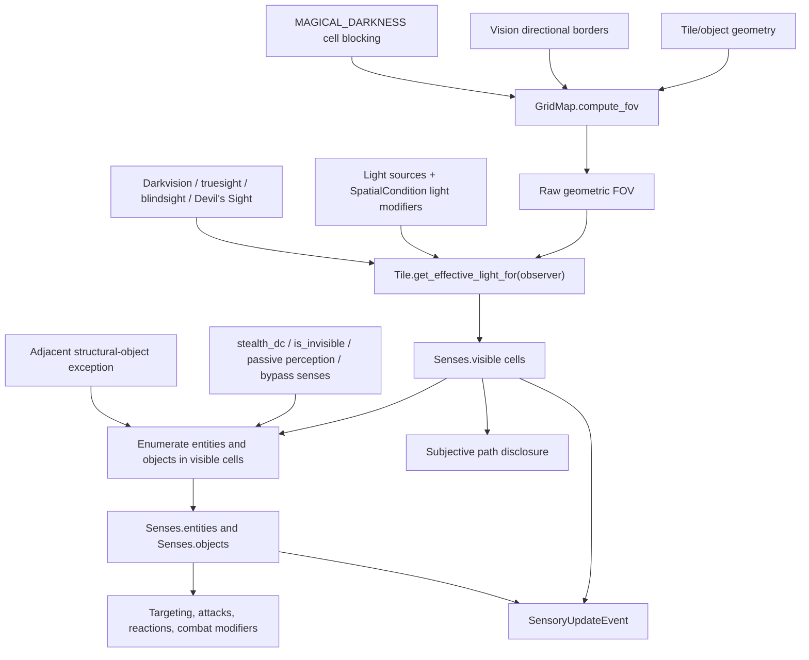

# Current DND Visibility, Lighting, and Perception System

**Date:** 2026-08-18  
**Scope:** Current active `dnd/` implementation only  
**Repository HEAD at study time:** `1a918b620f53`  
**Status:** Current-state documentation; not a refactor design  
**Independent review:** APPROVED by one independent code reviewer; exact final hash recorded in the task handoff

## 1. Purpose and boundaries

This document records how visibility, lighting, perceivability, directional walls, darkness, invisibility, and related movement knowledge actually work in the active Python engine.

It deliberately separates:

1. **objective world geometry** — Tiles, objects, directional borders, light sources, and SpatialConditions;
2. **observer-specific perception** — geometric field of view, effective light, special senses, stealth, and invisibility;
3. **materialized knowledge** — the `Senses` block and `SensoryUpdateEvent` deltas used by gameplay and projection;
4. **descriptions or apparent intent** from behavior that is truly implemented.

It does not propose a replacement architecture. The final sections identify contradictions and missing contracts that must be settled before the Tile/world-item migration can safely change visibility or lighting.

## 2. Executive summary

The engine does not have one visibility system. It has several partially composed systems:

- `Tile.visible` means **light/vision may pass through this cell**. It does not mean that an observer sees the Tile.
- `GridMap.compute_fov()` computes **geometric vision reach** through cells and directional vision borders.
- `Tile.resolved_light_level` is objective lighting after illumination and obscurement modifiers.
- `Tile.get_effective_light_for()` interprets that light for one observer and their special senses.
- `Entity._filter_visible_positions_by_light()` converts geometric FOV into the observer's `Senses.visible` cells.
- `BaseBlock.is_perceivable_by()` separately removes hidden or invisible entities and objects.
- `Senses.entities` and `Senses.objects` are gameplay-authoritative perceived contacts, not merely renderer caches.
- `SensoryUpdateEvent` emits observer-specific deltas for replay/projection.

Four directional edge channels exist and are correctly distinct in vocabulary:

- movement;
- vision;
- light;
- physical/AoE propagation.

However, scalar cell blocking collapses the channels again:

- `BaseBlock` has `blocks_vision()` but no scalar `blocks_light()` or `blocks_propagation()`;
- light FOV uses the same scalar `GridMap.is_blocking()` as vision;
- propagation uses `Tile.visible` and object `blocks_vision()` as its scalar blockers.

The largest confirmed problems are:

1. **Tile/surface visibility, content visibility, and boundary-object visibility are not represented as separate decisions.** A visible cell currently exposes all perceivable entities and ordinary objects in that cell.
2. **The directional-wall hotswap added an adjacent-object exception for doors.** It exposes flagged objects in any of the eight neighboring cells without checking the relevant boundary, observer side, intervening blockers, or light.
3. **`visual_access` is modified by Blinded and Unconscious but is not consulted by the main FOV/light/contact computation.** Recomputing senses after sight denial therefore does not itself clear visible cells or contacts.
4. **Special-sense range is applied to subjective light but not to the coarse booleans used by FOV and invisibility.** Truesight, Devil's Sight, blindsight, tremorsense, and See Invisible can bypass some mechanics beyond their authored range.
5. **Ordinary obscuring SpatialConditions are encoded as darker Tile light, not optical opacity.** Fog Cloud, Stinking Cloud, Sleet Storm, and Incendiary Cloud do not block sight through the zone as their descriptions state; darkvision can shift their `DARKNESS` back to `DIM_LIGHT`.
6. **`Senses.walkable` is only base Tile-cost walkability.** It does not include objects, entities, SpatialConditions, hazards, or observer-specific hidden blockers, even though richer subjective paths exist beside it.
7. **Current test health does not establish these contracts.** One edge/elevation module is collection-blocked by the deleted server, and the first focused darkness test currently fails in-process.

## 3. Vocabulary: what current names really mean

| Current name | Stored by | Actual current meaning | What it does **not** mean |
|---|---|---|---|
| `Tile.walkable` | `Tile` | Legacy scalar copied into events/serialization | Whether walking is mechanically allowed; `walking_cost` decides that |
| `Tile.visible` | `Tile` | The cell is optically/permeably open for ordinary scalar vision | Whether this Tile is visible to an observer |
| `Tile.default_light` | `Tile` | Objective authored base light | Observer-effective light |
| `Tile.resolved_light_level` | derived from Tile maps | Brightest illumination clamped by darkest obscurement | Whether an observer sees the Tile or its contents |
| `Senses.visible` | observer's `Senses` | Cells surviving geometric FOV and effective-light filtering | A separate permission for every content or boundary layer |
| `Senses.entities` | observer's `Senses` | Live perceived entity contacts | Every entity in geometric FOV |
| `Senses.objects` | observer's `Senses` | Live perceived object contacts plus the adjacent-door exception | Every placed object or every visible boundary |
| `Senses.seen` | observer's `Senses` | Cells historically visible at least once | Present visibility |
| `BaseBlock.stealth_dc` | entity/object/condition | Observer must have passive perception strictly greater than the DC | Optical cell opacity |
| `BaseBlock.is_invisible` | entity/object/condition | Contact is excluded unless observer has a bypass sense | Darkness, cover, or cell opacity |
| vision edge | Tile + placed block projection | Whether sight crosses a particular side | Whether light or an AoE crosses that side |
| light edge | Tile + placed block projection | Whether light geometry crosses a particular side | Whether an observer sees the endpoint |
| propagation edge | Tile + placed block projection | Whether physical/AoE propagation crosses a side | Whether sight or light crosses it |

The dependency-neutral light order in `dnd/types/world.py` is:

```text
MAGICAL_DARKNESS (0)
DARKNESS         (1)
DIM_LIGHT        (2)
BRIGHT_LIGHT     (3)
VERY_BRIGHT      (4)
```

The active special senses in `dnd/types/senses.py` are `BLINDSIGHT`, `DARKVISION`, `TREMORSENSE`, `TRUESIGHT`, `DEVILS_SIGHT`, and `SEE_INVISIBLE`. A range of zero means unlimited.

## 4. Active file and dependency map

Arrows show direct architectural direction, not every imported symbol. `[→]` lists important dependencies; `[←]` lists principal consumers.

| File | Dependency direction | Visibility/lighting responsibility |
|---|---|---|
| `dnd/types/world.py` | `[→]` no `dnd` imports; `[←]` Tile, GridMap, events, items, spells | Leaf enums for movement modes, light levels, cardinal directions, and four edge channels |
| `dnd/types/senses.py` | `[→]` no `dnd` imports; `[←]` BaseBlock, Tile, Senses, Entity, world events | Leaf Pydantic sense values and the narrow observer protocol |
| `dnd/core/shadowcast.py` | `[→]` stdlib only; `[←]` GridMap | Symmetric shadowcasting primitive; has no engine knowledge |
| `dnd/core/base_block.py` | `[→]` values, conditions, event registry/world events, leaf types; `[←]` Tile, Entity, items, GridMap, conditions | Neutral blocking, directional-channel, stealth/invisibility, special-sense, and attached-light capabilities |
| `dnd/blocks/base_item.py` | `[→]` BaseBlock, GridMap, item/world types, item/spatial/action events, health/actions, remaining behavior identity; `[←]` concrete items and content builders | Object scalar and directional blockers, Senses inclusion flags, floor placement hooks, object-state publication |
| `dnd/core/base_tiles.py` | `[→]` BaseBlock, conditions, values/modifiers, world/sense/spatial types, geometry, world events; `[←]` GridMap, Senses, authored terrain, spells | Tile movement values, scalar opacity, directional borders, objective light maps, subjective light transformation, Tile condition access |
| `dnd/core/gridmap.py` | `[→]` geometry, shadowcast, pathfinding, BaseBlock/Condition, Tile, events, world edges/connectors; `[←]` Entity, Senses, items, SpatialConditions, AoE, actions | Objective indexes; cell and edge queries; FOV; paths; light sources; light propagation; caches and revisions |
| `dnd/core/world_edges.py` | `[→]` leaf world/item types; `[←]` Tile, GridMap, events, battlefield builders | Pydantic edge identity/contribution and elevation-surface values used by objective topology |
| `dnd/core/events/world_events.py` | `[→]` event registry, combat log, item/edge/connector values, leaf types, remaining content identity; `[←]` GridMap, Senses, SpatialConditions, content/projection | Objective world, spatial, light, SpatialCondition, and subjective sensory event schemas |
| `dnd/blocks/sensory.py` | `[→]` BaseBlock, Tile, GridMap, values, events, sense/world types, combat log; `[←]` Entity and gameplay consumers | Per-observer materialized knowledge; incremental callback; sensory event deltas |
| `dnd/entities/entity.py` | `[→]` many blocks/core systems including Senses, GridMap, events, transforms; `[←]` actions, conditions, spells, encounter, content | Full senses computation; perceivable contact materialization; special-sense capabilities; movement refresh |
| `dnd/entities/creature_transforms.py` | `[→]` creature blocks, modifiers, values, leaf types; `[←]` conditions and Entity | Source-owned transforms including the `visual_access` denial modifier |
| `dnd/spatial/area_conditions.py` | `[→]` BaseCondition/Block, GridMap, events, modifiers, AoE, Entity, spatial types, remaining content values; `[←]` environmental conditions and spells | Independently owned area mechanics, Tile light modifiers, terrain costs, attached zones, spatial facts |
| `dnd/spatial/environmental_conditions.py` | `[→]` area conditions, memberships, conditions, Entity, GridMap, events; `[←]` content/items/spells | Concrete Wet/Steam/Fire and other environment mechanics |
| `dnd/spells/conjuration.py` | `[→]` actions/conditions/events, GridMap/Entity, spatial materialization/conditions, remaining spell content machinery; `[←]` spell builders/catalog/action discovery | Fog, magical Darkness, Daylight, cloud/storm/plague area conditions and concentration linkage |
| `dnd/spells/evocation.py` | `[→]` actions/conditions/events, GridMap/Entity, spatial conditions, remaining spell content machinery; `[←]` spell builders/catalog/action discovery | Entity-anchored Light and object-anchored Continual Flame light-source lifecycles |
| `dnd/spells/divination.py` | `[→]` actions/conditions/events, Entity, sense types, remaining spell content machinery; `[←]` spell builders/catalog/action discovery | See Invisibility's source-owned `SEE_INVISIBLE` grant |
| `dnd/spells/transmutation.py` | `[→]` actions/conditions/events, Entity, sense types, remaining spell content machinery; `[←]` spell builders/catalog/action discovery | Darkvision spell's source-owned finite-range sense grant |
| `dnd/conditions.py` | `[→]` BaseCondition, Entity, transforms, Senses types, GridMap/events, modifiers, remaining behavior registration; `[←]` actions, spells, content | Blinded, Hidden, Invisible, concentration, and related entity rules |
| `dnd/items/environment.py` | `[→]` BaseItem, actions/events, BaseBlock, GridMap, edge/item types; `[←]` builders/scenarios | Directional wall and directional door objects |
| `dnd/items/environment_interactables.py` | `[→]` actions, GridMap, BaseItem, conditions, environmental conditions, Entity; `[←]` builders/scenarios | Older scalar door and environment interactables |
| `dnd/items/torches.py` | `[→]` BaseItem, actions/events, GridMap, Entity, remaining content machinery; `[←]` builders/scenarios | Portable and wall-torch light-source lifecycle |
| `dnd/content/items/environment_item_builders.py` | `[→]` concrete environment items, actions, spells, world types; `[←]` maps/scenario builders/tests | Active direct construction of directional walls, doors, torches, barrels, and environment objects |
| `dnd/maps/arena_layout.py` | `[→]` GridMap, Tile factories, environment builders/items, spike materialization; `[←]` battlefield builders/scenarios | Active authored arena layout using directional structures |
| `dnd/content/scenarios/battlefield_builders.py` | `[→]` GridMap/events, world edges/connectors, battlefield definitions, item builders, arena layout; `[←]` scenario assembly/tests | Active map bootstrap and structure/object placement path |
| `dnd/spells/abjuration.py` | `[→]` Entity/GridMap, conditions/transforms/events, spatial conditions, actions/spells; `[←]` spell builders/catalog | Banishment directly touches both Entity and GridMap occupancy stores |
| `dnd/runtime_reset.py` | `[→]` Entity, GridMap, registries/events/encounter; `[←]` test/runtime reset callers | Clears both occupancy/index families and spatial runtime state |
| `dnd/content/monsters/monster_builders.py` | `[→]` entity creation/progression, monster definitions/traits, blocks, senses types; `[←]` scenario/test monster creation | Applies authored senses and the currently broken `darkvision` override |
| `dnd/core/aoe.py` | `[→]` geometry, GridMap, presentation geometry, Senses; `[←]` actions, spells, Entity | AoE footprints and propagation filtering; consumes the propagation channel |

Important direction: `GridMap` knows only neutral `BaseBlock`/`BaseCondition` capabilities. Concrete SpatialConditions may import `Entity` and `GridMap`; `GridMap` does not import their concrete types. That keeps core spatial queries below authored condition mechanics, although the high-level `area_conditions.py -> Entity -> Senses -> GridMap` chain makes the overall perception surface broad.

## 5. Authority and derived-state ledger

| Fact | Current authority | Derived copies/indexes | Event representation |
|---|---|---|---|
| Tile existence/position | `GridMap._tiles` | Tile UUID reverse index; Tile `position` | `WorldInitializedEvent`, Tile spatial events |
| Entity occupancy | Entity `position` + `Entity._entity_by_position`, and separately GridMap `_entity_positions/_entities_by_position` | two independently queried position indexes | entity-entered/left spatial events |
| Intrinsic scalar opacity | `Tile.visible`; object `blocks_vision()` | FOV/blocking caches | `WorldTileState.visible`; object state/spatial hints |
| Intrinsic movement | Tile movement `ModifiableValue`s | path cache; `Senses.walkable` | four resolved costs plus legacy `walkable` |
| Intrinsic edge openness | Tile's 16 channel/direction fields | transition caches | `WorldTileState.*_open` |
| Placed edge blocking | live object/entity directional capabilities | 16 object-derived Tile border booleans | directional fields on `SpatialChangeEvent`; item structure state |
| Objective Tile light | `default_light`, `_illuminations`, `_obscurements` | `resolved_light_level` | default/resolved light in world state; spatial light events |
| Runtime light source | `GridMap._light_sources` | source-owned `affected_tiles`; Tile illumination entries; anchor UUID set | batched `SpatialChangeEvent.light_changed` |
| Spatial area footprint | GridMap SpatialCondition footprint/indexes | Tile UUID references | `SpatialEffectChangeEvent` current/previous footprints |
| Observer geometric reach | `GridMap.compute_fov()` result/cache | raw cell subscriptions | not directly a standalone event fact |
| Observer visible cells | `Senses.visible` | visibility cache | `SensoryUpdateEvent.visible_cells_*` |
| Observer contacts | `Senses.entities` / `.objects` | reverse observer indexes in `SpatialSensesSystem` | `SensoryUpdateEvent.visible_*` |
| Hidden/invisible state | target `stealth_dc` / `is_invisible` | contact membership in each observer's Senses | condition events + perceivability spatial event + sensory delta |
| Observer explored cells | `Senses.seen` | none | `SensoryUpdateEvent.seen_cells_added` |

## 6. End-to-end perception pipeline



The normal full refresh is:

1. `Entity.compute_senses_from_position()` asks `GridMap.compute_fov()` for geometric cells.
2. `_filter_visible_positions_by_light()` removes cells whose observer-effective light is `DARKNESS` or `MAGICAL_DARKNESS`.
3. subjective paths are computed separately, including entities, objects, SpatialConditions, hazards, remembered collisions, and directional borders;
4. only destinations in `Senses.visible`, with path steps currently visible or previously `seen`, are disclosed;
5. entities and objects in the light-filtered cells are checked with `is_perceivable_by()`;
6. adjacent specially flagged objects are inserted even if their cell failed visibility;
7. `Senses` is replaced and the observer subscribes to every raw geometric-FOV cell, including dark cells, so later light changes can reveal them incrementally.

The movement-time refresh repeats visibility/contact work without recomputing paths, then the full refresh occurs at movement settlement.

There is a current occupancy split inside this pipeline. The full calculation enumerates entities through `Entity.get_all_entities_at_position()`, backed by `Entity._entity_by_position`. The movement-time and incremental callbacks enumerate through `GridMap.get_entities_at()`, backed by GridMap's separate position indexes. Those indexes are normally updated together by Entity movement, but Banishment and reset paths still touch them directly. If they diverge, a full senses refresh and an incremental refresh can produce different entity contacts for the same cell.

## 7. Tile mechanics

### 7.1 Movement

Each Tile has four `ModifiableValue` costs:

- walking: default 1;
- flying: default 1;
- swimming: default 0 with a `No Water` maximum constraint;
- burrowing: default 0 with a `No Earth` maximum constraint.

`Tile.blocks_walking()` returns true when the selected cost is at most zero. `GridMap.is_walkable()` delegates to that method. It does not use `Tile.walkable`.

The legacy `walkable` flag remains serialized and copied into some events. The active test `test_eb_11_010_walkability_is_cost_driven_not_the_legacy_flag` explicitly demonstrates that setting it false does not make the Tile mechanically impassable when walking cost remains positive.

### 7.2 Scalar opacity

`Tile.blocks_vision(observer_uuid)` currently has only two blocking rules:

1. `visible == False` blocks everyone;
2. resolved `MAGICAL_DARKNESS` blocks observers lacking the coarse `can_pierce_magical_darkness()` capability.

Ordinary `DARKNESS` and `DIM_LIGHT` do not make the Tile geometrically opaque. They are handled later by observer-specific light filtering.

### 7.3 Directional borders

The Tile stores four intrinsic side booleans for each of four channels: 16 intrinsic values. It also stores the same 16 fields as object-derived cache/projection values.

`GridMap.recompute_tile_directional_blocking()`:

1. clears all object-derived border values at a position;
2. scans every placed object and entity at that position;
3. calls the neutral directional methods on each block;
4. writes the objective union back into the Tile's derived border fields;
5. bumps only the revisions for channels whose result changed.

Subjective **movement** cannot blindly use this objective union because doing so would reveal hidden/invisible blockers. Its path queries set `subjective=True` and rederive directional contributions from live blocks perceivable to the requester.

Sight does not currently do the same. Directional FOV calls `can_see_transition()` with its default `subjective=False`, and scalar `GridMap.is_blocking()` also ignores blocker perceivability. `get_subjective_directional_block_map()` exists but has no active caller. A hidden or invisible wall-like blocker can therefore alter an observer's FOV and leak its presence even when it is absent from that observer's contacts.

### 7.4 Tile-owned conditions

A Tile can have:

- ordinary direct `BaseCondition` children inherited through `BaseBlock`;
- UUID references to independently owned `SpatialCondition`s grouped by spatial layer.

`Tile.get_conditions()` merges both collections and rejects stale/inactive SpatialCondition references. Thus a Tile can answer “which rules conditions affect me,” including Wet/Fire/etc., while GridMap remains the owner of a multi-cell condition and its footprint.

### 7.5 Lighting

The objective light resolver is:

1. start with `default_light`;
2. take the brightest level among all illumination sources;
3. if any obscurement exists, take the darkest obscurement;
4. clamp the bright result down to that darkest obscurement.

Illumination and obscurement entries are source-owned by UUID, which lets overlapping effects remove only their own contribution.

This is a light-level composition model. It is not a generic optical density, cover, smoke-transmission, or surface/content visibility model.

## 8. Cell blockers and edge blockers are only partly independent

The four edge channels are separate, but scalar cells are not:

| Query | Scalar Tile rule | Scalar object rule | Directional edge rule |
|---|---|---|---|
| movement | selected movement cost | `blocks_walking()` | movement channel |
| vision | `Tile.blocks_vision(observer)` | `blocks_vision(observer)` | vision channel |
| light | same `GridMap.is_blocking()` used by vision | same `blocks_vision()` | light channel |
| propagation | `not Tile.visible` | `blocks_vision()` | propagation channel |

Therefore an object can author different **edge** behavior for vision, light, and propagation, but it cannot currently author different **cell-volume** behavior for those channels. The older scalar closed door blocks all three because its `blocks_vision_field` feeds the shared cell hook. Magical darkness is excluded from physical propagation only because `is_blocking_propagation()` directly reads `Tile.visible` instead of calling `Tile.blocks_vision()`.

## 9. Field of view

### 9.1 Non-directional maps

When no objective vision-edge blocker exists anywhere, `GridMap.compute_fov()` uses symmetric shadowcasting from `dnd/core/shadowcast.py`.

The shadowcast reveals an opaque endpoint cell and stops cells behind it. That is suitable for “see the wall surface but not beyond.” However, the later contact enumerator treats a light-filtered visible cell as permission to inspect all contents in that cell. There is no second distinction between seeing the opaque surface and seeing center contents.

The primitive calls `mark_visible()` for blocking coordinates even when those coordinates have no Tile. The entity's light filter later drops missing Tiles, but GridMap caches and observer raw-cell subscriptions can still include those off-map coordinates. Directional FOV does not have this behavior because it iterates existing Tiles only.

### 9.2 Maps with any directional vision blocker

When `_has_directional_blockers("vision")` is true, GridMap abandons shadowcasting for a transition-aware line test:

- enumerate existing Tiles within radius;
- compute a supercover line from origin to each candidate;
- require every crossed directional transition to allow vision;
- reject blocking intermediate cells;
- allow the blocking endpoint itself to be returned.

This is materially more expensive than one shadowcast but lets a wall occupy one boundary instead of a whole cell.

Diagonal transitions require at least one valid cardinal bridge route and check both sides of every crossed edge. This logic was strengthened by commit `ef19cb9` (`fixed diagona leaks`) after the initial directional-wall patch.

### 9.3 Cache signature

The FOV cache key contains:

- origin;
- radius;
- a single boolean indicating whether the observer can pierce magical darkness;
- vision revision.

It does not contain sense type or range. Because `Entity.can_pierce_magical_darkness()` is also a range-free boolean, a finite Truesight or Devil's Sight grant affects geometric magical-darkness FOV as though it were unlimited.

## 10. Lighting system

### 10.1 Runtime light sources

`GridMap` owns `LightSourceData` Pydantic models. Each stores:

- source UUID;
- position;
- very-bright, bright, and dim radii;
- optional anchor UUID;
- exact affected-Tile light levels;
- active state.

Adding or moving a source computes light reach through `compute_light_fov()`, then applies source-owned illumination UUID entries to affected Tiles. Movement computes an old/new delta and touches only changed Tiles.

Attached lights are also registered on the anchor `BaseBlock`. A GridMap completion callback listens to entity-entered events and moves attached sources with their entity. Independent suppression tokens can temporarily turn all of a block's attached lights off without destroying them; the last token removed restores them.

Active producers include portable/wall torches, the entity-anchored Light condition, the object-anchored Continual Flame SpatialCondition, ordinary GridMap light-source callers, and SpatialConditions such as Fire Surface and Daylight. Entity death adds a source-specific suppression token for all lights attached to that entity; revival removes it. This preserves the light-source identities while the dead anchor is dark.

### 10.2 Light geometry

Light uses its own directional edge channel. If vision and light directional topology are equivalent, `compute_light_fov()` reuses ordinary FOV. Otherwise it uses directional line tests with the light channel.

Scalar light blocking still calls `GridMap.is_blocking()`, which is the scalar vision query. There is no independent scalar light-transmission capability.

### 10.3 Light events and invalidation

GridMap light sources and `AreaCondition` light changes are batched:

- per-Tile modifiers are changed without publishing individual events;
- one `SpatialChangeEvent.light_changed` is published at a representative position;
- `senses_hint.light_changed_positions` and `light_level_map` carry the complete changed set;
- normal illumination changes increment the light revision and cause local observer refiltering;
- transitions to or from magical darkness also bump vision/light geometry and request FOV recomputation.

This is one of the cleaner parts of the current system: the event is representative only in its scalar `position`; its structured payload preserves the whole batch.

The public Tile mutation methods are a separate, weaker path. `Tile.add_illumination()`, `add_obscurement()`, and `remove_light_modifier()` can publish a one-cell light event directly through `_notify_light_changed()`. That event has a local changed-position hint, but the path does not bump GridMap's light/vision revisions and does not request FOV recomputation for a magical-darkness transition. If FOV was cached before direct magical darkness is added, the revision and cache can remain unchanged and cells behind the new darkness can remain geometrically visible. The batched GridMap/SpatialCondition path and direct Tile path therefore do not currently provide the same invalidation guarantee.

## 11. Observer-effective light and special senses

`Tile.get_effective_light_for(observer, observer_position)` applies current senses in this order:

1. Truesight or blindsight in range upgrades the Tile to at least `BRIGHT_LIGHT`.
2. Devil's Sight in range upgrades `DARKNESS` or `MAGICAL_DARKNESS` to `BRIGHT_LIGHT`.
3. Darkvision in range shifts `DARKNESS -> DIM_LIGHT` or `DIM_LIGHT -> BRIGHT_LIGHT`.
4. The origin cell and all eight neighboring cells in natural `DARKNESS` receive a minimum of `DIM_LIGHT`; the implementation checks Chebyshev distance `<= 1` without excluding zero distance.

Tremorsense and See Invisible do not affect Tile light.

The result is used to retain only cells strictly brighter than `DARKNESS`. Thus ordinary observers do not retain `DARKNESS` cells, while darkvision retains them as `DIM_LIGHT`.

The current modalities do not remain cleanly separated:

- blindsight changes a Tile's effective light to bright, so a nonvisual sense effectively exposes the Tile's visual cell representation;
- tremorsense can bypass target invisibility, but only after the target's cell survives ordinary geometric and light filtering;
- See Invisible likewise bypasses the contact flag but does not help a dark cell enter `Senses.visible`;
- Truesight and Devil's Sight range is respected by effective light but ignored by magical-darkness FOV geometry;
- all invisibility-bypass senses are treated as range-free by `Entity.can_bypass_invisibility()`.

`Senses.visible` is therefore a visual-looking cell map, while `Senses.entities` is partly a generic perceived-contact map. The engine does not expose a modality on each contact saying whether it was seen, heard, felt through tremorsense, or detected by blindsight.

## 12. Entity `Senses` is a gameplay subsystem

The `Senses` Pydantic block owns:

- `visual_access: ModifiableValue`;
- visible entity and object maps;
- visible and previously seen cells;
- base Tile walkability map;
- subjective paths and path costs;
- safe paths and costs;
- innate and source-owned special senses;
- learned hidden collision cells and directions;
- dirty/revision/cache state.

This state is used by much more than rendering:

- action and object-action discovery;
- attack legality and unseen-attacker/target modifiers;
- spell targeting and AoE preview;
- reactions and threatened-position logic;
- encounter participant knowledge;
- safe and subjective movement previews;
- observer-scoped combat log identity.

The subjective paths are richer than `Senses.walkable`:

- they incorporate Tile costs;
- entity and object occupancy;
- SpatialCondition blocking;
- hazards when safe paths are requested;
- directional edges;
- elevation;
- imperceivable blockers omitted until collision teaches the observer.

By contrast, `Senses.walkable[position]` is only `GridMap.is_walkable()`, hence only the Tile's selected movement cost. Calling it “walkable” beside the richer path graph is an existing semantic overlap.

## 13. Visual access, Blinded, and Unconscious

`visual_access` is a normal `ModifiableValue` with base value 1. `apply_visual_denial_transform()` installs a source-owned maximum constraint of zero. Blinded uses this transform; Unconscious includes the same visual denial through its compound creature transform.

The current senses callback notices changes to `visual_access`, snapshots them, triggers a visibility recomputation, and dirties paths.

But the recomputation itself does not read `visual_access`:

- `GridMap.compute_fov()` does not receive it;
- `_filter_visible_positions_by_light()` does not consult it;
- contact enumeration does not consult it;
- `has_ordinary_sight` is also absent from this path.

The only general method that reads both is `Entity.can_see_visual_effects()`, which returns false at visual access zero and otherwise accepts ordinary sight or Truesight. Repository search finds that method used by an illusion spell path, not by core FOV/contact production.

`SensoryUpdateEvent` does not carry `visual_access`. The delta builder can emit an event because visual access changed even when no cells or contacts changed, but the resulting payload has no field explaining the new access state.

Current consequence: Blinded's combat modifiers are installed, but the main Senses representation can remain visually populated.

## 14. Hidden, invisibility, and perceivability

### 14.1 Base perceivability and active overrides

Every `BaseBlock` has runtime `stealth_dc` and `is_invisible` flags. The **base implementation** of `is_perceivable_by(observer)` means:

1. no observer or unknown observer: perceivable;
2. invisible: imperceivable unless observer has a bypass sense;
3. hidden: imperceivable when `stealth_dc >= passive_perception`;
4. otherwise perceivable.

The comparison means passive perception must be strictly greater than the stored stealth DC.

There are active polymorphic exceptions:

- `Entity.is_perceivable_by()` first rejects dead entities, then delegates to the base rule;
- `SpatialCondition.is_perceivable_by()` ignores the inherited `is_invisible` and `stealth_dc` fields and instead compares its separate `condition_stealth_dc` to passive perception.

Changing the base flags publishes `SPATIAL_PERCEIVABILITY_CHANGED`, but the event and hint are entity-shaped: the UUID is stored as `entity_uuid`/`perceivability_entity`, and the callback invokes `_recheck_entity_perceivability()`, which mutates only `Senses.entities`. This works for entity flag changes. A placed object's `set_invisible()` or `set_stealth_dc()` does not correctly remove/reinsert it in `Senses.objects`; a live reproduction left the object contact stale across both transitions.

### 14.2 Hidden

`Hidden` stores the rolled stealth result, writes it to `stealth_dc`, and grants unseen-attacker advantage. Its handler removes Hidden after:

- an attack;
- taking damage;
- a full-turn-denial condition;
- a spell or revealing action;
- entering or remaining in `VERY_BRIGHT` light when the relevant spatial/light event arrives;
- collision while hidden.

A whitelist preserves Hidden for actions such as Dash, Dodge, Disengage, Hide, stance changes, and door/torch interaction. The handler reads the complete batched light-position hint rather than only the representative event position.

Subjective pathfinding omits imperceivable blockers. If movement collides with one, the observer stores a learned collision cell/direction and recomputes future paths without globally revealing the blocker.

### 14.3 Invisible conditions

There are three active implementations with the same perceived name:

- core `Invisible`: sets the flag and combat modifiers until removed;
- `InvisibilityEffect`: additionally breaks on attacks, spell casts, or revealing actions;
- `GreaterInvisibilityEffect`: retains invisibility through escalating stealth checks after revealing actions.

All use the single target boolean and the default condition name `"Invisible"`. Removal unconditionally clears that boolean. Multiple independently owned invisibility sources are therefore not reference-counted at this flag level; removing one can clear the state while another same-name/source condition conceptually remains.

The ordinary repeated-application path is already broken without simultaneous distinct sources. These conditions inherit `REPLACE_EXISTING`, but `BaseBlock` applies the incoming condition before removing the incumbent. The incoming application sets `is_invisible=True`; incumbent removal then sets it false; the new condition remains registered and applied while the Entity is objectively not invisible. `Hidden` has the analogous ordering failure: the incoming application writes the new stealth result, then incumbent removal clears `stealth_dc`.

Unseen attack/defense modifiers ask whether the other entity UUID is present in the relevant observer's `Senses.entities`. Any upstream Senses error directly changes combat advantage/disadvantage.

## 15. SpatialConditions, darkness, and obscuring zones

`AreaCondition` has two light fields:

- `sets_light_level`;
- `light_is_obscurement`.

It adds a unique light-modifier UUID to every Tile in its GridMap-owned footprint. Removal deletes only those UUIDs. Magical-darkness changes request full FOV recomputation; other level changes use local light refiltering.

Current examples:

| SpatialCondition | Light contribution | Actual geometric effect |
|---|---|---|
| Steam Cloud | `DIM_LIGHT` obscurement | does not block FOV geometry; cell remains visible because DIM is above darkness |
| Fire Surface | `BRIGHT_LIGHT` illumination | brightens footprint |
| Web | `DIM_LIGHT` obscurement | does not block FOV geometry |
| Fog Cloud | `DARKNESS` obscurement | removes cells for ordinary vision, but does not block sight geometry through the zone |
| Darkness | `MAGICAL_DARKNESS` obscurement | Tile becomes a geometric vision blocker unless observer has coarse pierce capability |
| Daylight | `VERY_BRIGHT` illumination | brightens and explicitly removes overlapping Darkness zones |
| Insect Plague | `DIM_LIGHT` obscurement | does not block FOV geometry |
| Incendiary Cloud | `DARKNESS` obscurement | light-filters its cells but does not block geometry through them |
| Stinking Cloud | `DARKNESS` obscurement | light-filters its cells but does not block geometry through them |
| Sleet Storm | `DARKNESS` obscurement | light-filters its cells but does not block geometry through them |

This produces a concrete mismatch between descriptions and mechanics. For example, Fog Cloud's field says it “blocks sight through its light level,” but ordinary `DARKNESS` is not checked by `Tile.blocks_vision()`. A bright target behind the fog can remain geometrically reachable, and darkvision shifts fog's darkness to dim light.

The recovered SpatialCondition system itself is now a legitimate owner of footprint, activation, handlers, Tile membership, and light/terrain mechanics. The gap is not that Tile cannot discover active conditions; `Tile.get_conditions()` can. The gap is that current optical blocking semantics are encoded almost entirely as light levels and the one special case for magical darkness.

### 15.1 Concentration ownership

Concentration-based spatial spells do not require the caster or spell action to poll their zone. After materializing and activating the SpatialCondition, the spell obtains the caster's `Concentrating` condition and records `(zone.uuid, zone.uuid)` as a linked condition in the active concentration slot. Removing the slot or the whole Concentrating condition resolves the linked UUID as an independently owned `BaseCondition` and calls `remove_from_runtime_owner()`, which deactivates the SpatialCondition and removes its footprint, handlers, memberships, terrain/light modifiers, and lifecycle identity through the ordinary condition path.

Fog Cloud, Darkness, Web, Insect Plague, Incendiary Cloud, Stinking Cloud, and Sleet Storm use this general pattern. Daylight has its own duration and is not concentration-bound. If a spatial zone retires independently, `unlink_runtime_child()` removes the stale link and deletes an empty concentration slot.

## 16. Walls and doors: three simultaneous representations

### 16.1 Legacy opaque wall Tile

`wall_factory()` creates a full cell with:

- walking cost forced to zero;
- flying cost forced to zero;
- `visible=False`.

This represents a wall as an opaque, impassable cell without separate boundary identity.

### 16.2 Scalar center door

`DoorObject` in `dnd/items/environment_interactables.py` is an older `UsableItem`. Closed state sets:

- `blocks_movement=True`;
- `blocks_vision_field=True`.

Opening clears both. Because scalar vision is reused by light and propagation, this center object blocks all three scalar fields when closed.

### 16.3 Directional wall and door

`DirectionalWall` and `DirectionalDoor` in `dnd/items/environment.py` keep scalar movement/vision false and author one or more directional sides across selected channels.

Defaults:

- Directional Wall blocks all four channels in all four directions, is absent from `Senses.objects`, and offers no object actions.
- Directional Door blocks all four channels in authored directions while closed, is included in Senses and action discovery, and opens/closes by updating the edge projections.

Current builders/scenarios use these directional structures, while the legacy Tile and scalar door paths remain active.

## 17. The directional-wall patch and its visibility workaround

Commit `ab6c6a1` introduced the four edge channels, directional wall/door objects, transition-aware FOV/raycast, and object-derived Tile border caches. The channel separation and edge topology are real capabilities.

Commit `09a9b89` then hotswapped the arena and added:

- `BaseItem.include_in_adjacent_senses_objects`;
- `BaseBlock.should_include_in_adjacent_senses_objects()`;
- `Entity._add_adjacent_senses_objects()`;
- matching incremental-callback logic;
- `DirectionalDoor` defaulting that flag to true.

The reason is visible in the helper's own description: an interactable structural object can block sight into the same cell that stores it, causing the object itself to disappear from action discovery.

The workaround scans all eight neighboring cells and inserts every flagged, perceivable object without checking:

- which boundary the object represents;
- whether the observer is on that side;
- whether another boundary lies between observer and object;
- whether the object's cell is lit;
- whether only the boundary surface, rather than the cell center, should be revealed.

Directional walls avoid this by being deliberately excluded from `Senses.objects`; doors are deliberately included. Current behavior can therefore interact with a neighboring door through this exception while receiving no sensed wall object at all.

This confirms the user's distinction: **seeing a Tile/support surface, seeing center contents, and seeing a wall/door boundary are different facts.** The current system has only visible cells plus visible object UUIDs, and the producer resolves the boundary gap with a broad adjacency exception.

## 18. Events and observer updates

### 18.1 Objective events

`WorldInitializedEvent` carries objective initial map facts:

- every `WorldTileState`, including legacy walkable/visible, resolved costs, elevation, default/resolved light, and four open-direction tuples;
- initial objects and their item state;
- traversal connectors.

`SpatialChangeEvent` carries runtime occupancy, Tile, perceivability, light, object, and directional changes. `SensesUpdateHint` separates:

- full-FOV invalidation;
- path invalidation;
- local entity/object insertion/removal;
- a complete set of changed light positions;
- a perceivability target;
- changed directional positions, neighbors, and channels;
- light and propagation recomputation.

`SpatialEffectChangeEvent` carries exact prior and resulting SpatialCondition footprints. Its affected-position query includes both.

### 18.2 Subjective events

`SensoryUpdateEvent` is already structured to keep several observer facts distinct:

- visible cell additions/removals;
- explored cell additions;
- visible entity additions/removals/moves;
- visible object additions/removals/moves;
- effective light levels for currently visible cells;
- sense-mode changes;
- path-dirty state.

This is the correct event-stream boundary for subjective perception. The current problem is principally the producer's semantics, not the absence of separate event fields for cells/entities/objects.

The event does not carry:

- visual access;
- perception modality;
- separate surface/content/boundary visibility;
- why a particular contact is visible.

### 18.3 Incremental observer system

`SpatialSensesSystem` is registered before causal parent completion and keeps reverse indexes for observers by subscribed cells and perceived entity/object UUIDs. It selects only candidate observers affected by an event.

The observer callback can:

- recompute FOV when geometry changes;
- recompute or dirty paths when movement topology changes;
- refilter only changed light cells;
- insert/remove one entity or object in constant time;
- recheck one changed entity stealth/invisibility target; object flag changes are incorrectly routed through this entity-only path;
- update special-sense or passive-perception state.

Because observers subscribe to raw geometric FOV rather than only lit cells, a dark cell can be revealed later by a local light event without polling the entire map.

## 19. Cache and invalidation map

`GridMap` separates revisions for movement, vision, light state, light geometry, propagation, and occupancy. Important caches include:

- FOV;
- propagation FOV/filtering;
- pathfinding;
- barrier positions;
- directional blocker presence;
- directional-channel equivalence;
- directional transitions and cell blocking.

Spatial events and object changes generally bump the relevant channels. Light movement applies deltas rather than rebuilding every source. Directional topology changes invalidate only channels that changed.

Two current caveats matter for later refactoring:

1. direct mutation of a Tile `ModifiableValue` does not automatically notify GridMap; callers must use a path that invalidates movement caches and emits an event;
2. SpatialCondition terrain changes currently invalidate movement explicitly and then publish a representative `tile_changed(walkable=True, visible=True)` event even when the footprint contains many cells. The complete footprint exists on the SpatialCondition fact, while this secondary Tile event does not carry it.

## 20. Confirmed semantic overlaps and contradictions

These are current-code facts, not speculative redesign requirements.

| Area | Current contradiction | Consequence |
|---|---|---|
| Tile movement | `walkable` coexists with authoritative movement costs | serialization/events can expose a value that mechanics ignore |
| Tile visibility | `visible` is named like observer visibility but means scalar transparency | easy to conflate world permeability with subjective perception |
| Surface vs contents | one visible-cell decision authorizes enumeration of all ordinary cell contents | seeing an opaque endpoint can expose occupants/items that should be behind or inside it |
| Boundary objects | no boundary-visibility fact; adjacent-door exception bypasses cell visibility | doors can appear regardless of the relevant side/light; walls are omitted entirely |
| Subjective directional sight | movement rederives perceivable edge blockers, FOV uses objective blockers | hidden/invisible directional blockers can leak through their shadow |
| Cell channels | vision/light/propagation edges are independent, scalar blockers are shared | cannot represent smoke that blocks vision but not light, glass-like distinctions, or propagation-specific cell volumes cleanly |
| Sight denial | Blinded/Unconscious modify `visual_access`; FOV/contact computation ignores it | populated visual Senses may survive blindness |
| Ordinary sight | `has_ordinary_sight` is absent from core FOV/contact computation | a creature declared without ordinary sight can still use ordinary visual pipeline |
| Special-sense range | effective light honors range; FOV darkness/invisibility booleans do not | finite senses can act unlimited for some decisions |
| Sense modality | blindsight/truesight brighten cell facts; tremorsense depends on lit visible cells | nonvisual detection and visual map disclosure are conflated |
| Obscuring zones | fog/cloud descriptions claim optical blocking; implementation writes ordinary darkness/dim light | sight-through behavior and darkvision are wrong relative to those descriptions |
| Object perceivability events | generic BaseBlock flag changes use an entity-only hint/callback | placed object contacts can remain stale after invisibility/stealth changes |
| Invisibility/Hidden replacement | incoming condition applies before incumbent removal clears the shared target flag/DC | the surviving replacement can be active while the target is not invisible/hidden |
| Invisibility ownership | one boolean is shared by multiple condition implementations | removing one source can clear another source's invisibility |
| Entity occupancy | full senses reads Entity's class index; incremental senses reads GridMap's index | divergence can make refresh paths disagree about who occupies a visible cell |
| Senses movement | `Senses.walkable` is Tile-only while `Senses.paths` is full subjective movement | two nearby public facts answer different versions of “can I move there?” |
| FOV algorithms | non-directional shadowcast can return missing cells; directional FOV cannot | subscriptions/cache shape differs merely because one directional blocker exists |
| Light/propagation | separate directional channels but shared scalar opacity | partial independence, not full four-channel control |
| Direct Tile light mutation | bypasses GridMap light/vision revision and magical-darkness FOV invalidation | primed FOV caches can remain stale behind new direct darkness |
| Visual-access events | delta detector notices access change, payload has no access field | event can report a condition reason without the actual perception-capability value |

## 21. Current test evidence

### 21.1 Intended active coverage

`tests/engine/test_senses_light_stealth.py` attempts to cover:

- geometric FOV versus effective light;
- reactive light reveal;
- darkvision and special senses;
- hidden/invisible filtering;
- subjective blockers and collision memory;
- sense-mode source ownership;
- very-bright reveal;
- magical-darkness restoration;
- observer dispatch and attached-light batching.

`tests/engine/test_grid_pathfinding.py` covers movement costs, directional-channel independence, cache invalidation, AoE directionality, and the legacy `walkable` divergence.

`tests/engine/test_items_inventory_equipment.py` includes door and torch behavior.

`tests/engine/test_spatial_effects.py` covers SpatialCondition ownership, footprints, Tile condition discovery, and recovered spatial lifecycles; it is not a comprehensive visibility contract.

`tests/engine/test_world_edge_identity_and_elevation.py` contains edge/elevation/FOV intentions but currently imports the deleted `server.api_models`, so it cannot collect.

### 21.2 Study-time execution result

Command attempted:

```text
.venv/bin/python -m pytest -q \
  tests/engine/test_senses_light_stealth.py \
  tests/engine/test_grid_pathfinding.py \
  tests/engine/test_items_inventory_equipment.py \
  tests/engine/test_world_edge_identity_and_elevation.py \
  tests/engine/test_spatial_effects.py
```

Collection stopped because `test_world_edge_identity_and_elevation.py` imports the deleted `server` package.

The same command without that module was interrupted after 4 minutes 42 seconds. At interruption it had run three tests with **1 failure, 2 passes**. The failure was:

```text
test_eb_12_001_geometric_fov_is_filtered_by_effective_light
```

A nominally non-darkvision observer on a map reset to `DARKNESS` had every cell in `observer.senses.visible`. The direct cause is in `dnd/content/monsters/monster_builders.py::_senses_transform`: it compares `sense.sense_type.value` to lowercase `"darkvision"`, while `SensesType.DARKVISION.value` is `"Darkvision"`. Therefore `darkvision=False` fails to remove the skeleton's authored darkvision. The corresponding duplicate check for `darkvision=True` has the same casing error. A second reactive-light assertion was also in the process of failing for the same setup, and rendering the deeply nested Pydantic entity representation made failure reporting extremely slow.

### 21.3 Important missing direct contracts

The active suite lacks focused, green proof for:

- Blinded or `visual_access == 0` clearing visual cells and contacts;
- `has_ordinary_sight == False` disabling ordinary visual perception;
- special-sense ranges constraining magical-darkness geometry and invisibility bypass;
- Fog Cloud, Stinking Cloud, Sleet Storm, and Incendiary Cloud blocking sight through their footprint;
- Tile/support visibility distinct from center-content visibility;
- a near-side wall boundary being visible while the far Tile/content remains hidden;
- an adjacent door obeying its actual boundary side and effective light;
- hidden/invisible directional blockers not leaking through objective FOV geometry;
- placed object invisibility/stealth immediately updating `Senses.objects`;
- independent scalar vision, light, and propagation blockers;
- non-directional FOV/subscriptions excluding missing off-map cells;
- direct Tile magical-darkness mutation invalidating cached FOV;
- repeated Hidden/Invisible replacement and multiple independent sources preserving the surviving state;
- observer event projection of visual-access changes.

## 22. What must be understood before the Tile/world-item migration

The current placement plan is right to pause at visibility. Its proposed boundary placement, vertical intervals, structure materials, and four-channel edge contributions will alter the inputs to this system, but they cannot by themselves resolve the current perception semantics.

Before implementing that larger migration, the engine needs an explicit decision for each existing question:

1. What fact means a support surface itself is visible?
2. What fact allows center contents to be perceived?
3. What fact exposes a boundary structure from either side?
4. Which properties block vision, light, and propagation through a **cell volume**, independently of edge structures?
5. How do darkness and opaque/obscuring material differ?
6. Which special senses reveal visual cell content, and which only reveal contacts?
7. How is finite sense range applied consistently to geometry and contacts?
8. Does `visual_access` gate only ordinary sight, or all visual modalities except explicit nonvisual senses?
9. Which movement/perception facts are objective world inputs and which are observer-derived results?

Those questions should be answered against the existing events and modifier system. The current code already has useful foundations:

- Pydantic world/sense/event values;
- source-owned ModifiableValues and condition transforms;
- four independent directional edge channels;
- GridMap revisions/caches;
- observer-specific Senses;
- structured `SensoryUpdateEvent` cell/entity/object deltas;
- SpatialCondition ownership and Tile discovery;
- batched light events.

The work is therefore not “replace visibility with a new system.” It is to remove the overlaps and make the existing layers say exactly which fact they own.

## 23. Current-state conclusion

The present architecture contains the right large pieces but does not compose them consistently.

- GridMap is a sensible owner of objective geometry, light sources, spatial indexes, and cached queries.
- Tile is already capable of holding movement values, objective light modifiers, direct conditions, and SpatialCondition references.
- Entity `Senses` is a legitimate observer-specific reducer/materialization used by gameplay.
- Events already distinguish objective spatial changes from observer-specific cell/entity/object deltas.
- Directional channel separation is valuable and should not be lost.

The main structural break is between those pieces: the system has not formally separated optical permeability, illumination, surface visibility, content visibility, boundary visibility, and nonvisual contact detection. The directional-wall patch exposed this gap and repaired the immediate door interaction with an adjacency shortcut. Darkness and special senses then accumulated additional exceptions across geometric FOV, light filtering, and contact perceivability.

Visibility and lighting therefore need a bounded correction before the Tile/world-item placement migration. That correction should be designed from these current authorities and events, not layered on top of them.

## 24. Independent review record

The first independent review rejected draft SHA-256 `ae5b37c9ec15f57c5e5fa677e070c8aea3fbc3951a75211a80fbdfdc2e25bcf3` with seven concrete corrections. The revised document records the objective-FOV leak from hidden directional blockers, entity-only perceivability callback defect for objects, direct-Tile light invalidation hole, origin-inclusive darkness rule, repeated Hidden/Invisible replacement failure, active `is_perceivable_by()` overrides, and expanded active-path ledger.

The reviewer then approved the corrected content revision `bb3a6676bdb0bd83b7c280d8ad795d968c4aa358b4d6783a2077eff7c1c1cc8f`, independently reproduced the 29-file production manifest, and verified focused concentration, light-zone, death-suppression, and Continual Flame behavior. The final document hash is kept in the task handoff rather than embedded here, because embedding a file's own hash would change it.
