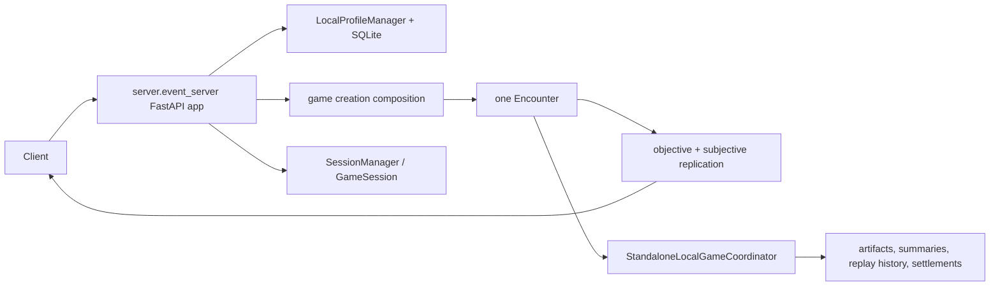
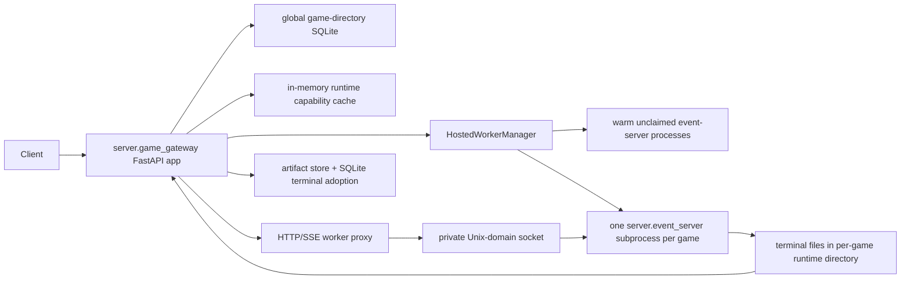
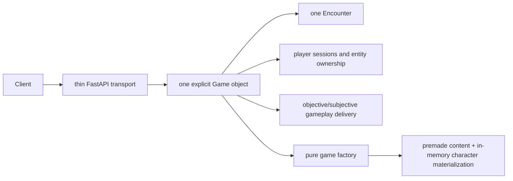

# Server single-game hard-cut audit

Date: 2026-08-14

Status: read-only architecture study. No production code, tests, database, or runtime artifact was changed. This report was produced from executable Python and configuration only; no existing Markdown was used as a source.

## Executive verdict

Yes: the multi-game subprocess architecture is still present, complete, and active.

It is not a few abandoned types. The current code still contains:

- a second FastAPI application dedicated to multi-game hosting;
- a warm pool of imported worker processes;
- one `server.event_server` subprocess per hosted game;
- Unix-domain socket creation and proxying;
- process-group startup, readiness, shutdown, and forced termination;
- database records for workers, games, memberships, access grants, attachments, and worker generations;
- a gateway-to-worker runtime capability protocol;
- a worker-to-gateway terminal evidence spool and adoption protocol;
- gateway restart/orphan recovery;
- public create, attach, reconnect, observe, stop, and runtime-proxy routes;
- hosted-mode branches embedded throughout the otherwise standalone event server.

For the stated target—one process, one game, premade characters without database ownership—this entire deployment shape is unnecessary.

The strongest hard cut is larger than deleting `game_gateway.py`. The server currently contains two intertwined products:

1. A direct, single-game HTTP/SSE game server.
2. A persistent multi-game hosting platform with profiles, owned characters, connection capabilities, worker isolation, replay archives, and restart recovery.

The second product can be removed. Because the current databases may be wiped, there is no reason to preserve its migrations or compatibility schema. The pure premade-character path already exists outside the database and should become the only required character construction path for now.

## Measured surface

The current `server/` Python tree contains 50,238 lines.

| Area | Lines | Files | Assessment |
|---|---:|---:|---|
| Exclusive multi-game gateway/hosting | 4,637 | 6 | Delete |
| Mixed game-directory database package | 10,043 | 8 | Delete and do not migrate if persistence is out of scope |
| Persistent character/profile server surface | 5,122 | 10 | Delete if premade runtime characters are the current requirement |
| Player replication | 10,567 | 11 | Keep; it is gameplay delivery, not multi-game hosting |
| History/evidence/replay support | 3,251 | 10 | Split: live replay may remain; durable archive and gateway evidence can go |
| Game creation, including local lifecycle | 1,605 | 6 | Keep pure authored creation; remove database lifecycle and decide preview process separately |
| Diagnostics/timeline | 2,263 | 6 | Not part of the first cut; review later |
| Frontend-adjacent catalogs/editor/projection | 3,825 | 7 | Explicitly deferred |

These groups overlap conceptually in a few places, so they should not all be added as a total. The immediately identifiable removable product surface is nevertheless roughly twenty thousand lines before simplifying `event_server.py` itself.

The architectural concentration is also measurable:

- `server/event_server.py` is 4,638 lines and imports 47 other server modules.
- `server/game_gateway.py` is 2,474 lines and imports 33 other server modules.
- `server/game_directory/repository.py` is 5,670 lines.
- `server/game_directory/migrations.py` is 2,557 lines and carries 16 ordered schema migrations.
- `server/game_directory/contracts.py` is imported by 16 server modules.

This is why the server feels like a behemoth: three composition roots—event server, gateway, and directory repository—each became a product-level dependency hub.

## The current two-server architecture

### Direct single-game path



This path is already capable of serving and running one game directly. It does not need the gateway to create an encounter, join a game, execute actions, or stream replication.

It is not currently database-free at application startup: `event_server.lifespan()` installs a local profile and opens a profile SQLite repository unless `DND_GAME_WORKER=1`. That database dependency was added to support persistent profiles, owned characters, saved encounters, durable local game history, and settlement. It is not required by the engine or by premade character construction.

### Hosted multi-game path



The exact child command is assembled in `server/hosted_worker.py`:

```text
python -m uvicorn server.event_server:app --uds <private socket> ...
```

The manager marks the child with `DND_GAME_WORKER=1`, polls `/hosted/readiness`, posts a `HostedWorkerAssignment` to `/hosted/configure`, records the worker PID and process-group ID, proxies public traffic to it, and eventually terminates the complete process group.

The gateway prewarms one worker by default through `DND_HOSTED_WARM_WORKERS`, so subprocess hosting is entered at gateway startup even before a game is created.

## Exact multi-game components

### Files that exist only for the hosted deployment shape

These six files total 4,637 lines and can disappear as a unit once the hosted branches are removed from `event_server.py`:

| File | Lines | Responsibility |
|---|---:|---|
| `server/game_gateway.py` | 2,474 | Multi-game control plane, creation, attachments, reconnect, observer admission, worker coordination, terminal reconciliation, duplicate catalog/profile/history HTTP surface |
| `server/game_gateway_models.py` | 214 | Hosted create/attach/reconnect/observe/stop contracts |
| `server/hosted_worker.py` | 586 | Warm pool, subprocesses, Unix sockets, readiness, assignment, process-group cleanup |
| `server/worker_proxy.py` | 297 | Route classification, capability checking, HTTP/SSE forwarding, trusted header projection |
| `server/worker_terminal_spool.py` | 689 | Cross-process durable terminal component and ready-manifest protocol |
| `server/runtime_authority.py` | 377 | Gateway bearer tokens and private gateway-to-worker authority headers |

`runtime_authority.py` is not independently useful in the single-process shape. Its event-server usage exists to authenticate claims injected by `worker_proxy.py`. Direct sessions already have server-owned entity ownership and subjective observer state.

### Hosted code embedded in the direct event server

Deleting the six files is not enough. `server/event_server.py` imports and implements the child half of the protocol.

Hosted concerns touch at least these functions or blocks:

- hosted terminal publication callbacks around lines 499-639;
- replication request authority projection around lines 1075-1143;
- hosted objective-diagnostics authority around lines 1253-1298;
- the `DND_GAME_WORKER` branch in local-profile installation and lifespan around lines 1555-1697;
- global hosted assignment and character-deployment state around lines 1706-1739;
- hidden `/hosted/readiness` and `/hosted/configure` endpoints around lines 2018-2088;
- hosted identities in terminal summary/replay endpoints around lines 2942-3025;
- hosted versus local deployment resolution around lines 4046-4095;
- hosted assignment, character UUID, and directory game identity branches inside game creation around lines 4300-4448.

Those branches make `event_server.py` simultaneously act as:

- a standalone application;
- an unclaimed warm worker;
- an assigned hosted worker;
- a gateway-private evidence server;
- a public gameplay server.

That is one of the main architecture breaks. A server request handler should not need to know whether its process was prewarmed, claimed over a private socket, and assigned a worker generation.

### Database structures that exist for hosted coordination

The current directory contracts and repository include:

- worker state and transport records;
- worker PID, process-group, host, private locator, heartbeat, lease, and generation;
- `HOSTED`, `LOCAL`, and `IMPORTED` game execution kinds;
- public/private visibility and observer policy;
- game memberships and capability matrices;
- entity-to-membership assignments;
- invite, reconnect, observe, and admin grants;
- concrete client attachments and token hashes;
- runtime cursors and reconnect state;
- worker terminal ready manifests;
- hosted terminal adoption and generation fencing;
- global directory events.

The corresponding repository methods occupy the latter half of the 5,670-line repository: workers begin around line 2,926, games around 3,024, memberships around 3,324, entity assignments around 3,507, grants around 3,623, attachments around 3,750, directory events around 3,964, and worker terminal staging/adoption around 4,088.

Because database contents may be wiped, do not carefully edit the historical migration chain. Delete it. If persistence returns later, create a new schema for the then-current product rather than teaching a new local-only server to replay the history of a removed hosted platform.

## Premade characters do not need the database

This separation already exists in the executable code.

There are currently two character concepts that the server conflates:

1. **Authored/premade runtime character**: built from content and materialized directly into an encounter.
2. **Owned persistent character**: a profile-owned database record with immutable definition, holdings, and loadout revisions, optimistic head checks, deployment leases, pinned deployment evidence, settlement, and progression history.

Only the second concept requires the directory database.

### Existing database-free premade path

The pure path is:

```mermaid
flowchart LR
    Premade["premade content id / authored roster"] --> Recipe["AuthoredCreatureRosterSource"]
    Recipe --> Assembler["prepare_encounter_recipe"]
    Assembler --> Creature["materialize_creature"]
    Creature --> Factory["materialize_authored_class_root"]
    Factory --> Revisions["compose_builtin_character_revisions in memory"]
    Revisions --> Materializer["materialize_character"]
    Materializer --> Entity["runtime Entity"]
```



Important implementation points:

- `dnd/premade_characters.py` registers the approved premade creature content roots.
- `dnd/classes/content_factories.py::materialize_authored_class_root()` composes revision objects in memory and materializes the character.
- `dnd/content_system/builtin_character_builds.py::compose_builtin_character_revisions()` creates definition, holdings, and loadout values without a repository.
- `dnd/scenarios/encounter_assembler.py` handles `AuthoredCreatureRosterSource` by calling `materialize_creature()` directly.
- Authored rosters such as `hero.fighter_l5_shield_torch` already create playable premades without looking up a profile or character row.

The use of revision-shaped value objects in this path does not imply persistence. They are simply validated construction inputs created in memory.

### Database-bound character path to remove for now

The database-bound alternative starts with `OwnedCharacterRosterSource`. It carries:

- a persistent character UUID;
- expected character row version;
- expected definition, holdings, and loadout revision numbers;
- three expected digests;
- expected ruleset digest.

The server then requires `CharacterDirectoryService`, loads the exact three database heads, acquires deployment leases, pins a deployment, maps persistent item identities to runtime identities, and settles resulting holdings after the encounter.

That complexity solves durable owned-character progression and concurrent deployment. It contributes nothing to creating a premade runtime character in a single game.

If premade runtime characters are the current product requirement, the clean cut is:

- retain `AuthoredCreatureRosterSource` and premade content recipes;
- retain pure in-memory character revision composition and materialization;
- remove `OwnedCharacterRosterSource` from active game creation;
- remove persistent character directory routes and services;
- remove deployment leases, pinned deployments, and settlement;
- remove local-profile startup from the event server;
- let a future persistence project wrap the pure character factory instead of owning it.

The desired dependency direction is:

```text
pure character factory <- optional persistence adapter
```

It must never become:

```text
database repository <- required by character factory
```

## Where the architecture breaks apart

### 1. A deployment experiment became a second product

The gateway is not a thin host. It owns identity, credentials, profile initialization, character access, game creation, game discovery, memberships, observers, reconnects, runtime authorization, worker lifecycle, replay access, terminal persistence, and recovery.

This is why it cannot be understood as an integration around the engine. It is a multiplayer hosting product surrounding the engine.

### 2. The direct server and gateway duplicate public product routes

Both applications mount or implement versions of:

- server capabilities;
- content manifest/catalog;
- spell catalog;
- game creation catalog, composition, and preview;
- character directory routes;
- directory event streaming;
- game history and replay routes.

Tests explicitly assert parity between gateway and standalone OpenAPI route families. Maintaining deployment-shape parity is work created only by having two public application roots.

### 3. The event server has two lifecycle protocols

Standalone terminal completion writes artifacts and commits through `StandaloneLocalGameCoordinator`.

Hosted terminal completion instead writes immutable files into a worker runtime directory, publishes a ready manifest, waits for the gateway to discover or monitor it, validates generation identity, copies artifacts into the gateway store, stages database metadata, and finalizes the terminal game.

One game result therefore has two complete persistence protocols. The hosted one can be deleted rather than unified.

### 4. The directory repository mixes unrelated kinds of truth

One repository owns:

- local profile identity;
- character definitions, holdings, loadouts, preferences, progression, and saved encounters;
- multi-game worker placement;
- multiplayer membership and attachment authorization;
- game history, summaries, replay artifacts, and terminal recovery.

This makes it impossible to delete deployment infrastructure without appearing to threaten character creation. The database wipe removes the compatibility concern; the conceptual fix is still to stop using one repository for all product domains.

### 5. Transport authorization leaks into gameplay projection

The gateway validates a bearer token, converts it to trusted `X-Dnd-Runtime-*` headers, and the worker reparses those headers to establish subjective replication authority. Session ownership, membership authority, gateway capability authority, and replication perspective must all agree.

In a direct one-game server, the server already owns the session and its controlled/observed entities. The private-hop claim protocol is redundant.

### 6. Process isolation hides global-state constraints

The hosted worker exists partly because engine registries and application globals naturally describe one game. Process isolation made those globals support many games without refactoring ownership.

For one process and one game, that isolation is unnecessary. Accepting one game per process turns the existing global constraint into a valid temporary invariant, not a problem to solve now.

### 7. The server owns too much domain orchestration

`event_server.py` currently owns game state, session state, engine reset, encounter activation, controller scheduling, durable local lifecycle, character deployment, terminal publication, replication, diagnostics, editor commands, catalogs, and process management.

After the hard cut, it should become a transport adapter around one explicit `Game` object. That refactor should follow deletion; doing it before deletion would merely redistribute obsolete hosted branches.

## Other subprocesses: separate decision

Removing multi-game hosting does not produce a literally single-process application. Three helper subprocess systems remain:

| Process family | Files | Lines | Current purpose |
|---|---|---:|---|
| Retained game-creation preview child | `game_creation_preview.py`, `game_creation_preview_worker.py` | 513 | Assemble previews without contaminating parent registries; prewarmed at server startup |
| Disposable character visual preview child | `character_build_preview.py`, `character_build_preview_worker.py` | 249 | Materialize a character preview outside parent registries |
| Disposable persistent equipment mutation child | `character_equipment_mutation.py`, `character_equipment_mutation_worker.py` | 434 | Execute runtime equipment rules without mutating parent registries |

These are not the multi-game gateway. They are isolation wrappers around mutation-prone global registries.

Recommended treatment:

- The character preview and persistent equipment workers disappear naturally if the persistent character-directory product is removed.
- The game-creation preview worker remains a separate 513-line choice. Keep it temporarily if previews are still required, or hard-delete the preview feature. Do not casually run it in-process while a live game exists; the child currently protects the live process from registry contamination.

The `--force` server CLI also contains OS subprocess/process-kill logic near the end of `event_server.py`. It is launcher convenience, not game architecture, and can be reviewed after the hosting cut.

## Recommended hard-cut boundary

### Delete in the first cut

Delete the exclusive hosted files:

```text
server/game_gateway.py
server/game_gateway_models.py
server/hosted_worker.py
server/worker_proxy.py
server/worker_terminal_spool.py
server/runtime_authority.py
```

Delete their child-side protocol from `event_server.py`:

- `DND_GAME_WORKER` mode;
- hosted assignment globals;
- hosted character-deployment globals;
- `/hosted/readiness`;
- `/hosted/configure`;
- private runtime authority headers;
- gateway-only objective diagnostics authorization;
- worker terminal spool publication;
- hosted worker IDs and generations in terminal evidence;
- hosted branches in game creation and terminal callbacks.

Remove gateway-only contracts from shared API models and imports.

### Delete in the same product reset if only premades are required

```text
server/game_directory/
server/character_directory_contracts.py
server/character_directory_routes.py
server/character_directory_service.py
server/character_build_preview.py
server/character_build_preview_worker.py
server/character_content_rebase.py
server/character_deployment.py
server/character_equipment_mutation.py
server/character_equipment_mutation_worker.py
server/character_settlement.py
server/local_game_lifecycle.py
server/directory_event_stream.py
server/game_history.py
server/game_history_contracts.py
server/game_artifact_store.py
server/terminal_evidence.py
```

Then remove from `event_server.py`:

- local profile manager installation;
- profile capability headers;
- character directory router;
- saved roster/encounter database lookup;
- directory event router;
- durable game-history router;
- local game coordinator;
- owned-character deployment and settlement;
- local database terminal commit/recovery.

This makes server boot and premade game creation independent of SQLite.

Do not delete the pure premade implementation under `dnd/`. In particular, preserve premade content declarations, built-in character build composition, character materialization, authored rosters, and encounter assembly.

### Keep in the first cut

- one `server.event_server` FastAPI application;
- `SessionManager` / `GameSession` temporarily;
- game creation catalog and authored roster composition;
- Encounter assembly;
- action discovery and command execution;
- objective and subjective replication required by the client;
- combat-log projection;
- live event streaming;
- content bootstrapping;
- premade character content factories and in-memory materialization;
- map editor and frontend-adjacent content routes, because their cleanup is explicitly deferred;
- global engine registries for now, under the invariant that the process owns at most one game.

## Target architecture after deletion



Suggested responsibility boundary:

### Server

- parse HTTP/SSE requests;
- validate transport payloads;
- translate exceptions to HTTP responses;
- expose health and capabilities;
- own the application lifespan;
- delegate every game operation to the one active `Game`.

### Game

- own the Encounter;
- own session/entity bindings;
- own activation and terminal state;
- coordinate turns and controllers;
- expose action execution and inspection operations;
- own replication stream lifecycle;
- enforce the one-game invariant.

### Game factory

- normalize one authored game recipe;
- resolve authored roster and premade content;
- materialize the Encounter and runtime entities;
- return a complete, inactive `Game` ready to activate;
- perform no database access and no HTTP work.

### Encounter

- remain the rules/runtime state machine;
- not know about HTTP, profiles, gateways, databases, worker IDs, sockets, or access tokens.

## Suggested execution order

1. **Lock the intended capability set.** One direct process, one active game, authored/premade rosters, no persistent owned characters, no multi-game history guarantees.
2. **Strengthen the database-free premade acceptance test.** Boot the real lifespan with SQLite access rejected, create a game from an authored premade roster, join it, inspect replication, execute one action, and terminate cleanly.
3. **Remove the gateway and hosted worker files.** Remove imports and hosted-only tests at the same time.
4. **Strip hosted mode from `event_server.py`.** There should be no `DND_GAME_WORKER`, hosted endpoints, worker assignments, proxy headers, Unix sockets, or worker terminal spool.
5. **Remove the directory/profile product.** Since data is disposable and premades are pure, remove the schema, repository, character-directory routes, owned-character source, leases, settlement, durable history, and migrations rather than adapting them.
6. **Make direct game creation use only authored/premade sources.** Keep pure materialization code and tests.
7. **Run and classify the full test suite.** Delete obsolete hosted/persistence specifications; port gameplay assertions that accidentally lived inside them.
8. **Introduce the explicit `Game` object.** Move coordination out of `event_server.py` only after the obsolete paths are gone.
9. **Review the remaining preview subprocess.** Decide between retaining isolated visual preview or deleting the preview feature.
10. **Only then split the server file.** A clean split after deletion should follow real responsibilities rather than preserve historical route groupings.

## Test impact and recovery plan

Thirteen test files directly mention gateway/worker mode, comprising 8,643 lines, but several are mixed files. Do not delete them blindly by filename.

### Entirely or overwhelmingly obsolete with multi-game hosting

- `tests/manual/test_110_gateway_restart.py`
- `tests/manual/test_110_multi_game_gateway.py`
- `tests/manual/test_163_content_worker_identity.py`
- most of `tests/manual/test_109_hosted_game_runtime.py`
- hosted create/reconnect/deployment cases in `tests/manual/test_111_player_identity_characters.py`
- gateway access and worker terminal polling portions of `tests/manual/test_119_gateway_replay_access.py`

If persistent owned characters and history are also removed, these become obsolete as product specifications:

- `tests/manual/test_101_game_directory_migrations.py`
- `tests/manual/test_101_game_directory_repository.py`
- `tests/manual/test_101_game_directory_hot_path.py`
- `tests/manual/test_101_game_directory_evidence.py`
- `tests/manual/test_101_directory_event_stream.py`
- `tests/manual/test_173_character_revision_repository.py`
- `tests/manual/test_184_character_profile_progression_repository.py`
- `tests/manual/test_185_local_profile_manager.py`
- `tests/manual/test_186_character_directory_service.py`
- `tests/manual/test_187_standalone_local_game_lifecycle.py`
- `tests/manual/test_189_worker_terminal_spool.py`
- persistence-specific progression/equipment/respec tests.

### Mixed files: delete only hosted assertions

- In `test_113_subjective_replication_routes.py`, keep direct replication behavior; remove the test requiring private hosted authority.
- In `test_118_objective_diagnostics_routes.py`, keep direct objective stream behavior; remove hosted header/capability cases.
- In `test_189_game_creation_visual_preview.py`, remove gateway-versus-standalone OpenAPI parity. Keep preview behavior only if the preview feature remains.
- In persistent scenario/equipment tests, port any pure engine equipment or authored-premade assertion to engine tests before deleting database cases.

### High-value surface to retain or strengthen

- `tests/manual/test_premade_character_content.py`: verifies the pure premade catalog roots and schema-2 materializer.
- `tests/engine/test_manual_21_arena_game_sessions_client_state.py`: exercises authored arena construction, sessions, actions, replication, and AoE gameplay.
- `tests/manual/test_72_battlefield_deployment_catalog.py`: verifies authored rosters fit deployments.
- `tests/manual/test_177_content_recipe_presets.py`: verifies content recipe identity and materialization.
- pure character-build and multiclass validation/materialization tests under `tests/progression/` that do not require a repository.
- a rewritten `test_direct_single_game_server_never_requires_sqlite` that enters the real application lifespan and creates a premade game.

The recovery rule should be:

> Preserve assertions about combat rules, premade materialization, sessions, actions, and replication. Delete assertions whose subject is gateway deployment, persistent identity, database concurrency, worker generation, reconnect capability, terminal adoption, or migration compatibility.

## Acceptance criteria for the hard cut

The cut is complete when all of the following are true:

- `server.game_gateway`, `server.hosted_worker`, and `server.worker_proxy` no longer exist.
- No server code contains `DND_GAME_WORKER`, `DND_HOSTED_*`, `HostedWorker`, worker socket paths, worker generations, or `/hosted/*` routes.
- Starting the server never launches an event-server child process.
- The application can boot and create a premade game while every SQLite connection attempt is forced to fail.
- A premade fighter/sorcerer/barbarian can be created from content, placed in an Encounter, joined, observed through subjective replication, and controlled through the direct server.
- The direct route path contains no gateway bearer capability or private projection headers.
- There is only one public application root.
- There is at most one active `Game` per process.
- Encounter and premade materialization have no imports from `server.game_directory`.
- The old database and migration history can be deleted without affecting startup or gameplay tests.
- Obsolete gateway/persistence tests are removed only after their pure gameplay assertions are recovered elsewhere.

## Bottom line

The multi-game system is still fully present and is a strong hard-cut candidate.

The database is not required for premade characters. The code already proves this through authored premade content roots and in-memory character materialization. The database is required only for the separate persistent-owned-character product and its concurrency/history guarantees.

Given the current direction, the clean architecture is:

```text
one FastAPI server
    -> one Game
        -> one Encounter
        -> direct sessions and replication
        -> pure premade/content factory
```

Everything involving game directories, hosted workers, Unix sockets, process generations, attachments, reconnect capabilities, deployment leases, and cross-process terminal adoption belongs to a future multi-game or persistent-character product—not to the server being built now.
