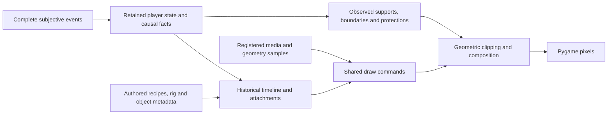

# Rendering architecture audit — 23 September 2026

Review baseline: `508f5f8d38c` (`pre-review`), branch `codex/recovery-design`.
This review changes documentation only. Feature integration remains paused.

## Verdict

The core recovery design survives the additions: complete subjective event
lineages feed retained state, independent historical playback and shared drawing.
XYZ is a shared geometric media capability, not a separate Fireball engine.
There is no evidence in the audited frame paths of consulting live native
entities to invent hits, conditions, visibility or recipients.

It would nevertheless be wrong to call the current rendering surface uniformly
typed, wholly authored in JSON, or ready for the unchanged NeuroClient renderer.
There is a demonstrated current replay blocker, retained-archive compatibility
failures, importer ownership violations,
a measured wall registration defect, accepted-but-incomplete authoring semantics,
and several implicit runtime contracts. Fix those boundaries while preserving
the approved output. A renderer rewrite or a new universal animation language
would be the wrong response.

The audit found no current spell-name dispatch in the production frame renderer.
Literal spell identities in Python are confined to the scoped demos/preview and
the legacy recording-policy fallback discussed below. Shared branches for
projectiles, ground media, body attachments, spheres and fixture depth have real
different semantics; their existence alone is not a per-spell hack.

## Scope and independent review

The user requested rendering-side first-principles analysis, including XYZ,
object metadata, event purity, typed authoring and TypeScript reuse. Native rules
were inspected only where necessary to establish the rendering contract.

- [Geometry / XYZ review](audits/RENDER_XYZ_AUDIT_2026-09-23.md): full source-to-world-to-screen trace, geometry representations, occlusion, current scale ratios and a measured wall probe.
- [Event / anti-slop review](audits/RENDER_EVENT_AUDIT_2026-09-23.md): capture, public serialization, reduction, historical scheduling and real-event review fixtures.
- [Authoring / anti-OOP review](audits/RENDER_AUTHORING_ECS_AUDIT_2026-09-23.md): schema/consumer inventory, actual compiler probes, passive data ownership and original NeuroStudio comparison.
- Primary review: importer probes, initialized support inventory, draw-command semantics, test and typing runs, synthesis and cleanup boundaries.

Source searches locate candidates; counts, existing tests and agreement between
reviewers are not proof by themselves. Findings below distinguish current defects,
latent accepted combinations and maintainability risks. No production fixes were
made during this review.

The separate user-owned task `01a0d026-c987-7ea1-b474-4a352d1f9b41` owns licensed
asset separation, the private repository and its explicit installer. It has its
own checkout. Historical Git cleanup was expressly deferred by the user.
The installer should restore selected packaged assets, not rerun historical
importers. Rendering behavior remains in the public authoring/code contract;
licensed images and geometry companion binaries belong with the private assets.

## First-principles model to preserve

1. **Gameplay truth belongs to events.** Targets, damage, conditions, native area
   occupancy, destruction and disclosure are not inferred from VFX. Initial world
   and actors are also captured events, not an extra hidden live-world dependency.
2. **Presentation has its own clock.** It may hold a pose, delay disclosure until
   an authored clearance frame, fade a removed condition, or interpolate a motion.
   It must not change the recorded native result or accelerate other tracks to
   catch up with event processing. Complete causal lineages remain the unit.
3. **Registration is a mathematical contract.** Source canvas/crop, pivot, camera
   bank, coordinate axes and units, attachment and image/world scale must agree.
   Stable measured values are legitimate authoring. Repeated post-import mutation
   and unowned compensating values are the problem.
4. **Storage does not determine meaning.** A PNG page versus a packed XYZ packet
   describes how samples are stored. Body attachment, floor ownership, world
   occlusion and lifetime describe what those samples mean.
5. **Physics and visual geometry are related but distinct.** Native propagation
   governs effect admission. Camera occlusion hides pictures. A visible wall face
   may receive flame; an unseen far-side particle must not shine through it.
6. **Data-driven does not mean code-free.** Shared interpolation, frame decoding,
   depth composition and material sampling require algorithms. Passive authored
   records select their parameters. Per-spell executors and object subclasses
   are unnecessary for the content reviewed here.

## What is installed, and what the inventory does not prove

Fresh initialized metadata, without loading the image corpus:

| Surface | Count | Meaning |
| --- | ---: | --- |
| Selected spell bindings | 75 | Includes child-effect identities; not a count of independently paid spells |
| Drafts including action alias | 76 | One additional action delivery alias |
| Catalog spells without selected binding | 48 | Missing authored cast; does not imply their child outcomes or native mechanics are missing |
| Actor rigs / creature bindings | 8 / 8 | Includes modular root, demons, goblin, orc, wolf and skeleton |
| Projectile / finite-media asset records | 346 | Media records, not spell count |
| Storage assets / phases | 324 / 330 | 320 layer-storage phases and 10 XYZ packet phases |
| Condition recipes / media bindings | 144 / 92 | Recipes can intentionally be state-only |
| Maintained spatial / deposit bindings | 11 / 6 | Native observed areas and material footprints |
| Environment banks | 208 | Referenced by 17 door, 12 trap and 34 prop mappings; 40 wreck mappings |
| Device / portal bindings | 2 / 2 | Separate presentation families |

The existing coverage command reports five partial condition recipes: Dragon
Wings and four weapon coatings. It reports four deliberately omitted potion
source strips. These are explicit capability/scope gaps, not new regressions to
quietly implement during cleanup. Jump, wake/recovery, condition lifetime and
optional potion omissions must not be reopened on outdated assumptions.

The runtime is 93 Python modules / 22,504 lines, with 23 importer modules. These
numbers delimit this review; they are not a quality score. Detailed ownership
and consumer tables are in the independent reports.

## What XYZ does, and what it cannot recover

The packets pair source pixels with sampled coordinates and ownership. They let
the renderer place, clip and order the existing pictures against observed floors,
barriers and protections. They do not contain a full simulation or mesh.

- Each pixel/component has one sampled surface. If clipping removes its nearest
  particle, the export cannot reveal an unrecorded particle behind it.
- The painter splits against other commands' scalar depth. Arbitrarily
  interpenetrating translucent XYZ effects do not yet have demonstrated per-pixel
  mutual ordering. A representative simultaneous case should establish the limit
  before adding complexity.
- Floor pieces, body billboards, fixture depth atlases, XY footpoints and XYZ
  serve different needs. Keep them explicit; making every asset XYZ would not
  improve a flat puddle or recipient curtain.

These are representation limits, not proof of defective approved clips or a
reason to build a general 3D engine. The source author and consuming renderer
need the same explicit contract about the information each representation holds.

## Findings and dispositions

### R1 — Current public destruction recordings cannot reload (P1, reproduced)

`game/player_facts.py:398–405` applies
`BeforeValidator(upgrade_player_fact)` to the entire discriminated fact union.
Its compatibility function only intends to add a missing legacy spell field,
but this wrapper materializes every fact's JSON before strict nested validation.
`ObjectDestroyedFact.placement` then rejects normal JSON arrays for tuple-valued
`position` and `covered_supports`.

Both reviewers independently established the boundary:

| Same destruction JSON | Result |
| --- | --- |
| Direct `WorldObjectPlacement` / `ObjectDestroyedFact` decoding | Pass |
| Same discriminated fact union without the outer before-validator | Pass |
| Current `PlayerFact` union | Fail |

Fresh native prop-destruction scenarios also fail; this is not just an old
archive, bad fixture or hypothetical malformed input. Existing rendered videos
remain viewable, but replaying affected saved inputs is broken.

**Repair:** narrow the historical spell adaptation to its actual boundary while
preserving normal JSON validation for all other facts. Keep strict placement
values, real event payloads and currently approved archive behavior. Do not loosen native types,
re-run mechanics to rebuild recordings, or fabricate missing values. Establish
fresh native destruction and archived public replay as the first regression gate.

The legacy policy itself also needs an honest scope: `recording_compat.py`
infers `connected` from Fireball identity when an archive lacks the propagation
field. Current events carry the explicit native value. The existing synthetic
missing-field test proves that default, not that it matches every historical
recording. Preserve current approved replay while repairing the decoder, then
verify and document the supported archive generation with an actual retained
example. Do not turn the fallback into new per-spell rendering mechanics.

### R2 — Media import still reauthors behavior and selection (P2, reproduced)

`devtools/import_aoe_surfaces.py:75–101` writes Thunderwave's media list/scale,
Color Spray's attachment/emission registration and Sleep/Ice Knife view-facing
values directly into selected Studio recipes. This contradicts the stated owner
contract in `game/data/PRESENTATION_CONTRACT.md`.

A temporary metadata-tree probe changed Thunderwave scale to `0.625`, ran the
actual importer against the delivered manifests with binary copies mocked, and
observed the authored value reset to `0.5`. Production files were untouched.

Older explicit importers also target the same storage identities now owned by
later XYZ deliveries: `import_spell_recovery.py:69–92` replaces Fireball phase
storage; `import_ice_spells.py:55–64` replaces Ice Knife impact storage. This is
an offline reproducibility/selection hazard, not a per-frame renderer dependency.
An old packaging command is not a safe recipe for rebuilding the current tree.

**Repair:** keep selected behavior in one authored owner, retain source-derived
registration as media metadata, and make the selected delivery explicit in the
offline packaging/install recipe. Old converters may remain historical tools,
but ordinary reconstruction must not silently select their superseded output.
Do not reconstruct recipes from another spell or invent runtime provenance checks.

### R3 — Draw semantics hide in a diagnostic tuple (P2, active design weakness)

`game/draw_commands.py:17` declares `evidence: tuple[object, ...]`. Actual rendering
reads `evidence[0]`, `[1]`, `[6]`, `[8]` and `[9]` to route devices, apply deposit
visibility, identify portal bodies and recover cannon pose/frame
(`game/app.py:362–375,1141–1142`, `game/portal_draw.py:117`). This is a positional
runtime protocol whose broad casts evade the useful type boundary.

**Repair:** give the existing passive draw command named role, owner and contact
semantics, plus the small optional pose data its consumers need. Generate debug
trace values from those records. Preserve current commands/pixels; no renderer
class hierarchy or new gameplay event protocol is required.

### R4 — XYZ storage currently implies a narrower rendering behavior (P2)

The presence of `surfaceFrames` selects world-volume composition and can require
a ground target (`game/animation_draw.py:763`); maintained XYZ Gust reaches its
route through `composition: "legacy"`. Meanwhile `"volume"` means the older
XY-footpoint route. A source format is doubling as a semantic selector.

Current installed XYZ projectile phases are ground impacts and work within that
scope. The same accepted storage on an arbitrary travel or actor-target phase
is not supported simply because its JSON parses.

**Repair:** make the small existing composition modes explicit independently of
storage encoding and attachment. Do not build absent modes. Mark or reject
unsupported combinations at the existing authoring/binding boundary.

### R5 — Image/world registration has two independent scale owners (P2 risk)

`registered_media.py:57–95` uses caller scale for pixels and packet positionScale
for XYZ. Their common reference scale/projection is implicit. Current production
ratios were checked and agree: normal banks `.5 / 1`; Color Spray
`.44444444479 / .88888888958`. This is not permission to retune current sizes.

**Repair:** one declared source projection/coordinate basis/reference scale,
with a common authored physical scale delta for pixels and XYZ. Camera zoom
remains separate. Preserve current screen-hand adjustments explicitly as screen
registration approximations; do not claim they are measured world-space sockets
or launch a full rig-keypoint project.

Keep the coordinate representations named: packets encode camera-local X/Z plus
source Y; older footpoints encode world XY; fixture depth contains scalar
view-ground depth. Their different transforms are intentional. A common source
registration contract must not collapse them into an ambiguous coordinate tuple.

### R6 — Wall-cap artwork does not exactly match its visual occluder (P2, reproduced)

With unmodified native height-2 stone walls, a Fireball probe changes 267 opaque
cap pixels in camera 0. The corresponding far-side particle rays cross at
height `2.0036–2.2542`: the math correctly passes them above the native wall,
while the drawn cap still occupies those pixels. Camera 1 shows the same class.
The XYZ report records source registration and sample-coordinate evidence.

**Repair:** align the visual cap/thickness/registration with the intended
occluder. Do not arbitrarily raise native walls to height 3 or mask all opaque
wall pixels, which would hide legitimate foreground flame and wall contact.
Old occlusion tests additionally replace wall height 2 with 1 and enforce an
obsolete blanket silhouette rule; their current failures need this distinction.

Propagation barriers and visual occluders also currently share one collected
barrier set. Keep their meanings separate using received metadata. A backend
multi-Z or rule redesign is outside this cleanup.

### R7 — Valid-looking authoring exceeds the executor contract (P2, latent)

A parsed Fire Bolt recipe plus an existing finite Heal media track ending at
`10583.333 ms` still compiles with completion at `1582.396 ms`. Direct casts join
finite media duration; projectile casts omit it (`animation.py:1063` versus
`:1334–1358`). No current selected recipe combines these fields, so this is an
actual supported-combination defect, not an observed regression in Fire Bolt.

Storage records also admit no source, multiple sources, empty packet frames or
reversed numeric bounds. Stationary contact media accepts the broad cast-media
record but does not execute its actor attachment/scale/orientation fields.
Legacy area shape/sprite fields remain parsed while the active effects use other
media; all current area drafts disable that old geometry and sprite route.

**Repair:** join track lifetimes consistently; constrain existing mutually
exclusive sources and consumer-specific capabilities in memory. Report dormant
unsupported fields honestly. Do not implement everything the historical schema
can express, introduce file audits, or invent a second timeline language.

### R8 — Newer object catalogs are data-driven but unevenly typed (P2)

Studio uses constrained source models. Environment banks, devices, portals,
world transitions and condition-media records often decode raw dictionaries
straight into passive dataclasses. Device muzzle/camera arrays even use bare
`tuple` annotations. Typos and invalid combinations have a different boundary
depending on which file was edited.

**Repair:** type those existing source documents and name their units, frame
markers, state selectors and camera/pose arrays. Keep dataclasses as passive
runtime values. Share genuinely common registered-frame structures where useful;
do not merge devices, portals and conditions into an enormous universal record.

### R9 — Coverage is incomplete, and green clips are not visual certification (P2/P3)

`presentation_inventory` reports only the older world-transition map, not the
complete newer environment/device/portal/spatial/deposit families. A real native
portal transfer binds a cue but `lineage_coverage` says merely `received` because
its traversal omits `group.portals`. This is a reproduced diagnostic defect,
not a missing portal animation.

The broad run also exposes stale test contracts: the Fireball media test requires
two allocated 1536×1536 images even though current storage preserves that logical
canvas using cropped color/XYZ packets and offsets. Do not restore full-canvas
allocations or hard-code today's crop size. Assert registered pixels, geometry,
ownership, pivots and crop invariance while retaining timing, component order and
cache-bound checks. The wall-memory scenario also fails before replay because
its native setup expects a WEST-only residue but receives EAST+WEST under the
current Fireball behavior; its intended one-sided-disclosure setup needs review.
The event reviewer verified an open, in-radius route around that fixture's wall
under connected propagation. Preserve the privacy test by creating a real
one-sided-contact setup, not by accepting both faces in its assertions or changing
Fireball back to the superseded rule.

Capture status checks causal settlement, camera state parity, framing and encoded
frame count. `gaps` is separate from that status. Neither proves correct particle
occlusion or human-approved appearance.

**Repair:** extend the existing initialized inventory and observed-cue reporting.
Distinguish selected, executable, bound, omitted and visually reviewed. No asset
walk, SHA, source audit or new registry framework is required.

### R10 — Porting still includes real shared code, and some art choices live there

Blood detail colors/shading in `blood_draw.py` and `surface_residue.py:415`,
deterministic residue/variant selection and some inherited rig appearance rules
are Python algorithms. This is not renderer-generated damage, and converting
every equation to JSON would make the design worse. But mutable artistic choices
need an explicit owner, and a faithful TS implementation needs the algorithm
contracts as well as the JSON.

**Repair:** move genuinely authorable colors/parameters into the existing
material/rig records when cleaning that path; retain small shared algorithms.
Document their units/selection behavior. Do not create a general shader DSL.

### R11 — Historical head bookkeeping and review tooling need bounded cleanup

Live encounter playback and the clip recorder use the same binders/sampler but
repeat head-admission bookkeeping for conditions, maintained fields, deposits,
feedback and body history. No current clock-parity defect was reproduced. A small
shared admission function can prevent drift when this boundary is next changed;
a new scheduler is unnecessary.

The fresh all-game test run passed 88 tests, then was interrupted after 602 s
because a gallery's `source_identity()` was waiting over five minutes in
`git status --porcelain` (`devtools/animation_review/cli.py:33–37`). This checkout
contains a very large asset tree. That is developer capture metadata overhead,
not measured engine or raster performance. The subsequent game-test run with
video-encoding cases excluded is complete; its breakdown is below. Keep source identity collection cheap or
explicitly optional; the private-assets separation should also reduce this cost.

No runtime SHA/source verification was found in the rendering modules. Some old
offline extraction tools still contain historical checksums; they are not on the
game startup/frame path. The 640 MiB decoded-source cache is not a bound on all
renderer memory; separate raster caches retain more. No runaway-memory or
full-frame performance regression was established by this review.

### R12 — Retained native archives require an explicit compatibility repair (P2)

Five outcomes in the full run (three failures, two setup errors) fail before
public projection while decoding retained native recordings. `decode_event`
requires newer `action_economy_spent`, `harmful`, `harmful_target_entity_uuids`
and `target_type` fields which those actual archived events lack. This is
separate from R1's failure on freshly generated public destruction JSON.

**Repair:** inspect the retained archive generations and restore their supported
decoding through explicit compatibility at intake. Preserve available recorded
facts; do not infer payment or harmful targeting from live entities or simply
invent false/default outcomes. Where an old recording lacks information for a
new presentation distinction, represent that limitation honestly. Do not replace
the old fixture by rerunning today's mechanics and call that backward compatibility.

## How much to extend the authoring types

The work is mainly making existing capabilities explicit. It is not adding one
record per new spell or another object model.

| Existing boundary | Minimum change | What stays |
| --- | --- | --- |
| Media registration/storage | Explicit source basis/reference scale, storage alternative, facing-versus-camera bank meaning | Existing pixels, pivots, crop/frame data, URLs, lazy decode |
| Finite/maintained media | Explicit composition meaning and consumer-supported attachments; one finite-duration join | Existing Studio tracks and condition/spatial lifetime clocks |
| Object/condition-media documents | Typed bank/state/marker/pose/muzzle/aperture records | Existing backend-driven states and shared object/condition samplers |
| Draw commands | Named semantic role/owner/contact, separate diagnostics | Passive values, shared painter, ordinary trace output |
| Offline delivery selection | One explicit selected source/registration owner; importers preserve recipes | Existing package adapters and normal private asset installation |
| Capability reporting and schema identity | Enumerate all initialized owners and unsupported selected fields; consistent local extension version | Existing lightweight inventory; original NeuroStudio reference data |

These are six ownership surfaces, not six new subsystems. Several need fewer
fields and less duplicate policy, rather than more data. Exact public field names
should follow the existing contract during implementation; the review should
not prematurely freeze another elaborate schema.

For TypeScript, reuse the existing JSON/media and passive recorded facts.
Extend the Studio reader/editor to retain local `media`, `contact`, `childAttack`,
`effectDrafts` and condition extensions. The old NeuroClient serializer rebuilds
its original field set and would drop local additions. Port the shared samplers,
registration and composition semantics. Local extended condition recipes still
claim the old version-12 identity; make the extension version honest. Python
engine objects and Pygame surfaces are not part of portable authoring.
Preserve the original version-12 source reader and reference documents alongside
the explicit local extension identity.

## Proposed implementation sequence and acceptance gates

This is a reviewed cleanup proposal, not work already implemented.

1. **Restore the event boundary first.** Fix R1 narrowly and R12's separate
   retained-archive admission; exercise fresh real
   destruction and legacy replay, keeping native registries empty during cold
   playback. Add other strict nested fact examples to the existing small codec
   regression surface. Resolve every current failure by its actual cause rather
   than relabeling the whole set preexisting.
2. **Freeze authoring ownership.** Fix R2's rewrite/selection issue. Reimport the
   chosen delivery into a temporary tree with deliberately edited authored values;
   authored behavior must survive and selection must not silently switch to a
   superseded delivery. Intentional media registration/storage updates from the
   selected delivery remain valid. Private asset install only copies
   selected outputs. Do not retune visuals.
3. **Make current geometry semantics explicit.** Add the small composition and
   reference-registration contract, migrate existing records with identical
   effective coordinates/pixels, and separate visual occluders from propagation.
   Reproduce and fix the wall cap using art/visual registration, not gameplay hacks.
   Keep the pixel-identical metadata migration separate from the intentional cap
   correction; the latter should change only geometrically justified cap/contact
   pixels, assessed against its own before/after case.
4. **Close typed/execution holes.** Name draw-command semantics, type the small
   object catalogs and storage alternatives, and share the finite media join.
   Constrain narrower contact consumers instead of pretending all fields work.
   Validate at existing decode/binding boundaries, not through another corpus
   pass or mandatory startup inspection.
5. **Make coverage and portability honest.** Correct portal evidence and enumerate
   newer owners; document supported/dormant fields and local schema versions.
   Consolidate duplicate head admission only where these changes actually touch
   it. Keep the accepted source-strip omissions and deferred content deferred.
6. **Verify the result on the same inputs.** Use current native replay tests,
   representative saved lineages and disposable before/after frame comparisons
   where shared transforms change. Include four cameras, at least one raised
   support, front/back/above-wall geometry, body-local healing, destruction,
   portal transfer and a maintained field. Add one simultaneous depth-bearing
   effect case to define the current compositor's limit. Preserve approved Fire
   Bolt alignment, trajectories, body/equipment and lifecycle timing.

There is no new screenshot framework in this plan, no mandatory corpus-wide
pixel baseline, no all-content startup validation and no requirement to implement
missing spells. Capture only enough reviewed examples to establish the touched
shared contracts. Anti-slop and anti-OOP review apply to the consolidated plan
and to the first concrete cleanup packet.

## Separate production-packaging discussion — reasoning only

**September 24 inventory closure:** the subsequent
[complete asset inventory](PRODUCTION_ASSET_INVENTORY_2026-09-24.md) supersedes
the provisional packaging counts below. It reconciles all installed files,
actual frame/state consumers, effective resize factors and sheet/bundle choices
across VFX, rigs, equipment and environment. The older measurements remain
evidence of their stated subsets, not current whole-package totals. No production
packing or media replacement has been implemented.

The user clarified in the private-assets task that full data should remain safe
while we reason about a smaller production package. No pruning, regeneration,
uploads or packaging implementation are part of this audit. Private archive
separation and production optimization are distinct tasks.

Measurements reported by that task at the same `508f5f8d38c` baseline:

| Installed material | Measured size / count | Implication |
| --- | --- | --- |
| Whole `game/assets` | 62,769 files; 26,660,655,022 bytes (24.83 GiB) | Full archival/install corpus, not a measured minimum shipping payload |
| Persistent spells | 17.603 GB, including 14.843 GB raw position PNGs | Geometry storage dominates; atlasing color alone cannot solve size |
| Fireball surface bank | 6.042 GB installed; selected 48 frames/direction consume 998,438,407 bytes | 1,920 other packets / 5,043,261,535 bytes lie outside that declared playback selection |
| Whole-tree duplicate bytes after first copies | 5.794 GB | Overlaps the above groups; savings must not be added twice |

The persistent bank is a different case from Fireball: all 22,938 installed
persistent-spell files are referenced by current storage/resource declarations.
The asset task's subsequent owner-based pass retains 22,899 of them; the 39
remaining files total only 2,872,912 bytes. This distinction does not change the
main conclusion: most persistent data is actually selected, not loose source
debris. Several banks use
144 FPS logical slots and long holds. Logical slots can reference shared
rect/offset parts; slots are not unique source images. A single 60 FPS game trace
is not grounds for deleting unobserved source frames or retiming the effect.

Reasoned order for a later, separately agreed packaging unit:

1. Preserve the full private source/archive. Produce a distinct runtime payload
   from explicit selected deliveries, after importer ownership is repaired.
2. Derive used frames/resources from the authored references, including alternate
   cameras, facings, phases, variants and lazy references. A known Fireball frame
   selection is a bounded first example; do not generalize it by scanning one clip.
3. Deduplicate identical stored content offline, then choose lossless packaging
   for large raw geometry. Offline identity comparison is a packaging operation,
   not a game startup or frame-time hash check.
4. Consider atlases/pages for file-count and I/O reduction. Preserve exact color,
   alpha, blend-component order, integer geometry/ownership channels, source
   canvas, crop offsets, pivots, frame selection and timing. Retain coordinate
   bounds, axis/bank basis, byte interpretation and unit/position/vertical scales;
   identical channel bytes with different decoding metadata would move geometry.
   Registration must
   map a packed color region to its corresponding position/XYZ samples without
   applying color conversion to those numeric samples. Gutters and sampling
   rules must prevent cross-frame bleeding.
5. Measure package size, open/decode costs and bounded raster memory separately.
   Compare representative decoded frames/coordinates and actual replay output.
   Lossy compression, frame-rate reduction and visual retuning require their own
   explicit decision; they are not implicit consequences of “prebaked spritesheets.”

**Bake fixed authored raster scale before final atlas packing.** The user wants
production sheets at the size actually used, rather than oversized exports
repeatedly resized at playback. Separate the constant authored/reference pixel
factor from camera zoom and genuinely variable actor/effect scaling. Bake the
constant factor where the chosen render-resolution contract permits it; retain
only dynamic factors at runtime. A shared asset used at several fixed sizes may
need a small set of measured production variants, not a copy for every caller.
Recompute final sharing/packing after baking, since the physical raster changes.

Resample color, XY/XYZ and ownership using corresponding source samples; update
canvas/crop/pivot/emission registration together. This is a raster-resolution
change, not a smaller spell: decoded world coordinates, occupied region and height
remain the same. Do not multiply world XYZ values by the downsampling ratio.
Keep numeric channels out of color filtering. The present renderer rounds shared
rectangle edges about the screen anchor; a two-stage resize need not equal its
single combined resize at fractional zoom. Compare supported zooms, anchors and
four banks before claiming identical output, and preserve sufficient source
resolution or an explicit size variant where needed. Do not silently change
approved targeting or spell footprint to obtain a smaller sheet.

Existing color/XY-footpoint atlas and page adapters already support packing.
XYZ `.bin.gz` storage currently uses frame/component packets; changing that
container could require a bounded adapter change. Atlasing does not by itself
promise a smaller geometry payload. This discussion does not prescribe a new
pack format or asset-build framework before measurements justify one. The
geometry reviewer approved these fidelity constraints; size measurements remain
attributed to the private-assets task, not independently rerun here.

The follow-up usage audit also identified two important dependency details:

- `preload_cast_media` requests the first nonempty storage frame independently
  of a visible track's sampled interval. Production dependency selection must
  include that real read or deliberately align preload with bound frame selection.
  A visible-frame-only exporter would be incomplete.
- Camera/basis routing is part of the reference: condition world bases E and SE
  select different four-facing banks; Counterspell uses camera-specific asset IDs
  and the selected row. Retaining all eight rows everywhere overstates demand,
  while ignoring this routing can omit real reads.

The task's latest provisional combined ledger selects 56,749 files /
20,642,455,238 bytes, including ancillary object/media owners; unique content
accounts for 14,860,906,534 bytes. This is **not** a minimum package or
deletion list: duration/lifetime bounds remain conservative, environment state
subsets are not fully tightened, and further lossless compression is under study.
The task reports 15 real decoder cases across six storage layouts matching its
file ledger and 2,540 sampled outputs/masks across 102 condition owners matching
its lifecycle windows. Twenty-two media definitions have no selected owner in that
pass; absence from this bounded inventory is not sufficient to delete them.
Keep authored availability, production references and a particular encounter's
sampled frames distinct. No runtime source scan is needed for that distinction.

The user's efficiency requirement is explicit: the final production package
should contain every frame the runtime can request, **and no unnecessary frames**.
Conservative bounds are an intermediate investigation tool, not an acceptable
final answer. Resolve them from actual sampler/timeline contracts, then measure
lossless sharing, packing and compression, including decoder cost. The full
private source archive remains separate. Follow the asset task's evolving
[production usage report](/home/tommaso/.codex/worktrees/5b97/dnd_engine/agent_docs/PRODUCTION_VFX_USAGE_2026-09-24.md)
for its evidence and remaining bounds; no production media was changed here.

**Additional measured evidence, 24 September:** ten representative coordinate PNG
pages total 20,049,221 bytes. The asset task's reversible uint16 spatial-delta /
byte-plane / zlib probe reduced that sample to 12,413,438 bytes (about 38%), with
exact decoded RGBA reconstruction checked for every trial. These were selected
first/largest pages, not a whole-library benchmark. Individual savings were
4.3–42.7%. Some smallest vertical-delta encodings required about 98–106 ms to
decode/reconstruct versus 36–41 ms for in-memory PNG decoding; horizontal deltas
were about 31–37 ms on most other samples. Timings are minima of three repeats,
not full encounter measurements. Choose among size, decode work and allocations;
do not select the smallest file blindly or extrapolate the sample savings.

Fog Cloud and Cloudkill each have a first position page with identical decoded
RGBA/dimensions but different encoded PNG bytes (1,978,444 versus 1,563,329).
Offline exact numeric-content sharing can therefore go beyond encoded-file
deduplication. Preserve raw channels, including numeric alpha, and retain each
use's registration metadata; this is not permission for perceptual merging or
runtime image hashing. Probe evidence is in the asset task's local
`.runtime/vfx-usage-audit/compression-probe.json` and `compression_probe.py`.

Further sampler reasoning proves the full 720-frame Chill Touch phase reachable;
Web's fitted duration and Poison Spray's minimum duration also require their full
travel phases. The later inventory resolved the other nine travel bounds with
compiler/sampler witnesses; their full phases are reachable as well. Fire Bolt's 500 ms
prepare reaches frames 0–12 with the current sampler's boundary tolerance, not
0–14; that refinement alone saves no physical file bytes because it uses a shared
sheet. Logical frame selection and final packed storage must both be considered.

## Validation and review closure

- Independent anti-slop, anti-OOP/ECS and geometry cross-reviews approve this
  cleanup scope. Their requested clarifications are incorporated: explicit
  coordinate spaces, separate metadata migration/cap correction, bounded legacy
  compatibility claims and behavior-preserving delivery ownership. This concludes
  the design review; the cleanup remains proposed, with no production edits.
- Whole `game` typing: **0 errors, 0 warnings**. This does not establish correctness
  of untyped source dictionaries or the evidence tuple; the concrete probes show
  why both still need attention.
- Independent current-destruction round-trip and importer-overwrite probes:
  reproduced as described above, with no production edits.
- Geometry reviewer: 30 focused tests pass; 16 old scene-occlusion failures were
  investigated before interrupting that repeated matrix. Its fixture and current
  wall-cap mismatch are distinguished above; do not add partial counts to the
  primary suite.
- Event reviewer: partial focused run 126 passed / 37 failed, interrupted after
  the repeated current-destruction decoding defect was established. These are
  the same root cause, not 37 independent design failures.
- Initial all-game run: 88 passed before interrupting capture metadata collection;
  the subsequent non-gallery/non-encoding run completed: **2,052 passed,
  206 failed, 7 setup errors, 15 deselected in 1,914.93 s**. It excluded the two
  dedicated animation/weapon gallery modules and cases named `gallery` or
  `paused_lifecycle_clip`; it was not the complete repository/native suite.
  Raw log: `/tmp/render-audit-core-suite-20260923.txt`. Counts from earlier
  partial runs must not be added to this total.

| Cause / boundary reached | Failed | Setup errors | Disposition |
| --- | ---: | ---: | --- |
| Fresh public destruction placement JSON | 112 | 5 | R1; blocks downstream behavior assertions |
| Retained native archives missing later fields | 3 | 2 | R12; separate compatibility issue |
| Foreground wall/door silhouette matrix | 64 | 0 | Old height/silhouette oracle plus real R6 cap mismatch; not all harmless |
| Rear-face ground-shadow oracle | 25 | 0 | Not a valid general XYZ oracle; elevated samples and connected doorway spread matter |
| Wall-face memory native setup | 1 | 0 | Expects WEST-only residue; receives EAST+WEST before any replay assertion |
| Dense Fireball raw allocation extent | 1 | 0 | Stale full-canvas requirement; retain meaningful registration/timing coverage |
| **Total** | **206** | **7** | **No failures waived or hidden by this report** |

The hardware and hidden-target tether failures stop at R1's decoder; they do not
demonstrate separate hardware or privacy defects. The wall/legacy-archive tests
need the repairs above, not blanket skipping or stale expectations changed merely
to obtain green. Audit completed on 24 September; production cleanup remains
unimplemented and feature additions remain paused.
