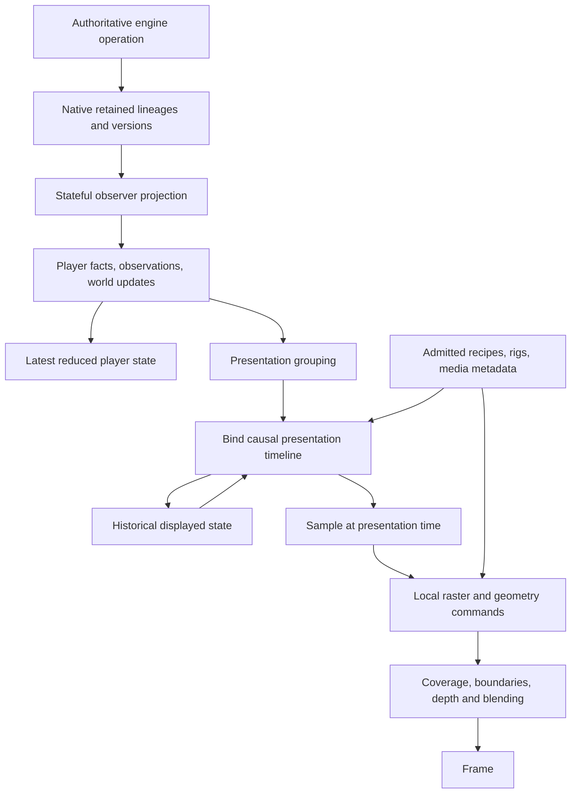

# Renderer architecture and TypeScript/PixiJS portability study

Date: 2026-10-05. Scope: source analysis, not authorization to restructure `/game`.

## 1. Finding

The renderer is **data-selected execution over a finite set of Python presentation and raster operators**. It is not entirely described by JSON, but it is also not a separate handwritten executor for every spell.

Three claims must remain separate:

1. Recipes select gestures, effects, palettes, delivery geometry, attachments and timing: substantially true.
2. Shared algorithms execute those choices: substantially true.
3. Exporting recipes and loading sprites in PixiJS reproduces the game: false. Causal scheduling, state staging, composition order, geometry decoding, material equations and numerical conventions remain executable Python behavior.

The best browser boundary is the existing **observer-projected `PlayerInitialization` + `PlayerLineage`**, not native engine events and not raster draw commands. A port needs a pure client reducer and presentation compiler as well as a Pixi renderer. The existing renderer supplies substantial reusable semantics; those semantics need an explicit specification and parity evidence.

This study does not claim that all rendering defects are exhausted, that all assets were visually re-reviewed, or that Pixi has already been benchmarked. No production code was changed for this analysis. Earlier condition/material corrections remain separate work.

## 2. Measured scope and evidence

The top-level `game/*.py` inventory contains 126 modules and 34,563 physical lines. Of these, 47 import Pygame and 39 import NumPy. These are source measurements, not a complexity score or proof that every module is rendering. Nested source and asset directories are excluded.

Largest files: `choreography.py` 2,719 lines; `animation_types.py` 2,259; `animation.py` 1,834; `app.py` 1,689; `animation_draw.py` 1,319; `player_projection.py` 1,166; `presentation.py` 1,019. The meaningful concentration of responsibilities is in choreography, loading/types and final composition—not merely the number of modules.

Machine-readable evidence:

- [Source inventory](renderer-port-20261005/source-inventory.json): definitions, line positions and imports.
- [Default metadata inventory](renderer-port-20261005/admitted-inventory.json): result of `load_animation_data()` with its default bundle selection and **no additional `rig_files`**. No raster textures were loaded by this count.

The default load contains 149 draft entries, 85 body-action recipes, 160 condition recipes, 236 condition-media entries, 25 spatial bindings, 1,112 projectile metadata entries and 1,638 resource bindings. These are map-entry counts, not distinct spells, verified files, unique textures or complete creature coverage. In particular, its single rig does not mean the game has only one rig: additional rigs are supplied through `rig_files` (`animation_data.py:247–266`). Historical gallery totals are not substituted for current measurements.

## 3. Actual pipeline



| Responsibility | Current owners | Must survive a port |
|---|---|---|
| Execute rules and produce outcomes | `dnd/`, `game/session.py` | Server authority; never replay mechanics to animate |
| Capture passive native history | `presentation.py`, `event_record.py`, `replay.py` | Private recording/replay responsibility |
| Project observer-permitted facts | `player_projection.py` | Stateful server-side disclosure, not browser filtering |
| Retain/reduce public state | `player_facts.py`, `player_reduction.py` | Pure ordered reduction, separate latest and historical state |
| Group related roots | `presentation_group.py` | Reaction relationship without invented ancestry |
| Bind facts to visual timelines | `combat.py`, `choreography.py`, `animation.py` | Ownership, causal dates, sockets, visibility-aware contacts |
| Sample poses/effects | `sample_choreography`, `sample_cast`, condition sampling | Absolute-time sampling, no rule execution |
| Produce and compose pixels | draw/media/depth modules, `app.draw_frame` | Render-family-specific geometry and blend semantics |
| Local controls and encounter loop | `encounter_play.py`, `controls.py`, `session.py` | Needs separate remote command boundary; not solved by renderer export |

`game/motion.py` is a compatibility re-export. It should not be reported as a duplicate movement engine simply because movement also appears in `choreography.py`.

## 4. What is authored

The central recipe is `StudioSpellDraft` (`animation_types.py:699`). It selects a cast and optional projectile, area, damage, condition, media tracks, body-material tracks, arc/directed delivery, cancellation media, displacement layers, contact and child attack. Validators prevent conflicting delivery owners. This is a real typed authoring contract, not arbitrary dictionaries interpreted by spell name.

| Authored area | Examples of data | Execution still needed |
|---|---|---|
| Casting gesture | `actionClip`, playback speed, release frame, recovery, hold-until-contact | Convert frames into time; join delivery and recovery |
| Modular layers | Magic/Effect choice, equipment, aura, slash, layer visibility | Resolve actual rig layers and animation availability |
| Color/material selection | Element colors, cast palettes, explicit override, palette treatment | Palette replacement, noise sampling and material equations |
| Source attachment | Facing-dependent sockets and measured body contexts | Sample the correct frame/facing and transform into world/screen space |
| Projectile delivery | Phases, speed, paths, contact, frame/media metadata | Geometry, travel timing, rotation, impact ownership |
| Area/volume delivery | Reference geometry, registration, representation and composition metadata | Bind actual center/placement from retained spell/spatial facts; decode XYZ/footpoints and depth-compose |
| Body responses | Damage, healing, death, prone/life-state contexts | Resolve causal response time and pose precedence |
| Conditions | Priority, exclusivity, body treatment, anchored layers, lifecycle effects | Derive lifetime from retained condition edges and sample it |
| Movement | Step duration, flight, connector profiles, forced-motion contexts | Traverse observed steps and insert reaction subtrees |
| Persistent spatial effects | Formation/removal media, commit offsets and response bindings | Derive actual start/removal dates and sensory ownership from causal facts; synchronize displayed state |
| Structures/portals | Section/dome media, fragment records, aperture data | Geometry assembly, clipping and replay of transforms |
| Equipment/item visuals | Slot/category mappings, modifier material recipes and attachment settings | Bind runtime item UUID, ownership and active modifiers from projected facts; compose before/after transfer |
| Creature rigs | Clips, layers, mappings, sockets and source resources | Adapt common action semantics to the selected native rig |

Concrete placement, ownership, outcome and transition occurrence come from retained runtime facts. Authoring defines how to present them; it does not author a second mechanical outcome.

### Loading and effective content

`animation_data.py:266` loads imported NeuroStudio materialized drafts, bindings and rig tables, imported action contexts and content-action recipes, local attack profiles and body-action recipes, then an explicitly ordered collection of sibling bundles. It additionally loads condition overrides/recipes, movement presentation, world bindings and media registries.

Consequences:

- A raw source recipe is not necessarily the final effective recipe; overlay order matters.
- The bundle list is Python packaging policy (`animation_data.py:349`).
- Several sibling loads use the module's global data root; supplying one root parameter is not a complete hermetic content configuration.
- Metadata may exist without selected/copied pixels. Registry counts are not asset readiness checks.
- `AnimationData` also retains unused source action-context JSON. Retaining source does not prove its family has a runtime implementation.
- Item-category resolution imports authored item inventory from `dnd.items`; a browser needs the resolved passive visual mapping, not item factories or backend imports.

For a port, an effective, versioned content manifest is more useful than reproducing filesystem probing. That is a recommendation for discussion, not a new loader implemented here.

### Semantics versus combinations

A valid schema combination can still be artistically wrong. Gesture meaning—ground strike, forward release, sky invocation—and Effect1/2/3/4/5 meaning are authoring decisions. The runtime validates compatible structure and executes timing; it cannot prove that a spell's selected motion communicates its meaning. Preserve the authored assignments and their visual acceptance evidence rather than automatically redistributing combinations for variety.

## 5. Events and subevents: five identities/orders, not one timeline

`PlayerNode` (`player_facts.py:548`) retains event UUID, lineage UUID, parent event/lineage, child lineages, phase, cancellation, public fact, resolution reference and attribution. `PlayerLineage` additionally carries version rows, actor observations and world updates.

| Concept | Meaning | Wrong substitution |
|---|---|---|
| Event UUID | A publication/version identity | Treating every version as a new action |
| Lineage UUID | Stable identity of one event across versions | Grouping by target or spell name |
| Parent/child lineages | Causal ancestry | Flat chronological animation queue |
| Source/version order | Native publication ordering | Visual milliseconds |
| Resolution reference/application identity | Which attempt owns an outcome | Nearest event or same recipient |

Presentation time is a sixth, downstream value. Backend timestamps are not animation dates.

### Capture and disclosure

`session.py:43–56` returns terminal roots in completion order. `presentation.py:779–880` captures descendants and their versions from the native queue, preserving cancellation and source order. Capture detaches executable graphs (`presentation.py:595–660`), but this private record still contains information inappropriate for a client.

`player_projection.py:1108–1166` is stateful: private world, remembered public world and disclosed lineage history are retained. It reconstructs event-time visibility, admits only permitted actor/world data and redacts undisclosed ownership references. A browser must not receive the objective record and decide what to hide.

### Indexing and reduction

`player_reduction.py:23–65` builds indexes by event and lineage, source order, resolution ownership/results and enclosing damage request. It walks parent ancestry where required. `state_before_event` (`:275`) reconstructs state before a descendant's declaration from its first source version, not its final completion.

`reduce_nodes` (`:239`) interleaves observations/world updates according to retained versions. Spatial commit cursors prevent late enclosing completion from undoing a nested position change. The reducer expects ordered input; it is not a complete arbitrary-graph validator.

### Latest versus displayed state

`encounter_play.py:184–198` immediately reduces incoming facts into latest state and queues presentation. Historical state advances through playback separately. Staging supplies missing contacts/geometry needed to bind an action without replacing already displayed HP, positions or equipment with their final values (`player_reduction.py:102–134`).

This distinction is fundamental: replacing displayed state with latest at cast start recreates early damage, disappearing items and visibility changes before their visual cause.

### Reactions are separate roots

`presentation_group.py:20–49` joins consecutive reaction roots only when their trigger lineage matches the following root. Native ancestry and reduction order remain unchanged; body clocks may overlap. A transport must preserve that logical grouping across network chunk boundaries. Grouping each websocket message independently is not equivalent.

## 6. What the Python presentation compiler does

`bind_choreography` (`choreography.py:300–1753`) is the largest concentration of implicit presentation policy. It indexes facts, stages contacts, recursively visits child lineages, binds shared action families and accumulates typed cues and dated state transitions. It is not just a recipe lookup.

| Policy in Python | Why it exists | Port requirement |
|---|---|---|
| Visibility-aware contacts | Remembered hidden position is not a live contact | Bind only received grants/support geometry |
| Application ownership | Repeated recipients and child attacks remain distinct | Preserve resolution/application identities |
| Reaction alignment | Reaction contact must meet triggering effect | Preserve overlap/join rule, not serial roots only |
| Outcome dates | HP, condition, injury and death have different relevant anchors | Port explicit precedence rules |
| Child timing | Some action children sequence; other descendants share contact | Do not serialize every child or parallelize every child |
| Recovery joining | Actor subtree/media may outlast nominal gesture | Parent completion must include relevant child ends |
| Spatial commits | Obscurement/clearance must align with formation/removal | Authored offsets plus causal ownership |
| Staged area reach | A delayed breach may admit later targets | Extend visual envelope without inventing hits |
| Movement interruption | Reactions occur at a known step pose | Suspend/resume travel without final-position leakage |
| Condition staging | Values and membership change at outcome dates | Preserve state edges, not merely an active-name set |

At `choreography.py:1410` onward, child dates depend on damage/portal/commit ownership. At `:1450`, staged area artwork is stretched through the last actual reach while retaining its first contact and tail. At `:1490–1625`, formation/removal dates propagate through exact causal ancestry and observation causes. Dated nodes are reduced into retained states, with source order breaking ties. `sample_choreography:1754` selects these states and samples cues; it does not execute mechanics.

The explicit lists of cue families and the code that joins them are a maintenance pressure point: adding a family may require several central paths to know about it. That merits a specification and dependency review; it does not automatically justify a universal animation graph or a new event bus.

### Worked cases

**Magic Missile A/B/A:** preserve three application identities even though the first and third share a target. Each contact owns its own outcome. Transform source socket, target contact and curve in the correct camera basis. A target-keyed map loses one dart; a screen-space/world-space mix bends the wrong way after camera rotation.

**Fireball reaching through destruction:** native facts determine which applications and structural consequences occurred. Presentation may extend the impact envelope to delayed reach. Clipping uses disclosed volume geometry. Ground visibility is not a substitute for volume surface visibility. Neither renderer nor Pixi should recalculate who was hit.

**A wall appears:** artwork can start before its authored formation commit. Displayed sensory/world changes must remain downstream of that exact wall's commit. An unrelated sibling's later date must not become the owner of all visibility changes. Latest authoritative state remains independently current.

**Movement with opportunity attack:** `bind_motion:2296` walks disclosed child steps, holds the creature at the known contact, binds reaction choreography, advances time and resumes. Missing endpoint disclosure produces a bounded known-contact interval, not an invented hidden path. Flight and crawl connectors select their own authored profiles; they are not aliases for walking.

**Drop, loot and coating:** item identity and retained visual modifiers drive both held and ground representations. Equipment/state changes occur at their bound dates. Rendering is not permitted to leave a duplicate ground copy because the actor's latest equipment was sampled early.

**Persistent condition:** application/removal/activation edges create lifetime records. Head-marker selection is independent of other condition media. `condition_sampling.py:116` cycles marker groups on a 1,800 ms schedule while retaining non-marker layers. That schedule is code policy, not an authored field today.

## 7. Drawing is several representations, not one sprite API

`DrawCommand` (`draw_commands.py:23–45`) carries painter key, Pygame surface, destination, blend, optional area/XYZ/per-pixel depth, grouping, semantic role, owner and support height. It is a local implementation value. Serializing surfaces and NumPy arrays into a new server draw protocol would cross the wrong boundary.

| Representation | Main owner | Why it is distinct |
|---|---|---|
| Modular/native rig body | `animation_draw.py:465,631,957` | Equipment ownership, pose, sockets and body effects |
| Registered sprite parts | `registered_media.py:40` | Common pivot, sparse page registration and rounding |
| Ground area | `area_media.py:107` | Ground coverage plus wall-contact slices |
| XYZ volume surface | `volume_media.py:232` | Per-sample world positions, supports, solids and depth |
| Directed ribbons/meshes | `directed_media.py:220` | Source-target geometry and procedural material evaluation |
| Modular walls/domes | `wall_assembly_media.py:93`, `construction_surface.py:142` | Section placement, curved surfaces and destruction transforms |
| Body material | `condition_draw.py:125` | Pixel treatment inside body/equipment composition |
| Portal | `portal_draw.py:143` | Aperture crossing and body clipping |

These are justified specialized operators. Collapsing them into a generic particle/sprite system would discard source information.

### Final frame order

`app.py:1498–1529` performs object destruction, floor coverings, actor-boundary clipping, fixture/terrain depth splitting, volume or area composition, world-depth partition, painter sorting and final blending. Earlier parts of `draw_frame` build world, lighting, disclosure and actor/effect commands.

Pixi `zIndex` alone cannot reproduce this. Some pixels of a single image need to be on different sides of a wall or actor. `fixture_depth.py:123` partitions depth bands; grouped media retains internal ordering through common cuts.

### Body/material ordering

`animation_draw.py:465–611` resolves source layers and equipment ownership, applies item modifiers and body-ramp processing with explicit cache eligibility. `_actor_blit:631–792` then composes persistent/finite materials, absence/distortion/disintegration, coverage, opacity, registration, outlines and attachments. `actor_draw_commands:957` separates ground shadow from lifted body and sampled copies.

A container-wide filter after all VFX is not equivalent. Neither is multiplying the sprite by a tint. The previous item-modifier/cache defect is corrected; it is not listed here as an outstanding failure.

An opaque palette can legitimately quantize away a small glint that was applied earlier. That is a composition/art decision, distinct from accidentally omitting the owned item effect.

### Media packaging and numeric contracts

`projectile_media.py:230–322` supports sheets, paged/sparse frames, normal/additive components, archive-backed packets, facing pivots and palette zones. `SurfacePositions` includes basis/scales/ownership. Footpoint alpha is metadata, **not coverage** (`:100`). Browser texture decoding must preserve data channels without color/alpha transformations.

`registered_media.py:35–107` reproduces fixed-point nearest sampling and rounds common canvas edges before individual part sizes; corresponding geometry must be scaled identically. Residual rotation of registered XYZ media is rejected rather than fabricated.

Projection uses 128×64 tiles and 64 pixels per elevation step, four camera rotations and finite zoom choices (`projection.py:12–22`). World cells, world height, rig-reference pixels and screen coordinates require separate treatment.

`media_blend.py:15–105` implements screen blending and complementary-frame mixing after depth cuts. Two independently alpha-blended frames are not equivalent to one weighted mixture. Pygame's local `SCREEN_BLEND=-1` must become a semantic mode, not a copied numeric constant.

## 8. What is genuinely code-bound or ad hoc

### Necessary specialized execution

- Frost, film, fracture, burn, wither and bark equations in `condition_draw.py:125–304`.
- Donor-specific mesh travel remapping, splinter paths and layer order in `directed_mesh_media.py:141–200`.
- Thorns deformation, normal/Fresnel and circular transformation in `thorns_surface.py:95–175`.
- Recorded ice fragment transforms, sampled at 144 Hz, in `construction_surface.py:142–184`.
- Electric corridor/contact formulas in `directed_media.py:323–364`.

These contain artistic constants beyond JSON. They need a TypeScript/shader implementation or equivalent accepted output. Not every literal needs a new data field. Expose values only where meaningful authoring variation is needed.

Procedural electric geometry uses CRC32 identity and a 45 ms time bucket with NumPy's generator (`directed_media.py:244`). Identical seed alone does not give identical output with JavaScript's random generator. Specify the sequence or accept an explicitly reviewed difference.

### Concrete identity exceptions

| Exception | Location | Classification |
|---|---|---|
| Head5/Head8 retain hair | `animation_draw.py:486–489` | Asset semantics embedded in generic composition; candidate rig metadata |
| Magic3 secondary white region | `animation_draw.py:233–239` | Legacy recoloring exception |
| Effect2/Effect4/Buff9 override restrictions | `animation_draw.py:389–391` | Explicit unsupported capability boundary; do not silently bypass |
| Three potion source-strip allowances | `body_action.py:26–30` | Specific accepted presentation exceptions, not general execution |
| Fireball missing old propagation field | `recording_compat.py:9–17` | Archive migration; keep out of active rendering |
| Ordered bundle enumeration | `animation_data.py:349` | Packaging policy requiring portable manifest |
| Fire Bolt/Magic Missile demo selection | `animation_preview.py`, `combat_demo.py` | Reference entry points, not production dispatch |

The source scan does not establish a general active renderer switch on individual spell names. The larger issue is implicit shared policy and material implementation, not hundreds of spell-specific branches.

## 9. Portability and multiplayer boundaries

`export_schema.py:19–35` exports PlayerSequence and several authored schemas. It does not export reducer/grouping algorithms, all graph invariants, complete asset resolution, material equations or presentation checkpoints. JSON Schema also does not automatically reproduce every Python model validator.

A useful conceptual dependency direction is:

```text
public contracts + effective presentation content
    -> pure reduction/staging/grouping
    -> pure timeline binding/sampling
    -> local geometry/material execution
    -> Pixi draw adapter
```

This is a boundary proposal for discussion, not a demand for five new frameworks. Existing functions and passive types already cover much of it. The client should not import backend factories or conditions to determine outcomes.

Pixi supports independently arranged render layers, container scene graphs and render groups. Those are useful building blocks; they do not supply this game's per-pixel world depth or causal timeline. Render groups are an optimization choice, not one mandatory group per spell. See official [render layers](https://pixijs.com/8.x/guides/concepts/render-layers), [render groups](https://pixijs.com/8.x/guides/concepts/render-groups), and [containers](https://pixijs.com/8.x/guides/components/scene-objects/container).

### Existing TypeScript is a precedent, not drop-in parity

`sdk/typescript/src/subjectiveJournal.ts:1–60` consumes the older SubjectiveReplicationFrame/World protocol, including protocol identities, perspective epochs and watermarks. It does not consume current PlayerSequence. `devtools/trace_neuroclient_animation.ts` is an offline trace tool referencing an external source app. Neither proves that the current renderer can be recovered by switching an import back to the old client.

### Transport concerns distinct from rendering

- Native recordings remain private. Per-observer projection happens before transmission.
- Current observer identity is one actor UUID. Party vision/control switching requires an explicit policy.
- Payloadless nodes can retain causal/source metadata. Whether that topology is acceptable disclosure is a multiplayer policy decision.
- PlayerSequence v2 has no complete delivery/acknowledgement, perspective-epoch, content-version or reconnect envelope.
- `reduce_lineage` rejects stale cursors but does not establish duplicate-tolerant transport or prove gap-free delivery.
- Native cursors may legitimately skip undisclosed roots. Do not demand contiguous native indices as transport sequence numbers.
- Reaction batches must survive packet chunking.
- Reconnect must distinguish latest world, remembered projection history, queued historical playback and persistent visual clocks.
- Current UI uses native AvailableActionsResult and native action execution; a playable browser needs a command contract as a separate scope.
- Session creation calls global `reset_engine_runtime`. Multiple simultaneous matches in one process are not established by the Session dataclass.

Pixi can be the rendering frontend. It does not itself establish multiplayer isolation, authority or protocol correctness.

## 10. What should be specified before implementation

This is the proposed discussion agenda, not an implementation authorization:

1. Freeze the actual public fact/identity/order contract and document batching/disclosure invariants.
2. Capture the effective content manifest, including selected rigs, resources, overrides and asset capability exceptions.
3. Specify shared presentation precedence: declaration, release, contact, HP/condition commit, formation/clearance and recovery.
4. Specify units, sockets, projection and supported representation transforms.
5. Specify body/item composition, metadata texture handling, depth grouping and blend equations.
6. Decide which embedded artistic equations need exact reproduction and where reviewed visual equivalence is sufficient.
7. Only then discuss moving responsibilities out of large Python modules or implementing the TS equivalents.

Anti-slop constraint: no new universal event bus, per-spell executor, generic shader graph or entity inheritance hierarchy is implied. Keep distinct ownership lifetimes for conditions, items, spatial effects and structures where their native facts differ.

## 11. Acceptance evidence a port would need

Test shared boundaries before evaluating hundreds of clips:

| Boundary | Required cases |
|---|---|
| Reduction | Cancellation, nested spatial commits, repeated applications, declaration-time state |
| Disclosure | Source-only/recipient-only views, lost sight and reacquisition, remembered objects |
| Grouping | Reactions split across transport chunks; unchanged native completion order |
| Timelines | A/B/A darts, area after breach, wall reveal/clearance, simultaneous outcomes |
| Movement | Interrupted step, flight over elevation, crawl aperture, forced landing |
| Pose/lifecycle | Prone to death without standing, summon/despawn, portal departure/arrival |
| Ownership | Coated item held/dropped/looted; suppression; material and item combination |
| Media | Sparse page seams, normal/additive layers, XYZ alignment, footpoint data |
| Projection | Four cameras, eight facings plus supported intermediate angles, raised targets |
| Composition | Boundary clipping without closing window alpha; ground versus volume coverage |
| Materials | Palette replacement, dynamic cache equivalence, stable deterministic sampling |
| Persistence | Multiple head markers without rotating other VFX; replay/seek at fixed times |

Compare public reduced values and sampled timeline values first, decoded geometry second, controlled images third. This locates failures better than a final video alone. Exact pixel matching should exclude explicitly accepted text/GPU numerical differences; those differences must be stated, not hidden behind a loose tolerance.

## 12. Independent review

Independent source passes covered (a) rendering/composition and anti-slop classification, and (b) serialization, causal ordering and observer/transport boundaries. Their findings are incorporated above. Final document reviews approved the rendering/anti-slop classification, event/serialization analysis, and anti-OOP/ECS boundary recommendations. The rendering reviewer requested a clearer separation between authored settings and runtime placement/ownership/dates; those table cells were corrected. The serialization reviewer requested “causal ancestry” rather than “causal ownership” for parent/child relationships; corrected. These are source-review approvals, not new visual or browser-runtime acceptance. No external chat was read or contacted.
