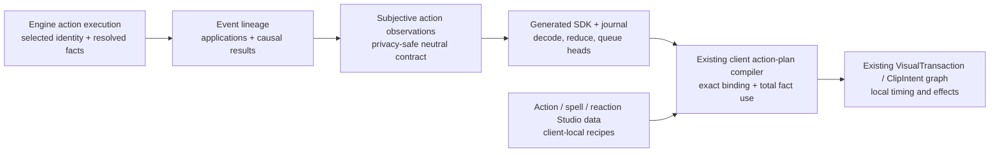

# Action-execution renderer-neutral bridge hard cut

**Status:** REVISION 6 REVIEW CANDIDATE — IMPLEMENTATION AUTHORITY NOT GRANTED  
**Date:** 2026-08-12  
**Scope:** action execution only: ordinary/configured actions, attacks, voluntary/forced movement, relocation, reactions, spells, and the direct results/applications causally owned by those actions  
**Required acceptance:** three internal specialist reviews plus one independent project-task review of this exact revision and SHA-256  
**Evidence source:** `tools/RENDERER_NEUTRAL_GAMEPLAY_BRIDGE_STUDY.md`, narrowed by this plan  

This file replaces the discarded broad renderer-neutral migration draft. It grants no implementation authority until the immutable acceptance record defined in §24 records all four acceptances for one frozen plan SHA-256 and one frozen source/evidence baseline.

## 1. Outcome

This cut establishes one boundary for action execution:

> The engine states which action executed, its selected game primitives, disclosed subjects, resolved applications/results, geometry, and causal order. The generated SDK transports and reduces those facts. The existing NeuroClient presentation bundle and transaction graph choose local animation, timing, effects, and text while preserving every engine fact.



No new event system, reducer, semantic graph, dispatcher, or renderer middleware is introduced.

## 2. Why this simplifies the action path

The current action path can take instructions from several competing places:

- backend cue clip names, frames, milliseconds, playback speed, and hidden visual slots;
- engine facts that projection drops and the client reconstructs from slots, names, visible-target counts, or live scene position;
- exact client action/spell/context recipes;
- clip-time action binding/media lookup and semantic-route validation;
- generic reaction “preamble” ordering that flattens distinct engine boundaries.

After this cut:

| Owner | Sole action-execution responsibility |
|---|---|
| Engine/events | Selected action identity; mechanics; resolved range, subjects, path, applications, results, geometry, causal order |
| Subjective projector | Privacy-safe disclosure of those facts; projection-native IDs and relationships |
| SDK | Generated validation, reduction, dual-clock action-head transport |
| Existing client presentation bundle | Exact local action recipe and scoped action-media readiness |
| Existing transaction/intents/clips | Render the admitted recipe while obeying the neutral facts and causal edges |

The cut deletes server recipe constants and client semantic reconstruction. New neutral fields are only concrete game facts already resolved but dropped, or the minimum vocabulary for currently executed behavior.

## 3. Scope fence

### 3.1 Included action families

- generic `ActionEvent` roots and configured actions;
- item-use actions insofar as they execute an action and own result children;
- Attack executions, including source item/slot/range/outcome/impact results;
- voluntary movement, Jump, connector traversal, forced movement, and action-caused relocation;
- all currently public reactions and their exact trigger/result relationships;
- Spell executions, ordered applications, exact geometry, and action-caused results;
- action-owned damage, healing, temporary HP, item resource/location, equipment transition, check result, life-state, and condition-operation children;
- dynamic condition/spatial-effect lifecycle and bootstrap state only where those are direct results of included actions; no static tile/ground authoring;
- generated TypeScript action/cue contracts, handwritten validation, journal/reducer behavior needed by those frames;
- NeuroClient action/spell/reaction/movement mapping, transactions, clips, scoped media readiness, Studio authoring, replay, diagnostics, and tests.

### 3.2 Unchanged by this cut

This cut makes no changes to static world/ground representation, general content-presentation storage, general entity appearance, portraits, icons, body-rig ownership/readiness, or renderer data unrelated to executing an action.

Condition-specific visual design is also unchanged. This cut preserves exact action→condition application/removal causality and identity; it does not redesign how each condition looks.

### 3.3 Forbidden scope expansion

A discovered problem outside §3.1 is recorded separately and cannot be pulled into this migration. Conversely, an action-execution field may not be left behind by calling it a general presentation concern.

## 4. Authority and hard-cut laws

### 4.1 Authority order

1. executed engine action behavior and event lineage;
2. canonical subjective projection of that behavior;
3. neutral catalog description as static authoring/text context only, never as execution truth unless runtime independently selects and freezes the corresponding gameplay fact;
4. client action recipe;
5. SRD prose as vocabulary/provenance only.

The engine remains authoritative when it intentionally differs from SRD text.

### 4.2 No compatibility

Forbidden:

- old/new action cue unions;
- deprecated cue fields or alias exports;
- dual producers or dual readers;
- falling back from a removed server frame/speed/clip field to an old value;
- defaulting absent neutral action facts from names, slots, coordinates, assets, or client assumptions;
- runtime schema conversion;
- client handling of both old and new action contracts;
- retaining a dead field “until later.”

Every protocol packet is one atomic backend → generated SDK → handwritten SDK → client → Studio/test hard cut.

### 4.3 No client invention

Client-local calculations may choose animation duration, easing, pose, particles, sound, camera, text, and generated geometry style. They may not decide:

- action identity;
- source/target/application identity;
- melee/ranged/throw/range semantics;
- movement path, commitment, or termination;
- reaction trigger boundary or result mutation;
- spell topology from disclosed target count;
- spell origin/geometry from later scene state;
- whether an empty application set means failure;
- causal child order.

### 4.4 No backend-art input to action compilation

General `ContentPresentation` storage remains outside this cut, but no action-execution recipe generator, binding compiler, Studio scenario source, mapper, or admission proof may read `ContentPresentation.tint_rgb`, `vfx_profile`, `visual_variant_key`, icon/sprite/audio keys, equipment-sprite fields, or other backend art. Action text may consume ordinary rules/display prose without parsing it into an execution fact. Exact area geometry is gameplay.

The backend gameplay catalog may also own an exact-`ContentRef`-scoped, **noncausal physical-description** record for spell authoring and text clients. Its optional `manifestation_form` is exactly `BOLT | RAY | ORB | BEAM | DART | SPRAY | RAIN`, with neutral explanatory prose. RADIANCE remains DamageType/rules prose, and TOUCH remains canonical range. These rows are newly reviewed/re-authored from the exact spell's game content and description; they are never copied from runtime `SpellAction.projectile_type` or inferred from legacy delivery/VFX rows. That record is content description, not renderer instruction: it is absent from runtime Event/cue/application contracts and generated subjective SDK models; creates no carrier, arrival, impact, duration, route, or target-count fact; contains no asset, palette, color, clip, frame, speed, or media identifier; never participates in a renderer binding key or required admission variant; and every client may ignore or override it. Studio may show it or use it as a **suggestion** when generating a client-local draft, but it may not use it to fabricate a subjective frame. Tests prove changing only this description can change catalog/draft suggestions and text while leaving engine execution, cue causality, applications, geometry, outcomes, and an already-authored client recipe unchanged.

The ledger enumerates every action-scope `*.presentation.*`, `SpellCatalogVfx`, `recommended_asset_tags`, renderer-route occurrence, and noncausal spell-description read across generators, Studio, client, tests, and generated contracts. Condition visual internals and general icons/portraits/appearance remain outside this action-only cut; exact action→condition identity and causality remain included.

### 4.5 Canonical enums first

Use existing engine enums/facts rather than `Presentation*` duplicates wherever possible:

- `DamageType`;
- `ResistanceStatus` from the existing damage-resolution components;
- `AttackOutcome`;
- `WeaponSlot` and `WeaponSet`;
- canonical attack `Range`/`RangeType`;
- `MovementMode` and `MovementTrajectory`;
- connector kind;
- `EventType`, `EventPhase`, `HandlerDispatchOutcome`;
- `ActionSelectionParameter`;
- existing typed `AreaGeometry`.

Add a neutral type only when no suitable engine type exists and a current rules/catalog distinction needs it. WP1 adds `SpellSchool` to the existing dependency-neutral `dnd/core/spell_execution.py` owner as the one catalog-definition enum with exactly `ABJURATION | CONJURATION | DIVINATION | ENCHANTMENT | EVOCATION | ILLUSION | NECROMANCY | TRANSMUTATION`, replaces authored school strings in the loaded spell catalog/content declarations, and deletes the duplicate presentation/local aliases. It is a typed catalog-definition fact, not a per-execution renderer field or a new module/registry. Reuse canonical `Range`/`RangeType` for spells; current touch spells are `RangeType.REACH`, because the core enum has only REACH/RANGE/SELF and must not be claimed to contain TOUCH. Spell application resolution reuses canonical facts through `AUTOMATIC | ATTACK { outcome: AttackOutcome } | SAVE { succeeded: bool }`; it is not a mapper-owned parallel outcome enum. Damage resistance/immunity belongs to the resulting Damage observation, not the cast application. Do not create parallel “presentation” copies.

### 4.6 Existing content identity and existing deployment owners

`content_set_digest` keeps its current meaning, including its existing implementation/artifact contribution. This action bridge adds no deployment coordinator, database gate, writer epoch, table, trigger, run state, bulk rewrite, second identity, old-schema reader, or compatibility behavior.

A packet that rotates `content_set_digest` is released as a stopped hard cut: backend, generated SDK, and NeuroClient are built from the same reviewed packet; old gateway, event-server, local-game, and worker processes are stopped; and new processes start only with their existing exact protocol/content hashes. This plan does not claim zero-downtime rolling deployment across two action schemas.

Existing owners remain authoritative. Gateway and worker startup already require the loaded/expected `content_set_digest` to match. Before an existing character is leased and pinned into a new game, `CharacterDirectoryService.prepare_character_for_deployment()` performs the current exact-ref rebase against the loaded registry, validates it, and commits new immutable definition/loadout heads through the existing row/head compare-and-swap with `require_no_active_deployment=True`. An unresolved rebase or concurrent mutation fails through the existing conflict path. New characters are written with the loaded digest. Historical revisions, games, replays, summaries, and evidence retain their original digest and are not relabelled.

Focused tests reuse those existing seams: a stale canonical character rebases before the existing lease/pin; an unresolvable identity fails; an active lease prevents rebase; row/head compare-and-swap conflict retries once and then fails by the current contract; and gateway/worker digest mismatch rejects startup. Online bulk migration or zero-downtime content rollout is a separate product problem requiring its own reviewed plan. Static world/ground representation and unrelated durable documents remain untouched.

## 5. Action-only migration ledger

Create:

- `tools/action_execution_bridge_scan_rules.json`;
- `tools/action_execution_bridge_ts_scan.mjs`;
- `tools/data/action_execution_bridge_artifact_manifest.v0.json`;
- `tools/data/action_execution_bridge_migration_ledger.json`;
- `tools/data/action_execution_bridge_source_baseline.v0.json`;
- `tools/data/action_execution_bridge_scans/WP0.accepted.json` and one immutable candidate/accepted scan per later packet;
- `tools/data/action_execution_bridge_test_results/<packet>.json`;
- `tools/ACTION_EXECUTION_BRIDGE_MIGRATION_LEDGER.<packet>.md` immutable generated views of the assignment ledger plus the accepted packet chain;
- `tools/audit_action_execution_bridge.py`;
- `tests/tools/test_action_execution_bridge_audit.py` plus checked-in Python/TypeScript/MJS/JSON/generated mutation fixtures.

### 5.1 Frozen structural inventory

The artifact manifest, source scan, test-result record, and migration ledger are separate artifacts. The manifest proves which repository files were classified; the scan records structural occurrences and edges; the result record proves the named commands against one candidate inventory; the reviewed ledger assigns every scanned occurrence and edge exactly once. A list of filenames, symbols, broad roots/globs, or lexical matches is never completion evidence.

The audit has two non-overlapping universes so it never scans its own output:

1. **source universe** — production/source/data/generated/test files whose action-bridge occurrences and edges are being migrated;
2. **audit-control/evidence universe** — the coordinator/rules/TS helper/mutation fixtures plus ledger, manifest, scans, test-result records, and generated Markdown that prove the source universe.

The immutable `artifact_manifest.v0` is built from the complete `git ls-files --cached --others --exclude-standard` file universe in both repositories at WP0. Every supported repository-owned file is listed by exact relative path exactly once as `SOURCE_IN_SCOPE`, `SOURCE_EXCLUDED`, or `AUDIT_CONTROL`, and every exclusion carries a reviewed reason and scope owner. The only future evidence paths not present at WP0 are mechanically derived from registered packet IDs under the closed namespaces `tools/data/action_execution_bridge_scans/<packet>.(candidate|accepted).json` and `tools/data/action_execution_bridge_test_results/<packet>.json`; their schemas, filename/packet identity, predecessor hashes, and raw bytes are validated as audit evidence and they are never fed to occurrence extraction or the excluded-source lexical pre-pass.

The ledger also freezes three exact authorization registries and defines one candidate-derived evidence set:

- `source_path_deltas`: every planned production/test/generated file creation, deletion, or rename names one packet, predecessor path state, candidate path state, and replacement/test ownership. This includes planned new owners such as `server/player_replication/action_disclosure.py`.
- `modified_source_paths`: every existing source path whose raw SHA-256 may change names one packet. This is only the outer file fence; it never authorizes arbitrary bytes inside that file.
- `source_change_authorizations`: the immutable WP0 ledger can know packet, exact path, tight AST owner locator/JSON pointer/text region, replacement/fate/test/generator justification, and expected unit cardinality—but not future candidate blob hashes. It freezes those bounded authorizations. Whole-file or whole-method authorization is forbidden when a tighter field/statement/pointer region exists.
- candidate `source_change_units`: each selected packet scan derives actual structural predecessor→candidate units. Python/TypeScript/MJS units are canonical changed AST subtrees at the tightest authorized owner; JSON units are changed RFC 6901 pointers; generated artifacts are changed source→generated pointer units; comments/Markdown/plain text use normalized zero-context diff hunks anchored by predecessor/candidate blob SHA-256 and exact hunk SHA-256. Each unit must biject to one immutable authorization. Formatting-only units require a registered exact formatter command/version and structural-equality proof. “The packet happened to touch this file” is not a justification.

The predecessor source universe is the WP0 source manifest plus the registered deltas in the accepted predecessor chain. The selected packet's candidate source universe is that predecessor universe plus **exactly that packet's proposed registered path deltas**. Its predecessor→candidate raw-hash changed-path set must equal exactly the selected packet's `modified_source_paths` plus create/delete/rename paths. Its derived structural/text changed-unit set must map bijectively to the selected packet's `source_change_authorizations`, consuming every authorization at its declared cardinality; accepted scan preserves the actual unit hashes as evidence. `advance` promotes only after that proof. An unrelated byte change outside—or additional to—the tight authorized unit creates an unowned unit and fails even if it creates no recognized action occurrence. The checker does not overclaim that it can distinguish two semantic edits deliberately placed inside one necessarily indivisible AST expression; reviewer/test ownership remains required for that unit. An unregistered new/removed/renamed/modified source file, unit, unsupported suffix, or `SOURCE_EXCLUDED` file that acquires an action-bridge occurrence fails with `UNCLASSIFIED_ARTIFACT`, `MISSING_ARTIFACT`, `UNOWNED_SOURCE_CHANGE`, `UNOWNED_CHANGE_UNIT`, or `EXCLUDED_ARTIFACT_MATCH`. Directory globs and scanner roots may optimize traversal but are not authority.

The coordinator, rules, TypeScript helper, mutation fixtures, artifact manifest, and assignment ledger are created in WP0 and immutable for this migration. Changing any of them requires a newly reviewed plan and a new WP0 baseline; no later packet may silently teach the scanner to accept its own delta. Packet candidate/accepted scans, result records, and packet-specific Markdown views live in the mechanically derived evidence namespaces above. They never enter occurrence extraction or the excluded-source lexical pre-pass, but their exact schema, filename/packet identity, predecessor/candidate raw hashes, command registry references, and create-exclusive bytes are validated. Thus evidence can accumulate without self-reference and without exempting production code.

Every accepted/candidate source-scan schema contains:

```text
schema/version/scan_id/plan_sha256
repositories[]
  repository_id, root_token, HEAD, relevant_worktree_sha256
scanner
  coordinator/helper/rules SHA-256, Python/Node/TypeScript versions
files[]
  repository_id, relative POSIX path, language/classification, raw SHA-256, generated_by?
occurrences[]
edges[]
generated_artifacts[]
source_set_sha256
inventory_sha256
```

An occurrence is one structural node:

```json
{
  "occurrence_key": "occ.v1:<sha256 of canonical_locator>",
  "canonical_locator": {
    "repository_id": "engine",
    "path": "server/player_replication_contract.py",
    "language": "python",
    "owner_path": ["class", "ForcedMovementPresentationCue"],
    "occurrence_kind": "field_declaration",
    "symbol": "duration_ms",
    "ordinal": 0
  },
  "fact_id": "renderer.forced_movement.duration_ms",
  "node_sha256": "<canonical AST subtree>",
  "line": 0,
  "column": 0
}
```

An edge is one exact structural use relationship:

```json
{
  "edge_key": "edge.v1:<sha256 of fact_id, edge_kind, from, to>",
  "fact_id": "renderer.forced_movement.duration_ms",
  "edge_kind": "WRITES",
  "from_occurrence_key": "occ.v1:<producer>",
  "to_occurrence_key": "occ.v1:<cue field>",
  "evidence_kind": "STATIC_AST",
  "test_id": null
}
```

Canonical JSON is UTF-8 with sorted keys, compact separators, and no floats. Raw file hashes use unmodified bytes. Paths are repository-relative, case-sensitive POSIX paths; absolute paths and line/column numbers never participate in identity. An occurrence key hashes its displayed canonical locator. `ordinal` is lexical order only among otherwise identical locators in one AST owner. An edge key hashes the canonical tuple `(fact_id, edge_kind, from_occurrence_key, to_occurrence_key)`. Duplicate locators, hash collisions, dangling edge endpoints, or a fact-ID disagreement fail.

Python locators come from `ast`. TypeScript and MJS locators come from the TypeScript compiler AST using the appropriate TS/JS script kind. JSON uses a duplicate-key-rejecting parser and RFC 6901 pointers. Generated schema members use canonical schema pointers. Unsupported aliasing, dynamic property access, spread construction, re-export, syntax, or unresolved relevant import is `NOT_SCANNED` and fails; it is never silently omitted.

Closed edge kinds are `DECLARES | WRITES | PROJECTS | GENERATES | VALIDATES | REDUCES | READS_PLAN | SELECTS_BINDING | EXECUTES | DATA_BINDS | TEST_ASSERTS`. Source and generated occurrences are separate and must be joined by `GENERATES`. Static AST evidence may establish structure only. A runtime claim must name a deterministic registered `test_id`; it cannot be marked connected manually.

### 5.2 Bijective migration assignments

The reviewed migration ledger registers packet IDs, replacement IDs, executable command IDs, stable-boundary test IDs, and assignment rows. A row owns concrete baseline occurrences and edges rather than hiding them inside producer/consumer arrays:

```json
{
  "ledger_id": "cue.forced_movement.duration_ms",
  "family": "forced_movement",
  "disposition": "MOVE_TO_CLIENT_RECIPE",
  "packet_id": "WP5",
  "replacement_ids": ["client.forced_movement.duration_policy"],
  "test_ids": ["forced_movement.local_timing_from_actual_path"],
  "identity_delta_ids": ["player_replication_v3.forced_movement_duration_removed"],
  "baseline_occurrences": [
    {
      "occurrence_key": "occ.v1:<cue-field>",
      "fate": "RETIRE",
      "replacement_id": "client.forced_movement.duration_policy"
    }
  ],
  "baseline_edges": [
    {
      "edge_key": "edge.v1:<producer-to-cue>",
      "fate": "RETIRE",
      "replacement_id": "client.forced_movement.duration_policy"
    }
  ],
  "planned_packet": "WP5"
}
```

Fate is `RETIRE | PRESERVE | TRANSFORM`. `RETIRE` and `TRANSFORM` name exactly one registered replacement. Every row names exactly one packet and at least one executable test. A replacement may serve several rows only through its central registry; each target occurrence/edge is owned once there, never copied into several assignment rows. `DELETE_NO_REPLACEMENT` uses a registered empty-target replacement, so absence is explicit.

The assignment ledger is immutable: it does not carry mutable `PLANNED/IMPLEMENTED/VERIFIED` row state. A row's derived state is `PLANNED` before its packet appears in the accepted chain, `IMPLEMENTED` only while checking that packet's exact candidate source delta, and `VERIFIED` only when the create-exclusive accepted scan exists with its candidate-bound passing result record. The checker enforces these equalities:

1. baseline occurrence keys are exactly the disjoint union of all row-owned `baseline_occurrences`;
2. baseline edge keys are exactly the disjoint union of all row-owned `baseline_edges`;
3. predecessor occurrences/edges equal the baseline after applying only accepted predecessor packets;
4. selected candidate occurrences/edges equal that predecessor plus exactly the selected packet's declared fates and registered targets;
5. every generated occurrence has exactly one generation-provenance edge;
6. every packet/replacement/test/command/identity-delta reference resolves and every registry member is used;
7. derived `PLANNED` rows retain old occurrences/edges, the selected candidate satisfies exactly its derived `IMPLEMENTED` rows, and an accepted packet has every named deterministic test result bound to the same candidate inventory;
8. the explicit predecessor→candidate occurrence/edge delta, source-path delta, raw-hash changed-path set, and derived canonical changed-unit→immutable-authorization bijection belong exactly to the selected packet;
9. every test-result command uses registered exact non-mutating argv, exits zero, and records the candidate raw SHA-256, `inventory_sha256`, relevant source-worktree digests, start/completion timestamps, exit code, and stdout/stderr digest; its deterministic `result_semantic_sha256` covers packet/candidate/command/argv/exit/output digests and deliberately excludes wall-clock timestamps, while the enclosing evidence record still has a raw-file SHA-256;
10. an accepted scan has exactly one predecessor (except WP0), and its embedded predecessor hash equals the immutable accepted file passed to the checker.

Missing, extra, duplicated, hash-changed, unsupported, unparsed, manually unowned, or multiply assigned members fail. `NOT_SCANNED` never counts as absence or connection. The WP0 baseline and assignment ledger are immutable. Later packets create a candidate scan/result record and may copy the **identical candidate bytes** create-exclusively to the next accepted filename only after the packet-specific check succeeds. Accepted-chain existence plus its result record derives row state; no mutable `current_scan` or mutable status ledger is accepted as history.

Closed dispositions:

| Disposition | Meaning |
|---|---|
| `DELETE_NO_REPLACEMENT` | Field is neither gameplay nor a needed client recipe input. |
| `MOVE_TO_CLIENT_RECIPE` | Concept is purely local animation/effect/timing. Values do not need preservation. |
| `RENAME_NEUTRAL` | Existing fact remains but loses renderer-shaped naming/type. |
| `REPLACE_WITH_EXISTING_FACT` | Engine already resolved the correct fact; carry it. |
| `ADD_MINIMAL_GAME_FACT` | Current executed behavior cannot be described without one new neutral fact. |

### 5.3 Exact discovery sets

The audit first verifies the independently enumerated exact artifact manifest, then derives occurrences only from its `SOURCE_IN_SCOPE` members. Scanners must prove:

```text
predecessor_supported_source_artifacts == baseline source manifest + accepted predecessor source_path_deltas
candidate_supported_source_artifacts == predecessor universe + selected packet source_path_deltas
candidate_raw_hash_changes == selected packet modified_source_paths + selected create/delete/rename paths
candidate_structural_or_text_change_units <-> selected packet source_change_authorizations (bijective, exact cardinality)
scanned_artifacts == selected candidate SOURCE_IN_SCOPE
scanner_occurrences == canonical_occurrence_universe
scanner_edges == canonical_edge_universe
ledger occurrence keys == canonical_occurrence_universe
ledger edge keys == canonical_edge_universe
```

The frozen source universe includes Python, TypeScript/TSX, MJS/JS, JSON, generated JSON/TypeScript schemas, checked-in data files, package scripts, and replay/persistence manifests. It includes both repositories and records the exact HEAD plus the hash of every dirty or untracked reviewed artifact. A clean tracked HEAD does not make an untracked scanner or data file disappear from evidence. Every `SOURCE_EXCLUDED` file remains in the manifest, and the extractor runs a lightweight syntax/name pre-pass over it so an action-bridge occurrence cannot hide behind an old exclusion. Immutable `AUDIT_CONTROL` paths and closed packet evidence namespaces never pass through that pre-pass; they have the separate hash/schema/predecessor validation described above.

The Python AST scanner and repository-local TypeScript/MJS/JSON scanner derive and compare:

```text
all action cue models/fields
all action-related engine event fields and producers
all public/transitively reachable runtime action/reaction/spell refs
all direct BaseAction constructor -> apply sites
all action-caused position mutations
all handler dispatch providers reached by action execution
all action application/result event types
all generated SDK action/cue members
all handwritten SDK action validators/reducers
all client action mapper reads and semantic plan fields
all action ClipIntent variants and dispatcher cases
all action/spell/reaction/context recipe sources
all scoped action media references and symbolic animation/anchor requirements
all open event-context key reads/writes on included Event subclasses
all action-path backend presentation catalog reads in scripts/Studio/tests
all Studio semantic-frame constructors before the production compiler
all action position/presence mutations, including registry exit/re-entry
all action gameplay-catalog inputs and digest edges
```

It enforces exact set equality with the ledger. New, stale, ambiguous, or unresolved rows fail. Lexical occurrence alone cannot mark behavior connected. Per-packet reports additionally prove the exact expected removal/addition/rename identity delta; a packet cannot make an unrelated occurrence disappear.

Mutation fixtures must add, at minimum, one Python field/write, one direct/dynamic action call, one TypeScript member/alias/destructure/bracket read, one MJS catalog read, one JSON key, one generated schema member, one re-export, and one undispositioned test consumer. Every mutation must make the public audit command fail for the exact new/stale occurrence or redirected edge. Generated-file equality is checked both against its generator and against ledger occurrences.

The public mutation suite asserts stable structured failure codes: `UNEXPECTED_OCCURRENCE`, `MISSING_OCCURRENCE`, `UNEXPECTED_EDGE`, `MISSING_EDGE`, `JSON_DUPLICATE_KEY`, `GENERATED_DRIFT`, `DUPLICATE_ASSIGNMENT`, `UNASSIGNED_OCCURRENCE`, `UNASSIGNED_EDGE`, `UNKNOWN_LEDGER_REFERENCE`, `SCANNER_HASH_MISMATCH`, and `NOT_SCANNED`. It copies checked-in miniature repositories into pytest's isolated filesystem, applies one mutation, runs the public CLI, and checks the structured diff; it never proves itself by calling private scanner helpers or searching for substrings.

Direct proof commands are:

```bash
# WP0-only reviewed creation; never implicit in check.
uv run python tools/audit_action_execution_bridge.py inventory --engine-root /mnt/c/Users/tommaso/Documents/Dev/dnd_engine --client-root /home/tommaso/Dev/NeuroClient --output tools/data/action_execution_bridge_artifact_manifest.v0.json
uv run python tools/audit_action_execution_bridge.py snapshot --packet WP0 --artifacts tools/data/action_execution_bridge_artifact_manifest.v0.json --ledger tools/data/action_execution_bridge_migration_ledger.json --output tools/data/action_execution_bridge_source_baseline.v0.json

# A later packet first captures candidate structure and registered command results.
uv run python tools/audit_action_execution_bridge.py candidate --packet WP3 --predecessor tools/data/action_execution_bridge_scans/WP2.accepted.json --artifacts tools/data/action_execution_bridge_artifact_manifest.v0.json --ledger tools/data/action_execution_bridge_migration_ledger.json --output tools/data/action_execution_bridge_scans/WP3.candidate.json
uv run python tools/audit_action_execution_bridge.py test --packet WP3 --candidate tools/data/action_execution_bridge_scans/WP3.candidate.json --ledger tools/data/action_execution_bridge_migration_ledger.json --output tools/data/action_execution_bridge_test_results/WP3.json

# Normal non-mutating cross-repository gate names one exact delta and proof set.
uv run python tools/audit_action_execution_bridge.py check --packet WP3 --predecessor tools/data/action_execution_bridge_scans/WP2.accepted.json --candidate tools/data/action_execution_bridge_scans/WP3.candidate.json --test-results tools/data/action_execution_bridge_test_results/WP3.json --artifacts tools/data/action_execution_bridge_artifact_manifest.v0.json --ledger tools/data/action_execution_bridge_migration_ledger.json

# The only history advance; it re-runs check and writes, never overwrites, the accepted scan.
uv run python tools/audit_action_execution_bridge.py advance --packet WP3 --predecessor tools/data/action_execution_bridge_scans/WP2.accepted.json --candidate tools/data/action_execution_bridge_scans/WP3.candidate.json --test-results tools/data/action_execution_bridge_test_results/WP3.json --artifacts tools/data/action_execution_bridge_artifact_manifest.v0.json --ledger tools/data/action_execution_bridge_migration_ledger.json --output tools/data/action_execution_bridge_scans/WP3.accepted.json
uv run python tools/audit_action_execution_bridge.py render --packet WP3 --accepted tools/data/action_execution_bridge_scans/WP3.accepted.json --ledger tools/data/action_execution_bridge_migration_ledger.json --output tools/ACTION_EXECUTION_BRIDGE_MIGRATION_LEDGER.WP3.md
uv run pytest tests/tools/test_action_execution_bridge_audit.py
```

The Python coordinator invokes the checked-in NeuroClient TypeScript/MJS helper with the explicit client root and verifies its schema, artifact set, source revision, scanner hash, and occurrence equality. Candidate scans are first written outside both repository universes, validated, then create-exclusively installed in the closed evidence namespace. Registered test commands are non-mutating checks; generation/update commands run before candidate capture and have a separate registered `--check` proof. `test` rescans source before and after every command and fails if the candidate source/worktree digest changes. `advance` re-runs the check, refuses stale/uncommitted result evidence, and create-exclusively copies the candidate's identical raw bytes to the accepted filename. Hash domains are explicit: `source_set_sha256` covers the canonical sorted source path/classification/raw-hash tuples; `inventory_sha256` covers that source-set hash plus canonical occurrences/edges/generation provenance; candidate raw SHA-256 covers the complete scan file but is not embedded into itself; result semantic hashes exclude timestamps while raw result hashes include them. Generated scans, packet Markdown views, and `result_semantic_sha256` are deterministic; human timestamps in a raw test-result envelope are provenance, not deterministic content. There is one cross-repository architecture gate, not two competing ledgers.

### 5.4 Known mandatory seed

| Ledger family | Current problem | Required terminal result |
|---|---|---|
| ItemAction recipe | server `actor_clip`, `effect_frame`, `playback_speed`, `hidden_slots` | delete; exact client action recipe owns local body/anchor/speed/slots |
| Action source item | `ActionEvent.source_item_presentation` carries renderer/UI item snapshot fields | replace with action-scoped exact-ref/instance/persistence relationship snapshot; general item presentation stays untouched |
| Shove recipe | server Kick/contact frame/playback speed | delete; exact client Shove recipe owns manifestation |
| Forced movement recipe | server duration, TakeDamage clip, brace frame, playback speed | delete; local forced context owns all timing/body/effects |
| Attack route | slot-derived delivery + hard-coded Bolt; resolved `AttackEvent.range` ignored | use canonical range/source/slot/outcome; no invented projectile |
| Generic action identity | configured ref/selection dropped; some direct actions unbound | exact selected identity and parameter reach event/cue when disclosed |
| Generic action applications | targets deduplicated; item/equipment/position/area results lost | ordered projection-native applications with typed endpoints |
| Movement identity | action binding/termination dropped; family/elevation/connector facts ignored client-side | preserve canonical mode/trajectory/anchors/commit/termination/identity |
| Forced movement semantics | endpoint-only; intended/actual/blocked/path dropped | full neutral displacement execution |
| Relocation | direct action-caused position patch with no causal cue | typed Teleport relocation observation |
| Reaction ordering | generic preamble; phase/result facts dropped; duplicate Hellish Rebuke; Retaliation identity lost | concrete trigger/event phase/stage/outcome/result edges; one manifestation |
| Spell identity/route | display ID is causal provenance; renderer delivery/VFX/morphology is backend data; visible count re-derives a route | exact behavior ref + gameplay range/applications/geometry/results; every morphology/phase choice is client-local |
| Spell applications | zero/position routes rejected; first-target flattening; private/global ordinal ambiguity | projection-native disclosed order/IDs, exclusive endpoints, exact child ownership |
| Spell geometry | full backend geometry narrowed/rebuilt from live actor | exact tagged geometry survives unchanged |
| Action results | zero/blocked damage/heal suppressed; temp HP, check, item resource/location/equipment facts incomplete | typed action-owned result observations |
| Client field use | semantic fields silently ignored or used only diagnostically | exact use-edge/disposition manifest |
| Scoped readiness | definition/action-media support discovered inside action playback | whole-catalog action binding, symbolic recipe, and action-owned-media closure before activation; physical actor-rig readiness is explicitly outside this cut |
| Open action model graph | `BaseObject`, `DiceRollResultEvent`, `Duration`, `BaseValue`, and contextual modifiers expose open context/Any/callable/cache channels in reachable contracts | recursively close the entire reachable event model graph; migrate semantic facts to typed cold snapshots and exclude runtime evaluator/cache state |
| Persistent spell provenance | display-derived `spell_id` becomes `EffectOrigin.source_id` | exact selected `ContentRef` is the typed persistent provenance; delete display identity from causal contracts |
| Action-owned presence | Banishment directly removes/restores presence and may displace an occupant | typed committed presence transition plus exact occupant forced-reposition ownership |
| Hidden condition/spatial identity | condition/spatial cue and bootstrap state can publish OBSERVED/INTERNAL exact refs or name/semantic-key dispatch outside the public catalog; spatial state also carries backend art | one frozen disclosure-safe PUBLIC/origin/systemic attribution across lifecycle and state; no hidden-ref/name bypass and no action-owned spatial art authority |
| Backend catalog recipe seed | action scripts/Studio read backend `presentation.tint_rgb` and `presentation.vfx_profile` | action recipes own these choices locally; remove the action-path reads/tests without changing unrelated catalog presentation in this cut |
| Studio semantic fabrication | preview builders derive action/spell/movement facts from target count, VFX, positions, or visual variant | captured subjective observations or engine-generated typed fixtures only; production compiler receives no fabricated frame |
| Mixed patch ownership | state-only reason and broad upsert scan do not assign individual position patches | every position-changing patch occurrence gets one exact clip/session/relocation/state-settlement owner in the existing transaction |
| Catalog generation | content and spell catalogs can be fetched from different generations | one verified content-set/catalog/spell-catalog generation and one digest input to the action bundle |
| Content digest rotation | production source edits rotate the existing `content_set_digest` | preserve current identity semantics; one durable §4.6 deployment run freezes the eligible set, gates deployments, reuses receipt-bound per-character transactions, rolls forward after any write, activates matching workers atomically, and never rewrites history |

### 5.5 Ledger completion

Rows derive `PLANNED → IMPLEMENTED → VERIFIED` only from the immutable assignment ledger, the selected candidate, and the accepted packet chain; no file mutates a row status. There is no compatibility/deferred status. A work packet cannot complete with a half-migrated row. Review and final verification bind the plan hash, both repository revisions, tracked-diff digest, every reviewed untracked artifact hash, scanner hashes, declared-artifact manifest hash, immutable assignment-ledger hash, accepted-chain hashes, and generated occurrence/edge inventory hashes.

## 6. Common action observation contract

The existing presentation/cue graph remains the action observation boundary. Common facts are:

- observation/generation/perspective and source cursor;
- projection-native cue identity;
- parent, ordered child, application, and trigger relationships;
- exact selected behavior `ContentRef`, provider/source/configured attribution only when §6.1 authorizes it;
- disclosed actor, target, item, equipment slot, position, or area subject;
- resolved outcome and result state;
- immutable geometry/path used by the engine;
- state patch representing the resulting subjective world.

No common action observation contains clip, animation name, frame, milliseconds, playback speed, sprite, particle, sound, body rig choice, hidden renderer slot, or client recipe key.

### 6.0 Closed action event payloads

`BaseObject.context: Dict[str, Any]` is not an action contract. In the first Event-v2 packet, mark it excluded from serialization and separately exclude every reachable redeclaration, including `DiceRollResultEvent.context`, `Duration.context`, and `BaseValue.context`. Every semantic read/write reached from an included Action/Attack/Spell/Reaction/Movement/result event is discovered in WP0 and migrated to a typed existing or minimal new field, or deleted only after a deterministic test proves it redundant.

Mandatory context seeds include Divine Smite's applied flag/slot level/dice count/creature-type bonus, Death Save encounter/round/turn identity, D20 `death_save`, `condition_context`, `SavingThrowContext` writes, and movement/event copies. `combat_log_origin` may remain only as internal excluded diagnostic state. Divine Smite uses a closed typed detail on the existing APPEND `RollModification`—behavior ref, selected slot level, packet index, dice count, and creature-type bonus dice—and duplicate prevention checks that fact rather than an open key.

The closure check is transitive, not “Event subclasses only.” Starting from every included event/cue/replay root, the generator walks every reachable Pydantic/model field and rejects arbitrary `Dict[str, Any]`, `Any`, callable values, callable argument bags, mutable caches, open JSON, **and direct references to runtime model families** such as `BaseCondition`, `ModifiableValue`, contextual modifiers/evaluators, or registries. This explicitly covers `ConditionApplicationEvent/RemovalEvent.condition`, Attack/Spell/check values, `ContextualModifier.callable_arguments`, `ContextualModifier.cached_results`, and callable/JSON-valued `Duration.duration`. Event-v2 uses explicit cold `ConditionOccurrenceSnapshot` and resolved value/check/attack snapshots containing only typed consumed values. Runtime evaluator objects/caches may remain internal with `exclude=True`; the wire receives separately frozen closed duration/value/result facts. A nested model or union member cannot reopen a channel excluded on its base class.

The open bags are absent from every included event descriptor, event-contract JSON, generated SDK model, timeline/objective/player replay payload, and subjective observation. The generator and architecture test recursively prove the closed reachable model graph. Internal nonsemantic scratch state may remain on unrelated objects outside this cut, but no action behavior, projector, replay, Studio fixture, or client may use it as an undeclared semantic channel.

### 6.1 Action-fact disclosure authority

There is no existing behavior/content/item disclosure grant, and entity recognition does not imply content disclosure. This cut must not pretend otherwise. Disclosure evidence is built in two immutable stages:

1. `BehaviorBinder.bind()` freezes definition/provider/root `{exact ContentRef, ContentVisibility, content_set_digest}` from the installed `FrozenContentRegistry` onto `BehaviorBinding`. Configured-action and source-item identity evidence freeze when the concrete action declaration event is created. Condition identity evidence freezes when the concrete ConditionApplication/Removal event—not the earlier action root—is declared. Spatial-effect identity and its truthful public action/provider origin freeze when the concrete lifecycle event/effect state is created.
2. After `EventQueue` has captured that concrete event version's immutable entity-identity, entity-location, and position observer maps, it computes typed `ActionContentDisclosureEvidence` and same-observer occurrence evidence from those frozen identities and grants. For an actually selected `TargetType.OBJECT`, `dnd/encounter.py` freezes internal `identified_object_observer_uuids` and `located_object_observer_uuids` from the same `observer.senses.objects` / `BaseBlock.is_perceivable_by` snapshot used by world observation. These maps are excluded from the wire and are not a new client permission API. `ObjectEndpoint.object_id` is the same perspective-visible identity delivered as `SubjectiveFloorObject.uuid`, with that witness's frozen execution-time position—not another opaque namespace. If identity and position lack one witness, omit the endpoint/edge. The projector consumes only frozen evidence and never reopens the registry, senses, or live world.

Evidence contains:

- attribution role and exact `ContentRef`;
- declaration `ContentVisibility` captured from the installed registry;
- the exact event-local subject/relationship grant atoms used to observe that occurrence;
- one immutable observer UUID set computed from the closed visibility rule below.

The evidence is internal engine/projector input, excluded from player wire payloads. Missing registry declaration, visibility, grant atom, or inconsistent role fails closed. The projector never looks up visibility later and never promotes a ref merely because an entity UUID was identified.

The visibility rule is:

| Declaration visibility | Action observation rule |
|---|---|
| `PUBLIC` | Exact ref is eligible only for observers that satisfy the complete event-local occurrence/relationship atoms for that role. |
| `OBSERVED` | No exact ref crosses player replication in this cut because the delivered public catalog cannot resolve it. Project an independently authorized PUBLIC configured/provider/root/source-item attribution using its truthful role, or a closed generic/systemic fact. A future exact OBSERVED ref requires atomic per-observer descriptor delivery and a new reviewed protocol. |
| `DEVELOPER` | Never crosses player replication. |
| `INTERNAL` | Never crosses player replication. A reachable internal implementation must project a public configured/provider/root identity or closed generic domain; otherwise release admission fails. |

This makes Multiattack's public configured ref—not the internal implementation—the render binding. Acid Flask withholds the OBSERVED `_AcidFlaskSpell` ref and may expose its independently authorized PUBLIC `consumable.acid_flask` provider/source-item attribution or a reviewed generic thrown-area fact; the hidden implementation ref is never used as a client key.

Two sets are deliberately distinct:

- `EngineReachableActionIdentitySet` is the exact dependency/runtime closure used to prove engine binding and includes PUBLIC, OBSERVED, and INTERNAL implementation identities;
- `WireEmittableActionSubjectSet` is the exact set the subjective protocol and installed public catalogs can lawfully expose: authorized PUBLIC attribution rows plus closed systemic domains.

The existing authenticated content catalog gains, in WP2, a neutral `wire_action_subjects` capability manifest covered by `catalog_digest`. Each row contains only:

- a truthful public attribution kind plus exact PUBLIC `ContentRef`, or a closed systemic subject;
- emittable cue/fact family;
- the finite legal disclosed-attribution sets for that producer/perspective class, expressed as canonical sets of the tagged subjects above;
- the closed legal neutral variant domain;
- an authenticated producer-owned finite set of `legal_observation_patterns`.

The manifest separates the private producer language from its lawful subjective image. One private pattern uses this closed grammar:

```text
PrivateLegalObservationPattern
  endpoint_pattern:
    ZERO
    ONE { atom }
    FIXED { atoms: nonempty tuple }
    REPEAT { atom, minimum, maximum? }                 # absent maximum = producer-unbounded
    PREFIX_THEN_REPEAT { prefix: nonempty tuple,
                         repeated_atom, minimum, maximum? }
  atom:
    endpoint_kind: ENTITY | POSITION | OBJECT | EQUIPMENT
    lifecycle_domain: nonempty canonical set of exact lifecycle members
  endpoint_identity_mode: DISTINCT | REPEATS_ALLOWED
  private_predecessor_shape: NONE | LINEAR_CHAIN | EARLIER_PARENT_TREE
  privacy_transform: FULL_ONLY | AUTHORIZED_SUBSEQUENCE_ALLOW_ZERO
  geometry_kinds: closed set of NONE | SPHERE | CONE | LINE | CUBE | CYLINDER
```

The endpoint matcher is structural and length-generic. `ZERO` requires no rows; `ONE` requires one matching atom; `FIXED` requires exact positional atom matches; `REPEAT` applies its atom and bounds to every row; and `PREFIX_THEN_REPEAT` requires the exact prefix then applies the repeated atom and bounds to the suffix. Lifecycle authority follows the matched private atom, not the later disclosed index. Thus a hidden POSITION prefix may lawfully leave disclosed ENTITY suffix rows without converting the producer into another target mode. `POSITION_AOE` is `PREFIX_THEN_REPEAT(prefix=[POSITION], repeated_atom=ENTITY, minimum=0)`; `MULTI_ENTITY` is `REPEAT(ENTITY, ...)`; and Weapon Coat is `ONE(EQUIPMENT)`.

The predecessor predicates are executable:

- `NONE`: no private row has a predecessor;
- `LINEAR_CHAIN`: row 0 has none and every row `i > 0` has exactly predecessor `i - 1`;
- `EARLIER_PARENT_TREE`: row 0 has none and every row `i > 0` has exactly one predecessor `j < i`; following predecessors terminates at row 0. Branches are legal; cycles, forward edges, missing non-root parents, and multiple parents reject.

Chain Lightning uses `EARLIER_PARENT_TREE`, not `LINEAR_CHAIN`. In `dnd/spells/evocation.py::ChainLightning._apply`, the existing strict-`<` nearest-candidate comparison freezes the winning `chain_target` as `best_predecessor` at the same instant it replaces `best_candidate`. Existing candidate iteration and tie behavior do not change. The chosen predecessor application ID is stored on the private row and is never reconstructed afterward from proximity, order, or display text.

Before privacy filtering, one private execution must match exactly one private pattern. Zero or multiple matches are engine invariant failures. `FULL_ONLY` delivers the complete record. `AUTHORIZED_SUBSEQUENCE_ALLOW_ZERO` requires a strictly increasing mapping from each disclosed row to one private source position; endpoint kind, identity policy, lifecycle domain, and geometry must match that source position. Projection contiguously reindexes the authorized relative subsequence. It retains a predecessor only when it is the exact private direct-parent edge and one observer authorizes both endpoint occurrences and that relationship. Hiding a parent severs the edge; projection never creates a grandparent/nearest-visible bypass or a redaction marker. A filtered linear chain or earlier-parent tree is therefore an ordered direct-edge forest whose rows have zero or one exact earlier disclosed parent.

The manifest compiles each private pattern to a symbolic `DeliveredObservationLanguage`, not a literal list of counts or edge bitmaps:

```text
DeliveredObservationLanguage
  endpoint_language:
    EXACT { private endpoint pattern }
    AUTHORIZED_SUBSEQUENCE { private endpoint pattern }
  endpoint_identity_mode: DISTINCT | REPEATS_ALLOWED
  delivered_predecessor_language:
    NONE | LINEAR_CHAIN_OR_FOREST | EARLIER_PARENT_TREE_OR_FOREST
  geometry_domain: canonical nonempty set of delivered geometry kinds
```

`AUTHORIZED_SUBSEQUENCE` includes empty and prefix-deleted images when the private policy permits them. Unbounded repeats remain symbolic. Runtime first proves that the delivered record belongs to at least one authenticated delivered language; zero matches rejects. Exact application count, endpoint IDs/equality, lifecycle values, coordinates, and the complete predecessor-edge set remain immutable plan data and are validated against that language.

Binding/admission uses one finite canonical class derived from delivered facts only:

```text
DeliveredActionShapeV1
  fact_family: canonical action fact family
  source_position: ABSENT | PRESENT
  endpoint_kind_runs: ordered tuple<ENTITY | POSITION | OBJECT | EQUIPMENT>
  repeated_endpoint_identity: ABSENT | PRESENT
  predecessor_topology: NONE | ADJACENT_ONLY | EARLIER_PARENT_FOREST
  geometry_kind: NONE | SPHERE | CONE | LINE | CUBE | CYLINDER
```

`endpoint_kind_runs` replaces each maximal adjacent run of one delivered endpoint kind with that kind and retains no count; zero applications produce `[]`. `repeated_endpoint_identity=PRESENT` iff two disclosed application endpoints have the same exact identity. `predecessor_topology=NONE` means no disclosed edge; `ADJACENT_ONLY` means at least one edge and every parent is the immediately preceding disclosed row; `EARLIER_PARENT_FOREST` means at least one legal earlier-parent edge is nonadjacent. The full edge list remains plan data. `DeliveredActionShapeId` is SHA-256 over canonical JSON of this structure and never crosses the subjective wire.

Catalog compilation derives the finite reachable shape-ID domain mechanically from the finite private-pattern set: fixed/prefix positions are retained or withheld where lawful; an unbounded same-kind repeated suffix contributes only empty/nonempty kind-run and absent/present repeated-identity cases; predecessor languages contribute the three finite topology states; geometry and source-position domains are finite. Runtime computes the same class after delivered-language validation. If several private patterns/languages accept one delivered class, their binding-subject decision, resolution, disposition, field-use, and client-plan behavior must be identical; pattern-specific overrides reject admission. The client never receives or uses the hidden private pattern ID.

Patterns are derived from executed producer capability plus the closed disclosure policy, never from client recipes, Studio scenarios, visible runtime target count, or art. External packs must supply executable definitions from which server bootstrap derives the same closed patterns; open strings are forbidden. Server bootstrap proves every reachable implementation maps to a truthful manifest row and every projector-emittable private execution plus legal transform belongs to an authenticated language. The offline ledger audits that equality but is not its authority. Structural matcher/property tests cover legal and illegal lengths (including 0, 1, 2, finite bounds, and 17 for unbounded repeats), wrong endpoint/lifecycle/geometry members, repeated-identity violations, arbitrary retained-index masks, hidden prefix/root/internal parent, branching Chain Lightning, and forbidden bypass edges. Fixed samples are regressions; the matcher itself is length-parametric and has no implementation maximum.

The migration ledger maps every reachable hidden implementation occurrence to exactly one truthful public/configured/provider/source-item row or systemic domain and proves the hidden ref never crosses. Client whole-catalog admission enumerates `WireEmittableActionSubjectSet`, not the transitive engine implementation set. No missing hidden identity is “fixed” by adding it to the public client catalog.

The wire attribution is a discriminated union rather than the current all-or-nothing rooted/unrooted tuple: `PUBLIC_DEFINITION`, `PUBLIC_PROVIDER`, `PUBLIC_CONFIGURED_ACTION`, `PUBLIC_SOURCE_ITEM`, or `SYSTEMIC_DOMAIN`. Every constituent ref in a row is independently visibility- and occurrence-authorized. A public definition with an internal provider emits no provider ref; a hidden definition with a public provider emits a truthful provider-only row. The projector never places a provider into `definition_ref`, manufactures a root, or drops an otherwise truthful public role merely because another constituent is hidden.

`SYSTEMIC_DOMAIN` is not an open string. Its payload is the generated closed `ActionSystemicSubject` union, and each value is eligible only for the named fact family:

| Systemic subject | Exact eligible fact family |
|---|---|
| `GENERIC_ACTION` | ordinary/configured action root when no exact PUBLIC row is lawful |
| `ITEM_ACTION` | item-use action root when exact item/provider identity is withheld |
| `ATTACK` | attack root/source-classification-coarsened observation |
| `REACTION` | reaction root whose exact implementation is withheld |
| `SPELL` | spell root whose exact implementation/provider is withheld |
| `VOLUNTARY_MOVEMENT` | voluntary movement |
| `FORCED_MOVEMENT` | forced movement |
| `TELEPORT` | committed teleport |
| `CHECK_RESULT` | check result |
| `DAMAGE_RESULT` | damage result |
| `HEAL_RESULT` | heal result |
| `TEMPORARY_HP_RESULT` | temporary-HP result |
| `ITEM_RESOURCE_RESULT` | item charge/stack result |
| `ITEM_LOCATION_RESULT` | item location/destruction result |
| `EQUIPMENT_TRANSITION` | equip/unequip/switch result |
| `LIFE_STATE_TRANSITION` | life-state result |
| `PRESENCE_TRANSITION` | Present/Absent result |
| `CONDITION_TRANSITION` | disclosure-safe condition lifecycle/state handoff |
| `DYNAMIC_SPATIAL_EFFECT` | disclosure-safe dynamic spatial lifecycle/state |
| `DOOR_TRANSITION` | action-caused door state handoff |
| `LIGHT_TRANSITION` | action-caused light state handoff |
| `ENCOUNTER_END` | action-caused encounter-end feedback only |

No value is eligible for another family and no `OTHER`, content-derived member, or runtime extension exists. Each projector producer has one manifest row and SDK/client disposition test for its eligible value. Adding a systemic subject is a protocol/schema change requiring a reviewed plan, not a content-pack escape hatch.

The phrase “complete atoms for that role” is executable through this closed `AttributionOccurrenceAtom` function; WP0 records it but may not invent or alter it:

| Attribution row / occurrence | Required atoms for one witness UUID |
|---|---|
| `PUBLIC_DEFINITION` on an action/reaction/spell root | `SOURCE_ENTITY_IDENTITY`; plus `SOURCE_LOCATION` only when the observation carries source position. A source-less occurrence cannot expose an exact definition and uses a systemic domain. Zero applications require no fabricated endpoint atom. |
| `PUBLIC_CONFIGURED_ACTION` | `SOURCE_ENTITY_IDENTITY` plus frozen `CONFIGURED_SELECTION_OWNER` for that same source. Multiattack uses this row while its internal shared implementation remains withheld. |
| `PUBLIC_PROVIDER` | `SOURCE_ENTITY_IDENTITY`; plus `DISTINCT_PROVIDER_SUBJECT_IDENTITY` when the provider is a separately observable entity/object. A content provider installed on the source uses the source atom; an item instance cannot bypass `PUBLIC_SOURCE_ITEM` by calling itself a provider. |
| `PUBLIC_SOURCE_ITEM` | `SOURCE_ENTITY_IDENTITY` plus `CONTROLLED_ITEM_OWNER`, because this cut has no independent item-subject grant. A non-controlling perspective receives a public provider/root or systemic row, never the item UUID/ref. Acid Flask may expose its PUBLIC consumable/provider row only when that row's own atoms pass; `_AcidFlaskSpell` remains withheld. |
| owning root row repeated on a delivered application | every atom for the owning root row plus that application's exact `ENTITY_ENDPOINT_IDENTITY`, `OBJECT_ENDPOINT_IDENTITY + OBJECT_ENDPOINT_LOCATION`, `POSITION_ENDPOINT_LOCATION`, or `EQUIPMENT_OWNER_CONTROL + EQUIPMENT_ITEM_IDENTITY + EQUIPMENT_SLOT` atoms. Equipment atoms must all belong to the same controlled owner witness. A filtered/zero application set does not retroactively disclose hidden endpoints. |
| PUBLIC condition definition on lifecycle/state | `AFFECTED_TARGET_IDENTITY`; plus affected location only when carried. A causing-origin attribution is a separate row requiring `CAUSING_SOURCE_IDENTITY` and the authorized parent→child relationship. |
| PUBLIC dynamic-spatial definition on lifecycle/state | `EFFECT_SUBJECT_IDENTITY` plus every delivered geometry/anchor position atom. A causing-origin/provider row additionally requires `CAUSING_SOURCE_IDENTITY` and the authorized lifecycle relationship. |
| `SYSTEMIC_DOMAIN` | no ContentRef atom exists; require exactly the ordinary subject/endpoint/geometry atoms for that fact class. It cannot lend authority to another exact row. |

`SELF` uses the same source UUID for source and endpoint atoms; it does not require a second observer. `ZERO` has no endpoint atoms. Provider-only projection is lawful only if its own provider row passes even when definition atoms fail. For every row, intersect all required atom observer sets first and then intersect the current perspective observers/controlled set; a union of different witnesses fails. Missing source/provider/item/endpoint/location evidence withholds that row instead of relaxing it. These predicates are implemented as a closed function keyed by attribution discriminator and occurrence kind, not per-content exceptions.

The existing projector then applies one checked-in `ActionObservationDisclosurePolicy`. The policy is a pure fail-closed function of:

- immutable per-event entity/object identity, entity/object location, and position observer maps captured by the engine;
- the authorized `SubjectivePerspective.controlled_entity_uuids` and observer set;
- the frozen content-disclosure evidence above;
- the exact event-local subject/endpoint/relationship being considered;
- a closed action-fact class, never a field name or content-name exception.

It does not consult live world state and it is not a second permission system. It defines how existing authority applies to action facts:

| Fact class | Current hard-cut disclosure rule |
|---|---|
| action/reaction/spell behavior, configured, provider, source-item, condition identity, and dynamic spatial-effect identity/origin | require frozen evidence, eligible visibility, and one observer satisfying that role's complete event-local atoms; actor/target identity alone is insufficient; otherwise emit only an authorized public provider/root or compiled systemic/generic domain |
| selected parameter, exact source-item UUID/ref, private equipment slot, charge/resource state | disclose only for a controlled source/owner, or when a future event carries a separately reviewed exact item-subject grant; there is no current inferred item grant |
| actor/target/entity endpoint | use that exact entity's event-local identity grant |
| object endpoint | require one event-local witness for the selected `BaseBlock` identity and its frozen object position; disclose only projection-native object identity and authorized position, not a guessed item/equipment class |
| position endpoint, source position, path anchor, area point | use that exact event-local location/position grant |
| outcome, damage/heal amount, damage categories, policy-safe component affinity status, coarse check success/failure | disclose only with the delivered result subject and the event-local identity grant for that subject; a withheld affinity status remains absent and is never inferred from applied amount |
| rolls, DCs, bonuses, before/after HP pools, temporary HP pools, item counts/charges | disclose only to a perspective controlling the affected roller/entity/item owner; other observers receive the reviewed coarse result needed to render the observed change |
| attack range/outcome/damage category/source kind, spell range, and exact area geometry | disclose when the source identity is granted to one observer and that same observer satisfies every endpoint/geometry atom required by the fact; catalog school/base level come only from an independently authorized exact definition, while effective level/selected parameters remain controlled or specialized-rule detail |
| movement mode/trajectory/commit/termination and connector kind/revision | disclose only to one observer granted moving-source identity and every delivered anchor; connector UUID/authored ID additionally require the controlled source or an exact connector identity grant added by a future world cut, so this action cut otherwise carries coarse connector kind/revision only |
| forced common subject/kind/blocked/actual anchors | require one observer with subject identity and every actual anchor/elevation; no observer-union stitching |
| PUSH actual displacement | disclose with the same witness as the complete actual-anchor composite; the producer must prove equality to those anchors |
| PUSH direction/intended displacement | additionally require that witness to own source identity and source location plus lawful exact/public action attribution, or to control the forcing source; otherwise omit the whole intent detail |
| COMPELLED_PATH actual movement cost | disclose only to a perspective controlling the moved subject; otherwise omit it while retaining authorized actual anchors |
| COMPELLED_PATH planned anchors/cost | require one controlling witness for the moved subject who also owns every planned anchor; otherwise omit the whole plan detail |
| REPOSITION requested endpoint | require one witness for the exact selected-position atom or control of the selecting source; otherwise omit it |
| forced source UUID | require its independent entity-identity grant to the same witness; blocker identity remains absent in this cut |
| equipment operation/resulting WeaponSet | disclose coarse operation/set when source identity is granted; exact item/slot/count remains controlled detail |
| life-state current/previous and condition operation/ref | disclose when affected-target identity is granted; causal reason/source ref requires the same observer to satisfy the causing result edge |
| dynamic spatial-effect lifecycle/state | disclose UUID, operation/state, neutral layer/anchor kind, and geometry only when one observer owns every geometry atom; exact effect ref only when PUBLIC frozen evidence passes, otherwise disclose a truthful PUBLIC causing action/provider attribution or a closed systemic spatial-effect domain |
| trigger/application/parent/chain/presence/relocation edge | use the exact relationship predicate below; endpoint visibility alone is insufficient |

WP0 turns this table into an exhaustive field+variant policy ledger and tests every union-of-observers trap. A newly added fact class is a compile/test failure until the table is extended explicitly.

#### 6.1.1 Exact relationship predicate

No independent permission bit is invented. The runtime builds immutable `ActionRelationshipDisclosureEvidence` for each candidate `PARENT_CHILD | APPLICATION_RESULT | REACTION_TRIGGER | CHAIN_PREDECESSOR | MOVEMENT_PREDECESSOR | RELOCATION_TRANSITION | PRESENCE_TRANSITION` relationship from the two exact event/application records and their already-frozen grant maps.

Each relationship kind has a closed required-atom function:

| Relationship | Required grant atoms for one same observer |
|---|---|
| parent→child / application→result | parent source identity when disclosed, child/result subject identity, and every endpoint/location atom carried by the edge |
| reaction→trigger | reacting source identity, trigger subject identity, and trigger application/location atom when one exists |
| chain predecessor | spell source identity plus predecessor and successor endpoint identity/location atoms |
| movement predecessor | moving source identity plus prior tail and current head anchor/location atoms |
| relocation transition | subject identity plus from/to location atoms |
| presence exit/entry | affected subject identity, before/after presence atom, and location atom when present |

For each candidate observer UUID, the builder includes it only if it occurs in **every** required atom's existing event-local grant set; controlled-only atoms additionally require that UUID in `controlled_entity_uuids`. The subjective projector may emit the relationship iff this evidence intersects the current perspective's observer UUIDs. It then chooses one witness UUID from that intersection for validation evidence; it may not satisfy different atoms with different observers. Evidence is projection-private and exposes no observer UUID or hidden atom on the wire. Missing/malformed atoms fail closed and sever the relationship.

#### 6.1.2 Coarse versus controlled detail

Policy-withheld values are never structurally mandatory. Result observations use closed discriminated details:

| Observation | `COARSE` fields available under the ordinary fact rule | `CONTROLLED_DETAIL` additions |
|---|---|---|
| Check | `SUCCEEDED | FAILED | TOTAL_ONLY`, consequence IDs; total only for `TOTAL_ONLY` when its event policy permits | roll(s), total, bonus, DC, modifier sources |
| Damage | disposition, applied amount, normal/temp allocation, damage categories, life-state child, and optional policy-authorized ordered `{DamageType, ResistanceStatus}` component outcomes | declared amount, before/resulting normal/temp or structural HP pools, and exact component base/final amounts plus affinity arithmetic |
| Heal | blocked/disposition, actual amount, life-state child | requested amount and before/resulting normal/temp HP pools |
| Temporary HP | applied/no-change disposition | requested, previous, resulting pools |
| Item resource/location | coarse consumed/destroyed/moved/equipped operation and disclosed endpoint | exact item UUID/ref, charge/count before/after, merge target, private slot |
| Equipment | operation and resulting WeaponSet | exact item UUID/ref and private equipment slot |
| Spell | discriminator only; common range, geometry, applications, and outcomes live once on `SpellObservation`; school/base level remain definition facts in the authorized catalog | execution-selected effective level and selected/upcast parameters; specialized Counterspell resolution may explicitly disclose its own typed levels |

Pydantic/generated SDK unions enforce the discriminator and prohibit a COARSE row from carrying controlled-only fields. The client binding key uses only fields present in that variant; it never fills a missing controlled field. Text and generic rendering have explicit coarse binding rows.

Runtime events retain exact bindings and relationships internally. The projector emits only policy-authorized exact refs/facts. Visibility of a child result or Step does not lend permission to disclose its private root behavior/item. When exact attribution is withheld, the cue retains only policy-safe systemic facts and the client uses an explicitly compiled generic policy; it never substitutes an internal implementation ref, display name, guessed public definition, or false source classification.

Condition and dynamic spatial-effect state cannot bypass this rule through bootstrap/upserts. `project_condition_summary()` and condition cues stop using `name` or `semantic_key` as renderer identity; they emit an authorized PUBLIC condition attribution, a truthful PUBLIC causing action/provider attribution, or a closed systemic condition domain. Category filtering is not a substitute for `ContentVisibility`. Dynamic spatial-effect lifecycle cues and world summaries share one disclosure-safe identity/origin row; OBSERVED effect refs never cross, and action-owned summaries carry no backend sprite/VFX/audio/tint choice.

Persistent provenance and per-occurrence authorization are separate objects. `FrozenStateContentAttribution` lives on the concrete `BaseCondition` or dynamic `SpatialEffect` and stores immutable exact ref/role, declaration visibility, truthful causing origin/provider, and existing `content_set_digest`; removal copies it onto the removal event before state deletion. It contains no observer UUIDs and never reopens the registry. Each lifecycle occurrence builds fresh relationship evidence from that event version's frozen grant snapshot. Bootstrap/upsert builds fresh same-observer evidence from one immutable current subjective-world projection snapshot. Thus a perspective that gains or loses lawful observation after creation is handled correctly; “same state attribution” means same provenance and role, never reuse of the creation observer set.

Subjective state uses dedicated fail-closed condition/dynamic-spatial DTOs and perspective-aware projectors. Shared objective `APIConditionSummary`/`APIGrid`/`APIEntitySummary` and preview-worker DTOs remain explicit objective contracts; the subjective projector does not call a perspective-free default projector. The subjective union contains only authorized PUBLIC definition/origin/systemic attribution plus neutral state—never hidden ref, name/semantic-key renderer dispatch, or backend art. This narrowly covers dynamic action results; static world/ground representation remains outside the cut.

### 6.2 Composite-fact privacy

A path, relocation, area, or relationship is one composite fact. One observer—not an observer union assembled point by point—must authorize every delivered component and the exact relationship:

- voluntary and forced movement require one observer for all delivered anchors/elevations;
- relocation requires one observer for both endpoints and the committed transition;
- spell geometry requires one observer for its frozen source/origin and every delivered geometric component;
- predecessor/chain/trigger edges require one observer for both endpoint observations and the edge.

If that proof fails, the projector severs the relationship. It may deliver independently authorized endpoint/result patches and an explicit reviewed state-only disposition, but it cannot stitch a path/edge, reveal a hidden gap, or invent a direct replacement relationship.

### 6.3 Subjective IDs

Private engine UUIDs/indexes used only for event/app lineage do not cross the subjective boundary. Projection creates opaque IDs scoped to perspective epoch and replication generation. Delivered application order is contiguous over the disclosed subset and preserves relative disclosed order without revealing gaps or hidden counts.

### 6.4 Client field-use manifest

Every action SDK `fieldPath + variant` has:

```text
stateWriter?                # at most one
structuralReaders[]
presentationEdges[]
diagnosticReaders[]
tests[]
rendererDisposition        # exactly one
```

Renderer dispositions are `BINDING_SELECTOR | PLAN_DATA | TEXT_ONLY | EXPLICIT_NO_VISUAL_EFFECT`. Diagnostics never satisfy consumption. Unused/stale fields, duplicate state writers, or incompatible duplicate edges fail the audit.

## 7. Generic and configured actions

### 7.1 Identity

Copy into `ActionEvent` at declaration/admission:

- exact selected behavior binding;
- `configured_action_ref` when a typed configuration selected the execution;
- `selection_parameter` when it changes the resolved action;
- source-item/provider binding;
- exact parent/trigger/application relationship.

Add a typed `CONFIGURED_ACTION` attribution role rather than overloading behavior or label text.

Replace `ActionEvent.source_item_presentation: ItemPresentationState` with an action-scoped neutral `ActionSourceItemSnapshot` containing only instance UUID, authenticated exact content ref when available, neutral `ItemPersistencePolicy`, and the selected action/equipment relationship needed by that execution. It contains no name, description, rarity, visual item/variant key, equipped visual policy, or other renderer/UI fields. General `ItemPresentationState` and its non-action consumers are unchanged by this cut.

### 7.2 Direct-apply closure

The AST audit currently identifies direct constructor→`apply()` sites including Drop, Retaliation Attack, Multiattack Attack, Opportunity Attack, Command Flee Move, initial Sunbeam/Eyebite/Telekinesis follow-ups, True Strike Attack, and Eyebite Dash. The inventory is derived, not hand-counted.

Every site must:

- bind through the existing bind-before-admission mechanism;
- explicitly inherit the active selected binding where semantically correct;
- or carry a reviewed systemic/context-owned disposition.

Opportunity Attack is the positive explicit-binding example. A new site without a ledger disposition fails CI.

### 7.3 Configured Multiattack

For each selected public configured Multiattack:

- root observation uses the public configured ref, not the internal shared implementation ref;
- each child Attack carries the exact root/configured relationship plus its own source item/slot/result;
- count and ordered child topology remain engine-owned;
- client recipe selection keys the selected public configuration;
- no client reads the action name to recover melee/ranged variant.

### 7.4 Ordered action applications

Replace the generic cue's deduplicated target list with ordered applications:

```text
ActionApplicationObservation
  application_id: opaque projection-native
  disclosed_index: contiguous delivered order
  endpoint:
    EntityEndpoint { entity_uuid }
    PositionEndpoint { position, elevation? }
    ObjectEndpoint { object_id, frozen_position, frozen_elevation? }
    EquipmentEndpoint { owner_entity_uuid, item_uuid, weapon_slot: WeaponSlot }
  lifecycle:
    COMPLETED
    CANCELED { canceled_from_phase: canonical EventPhase }
  child_result_ids: ordered
```

Typed area geometry remains a separate exact field where the action executes an area. `PickUp` and `AttackObject` use the executed `TargetType.OBJECT` endpoint with the same frozen identity/location witness as spell object endpoints; they are never coerced to an item merely because a concrete block may be item-backed. There is no generic `ItemEndpoint` in this cut because no included action selects an inventory-item target independently of object/equipment ownership; item charge/location/destruction remains a typed child result.

WP2 installs one root-owned `execution_applications` tuple whose members are a closed private union:

```text
GenericExecutionApplicationRecord
  state:
    ALLOCATED { endpoint: Entity | Position | Object | Equipment }
    COMPLETED { endpoint, ordered_result_lineage_ids }
    CANCELED { endpoint, canceled_from_phase: EventPhase,
               ordered_result_lineage_ids }
  predecessor: forbidden

SpellExecutionApplicationRecord
  state:
    ALLOCATED { endpoint: Entity | Position | Object,
                predecessor_application_id? }
    COMPLETED { endpoint, predecessor_application_id?,
                resolution: AUTOMATIC | ATTACK { outcome: AttackOutcome }
                            | SAVE { succeeded: bool },
                ordered_result_lineage_ids }
    CANCELED { endpoint, predecessor_application_id?,
               canceled_from_phase: EventPhase,
               ordered_result_lineage_ids }
```

`ALLOCATED` is transient engine state and never crosses projection. Root completion rejects any nonterminal member. The wire contains only the corresponding terminal `ActionApplicationObservation` or `SpellApplicationObservation`. Allocation is controlled by this exhaustive producer-family table, not by a blanket interpretation of `TargetType`:

| Producer family | Exact application ownership |
|---|---|
| registered Spell producer | Spell records only. ENTITY/OBJECT/selected POSITION allocate explicit rows; MULTI_ENTITY/manual volleys preserve executed order; POSITION_AOE is selected Position row 0 followed by deterministic affected Entity rows; SELF has zero unless a named manual spell producer allocates a row; Chain Lightning allocates each chosen Entity and predecessor through this root owner. |
| ordinary/configured generic Action and ItemAction | Generic records only. ENTITY/OBJECT/plain POSITION allocate row 0; MULTI_ENTITY preserves selected execution order; POSITION_AOE is Position row 0 plus deterministic Entity rows. |
| `_ApplyWeaponCoatAction` | Sole current generic SELF exception: exactly one Equipment row under the single-freeze rule below. |
| every other generic SELF action | Zero applications; typed effects/results remain root children. |
| Attack root | No duplicate generic application; `AttackEvent`/`AttackObservation` owns target, outcome, and ordered impacts. |
| Move, Jump, forced movement, Teleport | No generic application; their specialized records own paths/anchors/transitions/results. This explicitly settles current POSITION_PATH Move and POSITION_LOS Jump. |
| reaction-only root | No generic application; an emitted Attack, Spell, or generic Action child owns its own applications and the reaction owns the trigger edge. |

A new ActionEvent subclass, TargetType use, direct-apply site, manual target loop, or SELF exception absent from this table is release-blocking plan drift. “Allocate when something happens” is not a rule.

Weapon Coat changes `_ApplyWeaponCoatAction.weapon_slot` from `str` to canonical `WeaponSlot`. After execution-phase handlers return, the existing application-allocation step resolves that slot exactly once against the acting entity. Failure cancels the root before allocation. Success freezes `{owner_entity_uuid, weapon_slot, weapon_uuid}` on one Equipment application before `_apply()` begins. `_apply()` validates and mutates that frozen weapon UUID and sets `_WeaponCoatCondition.coated_weapon_uuid` from the same endpoint; it never calls `_get_weapon_by_slot()` again to choose a different item. If the frozen item ceases to be a legal owned weapon before mutation, the application terminalizes CANCELED and applies no condition. Its condition/result children attach to that exact application, which terminalizes only after they finish. A handler-induced equipment-change test proves endpoint and condition use the one post-handler frozen weapon.

A noncontrolling perspective cannot satisfy the one-witness `EQUIPMENT_OWNER_CONTROL + EQUIPMENT_ITEM_IDENTITY + EQUIPMENT_SLOT` predicate, so the application is withheld while independently authorized root/result facts may still project; no coarse or guessed Equipment endpoint exists. The source consumable is provenance/resource state, not the coated-weapon endpoint.

The generic application loop already supports per-target cancellation, so the closed lifecycle above carries its exact canceled phase; root cancellation before application allocation produces no rows. Generic `COMPLETED` intentionally has no application-local success/outcome member. Existing checks, mutations, damage, condition applications, and other outcomes are ordered typed child results. Adding a future application-local outcome requires a separately reviewed explicit tagged branch and producer; an unnamed optional union is forbidden. Generic applications have no predecessor field in this cut because no current generic producer owns a chain. Only spell applications carry the engine-owned optional predecessor in §12.3.

WP2 owns this complete generic application contract before catalog-v8 activation: private records, Entity/Position/Object/Equipment projection, PickUp, AttackObject, Weapon Coat, zero/repeated/canceled cases, exact area geometry, SDK decoding, application dispositions, the in-place `ActionIntent`/`UseItemIntent` plans, authenticated pattern/language/shape rows, and Studio fixtures. WP4 adds typed child-result schemas and attaches them to these existing IDs; it may not introduce or reshape application identity, endpoint, lifecycle, order, geometry, or delivered-shape classification.

### 7.5 Item use

Delete `ActionPresentationKind`, including `DRINK`/DEFAULT, from `BaseAction`/`ActionEvent`, and delete action-bridge use of renderer/UI `ItemPresentationKind`. Current mechanics do not consume either distinction. Exact action/source-item ContentRefs plus ordered applications/results already identify what happened; the client-local `item_action` recipe role may choose a drinking or other body manifestation without a server modality. The neutral ItemAction observation carries:

- actor;
- item UUID/ref when disclosed;
- exact behavior/source attribution;
- ordered action-result children.

Delete `actor_clip`, `effect_frame`, `playback_speed`, and `hidden_slots`. The existing exact attributed action recipe supplies local clip, named effect anchor, speed, and hidden renderer slots.

## 8. Action-owned result observations

State patches remain the resulting state authority. Typed result observations explain action/application causality and give any renderer/text client the resolved result.

### 8.1 Check result

Project completed ability/skill checks when their result affects an action, including a failure with no other child:

- parent action/application;
- roller and disclosed opposed subject;
- canonical ability/skill;
- `detail: CheckCoarse | CheckControlledDetail` from §6.1.2;
- existing optional Boolean result, represented as `SUCCEEDED | FAILED | TOTAL_ONLY`; `TOTAL_ONLY` is required for completed no-DC checks such as Hide and carries a total only when the same event policy authorizes it;
- exact emitted consequence IDs.

Do not add `TIE`: current check events own no distinct tie outcome, and current contests resolve equality inside their action rule. If a future mechanic owns a distinct tie, it enters only through a new executed producer and ledger row.

### 8.2 Damage

Every return path through damage resolution must freeze and publish one terminal TakeDamage-owned result snapshot at the engine boundary. This includes declaration cancellation before any HP mutation. Entity damage snapshots own entity HP allocation; object damage snapshots own structural HP. The projector never reads live target state to fill an absent event field. Positive application may fold exact `DamageAppliedEvent` detail into that terminal result.

```text
DamageResultObservation
  parent/application
  source_uuid?
  target:
    EntityDamageTarget { target_uuid }
    ObjectDamageTarget { endpoint: authorized ObjectEndpoint }
  damage_types: canonical ordered tuple
  affinity_components?: ordered tuple {
    damage_type: canonical DamageType
    resistance_status: canonical ResistanceStatus
  }
  applied_amount
  disposition: APPLIED | NO_DAMAGE | CANCELED
  target_detail:
    EntityDamageDetail {
      normal_hp_damage, temporary_hp_damage, life_state_child?
      disclosure: EntityDamageCoarse | EntityDamageControlledDetail
    }
    ObjectDamageDetail {
      destroyed: bool
      ordered_destruction_or_item_location_children
      disclosure: ObjectDamageCoarse | ObjectDamageControlledDetail
    }
```

`affinity_components` reuses the ordered `DamageResolution.components[].resistance_status` facts already frozen by the engine. It is optional under §6.1 policy; omission means “not disclosed,” not `NONE`. `NO_DAMAGE` says only that no damage applied and cannot be decoded as immunity, resistance-to-zero, flat reduction, cancellation, or a declared zero. A disclosed status is never reconstructed from `applied_amount`. `EntityDamageControlledDetail` owns declared amount and before/resulting normal/temp HP pools. `ObjectDamageControlledDetail` owns declared amount and structural HP before/resulting. Controlled detail may additionally carry the exact component base/final amounts and affinity arithmetic already owned by `DamageResolution`; coarse rows never invent those amounts. Objects have no invented temporary HP or life state. No `ItemEndpoint` or `item_endpoint` member exists: an item-backed floor object remains the executed Object endpoint, while destruction/removal/inventory relocation is represented only by its ordered typed ItemLocation/destruction child. Generated contracts reject `item_endpoint` as an extra field. For cancellation, applied/allocation is zero and controlled before equals resulting state. Emit zero/prevented/canceled results. Do not invent a per-type share of applied damage. WP4 covers disclosed and withheld affinity, entity and AttackObject applied, no-damage, canceled, and destroyed paths.

### 8.3 Healing and temporary HP

Every Heal/temporary-HP return path likewise freezes one terminal result before returning, including declaration/execution/effect cancellation; projection never derives it from later entity state.

```text
HealResultObservation
  source/target/application
  disposition: APPLIED | NO_CHANGE | BLOCKED | CANCELED
  actual_amount                    # always present; zero except APPLIED
  life_state_child?
  detail: HealCoarse | HealControlledDetail

TemporaryHpResultObservation
  source/target/application
  disposition: APPLIED | NO_CHANGE | CANCELED
  detail: TemporaryHpCoarse | TemporaryHpControlledDetail
```

`HealControlledDetail` owns requested amount and before/resulting normal/temp pools. `TemporaryHpControlledDetail` owns requested, previous, and resulting pools. `NO_CHANGE` covers a legal zero change such as healing at full HP; it is not conflated with policy/mechanic BLOCKED or event CANCELED. Every path has focused WP4 tests.

### 8.4 Item resources and location

Upgrade existing events rather than adding a parallel transfer system:

- `ItemChargeConsumptionEvent`: coarse consumed/destroyed operation plus `ItemResourceCoarse | ItemResourceControlledDetail`; controlled detail carries exact item identity, amount, charges before/after, and stack before/after;
- `ItemLocationStateEvent`: coarse movement/equip/destroy operation and disclosed endpoint plus `ItemLocationCoarse | ItemLocationControlledDetail`; controlled detail carries exact item identity, typed before/after private placement/slot, stack before/after, and merged target.

Loot-all is represented by its ordered ItemLocation transitions.

### 8.5 Equipment transition

An action-owned equipment transition carries only:

- operation derived from existing equip/unequip/switch event type;
- entity;
- resulting `WeaponSet`;
- parent action/application.
- `detail: EquipmentCoarse | EquipmentControlledDetail`; controlled detail carries exact item ref/kind/instance and canonical private equipment/weapon slot.

It contains no renderer layer, hidden slot, sprite, clip, frame, or speed. Existing replicated equipment state remains state authority and is not redesigned by this cut.

### 8.6 Life state and condition operation

Preserve exact prior/current life state, reason, and causing result. Preserve the condition's exact engine identity internally, operation, target, and causing application; player observation carries only the disclosure-safe PUBLIC definition/origin or systemic condition handoff defined in §6.1. Condition artistic behavior remains unchanged.

The cue and later entity bootstrap/upsert use the same frozen state row:

```text
ConditionStateObservation
  target_uuid
  operation_or_state: APPLIED | REMOVED | PRESENT
  attribution: PUBLIC_DEFINITION | PUBLIC_CAUSING_ORIGIN | SYSTEMIC_CONDITION
  category/duration facts only when policy-authorized
  parent_application_id?: only on the lifecycle edge
```

`condition_semantic_key`, name, or category may remain text/state data only where separately authorized; none selects renderer behavior. A condition cannot be PUBLIC at its cue and silently become a hidden exact ref—or vice versa—when the next bootstrap/upsert projects it.

### 8.7 Spatial presence

Action execution that removes or restores an existing entity from spatial participation emits a typed committed `PresenceTransitionObservation` with affected subject, `PRESENT | ABSENT` before/after state, authorized location when present, exact action/result parent, and correlated subjective world transition. Spatial state itself becomes a typed authoritative `Present {position, elevation} | Absent` value shared by the Entity/Grid transaction API and replicated entity summary. An absent controlled entity remains an entity with `Absent` spatial state; it is not represented as a stale positioned upsert or an `EntityRemovePatch`. This is a game-state result, not condition visual design.

`BanishedCondition` is a mandatory producer. Replace its direct writes to `grid._entity_positions`, `_entities_by_position`, and `Entity._entity_by_position` with one transactional Entity/Grid presence API that updates all indexes, freezes before/after state, emits lineage, and either commits completely or changes nothing.

Exact order is:

```text
ConditionApplication execution
  -> committed target PRESENT→ABSENT
  -> target entity_upsert(spatial_state=Absent)
  -> ConditionApplication completion

ConditionRemoval execution
  -> if original cell occupied and an adjacent cell is legal: committed occupant ForcedMovement(REPOSITION)
  -> occupant entity_upsert at its resolved destination
  -> committed target ABSENT→PRESENT at original cell
  -> target entity_upsert(spatial_state=Present)
  -> ConditionRemoval completion
```

The current engine rule is preserved exactly; this bridge packet does not redesign Banishment. On return, the engine snapshots the UUID produced by the current `next(iter(occupants), None)`/first-yielded set selection without sorting or claiming a stable cross-run order, then tries the existing ordered eight adjacent offsets for that exact selected occupant. This packet does not authorize a new occupant-selection rule. If one destination is walkable, it emits/commits a `ForcedMovementObservation` with execution `REPOSITION` before restoring the target. If no adjacent destination is available, no occupant displacement is emitted and the target is still restored to its original cell, producing the same co-occupied state the current engine permits. The plan records that result explicitly; it does not invent an unbounded search, deterministic occupant sorting, blocked condition removal, delayed retry, or new save/rules outcome. Any future change to this rule requires separate product authorization. Successful-save Banishment emits neither presence transition nor displacement.

The returning entity's presence transition and any displaced occupant's forced reposition are distinct ordered results with exact parent/application lineage. Direct spatial-registry mutation without one of these events is forbidden; no projector or client infers presence/displacement from the final world diff.

### 8.8 Dynamic spatial-effect lifecycle

Dynamic spatial effects created, changed, or retired by included actions use one neutral lifecycle/state shape across cue, bootstrap/upsert, replay, and client plan:

```text
DynamicSpatialEffectObservation
  effect_uuid: projection-native
  operation_or_state: CREATED | CHANGED | RETIRED | PRESENT
  layer
  anchor_kind
  anchor_position?: authorized
  affected_geometry: exact authorized positions/area
  previous_geometry?: exact authorized positions/area
  attribution: PUBLIC_DEFINITION | PUBLIC_CAUSING_ORIGIN | SYSTEMIC_SPATIAL_EFFECT
  parent_application_id?: only on the lifecycle edge
```

The concrete effect freezes its truthful PUBLIC causing action/provider attribution when created so bootstrap can preserve authorship without replaying or leaking the OBSERVED implementation ref. If neither exact definition nor origin is lawfully public, the closed systemic subject is used. One observer must authorize the entire delivered geometry. The action-owned state contains no `safe_presentation_ref`, sprite key, visual variant, tint, VFX profile, audio key, or other backend art choice; the existing client action bundle renders or state-settles the lifecycle through `spatial_effect_lifecycle`. This is limited to dynamic action results and does not migrate static world/ground representation.

Spatial-effect provenance closure includes `dnd/content_system/spatial_effect_transitions.py`, `dnd/spatial_effect_controllers.py`, and `dnd/content_system/runtime.py`, not only materialization and `SpatialEffect`. `FrozenSpatialEffectInteractionGateway` is the actual action-caused shrink/retire/replacement owner; `AreaSpatialEffectController` is the move/footprint/trigger consumer; the installed runtime supplies the frozen registry generation. `dnd/environmental_effect_runtime.py` is included only for an occurrence carrying an included action parent; unrelated pre-authored environment setup remains unchanged.

At the first concrete `CREATED | FOOTPRINT_CHANGED | TRANSFORMED | REVEALED | REMOVED` occurrence, freeze definition visibility/content digest and truthful typed causing action/provider `ContentRef` plus application/result lineage into `FrozenStateContentAttribution`. `SpatialEffectInteractionEvent` and `SpatialEffectChangeEvent` carry the typed frozen cause needed by descendants; a transition may not recover it later from display text, `source_content_ref`, or a live registry. Shrink/retire copies the prior state attribution onto its lifecycle event before mutation/removal. A replacement produced by `FrozenSpatialEffectInteractionGateway` freezes the transition event's truthful causing origin and application lineage on its new state; it does not inherit a guessed renderer identity or lose the cause because an interaction event's default `get_effect_origin()` was empty. Controller-driven move/change/remove paths use the same owner. Lifecycle projection and later bootstrap/upsert derive from that same persisted attribution and independently fresh observer evidence.

## 9. Attack execution contract

### 9.1 Concrete existing facts first

```text
AttackObservation
  actor_uuid
  target_uuid
  disclosed behavior/configured/source-item attributions
  source?:
    equipped { weapon_slot: WeaponSlot, item_uuid?: disclosed }
    unarmed { weapon_slot: WeaponSlot }
    intrinsic { form: IntrinsicAttackForm }
  resolved_range: canonical Range
  used_long_range: bool
  outcome: canonical AttackOutcome
  damage_types: tuple[DamageType, ...]
  impact_result_ids: ordered children
  reaction_context?: concrete disclosed context
```

`AttackEvent.range`, `is_long_range`, slot, source item, outcome, and damage categories are runtime authority. Do not add a parallel melee/projectile/contact delivery enum.

### 9.2 Minimal new source fact

Freeze attack source kind at declaration from neutral engine ownership, not renderer policy. Existing item-backed intrinsic weapons use `ItemPersistencePolicy.INTRINSIC` even though the equipment implementation may place a proxy item in a slot. Current reachable intrinsic forms require the closed set:

```text
IntrinsicAttackForm = BITE | SLAM | CLAWS
```

This covers wolf/dire-wolf and other Bite sources, zombie Slam, ghoul Claws/Bite, plus NaturalAttack/Rampage bite. It is a game enum rather than a renderer selector: selected `NaturalAttack`/intrinsic source owns it, `AttackEvent` freezes it, and current Bite/Claws rider/effect matching migrates from display strings to this enum. Item-backed intrinsic definitions have one validated exact-ref→form mapping. Carry the exact intrinsic item ref when it exists and disclosure permits. Ordinary empty-slot attacks remain unarmed; current engine does not distinguish punch versus kick.

Thrown execution and ammunition are not inferred from capability. Add selected thrown mode or ammunition identity only when the engine actually selects/consumes one in execution.

### 9.3 Privacy

Source disclosure follows §6.1. Exact item ref/UUID/private slot is available to a controlled source/owner; other observers receive source kind/slot only if the event-local policy explicitly authorizes it. Otherwise `source` is absent and an admitted generic attack policy renders the observed outcome/range without guessing. The cue is not forced to leak or to disappear merely because source classification is private. A hidden equipped item is never relabeled intrinsic or unarmed. `EquippedVisualPolicy.HIDDEN` is never semantic evidence—natural armor and intrinsic proxies both use renderer hiding. Only neutral persistence/source facts select intrinsic execution internally.

### 9.4 Delete renderer leakage

Remove duplicate `PresentationWeaponSlot`, `PresentationDamageType`, slot-derived attack delivery, and hard-coded `PresentationProjectile.BOLT`. Client attack recipe binds exact behavior + neutral variant + disclosed source item/slot/range/outcome. Local swing/recoil/projectile/effect choice is not validated against a server renderer enum.

## 10. Movement, forced movement, and relocation

### 10.1 Voluntary movement

Use canonical facts:

```text
MovementObservation
  disclosed action attribution?
  entity_uuid
  mode: canonical MovementMode
  trajectory: canonical MovementTrajectory
  anchors: ordered { position, elevation }
  committed: StepMovementEvent.committed
  termination_reason?: existing MovementTerminationReason when disclosed
  connector?: {
    kind, revision
    controlled_detail?: { uuid, authored_id }
  } when connector transfer
  reaction_children: ordered
  continuity?: LocomotionContinuity
```

Jump and connector transfer are trajectory/event topology (`DIRECT_ARC`, `CONNECTOR_TRANSFER`), not extra movement modes. Delete duplicate locomotion presentation enums and fixed `perception_commit="observation_frame"`; the frame and state patch already own settlement.

Projection must carry the exact action binding/termination when disclosed. Jump preserves the engine-authorized arc/anchors. Connector movement always carries neutral kind/revision when the movement composite is disclosed; UUID/authored ID require the same observer's controlled/exact connector grant and are optional controlled detail. Client binding may use kind but never require optional exact fields. `presentation_key` is absent; the rest of connector representation is unchanged by this cut.

`TraversalConnectorKind` is retained only after its owner/docstrings are re-authored from “presentation family” to the physical/game connector form `LADDER | ROPE | LIFT | VERTICAL_STAIRS | PASSAGE`. It contains no media, recipe, or timing choice and a renderer may ignore it. Static `TraversalConnectorDefinition.presentation_key` remains outside this action cut, but no action event, movement combat-log record, subjective movement observation, SDK action cue, or client binding receives it. `MovementLogData.connector_presentation_key` is deleted and its `connector_kind` description becomes physical connector form.

### 10.2 Opportunity Attack order

Engine order remains:

```text
provisional StepMovement EFFECT
  -> exact Opportunity Attack subtree
  -> step commit or non-commit
  -> continuation revalidation
  -> next step or movement terminal
```

Client may choose local subcell lead-in but cannot move the reaction after commit, skip rollback on non-commit, or reorder children.

### 10.3 Cross-head continuity

One engine movement can arrive as several observation heads while the client animates slowly. Use:

```text
LocomotionContinuity
  session_id: opaque projection-native
  has_disclosed_predecessor: bool
  terminal: bool
```

The two orthogonal facts represent all cases without contradiction: first open segment `(false,false)`, middle `(true,false)`, terminal continuation `(true,true)`, and one-head/first-visible terminal segment `(false,true)`.

Privacy and ownership:

- ID scoped to perspective epoch, replication generation/reset, entity, and private movement root;
- no objective segment index/count or private root ID crosses the wire;
- `has_disclosed_predecessor=true` only when the same authorized observer/controlled subject had uninterrupted grants for prior tail, the private root transition, and current head;
- no observer-union stitching;
- hidden interval, lost endpoint/relationship grant, perspective/generation/reset change, or unowned predecessor rotates ID and sets `has_disclosed_predecessor=false`;
- `terminal=true` only on a disclosed terminal; silence is not terminal;
- every delivered path/anchor set is authorized as one observer-safe geometry.

No cross-head cue ID is added to the frame-closed graph. Each head independently settles and commits spatial state. Only local body-animation phase survives while `has_disclosed_predecessor=true` for the same session.

The existing per-perspective `CanonicalSubjectiveReplicationContext` in `server/player_replication/runtime.py` owns the minimal canonical continuity state; the stateless mapper and generic journal do not guess it. Before projection the runtime supplies an immutable continuity snapshot in the existing `CausalEventBatch`. The mapper deterministically derives cue fields from that snapshot plus the current private movement-root evidence. Only after `SubjectiveReplicationJournal.project_and_append_frame()` returns the canonical appended frame does the runtime reduce and commit the next continuity snapshot. Projection/validation/append failure commits nothing and poisons the existing partition. A hidden/intervening Step severs the relevant entity session even when the frame has no movement cue. Only canonical reset-required delivery, generation/perspective change, context retirement/replacement, or explicit runtime teardown clears server continuity.

Retention/backfill failure is subscriber-local and never mutates this canonical state or future frames. Bootstrap/resync/consumer replacement clears only the client's `LocomotionSessionOwner`. Backfill replays already frozen cue fields. If the first retained/local head says `has_disclosed_predecessor=true` but the client has no matching local session, the client starts a new local body phase for that head while preserving the cue's semantic predecessor fact, exact path, and state settlement; it does not ask the server to rewrite continuity or infer hidden history.

### 10.4 Forced movement

```text
ForcedMovementObservation
  subject_uuid
  source_uuid?                         # only when independently authorized
  disclosed behavior/application attribution
  anchors: nonempty ordered { position, elevation }
  blocked: bool
  execution:
    Push { kind: PUSH,
           actual_displacement_feet,
           intent_detail?: { direction: nonzero canonical vector,
                             intended_displacement_feet } }
    CompelledPath { kind: COMPELLED_PATH,
                    actual_movement_cost_feet?,
                    plan_detail?: { planned_anchors: nonempty ordered { position, elevation },
                                    planned_movement_cost_feet } }
    Reposition { kind: REPOSITION, requested_endpoint? }
```

The closed kind contains only audited current producers: Shove/Thunderwave/Gust of Wind PUSH, Eyebite Panicked COMPELLED_PATH, Telekinesis REPOSITION, and the Banishment occupant REPOSITION in §8.7. There is no Pull or `other` escape hatch. `anchors[0]` is the frozen position/elevation immediately before the forced rule executes; every later anchor is one committed engine mutation in order; and `anchors[-1]` is the authoritative result and must equal the same-frame entity-state patch. There is no redundant `actual_endpoint`. A no-movement completed attempt has exactly one anchor. A committed reposition has `[before, after]` and is emitted only when they differ.

For PUSH, `actual_displacement_feet` equals the sum of canonical `support_distance_feet` over consecutive actual anchors, and the producer asserts that equality. Direction and intended displacement remain objective rule facts but are disclosure-filterable together as `intent_detail`. For COMPELLED_PATH, planned and actual movement cost retain their terrain-sensitive game meaning and are never relabelled geometric displacement; Eyebite freezes the planned anchors/cost before movement and actual spent cost after its committed loop. For REPOSITION, Telekinesis may own a selected requested endpoint; Banishment owns none. Telekinesis's current `(0,0)` direction and Manhattan “distance” are deleted implementation placeholders. Banishment's first-legal-adjacent reposition has no invented request/path/distance and is emitted only when committed with `blocked=false`.

A failed contest/save before the forced rule applies emits no forced-movement observation. Once a PUSH applies, the producer allocates the event before its transition loop. An obstacle in the first transition therefore completes one PUSH observation with one anchor, `actual_displacement_feet=0`, and `blocked=true`; Shove, Thunderwave, and Gust use this same boundary. Event-handler cancellation remains the existing typed canceled event/result and does not fabricate completed movement. Preserve every committed cell anchor. Current `identify_blocker_at()` yields display text only, so delete `blocked_by: str`; a future typed blocker requires a real producer and reviewed disclosure row.

Delete server/SDK `duration_ms`, `target_clip`, `brace_frame`, and `playback_speed`.

The existing client forced-movement context becomes absolute local authoring:

```text
bodyClip
bodyPlaybackSpeed
braceAnchor
durationPolicy { baseMs, perFiveFeetMs, minMs, maxMs }
motionCurve
facingPolicy
media/recovery
```

Client computes local duration from the authorized actual-anchor sequence plus this recipe only; it never uses movement cost, intended displacement, or requested endpoint as time. Current backend renderer values are not preserved. Tests cover immediate block, partial block, diagonal anchors, Eyebite cost differing from geometric displacement, withheld Telekinesis request, Banishment without a request, every optional-detail privacy branch, and anchor/result-patch mismatch rejection.

`MovementStatisticsV1.forced_feet` keeps its existing meaning: actual geometric forced displacement. `dnd/analytics/game_summary.py` stops reading the removed common `ForcedMovementEvent.actual_distance` and instead sums `support_distance_feet` over consecutive frozen actual anchors for every kind. Terrain-sensitive movement cost never contributes. A completed immediate block increments `forced_events` and adds zero feet. `dnd/core/combat_log.py` branches on PUSH/COMPELLED_PATH/REPOSITION, never calls every event a push, and stops reading deleted `cause`, `blocked_by`, common-distance, and connector-presentation fields.

### 10.5 Relocation

Misty Step and Dimension Door need an action-caused relocation observation rather than an unexplained entity-position patch:

```text
TeleportObservation
  subject_uuid
  source behavior/application
  from_position/elevation
  to_position/elevation
  ordered result children
```

The existing `dnd.ai.contracts.semantics.MovementKind.TELEPORT` is AI/discovery metadata, not executed-event authority, and this cut neither imports nor promotes it into engine execution. The committed producer owns the `TeleportObservation` type itself, so no redundant one-value wire discriminator or new enum is needed. Emit it only after one committed engine position mutation. There is no invented patch ID: in the same frame, `diff_subjective_worlds` must emit exactly one `EntityUpsertPatch` for `subject_uuid` whose position/elevation equals `to`; the prior presentation replica position/elevation must equal `from`, and no other movement/forced/teleport cue may own that subject's same transition. Server world-diff tests, SDK preview reduction, and client planning validate this unique subject+before+after correlation. A canceled/failed Misty Step or Dimension Door emits its typed action/check/cancel result but no teleport and no fabricated destination transition. If a future rule intentionally discloses a failed destination attempt, it needs its own typed attempted-destination result; it cannot overload a committed teleport. AI semantic discovery remains unchanged and may independently classify the action as TELEPORT; it cannot author or validate the execution observation. Other presence transitions remain outside this action cut unless the position-mutation audit proves they are directly owned by an included action and lack any typed owner.

### 10.6 Position mutation gate

Discover every action-caused position mutation. Each must be owned by exactly one included movement, forced movement, relocation, spawn/despawn/presence result, or reviewed state-only action disposition. The current `unpresented_spatial_patch` runtime diagnostic becomes a test/build invariant for action fixtures rather than first discovery during gameplay.

## 11. Reaction causal contract

### 11.1 Concrete engine evidence

Do not invent a parallel seven-stage/five-relation ontology. Retain:

- exact reaction behavior binding internally and when disclosed;
- trigger event UUID/lineage internally;
- canonical `EventType`, `EventPhase`;
- exact emitted event lineages and returned/replaced event;
- `HandlerDispatchOutcome`;
- selected parameter;
- concrete result mutation/cancellation facts.

The one missing timing distinction is that ATTACK/EXECUTION occurs both before and after its roll. Add:

```text
AttackResolutionStage = PRE_ROLL | POST_ROLL_PRE_EFFECT
```

Freeze it on the concrete Attack event version before handler dispatch.

### 11.2 Subjective reaction context

```text
ReactionTrigger
  event_type
  event_phase
  attack_stage?: only for ATTACK/EXECUTION
  delivered_trigger_cue_id?: projection-native
  delivered_trigger_application_id?: projection-native

ReactionCausalContext
  trigger
  dispatch_outcome: canonical HandlerDispatchOutcome
  emitted_result_ids: ordered delivered IDs
  detail:
    ReactionCoarse { kind: COARSE }
    ReactionControlledDetail {
      kind: CONTROLLED_DETAIL
      selected_parameter?: canonical ActionSelectionParameter
    }
  result_facts: ordered ReactionResultFact[]

ReactionResultFact =
  AdvantageStatusChanged { before: AdvantageStatus, after: AdvantageStatus }
  AttackOutcomeChanged { before: AttackOutcome, after: AttackOutcome }
  DamageRollPacketAppended {
    operation: RollModificationOperation.APPEND
    detail:
      DamageRollAppendCoarse { kind: COARSE }
      DamageRollAppendControlledDetail {
        kind: CONTROLLED_DETAIL
        dice_count
      }
  }
```

Raw hidden engine IDs never cross the wire. Trigger cue/application refs exist only if that subject was delivered. If disclosure is unsafe, the context/reaction is omitted or coarsened under an explicit projector rule; the client never parses names to recover it.

This union is closed and producer-mapped: Protection emits exactly one `AdvantageStatusChanged`; Parry and Shield's attack branch emit `AttackOutcomeChanged`; Divine Smite emits the typed APPEND fact for each appended packet. Divine Smite freezes its chosen slot once as `ActionSelectionParameter(kind=LEVEL, value=...)`; there is no second slot-level field. Exact reaction behavior lives once in the ordinary reaction attribution. Internal `RollModification.packet_index` remains engine audit/order evidence and never crosses; the ordered delivered result-fact tuple supplies disclosed order. `creature_type_bonus_dice` remains internal because this cut has no independently authorized creature-type-detail fact. A controller may receive selected level and total appended dice count; a noncontroller receives only coarse APPEND when one observer satisfies the ordinary exact/systemic REACTION occurrence and trigger/application relationship atoms. When that proof fails the reaction context is omitted, while independently authorized Damage results still project.

Opportunity Attack, Retaliation, Counterspell, Hellish Rebuke, and Shield's Magic Missile branch add no placeholder fact—their exact typed emitted child/result IDs plus `HandlerDispatchOutcome` already carry the result. Cancellation is represented by canonical `CANCELED_EVENT` and the typed canceled trigger/result, not a duplicate reaction enum. No free-form result bag or `OTHER` member exists. Projector/SDK/client tests prove controlled and coarse Divine Smite variants preserve identical trigger/result ordering while coarse output contains no slot, dice count, creature bonus, raw packet index, or hidden behavior ref.

### 11.3 Exact current reaction matrix

| Reaction | Concrete engine boundary | Required observation/result |
|---|---|---|
| Opportunity Attack | STEP_MOVEMENT/EFFECT | emitted attributed Attack before step commit/non-commit |
| Retaliation | DAMAGE_APPLIED/EFFECT | emitted counterattack after committed damage; retain emitted evidence even with `return None` |
| Protection | ATTACK/EXECUTION + PRE_ROLL | canonical AdvantageStatus before/after + modified outcome |
| Divine Smite | DAMAGE_ROLL_RESULT/EFFECT | existing `RollModification.APPEND`, appended `DamageRollPacket`, selected LEVEL, exact impact/application |
| Parry | ATTACK/EXECUTION + POST_ROLL_PRE_EFFECT | AttackOutcome before/after and trigger |
| Counterspell | CAST_SPELL/EXECUTION | exact incoming spell trigger, specialized resolution/check, cancellation on success |
| Hellish Rebuke | TAKE_DAMAGE/EFFECT | one reaction root with emitted check/damage children; exact incoming damage trigger |
| Shield | ATTACK post-roll or TAKE_DAMAGE/EXECUTION for Magic Missile | exact branch, outcome/prevention facts, and application-linked terminal DamageResult disposition=CANCELED; the spell application itself remains AUTOMATIC |

### 11.4 Evidence retention and duplicate removal

Remove the `result is not None` condition for retaining `EMITTED_EVENTS`; Retaliation evidence survives a `None` returned replacement. When a specialized emitted cue carries reaction identity/context, do not also synthesize an identical generic Action envelope. Hellish Rebuke produces one manifestation without client deduplication.

### 11.5 Renderer ownership

Backend sends no badge/body clip/touch animation/lead-in/frame/duration. Delete generic “play as preamble before trigger” scheduling. Client compiles the concrete trigger/result edge into the existing transaction group at its exact cue/application boundary.

## 12. Spell execution contract

### 12.1 Exact identity

Exact selected spell behavior `ContentRef` is the binding and causal provenance key. Source item/provider attribution is carried only under §6.1.

In the first Event-v2/selected-identity packet, replace `SpellAction._create_declaration_event()`'s normalized display-name ID with `SpellEvent.spell_ref: ContentRef` frozen from the selected binding. Replace `EffectOrigin.source_id` with `EffectOrigin.definition_ref: ContentRef | None`, required for admitted SPELL/ACTION origins; `ActionEvent.get_effect_origin()` also carries its exact selected definition rather than stringifying an identity key. Persistent `BaseCondition.effect_origin`, spatial/save/damage controllers, analytics/game summaries, subjective authority objects/cues, generated contracts, timeline/objective/subjective replay, diagnostics, and fixtures migrate atomically. Delete display-derived `spell_id` from causal contracts and renderer dispatch. A display label may be looked up from an authorized catalog entry for text, but no display string remains causal identity or analytics grouping.

Current generated spell geometry is valid client authoring; absence of a spritesheet is not a bridge defect.

### 12.2 Minimal executed facts

```text
SpellObservation
  actor_uuid
  disclosed behavior/provider/source-item attributions
  source_position?: frozen and disclosed
  resolved_range: canonical Range       # REACH | RANGE | SELF plus resolved distance
  area_geometry?: exact tagged AreaGeometry
  applications: ordered SpellApplicationObservation[]
  detail: SpellCoarse | SpellControlledDetail
```

Every semantic fact has one owner. The common fields above own resolved range, geometry, applications, and outcomes exactly once. `SpellCoarse` contains only its `COARSE` discriminator. `SpellControlledDetail` contains the `CONTROLLED_DETAIL` discriminator plus execution-selected effective level and selected/upcast parameters. Typed `SpellSchool` and base level live once on the authorized exact definition row in the coherent catalog; delete the dead per-execution `SpellEvent.spell_school` duplicate. Specialized Counterspell resolution carries only the level facts its own mechanics explicitly authorizes under §6.1; ordinary observation of a non-controlled cast does not leak effective level. No school/base/range/geometry/application field is duplicated between catalog, common observation, and detail union.

There is **no** runtime `SpellDelivery`, renderer `projectile_type`, manifestation topology, carrier-arrival, or area-activation field in this cut. Current Fireball execution resolves saves/damage without any interruptible or mechanically consumed in-flight state, so travel and explosion sequencing are client recipe scheduling. The engine must not manufacture a Fireball arrival event merely to justify animation order. The same rule applies to every current legacy `aoe_projectile` row.

Contact/self/ranged targeting is canonical `Range` (`REACH` is the current touch rule); affected sites and multiplicity are the ordered applications; an area is the exact `AreaGeometry`. A future carrier/arrival event may enter only when gameplay itself produces and consumes that state—for example interception or a rule that executes at arrival—not because a renderer wants travel.

The backend spell catalog may retain ordinary human-readable rules text and the optional noncausal physical-description record defined in §4.4. The migration does not preserve the current mixed enum mechanically: it re-audits each exact spell row into optional orthogonal `manifestation_form` values `BOLT | RAY | ORB | BEAM | DART | SPRAY | RAIN`, while TOUCH remains canonical `RangeType.REACH` and RADIANCE remains DamageType/rules prose unless a genuinely orthogonal descriptive dimension is separately justified. `SpellCatalogVfx`, `recommended_asset_tags`, `route_hint`, delivery/projectile count, action/event `projectile_type`, and any runtime/cue manifestation field are deleted. Studio may use description as a nonbinding suggestion for a client-local draft; Studio and each renderer own the actual manifestation and phase authoring by exact spell `ContentRef`.

Catalog targeting stops duplicating runtime vocabulary: replace authored `SpellCatalogTargetType`/`SpellCatalogRangeType` literals with canonical `TargetType` and `Range`/`RangeType`, including `TargetType.OBJECT`. Ordinary/action-backed rows derive and validate them from the executable action. Reaction-only public spell roots such as Shield, Counterspell, and Hellish Rebuke have no `SpellAction`; their content definitions directly own canonical typed TargetType/Range values, and deterministic reaction tests validate them against actual trigger/range mechanics. They do not reintroduce string parallel enums. Rename `projectiles_per_cast` to an application-allocation count only where execution mechanics consume it; otherwise delete it. Definition-level area dimensions remain a clearly named neutral authored shape specification, while each runtime observation carries its own frozen `AreaGeometry`.

### 12.3 Applications

```text
SpellApplicationObservation
  application_id: opaque projection-native
  disclosed_index: contiguous delivered order
  lifecycle:
    COMPLETED {
      resolution:
        AUTOMATIC
        ATTACK { outcome: canonical AttackOutcome }
        SAVE { succeeded: bool }
    }
    CANCELED { canceled_from_phase: canonical EventPhase }
  endpoint: EntityEndpoint | PositionEndpoint | ObjectEndpoint
  effect_result_ids: ordered
  disclosed_predecessor_application_id?: only under the exact edge policy
```

Rules:

- each application endpoint and objective application identity is frozen by the engine at declaration/execution; it is never synthesized by the subjective mapper from a spatial-effect child;
- `ObjectEndpoint` is the actually executed `TargetType.OBJECT` case (including Continual Flame's `BaseBlock` target) and carries only its projection-native object identity plus an authorized frozen position; it is not an item/equipment synonym;
- the engine event union and subjective union are exclusive tagged endpoints; the old nullable `target_uuid + position` shape is rejected;
- zero disclosed applications is legal;
- repeated applications to one entity remain distinct;
- private objective index/UUID never cross the boundary;
- a predecessor edge is disclosed only when one observer is authorized for both applications and the exact edge under §6.1; endpoint disclosure alone is insufficient;
- a hidden/unauthorized predecessor starts a new disclosed segment—no invented bypass edge or redaction flag;
- privacy filtering preserves the authorized relative subsequence and the engine-owned target/application mode; it may reduce cardinality, contiguously reindex disclosed rows, and sever a hidden predecessor exactly as declared by the matched `LegalObservationPattern`, but it never reclassifies the gameplay mode from the visible count;
- position endpoints are accepted wherever the gameplay target/application contract permits them;
- child effects remain owned by their exact application.

`RESISTED` and `IMMUNE` are not application-resolution values; current affinity belongs to Damage results. `CRIT_MISS` remains the canonical `AttackOutcome` instead of collapsing to MISS. Root cancellation before allocation creates no rows; current per-target application cancellation terminalizes `CANCELED` with its existing phase and no fabricated attack/save resolution.

The spell member of §7.4's one root-owned tuple allocates ID, execution index, tagged Entity|Position|Object endpoint, and optional predecessor before application dispatch; terminalization freezes the exact lifecycle/resolution and ordered final registered result-lineage IDs after handlers finish. Existing per-target event lineage references that same record. This is one closed tuple inside the existing root event transaction—not a registry, service, graph, or projector invention. Shield's Magic Missile branch terminalizes `COMPLETED/AUTOMATIC` and owns a linked terminal DamageResult disposition=CANCELED; it does not cancel or relabel the application.

`ENTITY` and `OBJECT` use row 0; plain selected `POSITION` uses row 0; `MULTI_ENTITY` preserves the current selected target-allocation order at indices 0..N-1, including repeats. `POSITION_AOE` uses the selected position as row 0 and the existing deterministic `get_all_targets()` order as entity rows 1..N; the position row owns spatial/area children and entity rows own their exact entity results. `SELF` has zero rows unless execution actually creates an application. Subjective `disclosed_index` is a contiguous reindex of the authorized subset preserving this relative order. The mapper only filters/reindexes these frozen rows and deletes root-target/spatial-child fallback synthesis.

WP2 is therefore one atomic engine producer → event lineage → privacy projection → generated SDK → client transaction cut for **both** generic and spell applications. Current entity application evidence and executed object targets migrate into the root event tuple; selected position targets emit explicit position applications even when they affect zero entities; area/spatial-effect result children attach to an existing explicit application or root and cannot create a retroactive fake application in the projector. The controlled Equipment endpoint remains available only in generic `ActionApplicationObservation` for Weapon Coat; there is no generic Item endpoint and neither endpoint is a spell variant.

### 12.4 Geometry

Preserve the full engine-frozen tagged union unchanged:

- sphere center/radius;
- cone origin/direction/length/angle;
- line origin/direction/length/width;
- cube origin/direction/size/centered;
- cylinder center/radius/height.

Source position/geometry must satisfy the one-observer composite proof in §6.2. Client never rebuilds direction/origin from the actor's later scene state.

### 12.5 Current deterministic route corrections

- successful source-only/zero-application casts compile and render/no-visual according to exact recipe;
- privacy-filtered zero-application casts compile;
- entity, position, and executed object endpoints compile without first-target flattening;
- visible application count cannot manufacture a route, carrier, or volley classification;
- Chain Lightning freezes the exact earlier selected parent at target-selection time; branching, hidden-parent severing, and replay/SDK round trips preserve direct edges without proximity/name inference or nearest-visible bypass;
- any authored travel/explosion/beam/contact animation is local recipe scheduling around the already ordered root/application/result graph and never a claimed engine boundary.

### 12.6 Renderer-local manifestation

Exact spell `ContentRef` plus the gameplay observation selects an admitted client recipe. Pixi, Three.js, text, audio-only, or another client may choose unrelated local manifestations while preserving the same applications, geometry, outcomes, and child order. The optional catalog description may help a human, generated draft, or text client, but no backend manifestation value, asset hint, or arrival phase participates in runtime observation, binding-key variant closure, or mandatory admission.

## 13. Existing client action bundle as sole renderer owner

### 13.1 Do not add another registry

Extend the existing `CompiledPresentationBundle` and runtime generation only for action execution. It remains the owner of:

- action, attack, item-use, reaction, spell, movement, forced-movement, relocation, and result-feedback recipes;
- action/spell/context/condition-transition sources already consumed by included actions;
- generated spell recipe materialization;
- action-execution media references;
- exact cue dispositions.

It does not absorb unrelated client catalogs or static-scene representation in this cut.

### 13.2 Closed action binding key

```text
ActionRendererBindingSubject =
    PUBLIC_DEFINITION { exact ContentRef }
  | PUBLIC_PROVIDER { exact ContentRef }
  | PUBLIC_CONFIGURED_ACTION { exact ContentRef }
  | PUBLIC_SOURCE_ITEM { exact ContentRef }
  | SYSTEMIC_DOMAIN { exact ActionSystemicSubject }

ActionRendererBindingKey
  subject: ActionRendererBindingSubject
  role: ActionRendererBindingRole
  neutral_variant: canonical tagged variant
  delivered_shape_id: DeliveredActionShapeId
```

There is no generic-policy subject namespace. `RECIPE/GENERIC_POLICY` is a §13.3 resolution authored beneath one authenticated subject above. A genuinely missing generic domain must become a named `ActionSystemicSubject` member with one exact §6.1 eligible-family rule and atomic catalog/SDK/client coverage; prose or open strings cannot satisfy closure.

The attribution discriminator is part of subject identity; equal `ContentRef` bytes in provider and source-item roles are different keys. An observation may disclose several truthful attribution rows, so runtime selection is compiled rather than “first one that exists.” For every authenticated complete disclosed-attribution set, fact family, local role, neutral variant, and reachable `DeliveredActionShapeId`, the existing bundle compiler materializes one `BindingSubjectDecision` naming exactly one member of that set or its authenticated systemic subject. The decision may use an authored role-local precedence, but candidate compilation expands it into an exact table. Ambiguity, a missing set, selection outside the delivered set, disagreement for one delivered shape, or an unused priority branch rejects activation. Runtime performs one exact lookup and records the complete delivered set plus chosen tagged subject in transaction evidence—there is no hidden pattern ID or fallback search. Every nonselected disclosed attribution retains an explicit plan/text/state/no-visual use edge, so selection never discards backend information.

Initial roles:

```text
action_manifestation
action_application
item_action
attack_manifestation
reaction_manifestation
spell_cast
spell_manifestation
spell_application
spell_area_manifestation
movement_locomotion
forced_movement
relocation
check_result_feedback
damage_result_feedback
heal_result_feedback
temporary_hp_feedback
item_resource_feedback
item_location_feedback
equipment_transition
life_state_transition
presence_transition
condition_transition_handoff
spatial_effect_lifecycle
world_state_transition_handoff
encounter_transition_feedback
text_template
```

WP0 freezes this exact closed role set. If source-derived inventory proves a missing or overlapping role, WP0 stops without production changes and requires a new hash-bound plan/review/user authorization; it does not rename or split the schema opportunistically. No open string role exists.

An action-owned condition application/removal remains an exact ordered child observation and is handed to the unchanged condition renderer through `condition_transition_handoff`. That row selects an authorized PUBLIC condition ref, truthful public causing-action/provider ref, or closed systemic condition domain and never a name/semantic key. The cut changes only safe structural handoff and child ownership; it does not redesign condition recipes, clips, appearance, or Studio authoring. `spatial_effect_lifecycle` similarly renders or state-settles the neutral dynamic action-result lifecycle without treating backend world-art fields as action recipe inputs.

`presence_transition` closes `PRESENT→ABSENT` and `ABSENT→PRESENT` as rendered, state-only, or explicit no-visual result variants. `world_state_transition_handoff` narrowly closes existing action-caused `DOOR | LIGHT` cue/result families through their exact current state-settlement disposition. Neither role imports or migrates door/light/static-world art; it only prevents included action children from falling outside action admission.

`action_application` resolves each generic/configured/item application independently from its root manifestation; `spell_application` does the same for spell applications. `encounter_transition_feedback` is limited to `encounter transition=end` with exact result lineage under an included action and owns the current terminal/banner feedback. General encounter start/round/turn authoring and presentation remain outside this cut; this role cannot select or restyle that lifecycle. `text_template` is renderer-local narration only and is never a catch-all for an omitted application or encounter role.

Variant components come only from canonical neutral action fields, for example:

- configured identity, source kind/slot, canonical range/outcome;
- movement mode/trajectory/commit/connector kind;
- reaction event type/phase/attack stage/dispatch result;
- spell range/endpoint kind/geometry shape/application lifecycle+resolution;
- result disposition/operation.

Runtime UUIDs, coordinates, amounts, path length, target count, and application IDs are plan data, not binding keys. No display-name, asset-name, or substring matching.

### 13.3 Binding resolution versus cue disposition

Every exact subject+role+variant compiles to one resolution:

| Resolution | Meaning |
|---|---|
| `RECIPE/AUTHORED_EXACT` | Exact client-authored action recipe. |
| `RECIPE/GENERATED_EXACT` | Versioned generator materialized exact recipe included in digest. |
| `RECIPE/GENERIC_POLICY` | Explicit compiled generic row whose typed domain contains the variant. |
| `INTENTIONAL_STATE_ONLY` | Existing reducer/state patch is complete visible result. |
| `EXPLICIT_NO_VISUAL_EFFECT` | Reviewed action/result variant has no local visual mutation. |
| `UNSUPPORTED` | Action content/bundle catalog activation fails; never live mapping. |

An absent row is a compiler defect, not a resolution.

Separately each delivered cue **and each delivered application observation** has exactly one transaction disposition/evidence row in the same existing `NormalSubjectiveFramePresentationPlan`/`VisualTransaction` set:

```text
PresentationDispositionSubject =
  Cue { presentationId }
  | Application { ownerPresentationId, applicationId }
```

- `DIRECT_RENDERED(subject, intentEvidenceIds)`;
- `FOLDED_INTO_PARENT(subject, ownerPresentationId, intentEvidenceIds)`;
- `INTENTIONAL_STATE_ONLY(subject, patchOwner)`;
- `EXPLICIT_NO_VISUAL_EFFECT(subject, reason)`.

Every delivered cue/application subject occurs once in this disposition set. Child result cues keep their own cue disposition; an application disposition cannot substitute for its result cues. `UNSUPPORTED` never reaches mapping.

### 13.4 Exact definition closure

Candidate action source-set compilation rejects:

- missing exact PUBLIC action/reaction/spell/condition/spatial-origin subjects in authenticated `WireEmittableActionSubjectSet`, or a missing compiled systemic handoff for a lawfully withheld implementation/result identity;
- wrong binding role or neutral variant;
- draft/broken/unsupported spell/action sources;
- dangling action media references;
- missing generated recipe materialization;
- stale/unused exact binding rows unless explicitly allowed as a reviewed future authored row.

The current “install then diagnose `missingDefinitionRefs`” path is deleted. Failure does not mutate active bundle generation.

## 14. A-priori action executability

The goal is not defensive clip failure. The goal is to know action support before visible execution.

### 14.1 Whole-catalog action-source proof

Do not introduce a second match/roster admission lifecycle. Before a gameplay content catalog and action bundle become active:

1. fetch the content catalog and spell gameplay catalog, each carrying the same existing `content_set_digest`; the spell response also carries a canonical `spell_catalog_digest`, and the content response its existing `catalog_digest`;
2. re-read/authenticate both identities and reject/retry the candidate if `content_set_digest` differs, either response changes during verification, either payload digest fails, or the public spell-ref set differs from the spell portion of authenticated `wire_action_subjects`;
3. enumerate authenticated `WireEmittableActionSubjectSet` plus every closed systemic result variant; server bootstrap—not the client—has already proven every hidden `EngineReachableActionIdentitySet` member maps to one lawful wire subject;
4. compile one binding resolution for every exact subject+role+legal neutral variant;
5. validate every action recipe, symbolic animation/anchor name, local phase graph, and cross-reference;
6. materialize every generated exact recipe;
7. enumerate every physical media resource owned by those action recipes, including explicit spell sprites/strips/audio;
8. fetch/decode, validate dimensions/frames, and prepare those scoped action-owned resources;
9. calculate one bundle generation whose digest includes `content_set_digest`, full `catalog_digest`, full canonical gameplay spell rows, `spell_catalog_digest`, and every client action source; nondeterministic `generated_at` is excluded;
10. leave the prior catalog/bundle generation unchanged on any failure.

The installed content catalog is therefore the admission set. Newly installed external/action content repeats the same whole-catalog barrier before its catalog or affordances can become active. The existing `PresentedAffordanceLeaseOwner` continues to presentation-clock command availability; it does not become a renderer resource resolver and no action-set digest is added to its stream lifecycle.

Startup ordering is concrete: `api/bootstrap.ts`/`main.ts` install the validated coherent gameplay-catalog/action-bundle candidate and prepare its action-owned resources before calling `startEventStream`; `eventStream.ts` keeps its existing `requirePresentationRuntimeSnapshot()` fail-closed entry. Catalog replacement is another candidate activation through the exclusive reservation in §16.2. Transport never attaches to a catalog that lacks its action bundle, while affordance fetching remains in its existing post-stream lease lifecycle. Independently fetched responses are not assumed coherent merely because both requests succeeded.

Current actor-profile, ancestry-profile, general icon, and other out-of-scope presentation diagnostics are detached from this action activation gate. After action activation, `main.ts` schedules them through the existing presentation-diagnostics/control-plane reporting owner as a non-gating diagnostic task; reconnect/catalog change repeats that task against its own catalog snapshot. `validateActorVisualProfilesAgainstCatalog`, `validateAncestryVisualProfilesAgainstCatalog`, and game-icon manifest diagnostics still run and remain visible/copyable, but their failure cannot block, mutate, or satisfy an action bundle generation. A valid action generation activates even when those diagnostics report broken data; tests assert both non-interference **and continued diagnostic emission**, so deletion/suppression cannot pass.

### 14.2 Explicit rig/appearance fence

Body-rig/appearance ownership and physical rig-sheet readiness are unchanged and not migrated in this action-only cut. Action recipe compilation validates only that a referenced symbolic body animation/anchor belongs to the existing closed client vocabulary; it does not fetch, decode, or prove each actor's rig implementation. `AnimatedEntity` and appearance preload are not migration targets.

This means the completion claim is deliberately **action bridge and action-owned media closure**, not general actor-rig executability. A later appearance/rig binding cut must close per-actor sheet support without changing the neutral action contract or reintroducing backend recipe fields.

### 14.3 Required versus optional action media

- Required recipe tracks must load/prepare.
- An optional track may omit only when compiler proof shows the remaining action recipe executable and truthful.
- An explicitly selected sprite/strip is required unless the authored composition marks that track optional.
- Generated geometry does not silently replace a broken explicitly selected sprite.
- Every explicit spell projectile/AoE sprite ID joins the same compiled action-media manifest. The current synthesized `authored-spell-aoe:<category>/<animation>` lookup with no manifest producer is a closure defect and must be replaced by an exact declared asset ID before activation.
- Background preload that swallows failures cannot satisfy admission.

### 14.4 No action-bridge/media discovery in clips

Clips receive prepared action-media handles or invariant-safe cache lookups. They do not first resolve definition bindings, symbolic recipe validity, action-media manifest membership, decode/frame validity, or legal semantic route after visible mutation begins. Per-actor physical rig/body-sheet lookup remains the unchanged appearance boundary and is not represented as action closure in this plan.

Environmental loss after admission remains a typed runtime/environment fault. It is distinct from authoring/bridge completeness and may not trigger a fallback or semantic reclassification.

## 15. Lossless in-place client transaction graph

### 15.1 One graph only

Enrich the existing `VisualTransaction`/`ClipIntent` graph in place:

- `VisualTransaction` owns frozen frame/gameplay-catalog/action-bundle provenance and exact cue dispositions;
- each `ClipIntent` owns exact source cue/application/causal identity;
- each intent carries complete relevant semantic payload and separately named local recipe fields;
- permanent mapping evidence remains part of the same frozen transaction.

No parallel semantic-node graph, middleware, event graph, queue, journal, mapper output, or dispatcher.

Every existing intent carries this immutable in-place evidence rather than relying on a WeakMap-only side table:

```text
PresentationUnitRef =
  Cue { presentationId }
  | Application { ownerPresentationId, applicationId }

IntentSourceEvidence
  sourceUnits: nonempty ordered PresentationUnitRef[]
  sourceEventUuids: nonempty ordered projection-visible IDs
  semanticPayloadHash
```

### 15.2 Existing intent payloads are lossless

The existing `ClipIntent` union is enriched in place; there is no parallel application graph. Its reusable application record is:

```text
ApplicationPlanBase<Endpoint, Lifecycle>
  applicationId: projection-native
  disclosedIndex: contiguous delivered order
  lifecycle: field-for-field frozen generated Lifecycle
  endpoint: tagged Endpoint
  resultPresentationIds: ordered exact clone of the family's child/effect-result IDs
  childIntents: ordered existing ClipIntent children
```

The two admitted aliases are family-specific rather than one lossy shared outcome:

```text
GenericActionApplicationPlan = ApplicationPlanBase<
  ActionApplicationObservation.endpoint,
  ActionApplicationObservation.lifecycle
>

SpellApplicationPlan = ApplicationPlanBase<
  SpellApplicationObservation.endpoint,
  SpellApplicationObservation.lifecycle
> & {
  disclosedPredecessorApplicationId?: only when supplied by engine gameplay lineage
}
```

A generic `COMPLETED` row has no `resolution`; checks and exact outcome/result mutations remain ordered child facts, not a fabricated generic success. It is never normalized to spell `AUTOMATIC`. `CRIT_MISS` and every other canonical `AttackOutcome` remain exact inside a spell `ATTACK`; no client enum collapses them. A canceled application is not represented by a fake miss, failed save, `AUTOMATIC`, or missing child. Generic applications carry no predecessor member. The per-application disposition/evidence row from §13.3 points to this exact record and its emitted/folded intent IDs.

The existing generic `ActionIntent` and `UseItemIntent` variants carry:

```text
sourceEvidence: IntentSourceEvidence
actorUuid
selectedAttributions: exact disclosed definition/provider/configured/source-item rows
sourceItem?: only when lawfully disclosed
semantic.applications: ordered GenericActionApplicationPlan[]
semantic.areaGeometry?: exact tagged AreaGeometry
rootResultPresentationIds: ordered exact root children not owned by an application
rootResultIntents: ordered existing ClipIntent children
localRecipe:
  separately compiled manifestation/item scheduling
  applicationSchedule referencing exact application IDs
```

The existing `AttackIntent` carries neutral execution facts separately from local animation fields:

```text
sourceEvidence: IntentSourceEvidence
actorUuid, targetUuid
selectedAttributions: exact disclosed rows
semantic.source?: equipped | unarmed | intrinsic (the exact §9 union)
semantic.resolvedRange: canonical Range
semantic.usedLongRange: bool
semantic.outcome: canonical AttackOutcome
semantic.damageTypes: ordered canonical DamageType[]
semantic.impactResultIds: ordered
semantic.impactIntents: ordered existing ClipIntent children
semantic.reactionContext?: exact disclosed context
localRecipe: separately compiled gesture/contact/ranged manifestation scheduling,
             including any contact/projectile media, anchors, local speed/trajectory
```

The existing `CastIntent` carries:

```text
sourceEvidence: IntentSourceEvidence
actorUuid
selectedAttributions: exact disclosed rows
semantic.sourcePosition?: exact frozen disclosed position
semantic.applications: ordered SpellApplicationPlan[]
semantic.areaGeometry?: exact tagged AreaGeometry
semantic.resolvedRange: canonical Range
semantic.detail: exact SpellCoarse | SpellControlledDetail
rootResultPresentationIds: ordered exact root children not owned by an application
rootResultIntents: ordered existing ClipIntent children
localRecipe: separately compiled cast/manifestation/area phase graph and
             applicationSchedule referencing exact application IDs
```

Zero applications is legal. Entity, position, object, and equipment endpoint tags remain exact where their respective generic/spell contracts admit them; only generic Weapon Coat admits Equipment, and spells remain Entity/Position/Object. The compiler proves every local application schedule references exactly the admitted application set and respects disclosed causal order; it may group independent applications but cannot omit one, flatten identity/order, or invent a predecessor. Remove generic target deduplication, first-target flattening, nullable spell targets, position rejection, visible-count route construction, and live-origin reconstruction. There is one normalized `CastIntent`, not the current route-shaped delivery union. There is no semantic attack delivery field: current `weaponType`/melee-projectile choice, projectile sprite/speed, and animation frames move under `localRecipe`. `ActorActionClip`, `AttackClip`, `UseItem` execution, `CastClip`, AoE/projectile helpers, result feedback, and child dispatch consume the same engine facts plus separately named local recipe data. Local gesture/cast/projectile/area phases never masquerade as SDK causality.

Packet ownership is explicit: WP2 installs both `GenericActionApplicationPlan` and `SpellApplicationPlan`, their engine-owned records, projection, SDK shapes, existing intent payloads, private patterns, delivered languages/shape IDs, and fixtures in one cut. WP4 attaches newly typed direct-result observations/intents to those already-existing root/application IDs; it never reconstructs or reshapes an application from a result or state patch. WP6 enriches only the specialized neutral `AttackIntent` payload. Pure and SDK/replay matrices cover generic bare COMPLETED, spell completed automatic/attack (including `CRIT_MISS`)/save, canceled-at-phase, zero, repeated, and Entity/Position/Object/Equipment endpoint cases without flattening.

### 15.3 Exact result and reaction intent ownership

Every renderer-bearing result uses the decoded generated SDK observation as its immutable semantic payload. No client-local reduced result model may replace it:

```text
SemanticIntentBase<Observation>
  sourceEvidence: IntentSourceEvidence
  semantic: deeply readonly field-for-field Observation
  renderedChildIntents: ordered rendered/folded subset of existing ClipIntent children
  localRecipe: separately compiled renderer-only recipe/scheduling data
```

`sourceEvidence.semanticPayloadHash` hashes only canonical `semantic`. Every semantic child/result ID remains there; the transaction disposition set accounts for each ID, including state-only/no-visual children absent from `renderedChildIntents`.

The existing `ClipIntent` union is enriched in place:

- `CheckResultIntent` owns exact `CheckResultObservation`;
- existing `TakeDamageIntent` owns an entity-target `DamageResultObservation`, while rendered object-target damage uses `ObjectDamageIntent`;
- existing `HealIntent` owns `HealResultObservation`, and `TemporaryHpIntent` owns `TemporaryHpResultObservation`;
- `ItemResourceIntent` and `ItemLocationIntent` own their exact result observations;
- existing `SwitchWeaponIntent` owns the exact equipment transition;
- existing `DieIntent`/`ReviveIntent` own the matching life-state transition;
- `PresenceTransitionIntent` owns exact presence transition;
- existing `ApplyConditionIntent`/`RemoveConditionIntent` own exact disclosure-safe `ConditionStateObservation`;
- `DynamicSpatialEffectIntent` owns exact dynamic spatial lifecycle when rendered;
- `WorldStateTransitionIntent` and existing `EncounterResultIntent` own their exact action-parented transition observations when rendered;
- existing `ReactionPhaseIntent` owns exact selected attributions plus complete `ReactionCausalContext`: trigger IDs/type/phase/stage, dispatch outcome, detail discriminator, ordered emitted IDs, and every typed result fact.

Current body clips, colors, labels, frames, speeds, VFX, feedback styles, and scheduling move under each intent's `localRecipe`; they never populate `semantic`. `FloatingBadgeIntent`, `FloatingNumberIntent`, `HitFlashIntent`, and `BannerIntent` may remain local children but cannot be the sole semantic owner or satisfy rendered/folded evidence. A rendered/folded disposition points to the semantic owner above. State-only/no-visual creates no invented intent, but the complete observation and disposition remain frozen on the existing plan/transaction evidence. A selected recipe cannot make an observation field disappear.

Concrete reaction trigger/result context compiles into the existing transaction group at its exact cue/application boundary. Emitted result intents are the rendered/folded subset of exact ordered emitted IDs; every other ID has its own disposition. Delete global `orderRootsByTriggerDependencies` preamble ordering and fabricated Counterspell touch delivery.

### 15.4 Movement intents/session

Movement intents retain session ID, `hasDisclosedPredecessor`, `terminal`, canonical mode/trajectory, full elevation anchors, step commitment/termination, connector kind/identity, and ordered reaction children. `LocomotionSessionOwner` keys explicit session ID, preserves local body phase only across an authorized predecessor, and retires on terminal/sever/reset/entity loss. Each head still settles and commits independently.

Forced movement retains the kind-specific facts in §10.4: push displacement, compelled-path movement cost/path, or reposition endpoints/anchors, plus blocked state. Relocation is distinct. Local bindings derive visual duration from authorized anchors and supply clips/timing.

### 15.5 State-only action frames

Patch ownership is per changed field, not per frame and not inferred from an empty cue list. During preview, the existing plan compiler compares the journal presentation replica with `candidatePresentation` and emits one immutable settlement row for every `EntityUpsertPatch`. Each row carries patch ordinal, entity UUID, presented-before position/presence, candidate-final position/presence, and one exact ordered settlement plan. Its projection-local key is:

```text
frame digest + patch ordinal + entity UUID + "position"
```

Each row has one structured spatial plan rather than mutually exclusive staging/movement labels:

```text
PositionPatchSettlement
  mode: RENDERED | OPEN_LOCOMOTION_SESSION | STATE_SETTLE | NO_POSITION_DELTA
  entryStage?: {
    ownership: STAGED_ANCHOR | RENDERED_PRESENCE
    cueDispositionIds
    disclosed Present anchor
  }                                                            # absent/new/restored → present
  orderedSegments[]                                            # movement/forced/teleport/presence exit
  terminalState: Present { position, elevation } | Absent
  stateOnlyOwner?: { reason, cueDispositionIds }                # iff STATE_SETTLE
  openSessionId?: opaque                                       # iff OPEN_LOCOMOTION_SESSION
```

`entryStage` may precede rendered movement in the same row. `STAGED_ANCHOR` is positioning preparation only and is legal only when followed by a rendered segment or open locomotion; it cannot satisfy a presence cue disposition. `RENDERED_PRESENCE` is itself the exact rendered owner of an `Absent→Present` cue. `orderedSegments` may end in a rendered `Present→Absent` transition, so exit does not pretend to have a final position. `RENDERED` requires either `entryStage.ownership=RENDERED_PRESENCE` or at least one segment; `OPEN_LOCOMOTION_SESSION` requires an authorized nonterminal continuity owner and a Present terminal; `STATE_SETTLE` has neither a rendered entry nor rendered segment and applies only its exact state owner; `NO_POSITION_DELTA` is legal only when presented and candidate spatial states are identical. A rendered restore-only row is `RENDERED_PRESENCE` plus Present terminal and no segment; a state-only restore is `STATE_SETTLE`; restore-plus-movement uses a staged or rendered entry followed by contiguous segments according to the exact cue dispositions.

The assignment joins exact subject, before/after spatial state, presence transition, cue/result lineage, and transaction evidence. One final entity upsert may summarize several same-entity ordered spatial segments, but every segment is contiguous, terminal-consistent, and disposed exactly once. A generic state-only cue for another subject cannot own it. Broad scanning of every upsert at commit is removed. Missing, duplicate, discontinuous, terminal-mismatched, contradictory, or cross-entity ownership fails planning before staging/enqueue. A frame may render one entity while state-settling another, and a state-only cue may coexist with clip-owned movement without stealing its patch.

Staging uses only the declared entry anchor. After the existing transaction barrier, `settleStateOnlyEntityPositionPatches` becomes selective settlement over only `STATE_SETTLE` rows and every row is verified before spending the SDK token. Remove the `frame.presentation.length === 0` condition and the all-upsert fallback. Arbitrary Walking is never exempted; only the exact correlated open locomotion session disposition can retain local body phase. Live, replay, and Studio replay use the same settlement manifest, which enriches the existing plan/transaction evidence rather than adding a graph or scheduler. Tests cover two entities in one head, visual+state-only cues, multi-segment same-entity movement, unchanged upserts, new presence followed by movement, rendered exit to Absent, restore-only, restore-plus-movement, open continuation plus unrelated settlement, teleport, hidden/severed movement, and duplicate/no-owner/discontinuity/terminal-mismatch rejection.

## 16. Studio action-authoring cut

### 16.1 Included sources

The existing Studio/presentation transaction for this cut covers only action-execution sources:

- exact action/reaction recipes;
- action dispositions;
- action contexts used by movement, forced movement, results, equipment transition, and action lifecycle, plus only an exact action-parented encounter-result handoff; general encounter lifecycle authoring remains outside;
- structural action→condition application/removal identities and causal edges; condition recipe authoring remains an unchanged downstream consumer;
- spell drafts, generated spell profile inputs, and scoped spell media catalogs;
- scoped action media catalog;
- action binding-role/variant/disposition data.

Action authoring may read the gameplay catalog—exact `ContentRef`, ordinary rules description, optional noncausal physical-description suggestion, canonical range/application/geometry metadata—but never backend `ContentPresentation` or a runtime renderer-route enum. Delete the action-path reads of `presentation.tint_rgb`, `presentation.vfx_profile`, visual variant keys, asset tags, `SpellCatalogVfx`, route hints, and runtime projectile/form fields in `populate-action-presentation-recipes.mjs`, `ActionStudioPreview`, scenario providers, generated spell baselines, and smoke fixtures. The optional physical description may seed a **draft suggestion** only; reviewed client recipes own whatever morphology/tint/effect/profile the client chooses, and changing the description never rewrites an existing recipe automatically.

### 16.2 Action publish through existing owners

Action/Spell Studio continues to use `studioPresentationRepository.ts`, the existing `POST /__studio/presentation-transaction` Vite owner, the existing checked-in source files, the current in-memory `PresentationSourceSet`, and `presentationBundleRuntime.ts`. This cut adds no source store, pointer, version directory, receipt registry, materializer, filesystem-lock dependency, second loader, or condition-authoring migration.

Publish order is:

1. validate only the changed existing action documents (`actionRecipes`, `actionContexts`, `actionDispositions`, action media, or spell drafts/media/profile inputs);
2. apply them to the current in-memory `PresentationSourceSet` and compile the complete candidate action bundle, binding closure, dispositions, exact fixture joins, and action-owned media before I/O;
3. reserve that prepared generation inside the existing `presentationBundleRuntime` install owner; the reservation prevents another bundle/HMR install from replacing its base, while normal observation heads continue against the old active bundle and retain that exact generation/digest;
4. recheck the active bundle generation and coherent gameplay-catalog digests;
5. POST only the changed canonical documents, with each document's exact base SHA-256 and candidate SHA-256, to the existing endpoint;
6. verify the endpoint's canonical reread/echo and hashes;
7. acquire the existing presentation-queue boundary, commit the already-prepared generation through the existing install tail, and release the reservation. A head is never remapped between generations.

The existing Vite `persistTail` remains the sole development writer serializer. Under that tail, the endpoint rereads every named canonical target and requires its current SHA-256 to equal either the request's base hash or candidate hash. A third value is a definite conflict before any new write. If every target already equals candidate, the endpoint returns idempotent success. Otherwise it writes/renames only base-valued targets, rereads every target, and returns success only when all exact candidate hashes match. Retrying the same base/candidate set therefore completes an interrupted mixed base/candidate write without a new transaction service; a different candidate conflicts. The one existing Vite development server is the only live Studio writer, and generator/update commands do not run concurrently with Studio publish. This cut makes no cross-process or power-loss durability claim.

Validation failure or definite conflict leaves the old active bundle unchanged and releases the prepared-generation reservation. A lost or malformed response retries the same base/candidate hashes; while the result is ambiguous, gameplay heads continue under their captured old bundle generation, but no Studio/HMR bundle install overtakes the reserved candidate. Same-candidate success activates exactly once; a third-value conflict retains the old runtime. Reload simply bootstraps from the existing canonical checked-in sources. After candidate activation, a Studio-originated HMR refresh with the identical source/bundle digest is coalesced as a no-op; a different queued refresh recompiles after reservation release.

Action publish never includes condition documents. `conditionPresentation.json`, Condition Studio authoring behavior, and both condition generators remain exactly where and as they are. Condition identity may be consumed as an unchanged read-only compile input where §3 requires the action→condition handoff, but a condition-source change before install invalidates the candidate and triggers recompile; the action transaction never writes it. The existing action recipe/context/disposition/media files, spell draft/projectile/profile files, and their current generator commands remain checked-in source. Incomplete drafts remain editor-local and non-publishable.

Focused tests prove: pre-I/O compile failure writes nothing; base→candidate publish; exact retry; recovery from one base-valued and one candidate-valued action file; third-value conflict before a new write; unchanged condition bytes; old bundle and captured heads remain pinned on failure/ambiguity; HMR cannot overtake the prepared-generation reservation; and one queue-boundary install activates the candidate exactly once. `waitForPresentationHeadDrainIdle()` alone is not treated as the install boundary or reservation.

### 16.3 Production-equivalent preview

Studio action/spell/reaction preview and evidence/replay use the production action-plan compiler, binding keys, dispositions, and clips. Preview cannot call clips directly with a smaller hand-authored shape that bypasses SDK action facts.

`studioSubjectiveSpellFrame.ts`, `studioSubjectiveActionFrame.ts`, `actionStudioScenarioProviders.ts`, and `conditionStudio/ConditionStudioPreview.ts`'s `persistent_move`, `persistent_attack`, and `persistent_cast` branches stop inferring semantic events/cues from target count, VFX route, preview positions, hard-coded attack outcomes/slots/damage, or visual variant keys. This only replaces those three Condition Studio action-scenario inputs; condition application/removal appearance preview remains unchanged. Studio scenarios are either:

- captured, validated subjective observation frames/replays from the generated SDK contract; or
- engine-generated typed neutral fixtures produced by `devtools/generate_action_studio_observation_fixtures.py` into `/home/tommaso/Dev/NeuroClient/app/src/render/data/actionStudioObservationFixtures.generated.json`.

That generated document is schema `dnd.action_studio.subjective_fixtures` v1 and records generator version/hash, exact event/player-replication contract hashes, existing `content_set_digest`, fixture-set digest, explicit scenario IDs, synthetic/captured provenance, and complete SDK `SubjectiveReplicationFrame` values. Its exact key is:

```text
FixtureCoverageKey
  patternOwnerSubject: exact authenticated tagged/systemic subject
  disclosedAttributionSet: complete canonical tagged subject set
  factFamily: exact emittable cue/fact family
  rendererRole: ActionRendererBindingRole
  neutralVariant: canonical tagged variant
  expectedBindingSubject: exact subject selected by BindingSubjectDecision
  deliveredShapeId: DeliveredActionShapeId
  privateLegalObservationPatternId: generator/index provenance only
  coverageObligation:
    MINIMUM_VALID
    REPEAT_GROWTH
    REPEATED_ENDPOINT_WITNESS
    LIFECYCLE_MEMBER { slot: FIXED(index) | REPEATED, member }
    PREDECESSOR_NONE
    PREDECESSOR_ADJACENT_EDGE
    PREDECESSOR_EARLIER_PARENT_BRANCH
    PRIVACY_FULL
    PRIVACY_ZERO
    PRIVACY_PROPER_NONEMPTY
    PRIVACY_HIDDEN_PREDECESSOR_SEVER
    GEOMETRY_KIND { kind }
```

The private pattern ID is authenticated generator/index provenance; it is not an SDK-frame field and cannot be inferred from hidden count/mode. Coverage is derived for every authenticated `{pattern owner, complete legal disclosed-attribution set, fact family, role, neutral variant, private pattern}` case. `expectedBindingSubject` is computed by the production decision and must belong to the complete delivered set. Fixture bytes carry that complete set exactly. Singular “root attribution equals recipe subject” is not coverage. One scenario may satisfy several keys only when bytes, attribution set, selected subject, role, variant, shape, and obligation all agree.

Witness construction is deterministic and nonvacuous:

- `MINIMUM_VALID` uses the minimum legal private cardinality, first lifecycle members, distinct deterministic endpoint identities, first geometry, and full projection;
- `REPEAT_GROWTH` exists only when a repeated segment admits a count above its minimum and uses the smallest such count;
- `REPEATED_ENDPOINT_WITNESS` uses the smallest legal cardinality containing two compatible positions, assigns the lexicographically first pair one identity, and leaves the others distinct; a declared repeat mode with no compatible pair rejects as vacuous;
- `LIFECYCLE_MEMBER(FIXED(i), member)` exposes fixed/prefix slot `i`; `LIFECYCLE_MEMBER(REPEATED, member)` raises repeat count to at least one and changes its first row. Equal members in different slots remain distinct obligations;
- `PREDECESSOR_NONE` injects no edge and its negative mutation injects one;
- `PREDECESSOR_ADJACENT_EDGE` exists for LINEAR_CHAIN, raises total count to at least two, retains adjacent rows, and preserves their exact edge;
- `PREDECESSOR_EARLIER_PARENT_BRANCH` exists for EARLIER_PARENT_TREE, raises total count to at least three, and uses canonical edges `1→0, 2→0`, proving a branch and a nonadjacent earlier parent;
- `PRIVACY_FULL` retains every row;
- `PRIVACY_ZERO` uses the smallest nonempty legal private witness and retains none; a zero-only pattern may not claim this transform;
- `PRIVACY_PROPER_NONEMPTY` exists when a legal witness of at least two rows exists and retains only index 0;
- `PRIVACY_HIDDEN_PREDECESSOR_SEVER` exists for an edge-bearing witness: a two-row chain retains only index 1, while the canonical earlier-parent tree retains children 1 and 2 but hides parent 0; every retained child whose parent is hidden has no delivered predecessor;
- `GEOMETRY_KIND` emits one witness for every authenticated kind.

An obligation raises only the cardinality necessary to expose what it proves; unrelated dimensions remain canonical. Missing/vacuous witnesses, extra fixtures, wrong complete attribution sets, wrong selected subjects, shape mismatches, or fixtures outside their authenticated delivered language reject generation. Stable scenario ID derives from the complete key plus canonical witness bytes, never display text. The corpus includes zero/entity/position/object/repeated spell cases and Entity/Position/Object/Equipment generic cases, including Weapon Coat; no Item endpoint exists.

Checked-in fixtures prove this finite obligation set. Matcher correctness is separate: one reference interpreter is compared with the production private/delivered matchers using generated legal and illegal sequences, arbitrary repeat counts, below/above bounds, wrong endpoint/lifecycle/geometry members, repeated-identity violations, every authorized retained-index mask, injected/skipping/forward edges, hidden-prefix/root/internal-parent cases, Chain Lightning branches, and forbidden bypasses. Unbounded matching is length-parametric with no implementation maximum; `0/1/2/17` are regressions, not the proof claim.

The generator substitutes only deterministic opaque IDs and exposes one declared rigid-transform recipe; it never reads client recipes or art. `generate_action_studio_observation_fixtures.py --check --client-root /home/tommaso/Dev/NeuroClient` regenerates in memory and proves exact bytes. `StudioScenarioCompiler.ts` owns validation/indexing of this one generated JSON; `actionStudioScenarioProviders.ts` becomes scenario-ID UI selection only. Action Studio, Spell Studio, and the three Condition Studio branches select by exact `FixtureCoverageKey`. The candidate recipe subject must equal the production `expectedBindingSubject` for the fixture's complete attribution set; merely appearing in that set is insufficient. Same-ContentRef provider/source-item roles, Acid-Flask multi-attribution, nonselected-attribution consumption, and systemic selection have explicit fixtures. A missing/mismatched join fails before preview/publish; all consumers reference the same IDs and decoded bytes, with no second registry.

Checked-in/generated synthetic frames are legitimate authoring data but are labelled synthetic and never presented as captured gameplay evidence. Family code may substitute opaque run/entity IDs and apply one declared rigid transform consistently to every correlated position, direction, anchor, and geometry field; it may not add targets/applications, change outcomes, or choose route/identity/causality. Angle/variant coverage uses several individually SDK-valid frames.

The production compiler first validates fixture bytes through the generated SDK decoder, then consumes them without a smaller family model. Studio edits only local recipe data around the frozen observation. Fixture selection is explicit by scenario ID, not content/display parsing. Precompiler invariance tests mutate names, backend presentation metadata, optional noncausal physical description, client viewport/scene positions, and client art while asserting the neutral fixture's identity, applications, geometry, disclosure, and causal edges remain byte-identical. Representative cardinality/privacy witnesses come only from the pattern obligations above; Studio never mutates a “visible target count” to invent another runtime case. Attempting to author a missing engine fact in Studio fails. A physical-description change may alter an explicitly regenerated **client draft suggestion**, but never these SDK frame bytes.

Coverage reports exact subject+role+variant+fixture IDs+resolution+provenance+resource status. Tests prove exact-subject selection and identical fixture bytes across Action Studio, Spell Studio, and the three Condition Studio reuse branches. Cue-kind/family counts alone are not coverage.

## 17. SDK journal, dual clock, and replay

### 17.1 Preserve the existing dual-clock law

The SDK journal remains the sole renderer-neutral reducer/queue boundary:

1. accept and validate one subjective replication head;
2. reduce its patches into the authoritative replica immediately;
3. keep the presentation replica at the last visually committed head;
4. preview exactly the next head against that presentation replica;
5. the client head drain pins one exact gameplay-catalog/action-bundle generation and compiles that immutable SDK preview into one existing `NormalSubjectiveFramePresentationPlan`, optionally containing its existing `VisualTransaction`; rendered transactions and state-only plans both carry client provenance;
6. execute the plan's existing transaction graph/state-settlement barrier at any client speed while later heads remain inert;
7. verify scene parity and the exact still-current head;
8. commit only the opaque journal token produced by that preview.

Animation duration is therefore never engine time. A faster, slower, textual, or non-animated client observes the same head order and result state.

### 17.2 Failure is not history loss

Failure handling is phase-exact. Before token spend—`candidate_preview`, `binding`, `mapping`, `resource_prepare`, `staging`, `enqueue`, `clip`, `parity`, or `precommit_recheck`—failure leaves the exact head/token, presentation replica, and pinned generation pending and prevents the next head from mapping. `commit_uncertain` reconciles the opaque token with the journal to determine whether it was spent before any retry. `postcommit_state_sync` is already committed and is reported/reconciled as committed state-sync failure; it is never described as a pending head. WP3 owns this hard behavior change and its live/replay tests; it is not a later recovery aspiration. The client may expose a typed blocker and retry an environmental preparation step, but it may not:

- drop or skip the head;
- reset/collapse the journal to authoritative-ahead state;
- substitute a different semantic route or recipe;
- commit its state patch without the exact reviewed state-only/no-visual disposition;
- map the head under a newer bundle generation;
- allow later action heads to overtake it.

Clip/staging/parity failure may have mutated the scene even though the token is pending. Before a retry, the existing state-sync owner deterministically restores the scene from the last presentation replica under the same pinned generation and verifies parity; if restoration itself cannot succeed, recovery is explicitly reload-only and no in-process clip re-execution occurs. Candidate bundle/resource failure never mutates the active logical generation. A prior generation is valid only for the gameplay catalog digest it closed; it cannot render newly accepted content. Tests queue at least two heads and independently inject every precommit phase above into the first, exercise both outcomes of `commit_uncertain`, and inject postcommit sync failure; they prove the exact phase law, restoration/reload boundary, and no overtaking.

Activation reservation acquisition atomically inspects queue idle, head-drain active/blocked/pending state, and accepted-head arrival; the existing `waitForPresentationHeadDrainIdle()` observation alone is insufficient because it may resolve while blocked. A blocked pending head prevents acquisition, and a head accepted between the preliminary check and acquisition either wins and drains first or remains pending behind the acquired reservation—never maps concurrently.

### 17.3 Bundle changes

An action-bundle generation swaps only at the exclusive queue/drain reservation defined in §16.2 after whole-catalog source closure and scoped resource preparation succeed. The SDK journal remains unaware of renderer bundles. For a rendered head, the client head drain stores the frozen presentation authority `{bundle generation/digest, content-set digest, content-catalog digest, spell-catalog digest}` directly on the existing `VisualTransaction`. For a state-only head with no transaction, it stores the same authority on the existing `NormalSubjectiveFramePresentationPlan`. Cue, binding, and patch evidence are frozen on that same client object and copied into permanent presentation-ledger evidence; a WeakMap cannot be the sole proof. The head drain rechecks the exact authority before enqueue and before spending the SDK token. Logical activation is atomic even if physical resource staging populated shared caches earlier.

### 17.4 Replay equivalence

Live play, subjective replay, evidence replay, and Studio replay use the same generated action contracts, journal preview/commit law, production mapper, binding resolver, transaction graph, and cue dispositions. Replay may replace wall-clock waiting with deterministic completion signals; it may not use a reduced action shape or bypass application/causal edges.

Objective/timeline replay remains engine evidence, not renderer scheduling. When an action event contract changes, generated event, timeline, objective replay, subjective replay, and terminal-spool identities are cut together as listed in §19.5.

## 18. Permanent proof and diagnostics

### 18.1 Candidate evidence

For every action bundle candidate record:

- phase: `source_compile | binding_closure | resource_stage | action_set_admission | activation`;
- candidate, active, and gameplay-catalog/action-bundle digests;
- exact tagged subject+role+neutral variant+matched legal observation pattern and binding-subject decision;
- binding resolution and provenance;
- required/optional action media and actor clip/anchor requirements;
- resource preparation status;
- exact blocker code/path;
- proof that the prior active logical generation stayed unchanged on failure.

### 18.2 Transaction evidence

For every planned action head record:

- frame digest/cursor and opaque preview identity;
- gameplay-catalog/action-bundle generation;
- cue, application, trigger, parent, and ordered child IDs;
- exact cue disposition;
- selected binding row;
- hash of the neutral semantic payload;
- produced ClipIntent IDs and their source evidence;
- state patch owner and final parity result.

The evidence is immutable/copyable and survives after the transaction. A temporary `WeakMap` or log line is not the sole proof.

### 18.3 Failure classes

Diagnostics distinguish:

| Class | Meaning |
|---|---|
| `SOURCE_COMPILE` | Invalid Studio/source document or cross-reference. |
| `BINDING_CLOSURE` | Missing/wrong exact subject+role+variant or unsupported action. |
| `RESOURCE_ENVIRONMENT` | Fetch/decode/dimension/GPU/audio preparation failure for action-owned media after valid authoring. |
| `MAPPING_INVARIANT` | Valid SDK fact cannot compile losslessly into the existing transaction graph. |
| `CLIP_INVARIANT` | Prepared, mapped transaction violates a renderer implementation invariant. |
| `PARITY` | Scene result does not equal presentation-replica candidate. |
| `STALE_TOKEN` | Head/generation/source revision changed before commit/activation. |

Diagnostics may never choose a fallback, repair a semantic field, reclassify a cue, or satisfy binding/resource closure.

### 18.4 Existing observability remains one system

Extend the current presentation diagnostics, coverage, ledger, parity, runtime-boundary telemetry, objective diagnostics, and reconciliation panel. Do not add a second audit UI or telemetry authority. The migration ledger points to the exact permanent evidence assertion for each row.

## 19. Exact action-only change inventory

This is the exact known production inventory authorizing WP0's scanner scope. WP0 must match it through the independently exhaustive artifact manifest; an unexpected owner is a blocking plan-drift result requiring a new reviewed plan hash, not permission to expand production scope opportunistically. Files outside the action fence do not become migration targets merely because they share a contract module.

### 19.1 Engine/content producers

- `dnd/core/base_object.py`, `dnd/core/base_block.py`, `dnd/core/values.py`, `dnd/core/modifiers.py`, and `dnd/core/base_conditions.py`: recursively close reachable context/Any/callable/cache fields, freeze selected object occurrence facts, emit typed cold action facts, and freeze disclosure-safe condition state attribution; `dnd/core/modifiers.py::ResistanceStatus` remains the canonical affinity enum;
- `dnd/core/creature_types.py::DamageType`, `dnd/core/dice.py::AttackOutcome`, `dnd/core/equipment_types.py::{WeaponSlot,WeaponSet}`, `dnd/core/roll_types.py::AdvantageStatus`, and `dnd/core/action_execution.py::MovementTerminationReason`: exact existing neutral enum declaration owners preserved/reused by the bridge and included in the ledger even where their bytes do not change;
- `dnd/core/traversal_connectors.py::TraversalConnectorKind`: retain the existing values as authored physical connector forms while rewording the renderer-oriented `presentation family` description; no action wire field carries `presentation_key`;
- `dnd/core/spell_execution.py` (existing dependency-neutral spell owner, extended in WP1): sole canonical catalog-definition `SpellSchool` enum; all eight closed values are installed before generated catalog/SDK/client consumers delete their string/local copies;
- `dnd/core/gridmap.py`: transactional typed spatial-presence/index owner and current ordered eight-offset occupied-return behavior;
- `dnd/core/action_types.py`: delete `ActionPresentationKind` from action execution with no neutral replacement;
- `dnd/core/item_types.py` and `dnd/core/content/item_definitions.py`: general item presentation remains unchanged; action code stops carrying it and reuses only neutral exact ref/persistence types in `ActionSourceItemSnapshot`;
- `dnd/core/base_actions.py`: `BaseAction`, `ActionEvent`, binding/configured/selection/application/source-item freeze;
- `dnd/core/events.py`: attack/movement/result events, handler evidence, event contract source;
- `dnd/core/aoe.py`: construct/snapshot the renamed neutral AreaGeometry tagged union;
- `dnd/core/damage.py`: canonical ordered `DamageResolution.components` records consume `DamageType` and `ResistanceStatus` and are preserved producer facts carried by terminal Damage results;
- `dnd/blocks/health.py`: executed `_preview_damage_components` affinity-resolution producer and ordered component output; it must remain the source of disclosed status rather than projector/client inference;
- `dnd/content_system/action_definitions.py`, `behavior_bindings.py`, and `reaction_definitions.py`: selected/configured/runtime binding admission and public exact identities;
- `dnd/core/content/runtime.py`: neutrally rename/enrich `EffectiveHandlerPresentation` causal evidence;
- `dnd/core/effect_types.py`: typed exact `ContentRef` spell/action provenance replaces display-derived `source_id`;
- `dnd/analytics/game_summary.py` and `dnd/analytics/models.py`: aggregate spells/actions by typed semantic identity, never display-derived `spell_id`;
- `dnd/core/combat_log.py`: remove action-log reads of connector presentation keys and deleted forced-movement display/cause/blocker/common-distance fields; log the exact PUSH/COMPELLED_PATH/REPOSITION facts without becoming a renderer contract;
- `dnd/core/presentation_geometry.py`: rename action geometry types to neutral `AreaGeometry` ownership without changing their math;
- `dnd/actions.py` and `dnd/actions_functional.py`: ordinary actions, attacks, movement, Jump, connector, Shove, spell declaration, direct Drop;
- `dnd/entity.py`: damage/heal/life-state result events and action admission/binding;
- `dnd/reactions.py`: Opportunity Attack and reaction binding;
- `dnd/classes/barbarian.py`, `dnd/classes/fighter.py`, `dnd/classes/paladin.py`: Retaliation, Protection, Parry-related flows, Divine Smite, direct nested attacks;
- `dnd/classes/rage.py` and `dnd/classes/sorcerer.py`: Rage/Frenzy action roots, Dragon Wings/Fly movement, metamagic and spell-resource conversion action roots;
- `dnd/monsters/traits.py`, `dnd/monsters/multiattack_definitions.py`, `dnd/monsters/srd_roster_items.py`: Multiattack configuration/runtime, intrinsic attacks, monster reactions, neutral intrinsic source facts;
- `dnd/monsters/skeleton_abilities.py`: Mark Target action/result production;
- `dnd/origins/dragonborn.py`: Breath Weapon action/event, canonical area/application/result production;
- `dnd/extensions/aegis_spark.py` and `dnd/extensions/field_focus.py`: extension SpellAction/BaseAction producers included in the installed action catalog;
- `dnd/spatial_restraints.py`: shared escape-action producer reached by spell-created restraints;
- `dnd/items/consumables.py`, `dnd/items/environment_content.py`, `dnd/items/spell_items.py`, `dnd/blocks/base_item.py`, `dnd/blocks/equipment.py`: ItemAction, Acid Flask, Weapon Coat, item resource/location/equipment results;
- `dnd/items/environment.py`, `dnd/items/environment_interactables.py`, and `dnd/items/torches.py`: door/light/device/loot/rest/cook action roots and their action-owned world-state/result handoffs;
- `dnd/encounter.py`: exact event-version entity/location/position/object observer evidence; object witness derives from the same frozen object-sense snapshot;
- `dnd/spatial_effect_content.py`, `dnd/spatial_effects.py`, `dnd/spatial_effect_controllers.py`, `dnd/core/spatial_effect_runtime.py`, `dnd/core/content/spatial_effect_definitions.py`, `dnd/content_system/spatial_effect_population.py`, `dnd/content_system/spatial_effect_materialization.py`, `dnd/content_system/spatial_effect_registry_materialization.py`, `dnd/content_system/spatial_effect_transitions.py`, and `dnd/content_system/runtime.py`: dynamic action-owned lifecycle/state origin, transition/replacement/retire provenance, public/systemic attribution, materialization, installed frozen registry generation, and neutral geometry/layer facts without backend art;
- `dnd/environmental_effect_runtime.py`: only action-parented lifecycle occurrences; unrelated pre-authored/static environment setup is unchanged;
- `dnd/content_system/condition_effect_population.py` and `dnd/content_system/condition_definitions.py`: persistent condition provenance/materialization and disclosure-safe state rows;
- `dnd/spells/content_metadata.py`, `dnd/spells/catalog_content.py`, `dnd/content_system/spell_catalog_composition.py`: canonical gameplay target/range/application/area metadata; optional noncausal physical description; remove every VFX/route/asset/runtime-morphology authority;
- `dnd/spells/reaction_spell_content.py`: reaction-spell exact identity/catalog behavior;
- `dnd/spells/abjuration.py`: Banishment presence exit/return and occupant forced reposition are mandatory typed action-owned results;
- `dnd/spells/conjuration.py`, `divination.py`, `enchantment.py`, `evocation.py`, `illusion.py`, `infernal.py`, `necromancy.py`, and `transmutation.py`: exact runtime application, geometry, relocation, chain, direct-follow-up, and reaction producers; `abjuration.py` is already named above;
- a direct constructor→`apply()` or action-caused position-mutation occurrence outside the files named in §19 is an unexpected-owner blocker under the section's opening rule; WP0 may report it but may not silently authorize that file.

Existing content identity and deployment owners:

- `dnd/content_system/pack_loader.py`, `dnd/content_system/bootstrap.py`, `dnd/content_system/runtime.py`, `dnd/core/content/durable_characters.py`, and `dnd/content_system/character_materialization.py`: preserve the current `content_set_digest` semantics and calculate the exact packet before/after identity;
- `server/character_content_rebase.py`, `server/character_directory_service.py`, `server/character_deployment.py`, and `server/game_directory/repository.py`: reuse the existing pre-lease exact-ref rebase, immutable-head compare-and-swap, and active-deployment rejection; no bulk deployment coordinator or new persistence schema is added;
- `server/hosted_worker.py`, `server/event_server.py`, `server/local_game_lifecycle.py`, and `server/game_gateway.py`: retain the existing loaded/expected digest and readiness checks under the stopped hard-cut release described in §4.6; historical game/replay/evidence records are not rewritten.

General item/world/appearance models in those files remain untouched unless an exact action event/result field listed in the ledger requires a neutral snapshot or relationship.

### 19.2 Server projection/contracts

- `server/player_replication_contract.py`: action observations, privacy validators, graph closure, contract identity;
- `server/player_replication/action_disclosure.py` (new pure helper): the sole closed §6.1 action-fact disclosure table over existing event observer evidence and perspective control;
- `server/player_replication/mapper.py`: semantic node construction, exact attribution, applications, reaction edges, movement, results, privacy projection;
- `server/player_replication/runtime.py`: per-perspective locomotion-continuity state, transactional append/commit/sever/reset ownership;
- `server/player_replication/journal.py`: unchanged atomic frame append/fail-closed boundary and continuity append tests;
- `server/player_replication/world_projection.py`: unique same-frame relocation EntityUpsert before/after correlation and world diff tests;
- `server/world_contracts.py` and `server/world_projection.py`: authoritative `Present | Absent` entity spatial state plus condition/dynamic action-owned spatial-effect bootstrap/upsert identity under the same PUBLIC/origin/systemic disclosure law as lifecycle cues; action-owned spatial summaries expose no sprite/VFX/audio/tint authority;
- `server/objective_state.py`, `server/character_build_preview_worker.py`, and `server/game_creation_preview_worker.py`: remain explicit objective/shared-contract consumers and never inherit subjective safe-state projection defaults;
- `server/event_contract.py`, `devtools/generate_event_contract.py`, and `devtools/generate_typescript_sdk.py`: exact event/SDK contract generation owners;
- `server/timeline_contracts.py` and `server/event_contract.generated.json`: changed action event models and hashes;
- `server/objective_replay.py`, `server/player_replay.py`, `server/worker_terminal_spool.py`, `server/terminal_evidence.py`: hard version/hash coupling for action evidence/replay;
- `server/objective_timeline.py`: sole hot Event→authenticated `WireEvent`/`GameEventFrame` serialization adapter;
- `server/event_stream.py`: retained objective source-slot and `WireEvent` journal owner used by live diagnostics and replay capture;
- `server/game_summary_store.py`: declaration-time objective replay seed and terminal replay-capture coordinate owner;
- `server/worker_replay.py`: terminal objective replay bundle constructor from frozen worker journals;
- `server/player_replay_capture.py` and `server/worker_player_replay.py`: canonical subjective replay segment/archive construction and generation cross-check;
- `server/local_game_lifecycle.py`: standalone terminal objective/subjective replay validation, artifact publication, and retry owner;
- `server/agent_protocol/objective_diagnostics.py`: timeline protocol-identity consumer for objective diagnostics responses;
- `server/game_history.py` and `server/game_gateway.py`: stored/served action timeline, replay, and replication protocol readers;
- `server/content_catalog.py`, `server/content_http.py`, `server/spell_catalog.py`, and `server/api_models.py`: coherent existing content-set/content-catalog/spell-catalog identity, authenticated `wire_action_subjects`, exact wire-emittable spell set, canonical target/range rows, optional noncausal physical description, and deletion of VFX/route/asset/runtime-morphology authority;
- `/content/catalog` and `/catalog/spells` owners in `server/event_server.py` and `server/game_gateway.py`: serve the same loaded content generation and reject stale response schemas;
- the exact generators and generated artifacts named in this subsection and §19.3; another generated owner is an unexpected-owner blocker, not an implied catch-all.

### 19.3 TypeScript SDK

- `sdk/typescript/src/generated/contracts.generated.ts`;
- `sdk/typescript/src/generated/contract.generated.json`;
- `sdk/typescript/src/client.ts` and `directoryClient.ts`: generated-model HTTP decode of content-catalog v8 and old-v7 rejection; no compatibility conversion;
- `sdk/typescript/src/subjectiveSse.ts`: handwritten action-cue validation and protocol gate;
- `sdk/typescript/src/subjectiveJournal.ts`: unchanged dual-clock owner, extended action fixtures/invariants only where needed;
- `sdk/typescript/src/reducer.ts`: only included action-result/state semantics;
- `sdk/typescript/src/replay.ts`, `sdk/typescript/src/objectiveSse.ts`, and `sdk/typescript/src/index.ts` for hard contract exports/validation;
- `sdk/typescript/src/tests/fixtures.ts`, `replication.test.ts`, `replay.test.ts`, `subjectiveJournal.test.ts`, `contentCatalog.test.ts`, `characterDirectory.test.ts`, reducer and objective-diagnostics tests reached by the changed contracts.

There is no handwritten old-schema decoder.

### 19.4 NeuroClient action path

Bundle/source owner:

- `app/src/render/presentationBundle.ts`;
- `presentationBundleRuntime.ts`;
- `presentationBundleBootstrap.ts`;
- `contentPresentationCatalog.ts` and `contentPresentationCatalogRepository.ts`: coherent content/spell generation input and digest re-read;
- `gameIconCatalogDiagnostics.ts`, `ui/authoredContentSummary.ts`, and `ui/characterCreator.ts`: structural content-catalog-v8 consumption only; their icon/character/general UI semantics remain outside this cut and cannot become action admission owners;
- `presentationAssetManifest.ts` and `presentationAssetService.ts`, scoped only to action-owned media readiness;
- `presentationRuntimeHost.ts`;
- `sceneRenderer.ts`, `main.ts`, and `app/src/api/bootstrap.ts`: exclusive activation reservation, independent out-of-scope diagnostics, and action-bundle-before-stream ordering;
- `presentationContentAttribution.ts`;
- `presentationChannelRegistry.ts`;
- `actionPresentationRecipes.ts`, `actionPresentationDispositions.ts`, and `actionContextPresentation.ts`;
- `actionMediaAssets.ts`, `recipeEngine.ts`, and exact action source data `data/animation/contentActionPresentationRecipes.json`, `actionPresentationDispositions.json`, `actionContextPresentation.json`, `actionMediaAssets.json`, and `generatedSpellPresentationProfile.json`;
- `conditionPresentation.ts` and `data/animation/conditionPresentation.json`: unchanged read-only action→condition handoff input only; neither is written or migrated by the action publish protocol;
- `studioPresentationRepository.ts` and `app/vite.config.ts`: existing action Studio repository and Vite `persistTail`/transaction endpoint, extended only with the per-action-document base/candidate hash and canonical-reread law in §16.2;
- `app/scripts/populate-action-presentation-recipes.mjs`, `app/scripts/build-action-presentation-dispositions.mjs`, and `app/scripts/catalog-action-presentation-smoke.mjs`: remove backend-art reads while retaining the existing checked-in action-source ownership and update/`--check` commands; condition generators are unchanged and outside this cut;
- `app/scripts/build-actor-visual-profile-bindings.mjs`, `build-ancestry-visual-profile-bindings.mjs`, and `presentation-transition-sequence-check.ts`: content-catalog-v8 structural adaptation only; actor/ancestry/condition visual ownership stays unchanged and their diagnostics remain non-gating under §14.1;
- `app/package.json`: exact new action-only smoke commands; no persistence dependency, materializer, or condition-generation command changes;
- new exact command implementations `app/scripts/action-observation-losslessness-smoke.ts`, `app/scripts/action-binding-closure-smoke.ts`, `app/scripts/action-studio-activation-reservation-smoke.mjs`, `app/scripts/action-bridge-browser-smoke.mjs`, and `app/scripts/action-bridge-live-smoke.mjs`;

Plan/execution:

- `app/src/render/subjectivePresentationMapper.ts`;
- `subjectivePresentationSemantics.ts`;
- `presentationContext.ts`;
- `types.ts`;
- `dispatcher.ts`;
- `clipQueue.ts`;
- `castIntentChildren.ts`, `projectileEndpoints.ts`, `spellVFX.ts`;
- clips/helpers: `ActorActionClip`, `AttackClip`, `CastClip`, `AoeFx`, `ProjectileFx`, `ShoveClip`, `ForcedMoveClip`, `MoveClip`, `JumpClip`, `SlideClip`, `ReactionPhaseClip`, `TakeDamageClip`, `HealClip`, `DeathClip`, `ReviveClip`, `SwitchWeaponClip`, `TransientActionVfx`, `RequiredClipEntity`, `GridMotion`, `MovementContinuation`, and `MovementRecovery`;
- action-media preparation code used by those clips; physical rig-sheet ownership/readiness and appearance preload are explicitly unchanged and are not migration targets.

Spell authoring:

- `app/src/render/spellAuthoring/types.ts`;
- `catalogIdentity.ts`: delete in WP1; it is an old-shape trim/lowercase compatibility parser. Remove its imports from `generatedProfile.ts`; canonical catalog decoding supplies SDK `DamageType`/`SpellSchool`, and any parallel local aliases used only by this path are deleted rather than normalized/defaulted;
- `repository.ts`;
- `validation.ts`;
- `generatedBaseline.ts`;
- `generatedProfile.ts`;
- `runtimeResolver.ts`;
- `phaseGraph.ts`;
- `SpriteProjectileFx.ts`;
- `AuthoredProjectileTextureRegistry.ts`;
- `aoeMedia.ts`;
- action-scoped spell draft/profile/projectile media data.
- `public/studio/spell-studio-drafts.json` and `spell-projectile-assets.json`.
- `app/src/render/data/actionStudioObservationFixtures.generated.json` and engine owner `devtools/generate_action_studio_observation_fixtures.py`;

Clock/replay/evidence:

- `app/src/engine/eventStream.ts`, `presentedAffordanceLease.ts`, `eventIngestion.ts`, and `stateSync.ts`;
- `ReplayPresentationHeadDrain.ts` and `ReplayPresentationSession.ts`;
- `app/src/render/LocomotionSessionExecutor.ts`: exact `LocomotionSessionOwner` consumer of session ID, disclosed predecessor, terminal/sever/reset, and cross-head local body-phase retention;
- `presentationDiagnostics.ts`, `animationCoverage.ts`, `presentationLedger.ts`, `renderParity.ts`, `runtimeBoundaryTelemetry.ts`, objective diagnostics, and reconciliation panel.

Studio:

- `app/vite.config.ts`: current canonical Studio transaction endpoint/CAS owner;
- `ui/ActionStudioPreview.ts`, `SpellStudioPreview.ts`, and `studioSubjectiveSpellFrame.ts`;
- `ui/conditionStudio/ConditionStudioWorkspace.ts` and `ConditionStudioPreview.ts` only for the reused `persistent_move`/`persistent_attack`/`persistent_cast` scenario inputs and shared transaction boundary; condition application/removal visual authoring remains out of scope;
- `ui/actionStudio/ActionStudioWorkspace.ts`, `actionContextFieldSchema.ts`, `actionMediaPreviewDom.ts`, `actionStudioFieldSchema.ts`, `actionStudioScenarioProviders.ts`, `actionTimelineModel.ts`, and `studioSubjectiveActionFrame.ts`;
- `ui/spellStudio.ts` and its `state.ts`, `serialize.ts`, `timelineBuild.ts`, `castSlots.ts`, asset/palette/compatibility/preview modules;
- `ui/studio/StudioScenarioCompiler.ts`, `StudioResolvedPresentation.ts`, `StudioCoverageWorkspace.ts`, `createStudioPresentationRuntimeHost.ts`, evidence import/preview/workspace, player replay import/preview, replay presentation scene, document identity/history, transport controller, and presentation comparison/clipboard;
- these modules execute the production action compiler; unrelated Studio layout/surface ownership is unchanged.
- captured SDK observation fixtures and the engine-generated typed Studio fixture command/data become the only semantic scenario inputs; every old frame-manufacturing read/write is a retired ledger occurrence.

Subjective safe-state client adaptation (structural consumption only; no condition/static-world visual redesign):

- `sceneRenderer.ts`, `spatialEffectPresentation.ts`, `staticBoardSync.ts`, `subjectiveEntityVisibility.ts`, `tiles.ts`, `presentationChannelRegistry.ts`, and `subjectivePresentationMapper.ts`;
- `conditionTooltip.ts`, `gameIconResolver.ts`, `initiativeBar.ts`, `tileInspector.ts`, and `reconciliationDiagnosticsPanel.ts`;
- `StudioActorBootstrap.ts`, `StudioEvidencePreview.ts`, and `StudioPlayerReplayPreview.ts`.

### 19.5 Contract/replay hard-cut matrix

Each packet changes only the identities its actual schema/semantics affect, but every changed identity is bumped/rehashed atomically with all consumers:

| Identity | Current surface | Hard-cut rule |
|---|---|---|
| Existing content identity | current `content_set_digest` semantics across content/runtime/worker/durable character | Semantics and name do not change. A rotating packet uses the one durable §4.6 run/gate and existing receipt-bound per-character commit, activates only after exact target/readiness verification, rejects old identities, and never rewrites history. |
| Public content catalog | `ContentCatalogResponse.schema_version` 7 → 8 in WP2 | V8 is `extra=forbid` and requires the authenticated `wire_action_subjects` rows, legal disclosed-attribution sets, `LegalObservationPattern`s, and their digest contribution. Server builders/endpoints, generated/public SDK types, NeuroClient catalog decoder/bundle identity, fixture generator, and admission change atomically; every v7 response and a v8 payload whose subject/pattern set does not match `catalog_digest` is rejected with no compatibility reader. |
| Spell gameplay catalog | current date/version response without content/digest join | Literal new `extra=forbid` schema carries existing `content_set_digest` and canonical `spell_catalog_digest`, canonical target/range plus optional noncausal physical description, removes renderer VFX/route/runtime-morphology authority, and rejects the prior response. Full canonical rows enter client bundle identity. |
| Event contract | `server/event_contract.generated.json` v1 → v2 at the first action-event shape cut | Regenerate and reject v1/hash; later packets rehash v2 unless another breaking consumer contract requires a numeric bump. No old action-event decoder. |
| Timeline contract | `server/timeline_contracts.py` v1 → v2 with event v2 | Rehash with every changed embedded event contract; reject v1/hash. |
| Objective replay | `server/objective_replay.py` v1 → v2 with timeline/event v2 | Old archives are explicitly unsupported by the new runtime; reject v1/hash. |
| Player replication | `server/player_replication_contract.py` v2 → v3 at the first player-cue shape cut | Every later cue semantic change rehashes v3; SSE/bootstrap reject v2 and every stale hash. |
| Subjective player replay | `server/player_replay.py` v2 → v3 with replication v3 | Rehash with later action-frame semantics; old v2/stale-hash replay rejected. |
| Worker terminal spool | `server/worker_terminal_spool.py` schema v2 → v3 atomically with subjective replay v3 | Reject schema v2 and any mixed/stale embedded replay identity; no migration reader. Later event/timeline/objective replay cuts keep spool envelope v3 but rehash/revalidate its exact embedded component schema strings atomically. |
| Generated TypeScript contract | generated JSON/TS manifest | Regenerate from the same exact backend identities; `--check` proves no drift. |

The content identity itself is not redesigned. The §4.6 deployment fence applies whenever a packet rotates it. No other durable schema or static-scene semantics are redesigned, and historical records retain the exact digest that produced them.

## 20. Ordered hard-cut work packets

Every packet starts from a green immutable predecessor scan, consumes exact ledger rows, removes the old schema/reader/writer in the same commit series, regenerates contracts, records candidate-bound test results, and advances one accepted scan only after the packet-specific bijection passes. Packet order is dependency order, not an invitation to partially activate later architecture. Every production packet also executes the existing-content-identity deployment fence in §4.6 when its source bytes rotate `content_set_digest`; none introduces a second identity model.

### WP0 — executable action migration ledger and contract freeze

This is the first isolated work unit and changes no production behavior.

Deliver:

- independently exhaustive exact artifact manifest across both repositories, with every supported file classified in-scope or explicitly excluded;
- source-derived action cue/event/producer/SDK/client-field occurrences and exact use edges;
- separate server-only `EngineReachableActionIdentitySet` and catalog-authenticated `WireEmittableActionSubjectSet` plus an exact hidden→public/systemic mapping;
- direct constructor→`apply()` AST scanner with exact disposition-set equality;
- action-caused position-mutation scanner;
- handler/action-result producer inventory;
- field-use manifest baseline;
- JSON ledger plus generated Markdown, exact replacement/test/command registries, immutable WP0 accepted scan, and candidate/result/advance protocol;
- frozen before-state contract snapshots and unique packet ownership for every occurrence and edge;
- audit limitations reported as `NOT_SCANNED`, never inferred as connected.

Acceptance:

- scanners have zero unresolved parsing/class/import errors or explicitly fail;
- artifact, occurrence, edge, and ledger key sets are exactly equal;
- every old field has one terminal disposition and one packet;
- every proposed runtime observation field names an executed producer, projector, SDK consumer, client presentation edge, and deterministic test; every client-recipe field names its client source, bundle edge, disposition, and test;
- mutation fixtures prove unclassified files, redirected edges, generated drift, stale candidate results, wrong predecessor, and unowned/duplicated assignments fail through the public CLI;
- reports distinguish static binding, runtime execution, conditional privacy variants, and unexecuted inventory;
- no production source, schema, generated artifact, or runtime behavior changes.

### WP1 — client action authority, coherent catalogs, Studio fact purity, and dead cue fields

First production hard cut:

- release as the stopped hard cut in §4.6: old processes are stopped, the new engine/SDK/client packet shares exact protocol/content identities, existing gateway/worker digest checks reject mismatches, and stale characters use the existing pre-lease exact-ref rebase; no deployment subsystem is created;
- freeze current client-owned action/spell recipes by exact `ContentRef` and remove action generator/Studio dependence on backend tint, VFX profile, visual variant, and asset metadata; re-author locally rather than preserving backend choices automatically;
- delete `SpellCatalogVfx`, route hints, recommended asset tags, delivery/projectile count and duplicate renderer-oriented spell catalog fields; replace current mixed values only with the optional §4.4 noncausal physical description after row-by-row re-authoring, never a runtime/cue/SDK or binding-key field;
- create the sole core `SpellSchool` enum in §4.5, migrate all loaded catalog/content school declarations to its eight exact members, and reject unknown/trimmed/case-normalized strings before deleting client/presentation aliases; this is a WP1 catalog prerequisite, not a later spell-observation field;
- build both catalogs from the same `LoadedContentSystem` (cache keyed by its content digest), add existing `content_set_digest` + canonical `spell_catalog_digest` over ordered rows excluding `generated_at`, require exact public spell-ref equality, use canonical TargetType/Range including OBJECT, re-read both digests before compile, and include the coherent catalog generation in bundle identity;
- do **not** serve, activate, or claim `wire_action_subjects` closure in WP1. The first lawful manifest is part of WP2's atomic visibility-safe attribution/projector/SDK/client cut; the WP1 catalog schema cannot describe current hidden Multiattack/Acid-Flask implementation projection truthfully and therefore contains no provisional subject manifest or client admission gate;
- delete old action/spell catalog response shapes and action-source reads in generators, Studio, fixtures, and tests; no catalog compatibility reader remains;
- delete `spellAuthoring/catalogIdentity.ts` and any local string-normalized DamageType/SpellSchool aliases used only by it; generated profile and fixtures consume canonical decoded catalog/SDK types directly with no default/alias path;
- replace action/spell and Condition-Studio-embedded action-frame fabrication with captured subjective observations or explicit engine-generated SDK-valid synthetic fixtures under §16.3; recipe/art/preview state can no longer manufacture gameplay facts;
- delete ItemAction `actor_clip`, `effect_frame`, `playback_speed`, `hidden_slots`;
- delete Shove `actor_clip`, `contact_frame`, `playback_speed`;
- delete `ActorVisualSlot` if no other included/unchanged contract uses it;
- remove server hard-coded values, generated SDK fields, handwritten checks, fixtures, Studio evidence shapes, and source scans;
- regenerate the explicit Studio observation corpus needed by the WP1-only contract in the same hard cut, without claiming final exact-subject/topology coverage; WP2 replaces it atomically with the first manifest-indexed corpus;
- prove exact attributed action recipes remain the sole existing client owner;
- separate actor-profile/ancestry/icon diagnostics from action activation; their failures remain visible but cannot block or mutate a valid action generation;
- bump player replication and subjective replay identities and reject old payloads;
- bump worker terminal spool envelope v2→v3 in the same packet because its embedded subjective replay schema changes; reject v2. Keep envelope v3 for later packets while atomically updating their embedded event/objective component hashes.

No value preservation or fallback is allowed. Causal child IDs/outcomes remain byte-for-byte semantically equivalent.

### WP2 — first Event-v2 identity, disclosure, and lossless-observation foundation

This is one atomic engine → event → projection/bootstrap state → generated SDK → client cut. No intermediate Event-v2 contract is accepted with an open reachable model channel, display-derived provenance, hidden-ref bypass, or nullable/synthetic applications:

- recursively close the entire event-root model graph: exclude every reachable context redeclaration plus contextual callable/cache/Any channels, migrate every semantic key to typed cold facts in §§6/11, and fail generation on a newly reachable open channel;
- replace display-derived spell/action effect provenance with exact typed `ContentRef` through `SpellEvent`, `EffectOrigin`, persistent conditions/controllers, analytics, event/timeline/objective replay, generated SDK, and fixtures;
- freeze binding definition/provider/root visibility plus existing content generation at binder time, configured/source-item evidence at concrete action declaration, condition/spatial-effect evidence at the concrete lifecycle event, and same-observer occurrence evidence only after that event version's grant maps exist;
- replace `ActionEvent.source_item_presentation` with the neutral action source-item identity/persistence snapshot and delete action-path reads of renderer/UI item fields;
- install the closed disclosure policy and discriminated truthful attribution roles; withhold OBSERVED/DEVELOPER/INTERNAL refs, authorize every constituent independently, and never substitute one role into another;
- make condition cue/bootstrap state and dynamic spatial-effect cue/bootstrap state obey that same frozen policy; delete name/semantic-key dispatch bypass, withhold hidden refs, use public origin/systemic subjects, and remove action-owned spatial-effect sprite/VFX/audio/tint authority without changing static world/ground representation;
- freeze/carry configured refs and selection parameters, public Multiattack configuration, public Acid Flask provider/source-item role, and binding inheritance/admission for every discovered direct constructor→`apply()` site;
- replace nullable/deduplicated targets with the root event's closed `execution_applications` tuple for both spell and generic action families under §7.4; carry identity/order/Entity|Position|Object|Equipment endpoint/terminal lifecycle/result ownership through engine → projection → SDK → client and reject every old target shape;
- spell applications use the completed/canceled lifecycle plus `AUTOMATIC | ATTACK { AttackOutcome } | SAVE { succeeded }`; generic applications use only bare COMPLETED or typed CANCELED and never fabricate a universal outcome;
- migrate PickUp, AttackObject, Weapon Coat, and every other current generic application producer in the closed producer-family table; freeze Weapon Coat's post-handler Equipment endpoint once and make `_apply()` consume that exact endpoint;
- enrich the existing `ActionIntent`, `UseItemIntent`, and `CastIntent` in place with the exact §15.2 application lifecycle/endpoint/results/children records, canonical range/geometry where owned, and spell predecessor records; none may collapse the new wire into an `outcome`, first-target, or deduplicated-target field;
- preserve full tagged AoE geometry and frozen origin;
- accept legal zero-application, position, and executed object variants;
- stop visible-count route invention and first-target flattening;
- delete all runtime event/cue/subjective-SDK projectile, delivery, morphology, and artificial-arrival fields; the optional noncausal catalog description remains outside observation/admission and local recipe phases remain client-owned;
- consume movement family/trajectory/elevation/connector kind already present;
- implement exact per-position-patch ownership and selective state settlement from §15.5;
- make permanent field-use/transaction evidence part of the existing graph.
- freeze/copy action-created spatial-effect attribution and exact causing/application lineage through create, footprint change, transform, replacement, controller move, retire, removal, bootstrap/upsert, and replay; replacement never guesses origin from the live registry.

WP2 is the **first** packet to create, serve, authenticate, and activate `wire_action_subjects`. It does so only after defining the discriminated attribution roles and role→atom predicate, frozen visibility evidence, public Multiattack configuration, Acid-Flask public provider/source-item projection, systemic condition/spatial domains, safe-state variants, both generic and spell execution-application endpoints/lifecycles/resolutions, relationship variants, coarse/controlled details, and producer-owned `PrivateLegalObservationPattern` plus projection-safe symbolic delivered-language domains. In that same atomic cut `ContentCatalogResponse.schema_version` becomes 8, its `catalog_digest` authenticates the complete subject/attribution/variant/pattern rows, server and client reject v7, and every generated/public catalog type plus bundle/fixture identity updates. Before any WP2 frame or manifest can be exposed, exact equality must hold among projector-emittable private-pattern/legal-transform cases, authenticated manifest rows, generated SDK union variants, canonical `DeliveredActionShapeV1` identities, client binding/disposition selections, and the finite fixture-obligation index. The private pattern ID never enters the subjective wire or binding key. WP2 updates `catalog_digest`, player-replication/replay/spool hashes, bundle identity, generated SDK, client recipes/dispositions, bootstrap ordering, and captured Studio fixtures in the same packet. The client authenticates and compiles the new manifest before opening the new replication stream. Tests require truthful public configured Multiattack and PUBLIC Acid-Flask provider/source-item rows while their INTERNAL/OBSERVED implementations remain absent. A missing PUBLIC row, systemic condition/spatial row, endpoint/lifecycle/pattern member, legal delivered transform, fixture obligation, SDK union member, client disposition, or compiler selection rejects activation; two private patterns that accept one public shape but disagree on client handling, payload tampering, a stale v7 response, and an unbounded-repeat observation outside the symbolic matcher all reject without active mutation. There is no interval in which WP2 emits a variant described only by WP3.

This packet changes no game mechanic and adds no second client graph. The projector may no longer synthesize a position application from a spatial-effect child, query live registry visibility, or emit an exact ref absent from the coherent public catalog.

### WP3 — exact action admission, existing-owner publication, and pending-head law

The hard gate now consumes the already renderable and manifest-closed WP2 identity/fact foundation; WP3 is not the first owner of semantic renderability or a binding/disposition for a WP2 variant:

- compile closed action binding roles/variants/resolutions;
- reject exact missing/wrong/unsupported action definitions before bundle mutation;
- establish whole-catalog action binding and action-owned-media admission;
- enforce the coherent content/spell gameplay-catalog generation established by WP1 as a prerequisite to exact admission;
- make Studio action publish compile the complete candidate before I/O, send exact per-action-document base/candidate hashes through the existing Vite `persistTail`, verify canonical reread/echo, and install once through the existing bundle-runtime/queue boundary;
- keep every existing checked-in action/spell source and generator in place, keep condition authoring and its generators out of the action transaction, and add no store/materializer/lock/receipt/loader subsystem;
- retry an ambiguous same-candidate response through the exact base/candidate law, preserve old captured bundle generations during I/O, and coalesce identical Studio-originated HMR after activation;
- make binding/mapping/resource/clip/parity failure keep the exact first head/token/generation pending while a second head cannot map or overtake; remove automatic reset/drop/collapse recovery;
- remove post-install missing-definition acceptance.

The packet is complete only when every currently reachable included identity admits or has an explicit state-only/no-visual resolution. There is no exception list in runtime code.

### WP4 — direct typed results over the WP2 application foundation

WP4 does not create or reshape generic or spell applications. It adds exact typed result observations and their in-place semantic intent ownership to application/root identities already installed by WP2:

- Check results including `TOTAL_ONLY` but no invented tie;
- engine-frozen terminal Damage/Heal/temporary-HP snapshots on every return path, including cancellation before mutation, with no projector-time live-state read;
- carry policy-authorized ordered canonical `DamageType + ResistanceStatus` component outcomes from `DamageResolution`; withheld affinity remains absent and no client infers resistance/immunity from `NO_DAMAGE` or applied amount;
- item charge/location, equipment, life-state, and condition-operation result observations;
- zero/blocked/canceled result coverage;
- causal parent/application links;
- reducer/mapper/transaction/text dispositions and exact semantic intent payloads from §15.3 for every field;
- no result may synthesize, deduplicate, or reshape an application; inference from final state is forbidden where a concrete result exists.

### WP5 — forced movement ownership hard cut

- freeze only the current kind-specific quantities from §10.4—PUSH geometric displacement, COMPELLED_PATH path and movement cost, REPOSITION requested endpoint when owned—plus common actual anchors/endpoint/blocked facts; delete the conflated common distance and display-string blocker identity;
- replace endpoint-only cue with neutral observation;
- move all duration/body clip/playback/brace/media/recovery choice to the existing client forced-movement context;
- delete server/SDK timing/clip fields in the same packet;
- compile and admit local forced-movement recipe for every current kind/actor route;
- preserve causal parent/application and state settlement;
- preserve `MovementStatisticsV1.forced_feet` as actual geometric anchor travel, count an immediate blocked event with zero feet, and keep terrain-sensitive compelled cost out of that statistic;
- update action combat-log consumers to branch on PUSH/COMPELLED_PATH/REPOSITION and delete reads of the old open cause/blocker/common-distance fields.

### WP6 — attack execution hard cut

- canonical Range/long-range/source kind/slot/item/intrinsic form/outcome/damage/result ownership;
- enrich the existing `AttackIntent` in place with that neutral source/range/long-range/outcome/damage/ordered-impact payload, separately from its local recipe;
- intrinsic Bite/Slam/Claws engine field, event snapshot, item-ref mapping, privacy, and migration of current name-based rider/effect matching to the enum;
- remove slot-derived delivery and hard-coded Bolt;
- exact configured/reaction/spell attack attribution;
- no thrown/ammunition field until an executed engine selection exists;
- client binding variants use only these neutral facts; manifestation stays local.

### WP7 — voluntary movement, presence, continuity, and relocation

- exact movement attribution/termination/arc/elevation/connector facts;
- re-author `TraversalConnectorKind` and combat-log descriptions as physical connector form, remove action transport of `connector_presentation_key`, and leave static connector presentation keys outside this cut;
- privacy-safe cross-head `LocomotionContinuity` with orthogonal predecessor/terminal facts;
- per-perspective server runtime continuity snapshot, append-then-commit, hidden-step sever, and reset/resync rules;
- explicit local session consumption and sever/reset rules;
- typed Teleport relocation for current action-caused direct position mutation;
- transactional Entity/Grid `Present | Absent` spatial state through world projection/SDK/client state;
- typed Banishment presence exit/return plus separate exact ForcedMovement(REPOSITION) only when the current first-yielded occupant moves to one of the ordered eight adjacent legal cells; preserve the selected UUID without introducing sorting, and if none is legal preserve the committed co-occupied return rather than inventing a blocked/removal rule;
- exact position-mutation closure for all included producers;
- remove connector action `presentation_key` and duplicate locomotion renderer enums without changing unrelated connector/static representation.

### WP8 — reactions

- carry EventType/EventPhase/HandlerDispatchOutcome and Attack resolution substage;
- carry concrete typed result mutations/cancellations and visible trigger/application IDs;
- retain emitted evidence when handler return is `None`;
- repair Retaliation identity;
- remove Hellish Rebuke duplicate envelope;
- preserve exact OA pre-commit order;
- delete generic preamble scheduling and fabricated renderer delivery.

WP2 already removed the open context channel and established typed Divine Smite detail; this packet consumes that typed evidence rather than reopening event shape.

All eight current public reactions must pass their own runtime projection→SDK→client transaction fixture.

### WP9 — remaining spell gameplay contract

- reuse canonical `Range` and the sole WP1 core/catalog `SpellSchool`; delete any remaining per-execution school copy rather than introducing or normalizing another type; the root-owned execution-application tuple/lifecycle/resolution union is already runtime-owned in WP2;
- verify every backend runtime/event/cue/subjective-SDK projectile, delivery, renderer-route, morphology/form, and per-spell renderer override was already removed by WP1/WP2; retain only the optional exact-ref noncausal catalog description, and add no Fireball arrival or `IMMEDIATE` substitute;
- exact source/provider identity;
- chain/predecessor only for actual engine-owned edges;
- keep full applications/geometry from WP2 unchanged;
- remove display-derived renderer dispatch and backend renderer-validation language;
- retain generated geometry as exact client authoring, not fallback.

WP2 already established exact typed spell/action provenance; this packet may enrich gameplay spell facts but cannot introduce another identity field or renderer seed.

Every public spell definition must compile; runtime route coverage is counted separately from catalog-row compilation.

### WP10 — final action closure and old-symbol deletion

- rerun all source-derived inventories against the migrated tree;
- delete every ledgered old writer/field/type/import/test fixture;
- close all action binding roles/variants, symbolic recipe requirements, and action-owned media;
- prove no semantic SDK fact is unused, guessed, or consumed only diagnostically;
- prove no backend action cue carries animation/media/timing and no client derives engine action facts;
- verify live, replay, and Studio equivalence;
- prove every ledger row derives VERIFIED from the immutable accepted chain and freeze the final packet-specific generated report.

WP10 is verification/deletion, not a place to defer known migrations.

## 21. Verification strategy

All implementation packets follow `HOW_TO_TEST.md`: lower layers first, deterministic completion signals, no sleeps, real browser resources only in the browser lane, and live checks only for wiring that pure tests cannot prove.

### 21.1 Architecture and ledger lane

Proves only source/schema closure:

- exact discovered↔ledger set equality;
- no retired action symbols/imports/fields;
- cue/event/SDK/client field-use exact sets;
- direct-apply and position-mutation discovery;
- generated Markdown exactly matches JSON;
- generated contracts are current.

It cannot claim runtime behavior from substring presence.

### 21.2 Backend domain/projection lane

Deterministic focused fixtures prove:

- engine action event fields at declaration;
- parent/application/result lineage;
- privacy-safe projection and projection-native ID/order rules;
- every cue validator and graph invariant;
- each direct-apply binding site;
- current Multiattack configurations;
- all eight reactions;
- attack source/range variants;
- movement commit/non-commit/continuity/teleport;
- Banishment presence exit/return, controlled absent-world projection, exact current first-yielded-occupant/eight-offset forced reposition when legal, successful-save no-op, and the current no-destination co-occupied return without an invented blocked branch or sorting rule;
- forced movement current kinds with PUSH displacement, COMPELLED_PATH movement cost/path, and REPOSITION endpoints kept in their distinct tagged branches; no common distance or display blocker survives;
- spell zero/entity/position/object/repeated/area/chain variants plus PickUp/AttackObject generic Object and Weapon Coat controlled Equipment endpoints; `LegalObservationPattern` property cases cover minimum/repeat/unbounded-count/lifecycle/privacy/geometry membership without enumerating literal runtime sequences;
- unchanged `content_set_digest` semantics; durable repository-wide action-content deployment across principals; exact ACTIVE/CANONICAL target equality with RETIRED/LEGACY exclusions; live-game/worker/lease and mutation gating; receipt-bound crash/restart roll-forward; final atomic activation; stale worker/runtime rejection; coherent/tamper-proof content+spell catalog generation; content-catalog v8 subject/attribution/variant/pattern digest closure with v7 rejection; exact wire-emittable spell-ref equality; and old spell catalog rejection;
- every reachable action-event model is closed recursively: no `context`, Any/open JSON, callable argument, callable duration, or cache channel appears in descriptors—including DiceRollResult, Duration, BaseValue, and contextual modifier descendants—and every former semantic fact has typed evidence;
- PUBLIC refs require complete occurrence atoms; OBSERVED/DEVELOPER/INTERNAL refs remain withheld; every definition/provider/root/configured/source-item constituent is independently authorized; public-definition/internal-provider and hidden-definition/public-provider cases remain truthful; registry mutation cannot change frozen evidence; observer-union attempts fail;
- condition and dynamic spatial-effect lifecycle, world patch, bootstrap, and replay never re-expose a hidden exact ref or name/semantic-key dispatch; every exact ref crossing resolves in the public catalog, and action-owned spatial state carries no backend art authority;
- action-created spatial effects retain one typed frozen attribution and causing application lineage through shrink, full transform/retire, replacement creation, controller move, removal, bootstrap/upsert, and replay even after registry/current-observer change;
- policy-authorized ordered `DamageType + ResistanceStatus` components survive projection while withheld affinity remains absent; `NO_DAMAGE` and applied amount never imply resistance/immunity;
- exact `ContentRef` spell/action provenance survives persistent effect, analytics, event/timeline/replay, and projection round trips with no display-derived causal ID;
- Fireball and every spell add no artificial arrival event or runtime renderer morphology; changing only the optional noncausal catalog description cannot change an execution event/cue/application/geometry/outcome;
- zero/blocked/canceled results;
- old contract versions/hashes reject.

No Pixi/client recipe assertion belongs in this lane.

### 21.3 SDK lane

- regenerate backend contract JSON and TypeScript;
- generated decoder rejects old/invalid action shapes;
- handwritten subjective validation adds no old aliases/defaults;
- reducer applies included result patches exactly once;
- SDK journal contains no client catalog/bundle provenance;
- journal preview/commit tokens remain deterministic;
- generic bare `COMPLETED` and `CANCELED { phase }`, with every generic outcome preserved only as its ordered typed child result, plus spell AUTOMATIC, ATTACK (including `CRIT_MISS`), SAVE true/false, and CANCELED-at-phase lifecycles survive decode/replay; zero/repeated Entity/Position/Object spell and Entity/Position/Object/Equipment generic applications retain exact identity/order/results/children, spell predecessors remain exact, old nullable targets reject, and Object preserves projection-native object ID plus frozen position without coercion;
- disclosed/withheld damage-affinity component variants validate exactly and never acquire a default `ResistanceStatus`;
- objective/subjective replay version/hash rejection is exact.

### 21.4 Pure NeuroClient lane

Frozen value-in/value-out matrices prove:

- every legal action cue variant compiles to one exact disposition;
- every neutral field has its declared plan/text/no-visual use edge;
- generic and spell application identity/order/lifecycle/endpoints/effect/child ownership and exact geometry equality, including generic bare completion/cancellation, spell predecessor edges, `CRIT_MISS`, save true/false, and Object/Equipment without coercion/first-target fields;
- visible cardinality cannot change action/spell identity, applications, geometry, or local recipe resolution;
- later actor movement cannot change frozen origin/geometry;
- reaction placement at exact boundary;
- movement mode/elevation/session/commit behavior;
- local forced-movement duration/clip/anchor without backend timing;
- candidate compile/admission failure leaves active logical generation unchanged;
- every exact tagged wire subject+role+legal variant+pattern derives its complete finite fixture-obligation rows; each selected fixture's root attribution/pattern match is exact and compiles through the production compiler; missing/mismatched subject or obligation coverage fails, while names, backend presentation, art, viewport, and live scene state cannot alter fixture bytes;
- the reused Condition Studio action-scenario path consumes the same explicit SDK frame without changing condition-specific authoring;
- action generators/compiler/Studio have zero reads of backend tint/VFX/visual-variant/assets;
- all four action/condition generators read one frozen source-store version; pure update transforms only declared documents inside a complete candidate, `--check` is non-mutating, and no retired JSON path is recreated;
- content/spell catalog mismatch, content v7 after the WP2 cut, subject/pattern digest tamper, or spell payload tamper leaves the active bundle unchanged, while a canonical spell payload or authenticated subject/pattern change changes bundle identity;
- a second-read catalog generation change rejects before source compile, and broken actor-profile/ancestry/icon diagnostics neither block nor mutate a valid action generation while their evidence remains visible;
- every entity position/presence upsert has one exact ordered settlement plan, including mixed heads, multi-segment paths, unchanged rows, entry+movement, rendered exit to Absent, restore-only/restore+movement, and open+unrelated settlement; no-owner/duplicate/discontinuity/terminal mismatch rejects;
- client plan/transaction and permanent ledger own bundle provenance; SDK journal does not;
- the pure publication state machine distinguishes definite rejection from `COMMIT_STATUS_UNKNOWN`, retains the same transaction/request/candidate through injected response loss, maps status reconciliation to exactly one logical activation, blocks HMR/queue/head overtake, and handles concurrent conflict using deterministic barriers; it makes no filesystem/fsync/crash durability claim;
- with two queued heads, every precommit phase failure of the first keeps its exact token/generation/replica pending and prevents mapping/enqueue of the second; commit-uncertain reconciles both spent/unspent outcomes, postcommit sync is never called pending, and scene-mutating failure restores or enters explicit reload-only recovery;
- arbitrary client completion timing cannot change journal order/commit state.

Manifest-only pure tests validate references, policies, and logical nonmutation. They do not claim network/decode/GPU readiness.

### 21.5 Process/filesystem persistence lane

`app/scripts/presentation-source-store-durability-smoke.mjs` runs the real public store module/POST/GET-current/GET-status behavior in independent child processes against an isolated `mkdtemp` filesystem. The same script owns parent and `--worker` modes. Deterministic IPC fault injection—not sleeps—terminates/restarts after lock acquisition, every document/manifest write and fsync, temporary-version-directory fsync, version rename, versions-parent fsync, pointer write/fsync/rename, pointer-parent fsync, receipt write/fsync/rename, and receipts-parent fsync. It proves process death releases the kernel lock; incomplete versions never become current; pointer-selected complete version wins receipt disagreement; the same transaction/request reconstructs one committed result after restart; another request conflicts; and materialization sees only a complete hash-verified current version. A two-worker same-base race holds the first worker at an IPC barrier, starts the second, then releases both and proves exactly one candidate commit plus one conflict (or exact same-request idempotent result), with no lost update. This is the only lane claiming actual lock/write/fsync/rename/restart durability; it does not pretend a process kill proves physical power-loss cache eviction.

The same lane invokes each of the four migrated generator update paths through the public store with deterministic response loss and concurrent-base conflict, proving one idempotent complete-version commit or no commit—never partial document writes or resurrection of a retired source file.

### 21.6 Browser/resource lane

Browser integration proves:

- required selected action sprite/strip fetch/decode/dimensions/GPU preparation;
- required selected action media readiness before bundle activation;
- broken selected action media blocks before catalog/affordance activation;
- optional track omission only with compiled executable-base proof;
- gameplay content-catalog expansion repeats whole-catalog action closure before exposure;
- real queue execution, parity, and opaque-token commit;
- actual commit followed by socket/body loss reconciles through the public status path to one complete canonical candidate and exactly one client activation while later heads stay pending and no parallel HMR activation occurs; filesystem crash/restart proof belongs only to §21.5;
- no resource lookup first occurs after visible clip mutation.

### 21.7 Live lane

Only a small real server/browser journey proves SSE/auth/bootstrap wiring, one representative action from each migrated family, multi-head movement, reaction ordering, replay capture, and action-bundle activation. It is not the exhaustive semantic matrix.

### 21.8 Required command families

WP0 verifies these existing commands and registers the five action-behavior scripts plus the materializer and durability commands named below in `app/package.json`; later packets extend their frozen matrices instead of inventing ad hoc commands. Each packet records each command and outcome separately.

Backend/contract/SDK baseline:

```bash
# Explicit pre-candidate generation steps; their --check commands below are candidate-bound proof.
uv run python devtools/generate_event_contract.py
uv run python devtools/generate_action_studio_observation_fixtures.py --client-root /home/tommaso/Dev/NeuroClient
uv run python devtools/generate_typescript_sdk.py
uv run python devtools/generate_event_contract.py --check
uv run python devtools/generate_action_studio_observation_fixtures.py --check --client-root /home/tommaso/Dev/NeuroClient
uv run python devtools/generate_typescript_sdk.py --check
uv run pytest tests/manual/test_97_event_wire_contract.py tests/manual/test_114_timeline_contracts.py tests/manual/test_115_objective_timeline.py tests/manual/test_116_objective_replay.py tests/manual/test_117_player_replication_contract.py tests/manual/test_118_worker_replay.py tests/manual/test_119_gateway_replay_access.py tests/manual/test_121_canonical_presentation_mapper.py tests/manual/test_122_canonical_replication_runtime.py tests/manual/test_123_subjective_player_replay.py tests/manual/test_124_worker_subjective_replay.py tests/manual/test_181_action_content_identity.py tests/manual/test_189_worker_terminal_spool.py tests/engine/test_cold_presentation_facts.py tests/engine/test_counterspell_evidence.py tests/engine/test_progressive_elevation_movement.py tests/engine/test_spell_families.py tests/engine/test_spellcasting.py
uv run pytest tests/engine/test_effect_origin.py tests/engine/test_dice_event_semantics.py tests/engine/test_manual_06_dice_and_roll_result_events.py tests/engine/test_manual_14_core_combat_flow.py tests/engine/test_condition_transform_ownership.py tests/engine/test_spatial_effects.py tests/engine/test_spatial_effect_reveal_idempotency.py tests/engine/test_action_spatial_effect_provenance.py tests/manual/test_101_game_directory_evidence.py tests/manual/test_101_game_directory_migrations.py tests/manual/test_102_game_summary.py tests/manual/test_103_worker_game_summary_store.py tests/manual/test_110_multi_game_gateway.py tests/manual/test_133_new_spells_batch4_legacy_contract.py tests/manual/test_139_condition_presentation_contract.py tests/manual/test_160_content_pack_loader.py tests/manual/test_162_content_system_bootstrap.py tests/manual/test_163_content_worker_identity.py tests/manual/test_172_behavior_runtime_binding.py tests/manual/test_168_content_catalog_contract.py tests/manual/test_173_character_revision_repository.py tests/manual/test_181_action_content_identity.py tests/manual/test_186_character_directory_service.py tests/manual/test_187_standalone_local_game_lifecycle.py tests/manual/test_193_game_creation_composition.py tests/manual/test_195_action_content_deployment_fence.py tests/progression/test_character_respec_rebase.py
uv run pytest tests/manual/test_98_typescript_replication_sdk.py
uv run pytest tests/manual/test_178_spell_catalog_content_identity.py tests/manual/test_168_content_catalog_contract.py tests/manual/test_179_player_item_transport_identity.py tests/manual/test_18_sessions_api_client_contract.py tests/manual/test_110_multi_game_gateway.py tests/architecture/test_source_model_hygiene.py
npm run check --prefix sdk/typescript
npm test --prefix sdk/typescript
```

Existing focused NeuroClient commands:

```bash
npm run check --prefix /home/tommaso/Dev/NeuroClient/app
npm run action-presentation:generate:check --prefix /home/tommaso/Dev/NeuroClient/app
npm run condition-presentation:generate:check --prefix /home/tommaso/Dev/NeuroClient/app
npm run catalog-action-presentation:smoke --prefix /home/tommaso/Dev/NeuroClient/app
npm run subjective-presentation:smoke --prefix /home/tommaso/Dev/NeuroClient/app
npm run presentation-bundle:smoke --prefix /home/tommaso/Dev/NeuroClient/app
npm run presentation-runtime-host:smoke --prefix /home/tommaso/Dev/NeuroClient/app
npm run presentation-asset-service:smoke --prefix /home/tommaso/Dev/NeuroClient/app
npm run reaction-presentation:smoke --prefix /home/tommaso/Dev/NeuroClient/app
npm run counterspell-presentation:smoke --prefix /home/tommaso/Dev/NeuroClient/app
npm run movement-presentation:smoke --prefix /home/tommaso/Dev/NeuroClient/app
npm run forced-movement-presentation:smoke --prefix /home/tommaso/Dev/NeuroClient/app
npm run vital-effect-presentation:smoke --prefix /home/tommaso/Dev/NeuroClient/app
npm run lifecycle-presentation:smoke --prefix /home/tommaso/Dev/NeuroClient/app
npm run equipment-transition-presentation:smoke --prefix /home/tommaso/Dev/NeuroClient/app
npm run presentation-head-drain:smoke --prefix /home/tommaso/Dev/NeuroClient/app
npm run presentation-head-drain-live:smoke --prefix /home/tommaso/Dev/NeuroClient/app
npm run replay-presentation-head-drain:smoke --prefix /home/tommaso/Dev/NeuroClient/app
npm run locomotion-presentation:smoke --prefix /home/tommaso/Dev/NeuroClient/app
npm run presentation-disposition-matrix:smoke --prefix /home/tommaso/Dev/NeuroClient/app
npm run clip-queue-liveness:smoke --prefix /home/tommaso/Dev/NeuroClient/app
npm run presentation-diagnostics-isolation:smoke --prefix /home/tommaso/Dev/NeuroClient/app
npm run studio-presentation-transaction:smoke --prefix /home/tommaso/Dev/NeuroClient/app
npm run studio-coverage-workspace:smoke --prefix /home/tommaso/Dev/NeuroClient/app
npm run studio-contract:smoke --prefix /home/tommaso/Dev/NeuroClient/app
npm run action-studio-preview:smoke --prefix /home/tommaso/Dev/NeuroClient/app
```

New action-only client behavior proof commands delivered by this migration (the cross-repository ledger command is defined in §5.3):

```bash
npm run presentation-source-set:materialize:check --prefix /home/tommaso/Dev/NeuroClient/app
npm run presentation-source-store:durability:smoke --prefix /home/tommaso/Dev/NeuroClient/app
npm run action-observation-losslessness:smoke --prefix /home/tommaso/Dev/NeuroClient/app
npm run action-binding-closure:smoke --prefix /home/tommaso/Dev/NeuroClient/app
npm run action-studio-activation-reservation:smoke --prefix /home/tommaso/Dev/NeuroClient/app
npm run action-bridge-browser:smoke --prefix /home/tommaso/Dev/NeuroClient/app
npm run action-bridge-live:smoke --prefix /home/tommaso/Dev/NeuroClient/app
```

The exact package entries are: `action-observation-losslessness:smoke = npm run sdk:build && bun scripts/action-observation-losslessness-smoke.ts`; `action-binding-closure:smoke = npm run sdk:build && bun scripts/action-binding-closure-smoke.ts`; `action-studio-activation-reservation:smoke = node scripts/action-studio-activation-reservation-smoke.mjs`; `action-bridge-browser:smoke = node scripts/action-bridge-browser-smoke.mjs`; `action-bridge-live:smoke = node scripts/action-bridge-live-smoke.mjs`; `presentation-source-set:materialize[:check] = node scripts/materialize-presentation-source-set.mjs [--check]`; and `presentation-source-store:durability:smoke = node scripts/presentation-source-store-durability-smoke.mjs`.

`action-observation-losslessness:smoke` is the pure value-in/value-out matrix required by §21.4. `action-studio-activation-reservation:smoke` deterministically races enqueue/head acceptance against the held reservation without sleeps and owns browser response-loss/HMR/non-overtake behavior, not filesystem durability. `action-bridge-browser:smoke` owns real action-media fetch/decode/GPU cases; `action-bridge-live:smoke` owns only the representative authenticated journey in §21.7. Full client `npm run build` and `npm run verify` run at packet integration and final closure in proportion to risk; a passing source scan is never substituted for behavior tests.

## 22. Completion gates

The action cut is complete only when all are true:

1. every immutable assignment-ledger row derives `VERIFIED` from the accepted packet chain, with no stale/new/unresolved discovered row;
2. no action event/cue/SDK field carries clip, frame, milliseconds, playback speed, hidden renderer slot, asset, or renderer recipe key;
3. every currently reachable included action/reaction/spell/result identity and legal neutral variant has one admitted client resolution before exposure;
4. every delivered action cue/application has exactly one transaction disposition and permanent evidence;
5. every neutral SDK action field has a named renderer/text/state/no-visual use edge; no diagnostic-only coverage;
6. client plan compilation contains no name/slot/visible-count/live-position inference of engine facts;
7. action generators/compiler/Studio scenario construction contain zero reads of backend presentation art and Studio uses only captured or explicit SDK-valid frames;
8. action result/application/geometry/path/presence/trigger ordering survives engine→projector→SDK→transaction unchanged under visibility-aware privacy rules;
9. every changed position/presence upsert has one exact ordered settlement plan, including mixed heads;
10. content and spell catalogs form one authenticated gameplay generation under the existing `content_set_digest`, and candidate mismatch/tamper cannot mutate the active bundle;
11. action binding, symbolic recipe/anchor validity, and action-owned media support are known before playback; definite rejection leaves canonical/active state unchanged, while ambiguous publication remains reserved and reconciles without overtake or false rollback;
12. the SDK journal has no renderer bundle/catalog provenance; the existing client plan/transaction and permanent ledger own it;
13. existing `content_set_digest` semantics remain unchanged; every rotating packet uses the one durable repository-wide action-content deployment run, exact target set, receipt-bound roll-forward, gate, and final activation; stale workers/runtimes reject and historical records are not relabelled;
14. live, subjective replay, evidence replay, and Studio replay use the same action compiler/journal law;
15. old action protocol/catalog versions/hashes—including public content catalog v7 after the WP2 v8 cut—are rejected and no compatibility reader/shim remains;
16. unrelated static-scene and general appearance ownership was not migrated as a side effect;
17. all focused backend, SDK, pure client, browser, live, generation, and final integration commands required by the affected packets pass.
18. no included event wire contains `context`, and no display-derived action/spell ID remains causal or persistent provenance;
19. player replication contains no OBSERVED/DEVELOPER/INTERNAL exact ref, every attribution constituent is independently authorized, and the public client catalog resolves every exact ref that does cross;
20. condition and dynamic spatial-effect lifecycle/bootstrap state obey the same disclosure law, contain no hidden-ref/name dispatch bypass, and action-owned spatial state carries no backend art fields;
21. runtime event/cue/subjective-SDK/binding variants contain no manifestation morphology, route, projectile, or artificial arrival authority; the only backend physical form is the optional noncausal catalog description, which cannot be a required admission variant or fabricate Studio frames;
22. every spell application endpoint is exactly Entity, Position, or executed Object end to end; no speculative item/equipment spell variant exists;
23. every accepted ledger packet names an immutable predecessor/candidate/result set, and no source or edge delta can advance without exact ownership and passing candidate-bound tests;
24. generic Action/UseItem, Attack, and Cast facts are retained in their existing in-place intent variants with exact application lifecycle/endpoint/results/children, spell-only predecessors, and separately named local recipe fields; no generic predecessor/resolution, semantic route, or flat target survives;
25. disclosed `ResistanceStatus` component facts survive Damage results, withheld status remains absent, and no spell application or client mapper derives affinity from damage amount/disposition;
26. every exact tagged wire subject+role+`LegalObservationPattern` has its complete finite derived obligation set joined to byte-exact SDK fixtures with matching root attribution across all Studio consumers, while deterministic runtime/property tests prove arbitrary legal repeat counts and privacy subsequences match the same pattern;
27. the sole presentation source store passes real isolated cross-process lock, same-base race, write/fsync/rename/restart proof; the generated production source set matches current exactly; and browser response-loss reconciliation activates once without claiming filesystem durability;

## 23. What is totally wrong today, stated precisely

The top-level switch structure is not the problem: all canonical cue kinds have client mapper branches and all current ClipIntent kinds have dispatcher cases. The failures are below that superficial layer:

- backend action cues still carry client animation recipe constants;
- engine-selected identities and variants can be dropped before projection;
- client-ready status does not prove exact definition/variant/resource closure;
- current client mapping flattens or rejects legal applications and discards exact geometry/path/causal boundaries;
- reaction scheduling collapses distinct execution boundaries into a generic preamble;
- action-result facts can disappear when no flashy child exists;
- position mutation can have no typed action owner;
- open context/Any/callable/cache fields anywhere in the reachable action-model graph can smuggle undeclared semantics;
- entity recognition can currently disclose restricted content identity;
- condition and dynamic spatial-effect bootstrap/upserts can bypass event-time visibility and public-catalog closure;
- display-derived spell IDs remain causal provenance for persistent effects;
- backend art/catalog values seed action recipes and Studio creates gameplay facts from art/preview state;
- backend runtime spell morphology/route fields prescribe renderer execution despite no game-observable flight state, while the legitimate noncausal content-description use is not separated from those fields;
- content and spell catalogs can be combined across generations;
- ambiguous Studio response loss can leave canonical data and active runtime on different generations;
- ordinary action source edits rotate the existing broad content digest, so deployment needs an explicit transactional rebase/rejection fence even though this cut does not redesign identity;
- action binding/media support can first be discovered while a clip is running;
- existing coverage counts declarations, not end-to-end field use and executable variants.

This plan removes those contradictions from the one action path. It does not solve them by adding fallback art, a second semantic layer, or another registry.

## 24. Detached review and authorization record

### 24.1 Frozen-byte rule

A review applies to the raw bytes and SHA-256 of this plan. The plan is never edited to record its verdicts, because that would invalidate them. Review status is stored literally in the same filesystem directory in:

```text
ACTION_EXECUTION_RENDERER_NEUTRAL_BRIDGE_HARD_CUT_PLAN_2026-08-12.md.reviews.<PLAN_SHA256>.json
```

Any plan edit produces a new hash and a new empty sidecar. An acceptance for another hash cannot be copied forward. Revision/rejection history lives in the detached record, not the reviewed bytes.

### 24.2 Required review roles and sidecar

The sidecar schema is `dnd.action_execution_bridge.plan_reviews` version 1 and contains plan path/hash, one lightweight frozen **review source baseline**, and chronological verdict records. The review baseline contains both repository HEADs, a deterministic tracked-diff digest for each repository, and repository-relative raw-byte hashes for every dirty/untracked plan, study, audit, and action-bridge artifact inspected by the reviewers. Its own digest is canonical JSON SHA-256. It does not pretend that the WP0 occurrence ledger already exists: WP0 creates the authoritative migration baseline only after implementation is authorized.

Required terminal roles are:

- `internal_backend_sdk` — assigned identity `/root/first_unit_contract_cut`;
- `internal_causal_vocabulary` — assigned identity `/root/forced_move_unit_boundary`;
- `internal_neuroclient_studio` — assigned identity `/root/first_unit_prioritization`;
- `independent_project_task` — assigned identity `codex-thread:019ff6ba-7b0e-7003-81ff-b815d9a9df29`.

Each record carries stable task/message ID, its role's exact assigned reviewer identity, exact reviewed plan hash, exact review-source-baseline hash, `ACCEPT | REJECT`, strict RFC3339 completion time (`YYYY-MM-DDTHH:MM:SS[.fraction]Z` or numeric `±HH:MM` offset), verbatim formal verdict, verdict-text SHA-256, and blocking findings. The verifier hard-codes the four role→reviewer assignments above; a sidecar cannot relabel an arbitrary reviewer as one of the required roles. Records are append-only and `completed_at` must increase strictly in array order; equal or reordered timestamps fail. The last chronological record for each required role must be `ACCEPT` for the same plan and baseline. Four terminal roles require four distinct reviewer/task identities. Unknown keys/roles, duplicate IDs, missing verbatim verdict, mismatched hashes, or `ACCEPT` with blockers fail.

A tiny checked-in verifier performs only raw plan hashing, source-baseline Git/artifact checks, and strict sidecar JSON/schema/referential closure. It derives the engine Git top-level from the supplied plan and requires the baseline `engine` row to be that same repository. It requires explicit `--neuroclient-root`, proves that root is distinct and the baseline `neuroclient` row is the same repository, and requires the named plan/verifier/study/audit artifacts—including `tools/presentation_bridge_action_sites.py`, which is imported by the audit—to resolve under the engine root. It parses `git status --porcelain=v1 -z`, so quoting, rename records, spaces, and odd paths cannot disappear. It requires the reviews path parent to be the plan parent by `samefile` and the exact basename `<plan.name>.reviews.<plan_sha256>.json`. It compares path identity rather than case-sensitive spelling, so `/mnt/c/Users/...` and `/mnt/c/users/...` DrvFs aliases cannot change the dirty-artifact set. It never edits either file and grants no production authority:

```bash
sha256sum agent_working_folder_NOT_HUMAN_GUIDANCE_TRUST_ONLY_KNOWN_DOCS/plans/ACTION_EXECUTION_RENDERER_NEUTRAL_BRIDGE_HARD_CUT_PLAN_2026-08-12.md
uv run python agent_working_folder_NOT_HUMAN_GUIDANCE_TRUST_ONLY_KNOWN_DOCS/plans/verify_action_bridge_review_sidecar.py --plan agent_working_folder_NOT_HUMAN_GUIDANCE_TRUST_ONLY_KNOWN_DOCS/plans/ACTION_EXECUTION_RENDERER_NEUTRAL_BRIDGE_HARD_CUT_PLAN_2026-08-12.md --neuroclient-root /home/tommaso/Dev/NeuroClient --reviews <hash-bound-sidecar> --require-all-accept
```

Verifier mutation tests in `test_verify_action_bridge_review_sidecar.py` reject wrong plan hashes, wrong/duplicate repository roots, a nonadjacent or misprefixed sidecar, unknown schema keys, non-RFC/reordered/equal timestamps, one reviewer filling several terminal roles, quoted/renamed/odd dirty paths, wrong artifact hashes, another source baseline, and ACCEPT-with-blockers. `uv run python -m py_compile .../verify_action_bridge_review_sidecar.py .../test_verify_action_bridge_review_sidecar.py` and `uv run pytest -q .../test_verify_action_bridge_review_sidecar.py` pass before the review round.

### 24.3 Implementation authority

Implementation authority remains **NOT GRANTED** until:

- all four roles ACCEPT the same frozen plan and review source baseline;
- every blocker is resolved in the reviewed plan rather than deferred to WP0;
- the detached sidecar verifier passes;
- the user explicitly authorizes implementation after reading the accepted plan.

The first authorized implementation unit is WP0 only. WP0 creates the executable ledger/scanner/baseline and changes no production behavior.
