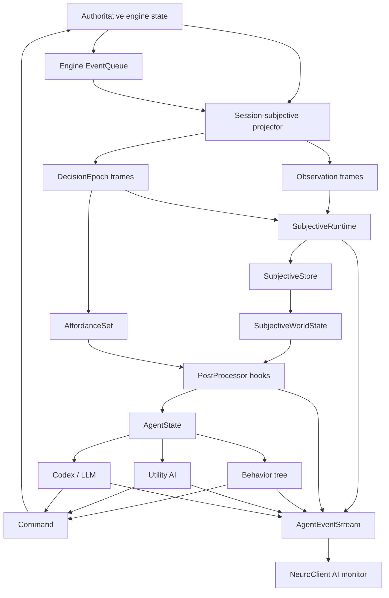
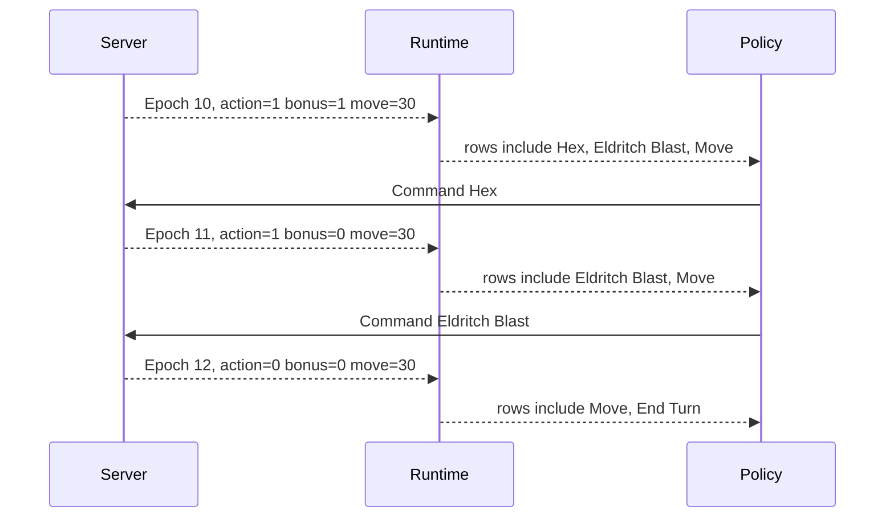
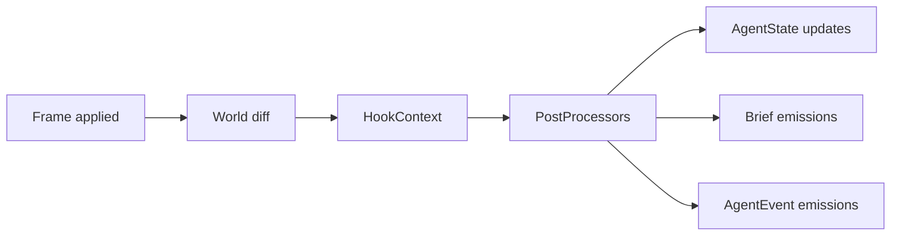
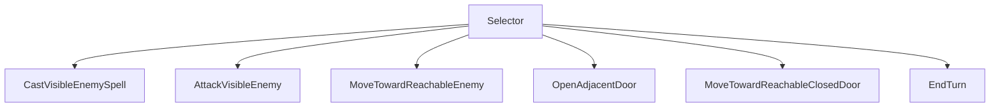

# Complete Agent-Side Client Plan

This document is the full design plan for the agent-side client/runtime layer.
It intentionally combines the ideas that were discussed separately:
subjective observation, local world materialization, decision epochs, legal
affordances, action economy, post-processing hooks, agent event telemetry,
Codex/LLM operation, behavior-tree operation, and NeuroClient monitoring.

The short version: the agent client must become a serious local environment,
not a thin loop that repeatedly asks the server what to do.

## 1. Purpose

The D&D engine already has a strong foundation: game state changes through
events, perception produces subjective facts, and clients interact through API
boundaries. The agent-side client should respect that foundation instead of
becoming a separate ad hoc automation script.

The agent client must:

- receive only session-authorized subjective data;
- materialize that data into a local typed `SubjectiveWorldState`;
- receive legal choices as an `AffordanceSet` at each decision point;
- treat action economy and resources as first-class planning bounds;
- run local post-processors that prepare `AgentState` for downstream policies;
- emit typed `AgentEvent`s so agent behavior can be observed live;
- support simple behavior trees, utility policies, Codex, and future learned
  policies from the same runtime;
- avoid repeated backend queries for facts the agent should already have.

The server remains the authority for rules, legal actions, hidden state, and
game mutations. The agent client is the local subjective control environment.

## 2. Current Runtime

The implementation uses `ai.subjective` plus `ai.policy.PolicyHost` as one
controller stack. Its enforced boundaries are:

- `ai.observation` projects session-subjective snapshots and frames.
- `ai.observation.materializer` can replay frames into a materialized state.
- `ai.subjective` materializes the complete stream and derives typed facts.
- `ai.external_agent` consumes streamed decision epochs through the
  shared policy host without polling `/available-actions`.
- `ai.codex_tools` exposes one persistent local daemon with a bounded turn
  index, typed local query, revision-fenced commands, and takeover lease
  transport.
- `server.event_stream` already provides a mature SSE pattern: `sync`, replay,
  heartbeat, bounded queues, and eviction.
- `server.event_server` exposes both objective live event streams and strict AI
  observation streams.

The runtime has one normal data path:

- bootstrap one session-subjective snapshot;
- reduce ordered observation envelopes into `SubjectiveWorldState`;
- receive legal affordances and action economy in `DecisionEpoch` frames;
- choose through the shared policy host;
- submit `basis_epoch_id + row_id` commands;
- consume command results and follow-up epochs from the same stream;
- publish correlated reasoning telemetry through the agent-event stream.

There is no AI available-action polling endpoint, JSON-to-affordance adapter,
second materialized-state model, or separate external-agent HTTP client. The
remaining work is policy breadth, typed semantics coverage, measured engine
latency, and repeated rotation evidence, not another transport architecture.

## 3. Naming And Core Concepts

Use these names consistently in code, docs, and tests.

### Subjective History

`h_i` is the local history available to the controller.

```text
h_i = (o_0, u_0, o_1, u_1, ..., o_i)
```

Where:

- `o_i` is a subjective observation delivered to the session;
- `u_i` is a command selected by the controller.

This is not objective history. It is the history the controller is allowed to
know.

### SubjectiveWorldState

`SubjectiveWorldState` is the local materialized subjective environment state.

```text
s_hat_i = SubjectiveWorldState = materialize(h_i)
```

It is the agent's current local model of the world. It contains visible facts,
remembered facts, known terrain, known objects, logs, current turn state, and
the current decision epoch.

`SubjectiveWorldState` is not the authoritative engine state. It can be incomplete,
outdated, or missing hidden facts by design.

### AffordanceSet

`AffordanceSet` is the legal command set exposed to this session at a decision
epoch.

```text
F_i = legal commands at epoch i
```

The server computes this from real engine rules. The client does not guess
legal actions.

### AgentState

`AgentState` is the post-processed policy workspace.

```text
x_i = postprocess(h_i, s_hat_i, F_i)
```

It is not a second belief state. It is derived data: route summaries, action
rankings, tactical briefs, warnings, memories, resource summaries, and indexes.

### Command

`Command` is the selected executable choice.

```text
u_i in F_i
u_i = policy(s_hat_i, F_i, x_i)
```

The command references an affordance row from the current epoch. It is executed
through the server.

## 4. Formal Model, Without Pretending This Is A Textbook Solver

The engine is a videogame runtime, not a theoretical POMDP solver. Still, the
POMDP language is useful if used carefully.

```text
s_i       hidden authoritative engine state
o_i       subjective observation emitted to one session
h_i       local subjective history
s_hat_i   materialized SubjectiveWorldState
F_i       legal AffordanceSet at decision epoch i
x_i       derived AgentState workspace
u_i       selected Command, where u_i is in F_i
```

Decision rule:

```text
u_i = policy(s_hat_i, F_i, x_i)
```

The key practical differences from a clean textbook POMDP:

- D&D has variable-length turns.
- A turn can contain several decision epochs.
- Action economy, movement, resources, and action-specific gates bound the
  available sequences.
- Observations can happen after every action, not only after turn end.
- The legal action set is rule-computed by the engine and must be part of the
  decision epoch.
- The agent can maintain derived variables and print briefs through hooks.

The formal model tells us what must be clean:

- no hidden objective state leaks into `SubjectiveWorldState`;
- `AffordanceSet` must be session-safe;
- a command must be chosen from the current legal set;
- replay from history must reconstruct the same local world;
- derived `AgentState` must be downstream from subjective data.

## 5. Why Decision Epochs Exist

A D&D turn is not one decision. A single actor can move, use a bonus action,
attack, use an object, spend resources, trigger reactions, continue after a
miss, lose action economy, or end the turn.

The correct control unit is a `DecisionEpoch`.

```text
Turn_j =
  Epoch_j,0
  -> Command_j,0
  -> Epoch_j,1
  -> Command_j,1
  -> ...
  -> EndTurn
```

Each epoch contains:

- the active actor;
- the subjective world at that moment;
- action economy and resources;
- the legal `AffordanceSet`;
- enough cursor data to reject stale commands.

Epoch reasons:

- `turn_start`;
- `action_completed`;
- `action_rejected`;
- `action_stale`;
- `resync`;
- `reaction_prompt` later;
- `manual_refresh` only for debug surfaces.

The runtime should wake policies at epochs, not just at turn start.

## 6. High-Level Architecture



The architecture has three streams:

- objective server event stream: what happened in the game;
- subjective observation stream: what this session perceived;
- agent event stream: what this controller processed, considered, and chose.

Those streams must not be confused.

## 7. Package Layout

Create a new module:

```text
ai/subjective/
  __init__.py
  models.py
  store.py
  runtime.py
  hooks.py
  processors.py
  indexes.py
  queries.py
  printers.py
  README.md
```

Responsibilities:

- `models.py`: Pydantic contracts for `SubjectiveWorldState`, `AgentState`,
  `DecisionEpoch`, `AffordanceSet`, action economy, commands, command results,
  hook contexts, processor outputs, and agent events.
- `store.py`: deterministic materialization and replay.
- `runtime.py`: hot client runtime for bootstrap, subscribe, command execution,
  resync, and event sinks.
- `hooks.py`: hook registry and processor protocol.
- `processors.py`: built-in post-processors.
- `indexes.py`: map, path, threat, object, resource, and affordance indexes.
- `queries.py`: local query facade over `SubjectiveWorldState + AgentState`.
- `printers.py`: text/JSON renderers for Codex, logs, and debug UI.
- `README.md`: theory, runtime usage, examples, and safety rules.

Keep `ai.observation` as the lower-level projector/materializer package. The new
module can build on it, but the new module is responsible for policy-ready
client state.

Dependency direction:

```text
dnd/server -> emit authoritative and subjective data
ai.observation -> low-level subjective projection
ai.subjective -> client-side materialization, hooks, queries, telemetry
ai.external_agent / ai.external_selfplay / ai.codex_tools -> consume ai.subjective through ai.policy.PolicyHost
```

The engine must not import `ai.subjective`.

## 8. SubjectiveWorldState Model

`SubjectiveWorldState` is the materialized subjective environment.

Sketch:

```python
class SubjectiveWorldState(BaseModel):
    session: SessionView = Field(description="Session identity and authority.")
    encounter: EncounterView | None = Field(default=None)
    observers: dict[str, ObserverView] = Field(default_factory=dict)
    entities: dict[str, EntityFact] = Field(default_factory=dict)
    objects: dict[str, ObjectFact] = Field(default_factory=dict)
    tiles: dict[str, TileFact] = Field(default_factory=dict)
    combat_logs: list[CombatLogView] = Field(default_factory=list)
    current_epoch: DecisionEpoch | None = Field(default=None)
    observation_cursor: int = Field(description="Latest applied observation cursor.")
    epoch_cursor: int = Field(description="Latest applied decision epoch cursor.")
```

`SubjectiveWorldState` should answer:

- who am I controlling?
- whose turn is it?
- what can my controlled observers currently see?
- what have they seen before?
- what entities are visible, remembered, or unknown?
- what objects and tiles are known?
- what logs are visible?
- what is the current epoch and legal command set?

Knowledge states:

- `visible`: true now for at least one controlled observer;
- `seen`: previously seen but not currently visible;
- `remembered`: maintained by memory processors or engine-supported memory;
- `unknown`: not present in the subjective state.

`SubjectiveWorldState` must not include objective hidden facts.

## 9. AffordanceSet Model

`AffordanceSet` is the legal row set for the current epoch.

Sketch:

```python
class AffordanceSet(BaseModel):
    actor_uuid: str
    computed_at_observation_cursor: int
    entity_actions: list[ActionAffordance] = Field(default_factory=list)
    position_actions: list[ActionAffordance] = Field(default_factory=list)
    self_actions: list[ActionAffordance] = Field(default_factory=list)
    object_actions: list[ActionAffordance] = Field(default_factory=list)
    special_commands: list[ActionAffordance] = Field(default_factory=list)
```

`special_commands` includes `End Turn` and later can include reaction prompt
responses or explicit wait/decline choices.

Action row sketch:

```python
class ActionAffordance(BaseModel):
    row_id: str
    template_name: str
    display_name: str
    description: str | None = None
    bucket: Literal["entity", "position", "self", "object", "special"]
    action_category: str
    target_type: str
    can_afford: bool
    cost: ActionCostProfile
    targets: list[ActionTarget] = Field(default_factory=list)
    is_item_use: bool = False
    source_item_uuid: str | None = None
    spell: SpellAffordance | None = None
    weapon: WeaponAffordance | None = None
    tags: list[str] = Field(default_factory=list)
```

The row id must be stable inside one epoch and safe to execute only with that
epoch id.

Example row ids:

```text
entity|Attack_RANGED_MAIN|uuid=hero-uuid
entity|Eldritch Blast|uuid=hero-uuid
position|Move|pos=5,4
self|Dash
object|Open Door|uuid=door-uuid
special|End Turn
```

The server can choose exact row id construction, but it must be deterministic
and unambiguous for the current epoch.

## 10. Action Economy As A First-Class Bound

Action economy is not just metadata. It is the hard budget of the current
turn's decision sequence.

`DecisionEpoch` includes an `ActionEconomyState`.

```python
class ActionEconomyState(BaseModel):
    actor_uuid: str
    actions: int
    bonus_actions: int
    reactions: int
    movement_remaining: int
    extra_attacks: int
    spell_slots: dict[int, ResourcePool] = Field(default_factory=dict)
    resources: dict[str, ResourcePool] = Field(default_factory=dict)
    item_charges: dict[str, ResourcePool] = Field(default_factory=dict)
    gates: list[EconomyGate] = Field(default_factory=list)
    meaningful_commands_remaining: bool
```

Cost profile:

```python
class ActionCostProfile(BaseModel):
    action_cost: int = 0
    bonus_action_cost: int = 0
    reaction_cost: int = 0
    movement_cost: int = 0
    consumes_attack_slot: bool = False
    spell_slot_cost: SpellSlotCost | None = None
    resource_costs: dict[str, int] = Field(default_factory=dict)
    item_charge_costs: dict[str, int] = Field(default_factory=dict)
    affordability: Literal["affordable", "unaffordable", "conditional"]
    affordability_reasons: list[str] = Field(default_factory=list)
```

Economy gates:

- once per turn;
- once per round;
- concentration constraints;
- incapacitated or stunned constraints;
- no reactions;
- no movement;
- no spell slot;
- no equipped weapon;
- target unavailable;
- line of sight unavailable;
- out of range.

Processor outputs should include:

- rows that preserve the main action;
- rows that preserve the bonus action;
- rows that spend movement only;
- rows that consume scarce resources;
- rows that probably end useful offense;
- rows that set up a follow-up;
- possible two-step or three-step sequences within current economy.

Example:

```text
Actor: Skeleton Warlock
Economy: action=1, bonus=1, movement=30, spell slots L1=1/1

Rows:
  Hex -> bonus action + L1 slot
  Eldritch Blast -> action
  Move -> movement
  End Turn -> special

Economy processor:
  possible_sequences:
    1. Hex, Eldritch Blast
    2. Move, Eldritch Blast
    3. Eldritch Blast, Move
```

This matters because the agent should not think only in isolated actions.

## 11. DecisionEpoch Model

Sketch:

```python
class DecisionEpoch(BaseModel):
    epoch_id: str
    epoch_index: int
    basis_observation_cursor: int
    reason: DecisionEpochReason
    actor_uuid: str
    round_number: int
    turn_index: int
    economy: ActionEconomyState
    affordances: AffordanceSet
    created_at: float
```

Epoch reasons:

```python
class DecisionEpochReason(str, Enum):
    TURN_START = "turn_start"
    ACTION_COMPLETED = "action_completed"
    ACTION_REJECTED = "action_rejected"
    ACTION_STALE = "action_stale"
    RESYNC = "resync"
    REACTION_PROMPT = "reaction_prompt"
```

The current actor can have many epochs in one turn.



## 12. Server Contract

The AI stream must include decision epochs and affordances.

Snapshot should include:

```json
{
  "observation_cursor": 42,
  "source_event_cursor": 900,
  "source_combat_log_cursor": 22,
  "session": {},
  "encounter": {},
  "observers": [],
  "known_entities": [],
  "known_objects": [],
  "known_tiles": [],
  "current_epoch": {
    "epoch_id": "epoch-7",
    "epoch_index": 7,
    "actor_uuid": "skeleton-warlock",
    "economy": {},
    "affordances": {}
  }
}
```

Frame categories should include:

- observation patch;
- combat log patch;
- command result;
- decision epoch;
- economy/resource patch if needed;
- sync;
- evicted;
- gap/resync hints.

Command endpoints:

```text
POST /ai/sessions/{session_id}/commands/execute
POST /ai/sessions/{session_id}/commands/end-turn
```

Command request:

```python
class AgentCommandRequest(BaseModel):
    actor_uuid: str
    basis_epoch_id: str
    row_id: str
    extra_target_uuids: list[str] | None = None
    prefer_safe: bool = True
```

Validation:

- session exists;
- actor is controlled by session;
- actor is the current active actor;
- basis epoch is current;
- row id exists in current `AffordanceSet`;
- target data matches the row;
- hidden targets cannot be forged;
- stale commands return structured stale result;
- rejected commands include enough recovery context for resync.

The epoch is the only AI-facing legal-action contract. Human clients retain a
separate `/entity/{entity_uuid}/available-actions` presentation API owned by the
server; it is not an AI runtime input.

## 13. SubjectiveStore And Replay

`SubjectiveStore` owns deterministic local materialization.

Responsibilities:

- load snapshot;
- apply observation frames;
- apply decision epoch frames;
- apply command result frames;
- ignore duplicates;
- detect gaps;
- expose current `SubjectiveWorldState`;
- keep enough local history for debugging;
- drive hook contexts with diffs.

Pseudocode:

```python
def apply_frame(frame: SubjectiveFrame) -> ApplyResult:
    if frame.observation_cursor <= world.observation_cursor:
        return ApplyResult(kind="duplicate")

    if frame.observation_cursor != world.observation_cursor + 1:
        return ApplyResult(
            kind="gap",
            expected=world.observation_cursor + 1,
            actual=frame.observation_cursor,
        )

    previous = world
    world = patch_world_state(world, frame.patches)

    if frame.decision_epoch is not None:
        world.current_epoch = frame.decision_epoch
        world.epoch_cursor += 1

    diff = compute_subjective_diff(previous, world)
    history.append(frame)
    return ApplyResult(kind="applied", world=world, diff=diff)
```

Replay invariant:

```text
materialize(snapshot_0 + frames_1..n) == materialize(snapshot_n)
```

The live engine does not roll back. Replay is for the agent client, tests, and
debugging.

## 14. Hook Pipeline

Hooks are first-class. They are how the runtime prepares useful context without
forcing the agent to manually query everything.

Hook flow:



Hook points:

```python
class HookPoint(str, Enum):
    BOOTSTRAP = "on_bootstrap"
    SNAPSHOT_LOADED = "on_snapshot_loaded"
    FRAME_APPLIED = "on_frame_applied"
    EPOCH_STARTED = "on_epoch_started"
    TURN_STARTED = "on_turn_started"
    ACTION_COMPLETED = "on_action_completed"
    ACTION_REJECTED = "on_action_rejected"
    ACTION_STALE = "on_action_stale"
    TURN_ENDED = "on_turn_ended"
    RESYNC_STARTED = "on_resync_started"
    RESYNC_COMPLETED = "on_resync_completed"
    STREAM_GAP = "on_stream_gap"
    COMBAT_LOG = "on_combat_log"
    VISIBILITY_CHANGED = "on_visibility_changed"
    ENTITY_FACT_CHANGED = "on_entity_fact_changed"
    OBJECT_FACT_CHANGED = "on_object_fact_changed"
    TILE_FACT_CHANGED = "on_tile_fact_changed"
    ECONOMY_CHANGED = "on_economy_changed"
```

Processor protocol:

```python
class PostProcessor(Protocol):
    name: str
    order: int

    def run(self, context: HookContext) -> list[ProcessorOutput]:
        ...
```

Processor outputs:

- `DerivedVariableUpdate`;
- `DerivedVariableDelete`;
- `BriefEmission`;
- `TraceEmission`;
- `Alert`;
- `PolicyHint`;
- `AgentEventEmission`;
- `NoOp`.

Rules:

- processors can read `SubjectiveWorldState`, `AffordanceSet`, diffs, and current
  `AgentState`;
- processors can write derived state;
- processors cannot mutate authoritative game state;
- processors cannot call objective-state endpoints;
- processors should not call `/available-actions`;
- presentational processors can emit text/JSON briefs;
- pure processors should stay deterministic for replay tests.

## 15. Built-In Post-Processors

### AffordanceIndexProcessor

Builds indexes:

- row id to row;
- category to rows;
- target uuid to rows;
- target position to rows;
- item uuid to rows;
- cost type to rows;
- action tags to rows.

Tags examples:

- `attack`;
- `spell`;
- `movement`;
- `object_use`;
- `defensive`;
- `buff`;
- `resource_spender`;
- `end_turn`.

### ActionEconomyProcessor

Builds:

- action economy summary;
- rows that preserve action;
- rows that preserve bonus action;
- rows that are movement-only;
- rows that spend spell slots;
- rows that spend class resources;
- likely terminal rows;
- possible follow-up sequences.

Example variable:

```json
{
  "name": "possible_sequences",
  "value": [
    ["Hex", "Eldritch Blast"],
    ["Move", "Eldritch Blast"],
    ["Eldritch Blast", "Move"]
  ]
}
```

### TopologyProcessor

Builds known topology from subjective tile facts:

- walkable tiles;
- unknown tiles;
- water or high-cost tiles;
- hazards;
- directional movement blockers;
- directional vision blockers;
- doors and other object blockers when visible/known.

It must not invent unknown terrain.

### PathAnalysisProcessor

Computes route summaries:

- route to visible enemies;
- route to remembered enemies;
- route to known closed doors;
- safe movement alternatives;
- blocked route explanations;
- hazard route warnings;
- follow-up attack availability after a movement row.

This processor is where the live-test water mistake gets fixed. Movement should
be evaluated using path/topology data, not Manhattan distance.

### TargetProcessor

Ranks targets using:

- visibility;
- reachability;
- available attack/spell rows;
- known HP;
- known AC if available;
- threat proximity;
- faction;
- death state.

It separates visible enemies from remembered/last-known enemies.

### ObjectInteractionProcessor

Finds:

- adjacent usable objects;
- known closed doors;
- reachable adjacent door squares;
- object-use rows linked to known object facts.

Door use actions often appear only once adjacent. The processor must support
the "move to door, then open door" pattern.

### CombatMemoryProcessor

Maintains:

- last action outcome;
- recent damage;
- recent misses;
- kills;
- newly revealed enemies;
- last-known enemy positions;
- new information since previous epoch.

### TurnBriefProcessor

Produces compact epoch briefs for Codex and debug UI.

Example:

```text
Actor: Skeleton Warlock
Epoch: 12, round 1, turn 3
Economy: action 1, bonus 1, movement 30, L1 slots 1/1
Visible enemies: Hero at (7, 4), 35 ft
Top rows:
  entity|Eldritch Blast|uuid=hero : action spell, target visible
  position|Move|pos=5,4 : safe path, preserves action
Warnings:
  direct route through water is slow; corridor route is safer
```

### DebugTraceProcessor

Emits:

- frame apply duration;
- hook duration;
- processor output count;
- row counts;
- selected command;
- command result;
- resync and stale-command events.

## 16. AgentState Workspace

`AgentState` is the prepared policy workspace.

Sketch:

```python
class AgentState(BaseModel):
    variables: dict[str, Any] = Field(default_factory=dict)
    indexes: AgentIndexes = Field(default_factory=AgentIndexes)
    briefs: list[BriefEmission] = Field(default_factory=list)
    alerts: list[Alert] = Field(default_factory=list)
    hints: list[PolicyHint] = Field(default_factory=list)
    trace: list[TraceEmission] = Field(default_factory=list)
```

Useful variables:

- `current_actor_summary`;
- `action_economy_summary`;
- `visible_enemy_summary`;
- `remembered_enemy_summary`;
- `reachable_enemy_routes`;
- `closed_door_routes`;
- `usable_object_rows`;
- `best_attack_rows`;
- `best_spell_rows`;
- `movement_rows_with_followup`;
- `possible_sequences`;
- `blocked_or_hazardous_routes`;
- `resource_delta_this_turn`;
- `last_action_outcome`;
- `new_information_since_last_epoch`;
- `latest_turn_brief`.

`AgentState` can be recomputed or maintained incrementally. Either way, it is
downstream from `SubjectiveWorldState` and `AffordanceSet`.

## 17. Local Query API

The query API reads only local runtime data.

Required methods:

```python
runtime.query.current_epoch()
runtime.query.active_actor()
runtime.query.action_economy()
runtime.query.affordances()
runtime.query.row(row_id)
runtime.query.visible_enemies()
runtime.query.remembered_enemies()
runtime.query.known_allies()
runtime.query.known_closed_doors()
runtime.query.usable_adjacent_objects()
runtime.query.reachable_positions()
runtime.query.path_to((x, y))
runtime.query.routes_to_enemy(enemy_uuid)
runtime.query.routes_to_object(object_uuid)
runtime.query.safe_movement_rows()
runtime.query.attack_rows_for(enemy_uuid)
runtime.query.spell_rows_for(enemy_uuid)
runtime.query.resource_summary()
runtime.query.possible_followups_after(row_id)
runtime.query.what_changed_since_last_epoch()
runtime.query.latest_brief()
```

Critical rule:

```text
Local query methods must not call /available-actions or objective-state endpoints.
```

If a local query cannot know something, it returns unknown or absent. It does
not cheat.

## 18. SubjectiveRuntime

`SubjectiveRuntime` is the long-lived local agent environment.

Responsibilities:

- bootstrap from snapshot;
- subscribe to the observation stream;
- apply frames;
- run hooks;
- maintain `SubjectiveWorldState`;
- maintain `AgentState`;
- expose local queries;
- execute commands;
- end turns;
- handle stale commands;
- resync on gaps;
- emit agent events.

Sketch:

```python
class SubjectiveRuntime:
    def __init__(
        self,
        base_url: str,
        session_id: str,
        event_sink: AgentEventSink,
        processors: list[PostProcessor],
    ) -> None: ...

    def bootstrap(self) -> None: ...
    def run_forever(self) -> None: ...
    def wait_for_epoch(self) -> DecisionEpoch: ...
    def execute(self, row_id: str, **options: Any) -> CommandResult: ...
    def end_turn(self) -> CommandResult: ...
    def resync(self) -> None: ...
```

Normal loop:

```text
bootstrap
subscribe
wait for epoch
policy reads SubjectiveWorldState, AffordanceSet, AgentState
policy selects row
execute row
apply resulting frames
repeat while still my epoch
end turn
```

Network calls allowed in normal loop:

- snapshot/bootstrap;
- stream subscribe/resync;
- command execute;
- command end-turn;
- takeover heartbeat if applicable;
- agent event ingestion.

Network calls not allowed in normal loop:

- available-actions fetch;
- objective `/state`;
- objective `/visibility`;
- hidden debug endpoints.

## 19. Agent Event Stream

Agent behavior must be evented. This follows the engine philosophy and lets
NeuroClient display agent reasoning live.

Existing server stream pattern:

```text
GET /events/subscribe
  -> sync
  -> replay missed game_event frames
  -> replay missed combat_log frames
  -> live queue
  -> heartbeat
  -> evicted
```

New agent stream pattern:

```text
GET /ai/sessions/{session_id}/agent-events/subscribe
  -> sync
  -> replay missed agent_event frames
  -> live queue
  -> heartbeat
  -> evicted
```

Reuse:

- `BoundedSubscription`;
- `EvictedPayload`;
- `format_sse`;
- the same heartbeat style;
- the same queue overflow behavior;
- the same replay-first subscription behavior.

Agent event models:

```python
class AgentEvent(BaseModel):
    event_id: str
    session_id: str
    actor_uuid: str | None = None
    epoch_id: str | None = None
    observation_cursor: int | None = None
    event_type: str
    level: Literal["debug", "info", "warning", "error"]
    source: str
    summary: str
    payload: dict[str, Any] = Field(default_factory=dict)
    tags: list[str] = Field(default_factory=list)
    created_at: float
```

Stream payload:

```python
class AgentEventPayload(BaseModel):
    event_index: int
    agent_cursor: int
    observation_cursor: int | None = None
    epoch_id: str | None = None
    event: AgentEvent
```

Stream id:

```text
a=<agent_cursor>;o=<observation_cursor>
```

Event families:

- `runtime.bootstrap_started`;
- `runtime.bootstrap_completed`;
- `stream.connected`;
- `stream.frame_applied`;
- `stream.gap_detected`;
- `stream.resync_started`;
- `stream.resync_completed`;
- `epoch.started`;
- `epoch.ended`;
- `turn.started`;
- `turn.ended`;
- `processor.started`;
- `processor.completed`;
- `processor.variable_updated`;
- `processor.brief_emitted`;
- `processor.alert_emitted`;
- `policy.tick_started`;
- `policy.candidate_rows_ranked`;
- `policy.command_selected`;
- `policy.no_command_found`;
- `command.submitted`;
- `command.accepted`;
- `command.rejected`;
- `command.stale`;
- `query.executed`;
- `error`.

Endpoint set:

```text
POST /ai/sessions/{session_id}/agent-events
GET  /ai/sessions/{session_id}/agent-events?since=<cursor>&limit=<n>&event_type=<type>&level=<level>
GET  /ai/sessions/{session_id}/agent-events/subscribe?since=<cursor>
```

External subprocesses post agent events back to the server. The server stores a
bounded per-session history and fans out through SSE.

## 20. Agent Event Sinks

`SubjectiveRuntime` should not hardcode where events go.

```python
class AgentEventSink(Protocol):
    def emit(self, event: AgentEvent) -> None: ...
    def emit_many(self, events: list[AgentEvent]) -> None: ...
```

Built-ins:

- `MemoryAgentEventSink`: test and local replay.
- `LoggingAgentEventSink`: structured logs.
- `HttpAgentEventSink`: posts to server.
- `CompositeAgentEventSink`: fan-out to several sinks.

The external AI should use:

```text
CompositeAgentEventSink([LoggingAgentEventSink, HttpAgentEventSink])
```

Noisy processor events should be batched per epoch/action boundary to avoid
lag.

## 21. Relationship To NeuroClient

NeuroClient should not need to infer AI behavior only from final game actions.

Optional debug panels can subscribe to:

```text
/ai/sessions/{session_id}/agent-events/subscribe
```

Possible UI:

- latest AI brief;
- current epoch id;
- current action economy;
- ranked candidates;
- selected command;
- command result;
- route warnings;
- stale/resync/errors;
- recent processor alerts.

This should not disrupt existing human client flow:

- `/state`;
- `/visibility`;
- `/events/subscribe`;
- `/entity/{uuid}/available-actions`;
- `/action/execute`;
- `/action/end-turn`.

The new agent stream is additive.

## 22. Codex And LLM Consumption

Codex should not receive a bare list of IDs and then manually rediscover the
map. It should receive prepared context first.

Default `watch` output should include:

- session id;
- current epoch id;
- actor summary;
- action economy summary;
- visible enemies;
- remembered enemies if relevant;
- top attack/spell rows;
- usable objects;
- route warnings;
- resource warnings;
- latest action result;
- row table;
- latest brief text.

Codex can still query local runtime details, but the default posture is:

```text
post-process first, prompt/query second
```

Relationship to Recursive Language Models:

- RLM inspiration: context can live as an external programmable environment.
- Here the environment is typed `SubjectiveWorldState + AgentState`, not a text blob.
- The LLM does not have to query everything manually.
- Post-processors can write variables or print briefs proactively.
- Prompt text is not source of truth.

Useful links for the eventual README:

- https://alexzhang13.github.io/blog/2025/rlm/
- https://arxiv.org/abs/2512.24601

## 23. Behavior Tree And Utility AI Consumption

The same runtime must support non-LLM policies.

Behavior tree should read:

- current epoch;
- indexed affordances;
- target summaries;
- object/door summaries;
- route summaries;
- action economy summaries.

V1 behavior tree can stay simple:



But its movement leaf must use path/topology data:

```text
bad: choose movement row with lowest Manhattan distance
good: choose movement row with safe known path and best follow-up affordances
```

Utility AI can score rows using:

- expected damage;
- resource cost;
- action economy preservation;
- route safety;
- target priority;
- follow-up sequence value;
- survival risk.

Both policies consume the same `SubjectiveWorldState`, `AffordanceSet`, and `AgentState`.

## 24. External AI Migration

Current loop:

```text
fetch snapshot
fetch available actions
reduce state
choose action
execute action
fetch snapshot again
```

Target loop:

```text
bootstrap SubjectiveRuntime
wait for DecisionEpoch
read SubjectiveWorldState + AffordanceSet + AgentState
choose Command
execute row id
apply resulting frames
repeat while same session owns active actor
end turn when no useful command remains
```

`ai.external_agent` consumes only local epoch affordances. It has no
available-action polling or snapshot-replacement fallback path.

Instrumentation must show:

- epoch received;
- row counts;
- top candidates;
- selected command;
- command result;
- stale/resync;
- final turn end.

## 25. Safety And Hidden Information

The whole system is only valid if hidden information stays hidden.

Rules:

- `SubjectiveWorldState` contains only session-authorized subjective facts.
- `AffordanceSet` cannot expose hidden targets.
- `AgentState` can only derive from `SubjectiveWorldState`, `AffordanceSet`, command
  results, and local hypotheses.
- `AgentEvent` payloads cannot include objective hidden state.
- Hypotheses must be marked as hypotheses.
- Server validates agent-event actor UUIDs where applicable.
- Command execution validates session ownership and current epoch.
- Local queries return unknown rather than cheating.

Examples:

- Hidden enemy blocks line of sight: the affordance row should not reveal the
  enemy; if an action is impossible, the reason must stay subjective.
- Remembered enemy last seen at a position: route processors can plan toward
  that last-known point, but must label it as remembered.
- Agent suspects an invisible enemy: that is a hypothesis in `AgentState`, not
  a fact in `SubjectiveWorldState`.

## 26. Failure And Resync Semantics

Failure cases:

- stream gap;
- duplicate frame;
- stale command;
- rejected command;
- subprocess reconnect;
- agent event ingestion failure;
- server reset;
- takeover release or expiry.

Required behavior:

- duplicate frames are ignored;
- gaps emit agent events and trigger snapshot resync;
- stale commands return structured stale result;
- rejected commands run `on_action_rejected` and produce recovery context;
- resync rebuilds `SubjectiveWorldState` and `AgentState`;
- agent event ingestion failure logs locally and retries/batches when possible;
- reset clears session-local stream history and active epochs.

Stale command result sketch:

```json
{
  "status": "stale",
  "requested_epoch_id": "epoch-12",
  "current_epoch_id": "epoch-13",
  "message": "Command basis is no longer current.",
  "resync_required": true
}
```

## 27. Server Stream Reuse Details

The current stream code provides these reusable pieces:

- `BoundedSubscription`;
- `EvictedPayload`;
- `format_sse`;
- cursor-first subscription behavior;
- heartbeat behavior;
- overflow eviction behavior.

Do not create a new SSE style.

Agent stream endpoint should follow this order:

```python
async def event_generator():
    yield format_sse("sync", sync_payload, current_agent_stream_id(session_id))

    for payload in agent_event_stream.iter_agent_events_since(session_id, since):
        yield format_sse("agent_event", payload, make_agent_stream_id(...))

    while True:
        if await request.is_disconnected():
            break
        try:
            envelope = await asyncio.wait_for(subscription.get(), timeout=10.0)
        except asyncio.TimeoutError:
            yield format_sse("heartbeat", heartbeat_payload, current_id)
            continue

        yield format_sse(envelope["event"], envelope["data"], envelope.get("id"))
        if envelope["event"] == "evicted":
            break
```

This mirrors `/events/subscribe`.

## 28. README Requirements

The eventual `ai/subjective/README.md` should be a real module manual, not a
placeholder.

Required sections:

1. What this module is.
2. Current problem it solves.
3. Formal notation: `h_i`, `s_hat_i`, `F_i`, `x_i`, `u_i`.
4. Why turns contain multiple decision epochs.
5. SubjectiveWorldState versus objective engine state.
6. AgentState as derived workspace.
7. AffordanceSet as legal command set.
8. Action economy as the hard turn budget.
9. Server stream contracts.
10. Store and replay.
11. Hook lifecycle.
12. Built-in processors.
13. Local query API.
14. Agent event stream.
15. Codex/LLM consumption.
16. Behavior tree and utility AI consumption.
17. NeuroClient monitoring.
18. Failure, stale command, and resync semantics.
19. Safety rules.
20. Examples.

Must-never list:

- never expose hidden objective state;
- never compute legal actions locally by guessing rules;
- never require policies to query backend for basic decision data;
- never use prompt text as source of truth;
- never let `AgentState` replace `SubjectiveWorldState`;
- never rank movement by Manhattan distance when path data exists;
- never drop agent cognition on the floor without telemetry.

## 29. Example: Warlock Turn

```text
Epoch 20
Actor: Skeleton Warlock
SubjectiveWorldState:
  Hero visible at (7, 4)
  Water known between (4, 4) and (5, 4)
  Door remembered at (3, 2)
Economy:
  action=1, bonus=1, movement=30, L1 slots=1/1
AffordanceSet:
  Eldritch Blast -> Hero
  Hex -> Hero
  Move -> several positions
  End Turn
AgentState:
  best_spell_rows = [Eldritch Blast, Hex]
  route_warning = "direct route through water is slow"
  possible_sequences = [["Hex", "Eldritch Blast"], ["Move", "Eldritch Blast"]]
Policy:
  choose Hex if buff logic enabled, otherwise Eldritch Blast
AgentEvent:
  policy.command_selected with row id and reason
```

After command:

```text
Epoch 21
Economy changed.
AffordanceSet recomputed.
AgentState updated by processors.
Policy acts again or ends turn.
```

## 30. Example: Closed Door With No Visible Enemy

```text
Epoch 5
SubjectiveWorldState:
  no visible enemies
  closed door visible at (4, 2)
  actor at (1, 2)
AffordanceSet:
  Move rows
  End Turn
AgentState:
  closed_door_routes = route to adjacent square (3, 2)
Policy:
  choose Move toward door
```

Next epoch:

```text
Epoch 6
SubjectiveWorldState:
  actor adjacent to door
AffordanceSet:
  Open Door row appears
AgentState:
  usable_object_rows = [Open Door]
Policy:
  choose Open Door
```

This is why object routing and affordance epochs both matter.

## 31. Implementation Phases

### Phase 1: Models And Documentation

- Add `ai/subjective/README.md`.
- Add core Pydantic model skeletons.
- Keep runtime behavior unchanged.

### Phase 2: Decision Epochs In Observation Stream

- Extend AI snapshot with `current_epoch`.
- Extend frames with decision epoch patches.
- Generate affordances server-side at epoch boundaries.
- Do not expose a separate AI available-actions endpoint.

### Phase 3: Command Endpoints

- Add execute/end-turn command endpoints under `/ai/sessions/...`.
- Validate epoch id and row id.
- Return structured accepted/rejected/stale results.

### Phase 4: SubjectiveRuntime And Store

- Build local `SubjectiveWorldState` store.
- Apply snapshot/frames.
- Detect duplicates/gaps.
- Add resync.

### Phase 5: Hooks, Processors, AgentState

- Add hook registry.
- Add built-in processors.
- Add local query layer.
- Add printers.

### Phase 6: AgentEventStream

- Add server-side agent event stream using existing SSE machinery.
- Add agent event sinks.
- Wire runtime/hook/policy events.

### Phase 7: External AI Migration

- Move external AI from polling available-actions to epochs.
- Use local query and `AgentState`.
- Keep behavior simple but route-aware.

### Phase 8: Codex Tool Migration

- Make `watch` return epoch briefs and row tables.
- Make `actions` read epoch affordances.
- Make `execute` use row id plus epoch id.
- Keep takeover behavior.

### Phase 9: NeuroClient Debug Integration

- Optional AI monitor panel subscribes to agent events.
- No disruption to human gameplay endpoints.

## 32. Test Plan

Run focused test files only. Do not run the entire suite.

### Observation And Epoch Tests

- snapshot includes epoch and affordances on AI turn;
- snapshot has no epoch when session is not active;
- turn start emits epoch;
- action completion emits command result and next epoch;
- rejection/stale emits structured recovery;
- hidden enemies do not leak through entity facts or affordances.

### Action Economy Tests

- every row has a cost profile;
- action, bonus action, movement, extra attack, spell slot, class resource, and
  item charge costs update economy;
- unaffordable rows either disappear or explain affordability reasons;
- follow-up sequence processor respects remaining budget.

### Store And Replay Tests

- snapshot plus frames reconstructs fresh snapshot;
- snapshot plus frames reconstructs latest epoch;
- duplicate frames are idempotent;
- cursor gaps trigger resync;
- command results enter history.

### Hook And Processor Tests

- hooks run in deterministic order;
- processor outputs update `AgentState`;
- presentational processors emit briefs without mutating `SubjectiveWorldState`;
- duplicate frames do not duplicate memory;
- resync rebuilds workspace;
- topology marks water, blockers, hazards, and high-cost tiles;
- path analysis avoids Manhattan-only mistakes;
- target processor separates visible and remembered targets;
- object processor identifies adjacent and reachable doors.

### Runtime Tests

- bootstrap builds `SubjectiveWorldState` and `AgentState`;
- frames apply idempotently;
- local queries do not call `/available-actions`;
- stale command triggers resync;
- stream gap triggers resync;
- latest brief updates at each epoch.

### Agent Event Stream Tests

- `AgentStreamSyncPayload` formats through `format_sse`;
- publish assigns monotonic per-session cursors;
- replay returns events after cursor;
- subscription receives `agent_event` envelopes;
- overflow emits `evicted`;
- heartbeat carries current `agent_cursor`;
- session A cannot read session B events;
- ingestion rejects invalid session ids;
- ingestion rejects uncontrolled actor UUIDs.

### Policy Tests

- external AI consumes epoch affordances;
- caster uses available offensive spell before walking into melee;
- movement uses path/topology;
- closed-door behavior still works;
- no useful command ends turn.

### Integration Tests

- NeuroClient human flow unchanged;
- standard arena still works;
- Codex takeover receives epoch briefs and row ids;
- the AI available-action polling route is absent.

## 33. Acceptance Criteria

This feature is complete when:

- AI can play a full variable-length turn using snapshot/stream plus
  execute/end-turn commands only;
- `SubjectiveWorldState`, `AgentState`, `AffordanceSet`, `DecisionEpoch`, and `Command`
  are explicit typed concepts;
- legal affordances are present in decision epochs;
- action economy and resources are first-class in epochs, rows, processors,
  queries, and tests;
- post-processors prepare useful policy workspace and briefs automatically;
- agent behavior emits typed `AgentEvent`s;
- NeuroClient can subscribe to agent telemetry without disrupting human flow;
- Codex, behavior tree, and utility AI consume the same runtime;
- tests prove replay correctness, hidden-information safety, hook behavior,
  economy handling, local query behavior, stale command handling, agent event
  stream behavior, and removal of the normal backend action-query loop.
