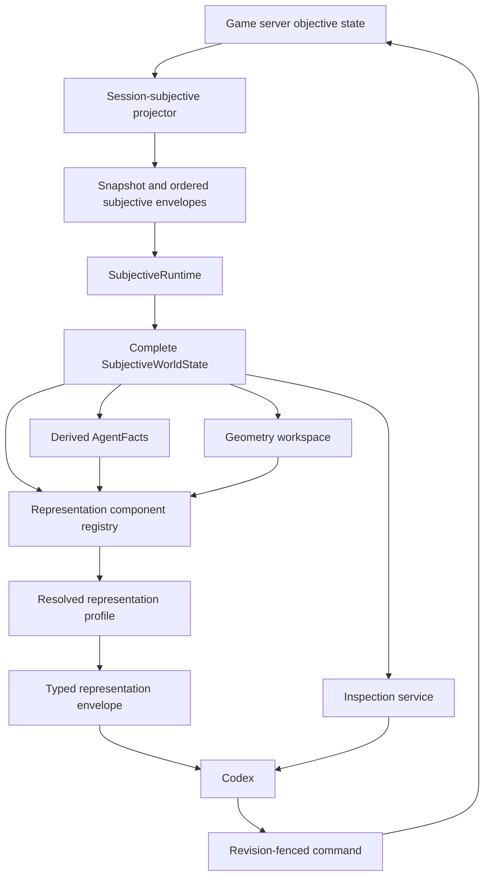

# Codex Subjective Representation Runtime

## Implementation Plan

Status: implementation specification

Primary objective: replace the current hardcoded Codex turn projection with a
typed, inspectable, profile-driven representation system while preserving the
complete local subjective state and leaving the traditional AI behavior
unchanged.

This document is the implementation authority for the first delivery. Later
changes must preserve the invariants and compatibility rules defined here or
update this document and the corresponding tests in the same change.

## 1. Motivation

The hot Codex runtime already has the correct transport foundation:

1. It bootstraps one session-subjective snapshot through HTTP.
2. It consumes ordered subjective event envelopes through SSE.
3. It materializes a complete local `SubjectiveWorldState`.
4. Decision epochs contain server-issued legal affordances.
5. Commands are revision fenced by observation cursor and epoch id.
6. Command outcomes and follow-up epochs return through the subjective stream.

The weakness is above that foundation. `HotCodexSession._turn_index_unlocked()`
currently combines several different operations in one response without
describing their semantics:

- lossless selections from subjective state;
- deterministic classifications;
- lossy summaries and truncation;
- derived combat beliefs;
- hardcoded warnings;
- traditional-policy advice;
- runtime telemetry.

Those operations cannot currently be enabled, disabled, compared, audited, or
ablated independently. The traditional policy runs eagerly for every Codex turn
view, so an ostensibly direct Codex controller is anchored by another policy.
At the same time, the agent cannot configure the formal post-processors or
inspect their outputs through the hot HTTP interface.

The new system must make every representation choice explicit without reducing
the underlying subjective information available to the agent.

## 2. Non-Negotiable Invariants

### 2.1 Subjectivity

- The only world input is the complete local session-subjective state.
- No processor, predicate, inspection query, oracle, telemetry event, or debug
  response may consult objective server state.
- Known, visible, remembered, known false, and unknown remain distinct.
- Missing information must never silently become false.
- Geometry caches are scoped to the session, observer or actor, subjective
  revision, capabilities, and algorithm version.
- A profile can hide information from automatic presentation but cannot create
  an objective-state escape hatch.

### 2.2 Authority

- The server remains the sole authority for legal actions and mutations.
- Local pathfinding and logical composition support reasoning only.
- Only a server-issued current-epoch row id can be executed.
- Local helpers never manufacture executable affordances.

### 2.3 Complete Local Inspection

- The full materialized subjective state always remains available locally.
- Every lossy representation component declares exactly what it omits.
- Every omitted locally available datum has a documented recovery path.
- Inspection reads are revision fenced and side-effect free.
- The first delivery exposes no arbitrary code execution.

### 2.4 Traditional AI Isolation

- `ai.external_agent`, the current policy host, candidate generation, behavior
  tree, utilities, routines, commitments, and policy memory are not changed by
  this feature.
- The new representation system may read existing `AgentFacts` and may call the
  existing policy as an optional oracle.
- The default balanced Codex profile does not run or expose the policy oracle
  before action selection.
- The compatibility profile preserves the current eager policy behavior.

### 2.5 Experimental Reproducibility

- Every representation component has a stable id and semantic version.
- Definitions are separate from profile selections.
- Every resolved profile has a deterministic content digest.
- Match evidence records the resolved profile, component versions, parameters,
  component timing, output sizes, focus changes, inspections, and oracle use.
- An ablation can change one named representation component without changing
  unrelated behavior.

## 3. Architecture



The complete state, derived workspace, presentation, inspection, policy, and
telemetry are separate concepts:

```text
SubjectiveWorldState
    canonical local subjective truth and memory

AgentFacts
    deterministic typed indexes derived from that state

PredicateLedger
    revision-scoped typed values and three-valued propositions

RepresentationEnvelope
    selected material automatically delivered to an agent

InspectionService
    full local recovery and exploration surface

PolicyOracle
    optional tactical opinion generated from the same subjective state

AgentEvent telemetry
    observational record, excluded from decision context unless explicitly selected
```

## 4. Current Interface Inventory

The current turn response must first be represented exactly as a profile named
`codex.current-v1`. This is not the desired default, but it is the compatibility
baseline.

| Current output | Source | Transform | Information removed | Role |
|---|---|---|---|---|
| revision | local world | field selection | source event/log causality | state selection |
| encounter state | local world | field selection | round, turn, initiative detail | state selection |
| actor and economy | entity fact and epoch | identity | inactive actor and complete epoch metadata | state selection |
| contact groups | known entities | classification | remembered allies and contact visibility detail | deterministic derivation |
| known objects | known objects | identity | none from object list | state selection |
| combat hypotheses | AgentFacts | Bayesian derivation | other AgentFacts sections | belief derivation |
| topology | known tiles | aggregation | light, conditions, exact costs, knowledge detail | lossy summary |
| action index | epoch rows | counts and bounded multi-target rows | complete rows, costs, geometry, semantics | lossy summary |
| selected policy | PolicyHost | policy decision | non-selected candidates and most trace | policy advice |
| combat logs | subjective logs | last 3, 8 children | older logs, deep children, typed detail | truncation |
| warnings | local world | two hardcoded rules | all other potential alerts | attention control |
| timings | local runtime | measurement | most stream and processor timing | telemetry |

The implementation must capture this inventory as machine-readable component
specifications, not only as documentation.

## 5. New Module Layout

Add a new package below the existing Codex adapter:

```text
ai/codex_tools/representation/
    __init__.py
    models.py
    registry.py
    predicates.py
    inspection.py
    components.py
    profiles.py
    projector.py
```

Responsibilities:

- `models.py`: dependency-light Pydantic contracts and enums.
- `registry.py`: deterministic component and profile registration.
- `predicates.py`: fact catalog, predicate ledger, focus, and evaluation.
- `inspection.py`: revision-bound get, search, select, diff, schema, and export.
- `components.py`: built-in Codex representation components.
- `profiles.py`: compatibility and balanced profile definitions.
- `projector.py`: resolve a profile and evaluate selected components.

The package may import `ai.observation`, `ai.knowledge`, `ai.protocol`, and
`ai.subjective`. Only the optional oracle component may import `ai.policy`.
Core representation models, inspection, predicates, and non-oracle components
must not import `ai.policy`.

## 6. Representation Type System

### 6.1 Roles

`RepresentationRole`:

- `STATE_SELECTION`: retain canonical subjective fields.
- `STATE_INDEX`: produce lookup structures without changing meaning.
- `DETERMINISTIC_DERIVATION`: compute exact consequences of disclosed data.
- `BELIEF_DERIVATION`: estimate uncertain facts from subjective evidence.
- `COMPUTATIONAL_AUGMENTATION`: geometry, option proofs, or other cognitive work.
- `ATTENTION_CONTROL`: determine salience or automatic exposure.
- `POLICY_ADVICE`: recommend a choice.
- `LEARNING_FEEDBACK`: compare a committed choice with another evaluator.
- `PRESENTATION`: render typed blocks into text or another display form.
- `TELEMETRY`: record runtime behavior without changing gameplay truth.

### 6.2 Information transforms

`InformationTransform`:

- `IDENTITY`
- `SELECT`
- `FILTER`
- `PARTITION`
- `GROUP`
- `AGGREGATE`
- `TRUNCATE`
- `INFER`
- `PREDICT`
- `RANK`
- `RENDER`

### 6.3 Exposure timing

`ExposureTiming`:

- `NEVER`
- `BOOTSTRAP`
- `DECISION_EPOCH`
- `AFTER_ACTION`
- `AFTER_RESULT`
- `END_TURN`
- `END_ENCOUNTER`
- `ON_DEMAND`

### 6.4 Recoverability

`Recoverability`:

- `NOT_APPLICABLE`: no source information was removed.
- `LOCAL_GET`: exact path lookup restores the source.
- `LOCAL_SELECT`: typed selection restores the source.
- `LOCAL_SEARCH`: search can discover the source path or identity.
- `LOCAL_EXPORT`: canonical export contains the source.
- `NOT_RECOVERABLE`: derived or discarded information cannot be recovered.

`NOT_RECOVERABLE` is invalid for omitted canonical subjective data in a normal
Codex profile.

### 6.5 Omission contract

`OmissionContract` records:

- source domains;
- omitted paths or path patterns;
- filtering predicate;
- ordering rule;
- item and depth limits;
- whether omitted counts are reported;
- recoverability methods;
- human-readable rationale.

### 6.6 Component specification

`RepresentationComponentSpec` fields:

```text
component_id
version
title
description
role
semantic_intent
input_domains
output_model
transform
omission_contract
subjectivity_contract
deterministic
default_exposure
supported_exposures
parameter_schema
implementation_ref
```

The specification describes meaning and invariants. It does not say whether a
particular experiment enables the component.

### 6.7 Component selection

`RepresentationComponentSelection` fields:

```text
component_id
enabled
exposure
parameters
```

Selections are immutable once a profile is resolved for an encounter unless an
explicit profile change is recorded as an agent event. Focus changes are not
profile changes because they select predicate delivery within a declared focus
component.

### 6.8 Profile and manifest

`RepresentationProfile` contains a profile id, version, description, and
ordered component selections.

`ResolvedRepresentationManifest` contains:

- selected profile identity;
- resolved component specs and parameters;
- component ordering;
- code/version references;
- deterministic manifest digest;
- creation timestamp;
- compatibility metadata.

### 6.9 Component result

Each component emits a `RepresentationBlock`:

```text
component_id
component_version
role
observation_cursor
epoch_id
generated_at
payload
source_paths
omitted_item_count
recovery_hints
timing_ms
payload_bytes
warnings
```

Payloads are Pydantic models internally and JSON-compatible on the wire. The
first delivery may use a discriminated union of known built-in block models;
it must not degrade every payload to an unvalidated arbitrary dictionary.

## 7. Predicate And Fact Ledger

### 7.1 Existing logical foundation

Reuse:

- `FactValue`
- `TruthValue`
- `FactPredicate`
- `FactExpression`
- `evaluate_fact_expression()`
- `LogicalStep`
- `OptionContract`

The existing three-valued logic is mandatory. Missing or unknowable facts
evaluate to `UNKNOWN`, not `FALSE`.

### 7.2 Derived facts versus predicates

A derived fact computes a typed value from the complete subjective state. A
predicate compares or composes facts. A policy preference is neither one.

Examples:

```text
fact: actor.visible_hostile_count = 2
predicate: actor.visible_hostile_count > 0 -> TRUE
preference: when concentration is active, prefer non-concentration offense
```

Recommendations must never be stored as true environmental propositions.

### 7.3 Fact definitions

`DerivedFactDefinition` fields:

```text
fact_id
version
description
value_type
semantic_intent
dependencies
source_domains
trigger_points
persistence_scope
subjectivity_contract
evaluator_id
```

The first delivery supports built-in evaluators only. Agent-submitted Python is
explicitly deferred.

### 7.4 Fact observations

`DerivedFactObservation` fields:

```text
fact_id
observation_cursor
epoch_id
value
truth
evidence_refs
evaluator_id
evaluator_version
error
```

For scalar facts, `truth` indicates whether the value is known. For boolean
facts, `truth` and `value` agree. An evaluator failure records an error and an
unknown result; it never fabricates false.

### 7.5 Predicate definitions and evaluations

`PredicateDefinition` contains a stable id, description, semantic intention,
and JSON-native `FactExpression`.

`PredicateEvaluation` contains the definition id, revision, `TruthValue`,
referenced fact ids, evidence references, and timing.

### 7.6 Focus

`PredicateFocusProfile` contains:

- `always_include`
- `include_when_true`
- `include_when_false`
- `include_when_unknown`
- `include_when_changed`
- `query_only`
- `max_automatic_items`
- deterministic overflow ordering.

Focus affects only automatic presentation. All evaluated predicates remain
available through inspection.

### 7.7 Built-in facts for the first delivery

At minimum:

- `actor.is_active`
- `actor.hp`
- `actor.max_hp`
- `actor.hp_fraction`
- `actor.is_wounded`
- `actor.is_concentrating`
- `actor.action_available`
- `actor.bonus_action_available`
- `actor.reaction_available`
- `actor.movement_remaining`
- `contacts.visible_hostile_count`
- `contacts.remembered_hostile_count`
- `contacts.visible_ally_count`
- `contacts.unknown_relationship_count`
- `objects.known_closed_door_count`
- `topology.known_hazard_count`
- `topology.known_slow_count`
- `affordances.total_count`
- `affordances.affordable_count`
- counts by semantic tag;
- `memory.effect_block_hypothesis_count`
- `encounter.is_terminal`

Fact ids must be stable and independent of display names.

### 7.8 Agent-authored declarative predicates

The hot runtime accepts definitions composed only from registered fact ids and
the existing JSON-native `FactExpression` grammar. Registration validates:

- unique namespaced id;
- valid expression shape;
- referenced fact ids exist;
- no recursive predicate references in the first delivery;
- no executable source or callable payload;
- bounded expression depth and operand count.

Definitions are session-local and included in telemetry and export artifacts.

## 8. Geometry Workspace

Geometry is local computational augmentation over subjective data.

Different result classes remain distinct:

- server-issued route witness: authoritative for one legal epoch row;
- locally computed path over known topology: deterministic derivation;
- hypothetical future path: planning projection;
- path requiring unknown topology: uncertain projection.

Expose a read-only `SubjectiveGeometry` service to built-in fact evaluators and
later trusted processors:

```text
path(PathQuery) -> PathResult
raycast(RaycastQuery) -> RaycastResult
visibility(VisibilityQuery) -> VisibilityResult
reachable(ReachabilityQuery) -> ReachabilityResult
```

Every result includes:

- status or three-valued truth;
- result kind;
- positions or affected cells;
- known cost/distance;
- unknown positions;
- known hazards/slow positions;
- subjective topology digest;
- observer/actor capability digest;
- algorithm id and version;
- authoritative row id when applicable.

Cache keys include session id, observer/actor id, observation cursor or topology
digest, capability digest, query parameters, and algorithm version. No cache is
shared across subjective sessions merely because an objective map is shared.

The first delivery may wrap the existing known-topology workspace rather than
introducing new pathfinding behavior. No traditional policy path selection is
changed.

## 9. Inspection Service

Inspection always reads one immutable logical revision. The service operates
on canonical JSON-compatible dumps of Pydantic models, not Python `repr` text.

### 9.1 Inspection roots

- `world.session`
- `world.encounter`
- `world.observers`
- `world.known_entities`
- `world.known_objects`
- `world.known_tiles`
- `world.current_epoch`
- `world.combat_logs`
- `agent_facts`
- `facts`
- `predicates`
- `representation`

### 9.2 Catalog

`GET /v1/inspect/catalog`

Returns:

- exact represented revision;
- root names and object counts;
- available schemas;
- registered facts and predicates;
- current focus;
- current profile and manifest digest;
- supported inspection operations.

### 9.3 Exact get

`POST /v1/inspect/get`

Request:

```text
revision
paths[]
max_depth
```

Paths use a documented dotted path grammar with escaped dictionary keys. Exact
dictionary keys, list indexes, and model fields are supported. Wildcards are
not supported by `get`; selection and search handle broad reads.

The response reports found values and missing paths separately. It never treats
a missing path as `null`.

### 9.4 Search

`POST /v1/inspect/search`

Request:

```text
revision
pattern
roots[]
match_paths
match_string_values
case_sensitive
limit
```

Search performs bounded literal or regular-expression matching over canonical
leaf paths and scalar string renderings. It returns path, typed scalar value,
root, and match kind. It never searches hidden objective state.

Limits:

- bounded pattern length;
- bounded result count;
- regex timeout or a safe regex implementation;
- deterministic traversal order;
- explicit truncation count when known.

### 9.5 Typed select

`POST /v1/query` remains available and revision fenced. The new inspection
surface does not replace `SubjectiveQuerySelection`; it adds discoverability
and full-state recovery.

### 9.6 Diff

`POST /v1/inspect/diff`

The first delivery supports the current revision and a bounded retained prior
revision when available. If the prior revision has been evicted, the response
states that diff is unavailable and does not synthesize history.

Diff records added, removed, and changed canonical paths with before/after
values. It is observational and cannot be used to rewind the live engine.

### 9.7 Schema

`GET /v1/inspect/schema`

Returns JSON schemas for world, epoch, affordance, semantics, facts,
representation blocks, predicates, and inspection requests/responses. Schema
identity and digest are included.

### 9.8 Export

`GET /v1/inspect/export`

Returns one canonical JSON artifact containing:

- revision;
- complete local subjective world;
- AgentFacts;
- fact and predicate ledgers;
- current profile and resolved manifest;
- latest representation envelope.

The response includes a content digest. The hot CLI may also save this response
to a local file so Codex can inspect it with `rg` or `jq`; the HTTP contract does
not depend on shared filesystem access.

### 9.9 Read-only Python view

The Python API exposes a frozen `SubjectiveInspectionView` containing the same
roots. It does not expose mutating store methods. No remote eval, expression
execution, dynamic import, or submitted callable is included in this delivery.

## 10. Built-In Representation Components

### 10.1 `core.revision`

- Role: state selection.
- Transform: select.
- Output: runtime, session, encounter, observation cursor, epoch, actor.
- Omission: event/log source cursors from automatic context.
- Recovery: export or exact world inspection.

### 10.2 `core.turn`

- Role: state selection.
- Output: encounter turn state, actor fact, complete economy, controlled team.
- Preserve resources, conditions, concentration, and known HP exactly.

### 10.3 `contacts.partition`

- Role: deterministic derivation.
- Partition all known non-controlled contacts by visibility/memory,
  relationship knowledge, and death knowledge.
- Do not drop remembered allies.
- Preserve explicit unknown relationship and unknown actionable knowledge.

### 10.4 `objects.known`

- Role: state selection.
- Default balanced parameters may expose a compact object index while full
  object facts remain locally selectable.
- Object state typing gaps are reported, not guessed.

### 10.5 `topology.summary`

- Role: state index.
- Output known counts and positions for hazards, slow cells, blocked cells, and
  vision blockers.
- Declare omission of exact tile records, light, conditions, and cost magnitude.

### 10.6 `spatial.scene`

- Role: computational augmentation/presentation.
- Build a neutral bounded scene around controlled actors and known contacts.
- Include known/unknown cells, blockers, doors, hazards, slow cells, light
  knowledge, and movement costs when known.
- Do not rank destinations or label a best move.
- Full tiles and geometry queries remain available on demand.

### 10.7 `actions.index`

- Role: state index.
- Group current legal rows by bucket, semantic id, semantic tags, costs, target
  types, and affected sets.
- Include exact counts and pagination/query handles.
- Multi-target allocation contracts are always explicit.
- Exact row payloads remain recoverable through typed selection.

### 10.8 `events.decision_delta`

- Role: state selection and grouping.
- Include all subjective changes since the prior Codex decision boundary.
- Preserve causal ordering and typed event/log identity where available.
- Replace arbitrary last-three behavior in the balanced profile.
- If the boundary predates retained history, report a gap and require inspection
  or resync rather than silently truncating.

### 10.9 `memory.combat_hypotheses`

- Role: belief derivation.
- Reuse existing bounded `CombatMemoryFacts`.
- Label posterior estimates as hypotheses, not environmental facts.
- Balanced automatic exposure includes new or materially changed hypotheses.

### 10.10 `predicates.focused`

- Role: attention control.
- Render focused predicate evaluations with truth, changes, and evidence refs.
- Never remove predicates from the queryable ledger.

### 10.11 `oracle.policy`

- Role: policy advice or learning feedback depending on timing.
- Adapter around the existing `PolicyHost`; no policy implementation changes.
- Supported exposure: never, on demand, after result, end turn, end encounter,
  and compatibility pre-action mode.
- Output records policy id/version, selected proposal, optional ranking/trace,
  represented revision, and timing.
- Post-result output distinguishes Codex selection, oracle selection, agreement,
  authoritative result, and whether a lesson was proposed.

### 10.12 `telemetry.runtime`

- Role: telemetry.
- Record component timings, payload sizes, query count, and command lifecycle.
- Default exposure is never; data goes to the agent-event stream and artifacts.

### 10.13 `presentation.typed_json`

- Role: presentation.
- Preserve typed blocks in a deterministic envelope.
- A later renderer or skill may create prose; typed JSON remains canonical.

## 11. Profiles

### 11.1 `codex.current-v1`

Purpose: reproduce the existing `HotCodexTurnIndex` behavior for compatibility
and regression comparison.

Characteristics:

- current contact partition behavior initially preserved and marked with its
  omission contract;
- topology summary;
- bounded action index;
- last three logs and eight children;
- eager pre-action policy oracle;
- current hardcoded warnings;
- timings in response.

The legacy response model remains available during migration and is projected
from this profile. Existing tests must continue to pass.

### 11.2 `codex.balanced-v2`

Purpose: useful automatic context without tactical answer leakage.

Enabled automatic components:

- revision and complete turn core;
- complete contact partition;
- known object index;
- topology summary;
- bounded neutral spatial scene;
- semantic action-family index;
- complete decision delta;
- focused core predicates and changed predicates;
- changed combat hypotheses;
- typed JSON presentation.

Disabled automatic components:

- pre-action policy oracle;
- full policy candidate ranking;
- runtime telemetry;
- prose brief.

On-demand components:

- exact action rows and semantics;
- complete tiles/entities/objects/logs;
- geometry computations;
- complete predicate ledger;
- policy oracle;
- telemetry.

## 12. Hot Runtime API

Retain existing routes and add:

```text
GET  /v1/representation/profile
POST /v1/representation/profile/select
GET  /v1/representation/components
GET  /v1/representation/current

GET  /v1/predicates/catalog
POST /v1/predicates/register
POST /v1/predicates/evaluate
GET  /v1/predicates/focus
POST /v1/predicates/focus

GET  /v1/inspect/catalog
POST /v1/inspect/get
POST /v1/inspect/search
POST /v1/inspect/diff
GET  /v1/inspect/schema
GET  /v1/inspect/export
```

Every read returning revision-dependent data includes `HotCodexRevision`.
Every request requiring consistency supplies the exact revision. Stale reads
return structured `409 stale_revision` responses.

Profile selection rules:

- selection is permitted before bootstrap or at a decision boundary;
- mid-command changes are rejected;
- selecting the already active profile is idempotent;
- a profile change invalidates cached projections but not world state;
- the change emits telemetry with old and new manifest digests.

Predicate registration and focus changes are serialized with the runtime state
lock, invalidate only predicate/representation caches, and never reload the
snapshot.

## 13. Agent Interaction Model

Current interaction is authenticated local HTTP/JSON. Preserve that boundary.

The first delivery supports:

1. Wait for a turn through `/v1/watch`.
2. Receive a profile-driven representation envelope.
3. Inspect the complete local subjective state through typed and generic reads.
4. Register declarative predicates.
5. Change predicate focus.
6. Request local geometry and logical detail through inspection/query helpers.
7. Execute a current epoch row or end turn.
8. Receive command result and follow-up representation.
9. Request oracle feedback explicitly or through an allowed post-result profile.

The first delivery does not support:

- arbitrary Python execution;
- agent-submitted source code;
- dynamic imports;
- mutation of world, facts, or caches;
- direct objective server reads;
- replacement of server action legality;
- modification of the traditional policy.

## 14. Telemetry And Evidence

Telemetry is shared infrastructure for traditional AI and Codex, but telemetry
generation and telemetry exposure are separate.

Emit events for:

- profile resolved and changed;
- component started/completed/failed;
- predicate registered/evaluated/focused;
- inspection operation and result size;
- oracle requested/completed;
- representation generated;
- command selected/result;
- stale revision and resync;
- encounter summary.

Correlation fields:

```text
session_id
runtime_id
observation_cursor
epoch_id
actor_uuid
command_id
profile_id
manifest_digest
component_id
predicate_id
```

Do not emit complete world payloads into telemetry by default. Record digests,
counts, timings, and explicit experiment outputs. Canonical exports are separate
artifacts with controlled access.

## 15. End-Encounter Summary

Prepare a typed end-encounter block even if its first implementation uses only
currently available subjective logs:

- outcome and surviving controlled entities;
- rounds and turns;
- damage dealt and taken when subjectively known;
- healing and temporary HP when known;
- conditions applied/received;
- resources spent;
- action semantic families used;
- deaths/defeats;
- oracle agreement/disagreement counts when enabled;
- inspection and predicate activity;
- explicit unknown/incomplete statistics.

The summary must not silently claim complete objective combat statistics when
the session did not perceive all events. A future server-authorized post-match
reveal can be a separate data source and profile component.

## 16. Failure Semantics

- Component exception: return a typed component error block, emit telemetry,
  and continue only when the component is non-required.
- Required component exception: mark the representation unavailable and return
  structured `503 representation_failed`; keep the runtime state intact.
- Unknown component/profile: structured `404`.
- Invalid parameters: structured `422` through Pydantic validation.
- Stale revision: structured `409`, no evaluation against a newer state.
- Predicate missing fact: `UNKNOWN`, not failure.
- Invalid predicate definition: reject registration without changing catalog.
- Search limit reached: return `truncated=true` and deterministic results.
- Diff revision evicted: explicit unavailable result.
- Oracle failure: oracle block records unavailable; direct Codex control remains
  functional.
- Telemetry failure: does not block gameplay or representation generation.

## 17. Migration Strategy

### Phase 1: specification and contracts

1. Add this document.
2. Add representation enums and Pydantic models.
3. Add registry validation and deterministic manifest hashing.
4. Add focused model/registry tests.

### Phase 2: current profile capture

1. Implement components matching the existing turn projection.
2. Register `codex.current-v1`.
3. Make the existing `HotCodexTurnIndex` adapter consume the profile result.
4. Preserve all current public routes and test expectations.
5. Prove profile output field parity with the pre-extraction builder.

### Phase 3: inspection

1. Implement immutable inspection view construction.
2. Implement catalog, get, search, schema, and export.
3. Add bounded revision history needed for diff, or explicitly ship diff as
   unavailable until the runtime retains both revisions.
4. Add authenticated routes.
5. Add canonical digest tests and no-objective-import checks.

### Phase 4: predicate ledger

1. Register built-in fact definitions.
2. Derive revision-scoped observations from `SubjectiveWorldState` and
   `AgentFacts`.
3. Evaluate built-in predicate definitions.
4. Implement declarative predicate registration.
5. Implement focus and changed-value tracking.
6. Add catalog/evaluate/focus routes.

### Phase 5: balanced profile

1. Implement complete contact partition.
2. Implement action semantic grouping.
3. Implement decision-boundary delta.
4. Implement neutral spatial scene using known topology.
5. Implement focused predicate and changed hypothesis blocks.
6. Register `codex.balanced-v2`.
7. Allow profile selection in `hot-serve`, defaulting to balanced only after
   compatibility tests and manual validation pass.

### Phase 6: optional oracle and evidence

1. Move policy evaluation behind `oracle.policy`.
2. Preserve compatibility eager mode.
3. Add on-demand and post-result modes.
4. Correlate oracle output with Codex commands without automatically modifying
   policy memory unless explicitly configured as an oracle lifecycle experiment.
5. Emit profile/oracle telemetry.

### Phase 7: interaction polish

1. Add typed client helpers for the new local endpoints.
2. Add CLI inspection/profile/predicate commands if useful for the skill.
3. Add canonical local JSON export for `rg` and `jq` workflows.
4. Write the Codex skill only after the interface stabilizes.

## 18. Focused Test Plan

Add new focused files rather than expanding unrelated suites.

### `tests/manual/test_99_codex_representation_models.py`

- component specs validate roles, transforms, omissions, and exposure;
- incompatible recoverability is rejected;
- profile selection references registered components;
- manifest order and digest are deterministic;
- semantic definition and experiment selection remain separate;
- block payloads record provenance, omissions, size, and timing.

### `tests/manual/test_100_codex_representation_profiles.py`

- `current-v1` reproduces existing bounded projection;
- `balanced-v2` has no pre-action oracle block;
- remembered allies remain represented in balanced contacts;
- action groups preserve exact counts and recovery handles;
- decision delta includes all changes since the previous boundary;
- telemetry is absent from automatic balanced context;
- policy is not imported/evaluated by non-oracle components.

### `tests/manual/test_101_codex_predicate_ledger.py`

- missing facts remain unknown;
- built-in facts derive from subjective state only;
- fact and predicate revisions match the world;
- declarative predicates validate and evaluate;
- invalid or oversized expressions are rejected;
- focus modes select always/true/false/unknown/changed correctly;
- focus changes do not alter the complete ledger;
- predicate JSON round trips exactly.

### `tests/manual/test_102_codex_inspection.py`

- catalog exposes roots, counts, schemas, profile, and predicate ids;
- exact get distinguishes missing from null;
- search matches paths and scalar values deterministically;
- search limits report truncation;
- export contains complete local subjective state and digest;
- every balanced omission has at least one successful recovery route;
- stale revision is rejected;
- hidden entities absent from subjective state remain undiscoverable;
- no inspection operation mutates runtime state.

### `tests/manual/test_103_codex_oracle_exposure.py`

- balanced turn generation does not call PolicyHost;
- on-demand oracle calls it once and caches by exact revision;
- post-result comparison records selections and authoritative result;
- oracle failure does not block direct action;
- compatibility profile retains current eager behavior;
- traditional external AI tests remain unchanged.

### Existing focused regressions

Run individually:

```text
uv run pytest tests/manual/test_49_hot_codex_runtime.py
uv run pytest tests/manual/test_50_codex_local_read_model.py
uv run pytest tests/manual/test_48_policy_host.py
uv run pytest tests/manual/test_36_seamless_subjective_runtime.py
uv run pytest tests/manual/test_30_codex_takeover_tools.py
```

Do not run the full test suite.

## 19. Static And Architectural Checks

- Run Pyright over touched Codex representation and test modules.
- Assert core representation modules do not import `ai.policy`.
- Assert inspection/predicate modules do not import `dnd` or `server`.
- Assert no late imports or `TYPE_CHECKING` cycle workarounds are introduced.
- Assert all Pydantic fields have descriptions.
- Assert public classes and methods use Google-style docstrings.
- Assert no endpoint accepts Python source, pickle, callable serialization, or
  arbitrary evaluation expressions.

## 20. Acceptance Criteria

The first delivery is complete only when:

1. The current hardcoded Codex projection is represented as a typed profile.
2. A balanced profile can generate useful context without pre-action policy
   advice.
3. Every representation block declares provenance, transform, omissions, and
   recovery.
4. The agent can inspect or export every locally available subjective fact.
5. Declarative predicates and focus work with three-valued truth.
6. Action semantics and logical option contracts remain available for neutral
   reasoning.
7. Geometry helpers consume only subjective topology and report uncertainty.
8. Traditional AI behavior and tests are unchanged.
9. Oracle advice is optional, typed, timed, and auditable.
10. Telemetry is recorded independently from automatic decision context.
11. Profile and predicate configurations are serialized into match evidence.
12. Focused tests prove subjectivity, revision fencing, recovery, deterministic
    manifests, and oracle isolation.

## 21. Deferred Work

The following are intentionally outside the first implementation:

- arbitrary Python execution;
- agent-submitted lambda or module loading;
- sandboxed processor subprocesses;
- remote hot-runtime authentication changes;
- MCP server and final Codex skill;
- standalone package extraction;
- changing traditional AI policy behavior;
- probabilistic world belief distributions;
- objective post-match reveal;
- automatic lesson promotion into permanent policy.

These extensions should build on the same component, fact, predicate, profile,
and telemetry contracts rather than bypassing them.

## 22. Implementation Status

Implemented in this delivery:

1. `ai.codex_tools.representation.models` defines immutable component roles,
   transforms, subjectivity contracts, omission/recovery contracts, parameters,
   profiles, resolved manifests, required-component status, and deterministic
   manifest digests.
2. `components.py` defines discriminated typed blocks for revision, turn core,
   contacts, objects, topology, spatial scene, legal actions, recent logs,
   event-first decision delta, combat hypotheses, predicates, warnings, oracle
   advice, telemetry, subjective encounter summary, presentation, and optional
   component errors.
3. `profiles.py` registers `codex.current-v1` and `codex.balanced-v2` as complete
   serialized experimental configurations. `hot-serve` defaults to balanced-v2;
   direct construction retains current-v1 for compatibility tests.
4. `HotCodexTurnIndex` is now a compatibility adapter over the profile-driven
   representation. It no longer independently classifies contacts, summarizes
   topology, scans legal actions, or compacts logs.
5. Balanced automatic context does not evaluate the traditional policy and does
   not expand complete affordance rows. Exact rows remain present in the local
   world and recoverable through typed query or inspection.
6. Traditional policy advice is available through the explicit oracle route,
   records subjective cursor/epoch/actor and policy implementation provenance,
   is cached by exact revision, and fails without blocking direct action.
7. `PredicateLedger` supplies revision-scoped typed facts, three-valued built-in
   and declarative predicates, changed-value tracking, bounded expression
   validation, and configurable focus without accepting executable code.
8. `InspectionDocument` captures immutable canonical subjective JSON with exact
   get, bounded search, bounded structural diff, schema discovery, complete
   export, digests, archive eviction semantics, and explicit missing/null
   distinction. Policy hints are excluded from the canonical agent workspace.
9. `SubjectiveStore` retains only successfully applied subjective envelopes after
   its bootstrap snapshot. Decision deltas use this causal history and mark
   history gaps/state-diff fallback explicitly.
10. `SubjectiveGeometry` provides typed exact distance, known-topology line of
    sight, and authoritative epoch-row route witnesses. Results carry
    uncertainty, touched cells, hazards, slow cells, reaction exposure,
    topology/capability digests, and algorithm provenance.
11. `HotCodexLocalClient` validates all stable hot-runtime reads and writes at the
    HTTP boundary. CLI commands expose watch, representation, export, exact get,
    search, geometry, oracle, execute, and end-turn operations without contacting
    objective game-server state.
12. Component lifecycle, profile changes, predicates, inspection, geometry,
    oracle use, failures, representation generation, and subjective encounter
    summaries emit correlated agent telemetry. Telemetry sink failures remain
    observational and cannot fail projection or gameplay.
13. Optional component failures produce non-sensitive `component.error` blocks.
    Required component failures return structured `503 representation_failed`
    responses while preserving the local subjective world.
14. Ended encounters receive a typed subjective-only summary with survivors,
    deaths, observed rounds/turns, damage, healing, event families, runtime
    activity, and an explicit list of incomplete statistics. No objective
    post-match reveal is inferred.
15. `representation/README.md` documents the invariants, data flow, profiles,
    semantics, local recovery, geometry, typed operator workflow, and extension
    procedure.

Focused verification completed:

```text
tests/manual/test_99_codex_representation_models.py       7 passed
tests/manual/test_100_codex_predicate_ledger.py           8 passed
tests/manual/test_101_codex_local_inspection.py           6 passed
tests/manual/test_102_codex_representation_projector.py   6 passed
tests/manual/test_103_codex_representation_runtime.py     9 passed
tests/manual/test_104_codex_subjective_geometry.py        4 passed
tests/manual/test_105_codex_local_typed_client.py          2 passed
tests/manual/test_49_hot_codex_runtime.py                 17 passed
tests/manual/test_50_codex_local_read_model.py             3 passed
tests/manual/test_32_subjective_runtime_store.py          10 passed
tests/manual/test_36_seamless_subjective_runtime.py       38 passed
tests/manual/test_28_subjective_observation_stream.py     46 passed
tests/manual/test_35_subjective_external_ai.py             5 passed
```

Pyright reports zero errors across the touched representation, hot-runtime,
subjective-store, typed-client, CLI, and focused test modules. Static scans show
that only `representation/oracle.py` imports `ai.policy`; predicate and
inspection modules import neither `dnd` nor `server`; no late imports or
`TYPE_CHECKING` dependency workarounds were introduced.

Unrelated failures discovered during focused regression checks are recorded in
`KNOWN_ISSUES.md`. They were not silently repaired as part of this interface
delivery.
