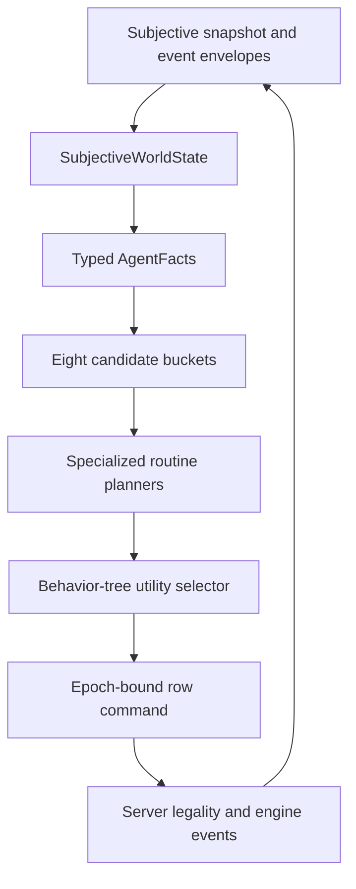
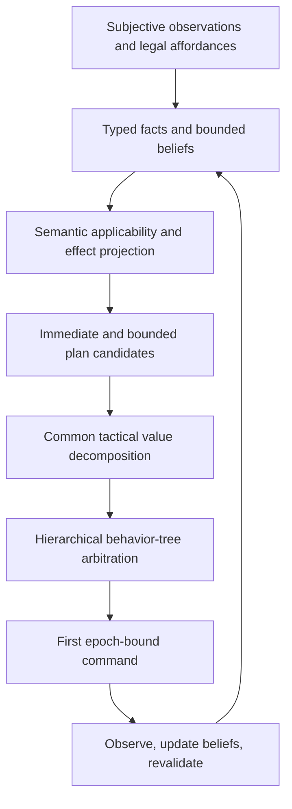

# Current AI Limits And The Next Generation

**Investigation date:** 2026-07-18  
**Policy under study:** `2026-07-17.shared-policy-v31-result-feedback-search`  
**Purpose:** establish what the current AI actually does well, where it fails, which conclusions are supported by retained evidence, and what must change before a stronger policy can be measured honestly.

## Executive Verdict

The agent runtime is in substantially better condition than the tactical policy.

The current stack has a sound foundation:

- the server remains authoritative for legal affordances and mutation;
- controllers receive session-subjective snapshots and event envelopes;
- action commands are tied to decision epochs;
- subjectivity auditing found no leaks in the latest 760-match matrix;
- the final policy choice is a real utility comparison across behavior-tree branches;
- memory is scoped by session, actor, and policy;
- routines revalidate after actions rather than blindly replaying stale commands;
- commands, outcomes, timing, and policy-node traces are retained.

The AI is nevertheless tactically narrow and poorly calibrated. It is not failing because it lacks legal actions or because the stream is unreliable. It is failing because:

1. many legal semantic action families never become policy candidates;
2. scores from different tactical branches do not represent one comparable unit of value;
3. immediate actions and multi-step routines are compared through fixed thresholds rather than expected plan outcomes;
4. defense is overvalued, especially Dodge at low HP;
5. movement is normally considered after damage rather than as part of the best attack plan;
6. control, concentration, resources, target tempo, and team roles are valued too crudely;
7. the current baseline and candidate do not own independent tactical implementations, so the promotion experiment cannot yet attribute most improvements;
8. retained match artifacts omit the ranked candidates that would make tactical regret directly measurable.

The next step should not be another isolated exception in `candidates.py`. The next step is to make policy generations genuinely independent, retain complete compact decision evidence, then introduce a threat-aware and plan-valued candidate generation as the first measurable successor to v31.

## Evidence Studied

### Latest atomic matrix

Source:

- `ai/evidence/elo_gauntlets/20260717T170610Z-ai-elo_matrix-4fda7cba/summary.json`
- `ai/evidence/elo_gauntlets/20260717T170610Z-ai-elo_matrix-4fda7cba/runs/`

Coverage:

- 760 completed and eligible matches;
- 38 arenas;
- 10 seeds per arena;
- both opening side orders;
- 25,341 accepted commands;
- zero rejected, stale, or failed commands;
- zero subjectivity violations;
- 304 hero wins and 456 monster wins.

This matrix is broad regression evidence, but it is not policy Elo. Both sides use the same policy, every arena has one fixed roster pair, and the 38 arena components are disconnected. Twenty-five of the 38 arenas ended in a 20-0 sweep. Those sweeps primarily expose setup strength and matchup imbalance.

### Configuration ladder

Source:

- `/home/tommaso/.cache/dnd_engine/config-ladder-production-v33-event-complete/connected-configuration-power-v33-event-complete-20260717/report.json`
- `ai/CONFIGURATION_ELO_REPORT.html`

Coverage:

- 15 historical hero configurations;
- 34 historical monster-party configurations;
- 9 battlefields;
- 2 opening treatments;
- 9,180 scheduled matches;
- 9,161 completed matches;
- 9,160 model-eligible matches;
- one simulation seed;
- one neutral deployment per battlefield.

The ladder estimates configuration strength under v31. It does not estimate policy quality. Its additive model also hides meaningful configuration-by-map residuals of roughly +275 to -204 Elo.

The current catalog has already expanded to 20 heroes and 38 monster parties, so five hero loadouts and four monster parties have no evidence in that historical ladder.

### Direct Codex runs

Source:

- `ai/evidence/direct_codex_runs/`

There are 115 retained direct runs through July 16. Thirty-five contain 55 explicit tactical annotations:

- 49 `policy_recommendation_bias` records across 31 runs;
- 6 `enemy_policy_weakness` records across 6 runs.

These are curated diagnostics across changing revisions. They establish recurring behavior, not population failure rates.

### Current-source reproductions

Representative arenas were replayed with the current source while intercepting the complete in-memory `PolicyDecision`, including all ranked candidates. These replays were diagnostic only and were not written into the retained evidence corpus.

They confirmed:

- Dodge can beat several legal attacks by a large score margin;
- persistent-zone spells can be legal and present in the epoch while producing no candidate;
- apparent unused `extra_attacks` can be a false positive when the actor never took the Attack action;
- the old artifacts do not retain enough information to distinguish these cases without replaying them.

## Current Decision Architecture



The final selector is not a first-match exception chain. `UtilitySelectorNode` ranks every proposal returned by its children. The weakness is earlier in the pipeline:

- candidate generation supports only eight tactical buckets;
- each bucket uses its own hand-tuned score scale;
- routine starters are pruned by fixed score thresholds;
- routine contracts contain logical metadata that the planner does not generically execute;
- unsupported legal rows silently disappear before arbitration.

The result looks hierarchical at the top while still behaving like ordered exceptions inside candidate and routine construction.

## Confirmed Strengths

### Subjectivity is holding

The latest 760-match matrix recorded no subjective-data violations. Legal targets, positions, known entities, known objects, and visible cells are independently audited. The earlier enemy-position leak is not present in this evidence.

No tactical improvement should weaken this invariant. Unknown, visible, remembered, and controlled facts must continue to remain distinct.

### Transport and legality are not the current bottleneck

All 25,341 matrix commands were accepted. There were no stale-command cascades, runner failures, or friction flags. The policy receives server-issued actions inside decision epochs and does not need to infer legality client-side.

This means the next work should prioritize decision quality, policy coverage, and evaluation validity. Additional transport optimization is not the highest-value task.

### Damage allocation is meaningfully modeled

The policy already computes exact damage distributions where disclosed facts permit it, accounts for known resistances and immunities, caps expected HP loss, models defeat probability, penalizes allocated overkill, supports repeated and multi-target allocation, and avoids known friendly fire.

This is one reason Magic Missile and direct-damage behavior are much more reliable than control, support, and environmental behavior.

### Bounded routines are useful

Door approach/open/reassess, capability pursuit, transformation, augmentation, and enable-then-act routines are real progress over a flat reactive controller. They preserve intent across variable-length turns and revalidate against each new epoch.

The problem is not that routines exist. The problem is that each routine is handwritten and its logical contract is mostly descriptive metadata.

## Confirmed Failure Modes

## 1. Baseline And Candidate Are Not Tactically Independent

Severity: **P0, blocks trustworthy promotion**

`policy.v31.accepted` and `policy.current.candidate` both use the live:

- `build_policy_candidate_set`;
- `plan_registered_routines`.

Their behavior trees are currently equivalent. The baseline hash includes shared files such as `candidates.py` and `routines.py`, so changing those files either changes the supposed old behavior or trips the frozen hash guard.

Consequences:

- a scoring improvement cannot cleanly belong only to the candidate;
- a routine improvement cannot cleanly belong only to the candidate;
- the prepared old-vs-new schedule currently compares behavior-equivalent implementations;
- a positive promotion result would not be attributable until this seam is corrected.

Required correction:

- freeze the complete v31 tactical implementation, not only its final tree;
- make candidate generation, routine planning, score parameters, and outcome assumptions generation-owned;
- keep the observation, facts, semantics, host protocol, and server legality as shared substrate.

## 2. Legal Semantic Actions Can Vanish Before Policy Arbitration

Severity: **P1, broad capability failure**

`PolicyCandidateSet` currently contains:

- direct damage;
- healing;
- control;
- control preservation;
- conditional target effects;
- self setup and immediate defense;
- spacing;
- exploration.

The semantic protocol also describes:

- summons;
- persistent zones;
- hazard deactivation;
- generic object interaction;
- door closing;
- resource acquisition;
- concentration ending;
- teleport and other mobility;
- support buffs that are not self setup;
- topology changes.

Several of these have no candidate evaluator or routine. A legal row can therefore be visible, affordable, correctly typed, and still lead to End Turn.

Current reproduction in `zone_control_web_gauntlet`:

- Web, Spike Growth, Grease, and Fog Cloud were all present in the decision epoch;
- none appeared in the ranked candidate set;
- the Mage selected slot-3 Magic Missile, moved, drank Haste, and cast more Magic Missile;
- Web was never considered by the selector because an empty persistent zone has no currently affected hostile and receives no future occupancy value.

The policy needs a coverage invariant:

> Every affordable semantic action exposed in an epoch must either produce a typed candidate, produce an explicit inapplicability reason, or be classified as intentionally policy-unsupported.

Silent disappearance should be a test and telemetry failure.

## 3. Dodge Is Systematically Overvalued

Severity: **P1, directly reproduced tactical regression**

Historical matrix signal:

- winners used Dodge 757 times;
- losers used Dodge 1,230 times;
- 154 losing-side Dodges occurred at full HP;
- 1,987 total Dodge commands were selected.

This frequency alone is not causal proof. The current-source replay provides the proof.

In `srd_elite_mercenary_contract`, seed 1:

| Actor | State | Dodge | Best competing pressure | Result |
|---|---:|---:|---:|---|
| Veteran | 33 HP, one visible enemy | 123.00 | two ranged attacks at 111.75 | Dodge |
| Mage | 24 HP, full action | 123.00 | Fire Bolt 114.99, Fireball 114.63 | Dodge |
| Captain | 25 HP, melee and ranged rows | 137.18 | best attack 114.97 | Dodge |
| Mage | 18 HP | 134.25 | slot-4 Magic Missile 127.00 | Dodge |
| Captain | 5 HP | 161.84 | six attack/control rows 111-115 | Dodge |

The party spent 14 actions Dodging while one sorcerer killed the Knight, Veteran, Mage, and Captain.

Why it happens:

- legal defense starts at 70;
- each visible hostile adds 12;
- missing HP fraction adds up to 90;
- direct damage is penalized only for adjacent pressure;
- expected incoming attacks, hit probability, damage prevented, initiative order, and the value of killing the attacker are absent.

Low HP therefore increases Dodge's score even when defense only delays a certain loss and offense is the only plausible recovery.

Required model:

- estimate attacks that can reach the actor before its next turn;
- estimate expected HP loss with and without the defensive effect;
- estimate defeat probability prevented;
- compare that prevention against enemy agency removed by attacks, healing, control, or escape;
- include ally survival and encounter state rather than valuing only the acting unit's missing HP.

## 4. Utility Scores Do Not Share One Meaning

Severity: **P1, systemic calibration problem**

Current branch baselines include approximately:

- damage: 100;
- control: 100;
- healing: 100;
- durable setup: 80;
- immediate defense: 70;
- exploration: 30;
- pursuit starters: fixed values around 65-80.

These scores add incompatible quantities:

- HP;
- target count;
- missing-HP fraction;
- information flags;
- binary setup effects;
- spell-slot level;
- movement distance.

The selector is deterministic and mathematically clean, but the values it compares are not calibrated to a common objective.

A better common unit does not need to be a perfect learned win probability. It can be a typed tactical value decomposition:

```text
team HP and survival delta
+ enemy agency denied
+ ally agency preserved
+ future capability enabled
+ information value
- expected incoming pressure
- resource opportunity cost
- friendly-fire and positional risk
```

Every immediate action and every bounded routine should report that same shape. Branch-specific facts can remain, but arbitration must compare common outcome dimensions.

## 5. Immediate Damage Preempts Better Positioning

Severity: **P1, tactical horizon failure**

Spacing is normally generated only after actions and extra attacks are spent and no immediate pressure remains. Pursuit and enablement routines also refuse to start when direct damage is already legal.

The policy therefore cannot intentionally choose:

- move before attacking to improve an AoE;
- move to use a stronger weapon envelope;
- take a safer firing line before casting;
- disengage or teleport before pressure;
- move, attack, then use remaining movement;
- reposition to preserve concentration;
- set up a choke or deny a route before enemies occupy it.

Movement is modeled as cleanup or access, not as part of the action's value.

Required correction:

- represent `move -> action`, `action -> move`, and `move -> action -> move` as bounded plans;
- compare the expected terminal plan state against immediate actions;
- use server affordances and subjective topology at every step;
- revalidate after each committed command;
- keep planning bounded to the current turn plus a small declared tactical horizon.

## 6. Routine Contracts Are Metadata, Not Executable Logic

Severity: **P1, extensibility failure**

`RoutineContract` declares applicability, invariants, completion conditions, logical steps, preconditions, and effects. These expressions are not generically interpreted by the routine planner. Specialized Python functions still own each routine's eligibility, transition, and revalidation behavior.

Consequences:

- adding a capability usually requires another dedicated branch;
- logical annotations cannot yet generate or validate plans;
- conflicts are resolved through hard suppression rules;
- routine registry order still matters;
- tests often prove metadata presence rather than planner interpretation.

The clean path is not unrestricted GOAP over every row. It is executable bounded planning:

1. evaluate declared preconditions against subjective facts;
2. instantiate legal affordance bindings;
3. apply declared effects to an approximate projected state;
4. check invariants and economy bounds;
5. score the terminal projected state;
6. execute only the first row;
7. revalidate on the next epoch.

Handwritten routines can remain as optimized planners, but their contracts must be executable and tested against their implementations.

## 7. Control And Persistent Zones Are Under-Modeled

Severity: **P1, major content blind spot**

Current control scoring:

- values hard control from affected target health and headcount;
- gives soft control zero intrinsic effect weight;
- ignores target save probability;
- ignores effect duration and repeated saves;
- ignores initiative timing and expected actions denied;
- ignores endpoint and terrain leverage for forced movement;
- treats concentration replacement as a flat penalty;
- requires persistent zones to affect a hostile immediately.

This makes Shove a generic bonus-action sink and makes Web, Spike Growth, Grease, Fog Cloud, Spirit Guardians, Guardian of Faith, Darkness, Slow, and Hypnotic Pattern difficult or impossible to value for their actual tactical purpose.

Control value should be based on expected denied or altered agency:

```text
success probability
x expected affected turns before removal
x target threat per turn
+ topology and forced-movement value
+ ally follow-up value
- concentration and resource opportunity cost
- friendly obstruction
```

Persistent zones additionally need projected occupancy and route interception, not only current affected entities.

## 8. Resource And Concentration Decisions Lack A Horizon

Severity: **P1, strong behavioral concentration**

The old configuration ladder found:

- 109 implemented spells;
- 62 configured spells;
- 30 spells cast at least once;
- 32 configured but never cast;
- 47 absent from every configuration;
- Magic Missile alone accounted for 36.4% of all spell casts;
- the five most-used spells accounted for 77.5%;
- every configured level-5 spell was unused.

In the latest 760-match matrix, selected commands included:

- 1,544 Magic Missiles;
- 963 Haste potions;
- 426 Fireballs;
- 7 Hold Persons;
- 2 Thunderwaves;
- 2 Shield of Faith casts.

Current cost is approximately slot level plus named resource units, multiplied by a small constant. It does not consider:

- remaining resource fraction;
- number of expected future turns;
- lower-cost alternatives with similar kill probability;
- encounter state and remaining enemy HP pool;
- item rarity or replenishment horizon;
- retained concentration effect value.

Concentration is reduced to a boolean and flat replacement penalties. The policy cannot compare the actual value of Haste, Web, Bless, or Greater Invisibility already being maintained against the proposed replacement.

## 9. Target Priority Is HP-Centric Rather Than Tempo-Aware

Severity: **P1, team tactics limitation**

Damage selection uses useful facts such as wounds, expected HP loss, defeat probability, overkill, coverage, and known defenses. It does not value:

- whether the target acts before allies can respond;
- expected outgoing damage or control;
- concentration being maintained;
- reaction capability;
- caster, healer, controller, or frontline role;
- ally focus-fire commitments;
- whether another ally has already reserved lethal pressure.

Multi-target beneficial and harmful effects are structurally allocated, but recipient choice is mostly deterministic ordering and applicability. It does not compare ally wounds, roles, initiative, effect magnitude, or save odds recipient by recipient.

The next fact layer should derive a subjective threat and opportunity profile for each visible or remembered contact. It must remain a belief based only on observed actions and disclosed facts.

## 10. Search Can Stall Against Unseen Ranged Pressure

Severity: **P1, localized but match-deciding**

The matrix contains 147 End Turn decisions across 18 matches where the actor retained an action, movement, meaningful commands, and legal position rows. This is 2.2% of all 6,709 End Turns.

The strongest clusters are:

- `trap_lever_killzone`: 96 stalls in 8 matches;
- `srd_undead_crypt`: 43 stalls in 3 matches.

In match 0420, the Barbarian repeatedly ended rounds with 40 feet and 132-247 movement rows while unable to perceive the Warlock, then died in round 16. In match 0682, the Fighter produced 34 such endings and died after 42 rounds.

Only one historical matrix decision meets the much stricter condition of ending with a visible enemy and legal targeted actions. Most apparent resource waste is therefore a search and policy-coverage problem, not a command-transport problem.

Search needs:

- source-localized evidence from perceived attacks and logs;
- bounded negative-observation updates;
- information-gain scoring for frontiers;
- path novelty and cycle penalties across rounds;
- explicit search termination or regroup behavior;
- a response to unseen ranged pressure that does not require leaking the attacker.

## 11. Uncertainty Is Conservative But Too Shallow

Severity: **P2, limits adaptation**

Unknown AC can make attack estimation unavailable. Save-for-zero damage remains unknown; save-for-half damage is valued at the guaranteed lower bound. Combat memory learns only a narrow complete-effect-blocking hypothesis.

It does not learn subjective estimates for:

- AC;
- saving throws;
- resistances not yet identified;
- attack range;
- expected damage;
- reaction behavior;
- concentration;
- target role or policy tendencies.

The solution is not omniscient stat recovery. It is bounded belief updating from observed rolls and effects, with explicit confidence and unknown states.

## Important False Positives

### `extra_attacks > 0` does not always mean an attack was wasted

Historical traces show 661 End Turns with `extra_attacks > 0`. A current replay in `item_resource_gauntlet` demonstrated why this count is misleading.

The Fighter used a Fireball scroll, drank Haste, used the Haste action for a second Fireball, and moved into range. The trace then showed one extra attack remaining, but the epoch exposed no attack row because the actor had not taken the Attack action that unlocks Extra Attack. Ending the turn was correct.

Action-economy telemetry needs executable gates, not only raw pool values, before it can label waste.

### Sweep rates are not policy quality

Twenty-five 20-0 arena sweeps are primarily a setup and roster-balance signal. The same policy controlled both factions. A sweep can reveal a tactical pathology, but it cannot establish that one policy generation is stronger.

### High action frequency is not causality

Losers Dodge more and winners cast more high-level damage spells, but survival time and roster composition confound raw counts. Candidate-level replay or matched policy intervention is required before calling a choice causal.

## Observability Gaps

The policy already constructs a `PolicyDecision` containing the selected proposal, every ranked candidate, and the complete tree trace. `PolicyHost` can emit that full decision as telemetry.

`ExternalSelfPlayTrace` retains only the selected command and branch proposal counts. Historical artifacts therefore cannot answer:

- which alternatives were available;
- their scores and utility components;
- which rows were dropped before candidate generation;
- whether dominance pruning removed a row;
- whether routine suppression blocked a plan;
- the score margin between selected and runner-up choices;
- whether a better action existed under the policy's own model.

The old matrix also has `source_revision: null`. Policy hashes and schedule hashes are retained, but exact engine revision attribution is incomplete.

Required compact trace addition:

```text
selected candidate
top K ranked alternatives
all affordable semantic keys
candidate disposition for every semantic family
pruning and suppression reasons
score margin and utility components
routine terminal-state estimate
action-economy gates, not only pools
```

This is evaluator telemetry. It must not alter policy behavior or expose objective state.

## Evaluation Failures To Fix Before Promotion

### Current policy-promotion field is a null experiment

The prepared four-treatment design correctly swaps policy and initiative while holding match content constant. It currently compares behavior-equivalent baseline and candidate implementations.

### Baseline behavior is not completely frozen

Candidate and baseline share live tactical modules. This is the first blocker.

### The current model matrix is rank deficient

Every battlefield has one symmetric deployment while the promotion model contains separate battlefield and deployment factors. The prepared design has 76 columns but rank 68. Either remove the aliased factor or add independent deployment variation.

### One seed is insufficient

The old configuration ladder and prepared promotion field use one simulation seed. Policy promotion needs multiple development seeds and a held-out seed panel.

### Some gates are asserted rather than computed

The ordinary promotion CLI currently leaves deterministic mismatches and content regressions at default zero values. These must come from retained evidence before they can be trusted as gates.

### Self-play bypasses part of the production client lifecycle

`external_selfplay.py` manually drives the subjective store and host. Production external AI uses `SubjectiveRuntime`, subscriptions, hooks, pending-command handling, sinks, and resynchronization. Tactical promotion and production-runtime regression should remain separate tests, but the release gate must exercise both.

### HP-only stalemate detection is incomplete

The evaluator declares a stalemate after 80 accepted commands with unchanged objective HP. It ignores position, doors, information gain, conditions, concentration, resources, summons, topology, and routine progress. This can distort control, navigation, and setup-heavy policies.

## Recommended Next-Generation Architecture

The behavior tree, utility comparison, and bounded routines should remain. Their responsibilities should be made explicit:



### Shared substrate

Keep shared between traditional AI and LLMs:

- subjective world and event reduction;
- typed facts and bounded beliefs;
- action semantics;
- decision epochs and legal rows;
- command protocol;
- policy and agent telemetry;
- planning contracts and projected-state vocabulary.

### Generation-owned behavior

Version independently:

- candidate generators;
- tactical value weights or models;
- routine and bounded-plan planners;
- dominance and pruning rules;
- target and resource strategy;
- behavior-tree composition.

### LLM relationship

An LLM should be able to:

- inspect the same facts, plans, and candidate values;
- select a validated candidate directly;
- modulate declared goals and weights within bounded limits;
- propose a plan that is compiled and revalidated through the same semantics;
- fall back to the deterministic policy.

It should not receive a separate omniscient state or bypass server legality.

## Implementation Order

## Phase 0: Make Improvement Measurable

1. Freeze all v31 tactical behavior behind a generation-owned implementation.
2. Give the candidate its own candidate builder, routine planner, and value profile.
3. Retain compact top-K candidate telemetry and explicit drop reasons.
4. Add executable action-economy gates to traces.
5. Fix the rank-deficient promotion model or add deployment variation.
6. Compute determinism and content-regression gates from artifacts.
7. Add multiple development seeds and held-out seeds.

Exit condition: baseline and candidate can make different decisions in the same epoch without changing shared runtime code, and the artifact proves which implementation owned each decision.

## Phase 1: Threat-Aware Defense

Replace missing-HP-driven Dodge value with expected pressure prevented.

Add facts for:

- actor AC and relevant defenses;
- visible hostile attack envelopes;
- expected observed damage ranges;
- initiative before the actor's next turn;
- reachable attackers and line of sight;
- ally and enemy remaining agency.

Add focused regressions from the elite mercenary replay. This is the best first tactical generation because the defect is reproduced, common, and measurable.

Exit condition: the candidate does not spend repeated turns Dodging while legal lethal or high-pressure attacks dominate, while still selecting Dodge when it materially lowers defeat probability.

## Phase 2: Compare Terminal Plan Value

1. Execute routine logical preconditions and invariants.
2. Introduce a projected state limited to disclosed facts and declared effects.
3. Score routine terminal states in the same units as immediate actions.
4. Remove fixed routine suppression thresholds where terminal value can decide.
5. Add bounded move-action and action-move plans.

Exit condition: a direct attack no longer automatically suppresses a superior reposition-and-attack plan.

## Phase 3: Close Semantic Coverage

Add explicit evaluators and routines for:

- persistent zones;
- summons;
- support buffs;
- hazard and object interactions;
- topology changes;
- resource acquisition;
- concentration ending;
- teleports and defensive mobility.

Create a generated semantic coverage test: every configured affordable action must produce a candidate or an explicit typed reason.

Exit condition: configured content is not silently ignored, and the exercised-content ledger grows without hardcoding display names.

## Phase 4: Resources, Concentration, And Targets

1. Value resource opportunity cost from remaining pools and encounter horizon.
2. Retain concentration identity, estimated ongoing value, and replacement delta.
3. Add initiative and observed threat to target priority.
4. Add session-subjective team reservations for focus fire and overkill avoidance.
5. Value multi-target recipients individually.

Exit condition: high-level slots, Haste potions, and Magic Missile are selected because of marginal value rather than weak flat costs.

## Phase 5: Search And Bounded Opponent Beliefs

1. Use perceived attack origins and event evidence without revealing hidden actors.
2. Add negative-observation search updates and cycle penalties.
3. Learn bounded AC, save, defense, range, and damage hypotheses.
4. Keep confidence and unknown states explicit.
5. Replace HP-only stalemate detection with a multi-dimensional progress signature.

Exit condition: unseen ranged pressure produces purposeful subjective search, not stationary End Turns or infinite oscillation.

## Promotion Protocol

Every candidate generation should be accepted only after:

1. exact paired matches swap old and new policy across both sides and openings;
2. multiple seeds are used;
3. a held-out roster, map, deployment, and content panel remains untouched during tuning;
4. global policy uplift is positive with an uncertainty interval;
5. no protected stratum has a material regression;
6. subjectivity, determinism, command acceptance, and memory isolation remain clean;
7. content opportunity and effect coverage do not regress;
8. candidate traces explain where the uplift came from.

Required strata include:

- melee;
- ranged;
- caster;
- control and concentration;
- support and healing;
- persistent zones;
- doors and topology;
- darkness and search;
- consumables and finite resources;
- low and high level;
- hero-vs-hero, hero-vs-monster, and monster-vs-monster;
- exact mirrors.

The acceptance criterion is higher estimated policy strength across the field, not merely winning a direct mirror against the old policy.

## Immediate Next Experiment

The first candidate should be deliberately narrow enough to validate the promotion machinery:

1. freeze v31 completely;
2. retain ranked alternatives in every match artifact;
3. implement threat-aware Dodge valuation in the candidate only;
4. add the elite mercenary replay as a deterministic regression;
5. add cases where Dodge is truly correct;
6. run matched candidate-vs-v31 blocks across all configurations and held-out seeds;
7. inspect global uplift plus caster, melee, low-HP, ranged-pressure, and consumable strata;
8. accept only if uplift is positive without subjectivity or content regressions.

This gives the project its first honest answer to the question: did the AI become stronger?

## Known Test Inconsistency Found During Investigation

Focused reproduction:

```text
uv run pytest tests/manual/test_48_policy_host.py::test_policy_host_does_not_advance_memory_for_accepted_canceled_action -q
```

The test fails because an accepted command with `ActionResolutionStatus.CANCELED` records the canceled row and semantic in policy memory, making `memory_advanced=True`. The test expects no memory advancement. This is already recorded in `KNOWN_ISSUES.md` and was not changed during this investigation.

## Final Assessment

The current AI is a legitimate subjective, event-first, typed tactical controller. It is not yet a general D&D combat policy.

Its strongest behavior is direct damage under known facts. Its weakest behavior is anything requiring comparison across time: defense versus offense, positioning before pressure, control duration, concentration replacement, finite-resource planning, persistent zones, subjective search, and team tempo.

The most important engineering correction is generation ownership. The most important tactical correction is threat-aware common-value arbitration. The most important observability correction is retaining the alternatives the policy already computes.

Once those three are in place, the existing self-play and promotion infrastructure can become a real iterative AI laboratory instead of a large but causally ambiguous match generator.
