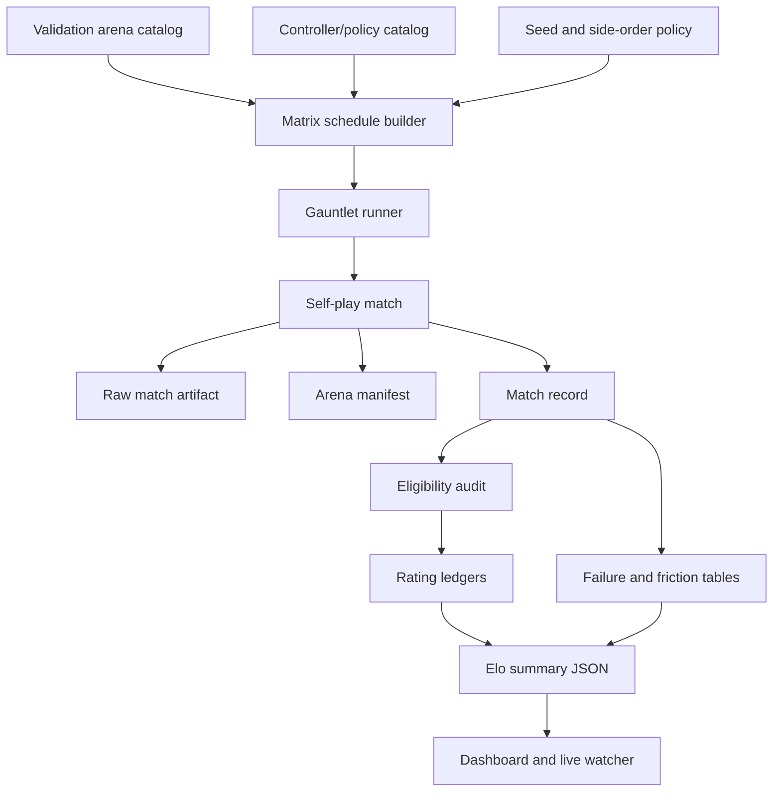
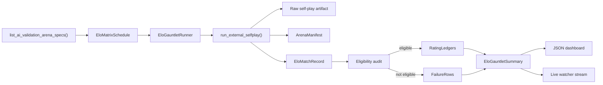

# Complete Elo Gauntlet Evaluator Plan

## Implementation Result

The evaluator described here is implemented and has completed its first canonical
full matrix.

- Canonical matrix: `20260717T170610Z-ai-elo_matrix-4fda7cba`
- Schedule hash: `f9d5db78227de43a`
- Coverage: 38 arenas x 10 seeds x 2 opening-side treatments = 760 matches
- Result: 760 completed, 760 rating eligible, 0 failed, 0 skipped, 0 pending
- Gate: passed
- Subjectivity: 760 passes from
  `external_selfplay_event_history_perception_witness_v3`, with 0 violations
- Controller: `unified_ai_current`
- Policy: `2026-07-17.shared-policy-v31-result-feedback-search`

The retained result is documented in
[`ELO_GAUNTLET_RESULTS.md`](ELO_GAUNTLET_RESULTS.md). The canonical summary,
compact dashboard projection, schedule, match records, and raw traces live under
`ai/evidence/elo_gauntlets/20260717T170610Z-ai-elo_matrix-4fda7cba/`.

The implementation includes deterministic scheduling, exact constructed-arena
manifests, immutable per-attempt evidence, resumable checkpoints, typed timeout
and crash artifacts, strict rating eligibility, independent rating ledgers,
runtime subjectivity auditing, event-stream watcher payloads, a JSON-only
dashboard, and retained wall/client/server/engine timing analysis.

Two earlier runs remain diagnostic rather than canonical:

- `20260717T145043Z-ai-elo_matrix-3a6e3e62` used the prior policy and retained
  six command-cap rows.
- `20260717T165248Z-ai-elo_matrix-11a6d770` was stopped after a false-positive
  witness interpretation of transient forced-movement perception. The witness
  now independently consumes completed sensory-event history, and the canonical
  matrix passes all 20 forced-movement rows.

## Purpose

Build a real evidence system for AI quality, not another smoke test.

The current repository has useful pieces:

- `ai/evaluation/gauntlet.py` can build named schedules and write retained summaries.
- `ai/evaluation/tournament.py` can compute simple Elo-style rating deltas.
- `dnd/scenarios/ai_validation_arenas.py` exposes a validation arena catalog.
- `ai/evidence/gauntlets/` retains passed smoke, rotation, content, and release batches.
- `ai/evidence/tournaments/` contains one small tournament artifact.

But this is not yet a complete evaluator. The largest retained release gauntlets cover only four arenas and three seeds. The separate tournament artifact covers five arenas with one seed. The current schedule profile fields also overstate what is actually executed: `hero_profile` and `monster_profile` are stored in schedule rows, but `run_external_selfplay()` currently receives only `arena_id`, `hero_first`, `random_seed`, and `max_commands`. That means profile labels are not a reliable source of truth unless the runner is extended to honor them or the evaluator records the actual constructed roster.

This plan turns the existing pieces into a complete Elo gauntlet evaluator:



The deliverable is complete only when the evaluator can run the whole available validation catalog, retain every match, compute rating tables and time series from clean eligible rows, expose failures without hiding them, and drive a dashboard entirely from retained JSON.

## Definitions

### Arena

An arena is a constructible validation fixture from `dnd.scenarios.ai_validation_arenas`.

Current catalog size: 38 arena specs.

Examples:

- `standard_skeleton_doors`
- `goblin_water_skirmish`
- `skeleton_anti_aoe_split`
- `caster_crossfire`
- `item_resource_gauntlet`
- `double_door_dark_hunt`
- `zone_control_web_gauntlet`
- `srd_low_cr_patrol`
- `srd_undead_crypt`
- `srd_goblinoid_warband`
- `srd_divine_cult_cell`
- `srd_elite_mercenary_contract`

In the current codebase, an arena is already a combined map plus encounter setup. The phrase "all maps x all encounters" therefore has two implementation levels:

1. **Immediate complete evaluator:** all currently constructible validation arenas x seeds x side order.
2. **Later combinatorial evaluator:** explicitly separated `map_id x encounter_id x loadout_profile` once scenario factories expose those dimensions independently.

The first implementation must be complete over the current arena catalog. It must not invent unconstructible map/encounter combinations.

### Encounter Setup

An encounter setup is the actual set of entities, factions, items, spells, traits, controllers, and environment objects created by an arena factory.

Schedule labels are not sufficient. Every match must retain an `ArenaManifest` derived from the constructed world after reset and before combat starts.

### Controller Profile

A controller profile identifies the policy/controller stack used by a side.

For this evaluator, the important identity is the actual policy stack, not a loose label. A profile should include:

- profile id, such as `unified_ai_current`;
- policy version or hash;
- controller type;
- deterministic configuration values;
- whether deep diagnostics are enabled;
- whether LLM/Codex control was used;
- any feature flags, if they exist.

The default evaluator must use the current unified AI stack. It should not resurrect deleted legacy AI just to create a weak opponent. Rating anchors must be real controller profiles we intend to support, retained previous policy artifacts, or explicit debug baselines marked as such.

### Side Order

Side order is the opening initiative/priority configuration exposed today through `hero_first`.

Every matrix schedule should run both:

- `hero_first = true`
- `hero_first = false`

This is required because many arenas are sensitive to first contact, doors, reactions, and opening spell pressure.

### Seed

A seed is the deterministic random seed passed to the match runner. The default full matrix should use enough seeds to make ratings meaningful.

Recommended defaults:

- `smoke`: 1 seed
- `release`: existing small gate behavior
- `elo_matrix`: 10 seeds
- `elo_matrix_large`: 30 seeds, optional expensive batch

For 38 arenas, 10 seeds, and both side orders, the first complete matrix is:

```text
38 arenas x 10 seeds x 2 side orders = 760 matches
```

That is the minimum serious evaluator target.

### Rated Participant

A rated participant is not just "heroes" or "monsters". Ratings need stable identities that answer different questions.

The evaluator should maintain multiple ledgers:

| Ledger | Key | Question Answered |
| --- | --- | --- |
| `setup_side` | `arena_id + side + roster_hash + controller_profile` | How strong was this exact side setup in this arena? |
| `arena_balance` | `arena_id + side` | Does this arena favor heroes or monsters? |
| `policy_side` | `policy_version + controller_profile + side` | How strong is this policy when controlling a side? |
| `policy_global` | `policy_version + controller_profile` | How strong is this policy overall across sides and arenas? |
| `roster` | `roster_hash + faction + controller_profile` | How strong is this party/monster group independent of arena? |

The official dashboard can highlight `setup_side` and `arena_balance` immediately. `policy_global` becomes truly meaningful once there are multiple real policy identities or retained historical policy artifacts to compare.

## Current Gaps To Fix

### 1. Small Gates Are Being Mistaken For Proof

Current retained evidence:

- latest smoke: 1 match;
- release: 12 matches;
- content: small subsets;
- tournament: 5 matches.

This proves the runner boots and some batches pass. It does not prove the AI is robust.

### 2. Schedule Labels Are Not Runtime Truth

`GauntletScheduleEntry.hero_profile` and `monster_profile` exist, but the current self-play runner ignores them. This must be fixed in one of two ways:

1. Extend self-play to consume explicit profile ids.
2. Or, for v1, treat validation arenas as atomic fixtures and record the actual constructed manifest as truth.

The immediate evaluator should do option 2 and avoid pretending profile labels changed gameplay.

### 3. Ratings Are Too Narrow

Current rating ids look like:

```text
standard_skeleton_doors::heroes
standard_skeleton_doors::monsters
```

That is useful as a local side-balance signal, but not a robust ladder.

### 4. Abnormal Matches Can Pollute Ratings

Command caps, hangs, subjectivity leaks, stale protocol failures, and crashes should be retained and shown, but they must not silently update official Elo ledgers.

### 5. No Resume Story

A 760-match matrix may be interrupted. The evaluator needs resumable summaries so a crash does not waste a long run.

### 6. Dashboard Needs Evaluator-Native Data

The existing dashboard work focuses on iteration stats and direct artifacts. The Elo evaluator needs a dashboard projection that reads evaluator summary JSON directly and never uses hand-written values.

## Target Architecture



The evaluator stays separate from core gameplay. It should not mutate AI behavior while measuring it. It consumes the same self-play/runtime stack used by normal validation.

## Data Contracts

Add a new module:

```text
ai/evaluation/elo_contract.py
```

This avoids making `gauntlet_contract.py` larger and keeps the rating evaluator explicit.

### EloMatrixMode

```python
EloMatrixMode = Literal[
    "elo_smoke",
    "elo_matrix",
    "elo_matrix_large",
    "elo_regression",
]
```

The existing `GauntletMode` can later include `"elo_matrix"` if we want one CLI namespace. The contracts should still be evaluator-specific.

### EloMatrixScheduleEntry

Fields:

- `match_index`
- `arena_id`
- `random_seed`
- `hero_first`
- `controller_profile`
- `policy_version`
- `side_order_id`
- `requested_hero_profile`
- `requested_monster_profile`
- `tags`
- `schedule_group`
- `repeat_key`

Important rule: `requested_hero_profile` and `requested_monster_profile` are optional requests, not truth. The truth comes from the retained manifest.

### EloMatrixSchedule

Fields:

- `schema_version`
- `matrix_id`
- `mode`
- `created_at`
- `arena_catalog_hash`
- `policy_catalog_hash`
- `seed_policy`
- `side_order_policy`
- `entries`
- `schedule_hash`

The schedule hash must include only deterministic schedule inputs.

### ArenaManifest

Generated from the constructed arena before the match starts.

Fields:

- `arena_id`
- `title`
- `hero_role`
- `tags`
- `expected_pressure`
- `map_notes`
- `notable_positions`
- `map_size`
- `terrain_summary`
- `object_summary`
- `entity_rosters`
- `roster_hash_by_side`
- `manifest_hash`

Entity roster rows:

- `entity_uuid`
- `stable_name`
- `faction`
- `controller_profile`
- `class_or_monster`
- `level_or_cr`
- `max_hp`
- `ac`
- `speed`
- `senses`
- `ability_summary`
- `saving_throw_summary`
- `resistances`
- `immunities`
- `conditions_at_start`
- `equipment_summary`
- `spell_summary`
- `action_template_summary`
- `trait_summary`

The manifest must not rely on hidden runtime observation. It is evaluator metadata generated outside the agent subjective stream and used only for analysis.

### EloParticipant

Fields:

- `participant_id`
- `ledger`
- `side`
- `policy_version`
- `controller_profile`
- `arena_id`
- `roster_hash`
- `faction`
- `tags`
- `display_name`

Participant ids must be deterministic and stable across runs.

Example ids:

```text
setup_side:standard_skeleton_doors:heroes:roster=abc123:policy=v250
setup_side:standard_skeleton_doors:monsters:roster=def456:policy=v250
arena_balance:standard_skeleton_doors:heroes
arena_balance:standard_skeleton_doors:monsters
policy_side:v250:unified_ai_current:heroes
policy_side:v250:unified_ai_current:monsters
policy_global:v250:unified_ai_current
roster:def456:monsters:unified_ai_current
```

### EloEligibility

Fields:

- `rating_eligible`
- `reasons`
- `subjectivity_status`
- `runner_status`
- `command_status_counts`
- `encounter_finished`
- `command_cap_reached`
- `crashed`
- `timed_out`
- `has_unknown_outcome`

Official Elo updates require:

- no subjectivity violations;
- no crash;
- no timeout;
- no command cap;
- outcome is `heroes`, `monsters`, or `draw`;
- both sides have participant identities;
- retained match artifact validates.

Abnormal rows are kept in evidence and shown in the dashboard, but skipped for official rating ledgers.

### EloMatchRecord

Can extend or wrap `TournamentMatchRecord`.

Fields:

- all existing `TournamentMatchRecord` fields;
- `schedule_entry`;
- `arena_manifest`;
- `participants`;
- `eligibility`;
- `rating_updates_by_ledger`;
- `artifact_paths`;
- `friction_flags`;
- `policy_trace_summary`;

### EloRatingLedger

Fields:

- `ledger_name`
- `elo_config`
- `ratings`
- `standings`
- `rating_series`
- `match_count_by_participant`
- `eligible_match_count`
- `skipped_match_count`
- `uncertainty`

`standings` rows:

- `rank`
- `participant_id`
- `display_name`
- `rating`
- `games`
- `wins`
- `losses`
- `draws`
- `skipped`
- `latest_delta`
- `tags`

### EloGauntletSummary

Fields:

- `schema_version`
- `matrix_id`
- `mode`
- `generated_at`
- `schedule_hash`
- `arena_catalog_hash`
- `policy_catalog_hash`
- `scheduled_count`
- `completed_count`
- `eligible_count`
- `skipped_rating_count`
- `failed_count`
- `pending_count`
- `matches`
- `ledgers`
- `failure_rows`
- `subjectivity_summary`
- `performance`
- `coverage`
- `dashboard_projection`
- `events`

Coverage summary:

- arena ids scheduled;
- arena ids completed;
- arena ids missing;
- seeds scheduled;
- side orders scheduled;
- side order balance;
- tags covered;
- roster hashes covered.

## Schedule Builder

Add:

```text
ai/evaluation/elo_matrix.py
```

Core API:

```python
def build_elo_matrix_schedule(
    *,
    mode: EloMatrixMode = "elo_matrix",
    arena_ids: Optional[list[str]] = None,
    seeds: Optional[list[int]] = None,
    side_orders: tuple[bool, ...] = (True, False),
    controller_profile: str = "unified_ai_current",
    policy_version: Optional[str] = None,
) -> EloMatrixSchedule:
    ...
```

Default arena ids:

```python
arena_ids = [spec.arena_id for spec in list_ai_validation_arena_specs()]
```

Default seeds:

- `elo_smoke`: `[1]`
- `elo_matrix`: `[1,2,3,4,5,6,7,8,9,10]`
- `elo_matrix_large`: `[1..30]`
- `elo_regression`: from failed retained rows

Default side orders:

```python
(True, False)
```

Expected complete row counts with the current 38-arena catalog:

| Mode | Seeds | Side Orders | Rows |
| --- | ---: | ---: | ---: |
| `elo_smoke` | 1 | 2 | 76 |
| `elo_matrix` | 10 | 2 | 760 |
| `elo_matrix_large` | 30 | 2 | 2280 |

`elo_smoke` is not a substitute for `elo_matrix`. It exists only to verify the evaluator itself after code changes.

## Runner

Add:

```text
ai/evaluation/elo_runner.py
```

Core API:

```python
def run_elo_gauntlet(
    schedule: EloMatrixSchedule,
    *,
    max_commands: int,
    elo_config: EloConfig,
    runs_output_directory: Path | str,
    summary_output_directory: Path | str,
    resume: bool = True,
    require_complete: bool = False,
    event_stream: Optional[EloGauntletEventSink] = None,
) -> EloGauntletSummary:
    ...
```

Execution rules:

1. Load or create the summary workspace.
2. Validate schedule hash.
3. Skip rows already completed with matching schedule hash when `resume=True`.
4. Run each missing row serially by default.
5. Write one raw match artifact per row.
6. Build an `ArenaManifest`.
7. Build an `EloMatchRecord`.
8. Audit eligibility.
9. Update rating ledgers only if eligible.
10. Emit watcher events after every major boundary.
11. Write compact incremental checkpoints backed by authoritative per-match records.
12. Write final summary only after all rows are attempted.

Serial execution is the default because the engine uses global registries. Parallel execution can be added later with isolated process workers, not threads.

### Checkpointing

The evaluator must write checkpoints:

```text
ai/evidence/elo_gauntlets/<matrix_id>/schedule.json
ai/evidence/elo_gauntlets/<matrix_id>/matches/<match_id>.json
ai/evidence/elo_gauntlets/<matrix_id>/runs/<run_id>.json
ai/evidence/elo_gauntlets/<matrix_id>/checkpoints/latest.partial.json
ai/evidence/elo_gauntlets/<matrix_id>/summary.json
ai/evidence/elo_gauntlets/latest.json
```

If interrupted, the partial summary must say:

- `pending_count > 0`
- `gate_status = failed`
- `completion_status = partial`

No partial run should masquerade as a complete evaluator result.

The checkpoint must not embed the schedule, match records, manifests, or rating
time series. Those grow with every row and make repeated checkpoint writes
quadratic in both serialization work and disk traffic. Resume loads the retained
`schedule.json`, validates its hash, and reconstructs progress from the files in
`matches/`. The checkpoint is a compact watcher index containing counts,
completed match indices, gate state, and the latest match id.

### Runner Status

Match statuses must stay visible:

- `encounter_ended`
- `command_cap_reached`
- `timeout`
- `crashed`
- `subjectivity_failed`
- `invalid_artifact`
- `unknown`

Only clean statuses are rating eligible.

## Rating System

Use classic Elo first, but use it rigorously.

### Elo Formula

```python
expected_a = 1 / (1 + 10 ** ((rating_b - rating_a) / 400))
expected_b = 1 - expected_a
rating_a += k * (score_a - expected_a)
rating_b += k * (score_b - expected_b)
```

Scores:

- heroes win: `(1.0, 0.0)`
- monsters win: `(0.0, 1.0)`
- draw: `(0.5, 0.5)`

No HP-margin multiplier in v1. Margin can be shown as analysis metadata, but official Elo should remain simple and explainable.

### Multiple Ledgers

For each eligible match, update these ledgers independently:

1. `setup_side`
2. `arena_balance`
3. `policy_side`
4. `policy_global`
5. `roster`

Each ledger answers a different question and should be displayed separately. Do not combine them into one magical number.

### Rating Eligibility

Do not update official ratings for:

- command cap reached;
- timeout;
- crash;
- subjectivity violation;
- missing final faction HP;
- unknown outcome;
- invalid artifact;
- row with missing participants;
- row with mismatched schedule hash.

These rows still count as failures and still appear in the dashboard.

### Confidence

Every standing row should include:

- games;
- win/loss/draw;
- rating;
- latest delta;
- skipped/failed rows touching that participant;
- low-sample warning when `games < 10`;
- unstable warning when `games < 30`.

This avoids pretending a 2-game rating is as trustworthy as a 100-game rating.

## Arena Manifest Implementation

Add:

```text
ai/evaluation/arena_manifest.py
```

Core API:

```python
def build_arena_manifest(arena: ValidationArena) -> ArenaManifest:
    ...
```

This function reads the constructed arena object, not agent observations.

Manifest extraction should include:

- validation spec metadata;
- map dimensions;
- notable positions;
- known environment object summaries;
- entity roster summaries;
- action template summaries;
- equipment summaries;
- spell summaries;
- condition summaries;
- resistances/immunities;
- senses and movement.

Hash policy:

- `roster_hash_by_side`: hash stable normalized roster rows without UUIDs;
- `manifest_hash`: hash full stable manifest minus volatile UUIDs/timestamps.

The manifest gives us a way to say, "this rating came from this actual encounter setup", not from vague schedule text.

## CLI

Extend `ai/evaluation/gauntlet_runner.py` or add:

```text
python -m ai.evaluation.elo_runner
```

Recommended CLI:

```bash
uv run python -m ai.evaluation.elo_runner schedule --mode elo_matrix
uv run python -m ai.evaluation.elo_runner run --mode elo_matrix --max-commands 240 --resume
uv run python -m ai.evaluation.elo_runner run --schedule-path ai/evidence/elo_gauntlets/<matrix_id>/schedule.json --max-commands 240 --resume
uv run python -m ai.evaluation.elo_runner summarize ai/evidence/elo_gauntlets/latest.json
uv run python -m ai.evaluation.elo_runner validate ai/evidence/elo_gauntlets/latest.json
```

Options:

- `--arena-id`, repeatable override;
- `--seed`, repeatable override;
- `--side-order hero-first`, `--side-order monster-first`, repeatable;
- `--policy-version`;
- `--controller-profile`;
- `--max-commands`;
- `--resume / --no-resume`;
- `--require-complete`;
- `--require-rating-eligible`;
- `--runs-output-directory`;
- `--summary-output-directory`;
- `--watcher-base-url`;
- `--json`.

`--require-complete` fails if any scheduled row is pending.

`--require-rating-eligible` fails if any row is skipped from official Elo updates.

## Live Watcher

The current gauntlet watcher machinery can be reused conceptually, but Elo-specific events should carry richer payloads.

Add event types:

- `ELO_GAUNTLET_STARTED`
- `ELO_MATCH_STARTED`
- `ELO_MATCH_ARTIFACT_WRITTEN`
- `ELO_MATCH_COMPLETED`
- `ELO_MATCH_SKIPPED_FROM_RATING`
- `ELO_RATINGS_UPDATED`
- `ELO_CHECKPOINT_WRITTEN`
- `ELO_GAUNTLET_COMPLETED`
- `ELO_GAUNTLET_FAILED`

Payloads should include:

- matrix id;
- match id;
- match index;
- arena id;
- seed;
- side order;
- status;
- outcome;
- eligibility;
- current coverage counts;
- current top standings by ledger;
- artifact path.

Server integration can reuse the current `/ai/gauntlets/events` path or add `/ai/elo-gauntlets/events`. If reusing the existing endpoint, include `event_family = "elo"` in the payload so dashboards can filter.

## Dashboard

Add:

```text
ai/ELO_GAUNTLET_DASHBOARD.html
ai/evaluation/elo_dashboard_projection.py
```

The dashboard must read retained JSON only.

It should show:

- run status;
- scheduled/completed/eligible/skipped/failed/pending counts;
- coverage by arena, seed, side order, tag;
- standings by ledger;
- rating time series by participant;
- outcome matrix by arena;
- failure rows;
- subjectivity violations;
- command-cap rows;
- latency/performance summaries;
- artifact links.

No manual stat entry. No fabricated values.

The first dashboard can be file-based:

```text
ai/evidence/elo_gauntlets/latest.json
```

For the live view, add polling or SSE against the gauntlet event endpoint.

## Server/Runtime Integration

The evaluator can initially run in-process through `run_external_selfplay()`. That is enough for complete AI-vs-AI matrix evaluation.

Do not touch NeuroClient for this slice.

Do not route through human endpoints.

Do not change agent subjectivity semantics.

The evaluator is allowed to inspect objective constructed manifests for measurement metadata, but agents must still play only through subjective runtime and server-issued affordances.

## Tests

Add focused tests, but make them prove evaluator structure rather than tiny toy behavior only.

### `tests/manual/test_60_elo_matrix_schedule.py`

Coverage:

- schedule includes every `list_ai_validation_arena_specs()` arena by default;
- default `elo_matrix` row count is `arena_count * 10 * 2`;
- schedule hash changes when seeds, arenas, side orders, or policy version change;
- schedule hash is stable for same inputs;
- invalid arena ids fail with a useful error;
- no schedule row claims profile truth without manifest support.

### `tests/manual/test_61_arena_manifest.py`

Coverage:

- manifest can be built for representative arenas;
- manifest includes both factions;
- roster hashes are stable across volatile UUIDs;
- manifest hash changes when material roster facts change;
- action template summaries include attacks, spells, item uses, movement, object interactions where present.

Use a small representative set:

- `standard_skeleton_doors`
- `item_resource_gauntlet`
- `srd_low_cr_patrol`
- `high_level_spell_resource_duel`

### `tests/manual/test_62_elo_rating_ledgers.py`

Coverage:

- clean hero win updates all ledgers;
- clean monster win updates all ledgers;
- draw updates all ledgers as half score;
- command cap is retained but not rating eligible;
- subjectivity failure is retained but not rating eligible;
- participant standings include games, wins, losses, draws, low-sample warnings;
- independent ledgers do not leak ratings into each other.

Use synthetic match records. Do not run combat here.

### `tests/manual/test_63_elo_runner_resume.py`

Coverage:

- partial checkpoint resumes missing rows;
- mismatched schedule hash refuses resume;
- completed rows are not rerun;
- final summary has no pending rows after completion;
- partial summary is visibly partial and gate-failing.

Use monkeypatched `run_external_selfplay()` results.

### `tests/manual/test_64_elo_summary_validation.py`

Coverage:

- summary counts match retained rows;
- failure rows list every abnormal row;
- skipped rating count matches eligibility;
- rating series references known participants;
- artifact paths exist when required;
- dashboard projection rejects contradictory summaries.

### `tests/manual/test_65_elo_dashboard_projection.py`

Coverage:

- dashboard projection reads only summary JSON;
- rating time series are grouped by ledger;
- failure tables include command-cap and subjectivity rows;
- coverage tables include missing arenas/seeds/side orders;
- no manual fallback values appear in generated projection.

### `tests/manual/test_66_elo_matrix_real_smoke.py`

One real, tiny integration run:

- two arenas;
- one seed;
- both side orders;
- no run artifacts unless temp directory;
- validates summary shape.

This is not the full evaluator run. It proves the runner works.

## Actual Full Run Acceptance

After implementation and focused tests, run the real evaluator:

```bash
uv run python -m ai.evaluation.elo_runner run \
  --mode elo_matrix \
  --max-commands 240 \
  --resume \
  --require-complete \
  --runs-output-directory ai/evidence/elo_gauntlets/runs
```

Expected with current catalog:

```text
scheduled_count = 760
arena_count = 38
seed_count = 10
side_order_count = 2
```

The run does not have to be perfectly clean on the first attempt. But the evaluator is not complete until:

- all 760 rows are attempted;
- every row has a retained match record;
- every row has a manifest;
- every row has a raw artifact or an explicit failure artifact;
- official rating ledgers are computed from eligible rows only;
- skipped rows are visible;
- `latest.json` points to the completed summary;
- dashboard opens from retained JSON and shows the rating tables/time series/failures.

If rows fail, the correct next step is not to shrink the matrix. The correct next step is to fix the systemic issue, add a focused test for it, and rerun or resume the matrix.

## Implementation Order

### Phase 1: Contracts And Schedule

Files:

- `ai/evaluation/elo_contract.py`
- `ai/evaluation/elo_matrix.py`
- tests `test_60_elo_matrix_schedule.py`

Deliverable:

- deterministic complete schedule for all 38 arenas x seeds x side order;
- clear row counts;
- stable hashes.

### Phase 2: Arena Manifest

Files:

- `ai/evaluation/arena_manifest.py`
- tests `test_61_arena_manifest.py`

Deliverable:

- runtime truth captured from constructed arena;
- stable roster and manifest hashes.

### Phase 3: Rating Ledgers

Files:

- `ai/evaluation/elo_ratings.py`
- tests `test_62_elo_rating_ledgers.py`

Deliverable:

- multiple independent rating ledgers;
- clean eligibility rules;
- no abnormal match pollution.

### Phase 4: Runner And Resume

Files:

- `ai/evaluation/elo_runner.py`
- tests `test_63_elo_runner_resume.py`
- tests `test_64_elo_summary_validation.py`

Deliverable:

- run/resume/checkpoint/final summary;
- artifacts retained;
- partial summaries clearly marked.

### Phase 5: Dashboard And Watcher

Files:

- `ai/ELO_GAUNTLET_DASHBOARD.html`
- `ai/evaluation/elo_dashboard_projection.py`
- tests `test_65_elo_dashboard_projection.py`

Deliverable:

- file-based dashboard from JSON;
- live watcher-compatible event stream payloads.

### Phase 6: Real Smoke Integration

Files:

- tests `test_66_elo_matrix_real_smoke.py`

Deliverable:

- tiny real run proves the vertical path.

### Phase 7: Full Matrix Run

Command:

```bash
uv run python -m ai.evaluation.elo_runner run --mode elo_matrix --max-commands 240 --resume --require-complete
```

Deliverable:

- completed matrix summary in `ai/evidence/elo_gauntlets/latest.json`;
- dashboard reading the same retained JSON.

## Non-Goals

- Do not revive deleted legacy AI as the default opponent.
- Do not alter game rules to make ratings prettier.
- Do not use hidden state to help agents.
- Do not hide command-cap/hang/failure rows from ratings or dashboards.
- Do not claim `hero_profile`/`monster_profile` changed the match unless the runner actually honors them.
- Do not replace subjective runtime with objective evaluator state.
- Do not make full-suite pytest the proof. The full matrix run is the proof.

## Completion Criteria

This feature is complete only when all are true:

1. The evaluator can enumerate every current validation arena.
2. The default complete matrix is all arenas x 10 seeds x both side orders.
3. Every completed row records the actual constructed arena manifest.
4. Every row has a retained match record and artifact or explicit failure artifact.
5. Official Elo ledgers update only from clean eligible matches.
6. Abnormal rows are retained, visible, and excluded from official Elo.
7. Dashboard reads retained evaluator JSON only.
8. Resume works after interruption without rerunning completed rows.
9. Focused evaluator tests pass.
10. A full `elo_matrix` run has been executed and retained.

Only after this can we honestly say we have a proper Elo gauntlet evaluator.
