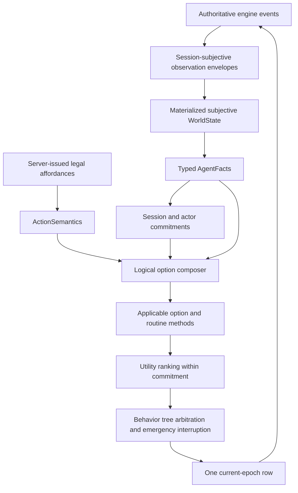

# Logical Commitments, Composed Options, And Policy Promotion

## Purpose

This document defines the implementation plan for the next AI policy generation. The refactor keeps the event-first subjective runtime, typed action semantics, routines, policy host, and versioned promotion machinery already present. It adds the missing temporal reasoning layer: persistent tactical commitments and mechanically composed option-level logical contracts.

The result must remain one architecture for traditional and LLM controllers:



The engine remains authoritative for mutation, perception, raycasting, legality, and outcomes. Logical contracts never manufacture objective state, unseen entities, routes to unknown targets, or future sensory results.

## Current State To Preserve

The codebase already contains substantial correct infrastructure:

- `ai.protocol.semantics.ActionSemantics` declares planning preconditions, guaranteed effects, conditional effects, stochastic effects, target effects, resources, concentration, topology, information changes, targeting, and capability transformations.
- `FactExpression` and `evaluate_fact_expression()` implement three-valued subjective logic: true, false, and unknown.
- `ai.policy.routines.RoutineContract` declares applicability, invariants, completion, ordered steps, accepted action tags, expected effects, and revalidation boundaries.
- `PolicyHost` aligns subjective state and facts, caches one decision per epoch, correlates commands, and advances routine memory only from authoritative results.
- `DecisionEpoch` transports legal affordances and their complete typed semantic catalog to the local runtime. Agents do not infer legality.
- The promotion runner can place frozen and candidate generations on opposite factions in isolated workers and retain full evidence.
- The current candidate has a common tactical value vector, typed semantic admission, bounded movement-to-pressure routines, search suppression, and concentration guards.

These are retained. The refactor is not a replacement AI stack.

## Problems Being Solved

### Epoch-local goal amnesia

`PolicyGoal` currently labels individual proposals. After each command or observation interruption, every legal proposal competes globally again. A movement step can reveal an enemy and cause a fresh Dodge, setup, or unrelated target proposal to preempt the reason movement was selected.

### Routines retain mechanics but not strategic intent

`RoutineProgress` remembers how to continue one bounded method. It does not retain why the session is pursuing a target, which actors share the objective, how much progress has been invested, or what threshold justifies switching.

### Primitive contracts do not yet compose

Actions and routine steps have preconditions and effects, but there is no general forward compositor or backward regressor that derives the prerequisites and consequences of a chain. Consequently an option is described manually rather than accompanied by a proof showing how each step enables the next.

### Information-changing actions cannot predict content

Opening a door, moving around a corner, changing light, or entering a new region can cause arbitrary sensory changes. Logical planning may declare an observation opportunity or invalidation boundary, but it cannot predict the entities, cells, hazards, or routes that raycasting and perception will reveal.

### Baseline and candidate generation ownership is incomplete

The accepted v31 generation and the current candidate still share tactical candidate, routine, and host result-reduction machinery. New behavior must not change the accepted generation in place. A promotion score is meaningless if both contestants inherit the same tactical edits.

## Formal Runtime Model

Let the authoritative engine state at engine transition `t` be `s_t`. A controller session receives an observation sampled by the engine's session-specific observation function:

```text
o_t = Omega(session, s_t, engine_events_t, senses_t)
```

The agent locally materializes subjective history:

```text
h_t = reduce(h_(t-1), o_t)
```

and derives typed facts:

```text
f_t = derive(h_t)
```

At decision epoch `k`, the server supplies the legal affordance set `A_k`. Each affordance `a in A_k` references immutable `ActionSemantics(a)`. The candidate policy maintains a commitment state `c_k` and selects an option or primitive proposal compatible with both `f_k` and `c_k`.

A turn has a variable number of epochs because each accepted command changes action economy and can cause a new epoch. Options therefore operate over decision epochs, not nominal D&D turns. An option may persist across turns when its contract permits that duration.

## Logical Vocabulary

### Subjective truth

Every evaluated proposition is `TRUE`, `FALSE`, or `UNKNOWN`. Missing knowledge never becomes false. An explicitly observed absence may become a known-false fact scoped to the observed region and cursor.

Entity position is represented as:

- visible position: exact current subjective observation;
- remembered position: last observed position plus observation cursor;
- current position after loss of sight: unknown;
- no probability cloud or guessed coordinate in the first implementation.

Remembered positions may support search and investigation options. They cannot support targeted attacks or omniscient paths.

### Primitive action contract

`ActionSemantics` remains the contract of one legal engine action. Its effects are classified rather than flattened:

- guaranteed effects occur when the action successfully completes;
- conditional effects require an additional logical guard;
- stochastic effects identify a resolution mechanism and optional disclosed probability;
- resource effects describe action economy and named resource transitions;
- topology effects describe objective traversability or visibility-topology changes;
- information effects describe epistemic opportunities and invalidations without predicting content.

### Policy method annotation

Every production policy leaf or option method must expose a typed logical annotation. The annotation describes why the method is applicable and what progress it intends. It does not duplicate server legality or copy the selected action's mechanics.

```python
@logical_policy_method(
    PolicyMethodContract(
        method_id="pressure.approach_visible_target",
        preconditions=all_of(
            fact("actor.is_active", True),
            fact("target.visible_hostile", True),
            fact("route.to_target.exists", True),
        ),
        progress_effects=(
            decrease("actor.route_deficit_to_capability_envelope"),
        ),
        completion=fact("target.pressure_affordance_available", True),
        invalidation=any_of(
            fact("target.known_dead", True),
            fact("route.to_target.known_impossible", True),
        ),
    )
)
def propose_approach_target(...):
    ...
```

The decorator attaches immutable metadata and registers it for consistency and coverage checks. It does not wrap or mutate policy execution.

### Composed option contract

An `OptionContract` is derived from primitive or nested logical steps:

```text
OptionContract
  option_id
  parameters and bindings
  initial preconditions
  invariants
  completion
  invalidation
  guaranteed terminal effects
  conditional and stochastic terminal branches
  resource lower and upper bounds
  information effects and observation barriers
  ordered or partially ordered steps
  composition proof
```

The composition proof records which prior effect satisfies every later precondition, unresolved initial requirements, conflicts, overwritten effects, stochastic dependencies, information barriers, and resource feasibility.

### Commitment contract

Commitments represent persistent intention rather than another copy of world state.

```text
TacticalCommitment
  commitment_id
  revision
  scope: session or actor
  goal
  subjective target/object/position reference
  desired_state
  adoption_conditions
  invariants
  completion
  invalidation
  adopted_at_cursor and epoch
  adoption_value
  progress_value
  selected_option_id
  parent_commitment_id
  interruption state
```

The commitment stores references and control decisions only. Current HP, positions, doors, routes, and conditions remain in `WorldState` and `AgentFacts`.

## Logical Chain Composition

### Effect application

A logical effect is applied to an abstract fact environment using its operation:

- `SET`: replace a known value;
- `SET_FROM_TARGET`: bind a value supplied by the selected target;
- `INCREASE` and `DECREASE`: update numerical facts when both operands are known;
- `ADD` and `REMOVE`: update set-valued facts;
- `INVALIDATE`: remove the current assertion and produce unknown.

Unsupported or dynamically bound changes remain symbolic rather than guessed.

### Forward composition

Given steps `a_1 ... a_n`, forward composition computes:

1. Start with an empty symbolic environment and no external requirements.
2. For each step, evaluate each precondition against effects established by prior steps.
3. A true precondition is internally satisfied.
4. A false precondition is a chain conflict.
5. An unknown precondition becomes an external option prerequisite unless it depends on a stochastic or observation branch.
6. Apply guaranteed effects in order.
7. Carry conditional and stochastic effects as explicit branches. Do not treat possible effects as guaranteed enablers.
8. Compose resource effects arithmetically and detect impossible action-economy chains.
9. On an information effect requiring reassessment, append an observation barrier and stop deterministic consequence propagation across that boundary.
10. Produce a canonical option contract and a complete proof.

For deterministic contracts `A ; B`, this approximates:

```text
Pre(A ; B) = Pre(A) AND regress(Pre(B), Effects(A))
Post(A ; B) = apply(Effects(B), apply(Effects(A), symbolic_state))
```

The implementation must not initialize consequences from prerequisites. Preconditions describe requirements; effects describe transitions.

### Backward regression

Backward regression accepts a desired `FactExpression` and an action-semantic catalog:

1. Find actions whose guaranteed or explicitly accepted contingent effects can establish a goal predicate.
2. Replace established goal predicates with the action's planning preconditions.
3. Reject actions whose guaranteed effects contradict unresolved goals.
4. Accumulate resource requirements and depth.
5. Stop at a bounded depth and branching factor.
6. Forward-compose each candidate chain to verify it and derive its option contract.

Initial planning remains small and authored: existing routines are methods, and regression checks or fills short chains of two to four commands. Unbounded GOAP is not introduced.

### Stochastic branches

An attack or saving-throw effect cannot guarantee its success branch. A later step that requires the success effect is contingent:

```text
Cast Hold Person
-> observation/result boundary
-> if target.paralyzed: exploit control
-> otherwise: retain or reconsider pressure objective
```

The option contract reports guaranteed effects, possible branches, and branch-specific continuation prerequisites separately. Utility may use disclosed probabilities, but the logical proof never converts expected value into truth.

### Observation barriers

Raycasting, sensory callbacks, visibility unions, stealth, lighting, and novel entities remain engine responsibilities. Logical contracts represent only the epistemic transition:

```text
door.is_open = true
visibility_topology changed
observation required
subjective frontier invalidated
```

They never predict which cells or entities become visible. After an observation barrier, the runtime consumes real subjective envelopes, derives fresh facts, and revalidates or replaces the remainder of the option.

Actions carrying information or relevant topology effects create an observation barrier. Routine annotations may also declare one explicitly for corner crossing or region entry.

## Commitment Hierarchy

### Session/team commitment

One controller session may own multiple actors. The session commitment provides:

- shared tactical objective: pressure, control, survival, preparation, search, withdrawal, or information acquisition;
- focus target, object, or spatial objective when subjectively known;
- actor roles and reservations;
- adoption, completion, invalidation, and revision evidence;
- a switch threshold and coordination-break cost.

Example roles include controller, finisher, blocker, door opener, scout, and support. Reservations prevent two actors from accidentally consuming the same scarce objective unless joint allocation is intended.

### Actor commitment

Each actor commitment binds one actor to a session objective and selected option:

- current target or destination reference;
- selected option and current step;
- progress metric and invested resources;
- completion and invalidation evidence;
- permitted emergency interruptions;
- whether the actor should resume or abandon after interruption.

### Revalidation versus reconsideration

Every epoch revalidates. Global reconsideration occurs only when:

- the commitment completed;
- an invariant is false;
- the goal is known impossible or irrelevant;
- its subject became invalid;
- a typed emergency applies;
- an alternative materially dominates after switching costs.

The switch rule is explicit:

```text
alternative_value - incumbent_value
    > execution_switch_cost
    + unfinished_progress_value
    + coordination_break_cost
    + hysteresis_margin
```

All terms appear in telemetry. There is no invisible sticky bonus.

### Utility and behavior tree relationship

The hierarchy is:

```text
commitment applicability and retention
-> applicable option/routine methods
-> utility ranking among proposals serving the commitment
-> explicit emergency interrupters
-> server legality and one epoch row
```

The behavior tree remains an orchestrator. Utility remains the common comparison mechanism. Neither is allowed to erase an active commitment by globally reranking unrelated proposals every epoch.

## Candidate Generation Isolation

Frozen v31 must retain its exact implementation hash and behavior. The new generation requires a complete tactical-cycle seam.

### Neutral host responsibilities

`PolicyHost` owns only:

- subjective alignment;
- actor/epoch/session identity;
- decision caching;
- command reservation and correlation;
- telemetry transport;
- applying an opaque typed generation-state transition.

It must not construct candidate buckets, revalidate tactical routines, or mutate generation-specific search and commitment state itself.

### Version-owned responsibilities

A `PolicyImplementation` owns:

```text
evaluate_cycle(context, generation_state)
  -> candidates
  -> commitment reconciliation
  -> option/routine planning
  -> logical consistency checks
  -> utility/tree decision
  -> next evaluation state and trace

reduce_result(feedback, generation_state)
  -> accepted progress
  -> rejected/stale/canceled handling
  -> commitment and option transitions
  -> next generation state
```

The initial migration may adapt the frozen v31 functions behind this complete interface without moving or editing their behavior-bearing files. The candidate receives its own state model and evaluator.

Generation source manifests must include every behavior-bearing file. Candidate files must not appear in the v31 behavior manifest. The pinned v31 implementation digest is never updated to accommodate this refactor.

## Data Models And Modules

Add candidate-neutral logical models under `ai/planning/`:

- `contracts.py`: policy method, logical step, option, branch, resource bounds, observation barrier, and proof models;
- `composition.py`: forward composition and conflict detection;
- `regression.py`: bounded backward regression;
- `evaluation.py`: three-valued expression simplification and abstract effect application;
- `registry.py`: immutable logical-method metadata registry and decorator;
- `explain.py`: proof and applicability renderers.

Add candidate-owned policy code under `ai/policy/generations/current/`:

- `state.py`: session and actor commitment memory;
- `commitments.py`: adoption, revalidation, reconsideration, role allocation, and switch accounting;
- `options.py`: composition of existing routine/action contracts into candidate options;
- `cycle.py`: complete candidate decision cycle;
- `result_memory.py`: authoritative command-result reduction;
- `telemetry.py`: commitment, composition, and interruption trace models;
- existing candidate scoring remains reusable and moves only if isolation requires it.

Avoid circular imports. `ai.planning` depends only on protocol-level semantic models. Candidate policy depends on planning, facts, policy contracts, and shared factual workspaces. The host depends on generation-neutral lifecycle protocols, never candidate modules.

## Initial Option Library

The first implementation composes and executes these methods:

### Pressure visible target

```text
attack now
or move -> reassess -> attack
or extend mobility -> move -> reassess -> attack
```

Completion: selected pressure capability is executed or target is defeated.

Invalidation: target dies, becomes non-hostile, ceases to be a legal remembered/search subject, or all known routes become impossible.

### Approach, open, reassess

```text
move toward known closed door
-> open door
-> observation barrier
-> reconsider from fresh facts
```

Dash or another mobility extension is used only when ordinary movement cannot make useful progress or when its cost does not destroy a required follow-up.

### Preserve or replace concentration

```text
retain current concentration
or replace when new option value exceeds retained value plus switching cost
```

The contract records current concentration identity, visible affected targets, disclosed remaining duration when known, and replacement consequences.

### Apply control then exploit

```text
control action
-> result boundary
-> success branch: exploit or preserve
-> failure branch: continue pressure or reconsider
```

### Search remembered contact

```text
move toward last-known region
-> observation barrier
-> if reacquired: create pressure commitment
-> if observed absent: expand bounded frontier
-> if exhausted: complete search as known unsuccessful
```

### Survival emergency

Healing, escape, or defense may interrupt another option only through a typed emergency predicate. On resolution, the prior commitment is resumed if still valid or explicitly abandoned with a trace.

## Interpretability And Consistency Queries

Every decision trace must answer:

- What session and actor commitment was active?
- Why was it adopted or retained?
- Which option was selected?
- What are the option's external prerequisites and expected consequences?
- Which earlier step establishes each later prerequisite?
- Which facts were true, false, or unknown?
- Which observation barrier prevents further prediction?
- What resources are required and preserved?
- Why did an emergency interrupt?
- Why was a different target or option not selected?
- Which authoritative result advanced, completed, or invalidated progress?

Consistency APIs must support:

- evaluate a contract against current subjective facts;
- forward-compose a proposed chain;
- regress a desired state through candidate actions;
- detect contradictory effects or impossible resource use;
- list unresolved initial prerequisites;
- list conditional and stochastic continuation branches;
- compare declared effects with subjectively observed results;
- audit that every production policy leaf has a logical annotation.

## Implementation Sequence

### Phase 0: deterministic semantic identity

Fix content-addressing so all unordered semantic collections canonicalize identically across Python processes and hash seeds. Add cross-process or permutation tests covering all set/frozenset fields. Replay Hypnotic Pattern serialization.

### Phase 1: logical planning substrate

Implement immutable planning contracts, effect application, expression simplification, forward composition, conflicts, resource bounds, observation barriers, backward regression, and explanations. Reuse all existing protocol semantic types.

### Phase 2: annotations and coverage

Add the non-wrapping logical policy decorator. Annotate current candidate decision leaves and map existing routine contracts into logical steps. Add a registration-time coverage audit for production leaves.

### Phase 3: generation lifecycle isolation

Introduce generation-owned cycle and result reducers. Adapt frozen v31 through an adapter without changing its behavior files. Move candidate-only state outside shared `ActorPolicyMemory`. Add source-manifest and golden-decision tests.

### Phase 4: commitments and composed options

Implement session and actor commitment stores, adoption, revalidation, switching, emergencies, option selection, command-result progress, and observation-barrier handling. Integrate the initial option library.

### Phase 5: pathology replays

Reproduce and retain evidence for:

- Barbarian movement reveal where full-health Dodge previously preempted pressure;
- monster team discovery and focus sharing across actors;
- approach/open/reassess without hidden target leakage;
- Sorcerer control and concentration continuation;
- close-range ranged-versus-melee valuation;
- stale, rejected, canceled, and partial command results;
- Hypnotic Pattern semantic transport across processes.

### Phase 6: promotion field

Run candidate versus frozen v31 in isolated workers. Begin with a targeted matched smoke covering movement, doors, search, concentration/control, multi-targeting, support, and ordinary direct pressure. If it is mechanically clean and positive, run the larger connected promotion schedule.

Report:

- candidate score share and block-level interval for the smoke;
- fitted policy uplift and interval for the connected field;
- matchup and battlefield effects;
- commitment switches, interruptions, completions, and option success rates;
- action/content coverage;
- subjectivity and protocol failures;
- command count, rounds, outcomes, and retained artifact paths.

Do not promote from a single head-to-head result. Acceptance requires higher estimated policy strength across the matched field, zero subjectivity violations, zero unexplained protocol failures, and no material content-coverage regression.

## Focused Test Matrix

### Logical composition

- Deterministic `Move -> Attack` removes attack range from initial prerequisites when movement establishes it.
- A guaranteed false effect conflicting with the next precondition rejects the chain.
- A stochastic success effect creates a contingent continuation rather than satisfying a guaranteed prerequisite.
- Later `SET` overrides an earlier fact while preserving proof provenance.
- Numerical resource operations compose correctly.
- Insufficient actions, bonus actions, movement, spell slots, or named resources invalidate the chain.
- Information effects create observation barriers and prevent fabricated downstream facts.
- Unknown facts remain unknown.
- Forward composition is deterministic and content-addressable.
- Backward regression plus forward verification reconstructs the expected bounded chain.

### Commitments

- A retained pressure target survives unrelated observation updates.
- A small utility fluctuation does not cause target chatter.
- Completion and invalidation release the commitment promptly.
- A typed survival emergency interrupts and then resumes or abandons explicitly.
- Switching occurs when material dominance exceeds all declared costs.
- Team discovery creates a shared subjective objective without objective leakage.
- Actor roles and reservations remain session-scoped.
- Two sessions never share commitment or memory state.
- Remembered targets create search commitments, not attack commitments.
- New information after a door opens causes reassessment rather than guessed continuation.

### Result lifecycle

- Only matched accepted and completed effects advance option progress.
- Stale and rejected commands do not advance logical consequences.
- Canceled and partially committed actions are classified from typed results.
- Duplicate results are idempotent.
- Epoch changes cannot execute retained row ids; options resolve fresh semantic rows.

### Frozen generation

- v31 implementation digest remains pinned.
- Candidate source edits do not alter the v31 behavior digest.
- Golden v31 fixtures retain selected intent, ordering, trace, and memory transitions.
- Host dispatch proves each generation owns its complete tactical cycle and result reduction.

### Runtime and subjectivity

- No `/available-actions`, objective `/state`, or objective `/visibility` polling.
- Hidden entities never enter facts, commitments, option proofs, affordances, or telemetry.
- Raycasting output enters only through subjective observation events.
- Observation replay reconstructs the same commitment-relevant facts.
- Decision traces contain no hidden comparison candidates.

## Promotion Acceptance Criteria

The candidate may replace v31 only when all of the following hold:

1. Frozen v31 behavior hash remains unchanged.
2. Focused composition, commitment, lifecycle, subjectivity, and pathology tests pass.
3. Direct replays show fewer unjustified goal switches and no new loops or hangs.
4. Matched promotion evidence has positive estimated candidate uplift, with uncertainty reported.
5. No individual critical panel shows a severe unexplained regression.
6. Subjectivity violations are zero.
7. Protocol failures are zero or individually understood and excluded as infrastructure failures.
8. Content coverage is equal or broader, including concentration, multi-targeting, doors, topology, information changes, reactions, resources, and monster traits.
9. The report and dashboard are generated exclusively from retained JSON evidence.

## Explicit Non-Goals

- No objective-state planning mirror.
- No predicted raycasting or invented sensory results.
- No probabilistic position cloud in the first implementation.
- No unbounded GOAP search.
- No second legality engine in the agent.
- No display-name substring policy.
- No changes to NeuroClient's trusted human APIs.
- No updating the accepted v31 hash merely to make tests pass.
- No promotion based only on speed or one favorable matchup.

## Completion Definition

This refactor is complete when the candidate policy can retain and explain session and actor goals, mechanically derive option-level prerequisites and consequences from annotated primitive contracts, stop and revalidate at genuine observation boundaries, execute only fresh server-issued affordances, survive the known pathological scenarios, and demonstrate positive policy-strength uplift over frozen v31 in retained matched self-play evidence.
