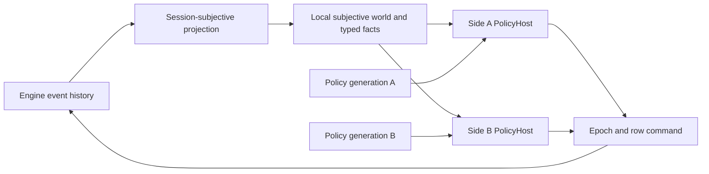
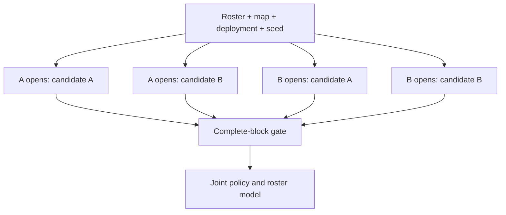
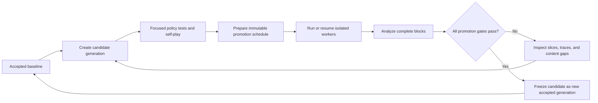

# Versioned AI Promotion Loop

## Purpose

The promotion loop answers one question:

> Does a candidate policy make better decisions than the accepted baseline across the game, after separating policy quality from roster power, battlefield geometry, deployment, initiative, and random outcomes?

It is not a single mirror match and it does not subtract Elo numbers from two separately centered tournaments. Candidate and baseline play inside one counterbalanced experiment. The fitted candidate-minus-baseline coefficient is therefore identified directly from within-experiment policy swaps.

The existing configuration ladder remains the authoritative measurement of roster power under one fixed policy generation. The promotion experiment is a separate evaluator with a different scientific meaning.

## Running A Promotion Field

Prepare immutable inputs once, then run or resume the same authenticated field:

```bash
uv run python -m ai.evaluation.promotion prepare \
  --output-root /home/tommaso/.cache/dnd_engine/policy-promotion \
  --experiment-id candidate-vs-accepted-20260718 \
  --seed 20260718

uv run python -m ai.evaluation.promotion run \
  --experiment-dir /home/tommaso/.cache/dnd_engine/policy-promotion/candidate-vs-accepted-20260718 \
  --spool-root /home/tommaso/.cache/dnd_engine/policy-promotion-spool

uv run python -m ai.evaluation.promotion analyze \
  --experiment-dir /home/tommaso/.cache/dnd_engine/policy-promotion/candidate-vs-accepted-20260718
```

The run command uses 75 percent of the logical CPUs available through process
affinity. On a 32-thread host this means 24 concurrent disposable workers. Pass
`--workers N` to override the automatic selection. Every worker remains a fresh
interpreter and process group; parallel matches share immutable input files but
no engine registries, observation stores, policy memory, or mutable runtime state.

## Runtime Boundary

The engine remains the sole authority for legal actions and mutation. Both generations use the same strict subjective runtime:



Each faction owns a separate session, subjective store, fact cache, policy host, and memory store. A command trace records its policy generation ID, behavior version, and authenticated executable hash. Hidden information is audited independently of the policy's own state.

The baseline and candidate share transport, observation, typed semantics, and server legality. They do not share policy memory. Their behavior-selecting functions are supplied through `PolicyImplementation`:

- candidate construction;
- bounded routine planning;
- hierarchical tree and utility evaluation.

## Immutable Generations

`policy.v31.accepted` is the initial accepted baseline. Its complete decision-bearing source manifest is pinned by SHA-256. Editing its candidates, routines, economy, outcomes, memory, tree, utility, or frozen hierarchy in place causes registry startup to fail.

An intelligence change must create or update a candidate generation and must leave the accepted implementation unchanged. The shared substrate has a separate hash, so protocol or fact-model changes are visible without pretending they are policy-only changes.

The candidate and baseline currently make equivalent decisions. The first full experiment is consequently a null calibration: its expected global uplift is approximately zero, and the promotion gate should reject it. That is intentional evidence that the evaluator does not manufacture improvement.

After a candidate is accepted, promotion is still a deliberate source change. The evaluator never silently rewrites the baseline pointer or deletes the previous implementation.

## Atomic Comparison Block

One causal cell is expanded into exactly four matches:

| Opening | Side A policy | Side B policy |
|---|---|---|
| Side A first | Candidate | Baseline |
| Side A first | Baseline | Candidate |
| Side B first | Candidate | Baseline |
| Side B first | Baseline | Candidate |

All four rows share:

- side-A and side-B roster configurations;
- battlefield and symmetric deployment;
- simulation seed;
- candidate and baseline executable hashes.

The complete four-row block is the unit of admission, retry, analysis, and future bootstrap resampling. If one treatment is absent or scientifically ineligible, the block cannot contribute to policy uplift. This prevents process failure, command failure, or selective completion from favoring one generation.



## Generic Sides

Promotion scenarios use neutral `side_a` and `side_b` factions. Any existing `SideConfigurationSpec` can occupy either side, including multi-actor monster parties. The generic assembler exposes complete `side_a` and `side_b` tuples while preserving the historical `hero` and `monsters` fields for older consumers.

Promotion deployments provide five symmetric slots per side. Actor roles are namespaced by side during assembly, so mirror matches cannot overwrite deferred references or presentation names.

The experiment supports:

- hero versus monster party;
- monster party versus monster party;
- hero versus hero;
- exact roster mirrors when explicitly requested.

## Structured Match Field

The default field is sparse and connected rather than quadratic:

1. Every hero receives three deterministic monster-party opponents.
2. Monster parties form a ring and long-chord graph for direct monster-versus-monster evidence.
3. Heroes form a ring for same-kind comparisons.
4. Cross-kind edges connect hero and monster power into one roster graph.

Every rating-eligible configuration appears in at least one edge. The field is stable under iteration and remains far smaller than an all-pairs product.

Two panels are retained:

- `frozen_core`: the original 15 hero and 34 monster configurations used for longitudinal comparisons;
- `expanded`: newly admitted content, including five hero loadouts and four SRD parties added in the first expansion batch.

The expanded monster parties bring all 27 implemented SRD monster factories into at least one configuration. The new parties exercise orcs, thugs, scouts, tribal warriors, spies, commoners, dire wolves, ogres, and berserkers. The hero batch adds great-weapon, defensive greatsword, two-weapon, dual-axe, and sword-and-shield builds.

## Statistical Model

For match `i`, the side-A log odds are modeled as:

```text
eta_i =
    side_orientation
  + roster_strength[side_a] - roster_strength[side_b]
  + battlefield_orientation_effect
  + deployment_orientation_effect
  + opening_effect
  + policy_delta * policy_assignment
```

`policy_assignment` is `+1` when candidate controls side A and `-1` when candidate controls side B. The fitted `policy_delta` is therefore the direct candidate-minus-baseline log-odds contrast. It is converted to Elo units by `400 / ln(10)`.

Roster effects are sum-to-zero nuisance parameters. They support balancing diagnostics but are not the promotion target. Draws contribute one half to the fractional logistic likelihood. Complete-block resampling can later provide nonparametric intervals without changing the primary estimand.

The report includes:

- global candidate Elo delta and 95 percent interval;
- frozen-core and expanded-panel deltas;
- hero-versus-monster, monster-versus-monster, and hero-versus-hero deltas;
- protected tag slices;
- centered roster strengths for future schedule balancing;
- model rank, convergence, log loss, and Brier score.

## Promotion Gate

A candidate is accepted only when every gate passes:

1. The joint model is publishable and full rank.
2. The global candidate Elo lower 95 percent bound is above zero.
3. The frozen-core lower bound is above zero.
4. The expanded panel does not fall below its declared tolerance.
5. No protected family or tag has a credible negative interval.
6. The minimum eligible treatment count is met.
7. Infrastructure failures are zero.
8. Subjectivity violations are zero.
9. Rejected, stale, error, and missing command results are zero.
10. Deterministic replay mismatches are zero.
11. Protected content-effect coverage does not regress.

Failure reasons are retained as data. A rejected candidate can still provide useful diagnostics; it simply cannot replace the baseline.

## Isolation And Resume

The loop reuses the configuration ladder's disposable worker coordinator:

- one fresh Python interpreter and process group per match attempt;
- bounded worker concurrency;
- hard and soft timeouts;
- descendant-process cleanup;
- immutable request and compressed evidence artifacts;
- authenticated runtime hashes;
- canonical schedule-order commit independent of completion order;
- retry by failure class;
- resumable canonical records.

Parallel workers never share engine registries, random state, policy memory, event queues, sessions, or subjective caches. Parallelism changes wall time, not the experiment's logical order or fitted inputs.

## Evidence And Observation

Each retained match contains:

- exact schedule row and policy assignment;
- precombat roster and battlefield manifest;
- complete subjective command traces;
- policy generation on every command;
- server command results and semantic outcomes;
- independent subjectivity audit;
- normalized UUID-independent result;
- event, handler, condition, and item lifecycle coverage;
- per-stage and total runtime measurements.

The promotion report is generated from retained JSON. Its charts do not contain manually entered values. Elo, match counts, timings, and coverage use separate visual scales.

## Iteration Workflow



Policy work should follow this order:

1. Preserve the accepted generation and its pinned hash.
2. Implement the candidate through generation-owned behavior callables.
3. Add focused tests for the intended tactical improvement and protected old behavior.
4. Run short real treatments for protocol and subjectivity validation.
5. Prepare the immutable full-field schedule.
6. Run or resume with bounded process isolation.
7. Fit the joint model and inspect all protected slices.
8. Accept only through the declared gate.
9. Retain the complete report and artifacts as the new longitudinal baseline.

## Extension Rules

- New monsters and heroes enter the expanded panel first.
- A new configuration must have a stable mechanical hash and at least two connected opponent edges before official use.
- Deliberately asymmetric mechanic-pressure scenarios belong in content validation, not policy Elo.
- New policy parameters belong to a new generation definition, not a mutable global flag.
- New observation or affordance schemas must declare compatibility before an old generation can run on them.
- Subjectivity auditing and server legality are never relaxed to make a candidate look stronger.
