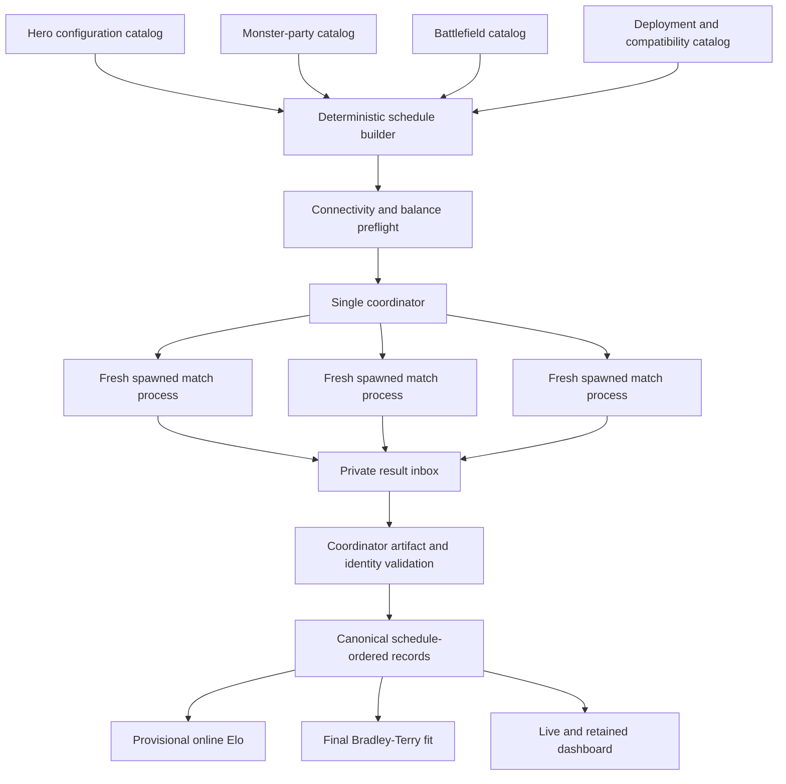
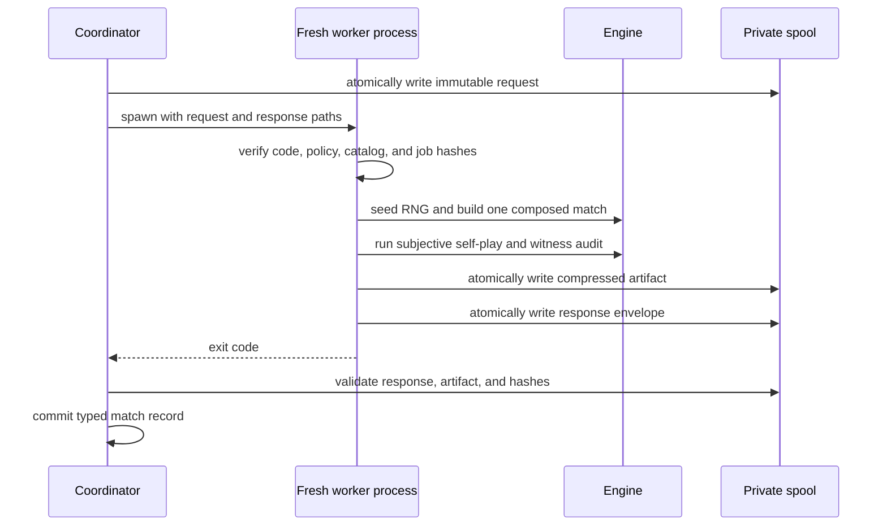

# Real Configuration Elo And Parallel Tournament Plan

## Purpose

Build the experiment that the first Elo attempt should have been: a connected,
cross-arena tournament that estimates the strength of reusable hero and monster
configurations rather than assigning unrelated ratings to fixed scenario pairs.

The current 760-match result remains useful as an atomic-fixture regression,
subjectivity audit, and performance baseline. It is not configuration Elo. The
new evaluator must separate combatant configuration, battlefield, deployment,
random trial, and opening treatment before any rating is computed.

The implementation has two equally important goals:

1. Produce statistically meaningful, connected configuration ratings with
   uncertainty and map-adjusted interpretation.
2. Execute thousands of matches concurrently without sharing engine registries,
   RNG state, sessions, events, files, policy memory, or subjective state.

## Decisions

The following choices are part of the plan, not open implementation shortcuts.

- The primary rated participant is a complete combat-ready side configuration.
  A hero build and a monster-party build each receive stable configuration IDs.
- Display names, UUIDs, positions, controllers, faction labels, and perception
  caches are not participant identity.
- Mechanical build, abilities, levels, equipment, inventory, spells, traits,
  reactions, resources, starting HP, and participant-owned starting conditions
  are participant identity.
- Battlefield and deployment are match context, not participant identity.
- Existing atomic arenas remain diagnostic recipes and compatibility wrappers.
- The baseline experiment crosses every portable hero configuration with every
  portable monster configuration on every portable battlefield.
- Both opening treatments form one paired trial block and use the same derived
  simulation seed.
- Provisional online Elo is retained for the live watcher.
- The official final rating is an order-independent Bradley-Terry strength
  estimate converted to Elo units, with battlefield and opening covariates.
- Every match runs in a fresh spawned interpreter. No threads, `fork`, or
  reusable engine workers are allowed in the first implementation.
- The coordinator alone writes canonical records, checkpoints, ratings,
  summaries, dashboard projections, and latest pointers.
- Subjectivity remains mandatory. Parallelism must not expose map identity,
  opponent configuration, objective manifests, or hidden engine state to policy.

## What The Previous Experiment Measured

The previous schedule was:

```text
atomic_arena_id x seed x opening_faction
```

Each atomic arena bundled one map, one hero roster, one monster roster, one
deployment, and scenario-local mutations. Each roster faced exactly one
opponent. The resulting comparison graph had 38 disconnected components, each
containing one hero setup and one monster setup.

Consequences:

- A 1165 rating in one arena was not comparable with 1165 in another arena.
- `setup_side`, `arena_balance`, and `roster` were local pair-balance measures.
- `policy_global` correctly remained empty because one policy cannot play itself
  as a distinct participant.
- `policy_side` was confounded by faction role, arena order, and Elo recency.
- The result supported regression and balance analysis, not a global ladder.

Before the new evaluator is presented, the previous result and dashboard must be
labeled `atomic_arena_baseline` everywhere. Its immutable evidence is retained.

## Current Catalog Facts

Runtime manifest normalization, excluding names, UUIDs, placement, controllers,
and perception caches, suggests approximately:

```text
38 legacy scenario recipes
15 mechanically distinct hero configurations
34 mechanically distinct monster-party configurations
8 mechanically distinct battlefield states
```

These counts are audit estimates, not authoritative catalog counts. The explicit
blueprints created in Phase 1 determine final identity.

The current factories in `dnd/scenarios/ai_validation_arenas.py` entangle:

```text
global reset
-> map, light, terrain, and object construction
-> absolute placement
-> hero and monster construction
-> equipment, items, spells, traits, conditions, and damage mutations
-> controller installation
-> senses
-> initiative
-> encounter start
```

The file already reuses class and monster factories, so the mechanics do not
need to be reimplemented. They need typed orchestration and stable identity.

One existing identity error must be removed: the current roster identity payload
retains `stable_name`. A renamed but mechanically identical actor therefore gets
a different hash. New configuration hashes are computed from blueprints and
exclude all cosmetic/runtime fields.

## Target Architecture



### Dependency Boundary

The coordinator imports contracts, catalogs, scheduling, validation, rating, and
dashboard code. It never hosts an engine match.

Each match process imports the engine, constructs exactly one match, writes one
private artifact, emits one small response envelope, and exits.

This is a process boundary, not a reset convention.

## Typed Scenario Factorization

Add a scenario evaluation package:

```text
dnd/scenarios/evaluation/
    models.py
    combatant_catalog.py
    battlefield_catalog.py
    deployment_catalog.py
    compatibility.py
    assembler.py
    legacy_recipes.py
```

All public contracts are Pydantic models with field descriptions and Google
style docstrings.

### Actor Blueprint

Use a discriminated union. Do not store arbitrary import paths or display-name
based behavior.

```python
class ClassActorBlueprint(BaseModel):
    kind: Literal["class"]
    actor_id: str
    class_id: Literal["barbarian", "fighter", "sorcerer"]
    factory_config: BarbarianConfig | FighterConfig | SorcererConfig
    deployment_role: str
    augmentations: tuple[EntityAugmentation, ...]


class BestiaryActorBlueprint(BaseModel):
    kind: Literal["bestiary"]
    actor_id: str
    bestiary_id: str
    deployment_role: str
    augmentations: tuple[EntityAugmentation, ...]


class SrdActorBlueprint(BaseModel):
    kind: Literal["srd"]
    actor_id: str
    monster_id: str
    deployment_role: str
    augmentations: tuple[EntityAugmentation, ...]
```

The assembler supplies runtime `name`, `faction`, and `position` through an
`ActorBuildContext`. Those values never enter the configuration hash.

### Entity Augmentations

Scenario-local mutations become typed data:

```text
InventoryGrant
SpellGrant
ReactionGrant
FeatureGrant
EquipmentOverride
DamageAffinityGrant
StartingDamage
StartingResourceOverride
StartingCondition
```

Every augmentation has a semantic ID and a typed payload. No production policy
or identity code uses display-name substring matching.

### Side Configuration

```python
class SideConfigurationSpec(BaseModel):
    config_id: str
    title: str
    side_kind: Literal["hero", "monster_party"]
    members: tuple[ActorBlueprint, ...]
    tags: tuple[str, ...]
    required_battlefield_capabilities: frozenset[str]
    forbidden_battlefield_capabilities: frozenset[str]
    diagnostic_only: bool
    content_hash: str
```

The primary ladder rates this full side configuration. An individual monster in
a multi-member party does not receive a fake Elo from a team outcome. A later
unit-contribution model may estimate member effects only after team compositions
provide enough independent variation.

### Battlefield

```python
class BattlefieldSpec(BaseModel):
    battlefield_id: str
    title: str
    geometry_id: str
    object_packages: tuple[ObjectPackageSpec, ...]
    light_state: str
    tags: tuple[str, ...]
    capabilities: frozenset[str]
    hero_spawn_slots: tuple[SpawnSlot, ...]
    monster_spawn_slots: tuple[SpawnSlot, ...]
    deployment_variants: tuple[str, ...]
    content_hash: str
```

Battlefield identity includes geometry, terrain, light, map-owned objects,
object states, and spawn-zone definitions. It excludes combatants.

### Deployment

Deployment maps member roles to map spawn slots. The first catalog keeps the 38
legacy deployments for exact reconstruction, but the primary ladder uses neutral
portable deployments for each battlefield.

```python
class DeploymentSpec(BaseModel):
    deployment_id: str
    battlefield_id: str
    variant: str
    hero_role_slots: dict[str, str]
    monster_role_slots: dict[str, str]
    max_hero_members: int
    max_monster_members: int
    rating_eligible: bool
```

Where geometry permits it, add a mirrored deployment treatment that exchanges
faction spawn zones. Opening faction and deployment orientation remain distinct
experimental factors.

### Legacy Recipe

Every existing arena becomes a compatibility recipe:

```python
class LegacyScenarioRecipe(BaseModel):
    arena_id: str
    battlefield_id: str
    deployment_id: str
    hero_config_id: str
    monster_config_id: str
    diagnostic_treatments: tuple[TreatmentSpec, ...]
```

`create_ai_validation_arena(arena_id)` remains public and delegates to the new
assembler. NeuroClient and existing server routes remain unchanged.

## Compatibility Preflight

The schedule is constructed only after a typed compatibility pass.

Hard-invalid combinations:

- too many members for available slots;
- duplicate, blocked, occupied, or missing spawn slots;
- actor footprint cannot occupy a slot;
- deployment references a role absent from the configuration;
- configuration requires an object/capability absent from the battlefield;
- treatment references an unresolved actor, item, condition, or object;
- no traversable or interactable relationship exists between factions;
- map construction or senses initialization fails;
- configuration content hash differs from the catalog snapshot;
- admitted rows disconnect the participant comparison graph.

Valid but diagnostic-only combinations include deliberately wounded targets,
artificial resistance/vulnerability laboratories, exact projectile allocation
fixtures, and deployments constructed to test one tactical behavior. They remain
in regression gauntlets but do not silently enter the general-strength ladder.

Preflight produces an immutable `CompatibilityReport` containing every admitted
and rejected combination with a typed reason. The dashboard displays exclusions.

## Real Experiment Design

The baseline factorial row is:

```text
HeroConfig
x MonsterConfig
x Battlefield
x DeploymentVariant
x SimulationSeed
x OpeningTreatment
```

### Paired Trial Block

One `(hero, monsters, battlefield, deployment, seed)` block contains:

```text
match A: heroes open
match B: monsters open
```

Both matches:

- derive the same simulation seed from the immutable block identity;
- generate the same initiative rolls before the requested faction is moved to
  the front;
- use identical configuration and battlefield hashes;
- run in separate fresh processes;
- are analyzed as one paired experimental block.

If either half is ineligible, the block is incomplete. Neither half enters the
official paired model until the failed half is repaired. Both remain visible as
evidence.

### Baseline Size

Using the audited catalog and one neutral deployment per battlefield:

```text
15 heroes x 34 monster parties x 9 battlefields x 2 openings
= 9,180 matches
```

This gives each hero configuration 612 baseline games and each monster-party
configuration 270 baseline games. The graph is fully connected. The ninth
battlefield is the dark open-floor SRD crypt, which the old manifest incorrectly
collapsed into the bright open floor because it did not hash tile light levels.

Mirrored deployments, where valid, increase the baseline toward 18,360 matches.
They should be included when preflight shows material spawn-zone bias.

The first full run uses one simulation seed per paired cell because the complete
cross already provides broad opponent and map replication. Further seeds are
allocated only after uncertainty analysis.

### Deterministic Interleaving

Do not group the schedule by battlefield as the previous matrix did.

Build balanced rounds using deterministic cyclic hero/monster matchings, then
interleave battlefield and treatment blocks with a declared schedule seed. In
every prefix window, configuration appearance counts should differ by at most
one where mathematically possible.

Schedule order is hashed and immutable. Completion order never changes it.

### Connectivity Gates

Before dispatch:

- the hero-monster graph has one component;
- no participant is isolated;
- no participant depends on one bridge edge for global rankability;
- each portable configuration appears on every compatible battlefield;
- opponent and map degrees satisfy declared minimums;
- the constrained statistical design matrix has full rank.

After failures are removed, the same gates run again. Disconnected evidence may
show component-local diagnostics but never a global rank.

## Rating System

### Provisional Online Elo

Online Elo exists for the live watcher and intuitive progress display.

- Initial rating: 1000.
- One common connected pool contains hero and monster configurations.
- Every accepted paired block is applied in canonical schedule order.
- Out-of-order worker completions are retained immediately, then provisional Elo
  is rebuilt from currently completed blocks sorted by schedule index.
- Final Elo is rebuilt from all eligible blocks rather than trusted from mutable
  incremental state.
- The dashboard labels it `Provisional Online Elo`.

The K-factor is declared in experiment metadata and covered by sensitivity
analysis. The final report includes schedule-permutation sensitivity so online
order effects are visible.

### Official Strength Model

The final estimator is the batch Bradley-Terry model underlying Elo, augmented
with experimental covariates:

```text
logit P(hero wins) =
    intercept
    + hero_strength[hero_config]
    - monster_strength[monster_config]
    + battlefield_effect[battlefield]
    + opening_effect[opening_treatment]
    + deployment_effect[deployment_variant]
```

Use sum-to-zero constraints or an explicit reference parameterization for
identifiability. Add weak predeclared Gaussian regularization because existing
sweeps demonstrate separation risk.

Convert fitted strengths to Elo units:

```text
elo_rating = 1000 + 400 / ln(10) * fitted_strength
```

Use NumPy and SciPy sparse optimization/Hessian machinery. Do not hand-roll a
general numerical optimizer. If meaningful draws appear, extend the likelihood
with a Davidson draw parameter.

### Terrain Specialization

A single global number can hide a ranged build that dominates open maps and
fails behind doors. Fit shrinkage-based `configuration x battlefield`
interaction diagnostics after the main model.

Report for every configuration:

- adjusted global Elo;
- 95% interval;
- empirical wins/losses/draws;
- games, distinct opponents, and distinct battlefields;
- bootstrap rank interval and probability of top-N;
- per-battlefield residual profile;
- opening and deployment sensitivity;
- predicted win probability against every opposing configuration.

### Uncertainty And Calibration

- Bootstrap complete paired blocks, not individual matches.
- Preserve seed, opening, and deployment pairing in every bootstrap sample.
- Require at least 95% successful bootstrap fits.
- Report 95% Elo and rank intervals.
- Report log loss, Brier score, and calibration buckets.
- Hold out paired blocks by seed or battlefield for predictive validation.
- Report regularization sensitivity.
- Never suppress perfect or near-perfect separation; expose it as uncertainty.

### Adaptive Follow-Up

Only after the complete 9,180-match baseline:

- allocate batches of 256 paired blocks;
- prioritize wide Elo intervals;
- prioritize adjacent ranks whose intervals overlap;
- prioritize near-even, high-information matchups;
- prioritize large battlefield-interaction residuals;
- preserve opponent and battlefield balance;
- always allocate both opening treatments.

Suggested stopping rule:

```text
all primary 95% Elo half-widths <= 75
and tier membership stable across two adaptive batches
and all connectivity/calibration gates pass
```

Budget exhaustion is reported as incomplete evidence, never as convergence.

## Leak-Free Parallel Execution

### Why Threads Are Forbidden

The engine has process-global mutable state:

- `EventQueue` events, handlers, callbacks, and spatial indexes;
- `BaseObject`, `BaseBlock`, `BaseCondition`, and `BaseValue` registries;
- entity position and entity registries;
- controller and encounter registries;
- global map state;
- `SessionManager` and module-global `sim`;
- observation projection caches and wakeup subscriptions;
- agent event streams and legal-action caches;
- process-global Python RNG.

Two threaded matches could reset or mutate each other while resolving actions.
The existing timeout also requires the POSIX main thread.

### Why Fork Is Forbidden

A forked child inherits a potentially dirty image containing registries, RNG
state, callbacks, event loops, locks, subscriptions, HTTP clients, GC state, and
subprocess handles. Copy-on-write prevents direct parent mutation but does not
make the inherited initial state scientifically clean.

### Why Reusable Workers Are Deferred

The current reset is not complete. Direct probes show that:

- `Dice` and `DiceRoll` registry entries survive
  `reset_standard_arena_runtime()`;
- game-event stream subscriptions survive that reset.

Reusable workers would therefore rely on an isolation boundary that is already
known to leak. They may be reconsidered only after a registry ownership audit
and explicit reset contract, never merely for speed.

### Selected Worker Topology

Use `asyncio.create_subprocess_exec()`:

```text
uv run python -m ai.evaluation.config_ladder.worker \
  --request <private-request.json> \
  --response <private-response.json>
```

Each process executes exactly one match and exits.



### Worker Request

```python
class MatchWorkerRequest(BaseModel):
    schema_version: Literal[1]
    experiment_id: str
    schedule_hash: str
    match_id: str
    match_index: int
    pair_block_id: str
    attempt_number: int
    dispatch_id: str
    hero_config_id: str
    hero_content_hash: str
    monster_config_id: str
    monster_content_hash: str
    battlefield_id: str
    battlefield_content_hash: str
    deployment_id: str
    deployment_variant: str
    simulation_seed: int
    opening_faction: Literal["heroes", "monsters"]
    max_commands: int
    soft_timeout_seconds: float
    expected_policy_hash: str
    expected_controller_profile: str
    expected_subjectivity_validator: str
    spool_directory: str
```

### Worker Response

```python
class MatchWorkerResponse(BaseModel):
    schema_version: Literal[1]
    experiment_id: str
    schedule_hash: str
    match_id: str
    match_index: int
    pair_block_id: str
    attempt_number: int
    dispatch_id: str
    worker_pid: int
    started_at: str
    completed_at: str
    status: WorkerStatus
    exit_code: int
    artifact_path: str | None
    artifact_sha256: str | None
    manifest_hash: str | None
    normalized_result_hash: str | None
    subjectivity_status: str
    subjectivity_violation_count: int
    timing: WorkerTiming
    stdout_path: str
    stderr_path: str
```

The response is not trusted until the coordinator validates the referenced
artifact and all expected identities.

### Coordinator

Add:

```text
ai/evaluation/config_ladder/
    contracts.py
    catalog_snapshot.py
    schedule.py
    worker.py
    coordinator.py
    artifact_store.py
    online_elo.py
    strength_model.py
    uncertainty.py
    projection.py
    cli.py
```

Coordinator responsibilities:

1. Acquire an experiment-level lock.
2. Load and hash the immutable schedule and catalog snapshot.
3. Validate compatibility and graph connectivity.
4. Create unique request, response, stdout, stderr, and artifact paths for every
   attempt.
5. Dispatch at most `worker_count` fresh processes.
6. Apply a coordinator hard timeout around every process group.
7. Validate each response and artifact before accepting it.
8. Write the canonical per-match record through one atomic writer.
9. Maintain completed, running, failed, retryable, and pending index sets.
10. Rebuild provisional Elo from accepted records in schedule order.
11. Publish watcher events from the coordinator only.
12. Resume from validated match records without duplicating attempts.
13. Fit final ratings only after paired-block and scientific gates pass.

Workers never write `matches/`, checkpoints, summary, dashboard, ratings, or
root latest pointers.

### Concurrency

On the current 32-vCPU, 61-GiB WSL machine:

- begin with 8 concurrent disposable processes;
- benchmark 1, 2, 4, 8, 12, and 16;
- choose the throughput knee subject to memory and artifact-I/O limits;
- expect 12 to be a likely operating point, not a hardcoded truth;
- expose `--workers` and retain the chosen count in experiment metadata.

Set deterministic child environment values such as `PYTHONHASHSEED`. Prevent
numerical libraries from creating nested worker pools. Every worker gets an
exclusive ext4 scratch directory so concurrent `/mnt/c` writes do not become the
simulation bottleneck.

### Timeouts And Crashes

- Worker soft deadline: local `SIGALRM` around one match.
- Coordinator hard deadline: terminate the worker process group, wait a short
  grace period, then kill.
- Always reap the process and verify no descendants remain.
- Capture stdout and stderr per immutable attempt.
- Distinguish `engine_timeout`, `worker_timeout`, `worker_crash`,
  `protocol_error`, and `artifact_validation_error`.
- The coordinator creates a failure artifact when the worker cannot.
- A failed row never updates ratings.
- Retry preserves match identity and seed while incrementing attempt number.

### Filesystem Isolation

```text
<scratch>/<experiment_id>/
    requests/<match_id>/attempt-0001.json
    responses/<match_id>/attempt-0001.json
    artifacts/<match_id>/attempt-0001.json.zst
    logs/<match_id>/attempt-0001.stdout.log
    logs/<match_id>/attempt-0001.stderr.log
```

Workers use temporary names plus atomic rename inside their private directory.
The coordinator validates SHA-256 before promoting paths into canonical records.

Full traces remain retained but compressed. At current artifact density, 9,180
uncompressed matches would approach 25 GB. Compact JSON plus Zstandard should
reduce storage and mounted-filesystem overhead while preserving forensic data.

## Subjectivity In Parallel Matches

Parallel workers do not receive permission to bypass the subjective runtime.

- Each faction receives its own session and subjective stream.
- Each session has actor-scoped policy memory.
- Available affordances still arrive through decision epochs.
- Workers do not pass objective map/config/job data into policy inputs.
- The independent event-history perception witness runs in every match.
- Match eligibility requires the expected witness version and zero violations.
- A normalized subjectivity digest is retained in the compact match record.
- Full witness evidence is retained in the compressed artifact.

Coordinator knowledge is evaluator knowledge, not agent knowledge.

## Determinism And Leakage Proofs

The following tests are release gates, not optional diagnostics.

### Engine-State Isolation

- Run simultaneous canary matches with unique names and semantic markers.
- Assert no artifact contains the other match's names, UUIDs, sessions, events,
  handlers, objects, conditions, or logs.
- Deliberately populate `Dice`, `DiceRoll`, event subscriptions, and registries in
  one process; prove a subsequent fresh process starts clean.
- Assert every executed match reports a distinct PID.

### RNG Determinism

- Run the same row serially and with 12 concurrent workers.
- Compare normalized outcome, HP, initiative rolls, semantic command sequence,
  dice results, and subjectivity digest.
- Repeat with fresh UUID allocations and different process dispatch order.
- Vary `PYTHONHASHSEED`; semantic results must remain stable or the policy's
  unstable ordering must be fixed before ratings are accepted.

### Completion-Order Independence

- Force workers to complete in reverse and random order.
- Canonical match records, online Elo, final model inputs, and summary hashes must
  equal the schedule-order run.

### Failure Isolation

- Crash one worker while others complete.
- Hard-timeout one worker and verify its process group is gone.
- Return malformed response JSON and a mismatched artifact hash.
- Kill the coordinator, resume it, and prove no match or Elo update duplicates.
- Start two coordinators for one experiment and prove the lock rejects one.

### Subjectivity

- Run hidden-enemy, darkness, door, transient forced-movement, and inventory-item
  leak regressions concurrently.
- All must retain the same witness result as isolated serial execution.

## Evidence Contracts

Every canonical row records:

```text
hero_config_id and content hash
monster_config_id and content hash
battlefield_id and content hash
deployment id and variant
pair block id
simulation seed
opening treatment
schedule, catalog, engine, ruleset, policy, and controller hashes
worker PID and attempt identity
outcome and final faction HP
subjectivity witness identity and digest
artifact path and SHA-256
spawn, construction, simulation, audit, serialization, and commit timings
```

The previous `arena_catalog_hash` covered descriptive metadata rather than full
factory behavior. The new `CatalogSnapshot` hashes the complete typed blueprints
and exact source/policy/ruleset identities used by workers.

## Live Watcher And Dashboard

Extend the existing event-stream machinery through coordinator-owned events:

```text
EXPERIMENT_STARTED
BLOCK_QUEUED
MATCH_DISPATCHED
MATCH_WORKER_STARTED
MATCH_COMPLETED
MATCH_FAILED
ARTIFACT_VALIDATED
PAIR_COMPLETED
PROVISIONAL_ELO_REBUILT
CHECKPOINT_WRITTEN
MODEL_FIT_STARTED
MODEL_FIT_COMPLETED
EXPERIMENT_COMPLETED
```

The watcher displays results and progress, not a tactical map.

Required views:

- final adjusted hero standings;
- final adjusted monster-party standings;
- provisional Elo beside official adjusted Elo;
- 95% Elo intervals and bootstrap rank ranges;
- hero-vs-monster predicted win matrix;
- empirical matchup matrix;
- battlefield and opening effects;
- per-configuration battlefield profiles;
- graph components, degree, bridges, and design rank;
- pair completion and adaptive allocation;
- worker queue, active PIDs, throughput, RSS, failures, and restarts;
- determinism canaries;
- subjectivity status and artifact links.

All dashboard values come from retained compact JSON. Full traces load only on
explicit forensic inspection.

### Final Published HTML Report

The experiment concludes by generating a polished, self-contained HTML report,
not by leaving the user to interpret a live operations screen. The report is a
deterministic projection of the final retained JSON and must be reproducible
offline without a running server.

The report has four narrative chapters:

1. **What was tested** explains participant identity, the connected comparison
   graph, battlefield coverage, paired opening treatments, exclusions, and the
   distinction between provisional Elo and adjusted configuration strength.
2. **Who was powerful** presents adjusted hero and monster-party standings,
   uncertainty, predicted and empirical matchup matrices, battlefield
   specialization, opening effects, and important interaction residuals.
3. **How efficiently it ran** presents total wall time, matches and turns per
   second, CPU utilization, peak and per-worker RSS, queueing, setup,
   simulation, audit, serialization, compression, and commit time.
4. **What parallelization changed** compares serial, 8-worker, 12-worker, and
   16-worker pilots using speedup, parallel efficiency, throughput, resource
   pressure, failure rate, determinism canaries, and the selected production
   concurrency.

Required visualizations include:

- forest plots for adjusted Elo and 95% intervals;
- bootstrap rank-distribution or rank-range plots;
- predicted and empirical hero-by-monster heatmaps;
- battlefield-effect and opening-treatment coefficient plots;
- per-configuration battlefield profile small multiples;
- matchup graph connectivity and coverage diagnostics;
- cumulative completion and throughput time series;
- phase-level latency distributions and stacked runtime composition;
- worker occupancy, queue depth, RSS, and failure timelines;
- serial-versus-parallel speedup and efficiency curves with an ideal-scaling
  reference;
- calibration, residual, and held-out prediction plots;
- prominent evidence-quality cards for subjectivity, determinism, completion,
  convergence, bootstrap success, and excluded blocks.

Every chart must include a title, plain-language interpretation, units,
denominator, and uncertainty where applicable. Empty or unavailable metrics are
shown as unavailable with an explanation; the renderer never invents values.
Accessible tables accompany charts, colors remain legible in dark and light
contexts, tooltips expose exact values, and configuration rows link to their
match evidence. Large matrices support filtering and highlighting without
requiring a tactical-map frontend.

The report renderer consumes a versioned `report.json` projection rather than
embedding hand-maintained statistics. A focused test reconstructs every visible
number from source records and verifies that the HTML contains no manually
authored result constants.

## Implementation Phases

### Phase 0: Correct The Existing Label

- Rename the documented result to `Atomic Arena Baseline`.
- Keep its evidence immutable.
- Keep the existing evaluator as an atomic regression command.
- Remove claims that its disconnected setup ratings form a global Elo ladder.

### Phase 1: Typed Catalogs And Identity

Implement scenario evaluation contracts and explicit catalogs.

Acceptance:

- configuration hashes ignore name, faction, position, controller, UUID, and
  senses caches;
- hashes include every mechanical augmentation;
- aliases with the same content hash are reported;
- every catalog entry builds in isolation;
- catalog snapshot is deterministic.

### Phase 2: Assembler And Legacy Equivalence

Implement the single reset/build/start assembler and convert all 38 legacy
factories to recipes without changing their public API.

Acceptance:

- seeded legacy recipes reproduce normalized map, roster, item, action, spell,
  trait, condition, position, object, and initiative manifests;
- existing scenario tests continue to pass;
- NeuroClient/server paths are untouched.

### Phase 3: Portable Deployments And Compatibility

- Add neutral deployments for every battlefield.
- Add mirrored variants where valid.
- Build and retain compatibility reports.
- Separate general-rating contexts from diagnostic-only treatments.

Acceptance:

- no silent skip;
- every exclusion has a typed reason;
- every admitted composition builds and can reach/interact;
- participant graph is connected.

### Phase 4: Connected Schedule

- Add factorial schedule contracts and deterministic interleaving.
- Add pair block identity and seed derivation.
- Add catalog, engine, policy, controller, ruleset, and schedule hashes.

Acceptance:

- expected 9,180-row base schedule for the audited 15 x 34 x 9 catalog;
- every portable cell has both openings;
- prefix balance, uniqueness, and connectivity tests pass;
- changing any blueprint changes the schedule/catalog identity.

### Phase 5: Disposable Worker And Coordinator

- Add typed request/response protocol.
- Add one-match worker CLI.
- Add asynchronous bounded coordinator.
- Add ext4 spool, compression, content hashes, process-group deadlines, retries,
  resume, and sole-writer checkpoints.

Acceptance:

- all leakage, determinism, completion-order, crash, timeout, lock, and resume
  tests pass;
- no worker writes canonical shared files;
- no child survives timeout or coordinator shutdown.

### Phase 6: Ratings And Uncertainty

- Implement provisional online Elo.
- Add NumPy/SciPy dependency for sparse Bradley-Terry fitting.
- Add constraints, weak regularization, Hessian diagnostics, paired bootstrap,
  rank uncertainty, calibration, and map interactions.

Acceptance:

- synthetic known-strength tournaments recover parameters within tolerance;
- shuffled schedule does not alter final batch ratings;
- online Elo order sensitivity is reported;
- disconnected or rank-deficient evidence refuses global ratings;
- bootstrap success exceeds 95%.

### Phase 7: Dashboard And Watcher

- Add connected-ladder projection and live worker events.
- Build the standings, matchup, map-effect, graph, uncertainty, and worker views.

Acceptance:

- dashboard uses retained JSON only;
- no full traces are embedded;
- live and final projections agree after completion;
- the UI labels provisional Elo and official adjusted ratings distinctly.

### Phase 8: Pilot, Scaling Benchmark, And Full Baseline

1. Run a 2 hero x 2 monster x 2 battlefield paired smoke.
2. Run a connected 49-configuration pilot using three battlefields and a
   balanced degree-six opponent graph.
3. Benchmark 1, 2, 4, 8, 12, and 16 disposable concurrent processes on a fixed
   representative block set.
4. Select the throughput knee and record the reason.
5. Run the complete portable cross-product baseline.
6. Fit ratings and inspect uncertainty/calibration.
7. Allocate adaptive paired batches only if stopping gates are not met.

## Focused Test Files

```text
tests/manual/test_71_combatant_configuration_catalog.py
tests/manual/test_72_battlefield_deployment_catalog.py
tests/manual/test_73_composed_legacy_scenarios.py
tests/manual/test_74_connected_rating_schedule.py
tests/manual/test_75_isolated_match_worker.py
tests/manual/test_76_parallel_rating_coordinator.py
tests/manual/test_77_configuration_strength_model.py
tests/manual/test_78_connected_rating_dashboard.py
tests/manual/test_79_connected_rating_real_smoke.py
```

Run each file individually with `uv run pytest`. Do not run the complete suite.

## Completion Gates

The feature is complete only when all of the following are true:

1. Hero, monster-party, battlefield, deployment, and treatment identities are
   explicit and independently constructible.
2. All 38 legacy recipes retain normalized behavioral parity.
3. The rated participant graph is connected after eligibility filtering.
4. Every admitted hero and monster configuration faces multiple opponents on
   every compatible battlefield.
5. Both opening treatments are complete for every official paired block.
6. Every match runs in a fresh spawned interpreter.
7. Cross-process canaries prove no registry, RNG, event, session, memory,
   subjective-state, or filesystem leakage.
8. Serial and parallel normalized outcomes are deterministic.
9. Worker completion order cannot change canonical evidence or ratings.
10. Every official row passes the independent subjectivity witness.
11. Online Elo is explicitly provisional and reconstructed in schedule order.
12. Official Bradley-Terry ratings converge, are connected, include map/opening
    effects, and report uncertainty and calibration.
13. The full portable baseline is completed with no unexplained exclusions,
    orphan processes, duplicate attempts, or missing artifacts.
14. The dashboard reports configuration rankings, matchup probabilities, map
    specialization, uncertainty, connectivity, worker health, and evidence.
15. The previous 760-match evidence is presented only as an atomic arena
    baseline.
16. A self-contained final HTML report explains power, uncertainty, efficiency,
    and parallel scaling entirely from versioned retained JSON, with accessible
    tables and direct evidence links.

Only then do we have real cross-arena Elo estimates for hero and monster
configurations.
