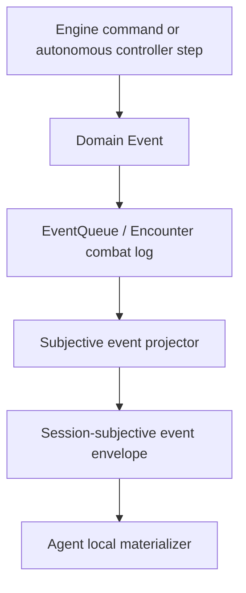
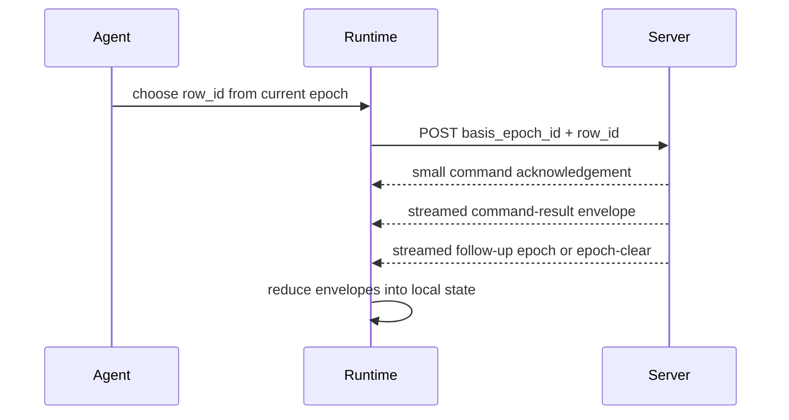
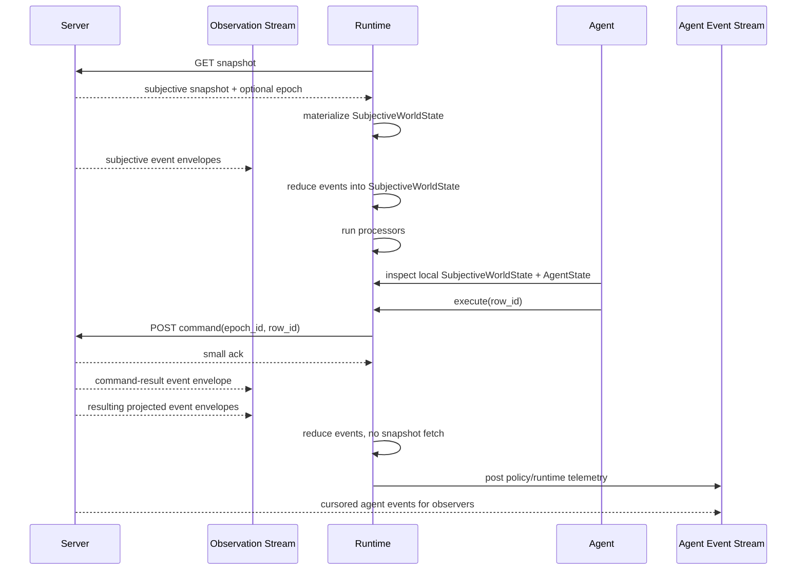
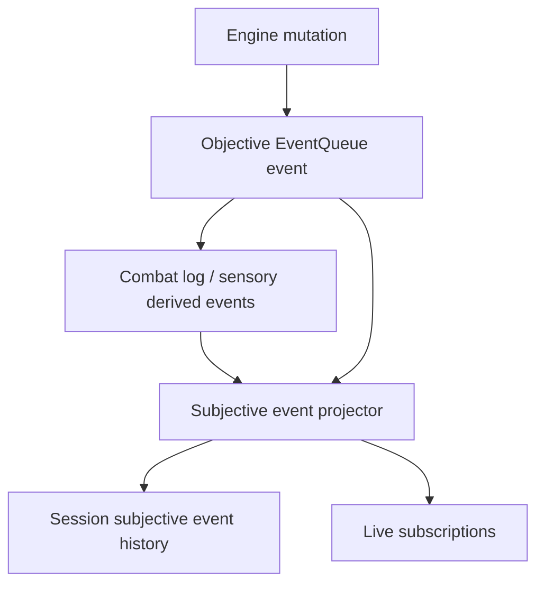
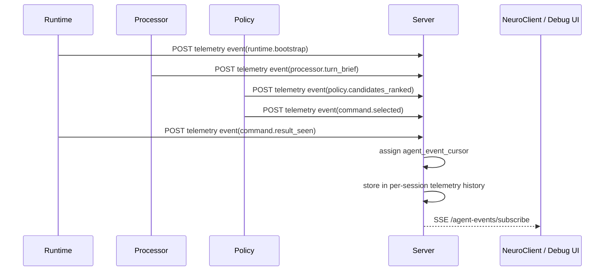

# Seamless Subjective Runtime Plan

## Purpose

The agent runtime should feel like a local replicated subjective world, not like
a client repeatedly asking the server what exists and what it can do.

The server remains authoritative. The agent receives a strict session-subjective
event stream, applies it locally, and makes decisions from local state:

- `SubjectiveWorldState`: what the session knows;
- `DecisionEpoch`: what the active controlled actor can legally do now;
- `AgentState`: derived variables produced locally by processors;
- `AgentEvent`: telemetry emitted by the agent for observability.

Snapshots are for bootstrap and recovery. Normal play should be stream-first.

## Event-First Constraint

This plan must preserve the engine principle that events are the information
carrier for game state.

The agent-side stream is not a second state bus. It is a session-subjective
projection of event information:



The local materialized `SubjectiveWorldState` is a reducer output over a history of
subjective event envelopes. It is not a separately authoritative state feed.

Important constraints:

- every normal world delta must be traceable to an engine event, combat-log
  event, sensory event, turn event, or explicit controller-command event;
- synthetic convenience patches are allowed only as projections of a named
  causal event;
- snapshots are checkpoints over event history, not the normal information
  carrier;
- `DecisionEpoch` is a controller-facing affordance event produced at a turn or
  action boundary;
- `CommandResult` is a controller-command event result, not arbitrary server
  state.

## Implemented Runtime

Normal commands remain on the subjective stream without replacing local state
from a fresh snapshot:



Fresh snapshots are used only for bootstrap, stream eviction, cursor gaps,
explicit resynchronization, or command follow-up timeout.

## Target State

Normal runtime flow should be:



The agent sees one coherent local world. The backend remains the only legal
action authority, but legal actions arrive as controller-facing decision-epoch
events.

## Stream Model

There should be one authoritative session-subjective event stream per
controller session.

The stream carries event envelopes for these concepts:

- sensory/world events projected for this session;
- session and encounter lifecycle events projected for this session;
- combat-log events visible to this session;
- command result events;
- decision epoch events;
- stream sync, heartbeat, and eviction messages.

The client reduces all event envelopes idempotently by `observation_cursor`.

### Snapshot

Snapshot is used for:

- initial bootstrap;
- recovery after cursor gap;
- recovery after stream eviction;
- stale command correction when the server cannot express enough delta;
- CLI/debug commands that are intentionally stateless.

Snapshot should not be the normal post-action path.

### Event Envelopes

Event envelopes should be the normal path. Every envelope must carry enough
session-subjective information for local materialization without reading
objective engine state.

Envelope invariants:

- monotonically increasing `observation_cursor`;
- duplicate envelopes are safe to ignore;
- a gap marks the runtime as needing resync;
- every decision epoch declares its `basis_observation_cursor`;
- command result events can be correlated with the command id or row id;
- hidden objective information never appears in an envelope;
- every envelope has a causal source label such as `source_event_uuid`,
  `source_combat_log_cursor`, `source_sensory_event_uuid`, or
  `source_command_id`.

## Command Lifecycle

Commands are submitted against a specific epoch:

```json
{
  "actor_uuid": "...",
  "basis_epoch_id": "...",
  "row_id": "entity|Eldritch Blast|uuid=...",
  "prefer_safe": true
}
```

The server validates:

- session exists;
- actor is controlled by the session;
- actor is active now;
- epoch is still current;
- row id exists in that epoch;
- engine execution accepts the resolved action.

Then the server emits subjective event envelopes.

## Desired Command Response

The HTTP response should become a small delivery acknowledgement:

```json
{
  "status": "accepted",
  "command_id": "...",
  "accepted_at_observation_cursor": 42,
  "result_expected_after_cursor": 42
}
```

For rejected/stale commands:

```json
{
  "status": "stale",
  "command_id": "...",
  "current_epoch_id": "...",
  "resync_required": false
}
```

The detailed result belongs in the event stream, not mainly in the HTTP
response.

## Server-Side Work

### 1. Subjective Event Projection Service

Create a dedicated service for session-subjective event projection:

```text
SubjectiveEventStream
  publish_projected_event(session_id, envelope)
  publish_command_result_event(session_id, command_result)
  publish_decision_epoch_event(session_id, epoch)
  publish_session_event_projection(session_id, source_event)
  publish_encounter_event_projection(session_id, source_event)
  replay_since(session_id, cursor)
```

It should own:

- per-session subjective-event cursor allocation;
- bounded envelope history;
- per-session subscriptions;
- replay after cursor;
- eviction behavior.

It should consume the existing `EventQueue`, encounter combat-log listener, and
sensory events as its causal source. It should not invent an unrelated state
transport where patches appear without a named event cause.

### 2. Event Projection Into The Subjective Stream

The current projector can build snapshots and derive subjective envelopes from
source event history. The seamless model needs an online event projection path:



The projector should produce session-safe event envelopes. The stream service
should assign session-local cursors and store/send envelopes.

### 3. Command Result Events

After every AI command:

- create or project a controller-command event;
- emit a `COMMAND_RESULT` subjective event envelope;
- include status, command id, row id, epoch id, message, and safe payload;
- include command failure details when safe;
- never include objective hidden state.

Then emit or attach any resulting:

- session event projection;
- encounter event projection;
- entity/object/tile event projections;
- combat-log event projection;
- new decision epoch if the same session can still act.

### 4. Epoch Publication Rules

Decision epochs should be emitted as controller-facing subjective events:

- at controlled turn start;
- after a command that leaves the same actor able to act;
- after a rejected command when legal rows have changed or need clarification;
- after a stale command when the server can provide the new epoch safely;
- after resync snapshot when the session controls the active actor.

No epoch should be emitted:

- when it is not the session's turn;
- when the actor is no longer alive/able to act;
- when the encounter ended;
- when hidden targets would be required to explain a row.

### 5. Remove Normal Post-Command Resync

Change `SubjectiveRuntime.execute()` and `end_turn()`:

- submit command;
- receive small ack;
- wait for command-result/epoch event envelopes;
- reduce envelopes normally;
- only call `resync()` on gap, eviction, explicit `resync_required`, or timeout.

## Client-Side Work

### 1. Runtime State Machine

The runtime should have explicit modes:

```text
BOOTSTRAPPING
STREAMING
WAITING_FOR_EPOCH
COMMAND_IN_FLIGHT
RESYNC_REQUIRED
CLOSED
```

Important transitions:

- `BOOTSTRAPPING -> STREAMING` after snapshot loads;
- `STREAMING -> WAITING_FOR_EPOCH` when no current epoch exists;
- `WAITING_FOR_EPOCH -> STREAMING` when frame carries an epoch;
- `STREAMING -> COMMAND_IN_FLIGHT` after command submit;
- `COMMAND_IN_FLIGHT -> STREAMING` after matching command result frame;
- any mode -> `RESYNC_REQUIRED` on cursor gap/eviction/stale-without-epoch;
- `RESYNC_REQUIRED -> STREAMING` after snapshot reload.

### 2. Local Store

`SubjectiveStore` should apply:

- observation patches;
- command result frames;
- epoch frames;
- explicit epoch clear frames;
- session/encounter turn patches.

It should expose:

- `world`;
- `agent_state`;
- `last_command_results`;
- `stream_health`;
- `pending_commands`.

### 3. Hooks And Processors

Processors should run on lifecycle hooks:

- snapshot loaded;
- event envelope applied;
- epoch started;
- command accepted/rejected/stale;
- action completed;
- turn ended;
- stream gap;
- resync completed.

This lets us do automatic local post-processing without hardcoding everything
into the agent policy:

- rebuild action indices;
- summarize action economy;
- update path/topology facts;
- update combat memory;
- emit brief text;
- rank obvious candidate rows;
- publish trace events.

## Agent Events

Agent events are not game state. They are observability events emitted by
the local runtime, processors, policy, and tools.

They answer questions like:

- what did the agent know when it acted?
- which rows did it consider?
- why did it choose one row?
- did it detect stale state?
- did it resync?
- did a processor produce a warning?
- did an LLM request a local query/tool?

They must not be used as the authoritative record of what happened in combat and
must never mutate game state. The authoritative gameplay record is still the
engine event/combat-log stream, and the authoritative controller view is the
session-subjective projection of that event history.

## Agent Event Flow



Each event should include:

- `agent_event_cursor` assigned by server;
- `session_id`;
- optional `actor_uuid`;
- optional `epoch_id`;
- optional `observation_cursor`;
- optional `source_observation_event_cursor`;
- `event_type`;
- severity;
- source subsystem;
- summary;
- structured payload;
- tags.

## How We Observe An Agent

There are three complementary views.

### 1. Live Agent Event Stream

Endpoint:

```text
GET /ai/sessions/{session_id}/agent-events/subscribe?since=<cursor>
```

This powers live debugging panels:

- current runtime state;
- last turn brief;
- candidate rows considered;
- selected row and reason;
- stale/resync warnings;
- processor alerts;
- LLM/tool calls later.

### 2. Agent Event History

Endpoint:

```text
GET /ai/sessions/{session_id}/agent-events?since=<cursor>&limit=<n>
```

This supports:

- replaying agent reasoning after a combat;
- attaching traces to bug reports;
- comparing policies;
- building training/evaluation datasets later.

### 3. Correlated Timeline

A useful UI should merge three streams by cursor/time:

```text
engine events / combat logs
subjective event envelopes
agent telemetry events
```

The correlation keys are:

- `observation_cursor`;
- `epoch_id`;
- `actor_uuid`;
- wall-clock timestamp;
- command id once added.

This gives a debugger a timeline like:

```text
Observation event 42: Warlock sees Hero through doorway.
Decision epoch event E42: 8 legal rows emitted.
Agent telemetry: ranked Eldritch Blast above Move.
Agent telemetry: selected entity|Eldritch Blast|uuid=hero.
Command event C9: accepted.
Observation event 43: attack/combat-log projection.
Decision epoch event E43: no meaningful actions remaining.
Agent telemetry: selected End Turn.
```

## NeuroClient Observability

NeuroClient should not need to become an AI controller to observe AI.

Later UI panels can subscribe to:

- existing human `/events/subscribe`;
- new `/ai/sessions/{session_id}/agent-events/subscribe`;
- optional AI observation stream for sessions the UI is authorized to inspect.

For development we can allow a trusted debug observer to inspect AI agent
events broadly. For multiplayer/fairness modes, agent-event visibility should
be permissioned, because events may reveal subjective information or policy
intent.

## Privacy And Fairness

Agent events can leak the agent's private subjective knowledge. Therefore:

- normal opponents should not automatically receive another agent's event stream;
- a debug/admin viewer may receive it;
- post-game replay may expose it after the match;
- public tournament/PvP modes need explicit policy.

Observation frames remain stricter than the trusted human-client endpoints.

## Implementation Milestones

### Milestone 1: Online Observation Publisher

Deliverables:

- per-session frame history;
- cursor allocation;
- replay/subscribe APIs backed by publisher;
- snapshot remains unchanged;
- current projector feeds the subjective event stream from new engine events.

Tests:

- frames have monotonic cursors;
- duplicate frames ignored by store;
- replay since cursor matches live frames;
- hidden facts remain hidden.

### Milestone 2: Command Result Frames

Deliverables:

- command ids;
- command result frame emission;
- command ack response reduced to delivery status;
- command result applies in `SubjectiveStore`.

Tests:

- accepted command emits result frame;
- rejected command emits safe detail;
- stale command carries current epoch or resync instruction;
- no objective state leaks.

### Milestone 3: Epoch-After-Action Streaming

Deliverables:

- server emits fresh epoch after action if actor still controls turn;
- server emits epoch clear when turn passes away;
- runtime waits for stream frames after commands;
- no default post-command snapshot fetch.

Tests:

- multi-action turn proceeds without snapshot fetch;
- end-turn clears epoch;
- stale epoch blocks execution;
- cursor gaps still trigger snapshot recovery.

### Milestone 4: Agent Event Observability

Deliverables:

- runtime posts structured events for bootstrap, epoch, candidates, command,
  result, stale, resync;
- processors can emit events or traces;
- history and SSE are queryable by session;
- basic debug timeline endpoint or helper can correlate agent events with
  observation cursors.

Tests:

- events are session-scoped;
- event cursors are monotonic;
- event stream replays and heartbeats;
- unauthorized cross-session reads are rejected or empty according to policy.

### Milestone 5: UI/Debug Tooling

Deliverables:

- Codex `watch` shows latest local epoch brief and recent agent events;
- debug command can print correlated timeline;
- NeuroClient can optionally display AI activity panel in trusted dev mode.

Tests:

- Codex tool output includes epoch rows and warnings;
- agent event history can reconstruct a turn narrative;
- existing human APIs remain unchanged.

## Success Criteria

The setup is seamless when:

- the agent bootstraps once from snapshot;
- legal actions arrive through decision epochs;
- commands are submitted by `epoch_id + row_id`;
- command results arrive through the observation stream;
- the runtime does not fetch snapshots after normal accepted commands;
- resync is exceptional and explicit;
- agent telemetry is visible through a separate cursor-ordered stream;
- NeuroClient/human APIs keep working unchanged.
