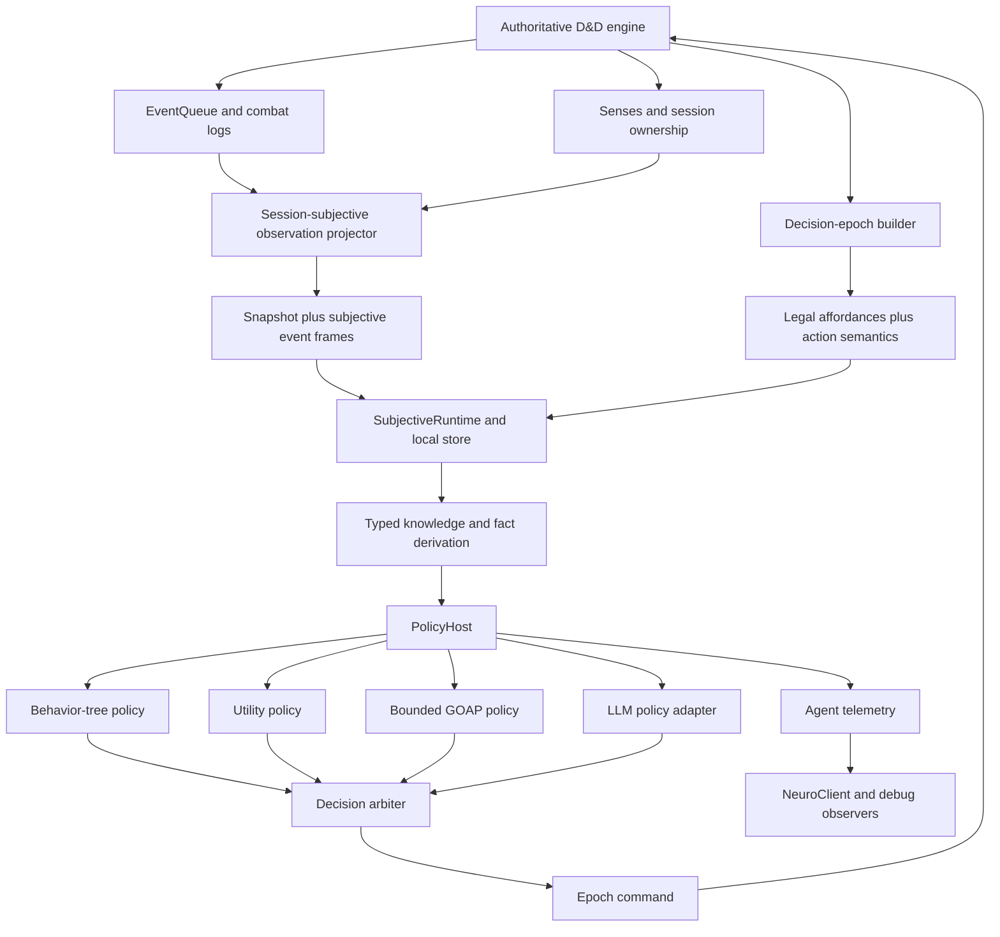
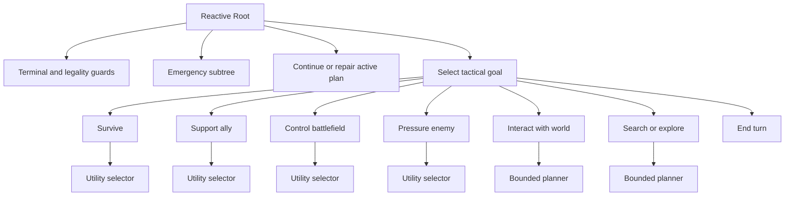
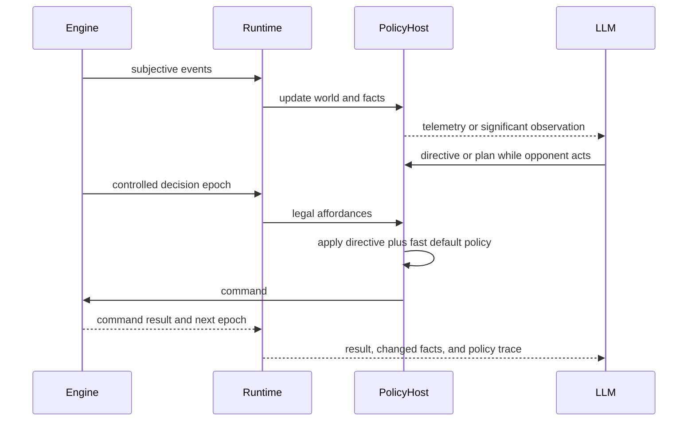

# Unified Agent Architecture

Status: architectural proposal

Scope: traditional game AI, LLM-controlled agents, Codex takeover, external
controllers, self-play, and agent observability

## 1. Executive Position

The D&D engine should expose one controller-facing reality and permit many ways
of deciding what to do with it.

The controller-facing reality is:

1. a session-subjective stream of completed game events;
2. a locally materialized subjective world state;
3. a decision epoch containing every command currently legal for the controlled
   actor;
4. a command/result protocol tied to the epoch that authorized the command.

Traditional AI and LLM agents should not receive different worlds, use different
action APIs, or maintain unrelated tactical models. They should differ only in
the policy that consumes the shared state and affordances.

The central abstraction is a policy host independent of whether the caller is
deterministic or an LLM:

```text
subjective runtime
    -> typed knowledge and tactical facts
    -> policy host
        -> default reactive policy
        -> utility policy
        -> bounded planner
        -> LLM directive policy
        -> LLM direct-command policy
    -> one validated command
    -> authoritative engine
```

The policy host owns arbitration, memory, deadlines, fallback behavior, and
telemetry. Individual policies are pure or nearly pure decision modules. They do
not perform HTTP requests, mutate the engine, or invent legal actions.

The recommended default videogame AI is a hybrid:

- utility-selected goals or tactical modes;
- a hierarchical behavior tree for reactive control;
- utility scoring inside behavior-tree choice points;
- bounded GOAP for genuinely multi-step objectives;
- replanning after every action-result event and decision epoch.

An LLM can participate at several levels. It may set goals, adjust utility
weights, configure exposed behavior-tree parameters, propose a symbolic plan, or
select an immediate legal row. These are all typed policy decisions over the same
runtime. The LLM should normally use the highest-level intervention that can
express its intent, while direct action remains available when exact tactical
control is needed.

## 2. Why A Unified Architecture Matters

The engine already has the difficult foundation: authoritative events, senses,
session ownership, action discovery, action economy, conditions, spatial state,
and combat logs. Fragmenting those facts into separate AI products creates
several avoidable failures:

- a traditional controller and an LLM disagree about what is visible;
- one controller receives legal actions while another reconstructs legality;
- tactical summaries become a second and eventually inconsistent world model;
- each policy invents its own names for concentration, hazards, support, and
  object interaction;
- testing proves one adapter while production uses another;
- telemetry cannot compare policies because their inputs are different;
- improvements made for an LLM cannot benefit the fast default AI;
- policies become tied to action names rather than game semantics.

A unified contract turns the architecture into a controlled experiment. Given
the same subjective history and decision epoch, different policies can be run,
compared, replayed, and debugged. The engine remains the game authority. The
policy remains a replaceable decision mechanism.

## 3. Existing Foundation To Preserve

The following ideas in the current implementation are directionally correct and
should remain:

- Objective game state lives inside the engine.
- All game-state changes flow through engine events.
- A session receives a subjective projection rather than raw objective events.
- A local store materializes snapshots plus ordered frames.
- Observation cursors make replay and gap detection explicit.
- A decision epoch carries current legal affordances and action economy.
- Commands reference both the decision epoch and a stable row identifier.
- The server revalidates every command.
- Command results and follow-up epochs return through the subjective stream.
- Agent telemetry is separate from gameplay truth.
- Runtime takeover uses a lease and can restore the default controller.
- Human client APIs can remain independent while the AI runtime matures.

The architecture proposed here reorganizes and completes those ideas. It does
not replace the engine event system with a generic AI state bus.

## 4. Single Subjective And Policy Stack

The runtime now has one source of session-subjective truth:

- `SubjectiveWorldState` materializes the observation stream;
- `AgentFacts` is the typed, revision-aligned derived knowledge layer;
- `DecisionEpoch` contains authoritative action economy and legal affordances;
- `PolicyContext` binds that exact world, fact revision, and epoch;
- `PolicyHost` owns policy evaluation, command correlation, retries, and routine
  memory;
- external AI, self-play, and Codex consume the same `PolicyDecision`;
- Codex briefs and turn summaries are presentation projections, and their
  recommendations/objectives are projected from that shared decision.

The former external reduced-state model, ordered name-aware policy, and
Codex-specific recommendation scorer have been removed. There is no runtime
fallback into a second policy. A clean architecture permits exactly one source
of subjective truth and any number of read-only derived views.

The redesign must therefore provide:

- one typed subjective truth;
- one typed action-semantic vocabulary;
- one shared policy context;
- explicit separation between goals, control flow, candidate generation, and
  scoring;
- structured, inspectable policy decisions;
- deterministic replay for traditional policies;
- typed, bounded influence for LLM policies;
- persistent raw evidence for self-play and performance work.

## 5. Formal Control Model

### 5.1 Objective And Subjective State

Let `s_t` be the objective engine state after completed engine event `t`. A
controller never receives `s_t` directly.

For session `sigma`, the observation projector applies session ownership,
perception, remembered knowledge, and combat-log visibility:

```text
o_t^sigma = Project(sigma, e_t, s_t)
```

The session's observation history at decision epoch `k` is:

```text
h_k^sigma = (o_0^sigma, a_0, r_0, ..., o_k^sigma)
```

The local reducer materializes a typed subjective state:

```text
s_hat_k^sigma = Reduce(h_k^sigma)
```

`s_hat` is not the objective world and is not automatically a full Bayesian
belief distribution. It is the controller's explicit knowledge state:

- visible now;
- observed previously;
- remembered at a last-known position;
- inferred from subjective evidence;
- unknown.

Probabilistic hypotheses may be added as derived policy memory, but must never be
silently promoted into observed facts.

### 5.2 Decision Epochs

At epoch `k`, the authoritative server supplies a legal affordance set:

```text
A_k^sigma = LegalAffordances(s_t, sigma, active_actor)
```

The controller chooses:

```text
a_k in A_k^sigma
```

The policy does not infer `A_k` from world state. It may predict which future
affordances could become available, but only the server's current epoch can
authorize a command.

### 5.3 Variable-Length Turns

A D&D turn is not one action. It is a variable-length sequence of decision
epochs bounded by action economy and resources:

```text
epoch_0 -> action -> epoch_1 -> bonus action -> epoch_2
        -> movement -> epoch_3 -> free interaction -> epoch_4 -> end turn
```

The turn ends when the controller selects end turn, the actor can no longer act,
the actor dies or becomes incapacitated, or the encounter ends.

The number of decisions in turn `tau` is a stopping time `N_tau` determined by
observed outcomes and remaining resources. A policy may retain a plan across
epochs, but every action can produce reactions, damage, new visibility, changed
terrain, changed concentration, or a different legal action set. Replanning is
therefore mandatory after every authoritative result.

### 5.4 Policy Function

The general policy contract is:

```text
decision_k = pi(
    subjective_state_k,
    affordance_set_k,
    derived_facts_k,
    policy_memory_k,
    active_directives_k,
    deadline_k,
)
```

The output is not necessarily an immediate command. It may be:

- an executable command;
- an intent that is resolved to an executable command;
- a goal selection;
- a plan proposal;
- a behavior-tree directive;
- a request to wait for more information;
- an explicit end-turn decision;
- an escalation requesting LLM or human judgment.

The policy host resolves these outputs into at most one current command.

## 6. Architectural Layers



### 6.1 Authority Boundaries

The engine owns:

- objective entities and map state;
- rules and legality;
- perception and visibility;
- event ordering;
- action execution;
- random outcomes;
- conditions, resources, and action economy;
- encounter progression.

The subjective runtime owns:

- session-local materialization;
- cursor handling and replay;
- derived state hooks;
- command/result correlation;
- resynchronization and transport health.

The policy host owns:

- actor-scoped policy memory;
- active goals, plans, and directives;
- policy deadlines and fallback selection;
- command proposal arbitration;
- agent telemetry emission.

Policies own:

- goals and preferences;
- candidate ranking;
- plan construction;
- behavior selection;
- explanations for their choices.

Policies do not own legality, event mutation, visibility, or turn advancement.

### 6.2 Append-Only Session History

A session snapshot establishes its observation lifetime at the current
objective event cursor. It materializes present subjective knowledge but does
not fabricate pre-session engine events as replay frames. Once initialized,
completion events are projected eagerly with the ownership, senses, combat-log
perceivers, and encounter state that exist at that event boundary.

Session ownership is a control-plane transition over the same subjective
timeline. Before assignment, takeover, release, or lease restoration mutates
ownership, the composition root flushes pending events under the old ownership.
It then appends an atomic typed state-replacement frame for each affected
initialized session. The frame rebases session authority, observers, current
facts, remembered facts, seen topology, visible log memory, and decision-epoch
authority without renumbering or regenerating any earlier frame.

Global projection clearing is reserved for a genuine simulation or encounter
reset. A controller transition must not evict unrelated subscribers, clear
unrelated histories, or refilter historical logs through the new owner. A newly
created session bootstraps the current state; an existing session preserves what
it already observed and learns only through later subjective frames.

## 7. Dependency Direction

The package direction should be explicit:

```text
dnd/*
    no dependency on ai

ai/protocol/base.py
    leaf JSON values, identifiers, cursors, and shared enums

ai/protocol/control.py
    imports only protocol.base
    decision epochs, affordances, commands, and command results

ai/protocol/observation.py
    imports protocol.base and protocol.control
    subjective facts, snapshots, and event envelopes

ai/protocol/semantics.py and telemetry.py
    import only lower protocol modules

ai/observation/*
    imports dnd and ai.protocol
    projects engine truth into session truth

ai/runtime/*
    imports ai.protocol only
    materializes and replays subjective state

ai/knowledge/*
    imports ai.protocol and ai.runtime models
    derives facts, indexes, and policy memory

ai/policy/*
    imports ai.protocol and ai.knowledge
    contains BT, FSM, utility, GOAP, arbitration

ai/llm/*
    imports ai.protocol and ai.policy contracts
    contains presentation, tools, and LLM adapters

server/*
    hosts observation, command, telemetry, and lease endpoints

ai/driver.py
    composition root that imports runtime and policy implementations
```

The protocol package must not import engine objects, projectors, runtime classes,
or policy implementations. In particular, `DecisionEpoch`, `AffordanceSet`,
command requests, and command results belong in `protocol/control.py`. Subjective
observation envelopes may contain a decision epoch, so the observation contract
depends downward on the neutral control contract. It must never import an epoch
model from the higher-level client runtime.

The observation projector is an adapter: it imports D&D engine types and emits
protocol models. The runtime consumes those models but never imports the
projector or the engine. The policy host does not belong inside the runtime; the
driver is the composition root that is allowed to import both. This removes the
current observation-to-subjective inversion without hiding a cycle behind late
imports or `TYPE_CHECKING`.

## 8. Proposed Package Layout

The package layout is:

```text
ai/
  protocol/
    base.py
    control.py
    observation.py
    semantics.py
    telemetry.py

  observation/
    projector.py
    combat_log_filter.py
    knowledge_projection.py
    stream.py

  runtime/
    store.py
    runtime.py
    replay.py
    hooks.py
    subscriptions.py

  knowledge/
    facts.py
    truth.py
    indexes.py
    topology.py
    targets.py
    effects.py
    memory.py

  policy/
    base.py
    host.py
    arbitration.py
    directives.py
    intents.py
    candidates.py
    profiles.py
    behavior_tree/
    utility/
    state_machine/
    goap/

  policies/
    default_combat/
    exploration/
    examples/

  llm/
    adapter.py
    tools.py
    presentation.py
    prompts.py
    session.py

  telemetry/
    events.py
    sinks.py
    artifacts.py
    metrics.py

  evaluation/
    selfplay.py
    arenas.py
    tournaments.py
    reports.py

  driver.py
```

Existing modules can be adapted toward this layout. A destructive move is not
required before the contracts are proven.

## 9. One Typed Subjective State

### 9.1 Source Of Truth

There should be one materialized model representing session knowledge. It should
use concrete observation types rather than `Any`:

```python
class SubjectiveWorldState(BaseModel):
    observation_cursor: int = Field(description="Highest applied observation cursor.")
    session: ObservationSessionState = Field(description="Session ownership and turn state.")
    encounter: ObservationEncounterState | None = Field(
        default=None,
        description="Known encounter state.",
    )
    observers: dict[str, ObservationObserverState] = Field(
        default_factory=dict,
        description="Controlled observer state by entity UUID.",
    )
    entities: dict[str, ObservationEntityFact] = Field(
        default_factory=dict,
        description="Known entity facts by entity UUID.",
    )
    objects: dict[str, ObservationObjectFact] = Field(
        default_factory=dict,
        description="Known object facts by object UUID.",
    )
    tiles: dict[str, ObservationTileFact] = Field(
        default_factory=dict,
        description="Known tile facts by stable tile key.",
    )
    combat_logs: list[SubjectiveCombatLog] = Field(
        default_factory=list,
        description="Visible and sanitized combat-log history.",
    )
    current_epoch: DecisionEpoch | None = Field(
        default=None,
        description="Current legal decision boundary for this session.",
    )
```

Every other model is a derived view. `TacticalFacts`, an LLM brief, a path index,
and a utility candidate table may all be rebuilt from this source plus policy
memory.

### 9.2 Knowledge Is Explicit

Every fact that may be hidden or stale should carry knowledge metadata:

```python
class KnowledgeStamp(BaseModel):
    state: Literal["visible", "seen", "remembered", "inferred", "unknown"]
    observed_at_cursor: int | None = None
    observer_uuids: tuple[str, ...] = ()
    confidence: float | None = None
```

The meaning of confidence must be disciplined:

- visible and observed facts are not assigned arbitrary probability;
- remembered positions remain exact historical observations with stale age;
- inferred facts identify their evidence and inference rule;
- unknown facts remain absent or explicitly unknown;
- policy hypotheses never overwrite observed state.

### 9.3 Subjectivity Versus Game Disclosure

Subjectivity answers what this session is allowed to know. It does not by itself
answer how detailed visible knowledge should be. Exact visible HP, AC, damage
affinities, or condition names may be intentional videogame information, or they
may need progressive discovery.

That choice belongs in a disclosure policy at projection time, not inside each
agent. Traditional AI, LLMs, and NeuroClient should all receive the same facts
for the same participant identity unless the game explicitly defines different
interfaces.

## 10. Typed Tactical Facts

Policies should not repeatedly parse names or walk raw DTOs. A deterministic fact
pipeline should derive reusable propositions and indexes.

### 10.1 Truth Values

Planning over partial information needs at least three-valued truth:

```python
class TruthValue(str, Enum):
    TRUE = "true"
    FALSE = "false"
    UNKNOWN = "unknown"
```

Unknown is not false. This matters for doors beyond unexplored terrain, invisible
enemies, resistances not disclosed by the game, and effects whose save outcome is
not yet observed.

### 10.2 Facts

```python
class Fact(BaseModel):
    subject: str = Field(description="Stable entity, object, region, or session reference.")
    predicate: str = Field(description="Registered predicate identifier.")
    value: JsonValue = Field(description="Predicate value.")
    truth: TruthValue = Field(default=TruthValue.TRUE)
    knowledge: KnowledgeStamp = Field(description="Evidence and freshness metadata.")
```

Examples:

```text
actor.has_action = true
actor.is_concentrating = true
actor.concentrating_on = "Web"
enemy:123.visible = true
enemy:123.distance_feet = 30
door:456.open = false
region:west_room.explored = false
route:actor->door:456.safe_cost = 20
party.focus_target = enemy:123
```

### 10.3 Fact Derivation

Fact processors should be deterministic and registered by dependency:

```text
observation facts
    -> relationship index
    -> topology and route index
    -> threat and opportunity index
    -> action-semantic index
    -> tactical facts
    -> goal relevance
```

The pipeline should support incremental invalidation. Movement should invalidate
distance, threat, route, and area-membership facts. Damage should invalidate HP
bands and survival urgency, not rebuild map topology. This is both cleaner and
faster than rerunning every processor after every frame.

## 11. Action Affordances And Semantics

### 11.1 Legality And Meaning Are Different

An affordance answers: "What command can be executed now?"

Action semantics answer: "What kind of state transition might this command
produce, and why might a policy value it?"

The engine remains authoritative for legality. Semantics are structured planning
metadata and may describe uncertain outcomes.

### 11.2 Semantic Contract

```python
class ActionSemantics(BaseModel):
    semantic_id: str = Field(description="Stable semantic family identifier.")
    tags: frozenset[str] = Field(default_factory=frozenset)
    planning_preconditions: FactExpression = Field(
        description="Abstract conditions used for future-step planning.",
    )
    outcomes: tuple[OutcomeModel, ...] = Field(
        default_factory=tuple,
        description="Possible abstract effects and their uncertainty.",
    )
    concentration: ConcentrationSemantics | None = None
    spatial: SpatialSemantics | None = None
    information: InformationSemantics | None = None
    targeting: TargetingSemantics = Field(description="Target-allocation meaning.")
    capability_transformations: tuple[CapabilityTransformation, ...] = ()
    duration: DurationSemantics | None = None
```

Useful semantic tags include:

- `damage.single_target`;
- `damage.area`;
- `control.hard`;
- `control.soft`;
- `support.buff`;
- `support.heal`;
- `defense.self`;
- `movement.voluntary`;
- `movement.forced`;
- `mobility.extend`;
- `interaction.door.open`;
- `interaction.door.close`;
- `interaction.loot`;
- `information.reveal`;
- `information.explore`;
- `concentration.start`;
- `concentration.end`;
- `resource.acquire`;
- `resource.spend`;
- `capability.transform`;
- `turn.end`.

These are semantic identifiers, not policy conclusions. `damage.area` does not
mean "cast this now." It lets policies reason about candidate effects without
matching `Fireball` by name.

### 11.3 Preconditions

Current affordances are already legal. Planning preconditions exist so a planner
can reason about future steps:

```text
Open Door:
    adjacent(actor, door)
    known(door.open == false)

Move Adjacent To Door:
    route_exists(actor, adjacent_cell(door))
    movement_remaining >= route_cost

Cast Web:
    action_remaining >= 1
    spell_slot_2 >= 1
    valid_area_target_exists
```

The planner may use these abstractions. The executor still submits only a row in
the current decision epoch.

### 11.4 Effects And Uncertainty

Effects must distinguish guaranteed state changes from stochastic results:

```python
class OutcomeModel(BaseModel):
    kind: Literal["guaranteed", "attack_roll", "saving_throw", "contested", "unknown"]
    probability: float | None = None
    effects: tuple[AbstractEffect, ...] = ()
    observation_events: tuple[str, ...] = ()
```

For example, movement to a legal endpoint is mostly deterministic but may trigger
reactions. Hold Person spends a slot and starts concentration deterministically,
while paralysis depends on a saving throw. A door interaction may guarantee an
open state but reveal an unknown room.

Policy evaluation should value expected outcomes while preserving the distinction
between prediction and observed result.

### 11.5 Source Of Semantics

Action semantics should be declared near action definitions or registered by
stable action class/family. They should not be recreated separately in Codex
summaries, external policy tables, and tests.

The same semantics should flow through:

- decision epochs;
- traditional policy;
- LLM briefs and tools;
- logical annotations;
- GOAP operators;
- telemetry;
- validation assertions.

### 11.6 Capability Transformations

Some legal actions change the actor's later action surface rather than directly
changing an enemy or position. These are represented as structural capability
transformations, not action-name exceptions and not synthetic future rows.

```python
class CapabilityTransformation(BaseModel):
    transformation_id: str
    selector: CapabilitySelector
    cost_rewrites: tuple[CapabilityCostRewrite, ...] = ()
    targeting_rewrite: CapabilityTargetingRewrite | None = None
    consumed_by: CapabilitySelector
    maximum_applications: int = 1
```

The selector matches actor-owned capabilities by action category, target
allocation, semantic tags, and positive cost resources. A rewrite may replace
one action-economy resource, add a fixed or level-scaled resource cost, or alter
target allocation. The current engine examples are:

- Quickened Spell replaces a positive `action_economy.actions` spell cost with
  the same `action_economy.bonus_actions` cost;
- Twinned Spell changes eligible single-entity spells to two-target
  multi-entity allocation and adds `max(0, base_spell_level - 1)` sorcery
  points to the eventual cast.

The policy may project these declarations only to compare sequence utility and
combined affordability. It submits the currently legal transformation row,
then discards the projection and resolves its semantic goal against the next
authoritative epoch. Routine memory stores no future row or capability ID. Any
accepted action matching `consumed_by` clears the temporary transformation
progress, even when fresh utility chooses a different legal follow-up than the
one used for the original projection.

## 12. The Policy Contract

### 12.1 Pure Decision Boundary

```python
class DecisionPolicy(Protocol):
    policy_id: str

    def decide(self, context: PolicyContext) -> PolicyDecision:
        """Return a decision without executing engine or network operations."""
```

```python
class PolicyContext(BaseModel):
    world: SubjectiveWorldState
    epoch: DecisionEpoch
    facts: FactStore
    memory: PolicyMemory
    directives: tuple[PolicyDirective, ...]
    deadline: DecisionDeadline
```

```python
class PolicyDecision(BaseModel):
    decision_id: str
    source: str
    kind: Literal[
        "command",
        "intent",
        "goal",
        "plan",
        "wait",
        "end_turn",
        "escalate",
    ]
    proposal: DecisionProposal
    explanation: DecisionExplanation
    confidence: float | None = None
```

The policy cannot call `execute()`. The policy host validates the proposal,
resolves it against the current epoch, records telemetry, and submits the command.

For stateful algorithms, the operational contract is conceptually:

```text
(decision, next_memory) = policy.decide(context, current_memory)
next_memory = policy.observe(command_result, updated_context, next_memory)
```

Policy definitions are immutable and shareable. Mutable state is stored outside
the policy instance under the key:

```text
(session_id, actor_uuid, policy_id)
```

This matters when one session controls several creatures. A shared behavior-tree
object must not accidentally give every skeleton the same running node, failed
target counter, or active plan. Session- or faction-level coordination memory is
a separate, explicitly configured store.

### 12.2 Intents Are More Stable Than Future Row IDs

Row IDs are scoped to one decision epoch. Plans spanning multiple epochs should
store semantic intents:

```python
class ActionIntent(BaseModel):
    verb: str
    target: SubjectRef | RegionRef | None
    constraints: tuple[IntentConstraint, ...] = ()
    utility_reason: str
```

Examples:

```text
move adjacent to door:456 using a safe route
open door:456
maintain at least 30 feet from enemy:123
apply a control effect to the west choke without affecting allies
attack the lowest-HP visible hostile using a non-concentration action
```

At each epoch, an intent resolver maps the current intent to current affordances.
If no matching row exists, the plan is repaired or discarded.

## 13. Policy Host And Arbitration

The policy host is the runtime component that turns many possible decision
sources into one command.

### 13.1 Responsibilities

- own the active policy profile;
- maintain policy memory and blackboards;
- apply and expire directives;
- tick traditional policies;
- request or receive LLM decisions;
- arbitrate competing proposals;
- resolve intents to current affordances;
- enforce deadlines and fallbacks;
- submit commands through `SubjectiveRuntime`;
- consume command results;
- invalidate plans after contradictory observations;
- emit complete decision telemetry.

### 13.2 Proposal Priority

A conservative default arbitration order is:

1. an explicit human-authorized direct LLM command for the current epoch;
2. an accepted current step from an active LLM or GOAP plan;
3. a current LLM directive modulating the default policy;
4. the configured traditional policy;
5. safe end turn.

Priority alone is insufficient. Every proposal also has scope, expiry, actor,
epoch basis, authority source, and confidence. A direct command for an old epoch
is stale, not high priority.

### 13.3 Policy Memory

Memory should be explicit and serializable:

```python
class PolicyMemory(BaseModel):
    active_goal: GoalState | None = None
    active_plan: PlanState | None = None
    behavior_tree: BehaviorTreeMemory = Field(default_factory=BehaviorTreeMemory)
    state_machine: StateMachineMemory = Field(default_factory=StateMachineMemory)
    planner: PlannerMemory = Field(default_factory=PlannerMemory)
    hypotheses: dict[str, Hypothesis] = Field(default_factory=dict)
    failed_intents: list[FailedIntent] = Field(default_factory=list)
    opponent_models: dict[str, OpponentModel] = Field(default_factory=dict)
    extensions: dict[str, JsonValue] = Field(default_factory=dict)
```

Core policy state is typed. The extension namespace exists for experimental or
plugin-owned data; production policy nodes must not exchange core facts through
unvalidated string keys. Memory must not copy current HP, map tiles, affordance
rows, or other data derivable from `SubjectiveWorldState`. It stores only control
state that cannot be reconstructed from the current world, such as a running
tree path, hysteresis, an abstract plan, or an LLM conversation reference.

Memory is actor-scoped unless a deliberate faction-level or campaign-level store
is configured. It must be serializable and visible in replay artifacts. A resync
invalidates cursor- and epoch-bound plan state while preserving durable control
memory whose evidence is still valid.

## 14. Goals And Tactical Modes

### 14.1 Goals

Goals describe desired world conditions, not action names:

```python
class GoalDefinition(BaseModel):
    goal_id: str
    desired_facts: FactExpression
    relevance: GoalScorer
    completion: FactExpression
    failure: FactExpression | None = None
    default_horizon: int = 1
```

Candidate goals for a general combat policy include:

- survive immediate pressure;
- restore a threatened ally;
- eliminate an exposed enemy;
- establish battlefield control;
- preserve a valuable ongoing concentration effect;
- break enemy concentration;
- acquire line of sight;
- discover an unexplored combat region;
- traverse a blocking door;
- hold a choke point;
- preserve spacing;
- spend otherwise-wasted action economy;
- end the turn safely.

### 14.2 Utility-Based Goal Selection

Goal relevance should be scored from shared facts:

```text
goal utility =
    urgency
  + expected tactical value
  + information value
  + team coordination value
  - resource cost
  - risk
  - opportunity cost
  - uncertainty penalty
```

The breakdown must be retained. The important output is not only "Engage won";
it is "Engage 18.2, Control 16.9, Survive 5.0" with the contributing facts.

### 14.3 State Machine As Coarse Control

An FSM may represent durable modes:

```text
Explore -> Contact -> Engage -> SearchLastKnown -> Explore
                       |
                       +-> Emergency -> Engage
                       |
                       +-> Interact -> Engage
```

This is useful when modes have different memory and processor needs. It should
not encode every spell or target as a state. Mode transitions should be driven by
facts and utility, not by action-name checks.

The default architecture may implement modes as goals rather than a separate FSM.
The policy protocol should support either without changing the runtime.

## 15. Hierarchical Behavior Tree

### 15.1 What The Tree Should Do

The behavior tree provides reactive control structure. It should answer:

- which tactical concern is currently applicable;
- which subtree should generate candidates;
- whether a multi-epoch routine remains valid;
- when to interrupt, retry, repair, or fall back;
- when to escalate to a planner or LLM.

It should not hide all tactical valuation inside action leaves.

### 15.2 Generic Node Contract

The shared behavior-tree primitives operate on `PolicyContext`. The former
direct-live-engine `TacticalState` and HTTP-facing policy paths have been
removed:

```python
class NodeStatus(str, Enum):
    SUCCESS = "success"
    FAILURE = "failure"
    RUNNING = "running"
    DEFERRED = "deferred"


class NodeResult(BaseModel):
    status: NodeStatus
    proposals: tuple[PolicyProposal, ...] = ()
    trace: NodeTrace


class BehaviorNode(Protocol):
    node_id: str

    def tick(self, context: PolicyContext, blackboard: Blackboard) -> NodeResult:
        ...
```

No node submits a command. A leaf generates proposals. A utility selector ranks
them. The host executes the final selection.

`Blackboard` is a typed view over the actor's `BehaviorTreeMemory`, not a free-form
dictionary owned by the tree definition. A `RUNNING` path is therefore local to
one actor and replayable. Tree definitions, node objects, scorers, and decorators
remain immutable and can be shared safely across encounters.

### 15.3 Suggested Default Tree



The root order contains broad safety and continuity rules. Actions within a
tactical concern are compared by shared utility. This prevents the entire policy
from becoming a 30-entry action priority list.

### 15.4 Tree Definitions As Data

Tree topology should be serializable and inspectable:

```yaml
node_id: combat.root
type: reactive_selector
children:
  - node_id: combat.guard_terminal
  - node_id: combat.emergency
  - node_id: combat.continue_plan
  - node_id: combat.select_goal
```

Code implements registered node types and scorers. Data chooses composition and
parameters. This enables controlled profiles and LLM modulation without arbitrary
code generation.

## 16. Utility Candidate Selection

### 16.1 Candidate Model

```python
class ActionCandidate(BaseModel):
    row_id: str
    intent: ActionIntent
    features: dict[str, float]
    hard_constraints: tuple[ConstraintResult, ...]
    score_breakdown: dict[str, float]
    total_score: float
```

Candidate generation and scoring must be separate:

1. semantic query finds relevant legal rows;
2. hard constraints remove unacceptable candidates;
3. scorers evaluate remaining rows;
4. deterministic tie-breaking chooses the command;
5. telemetry records all candidates and their breakdowns.

### 16.2 Shared Scorers

Reusable scorers include:

- expected damage;
- expected control value;
- healing prevented or restored;
- kill probability;
- friendly-fire cost;
- concentration replacement cost;
- resource efficiency;
- action-economy preservation;
- position and exposure after movement;
- route hazard cost;
- information gain;
- target focus value;
- ally coordination;
- objective progress;
- uncertainty penalty;
- plan continuity;
- repeated-failure penalty.

Scorers operate on semantics and facts. They should not know that a spell is
called Magic Missile unless its unique mechanic genuinely requires a registered
spell-family evaluator.

### 16.3 Hard Constraints Versus Utility

Some rules are constraints:

- candidate is not in the current epoch;
- candidate affects a protected ally when friendly fire is forbidden;
- plan requires a fact known to be false;
- directive forbids consuming a resource;
- direct LLM command lacks authority.

Other considerations are utility:

- preserving a spell slot;
- keeping concentration;
- preferring a wounded target;
- opening a door before dashing;
- accepting some friendly fire for decisive value.

Treating preferences as absolute gates creates brittle behavior. Treating safety
constraints as small score penalties creates unsafe behavior. The distinction
must be explicit.

## 17. Bounded GOAP

### 17.1 Purpose

GOAP should solve sequences that cannot be selected from one epoch alone:

- move adjacent to a closed door, open it, cross the threshold;
- move to line of sight, cast a ranged spell, retreat with remaining movement;
- acquire or activate an object before using its action;
- create distance before committing to a ranged attack;
- drop a weak concentration effect and establish a stronger one;
- reveal an area, then choose a target using new information.

### 17.2 Operator Contract

```python
class PlanningOperator(BaseModel):
    operator_id: str
    intent_template: ActionIntentTemplate
    preconditions: FactExpression
    expected_effects: tuple[AbstractEffect, ...]
    cost_model: PlannerCostModel
    uncertainty: PlannerUncertainty
```

Operators are derived from action semantics and generic movement/interaction
families. The planner should not maintain another hand-authored copy of every
action.

### 17.3 Bounded Search

The default planner should be deliberately bounded:

- shallow horizon, normally two to five intended commands;
- strict time budget;
- deterministic expansion order;
- abstract spatial state rather than cloning the engine;
- uncertainty cost for outcomes that may fail;
- immediate replanning after every observed result.

The planner is not a second game engine. It predicts only semantic effects needed
for useful ordering.

### 17.4 Unknown Information

Plans may include information-gathering operators. They cannot assume what will
be discovered:

```text
open door -> doorway is traversable + room observation changes
```

It must not predict a hidden enemy position unless that position is already part
of subjective memory or an explicit hypothesis.

## 18. Concentration As A First-Class Resource

Concentration demonstrates why typed semantics are necessary.

The engine enforces one active concentration spell and handles cleanup. The
policy needs a separate decision model:

```python
class ConcentrationState(BaseModel):
    active: bool
    spell_semantic_id: str | None
    started_at_cursor: int | None
    affected_subjects: tuple[str, ...]
    estimated_current_value: float
    break_risk: float | None
```

```python
class ConcentrationSemantics(BaseModel):
    starts_concentration: bool = False
    replaces_existing: bool = False
    ends_concentration: bool = False
    expected_ongoing_effects: tuple[AbstractEffect, ...] = ()
```

When evaluating a new concentration action:

```text
net value =
    expected value of new effect
  - remaining value of current effect
  - replacement opportunity cost
  - resource cost
  + value of deliberately ending a harmful or obsolete commitment
```

The default policy may impose a hard constraint against accidental replacement
when it cannot evaluate the old effect. A stronger policy may replace
concentration when the score clearly improves.

Dropping concentration is itself a legal semantic action. It should be considered
when an old effect blocks a new plan, harms allies, or no longer affects useful
targets.

## 19. Spatial Reasoning, Doors, And Information Gain

### 19.1 One Topology Model

Policies should consume a shared subjective topology service built from known
tiles, blockers, objects, hazards, and movement affordances. They should not each
implement a partial Dijkstra search.

The service should answer:

- known route cost;
- safest known route;
- unknown frontier crossings;
- directional blocker conflicts;
- reachable endpoints under current movement;
- endpoints that preserve an action;
- endpoints enabling a semantic follow-up;
- threat and opportunity-reaction exposure;
- door and object interaction frontiers.

The engine remains the legal path authority. The topology service ranks and
explains already legal or abstract future routes.

### 19.2 Doors As Planning Objects

A door is not merely a name containing `door`. It is an object with semantic
state transitions:

```text
closed door:
    blocks movement edge
    may block vision edge
    exposes open interaction when adjacent

open door:
    permits movement edge
    changes visibility frontier
    may expose close interaction
```

The goal is not always "nearest closed door." It may be "door on the cheapest
route to an unexplored or remembered objective." This is a planner/topology
question.

### 19.3 Information Gain

Actions that change observation should carry information semantics:

- opening a vision-blocking door;
- crossing a corner;
- moving to a high-visibility frontier;
- lighting or extinguishing an area;
- revealing invisibility;
- inspecting an object;
- entering hearing or darkvision range.

Information gain can be scored without revealing hidden content. The policy
values the expected reduction in uncertainty, not the unknown answer.

## 20. LLM Participation Modes

An LLM should be able to control at multiple levels over the same policy host.

### 20.1 Mode 0: Observer

The LLM receives briefs and telemetry but has no control authority. This is useful
for commentary, debugging, coaching, and evaluation.

### 20.2 Mode 1: Goal Director

The LLM selects or reprioritizes goals:

```text
prioritize holding the west choke
preserve the warlock's current concentration
focus on discovering the northern room
avoid spending third-level slots this round
```

The traditional policy executes the details quickly.

### 20.3 Mode 2: Behavior-Tree Modulator

The LLM applies typed, scoped changes to registered tree parameters:

- enable or disable an optional subtree;
- adjust goal or scorer weights;
- choose a registered policy profile;
- set target focus;
- set resource budgets;
- change risk tolerance;
- provide a preferred objective or region;
- alter interruption and escalation thresholds.

This mode is powerful because one LLM decision can govern many fast actions.

### 20.4 Mode 3: Plan Proposer

The LLM proposes semantic intents:

```text
1. move adjacent to the western door without Dashing;
2. open it while preserving the action;
3. if hostiles become visible, establish control in the doorway;
4. otherwise advance to the next visibility frontier.
```

The policy host validates each intent against subjective facts and resolves one
step per decision epoch. New observations may invalidate or revise the plan.

### 20.5 Mode 4: Direct Actor

The LLM selects a current `row_id` and optional multi-target allocation. This is
needed for exact tactical play, debugging, surprising strategies, and situations
not covered by the default policy.

Direct action still passes through:

- session ownership;
- takeover lease;
- the current lease-generation fencing token;
- current epoch validation;
- row lookup;
- normal engine action validation;
- command telemetry.

The fencing token is essential. Session ownership alone cannot distinguish the
current writer from a slow request issued by an earlier lease holder. Every
direct execute or end-turn command carries the claim ID and unforgeable lease
generation. The command gateway rejects an expired or superseded generation even
if the session and epoch would otherwise be valid.

### 20.6 Mode 5: Escalation Handler

The default policy can request LLM judgment only when needed:

- top candidates are nearly tied but strategically different;
- a plan reaches an unknown interaction;
- resource stakes exceed a threshold;
- a new effect has no semantic evaluator;
- repeated command failures indicate model drift;
- a narrative or social decision is required.

This avoids paying LLM latency for routine movement and attacks.

## 21. Typed LLM Directives

LLM modulation must be data, not arbitrary source editing.

```python
class PolicyDirective(BaseModel):
    directive_id: str
    issuer: str
    authority: Literal["advisory", "preferred", "binding"]
    scope: DirectiveScope
    created_at_cursor: int
    expires: DirectiveExpiry
    goal_weights: dict[str, float] = Field(default_factory=dict)
    scorer_weights: dict[str, float] = Field(default_factory=dict)
    constraints: tuple[PolicyConstraint, ...] = ()
    tree_overrides: tuple[TreeParameterOverride, ...] = ()
    focus: SubjectRef | RegionRef | None = None
    rationale: str
```

Example:

```json
{
  "directive_id": "hold-west-door-round-3",
  "issuer": "codex-session",
  "authority": "preferred",
  "scope": {"faction": "monsters"},
  "created_at_cursor": 418,
  "expires": {"after_round": 3},
  "goal_weights": {
    "hold_choke": 1.8,
    "pursue_visible_enemy": 0.6
  },
  "scorer_weights": {
    "preserve_concentration": 2.0,
    "friendly_fire": 3.0
  },
  "constraints": [
    {
      "kind": "preserve_resource",
      "resource": "spell_slot_3",
      "minimum_remaining": 1
    }
  ],
  "tree_overrides": [
    {
      "node_id": "combat.control.establish_zone",
      "parameter": "minimum_enemy_pressure",
      "value": 1
    }
  ],
  "focus": {"object_uuid": "west-door-uuid"},
  "rationale": "Hold the only known approach while preserving one Counterspell slot."
}
```

### 21.1 Validation

A directive validator must check:

- issuer currently owns or leases the scope;
- referenced nodes and parameters are registered and exposed;
- values are within declared ranges;
- binding constraints do not violate server rules;
- referenced entities, objects, or regions are subjectively known;
- expiry is finite unless explicitly allowed;
- the directive cannot expose or encode objective hidden information.

### 21.2 Safe Tree Modulation

Three levels of tree modification may be supported:

1. parameter changes to registered nodes;
2. enabling, disabling, or reprioritizing registered optional subtrees;
3. submitting a validated tree document composed only of registered node types.

Level 1 should be implemented first. Level 3 should be reserved for trusted
development agents and validated at epoch boundaries. Arbitrary Python generation
does not belong in the normal controller path.

## 22. Hot LLM Runtime

The LLM controller should preserve one continuous conversation/thread across the
game. "Hot" means the process or task remains attached and can block on a
`wait_for_epoch` tool while retaining context.



The LLM can think during opponent turns, react to observed events, and prepare a
directive before its own actor becomes active. It must not submit gameplay
commands outside an authorized decision epoch.

Lease renewal is a dedicated control task, not a side effect of receiving a
`watch` response. Long inference may continue after an observation call returns;
the host must know the remaining lease duration, renew independently, and reject
or fall back before an inference can outlive its command authority. Administrative
takeover and force-release tools are never exposed to the policy prompt itself.

### 22.1 Latency Modes

The policy host should expose explicit latency policies:

- `non_blocking`: use the latest valid LLM directive; never wait at turn time;
- `bounded_wait`: wait up to a configured deadline for an LLM proposal;
- `direct_control`: pause at the decision epoch until the LLM acts or the lease
  expires;
- `fallback_on_timeout`: immediately run the traditional policy after timeout.

No artificial delay is added. The fast policy should remain available even when
the LLM process is disconnected.

## 23. LLM Tool Surface

The LLM should query the local runtime, not repeatedly reconstruct state through
independent server calls.

The direct Codex adapter implements this as one authenticated loopback daemon:

```text
GET  /v1/turn       bounded index for the current subjective revision
POST /v1/watch      wait on the persistent subjective stream, then return that index
POST /v1/query      revision-fenced typed selection from the complete local world
POST /v1/execute    revision-fenced current-row command
POST /v1/end-turn   revision-fenced turn completion
POST /v1/release    release the takeover lease
```

There is no second snapshot-polling Codex read client. The remaining HTTP
transport client handles takeover creation, heartbeat, and release only.

Recommended tools:

```text
wait_for_epoch()
get_turn_brief(detail_level)
query_facts(predicate, subject, freshness)
query_entities(filter, fields)
query_objects(filter, fields)
query_routes(origin, objective, constraints)
query_affordances(filter, sort, limit)
score_candidates(goal, overrides)
inspect_policy_trace(decision_id)
get_active_plan()
set_directive(directive)
clear_directive(directive_id)
propose_plan(intents)
execute(row_id, extra_targets)
end_turn()
```

These tools operate over the local store and policy host. Only command submission
crosses into the server command endpoint during normal operation.

Administrative tools for claiming, renewing, and releasing control are a
separate capability surface from observation and gameplay tools. Names, combat
logs, object descriptions, and other engine-provided text are untrusted content,
not instructions. The adapter uses structured fields for authority and tool
selection and never permits presented game text to widen its capabilities.

### 23.1 Information Presentation

The default turn index should contain enough to act immediately:

- active actor and controlled side;
- action economy and important resources;
- concentration and active effects;
- visible threats and remembered contacts;
- known tactical objects and relevant topology;
- active goal, plan, and directives;
- the selected policy proposal and the counts of available candidates and trace
  steps;
- the complete executable row identifier for that proposal;
- significant events since the last LLM interaction.

The LLM can query exact rows, paged alternatives, map windows, canonical facts,
capabilities, logs, and the full policy decision from the same revision. This
balances token cost and sequential tool latency
without pretending one fixed prompt is optimal.

### 23.2 Recursive Local Analysis

An LLM may use code or structured queries to analyze a large local state, but
this is downstream of complete data delivery. The runtime must first possess the
full authorized subjective state and current affordances. Query tools are a way
to navigate that local data, not a substitute for receiving it.

## 24. Traditional AI Profiles

The fast default policy should use the same host and semantics as the LLM.

Profiles configure preferences rather than fork the ruleset:

```python
class PolicyProfile(BaseModel):
    profile_id: str
    goal_weights: dict[str, float]
    scorer_weights: dict[str, float]
    constraints: tuple[PolicyConstraint, ...]
    tree_parameters: dict[str, JsonValue]
    planner_budget: PlannerBudget
```

Examples include:

- aggressive melee;
- ranged skirmisher;
- battlefield controller;
- support caster;
- cautious explorer;
- objective defender.

Profiles are not inferred from actor names. Character sheets, equipment,
available semantics, monster definitions, or scenario controller assignment may
select them explicitly. A generic capability detector can recommend a profile,
but the recommendation is inspectable.

## 25. Group And Multi-Entity Control

A session may control multiple actors. The runtime remains one participant stream
with observer tags, but policy memory has two scopes:

- faction/session memory for shared goals, discovered information, focus targets,
  and resource strategy;
- actor memory for current plans, failed routes, and per-turn action economy.

A group coordinator may publish directives such as:

```text
focus enemy:123
do not cluster within 15 feet
reserve the doorway for the frontline actor
support caster preserves concentration
archer maintains north-lane coverage
```

Each actor's policy resolves those directives against its own current epoch. This
avoids planning illegal simultaneous turns while still enabling coordination.

An LLM controlling a faction may operate primarily as the group coordinator and
allow fast actor policies to execute its strategy.

## 26. Reactions And Out-Of-Turn Decisions

Reactions should use the same decision-epoch concept with a different reason and
deadline:

```python
class ReactionEpoch(DecisionEpoch):
    triggering_event_cursor: int
    deadline: DecisionDeadline
    default_resolution: str
```

A traditional reaction policy can respond immediately. An LLM directive may
preauthorize behavior:

```text
Counterspell spells of level 3 or higher when the target is an ally.
Use Shield if the incoming hit would reduce the actor below 25 percent HP.
Preserve the reaction while an enemy caster remains visible.
```

Direct LLM reaction control is possible only when the configured latency policy
allows it. Otherwise the preauthorized policy resolves the reaction.

## 27. Agent Telemetry And Observation

### 27.1 Gameplay Events Versus Agent Events

Gameplay events are authoritative or subjective projections of authoritative
events. Agent events explain decision processing. They must remain separate but
correlated.

Gameplay correlation fields:

- session ID;
- observation cursor;
- source event cursor;
- epoch ID;
- command ID;
- actor UUID.

Agent telemetry should include:

- decision ID and controller mode;
- policy version and immutable policy hash;
- lease claim ID and generation when applicable;
- model, prompt-template, directive, and modulation identifiers;
- facts invalidated and recomputed;
- active goals and goal scores;
- behavior-tree nodes visited and their status;
- candidates generated and rejected;
- hard-constraint failures;
- utility score breakdowns;
- planner nodes expanded and selected plan;
- active LLM directives;
- LLM proposal validation;
- arbitration result;
- selected command;
- command result;
- plan continuation, repair, or invalidation;
- timing for each phase.

Telemetry publication must not sit on the synchronous command-critical path. A
bounded asynchronous sink may drop verbose diagnostics under pressure, but it
must retain decision/command/result correlation records and report dropped-event
counts. Its cursor is an absolute monotonic sequence, never the current bounded
deque length.

### 27.2 Tree Trace

```python
class TreeTraceEvent(BaseModel):
    node_id: str
    node_type: str
    status: NodeStatus
    facts_read: tuple[str, ...]
    proposals: tuple[str, ...]
    elapsed_ms: float
```

This lets NeuroClient display why the AI acted without scraping log text.

### 27.3 NeuroClient Agent Observer

NeuroClient can subscribe to agent telemetry and render:

- current controller and policy profile;
- active LLM takeover lease;
- current goal and plan;
- live behavior-tree path;
- ranked candidates;
- selected action and explanation;
- concentration/resource strategy;
- failed commands and recovery;
- performance timings.

This is an observer surface. It does not change the human gameplay state API.

### 27.4 Stream Correctness

Telemetry and observation streams need absolute monotonic cursors independent of
bounded history length. Bounded history must retain a base cursor and signal when
a requested cursor has been evicted. Observation history should be bounded or
persisted rather than growing forever per session.

## 28. Performance Model

Traditional AI must remain fast enough that several agents can act without
visible stalls.

Steady-state targets for a small arena should be measured separately:

```text
apply subjective frames            p95 < 2 ms
incremental fact update             p95 < 2 ms
traditional policy decision         p95 < 2 ms
bounded planner                      budget <= 3 ms by default
command protocol overhead           p95 < 5 ms
```

Engine action execution and rendering are measured separately from policy cost.

### 28.1 Incremental Work

The runtime should not:

- rebuild full snapshots after accepted commands;
- regenerate unchanged entity facts;
- serialize and parse the same affordances through multiple DTO shapes;
- rerun topology after non-spatial damage;
- send every movement endpoint to a policy that requested only goal-relevant
  candidates;
- rebuild LLM summaries when no relevant facts changed.

### 28.2 LLM Latency

LLM inference is not expected to complete in a few milliseconds. The gameplay
architecture remains responsive by amortizing LLM thought into directives and
plans, allowing precomputation during other actors' turns, and retaining an
immediate traditional fallback.

Performance telemetry must identify:

- engine action discovery;
- observation projection;
- epoch construction;
- frame transport;
- local materialization;
- fact derivation;
- policy selection;
- LLM latency;
- command submission;
- engine execution.

## 29. Failure And Recovery

### 29.1 Stale Command

If a command is stale:

1. consume the current command-result and epoch frame;
2. invalidate proposals tied to the old epoch;
3. retain semantic goals and plans when still applicable;
4. resolve the current intent against the new epoch;
5. retry once if policy permits;
6. otherwise replan or end turn.

### 29.2 Rejected Command

A rejected current-epoch command indicates disagreement between affordance
generation and execution, stale local assumptions, or a rule interaction. The
host records the rejection, blocks the exact proposal for the current epoch,
re-runs the policy, and escalates after a bounded number of failures.

### 29.3 Stream Gap

On an observation gap:

1. suspend command submission;
2. fetch a fresh subjective snapshot;
3. rebuild derived facts;
4. preserve only memory that remains valid by evidence;
5. invalidate row IDs and current plan steps;
6. resume from the snapshot epoch.

### 29.4 LLM Failure

If the LLM disconnects, times out, or returns invalid output:

- reject the proposal without mutating the game;
- emit validation telemetry;
- keep valid earlier directives until expiry if configured;
- use the default traditional policy;
- release takeover after lease expiry;
- never leave the encounter permanently waiting by accident.

Fallback is deterministic. On timeout, invalid output, stale authority, or
transport failure, the host discards the LLM proposal and evaluates the default
traditional policy against the newest valid epoch. It may refresh/resync once
when the protocol requires it. If the traditional policy also fails after a
bounded retry, the host ends the turn safely and emits a terminal recovery trace.
Goal and modulation failures simply remove the invalid directive and restore the
base policy parameters.

## 30. Testing Strategy

### 30.1 Contract Tests

- snapshot plus frames equals a fresh snapshot;
- duplicate frames are idempotent;
- cursor gaps force resync;
- new sessions receive no pre-bootstrap objective event frames;
- ownership changes preserve the exact prior frame prefix and append monotonic
  state-replacement frames;
- release and lease expiry preserve previously observed logs and remembered
  facts without refiltering hidden history;
- hidden identities and positions do not leak;
- epochs expose only session-authorized legal rows;
- commands require the current epoch and controlled actor;
- semantics survive serialization without name parsing;
- traditional and LLM policies consume the same `PolicyContext`.

### 30.2 Policy Framework Tests

- behavior-tree selectors, sequences, decorators, and utility selectors produce
  deterministic traces;
- policies do not execute commands directly;
- hard constraints and utility preferences remain distinct;
- tie-breaking is deterministic;
- profile changes alter weights without changing legality;
- directives expire and restore default behavior;
- invalid node overrides are rejected;
- active plans use intents rather than future row IDs.

### 30.3 Semantic Tests

- action definitions expose required semantic families;
- renaming display text does not change policy behavior;
- concentration actions identify replacement cost;
- multi-target actions expose allocation semantics;
- doors expose topology and information effects;
- movement distinguishes voluntary, forced, hazardous, safe, and frontier paths;
- resource acquisition and spending are represented explicitly.

### 30.4 Tactical Invariants

Tests should assert policy properties, not only one brittle exact action:

- do not target unknown enemies;
- do not use objective hidden routes;
- do not replace valuable concentration without explicit comparative value;
- do not Dash merely to reach an interaction already reachable with movement;
- prefer preserving the action before opening a reveal boundary when useful;
- do not include controlled allies in forbidden area effects;
- stop retrying a resisted or rejected tactic without new evidence;
- use remaining action economy or end turn explicitly;
- replan after visibility, condition, topology, or actor changes.

Exact-choice tests remain appropriate when a fixture is deliberately constructed
so one option dominates under declared scores.

### 30.5 Planner Tests

- move-to-door then open-door plan;
- plan repair when a route becomes blocked;
- plan invalidation when a target disappears;
- unknown information is not assumed false or known;
- bounded search respects node and time budgets;
- predicted stochastic effects are replaced by observed outcomes;
- action-economy resources constrain within-turn plan length.

### 30.6 LLM Tests

- observer mode cannot command;
- directive mode changes exposed parameters only;
- plan proposals are validated against subjective facts;
- direct commands must reference current legal rows;
- stale direct commands are rejected safely;
- timeout invokes configured fallback;
- a hot LLM can wait across opponent turns while retaining its policy session;
- one LLM can coordinate multiple controlled actors without submitting out-of-turn
  actions.
- lease expiry during inference prevents the late command from executing;
- a superseded fencing token cannot write through a still-valid session;
- malformed, oversized, or adversarial model output cannot alter policy code;
- game-provided text cannot invoke administrative or hidden-data capabilities;
- deterministic traditional fallback handles timeout and process failure;
- shadow mode records LLM proposals without granting command authority.

### 30.7 Telemetry Tests

- every selected command has a goal, node trace, candidate breakdown, and command
  result correlation;
- telemetry cursors remain monotonic after bounded-history rollover;
- evicted replay requests receive a resync signal;
- session A cannot observe private telemetry from session B;
- NeuroClient observers cannot mutate policy state through read endpoints.
- telemetry backpressure preserves command correlation and reports dropped detail;
- process crashes do not corrupt or reuse cursor and decision identifiers.

## 31. Evaluation And Self-Play

Self-play should be a reproducible evaluation system rather than a sequence of
manually summarized anecdotes.

### 31.1 Raw Run Artifact

Every run should persist a typed artifact:

```python
class EvaluationRun(BaseModel):
    run_id: str
    arena_id: str
    random_seed: int
    engine_revision: str
    policy_snapshots: dict[str, PolicySnapshot]
    controller_assignments: dict[str, str]
    initial_subjective_snapshots: dict[str, SubjectiveWorldState]
    traces: list[EvaluationTrace]
    result: EvaluationResult
    performance: PerformanceSummary
    invariant_violations: list[InvariantViolation]
```

### 31.2 Paired Evaluation

Policy changes should run paired seeds:

```text
baseline policy, seed 100, side A
candidate policy, seed 100, side A
baseline policy, seed 100, side B
candidate policy, seed 100, side B
```

Results should report distributions rather than only maxima:

- encounter completion rate;
- wins and objective completion;
- rounds and commands;
- remaining HP and resources;
- rejected/stale commands;
- concentration replacement quality;
- friendly-fire and information-leak invariants;
- median, p95, and maximum phase latency;
- policy branch and goal coverage.

The dashboard should derive its data from retained raw artifacts. The iteration
log may explain findings, but it should not be the only evidence.

## 32. Migration From The Current Code

The migration should preserve working behavior while removing duplicate concepts.

### Phase 0: Establish A Green Baseline

- finish or quarantine incomplete movement and concentration metadata work;
- restore focused policy tests and pyright;
- capture current policy source and deterministic arena results;
- retain raw artifacts for the baseline;
- stop adding new action-specific leaves during the architecture migration.

### Phase 1: Extract Protocol Contracts

- move observation, epoch, command, semantic, and telemetry models into a
  dependency-neutral protocol package;
- remove observation-to-subjective import inversion;
- make the materialized subjective state fully typed;
- add absolute cursors and bounded-history eviction semantics.

### Phase 2: Build Shared Knowledge

- replace duplicated controller facts with a typed fact store and indexes;
- migrate every controller directly to the shared subjective contracts;
- implement incremental invalidation;
- expose concentration, relationships, topology, threats, and object state.

### Phase 3: Add Action Semantics

- define semantic models;
- annotate standard movement, attacks, spells, items, doors, and end turn;
- thread semantics through decision epochs;
- remove name parsing from core candidate classification;
- add semantic completeness tests.

### Phase 4: Refactor Policy Primitives

- make behavior-tree primitives generic over `PolicyContext`;
- make leaves return proposals instead of executing actions;
- add utility-selector nodes and structured traces;
- make FSM and utility implementations consume the same context;
- implement policy profiles.

### Phase 5: Rebuild The Default Policy

- define tactical goals;
- create the hierarchical reactive tree;
- move action comparison into shared scorers;
- port current useful behaviors one subtree at a time;
- compare every port against retained baseline seeds;
- delete old leaf logic only after parity or an intentional behavior change.

### Phase 6: Add Bounded Planning

- derive planning operators from action semantics;
- implement door, exploration, line-of-sight, and spacing plans;
- add plan repair and invalidation;
- keep strict time and depth budgets.

### Phase 7: Integrate LLM Directives

- add directive models and validation;
- expose registered tree parameters and policy profiles;
- add local-runtime tools for directives, plans, queries, and direct commands;
- support hot wait-for-epoch operation;
- add fenced command authority, independent lease renewal, and deterministic
  fallback;
- begin in shadow mode, comparing LLM proposals with default-policy choices
  before granting direct write authority.

### Phase 8: Add Agent Observation UI

- expose monotonic telemetry history and SSE;
- render goals, plans, directives, tree traces, candidates, and timings in
  NeuroClient;
- retain human gameplay APIs unchanged.

### Phase 9: Resume Continuous Iteration

- alternate classes, factions, arenas, and policy modes;
- use paired seeds and raw artifacts;
- separate runtime optimization from policy changes;
- require semantic and subjectivity invariants for every iteration;
- let LLM and traditional policies compete over identical inputs.

## 33. Acceptance Criteria

The architecture is successful when:

- one materialized subjective state is the source for all AI policies;
- no production policy polls objective state or reconstructs legality;
- `DecisionPolicy` implementations cannot execute commands directly;
- behavior tree, FSM, utility, GOAP, and LLM adapters share one `PolicyContext`;
- the default policy contains a real hierarchy rather than a flat action list;
- action classification relies on semantics rather than display names;
- concentration, action economy, multi-targeting, topology, and information gain
  are first-class policy facts;
- an LLM can set a scoped directive that changes default policy behavior without
  editing code;
- an LLM can propose a multi-epoch plan that is revalidated after every result;
- an authorized LLM can still execute an exact current row directly;
- expired or superseded LLM leases cannot execute through stale requests;
- LLM failure immediately falls back according to the configured latency policy;
- agent telemetry explains every decision end to end;
- telemetry and observation cursors remain correct after history rollover;
- traditional policy decisions meet the configured millisecond budget;
- self-play runs are reproducible from retained artifacts and seeds;
- subjective-information invariants pass across every policy type.

## 34. Non-Goals

This design does not require:

- a second D&D ruleset;
- client-side action legality;
- a complete probabilistic belief distribution;
- an engine clone for planning;
- arbitrary LLM-generated Python in production;
- a separate state stream for each policy implementation;
- an LLM request for every trivial action;
- replacing NeuroClient's working human interaction model;
- training a neural policy before the symbolic architecture is correct.

## 35. Final Recommendation

Preserve the subjective event runtime and decision-epoch command contract. They
are the common operating system for every controller.

Replace the current policy-specific state and flat external selector with:

1. a fully typed subjective world;
2. a deterministic shared fact and topology layer;
3. semantic affordances declared by the engine's actions;
4. a policy host with explicit arbitration and fallback;
5. a hierarchical behavior tree whose choice points use utility scoring;
6. bounded GOAP for multi-epoch objectives;
7. typed LLM directives, plans, and direct commands over the same context;
8. complete correlated telemetry and reproducible evaluation artifacts.

This gives the videogame a fast default AI, a principled planner, and an LLM
controller without maintaining three incompatible agent products. More
importantly, it creates one place where every behavior has a theoretical meaning,
an executable contract, a traceable decision, and a testable relationship to the
actual D&D engine.
