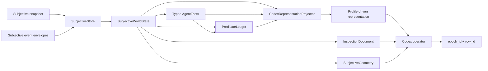

# Codex Subjective Representation

This package controls how a Codex or other LLM operator receives an already
materialized session-subjective game world. It is an interpretation layer over
`ai.observation` and `ai.subjective`; it is not another game-state bus, action
validator, or traditional AI policy.

The complete implementation rationale and staged design are in
[`ai/CODEX_SUBJECTIVE_REPRESENTATION_PLAN.md`](../../CODEX_SUBJECTIVE_REPRESENTATION_PLAN.md).

## Invariants

1. The engine event system remains the only mutation authority.
2. Legal actions come from server-issued `DecisionEpoch` affordances.
3. Every automatic block reads the local `SubjectiveWorldState`; it cannot read
   objective `/state`, `/visibility`, registries, or server internals.
4. Visible, seen, remembered, known false, and unknown remain distinct.
5. Automatic context may omit information only when the component declares the
   omission and a local recovery route.
6. Traditional policy advice is a separately typed oracle input. Projectors do
   not import or invoke policy code.
7. Telemetry describes agent behavior; it is not gameplay truth and is never an
   automatic input in the balanced profile.
8. Profile identity, component parameters, and manifest digest make every
   context intervention reproducible for ablations.

## Data Flow



The hot runtime bootstraps one snapshot and then advances its local world from
ordered subjective envelopes. Normal inspection, geometry, predicates, and
representation reads perform no game-server request.

## Profiles

### `codex.balanced-v2`

This is the `hot-serve` default. It provides neutral turn state, explicit
contact knowledge, a bounded spatial scene, legal action families, event-first
decision deltas, combat hypotheses, focused predicates, and a subjective match
summary. It does not evaluate or expose tactical policy advice automatically.

Complete action rows, object state, map facts, logs, and all other locally held
subjective data remain recoverable through typed query or inspection.

### `codex.current-v1`

This is a compatibility experiment profile. It preserves the old bounded
`HotCodexTurnIndex`, including eager traditional-policy lifecycle behavior. The
legacy response is now an adapter over this profile; it no longer recomputes a
second contact/action/topology projection.

Use this profile only when comparing against retained v1 behavior:

```bash
uv run python -m ai.codex_tools hot-serve \
  --base-url http://127.0.0.1:8000 \
  --claim-id CLAIM_ID \
  --session-id SESSION_ID \
  --profile codex.current-v1
```

## Component Semantics

Each `RepresentationComponentSpec` declares:

- semantic role and intention;
- local input domains;
- transform type;
- subjectivity contract;
- deterministic status;
- parameters and lifecycle exposure;
- omissions, limits, ordering, and recovery mechanisms;
- whether failure is required or recoverable.

The resolved manifest includes every defaulted parameter and has a stable
SHA-256 digest. Changing a parameter is therefore an explicit experimental
intervention rather than an invisible prompt tweak.

Required component failures return `503 representation_failed` while keeping
the local world intact. Optional failures produce a `component.error` block and
telemetry without serializing exception arguments into agent context.

## Predicates

`PredicateLedger` maintains typed derived facts and three-valued predicates:

- `true`: supported by current subjective evidence;
- `false`: contradicted by current subjective evidence;
- `unknown`: missing or insufficient subjective evidence.

Agent-authored predicates use bounded JSON-native `FactExpression` trees. They
cannot submit Python, lambdas, imports, pickles, or arbitrary expressions.
Focus profiles control which predicate evaluations enter automatic context;
the complete ledger remains locally inspectable.

## Inspection

`InspectionDocument` freezes one canonical JSON representation of everything
the agent process is allowed to know:

- complete subjective world;
- retained subjective envelopes;
- derived agent workspace, excluding policy hints;
- fact and predicate definitions/evaluations;
- active profile, resolved manifest, and representation.

Operations are exact JSON Pointer get, bounded literal search, structural diff,
schema discovery, and canonical export. Missing and JSON `null` are distinct.
Exports include content and schema digests. Diff work is bounded by depth, node,
and response-byte budgets.

Objective facts absent from `SubjectiveWorldState` cannot be found by search,
get, export, schema, or predicate evaluation.

## Geometry

`SubjectiveGeometry` distinguishes:

- exact grid distance;
- a local line-of-sight derivation over known directional tile facts;
- an authoritative route witness already disclosed by a legal epoch row.

Results include three-valued truth, touched and unknown cells, known hazards and
slow cells, opportunity-reactor identities disclosed by the row, topology and
capability digests, and algorithm identity/version. Missing topology propagates
`unknown`; it is never treated as clear.

The first version intentionally does not invent a second client pathfinder. A
future known-topology path planner can implement the same result contract while
remaining distinct from server-authorized route witnesses.

## Typed Operator API

`HotCodexLocalClient` validates every local request and response with Pydantic.
It accepts the hot daemon URL and bearer token, not the game-server URL.

The practical CLI mirrors the stable operator path:

```bash
uv run python -m ai.codex_tools hot-watch --token "$NEURODRAGON_CODEX_TOKEN"
uv run python -m ai.codex_tools hot-representation --token "$NEURODRAGON_CODEX_TOKEN"
uv run python -m ai.codex_tools hot-get --pointer /world/current_epoch --token "$NEURODRAGON_CODEX_TOKEN"
uv run python -m ai.codex_tools hot-search door --root world --token "$NEURODRAGON_CODEX_TOKEN"
uv run python -m ai.codex_tools hot-geometry --operation row_route --row-id ROW_ID --token "$NEURODRAGON_CODEX_TOKEN"
uv run python -m ai.codex_tools hot-export --output subjective.json --token "$NEURODRAGON_CODEX_TOKEN"
uv run python -m ai.codex_tools hot-execute ROW_ID --token "$NEURODRAGON_CODEX_TOKEN"
uv run python -m ai.codex_tools hot-end-turn --token "$NEURODRAGON_CODEX_TOKEN"
uv run python -m ai.codex_tools hot-release --token "$NEURODRAGON_CODEX_TOKEN"
```

`hot-oracle` is deliberately explicit. Its response records the exact cursor,
epoch, actor, policy implementation, version, and evaluation time. It is not a
hidden recommendation inside balanced context.

## Extending The System

To add an automatic representation component:

1. Define an immutable payload and discriminated block in `components.py`.
2. Add semantic metadata and omission/recovery contracts in `profiles.py`.
3. Implement a pure builder in `projector.py` using only declared local inputs.
4. Register the block and builder under the same stable component id.
5. Add focused tests for subjectivity, determinism, omissions, recovery, and
   failure behavior.
6. Add it to a profile only as an explicit selection with all parameters.

Do not import `ai.policy` into projection, predicate, inspection, or geometry
modules. Optional advice is converted at the hot-runtime boundary by
`oracle.py` and passed into projection as typed data.
