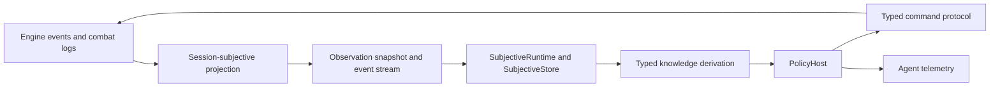

# NeuroDragon AI Runtime

The AI package contains one controller architecture. Traditional policies,
Codex sessions, and future LLM controllers consume the same subjective runtime
and submit the same typed commands.



## Architectural Boundary

The authoritative engine remains objective and event driven. The observation
projector in `server.agent_runtime` filters that history by session ownership
and perception before an agent sees it. The transport contracts and replay
reducers it emits live in the server-owned `server.agent_protocol` package.
The client-facing runtime in `ai` bootstraps once from a snapshot, then reduces
cursor-ordered subjective event envelopes into its local world state.

Legal choices are server-authored affordances in a `DecisionEpoch`. Agents do
not reconstruct legality from D&D rules and do not poll the engine's internal
`Entity.get_available_actions()` surface. Each command binds a stable row ID to
the epoch that produced it; command results and any follow-up epoch return on
the same subjective stream. Row IDs use stable template, base-template, or
semantic-key identity plus a semantic target; localized display text is never
used as command identity.

The runtime never reads objective `/state` or `/visibility`. Hidden entities,
objects, and event details must not enter policy inputs, telemetry, or replay
artifacts.

The ownership boundary is one-way: `dnd` and `server` never import `ai`.
Server code may depend on dependency-neutral engine types such as condition
tags and life-state enums, while client-facing AI consumes the public server
protocol. Canonical AI gameplay validation lives in focused tests under
`tests/ai/`; there is no parallel production evaluator or self-play harness.

## Package Layers

- `dnd.ai`: dependency-neutral policy, memory, reducer, decision,
  instrumentation, and runtime contracts shared by every AI execution mode.
- `dnd.ai.policies.basic`: the bundled in-process policy.
- `custom_ai`: optional logic-only policies registered explicitly by a
  composition root.
- `services.ai_policy_server`: the reference registered-provider HTTP adapter.
- `server.registered_ai_controller`: the server-owned deferred controller that
  awaits a registered provider and commits its intent through the canonical
  engine executor.
- `server.runtime_performance`: shared latency-sensitive runtime controls used
  by server paths and focused runtime tests.
- `ai.subjective`: client-side store, hooks, processors, queries, printers, and
  stream runtime.
- `ai.knowledge`: deterministic derivation of actor, contact, object, and
  topology facts from subjective data.
- `ai.policy`: the shared hierarchy, routines, utility arbitration, memory,
  command binding, `PolicyHost` lifecycle, and client-owned source manifest.
- `ai.codex_tools`: takeover, direct-game startup, artifact capture, and
  hot-runtime tools that expose the same local subjective state and policy
  contract to Codex. The direct-game transport owns only canonical
  prepare/join/bootstrap/activate; it has no scheduler or gameplay loop. The
  takeover HTTP client owns only lease transport.
- `ai.telemetry`: retained agent-observer projection utilities.

## Playable Local Server

The standalone server always exposes the bundled native AI without a helper
process:

```bash
uv run uvicorn server.event_server:app --host 127.0.0.1 --port 8000
```

Each AI side receives its own native assignment, policy instance, memory, world
projection, bounded decision loop, and core-owned instrumentation. A separate
policy process uses the registered-provider handshake and
`RegisteredAIController`; it does not impersonate a player session or call the
game server's command endpoints.

Game creation constructs assignments while the scenario is prepared, but no
policy may decide until the explicit activation boundary. Native assignment
state is closed on replacement, reset, encounter end, or shutdown. Registered
provider assignments additionally use explicit asynchronous open/close leases
and generation-fenced decisions; a failed partial start rolls every opened
lease back.

For external placement, run `python -m services.ai_policy_server` and register
the provider through the deployment-authenticated `/admin/ai/providers`
surface. The provider owns policy logic and reducer memory only. The game
server owns subjective projection, intent validation, action execution,
feedback, timing, and the authoritative encounter lifecycle.

Multi-game workers already support native policies through
`server.game_gateway`. Registered-provider catalog propagation is a separate
host capability and is not advertised until the gateway owns and tests that
lifecycle.

## Decision Lifecycle

1. Bootstrap the session's subjective snapshot.
2. Reduce observation frames until a controlled actor receives a decision
   epoch.
3. Derive typed facts from the local world and authoritative affordances.
4. Revalidate an active multi-epoch routine, if one exists.
5. Generate candidate proposals from typed semantics.
6. Rank compatible proposals through the shared utility arbiter.
7. Bind the selected intent to an epoch-scoped command.
8. Submit the command and wait for its stream-delivered result.
9. Commit policy memory only after authoritative acceptance.
10. Reassess from the next epoch rather than carrying row IDs forward.

Behavior trees organize decision responsibilities; utility resolves competing
valid proposals; routines preserve intent across action boundaries. These are
parts of one policy architecture, not separate AI implementations.

## Controller Surfaces

`NativeAIController` executes a core AI assignment in the game process.
`RegisteredAIController` awaits a registered provider without holding an
engine mutation transaction open, then validates and commits the returned
typed intent through the same canonical executor. `CodexController` remains a
separate human-authority takeover surface. There is no session-command
`ExternalAIController`.

The Codex daemon bootstraps one `SubjectiveRuntime`, then exposes a bounded
`GET /v1/turn` index and revision-fenced `POST /v1/query` over that same local
materialization. `/v1/watch` advances the existing stream. `/v1/execute` and
`/v1/end-turn` are the only gameplay writes. Complete affordances, paths,
semantics, capabilities, observer state, tiles, logs, and policy traces remain
locally queryable; none are rediscovered through game-server polling.

Agent events are telemetry rather than gameplay truth. They expose processor
outputs, candidates, rankings, selected commands, stale handling, and resyncs,
correlated by session, actor, observation cursor, epoch, and command ID. Engine
events and subjective observation frames remain the information carriers for
game state.

Policy source introspection is client-owned. `ai.policy.source` may build the
filesystem-backed manifest, while the server accepts only an opaque
`PolicySourceManifest` supplied by a composition root. A server-only deployment
does not inspect or require an `ai` directory.

## Validation

AI gameplay validation is ordinary test code under `tests/ai/`. Tests compose
and start canonical encounters through the same server lifecycle as the
product, then verify policy decisions, ownership, subjectivity, timing,
replication, and terminal behavior. There is no separate Elo, tournament,
gauntlet, or direct-arena runtime.

## Agent Observer

The static observer at `ai/AI_AGENT_OBSERVER.html` watches one AI session's
telemetry stream. Enter a backend URL and session id, replay retained telemetry,
or subscribe to the live stream.

```text
GET /ai/sessions
GET /ai/sessions/{session_id}/agent-events?since=<cursor>&limit=<n>
GET /ai/sessions/{session_id}/agent-events/subscribe?since=<cursor>
```

The session index returns only observer metadata: AI/Codex session identity,
owned entity labels, controller labels, telemetry cursor, observation cursor,
cached epoch id, and takeover claim ids. It does not expose HP, positions,
opponents, visibility, routes, or legal actions.

For retained evidence review, the observer can also load a local JSON artifact
that contains `agent_events_response.events`, `agent_events.events`,
`agent_event_history.events`, or a raw array of agent event rows. Those retained
rows flow through the same local renderer as the live SSE stream. The matching
Python-side contract lives in `ai.telemetry.observer_projection`, which
normalizes retained telemetry into `AgentEventHistoryResponse` for tests and
future tooling. Full retained history envelopes keep their own cursor metadata:
bad counts, cursor order, or next/total cursor values are rejected rather than
recomputed into clean-looking telemetry.

The observer renders `AgentEventPayload` data: agent cursor, observation cursor,
epoch id, event type, level, source, actor, summary, tags, and structured
payload. It also derives local audit panels for the latest selected command,
latest shared-policy decision, candidate rows, command-result flow, and command
timing from those same telemetry payloads. It is telemetry for humans and
debugging, not gameplay authority. It does not fetch legal actions, map state,
or raw visibility; those remain owned by the subjective runtime and
engine-facing client APIs.
