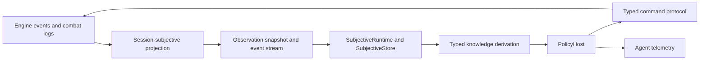

# NeuroDragon AI Runtime

The AI package contains one controller architecture. Traditional policies,
Codex sessions, and future LLM controllers consume the same subjective runtime
and submit the same typed commands.



## Architectural Boundary

The authoritative engine remains objective and event driven. The observation
projector in `server.agent_runtime` filters that history by session ownership
and perception before an agent sees it. The transport contracts and replay
reducers it emits live in the server-owned `server.agent_protocol` package.
The client-facing runtime in `ai` bootstraps once from a snapshot, then reduces
cursor-ordered subjective event envelopes into its local world state.

Legal choices are server-authored affordances in a `DecisionEpoch`. Agents do
not reconstruct legality from D&D rules and do not poll the engine's internal
`Entity.get_available_actions()` surface. Each command binds a stable row ID to
the epoch that produced it; command results and any follow-up epoch return on
the same subjective stream. Row IDs use stable template, base-template, or
semantic-key identity plus a semantic target; localized display text is never
used as command identity.

The runtime never reads objective `/state` or `/visibility`. Hidden entities,
objects, and event details must not enter policy inputs, telemetry, or replay
artifacts.

The ownership boundary is one-way: `dnd` and `server` never import `ai`.
Server code may depend on dependency-neutral engine types such as condition
tags and life-state enums, while client-facing AI consumes the public server
protocol. An in-process self-play or evaluation harness may compose both sides,
but it does not make the AI package part of the game server.

## Package Layers

- `dnd.ai`: dependency-neutral policy, memory, reducer, decision,
  instrumentation, and runtime contracts shared by every AI execution mode.
- `dnd.ai.policies.basic`: the bundled in-process policy.
- `custom_ai`: optional logic-only policies registered explicitly by a
  composition root.
- `services.ai_policy_server`: the reference registered-provider HTTP adapter.
- `server.registered_ai_controller`: the server-owned deferred controller that
  awaits a registered provider and commits its intent through the canonical
  engine executor.
- `server.runtime_performance`: shared latency-sensitive runtime controls used
  by server paths and in-process validation.
- `ai.subjective`: client-side store, hooks, processors, queries, printers, and
  stream runtime.
- `ai.knowledge`: deterministic derivation of actor, contact, object, and
  topology facts from subjective data.
- `ai.policy`: the shared hierarchy, routines, utility arbitration, memory,
  command binding, `PolicyHost` lifecycle, and client-owned source manifest.
- `ai.codex_tools`: takeover and hot-runtime tools that expose the same local
  subjective state and policy contract to Codex. The takeover HTTP client owns
  only lease transport; it has no snapshot, action, watch, or command loop.
- `ai.external_selfplay`: an in-process evaluator for the retained advanced
  subjective policy. It is evidence tooling, not a production controller or
  external-provider transport.
- `ai.evaluation`: immutable run artifacts and dashboard projection.

## Playable Local Server

The standalone server always exposes the bundled native AI without a helper
process:

```bash
uv run uvicorn server.event_server:app --host 127.0.0.1 --port 8000
```

Each AI side receives its own native assignment, policy instance, memory, world
projection, bounded decision loop, and core-owned instrumentation. A separate
policy process uses the registered-provider handshake and
`RegisteredAIController`; it does not impersonate a player session or call the
game server's command endpoints.

Game creation constructs assignments while the scenario is prepared, but no
policy may decide until the explicit activation boundary. Native assignment
state is closed on replacement, reset, encounter end, or shutdown. Registered
provider assignments additionally use explicit asynchronous open/close leases
and generation-fenced decisions; a failed partial start rolls every opened
lease back.

For external placement, run `python -m services.ai_policy_server` and register
the provider through the deployment-authenticated `/admin/ai/providers`
surface. The provider owns policy logic and reducer memory only. The game
server owns subjective projection, intent validation, action execution,
feedback, timing, and the authoritative encounter lifecycle.

Multi-game workers already support native policies through
`server.game_gateway`. Registered-provider catalog propagation is a separate
host capability and is not advertised until the gateway owns and tests that
lifecycle.

## Decision Lifecycle

1. Bootstrap the session's subjective snapshot.
2. Reduce observation frames until a controlled actor receives a decision
   epoch.
3. Derive typed facts from the local world and authoritative affordances.
4. Revalidate an active multi-epoch routine, if one exists.
5. Generate candidate proposals from typed semantics.
6. Rank compatible proposals through the shared utility arbiter.
7. Bind the selected intent to an epoch-scoped command.
8. Submit the command and wait for its stream-delivered result.
9. Commit policy memory only after authoritative acceptance.
10. Reassess from the next epoch rather than carrying row IDs forward.

Behavior trees organize decision responsibilities; utility resolves competing
valid proposals; routines preserve intent across action boundaries. These are
parts of one policy architecture, not separate AI implementations.

## Controller Surfaces

`NativeAIController` executes a core AI assignment in the game process.
`RegisteredAIController` awaits a registered provider without holding an
engine mutation transaction open, then validates and commits the returned
typed intent through the same canonical executor. `CodexController` remains a
separate human-authority takeover surface. There is no session-command
`ExternalAIController`.

The Codex daemon bootstraps one `SubjectiveRuntime`, then exposes a bounded
`GET /v1/turn` index and revision-fenced `POST /v1/query` over that same local
materialization. `/v1/watch` advances the existing stream. `/v1/execute` and
`/v1/end-turn` are the only gameplay writes. Complete affordances, paths,
semantics, capabilities, observer state, tiles, logs, and policy traces remain
locally queryable; none are rediscovered through game-server polling.

Agent events are telemetry rather than gameplay truth. They expose processor
outputs, candidates, rankings, selected commands, stale handling, and resyncs,
correlated by session, actor, observation cursor, epoch, and command ID. Engine
events and subjective observation frames remain the information carriers for
game state.

Policy source introspection is client-owned. `ai.policy.source` may build the
filesystem-backed manifest, while the server accepts only an opaque
`PolicySourceManifest` supplied by a composition root. A server-only deployment
does not inspect or require an `ai` directory.

## Validation

Focused tests live in `tests/manual/test_28_subjective_observation_stream.py`
through the current AI test files. Validation arenas live in
`dnd/scenarios/ai_validation_arenas.py`. Immutable self-play and direct-Codex
artifacts are stored under `ai/evidence/`; the dashboard is generated only from
their JSON records.

The external path is expected to be fast enough for interactive play. New
processors and policies must emit timings, preserve strict subjectivity, and be
validated across the rotating Barbarian, Sorcerer, and Skeleton matchups rather
than a single favorable arena.

## Gauntlets

Structured AI-vs-AI gauntlets are the validation layer above one-off self-play.
They run repeatable schedules over validation arenas, retain raw JSON for every
match, and write a compact watcher summary for release decisions.

Launch a small smoke slice with:

```bash
uv run python -m ai.evaluation.gauntlet_runner run --mode smoke
```

The runner builds a deterministic `GauntletSchedule`, validates every arena ID
against `dnd/scenarios/ai_validation_arenas.py`, runs the production
external-self-play stack, writes raw run artifacts under `ai/evidence/runs/`,
writes the compact server-readable gauntlet summary under
`evidence/gauntlets/`, and updates `evidence/gauntlets/latest.json`.

Useful commands:

```bash
uv run python -m ai.evaluation.gauntlet_runner schedule --mode rotation
uv run python -m ai.evaluation.gauntlet_runner run --mode smoke --seed 44 --max-commands 40
uv run python -m ai.evaluation.gauntlet_runner run --mode smoke --watcher-base-url http://127.0.0.1:8000
uv run python -m ai.evaluation.gauntlet_runner run --mode release --require-gate-pass
uv run python -m ai.evaluation.gauntlet_runner check evidence/gauntlets/latest.json --require-gate-pass --require-latency-pass
uv run python -m ai.evaluation.gauntlet_runner check evidence/gauntlets/latest.json --require-gate-pass
uv run python -m ai.evaluation.gauntlet_runner schedule --mode regression --regression-source evidence/gauntlets/latest.json
uv run python -m ai.evaluation.gauntlet_runner run --mode content --arena-id zone_control_web_gauntlet --arena-id item_resource_gauntlet
```

Schedule modes:

| Mode | Purpose |
| --- | --- |
| `smoke` | Fast post-change confidence slice. |
| `rotation` | Encodes exactly six rows: Codex Barbarian vs AI, Codex Sorcerer vs AI, Codex skeletons vs AI Barbarian, Codex skeletons vs AI Sorcerer, AI-vs-AI Barbarian, and AI-vs-AI Sorcerer. |
| `content` | Exercises SRD monsters, custom arenas, gear, spells, and class/loadout variety. |
| `regression` | Replays retained failed or abnormal rows from a prior gauntlet summary. |
| `release` | Larger retained batch used as a milestone gate. |

Raw run artifacts are the detailed evidence. Summary JSON is the watcher and
release-gate view. A summary includes:

- schedule rows, schedule hash, mode, and generated timestamp;
- match records with outcome, status, side ratings, command counts, and raw
  artifact paths;
- aggregated command-result counts, including accepted, rejected, stale, error,
  and missing-result rows when present;
- subjectivity audit status, violation count, and violating match IDs;
- `gate_status` and `gate_reasons`, the compact release-gate verdict derived
  from retained evidence;
- `latency_status`, `latency_reasons`, and `latency_thresholds`, the separate
  speed audit derived from retained timing evidence;
- batch timing summaries, including max match time, all-sample
  command/server/local p95/p99/max, production-only command/server/local
  p95/p99/max, and diagnostic-only command/server/local p95/p99/max;
- visible failure rows for any match that is not release-clean;
- retained watcher event history.

Release-clean means more than encounter completion. A match is failed or
abnormal if it timed out, aborted, leaked hidden information, failed the
subjectivity audit, or retained any stale, error, or missing command result. Such
matches emit `MATCH_FAILED`, appear in `failure_rows`, increment
`failed_count`, set `gate_status` to `failed`, and remain visible to regression
scheduling. They are never silently excluded from ratings, summaries,
dashboards, or release decisions. A clean but incomplete schedule reports
`gate_status: "running"` with `pending_matches`; an untouched schedule reports
`not_run`; a completed clean schedule reports `passed`.

Use `--require-gate-pass` for automation. The runner still writes and prints the
summary JSON, then exits nonzero if `gate_status` is anything other than
`passed`. Use `gauntlet_runner check <summary.json> --require-gate-pass` to
validate an already-retained summary without rerunning matches. The check
validates the retained evidence, not only the claimed gate field: match counts,
failure rows, command-status totals, subjectivity totals, performance counts,
gate reasons, and watcher event cursors must agree with the underlying rows.
Use `--require-latency-pass` when the automation should also enforce the current
interactive speed target. New summaries audit production command-total p95 at
`5 ms`, production command-total p99 at `10 ms`, and production local-decision
p99 at `5 ms` when non-diagnostic samples exist. All-sample and diagnostic-only
percentiles remain retained and visible for outlier investigation, but
diagnostic probes do not by themselves fail the production responsiveness gate.
Older retained summaries without the production split fall back to all-sample
percentiles, then to the stricter available max latency fields. A summary can
have `gate_status: "passed"` while `latency_status: "failed"`; that means the
run was release-clean for correctness but not fast enough yet.

`rejected` commands are retained in command-status counts and watcher metrics.
They are not automatically release-failing because a policy can use a bounded
rejection as diagnostic recovery, but repeated or unexplained rejection pressure
should become a focused issue or benchmark.

## Live Gauntlet Watcher

The static watcher at `ai/AI_TOURNAMENT_MONITOR.html` first asks the configured
backend for `GET /ai/gauntlets/live/latest`. That live endpoint is intentionally
usable before a summary file exists: it projects the bounded watcher event
history into the same view model used by retained summaries, so an open monitor
can show the active match, pending count, progress events, rating updates,
subjectivity status, latency status, failures, and artifact paths while the
gauntlet is still running.

If no live gauntlet events are retained, the watcher asks
`GET /ai/gauntlets/latest`, then falls back to
`evidence/gauntlets/latest.json` directly, with tournament JSON as a legacy
fallback. It does not contain manual statistics. It renders only fields present
in retained JSON or the live watcher projection, including subjectivity status,
latency status, stale/rejected totals, max command latency, ratings, failures,
artifact paths, and the separated all-sample/production/diagnostic latency
columns.

Audit widgets use nullish semantics: an explicit retained `0` is rendered as
zero, while missing or `null` fields render as `n/a` or documented fallback
aggregates. This keeps a clean zero-latency, zero-violation, or zero-failure
record distinct from absent evidence.

When the backend is running, the same watcher can follow the live stream and
refresh the retained projection:

```text
GET /ai/gauntlets/live/latest
GET /ai/gauntlets/latest
GET /ai/gauntlets/{gauntlet_id}/watch
GET /ai/gauntlets/{gauntlet_id}/events?since=<cursor>
POST /ai/gauntlets/events
GET /ai/gauntlets/{gauntlet_id}/events/subscribe?since=<cursor>
```

`GET /ai/gauntlets/{gauntlet_id}/watch` prefers retained summary evidence when
the summary exists, then overlays live events for the same gauntlet. If the
summary has not been written yet, it projects live events only.

Invalid retained summary JSON remains an error; live projection is not used to
hide corrupted durable evidence.

The live watcher event contract is:

```text
GAUNTLET_STARTED
MATCH_STARTED
MATCH_PROGRESS
MATCH_COMPLETED
MATCH_FAILED
RATING_UPDATED
SUMMARY_WRITTEN
GAUNTLET_COMPLETED
```

Watcher events are observability only. They are not engine events, subjective
observation frames, command results, or replay authority. They provide a bounded
progress stream for dashboards while raw run artifacts and compact summaries
remain the durable evidence.

## Agent Observer

The static observer at `ai/AI_AGENT_OBSERVER.html` watches one AI session's
telemetry stream. It is the per-agent counterpart to the gauntlet watcher:
enter a backend URL and session id, replay retained telemetry, or subscribe to
the live stream.

```text
GET /ai/sessions
GET /ai/sessions/{session_id}/agent-events?since=<cursor>&limit=<n>
GET /ai/sessions/{session_id}/agent-events/subscribe?since=<cursor>
```

The session index returns only observer metadata: AI/Codex session identity,
owned entity labels, controller labels, telemetry cursor, observation cursor,
cached epoch id, and takeover claim ids. It does not expose HP, positions,
opponents, visibility, routes, or legal actions.

For retained evidence review, the observer can also load a local JSON artifact
that contains `agent_events_response.events`, `agent_events.events`,
`agent_event_history.events`, or a raw array of agent event rows. Those retained
rows flow through the same local renderer as the live SSE stream. The matching
Python-side contract lives in `ai.evaluation.agent_observer_projection`, which
normalizes retained telemetry into `AgentEventHistoryResponse` for tests and
future tooling. Full retained history envelopes keep their own cursor metadata:
bad counts, cursor order, or next/total cursor values are rejected rather than
recomputed into clean-looking telemetry.

The observer renders `AgentEventPayload` data: agent cursor, observation cursor,
epoch id, event type, level, source, actor, summary, tags, and structured
payload. It also derives local audit panels for the latest selected command,
latest shared-policy decision, candidate rows, command-result flow, and command
timing from those same telemetry payloads. It is telemetry for humans and
debugging, not gameplay authority. It does not fetch legal actions, map state,
or raw visibility; those remain owned by the subjective runtime and
engine-facing client APIs.
