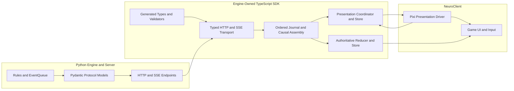
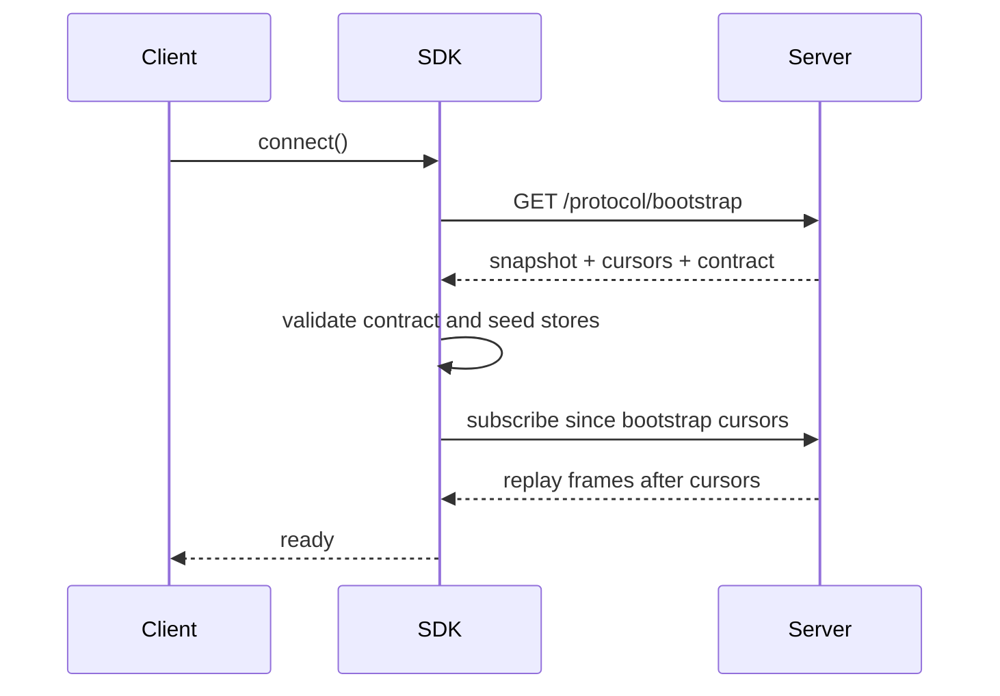
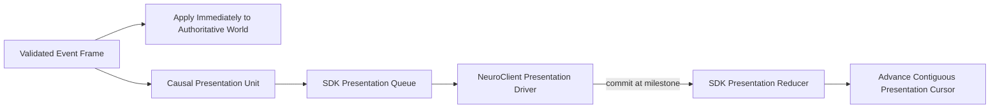

# D&D Engine TypeScript SDK Implementation Plan

> **Superseded design record (2026-07-23).** This document describes the
> abandoned raw-engine-event replication design and is not normative. The live
> player transport now uses generated `SubjectiveWorldPatch` transactions and a
> closed `SubjectivePresentationCue` graph over the four unversioned
> `/replication/**` routes. Engine events remain available only through the
> separate privileged objective-diagnostics surface. See
> [`README.md`](./README.md) for the canonical SDK boundary and stable exports.

## Status

This document defines the implementation plan for an engine-owned, framework-independent TypeScript SDK. The SDK becomes the canonical browser and Node.js boundary for the D&D engine. NeuroClient will consume this SDK as a game client and will stop owning wire types, SSE replication, cursor management, event assembly, authoritative reduction, and presentation synchronization.

The SDK must be complete and independently proven before NeuroClient is migrated. There must never be a half-migrated production path in which the SDK and NeuroClient both manage the same stream.

## Executive Summary

The Python engine is the authority for rules, state mutation, legal actions, and public protocol models. The TypeScript SDK is the authority for consuming that protocol outside Python.

The engine repository will own:

- Stable public wire identities.
- Generated TypeScript types for every public payload.
- Runtime validation of untrusted JSON.
- Typed HTTP commands.
- Resumable SSE transport.
- Cursor, replay, deduplication, gap, eviction, and resynchronization semantics.
- Causal event assembly.
- A canonical result-projection reducer.
- A framework-independent replicated world store.
- A framework-independent presentation timeline and acknowledgment queue.
- Contract, reducer, replay, and transport tests.

NeuroClient will own:

- Pixi rendering.
- Animation selection and timing.
- Sound, particles, camera, and UI.
- The decision of which visual frame represents an event's presentation milestone.
- Game-specific interaction design.

The SDK will run the same projection reducer at two different clocks:

1. The authoritative projection applies completed events immediately.
2. The presentation projection applies the same events when the client reports that their visual milestones have been reached.

This preserves the event system as the sole information carrier while explicitly modeling the fact that the server can resolve a full turn faster than the client can show it.

## Current Failure That Motivates This Work

The current backend and NeuroClient independently declare the event protocol. They have already drifted.

The Python `StepMovementEvent` includes:

- `trajectory`
- `committed`

The handwritten NeuroClient `StepMovementEvent` includes neither. Its reducer therefore advances position for every completed step payload without being able to distinguish a committed destination from a step interrupted before entry.

The Python `MovementEvent` also contains fields not represented by NeuroClient, including requested destination, typed trajectory, termination reason, and controller revalidation metadata.

This drift is not a documentation problem. It is an ownership problem. A client should not infer or manually copy the backend protocol.

The repository already contains an unfinished useful spike:

- `server/event_contract.py`
- `server/event_contract.generated.json`
- `devtools/generate_event_contract.py`
- `/event-contract`

That spike proves the basic direction, but it is not yet a complete SDK. It only covers event models, uses Python module paths as public identities, emits broad fallback types, and does not provide runtime decoders, transport, reduction, queues, or independent package tests.

## Goals

### G1. One Public Contract Authority

Every public engine payload must originate from typed Pydantic protocol models. TypeScript declarations and runtime schemas are generated from that authority.

### G2. Runtime Safety

Every HTTP response and SSE frame must be validated before it enters SDK state. TypeScript compile-time types alone are not sufficient.

### G3. Framework Independence

The SDK must not import Zustand, Pixi, React, DOM UI modules, NeuroClient code, or game-specific assets. It must work in a browser, Node.js, tests, and future tools.

### G4. Canonical Projection Semantics

The SDK owns the reducer that projects result-bearing engine events into client world state. The reducer consumes resolved results and never reimplements D&D rules.

### G5. Correct Replication

The SDK owns bootstrap, replay, live subscription, cursors, duplicates, gaps, reconnects, eviction, server restart detection, and hard resynchronization.

### G6. Explicit Dual Clocks

Authoritative state and presented state must be distinct and observable. Presentation may lag while animations run, but must converge when the presentation queue becomes idle.

### G7. Independent Proof

The package must build, test, and run against the Python backend without importing or launching NeuroClient.

### G8. Clean NeuroClient Boundary

After migration, NeuroClient calls typed game-domain APIs, subscribes to SDK stores, and implements a presentation driver. It does not parse SSE, track replication cursors, reconstruct causal trees, or reduce engine events.

## Non-Goals

- Reimplementing combat, legality, dice, pathfinding, visibility, or rules in TypeScript.
- Moving the engine event queue into TypeScript.
- Giving clients objective or hidden information.
- Putting Pixi animation recipes into the SDK.
- Replacing server-authoritative available actions.
- Maintaining permanent legacy and SDK replication paths.
- Supporting multiple rulesets.
- Requiring NeuroClient to be present during SDK tests.

## Architectural Boundary



## Dependency Direction

Dependencies flow in one direction:

```text
Python protocol models
    -> generated schemas and types
        -> SDK transport
            -> SDK replication runtime
                -> SDK stores and selectors
                    -> NeuroClient presentation adapter
                        -> Pixi and UI
```

The SDK must never import NeuroClient. Generated code must never import handwritten application code. NeuroClient may depend on public SDK exports only.

## Proposed Repository Layout

```text
dnd_engine/
|-- dnd/
|-- server/
|   `-- protocol/
|       |-- identity.py
|       |-- bootstrap.py
|       |-- events.py
|       |-- combat_logs.py
|       |-- actions.py
|       |-- sessions.py
|       `-- errors.py
|-- devtools/
|   `-- generate_typescript_sdk.py
|-- sdk/
|   `-- typescript/
|       |-- package.json
|       |-- package-lock.json
|       |-- tsconfig.json
|       |-- tsconfig.build.json
|       |-- vitest.config.ts
|       |-- src/
|       |   |-- generated/
|       |   |   |-- contract.json
|       |   |   |-- events.ts
|       |   |   |-- api.ts
|       |   |   |-- validators.ts
|       |   |   `-- contractIdentity.ts
|       |   |-- transport/
|       |   |   |-- httpClient.ts
|       |   |   |-- sseParser.ts
|       |   |   |-- eventStream.ts
|       |   |   |-- reconnect.ts
|       |   |   `-- errors.ts
|       |   |-- replication/
|       |   |   |-- bootstrap.ts
|       |   |   |-- journal.ts
|       |   |   |-- causalAssembler.ts
|       |   |   |-- cursorLedger.ts
|       |   |   `-- runtime.ts
|       |   |-- world/
|       |   |   |-- models.ts
|       |   |   |-- seed.ts
|       |   |   |-- reducer.ts
|       |   |   |-- equality.ts
|       |   |   `-- selectors.ts
|       |   |-- presentation/
|       |   |   |-- models.ts
|       |   |   |-- ledger.ts
|       |   |   |-- coordinator.ts
|       |   |   `-- driver.ts
|       |   |-- store/
|       |   |   |-- observableStore.ts
|       |   |   `-- snapshots.ts
|       |   |-- client/
|       |   |   |-- engineClient.ts
|       |   |   |-- commands.ts
|       |   |   `-- sessions.ts
|       |   `-- index.ts
|       `-- tests/
|           |-- generated/
|           |-- transport/
|           |-- replication/
|           |-- reducer/
|           |-- presentation/
|           |-- integration/
|           `-- fixtures/
`-- tests/
    `-- sdk/
        |-- test_contract_generation.py
        |-- test_protocol_models.py
        |-- test_replay_fixture_generation.py
        `-- fixtures/
```

The exact split under `server/protocol/` may be adjusted to existing ownership boundaries, but public models must no longer be scattered through route functions and untyped dictionaries.

## Package Contract

Recommended package name:

```text
@neurodragon/dnd-engine-sdk
```

Recommended first release target:

- ESM package.
- Modern browser support.
- Node.js 22 support.
- Strict TypeScript declarations.
- No DOM requirement in core modules.
- Injected `fetch`, clock, and logging interfaces for tests and non-browser runtimes.

Proposed exports:

```json
{
  "exports": {
    ".": "./dist/index.js",
    "./generated": "./dist/generated/index.js",
    "./transport": "./dist/transport/index.js",
    "./replication": "./dist/replication/index.js",
    "./world": "./dist/world/index.js",
    "./presentation": "./dist/presentation/index.js"
  }
}
```

## Public Wire Identity

### Problem With Python Module Paths

The current spike emits values such as:

```text
dnd.core.events.StepMovementEvent
```

This is useful during discovery but should not become the permanent public protocol. Moving a Python class to another module would become a breaking wire change even if its semantics and fields were unchanged.

### Required Stable Identity

Each concrete public event must expose an explicit stable discriminator, for example:

```text
dnd.event.movement.step.v1
dnd.event.movement.forced.v1
dnd.event.action.attack.v1
dnd.event.condition.applied.v1
```

`event_type` remains the broad semantic category. `wire_type` identifies the concrete serialized model. They serve different purposes.

Example Pydantic shape:

```python
class StepMovementEvent(Event):
    wire_type: Literal["dnd.event.movement.step.v1"] = (
        "dnd.event.movement.step.v1"
    )
    event_type: EventType = EventType.STEP_MOVEMENT
    trajectory: MovementTrajectory
    committed: bool
```

Rules:

- Wire identities are unique.
- Wire identities never depend on display names.
- Moving a class does not change its wire identity.
- Incompatible payload changes require a new wire identity or protocol-major version.
- Generated TypeScript unions discriminate on `wire_type`.
- Unknown wire identities stop ordered reduction and request resynchronization. They are never silently ignored.

## Canonical Protocol Models

All public routes and streams must use concrete Pydantic request and response models. Public `Dict[str, Any]` and anonymous dictionaries must be removed from the SDK surface.

The first protocol inventory must include:

- Contract identity.
- Atomic replication bootstrap.
- Game state snapshot.
- Grid, tile, object, entity, encounter, and equipment models.
- Visibility and perception models.
- Available action and action target models.
- Action execution and end-turn requests.
- Action results and target cursors.
- Game event frames.
- Combat log frames.
- Session status frames.
- Stream heartbeat and eviction frames.
- Structured protocol errors.

AI subjective observation contracts may be added to the same SDK after the human game replication surface is complete. They must use a separate module and must preserve subjective boundaries.

## Contract Generation

### Inputs

The generator reads:

- Pydantic serialization schemas.
- Explicit event registration.
- Explicit stable wire identities.
- FastAPI public request and response models.
- Enum values.

The generator must not discover public behavior by importing every arbitrary module and hoping subclasses have been loaded. Event registration must be explicit and testable.

### Outputs

The generator writes only into engine-owned generated locations:

- Backend contract manifest.
- SDK contract manifest.
- TypeScript interfaces and discriminated unions.
- JSON schemas or equivalent runtime schemas.
- Validator registration code.
- Contract identity constants.

It must never write generated source directly into NeuroClient.

### Strict Generation Rules

- Generation fails on an unresolved public annotation.
- Generation fails on `Any` or `unknown` unless explicitly allowed for a documented extension field.
- Generation fails on duplicate TypeScript names.
- Generation fails on duplicate wire identities.
- Generation fails when a public route lacks a typed request or response model.
- Generation is deterministic.
- `--check` compares generated output byte for byte and exits nonzero on drift.
- Generated files carry a do-not-edit header.

### Runtime Contract Identity

The manifest contains:

```ts
interface ContractIdentity {
  protocolVersion: number;
  contractHash: string;
  minimumCompatibleVersion: number;
  serverBuild?: string;
}
```

The SDK embeds the generated identity. The server returns its identity during bootstrap. An incompatible SDK must fail before applying any event.

During initial development, exact hash equality is preferred. Compatibility ranges can be introduced only after versioning rules are proven.

## Runtime Validation

Generated TypeScript interfaces disappear at runtime. Every external payload must therefore pass a generated runtime validator.

Recommended first implementation:

- Generate JSON Schema from Pydantic serialization schemas.
- Compile schemas with Ajv inside the SDK.
- Expose typed decoder functions.
- Preserve structured validation paths in errors.

Example API:

```ts
const frame = decodeGameEventFrame(untrustedJson);
const snapshot = decodeReplicationBootstrap(untrustedJson);
```

Validation errors must include:

- Endpoint or stream name.
- Contract hash.
- Cursor when available.
- Wire type when available.
- JSON path.
- Expected schema.
- Received value summary without leaking hidden state into the wrong session logger.

No production SDK code may use `as ServerEvent` to accept network JSON.

## Atomic Replication Bootstrap

### Problem

Fetching `/state`, `/events`, `/visibility`, and session status separately can observe different engine moments. A client can seed from one moment and subscribe from another.

### Endpoint

Add an engine-owned bootstrap endpoint, for example:

```text
GET /protocol/bootstrap
```

Response:

```ts
interface ReplicationBootstrap {
  contract: ContractIdentity;
  session: SessionState;
  game: GameState;
  visibility: VisibilityState;
  eventCursor: number;
  combatLogCursor: number;
  serverInstanceId: string;
}
```

The snapshot and cursors must describe one atomic server boundary. The endpoint must not expose data outside the requesting session's authorization model.

### Connect Sequence



Events produced between bootstrap and subscription remain recoverable from server history using the bootstrap cursor.

## Typed HTTP Client

The SDK exposes commands in domain terms instead of raw URLs and Axios payloads.

Example:

```ts
const client = new DndEngineClient({
  baseUrl: "http://127.0.0.1:8000",
  sessionId,
});

await client.connect();

const actions = await client.actions.forEntity(entityUuid);
const result = await client.commands.execute({
  entityUuid,
  actionName,
  targetIndex,
});

await client.replication.waitThrough(result.cursors);
```

The HTTP layer owns:

- URL construction.
- Session authorization headers or parameters.
- Request validation in development and tests.
- Response validation always.
- Structured errors.
- Abort signals.
- Command correlation IDs.
- Target event and combat-log cursors.

It does not own UI retries or silently substitute another command.

## SSE Transport

The SDK must implement one tested resumable SSE transport suitable for browser and Node.js use.

Responsibilities:

- Parse fragmented UTF-8 chunks.
- Parse multiline SSE data.
- Preserve event IDs.
- Handle game events, combat logs, session frames, heartbeats, and eviction.
- Reconnect from the last contiguous acknowledged transport cursor.
- Deduplicate replayed frames.
- Detect cursor gaps.
- Detect server instance changes or cursor regression.
- Surface connection state through typed events.
- Bound queues and journal retention.
- Support cancellation and clean shutdown.

The SDK should use an established SSE parser rather than implementing the wire grammar with ad hoc string splitting.

No artificial delay is added to normal delivery. Reconnection policy may use bounded backoff after actual connection failures.

## Cursor Model

The SDK exposes distinct cursor meanings:

```ts
interface ReplicationCursors {
  transportEventCursor: number;
  authoritativeEventCursor: number;
  presentationEventCursor: number;
  transportCombatLogCursor: number;
  presentedCombatLogCursor: number;
}
```

Invariants:

```text
transportEventCursor >= authoritativeEventCursor >= presentationEventCursor
transportCombatLogCursor >= presentedCombatLogCursor
```

Definitions:

- Transport cursor: highest contiguous frame accepted from SSE.
- Authoritative cursor: highest contiguous frame accounted for by authoritative reduction or an explicit no-state-change classification.
- Presentation cursor: highest contiguous frame visually presented or explicitly classified as presentation-immediate.
- Presented combat-log cursor: highest contiguous log released to the visible log.

No action response may claim that an event has been rendered. Command results provide target replication cursors only.

## Event Journal

The SDK stores a bounded ordered journal of validated envelopes.

Each entry records:

```ts
interface JournalEntry {
  eventCursor: number;
  combatLogCursor: number;
  event: ServerEvent;
  receivedAt: number;
  authoritativeStatus: "pending" | "applied" | "no_change" | "failed";
  presentationStatus:
    | "pending"
    | "queued"
    | "presenting"
    | "presented"
    | "no_change"
    | "failed";
}
```

The journal provides:

- Cursor lookup.
- Lineage lookup.
- Event UUID lookup.
- Bounded retention.
- Replay into a fresh reducer.
- Diagnostics for the first unacknowledged cursor.
- A deterministic export used by bug reports and tests.

The journal is not a second engine history. It is the client-side validated transport history needed for replay and presentation lag.

## Causal Event Assembly

Parent and child event relationships are engine protocol semantics, not Pixi semantics. The SDK therefore owns causal assembly.

The assembler consumes ordered completion envelopes and produces typed causal units while preserving original cursors.

```ts
interface CausalEventUnit {
  root: SequencedEvent;
  events: readonly SequencedEvent[];
  firstCursor: number;
  lastCursor: number;
  lineageUuid: string;
  complete: boolean;
}
```

Requirements:

- Assemble by stable lineage fields.
- Support children arriving before root completion.
- Support canceled child lineages.
- Never wait forever for an event phase that the public completion stream does not deliver.
- Preserve backend completion order.
- Do not duplicate nested children as independent roots.
- Surface incomplete lineage diagnostics.
- Allow movement step units to be consumed incrementally rather than waiting for the entire movement root.

The assembler does not choose animations.

## Canonical World Projection

### Purpose

The world projection is the SDK's client-consumable state derived from a bootstrap snapshot plus completed result-bearing events.

It is not the full Python object graph. It contains stable public state needed by clients.

Initial shape:

```ts
interface ProjectedWorld {
  entitiesById: ReadonlyMap<Uuid, ProjectedEntity>;
  tilesByKey: ReadonlyMap<TileKey, ProjectedTile>;
  objectsById: ReadonlyMap<Uuid, ProjectedObject>;
  encounter: ProjectedEncounter | null;
  visibilityByObserver: ReadonlyMap<Uuid, ProjectedVisibility>;
}
```

Entity state includes at least:

- Identity and name.
- Position.
- HP and maximum HP.
- AC.
- Faction.
- Death state.
- Conditions and typed condition details.
- Public equipment state required by clients.

World state includes at least:

- Turn and round state.
- Tile walkability and directional blockers.
- Light.
- Spatial object placement and state.
- Session-subjective visibility.

### Reducer Contract

```ts
function reduceCompletionEvent(
  world: ProjectedWorld,
  event: ServerEvent,
): ReductionResult;
```

`ReductionResult` reports:

- Whether the event changed projected state.
- Which domains changed.
- Which entities, tiles, or objects changed.
- Whether the event is explicitly no-state-change.
- Any invariant failure.

### Reducer Rules

- Reduce only validated events.
- Reduce only relevant phases, normally completion.
- Use `committed` for movement steps.
- Use resulting values supplied by the backend.
- Never calculate attack outcomes, damage, saves, paths, or legality.
- Every wire type is exhaustively classified.
- Unknown or unclassified events stop cursor advancement.
- Generic display-name matching is forbidden.
- Reduction is deterministic and replayable.
- Duplicate event UUIDs are idempotent.

Example:

```ts
case "dnd.event.movement.step.v1":
  if (!event.committed) return unchanged("uncommitted_step");
  return updateEntityPosition(world, event.source_entity_uuid, event.to_position);
```

## Observable Store

The SDK must not depend on Zustand. It exposes a minimal observable-store interface:

```ts
interface ObservableStore<T> {
  getSnapshot(): T;
  subscribe(listener: () => void): () => void;
}
```

This is compatible with browser UI adapters and can be wrapped by Zustand or React without making either part of the core.

The SDK exposes:

- `authoritativeWorldStore`
- `presentationWorldStore`
- `replicationStatusStore`
- `visibleCombatLogStore`
- `diagnosticsStore`

Snapshots exposed to consumers are immutable or readonly. Internal reducer mutation must not leak through old snapshots.

## Dual-Clock Presentation Coordinator

### Principle

The SDK owns presentation ordering and cursor accounting. The client owns the visual implementation.



### Presentation Driver Interface

```ts
interface PresentationDriver {
  present(
    unit: CausalEventUnit,
    context: PresentationContext,
  ): Promise<void>;
}

interface PresentationContext {
  commit(eventCursors: readonly number[]): void;
  fail(error: PresentationError): void;
  authoritative: ProjectedWorld;
  presented: ProjectedWorld;
}
```

NeuroClient maps the unit to clips. At an impact, arrival, landing, door-contact, or death milestone, it calls `commit()` for the corresponding event cursors. The SDK applies those exact events to the presentation world.

A headless driver used by tests and nonvisual clients commits all events immediately.

### Presentation Queue Requirements

- Strict FIFO between causal units unless a unit is explicitly decorative.
- No later cursor can advance the contiguous watermark past an unresolved earlier cursor.
- A unit can expose multiple milestones.
- A transaction can commit some children before it finishes.
- Queue state is observable.
- Queue failures are typed and stop presentation advancement.
- Hard resync aborts active work through an `AbortSignal`.
- No wall-clock assumptions are embedded in the queue.
- Tests control completion through promises rather than real sleeps.

### Presentation Invariants

- Authoritative world may be ahead while the queue is active.
- Presentation world contains exactly the replay of presented event cursors.
- When the queue is idle, presentation and authoritative normalized projections are equal.
- Screen-facing combat logs never advance beyond presentation.
- Existing visual entities never snap from authoritative positions during normal playback.
- Hard resync is the only permitted direct alignment operation.

## Combat Log Coordination

Combat logs currently arrive through a separate stream channel. The SDK retains that transport but correlates logs with gameplay events.

Extend combat-log envelopes with:

- Source event UUID.
- Source lineage UUID.
- Event cursor barrier.
- Combat-log cursor.

The SDK stores received logs immediately but releases them to the visible log only when the corresponding event cursor has been presented.

Nested combat-log entries remain nested. NeuroClient renders already-coordinated visible entries and does not manage log timing.

## Available Actions And Commands

Available actions remain server-authoritative. The SDK generates and validates their types and exposes typed queries.

The SDK does not derive legal actions from its local reducer.

Interaction policy:

- NeuroClient reads legal actions through the SDK.
- Commands are submitted through the SDK.
- Command results return target replication cursors.
- The SDK waits for authoritative replication when requested.
- NeuroClient input remains gated until presentation reaches the required cursor.

This prevents a visually stale board from accepting interaction against a future authoritative state.

## Resynchronization

The SDK owns one explicit hard-resync procedure:

```text
1. Mark replication as resynchronizing.
2. Disable command submission.
3. Abort the presentation driver.
4. Clear pending presentation units and incomplete causal assembly.
5. Fetch a new atomic bootstrap.
6. Validate contract identity.
7. Seed authoritative and presentation worlds from the same snapshot.
8. Reset journals and cursor ledgers to bootstrap cursors.
9. Notify the presentation driver to snap/rebuild once.
10. Resume streams from bootstrap cursors.
11. Verify convergence.
12. Re-enable commands.
```

Resync triggers include:

- Cursor gap.
- Stream eviction.
- Server instance change.
- Cursor regression.
- Contract mismatch after server restart.
- Runtime validation failure.
- Reducer invariant failure.
- Presentation failure that cannot be retried safely.

The SDK never silently fetches a snapshot after every accepted action.

## Error Model

Expose a discriminated SDK error union:

```ts
type EngineSdkError =
  | ContractMismatchError
  | PayloadValidationError
  | HttpProtocolError
  | StreamDisconnectedError
  | CursorGapError
  | StreamEvictedError
  | ServerRestartedError
  | ReducerInvariantError
  | PresentationError
  | CommandRejectedError;
```

Errors include correlation IDs and cursors where applicable. They must remain inspectable and serializable for debugging.

## Diagnostics And Observability

The SDK provides a structured diagnostics snapshot:

```ts
interface ReplicationDiagnostics {
  connectionState: string;
  cursors: ReplicationCursors;
  journalSize: number;
  pendingCausalUnits: number;
  pendingPresentationUnits: number;
  activeLineage: string | null;
  firstBlockedCursor: number | null;
  contract: ContractIdentity;
  lastError: EngineSdkError | null;
}
```

No core path should require reading console text to understand why a client is behind.

The SDK accepts an injected structured logger. Logging is optional and does not mutate gameplay or presentation state.

## Implementation Phases

### Phase 0. Freeze And Characterize The Existing Contract

Work:

- Inventory every public HTTP and SSE payload used by NeuroClient.
- Record the current backend event registry.
- Identify all untyped route dictionaries.
- Capture deterministic small backend traces for movement, interruption, forced movement, jump, damage, death, conditions, turns, doors, light, visibility, actions, and combat logs.
- Add focused Python tests proving current serialized payloads.

Exit gate:

- A checked-in inventory lists every SDK surface.
- Replay fixtures can be regenerated deterministically.
- Known backend bugs are documented rather than encoded as SDK behavior.

### Phase 1. Stabilize Python Protocol Models

Work:

- Add stable explicit wire identities.
- Move public request and response shapes into typed protocol modules.
- Add the atomic bootstrap model and endpoint.
- Add event identity to combat-log envelopes.
- Remove `Any` from the selected first-slice public surface.
- Keep existing NeuroClient endpoints operational during this phase.

Exit gate:

- Every first-slice endpoint has concrete Pydantic input and output models.
- Every event wire type is unique and stable.
- Python protocol tests pass.

### Phase 2. Build Deterministic Contract Generation

Work:

- Replace the exploratory generator with the SDK generator.
- Generate backend manifest, SDK types, schemas, validators, and identity.
- Add `--check` mode.
- Fail on unknown annotations and naming collisions.
- Add generation freshness tests.

Exit gate:

- A clean checkout can regenerate byte-identical artifacts.
- Changing a Pydantic field makes `--check` fail.
- No handwritten TypeScript event models exist inside the SDK.

### Phase 3. Create The Independent Package Skeleton

Work:

- Add package metadata, strict TypeScript configuration, build, test, and lint/typecheck scripts.
- Export generated contract modules.
- Add runtime decoders.
- Add an independent consumer fixture that installs the packed SDK.

Exit gate:

- `npm run build` succeeds inside `sdk/typescript`.
- `npm test` succeeds without NeuroClient.
- A temporary consumer imports the packed package using only public exports.

### Phase 4. Implement The Canonical Reducer

Work:

- Define `ProjectedWorld`.
- Seed it from bootstrap.
- Implement exhaustive event reduction.
- Implement normalized equality and focused selectors.
- Add duplicate protection and invariant errors.
- Classify every generated wire type as state-changing, no-state-change, or unsupported.

Exit gate:

- Differential replay fixtures converge with Python final snapshots.
- Uncommitted movement does not move projected entities.
- Unknown events cannot advance the authoritative cursor.

### Phase 5. Implement Typed HTTP And SSE Transport

Work:

- Implement validated HTTP methods.
- Implement resumable SSE parsing.
- Implement reconnect, deduplication, gap, eviction, and server restart handling.
- Implement cancellation and bounded queues.
- Add transport tests with fragmented chunks and controlled failures.

Exit gate:

- Transport tests cover every stream envelope.
- A Node integration test connects to a temporary Python server.
- Duplicate and replayed frames produce one journal entry.

### Phase 6. Implement Replication Runtime And Journal

Work:

- Implement atomic connect/bootstrap.
- Implement cursor ledger.
- Implement event journal.
- Implement causal assembly.
- Apply authoritative reduction immediately.
- Expose observable stores and `waitThrough()`.

Exit gate:

- Burst and fragmented delivery produce identical authoritative states.
- Cursor gaps reliably enter resync-required state.
- Causal trees do not duplicate children or wait forever.

### Phase 7. Implement Presentation Coordinator

Work:

- Implement the generic presentation queue.
- Implement driver and milestone contracts.
- Run the canonical reducer against the presentation world.
- Coordinate visible combat logs.
- Implement hard resync.
- Add a headless immediate driver.

Exit gate:

- Tests can advance authoritative state without advancing presentation.
- Presentation advances only after controlled milestone acknowledgments.
- Queue idle proves normalized world equality.
- A failed presentation blocks the cursor and triggers typed recovery.

### Phase 8. Independent End-To-End SDK Validation

Work:

- Launch a temporary backend on an isolated port.
- Connect through the packed SDK.
- Execute commands through typed methods.
- Consume replay and live SSE.
- Validate authoritative and presentation convergence with the headless driver.
- Run deterministic scenario traces.

Exit gate:

- The SDK performs a complete game interaction without NeuroClient.
- No raw `fetch`, Axios, EventSource, or handwritten payload cast is used by the test consumer.
- All contract, transport, reducer, queue, and replay tests pass.

### Phase 9. Migrate NeuroClient

This phase begins only after Phase 8 passes.

Work:

- Install the packed or published SDK package.
- Replace handwritten event and API imports with SDK imports.
- Replace NeuroClient HTTP calls with typed SDK commands.
- Replace its SSE manager with SDK replication.
- Replace its authoritative reducer with SDK state.
- Implement `NeuroPresentationDriver` around the existing Pixi planner and clip queue.
- Commit events at animation milestones.
- Migrate visible selectors to presentation state.
- Gate input on SDK presentation convergence.
- Migrate combat-log display to the coordinated visible log.
- Add browser end-to-end synchronization tests.

Exit gate:

- NeuroClient contains no event-stream parser.
- NeuroClient contains no replication cursor logic.
- NeuroClient contains no duplicate engine reducer.
- NeuroClient contains no handwritten public engine event types.
- Normal movement, interrupted movement, jump, forced movement, shove, damage, death, conditions, doors, light, visibility, and logs remain synchronized.

### Phase 10. Delete Superseded NeuroClient Infrastructure

Delete only after the migrated path is proven:

- Handwritten engine event interfaces.
- Raw event-stream connection management.
- Event cursor and reconnect logic.
- Parallel authoritative reducer.
- Causal event inbox owned by the client.
- Ad hoc visual state patches replaced by presentation reduction.
- Direct raw combat-log timing.

There is one production replication path at completion.

## Test Strategy

### Python Contract Tests

Add focused tests that prove:

- Every registered event has one stable wire identity.
- Every wire identity maps to one serialization schema.
- Every public route in the first SDK slice has typed models.
- Serialized field sets match generated schemas.
- Contract hashes are deterministic.
- Generated artifacts are current.
- Protocol models include descriptions and constraints.

### Generated Type And Validator Tests

Prove:

- Every Python fixture validates in TypeScript.
- Removing a required field fails at its exact JSON path.
- Adding an unexpected field follows the chosen strictness policy.
- Invalid enum values fail.
- Unknown wire types fail.
- Nullable and optional fields retain correct semantics.
- UUIDs, dates, tuples, records, sets-as-arrays, and nested models serialize correctly.

### Differential Reducer Tests

Each fixture contains:

```text
initial_bootstrap.json
frames.ndjson
combat_logs.ndjson
final_snapshot.json
```

The TypeScript test:

1. Decodes the initial bootstrap.
2. Seeds a projected world.
3. Replays validated completion events.
4. Normalizes the TypeScript projection.
5. Compares it with the normalized Python final snapshot.

Required fixtures:

- Ordinary multi-cell movement.
- Movement interrupted before committing a step.
- Movement interrupted after several committed steps.
- Opportunity attack during movement.
- Jump with direct-arc trajectory.
- Forced movement from shove.
- Forced movement from a non-shove cause.
- Damage without death.
- Damage followed by death and conditions.
- Healing.
- Condition application and removal.
- Concentration application and break.
- Door open and close.
- Tile and directional blocker changes.
- Light changes.
- Visibility additions, removals, and movement.
- Round and turn advancement.
- Encounter end.
- Equipment changes represented in public state.

### Transport Tests

Use a deterministic fake fetch stream. Test:

- One complete SSE message per chunk.
- One message split across every possible chunk boundary.
- Multiple messages in one chunk.
- Multiline data.
- Heartbeats.
- Duplicate frames.
- Cursor gap.
- Eviction.
- Connection close and replay reconnect.
- Server cursor regression.
- Server instance change.
- Invalid JSON.
- Schema-invalid JSON.
- Cancellation while blocked on input.
- Bounded queue overflow.

### Causal Assembly Tests

Test:

- Child completion before parent completion.
- Root with multiple children.
- Nested damage and death chains.
- Canceled child lineage.
- Missing declared child.
- Duplicate child observation.
- Movement steps emitted incrementally.
- Nested reactions do not become duplicate roots.
- Stable order across replay and live delivery.

### Presentation Queue Tests

Use a fake presentation driver with manually controlled promises.

Test:

- Server delivers an entire turn before the first visual milestone.
- Authoritative state reaches the final position while presentation remains at the initial position.
- Committing one step updates only that step.
- A later finished unit cannot skip an earlier pending cursor.
- Partial milestones within one causal unit.
- Damage commits at impact while death commits later.
- Combat logs remain hidden until their event barrier is presented.
- Driver failure blocks advancement.
- Abort during hard resync.
- Queue drain proves authoritative/presentation equality.
- Burst and slow delivery produce the same presentation commit sequence.

### Real Backend Integration Tests

Launch a dedicated backend process on a random port. Never depend on or terminate a developer's running server.

Test:

- Bootstrap contract handshake.
- Replay from bootstrap cursor.
- Live movement command.
- Available-actions query and action execution.
- End turn and AI-generated event burst.
- Reconnect and resume.
- Hard resync.
- Final projection equality.

### Independent Package Consumer Test

Build and `npm pack` the SDK, then install the tarball into a minimal temporary TypeScript project.

The consumer must:

- Import only documented package exports.
- Compile under strict TypeScript.
- Decode a fixture.
- Seed and reduce a world.
- Instantiate the client with injected fetch.

This catches accidental repository-relative imports and hidden NeuroClient dependencies.

### NeuroClient Migration Tests

After SDK completion, add browser tests that assert:

- Event frames arrive faster than animation playback.
- Authoritative and presentation cursors diverge during playback.
- Sprites, HP, conditions, logs, doors, light, and visibility follow presentation state.
- Controls remain disabled until the required presentation cursor.
- Queue idle produces cursor and world convergence.
- Hard resync snaps exactly once.
- Player and enemy forced movement use the same event path.

## Test Commands

Proposed focused commands:

```bash
uv run pytest tests/sdk/test_protocol_models.py
uv run pytest tests/sdk/test_contract_generation.py
uv run pytest tests/sdk/test_replay_fixture_generation.py

npm --prefix sdk/typescript run typecheck
npm --prefix sdk/typescript run test:generated
npm --prefix sdk/typescript run test:reducer
npm --prefix sdk/typescript run test:transport
npm --prefix sdk/typescript run test:presentation
npm --prefix sdk/typescript run test:integration
npm --prefix sdk/typescript run build
npm --prefix sdk/typescript run test:consumer
```

Do not run the entire Python test suite. SDK-related Python tests remain focused files.

## CI Gates

Required CI jobs:

### Contract Freshness

```bash
uv run python devtools/generate_typescript_sdk.py --check
```

### Python Protocol Tests

Run only SDK protocol and fixture tests.

### TypeScript SDK

Run typecheck, unit tests, build, and packed-consumer test.

### Differential Replay

Replay checked-in deterministic fixtures and compare final projections.

### Integration

Launch an isolated backend and run SDK transport/command integration tests.

NeuroClient migration CI is added later and consumes the packed SDK artifact produced by the SDK job.

## Versioning And Release

The SDK package version and engine protocol version are related but distinct:

- Protocol version describes wire compatibility.
- Contract hash identifies an exact generated schema set.
- SDK package version describes API and implementation releases.

Initial policy:

- Breaking wire change: protocol major increment.
- Compatible additive wire change: protocol minor increment once compatibility exists.
- SDK API breaking change: SDK major increment.
- Reducer bug fix without wire change: SDK patch increment.

During local development, NeuroClient should consume a packed SDK artifact or a deliberate local package dependency. It must not copy generated files into its own source tree.

## Performance And Memory Requirements

Correctness is the first gate, but the architecture must avoid obvious scaling failures.

- Event decoding and reduction are linear in payload size.
- Cursor lookup is constant time.
- Lineage lookup is constant time plus subtree traversal.
- Journal retention is bounded and configurable.
- Store subscriptions can select narrow domains.
- Reducers do not clone the entire world for one entity update when a structurally shared update is sufficient.
- Presentation queue operations do not depend on polling or sleeps.
- Diagnostics can report decode, reduce, assemble, queue, and commit timings separately.

No performance optimization may bypass validation, subjectivity, event ordering, or reducer semantics.

## Security And Subjectivity

The SDK never broadens server data.

- It validates and projects only payloads authorized for its session.
- It does not infer hidden entities from objective event identifiers.
- It does not merge streams from different sessions.
- Journal exports are session-scoped.
- Validation errors avoid logging unauthorized payload bodies.
- AI subjective observation streams remain distinct from trusted human-client streams unless the server protocol explicitly unifies them.

## NeuroClient End State

The final NeuroClient bootstrap should conceptually resemble:

```ts
const engine = new DndEngineClient({ baseUrl, sessionId });

engine.presentation.setDriver(new NeuroPresentationDriver(scene));
await engine.connect();

engine.authoritativeWorld.subscribe(renderRulesFacingControls);
engine.presentationWorld.subscribe(renderPresentedUi);

await engine.commands.execute(command);
await engine.presentation.waitThroughCommand(command.commandId);
```

NeuroClient does not know:

- How SSE chunks are parsed.
- How reconnect cursors are encoded.
- How duplicate frames are discarded.
- How causal trees are assembled.
- How authoritative world state is reduced.
- How presentation cursors advance.
- When combat logs become eligible for display.

It knows how a typed causal unit should look and sound.

## Acceptance Criteria

The independent SDK milestone is complete only when all of the following are true:

- The package builds without NeuroClient.
- Every first-slice public payload is generated from Pydantic models.
- Every network payload is runtime validated.
- Stable wire identities do not depend on Python module paths.
- Contract drift fails generation checks.
- The typed HTTP client can bootstrap and execute commands.
- The SSE client can replay, subscribe, reconnect, deduplicate, detect gaps, and resync.
- The canonical reducer exhaustively classifies every event.
- Differential replay matches Python final snapshots.
- Uncommitted movement cannot alter projected position.
- The presentation coordinator supports authoritative-ahead-of-screen operation.
- Queue idle proves projection convergence.
- Combat logs are presentation-coordinated.
- A packed-package consumer works with public imports only.
- Real-backend integration tests pass on an isolated port.

The NeuroClient migration is complete only when:

- NeuroClient uses the package rather than copied generated files.
- Handwritten backend event and API types are removed.
- Raw stream management is removed.
- Duplicate authoritative reduction is removed.
- Replication cursor logic is removed.
- Causal assembly is removed from the client.
- Pixi is implemented as a presentation driver.
- Browser burst tests prove correct lag and convergence.
- There is exactly one production replication path.

## Recommended Decisions

The following choices should be treated as defaults unless code exploration reveals a concrete blocker:

1. Package name: `@neurodragon/dnd-engine-sdk`.
2. Package format: ESM, modern browsers, Node.js 22.
3. Runtime validation: generated JSON Schema with Ajv.
4. SSE parsing: established parser with injected fetch transport.
5. State library: framework-independent observable store, not Zustand.
6. Reducer: authored exhaustive TypeScript over generated discriminated unions.
7. Wire identity: explicit stable protocol identifiers, not Python class paths.
8. Bootstrap: one atomic typed endpoint.
9. Presentation: SDK-owned ordering and cursors, client-owned driver and milestones.
10. Migration: finish and prove SDK first, then replace NeuroClient infrastructure in one controlled sequence.

## First Concrete Work Slice

The first implementation slice should stop before touching NeuroClient and deliver:

1. Stable event wire identities for movement, forced movement, damage, death, conditions, spatial changes, and encounter lifecycle.
2. Typed atomic bootstrap and stream envelopes.
3. Deterministic generation of SDK event/API types and runtime validators.
4. Independent package build and test harness.
5. Canonical projected-world seed and reducer.
6. Differential fixtures covering movement, interruption, forced movement, jump, damage, death, conditions, door/light, and turns.
7. Typed HTTP bootstrap plus resumable game-event and combat-log streams.
8. Journal, cursor ledger, causal assembler, and headless presentation coordinator.
9. Isolated real-backend integration test.
10. Packed independent-consumer test.

Only after this slice is green should NeuroClient import the SDK.
