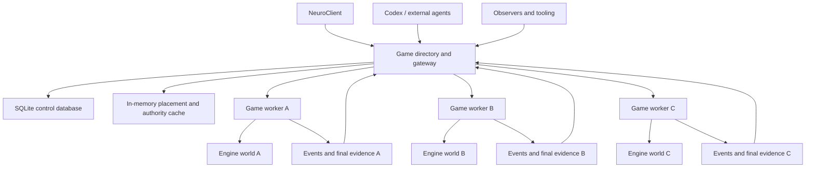
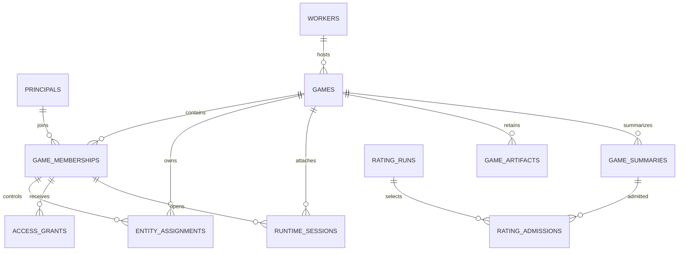
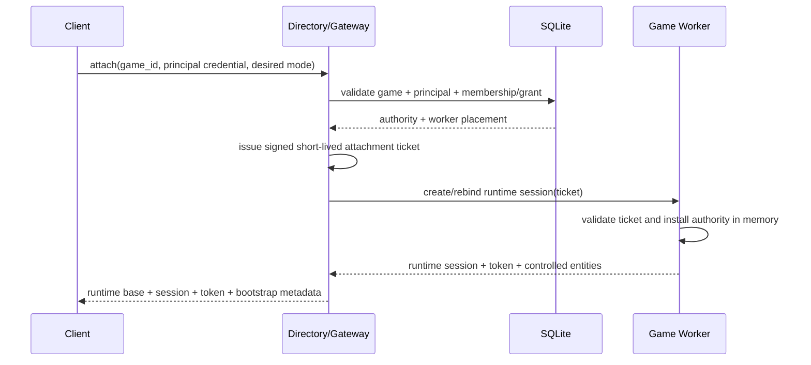
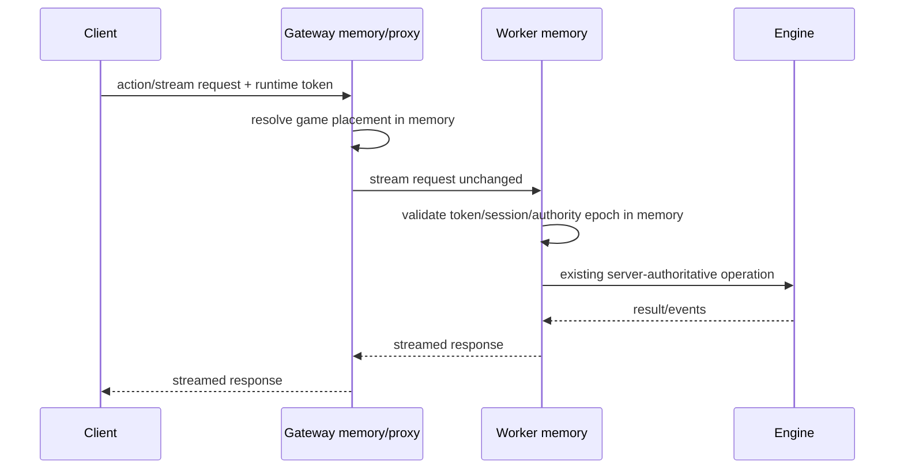
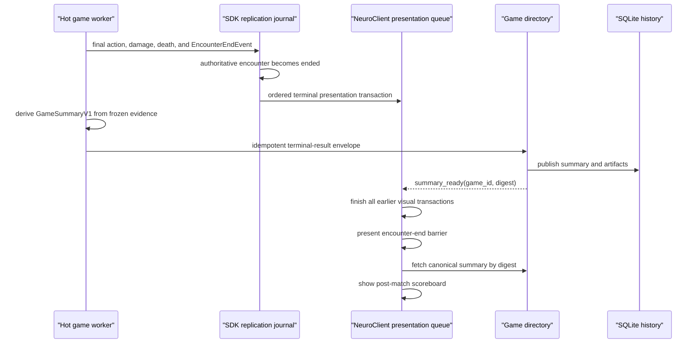

# Multi-Game Directory And Hot Worker Architecture

Status: implementation proposal

Branch: `feat-multi-game-server`

## 1. Objective

Add a durable multi-game control plane around the existing event-driven game
server without moving live simulation into a database or weakening process
isolation.

The finished system must support:

- multiple simultaneous games on one host;
- one isolated engine process per live game;
- discovery of active and historical games;
- explicit authority to play, reconnect, observe, administer, or attach an
  agent;
- browser and Codex reconnection without recreating a game;
- transparent REST, SSE, and WebSocket access to the selected game;
- durable immutable creation specifications, participants, outcomes,
  summaries, and evidence artifacts;
- complete event-derived end-game statistics;
- reproducible post-hoc Elo and other rating computations;
- preservation of the current direct single-game server for development and
  focused engine tests.

The central architectural rule is:

```text
SQLite and the game directory decide which games exist, where they run,
who may attach, and what completed evidence is retained.

The game worker owns every live engine object, event, observation, command,
controller, and stream in memory.
```

## 2. Non-Negotiable Invariants

### 2.1 No Database In The Gameplay Hot Path

After attachment, the following operations perform zero SQLite reads and zero
SQLite writes:

- action validation and execution;
- event declaration, execution, effect, and completion;
- reactions and event handlers;
- movement, senses, light, pathfinding, and spatial callbacks;
- decision-epoch construction;
- subjective observation projection and reduction;
- combat-log publication;
- REST command forwarding after the game route is resolved;
- SSE and WebSocket frame forwarding.

The gateway resolves `game_id -> worker` from an in-memory placement table.
The worker resolves runtime authority from an in-memory attachment/session
table. Neither lookup consults SQLite.

Database operations are limited to cold or control-plane transitions:

- creating or listing games;
- reserving and publishing worker placement;
- creating identities, memberships, invitations, and reconnect grants;
- issuing an attachment credential;
- changing controller authority;
- recording coarse worker leases and lifecycle state;
- publishing terminal summaries and immutable artifacts;
- querying historical evidence or computing ratings.

### 2.2 Process Isolation Is The World Boundary

The engine currently has process-global state:

- `EventQueue` stores one event history and generation per process;
- `GridMap` is a singleton;
- `Encounter` has one active encounter and global combat-log callbacks;
- entities, blocks, values, controllers, conditions, and handlers use global or
  class-level registries;
- `SimulationState` owns one encounter and one game session.

One process therefore hosts exactly one live engine world. A dictionary of
`SimulationState` objects inside one process would not isolate the actual
engine and is explicitly rejected.

### 2.3 Event Authority Remains Unchanged

- All live game mutation still flows through engine events.
- The directory never edits game state directly.
- Final statistics are derived from authoritative retained events and encounter
  facts; they are not incremented by UI guesses.
- Subjective streams remain subjective during play.
- Agent telemetry remains observational and cannot become gameplay truth.

### 2.4 Durable Evidence Is Immutable And Auditable

- A completed game summary has a schema version and content digest.
- The exact creation manifest, engine/rules/content hashes, controller/policy
  versions, seed, terminal event cursor, and artifact digests are retained.
- Correcting a summary creates a new summary revision. It never silently
  rewrites evidence used by a rating run.
- Rating calculations select immutable summary digests and record admission or
  exclusion reasons.

### 2.5 Runtime Sessions Are Not Identities

- A human, Codex process, service, or system AI has a durable principal
  identity.
- Its role in one game is a durable membership.
- A browser tab, CLI process, or reconnect is a runtime attachment/session.
- A raw session UUID is not sufficient authorization.
- Stored credentials are hashed. Plaintext bearer material is returned once.

## 3. Current State

The current `SessionManager` can retain several `GameSession` records, but the
public server remains single-game:

```text
SimulationState
    encounter: Optional[Encounter]
    _game_session: Optional[GameSession]

SessionManager
    games: dict[UUID, GameSession]
    active_game: Optional[GameSession]
```

Most routes read `sim.encounter`, `sim.game`, global registries, or the current
`EventQueue` generation. `SimulationState.reset()` clears every session and
game. The singular `/game/status` endpoint reports only the current game.

The configuration-ladder coordinator already provides reusable process
supervision ideas:

- isolated subprocesses;
- process groups;
- bounded concurrency;
- startup and execution deadlines;
- authenticated request/result artifacts;
- TERM/KILL escalation;
- child-process leak checks;
- explicit crash and protocol-failure classification.

Those workers are disposable match evaluators, not long-lived HTTP game
workers. Their supervision patterns should be reused without coupling hosted
games to the evaluator.

## 4. Target Architecture



### 4.1 Directory/Gateway

The gateway is the only process that opens the control database for writes. It
owns:

- the public game catalog;
- durable principal and membership authority;
- worker allocation and lifecycle supervision;
- attachment credential issuance;
- the in-memory placement map used by the runtime proxy;
- transparent HTTP/SSE/WebSocket proxying;
- durable result and artifact admission;
- directory lifecycle SSE;
- history and rating queries.

### 4.2 Game Worker

A game worker runs the existing single-game FastAPI application with one
isolated `SimulationState`. It owns:

- scenario construction;
- the `Encounter` and all engine registries;
- sessions and entity assignments active inside that game;
- AI/Codex takeover state;
- objective and subjective event streams;
- in-memory runtime attachment credentials;
- final event/history snapshot and summary generation;
- a private authenticated control endpoint for gateway lifecycle messages.

The worker never opens the directory SQLite file.

### 4.3 Evaluator/Gauntlet Workers

Fast scientific gauntlet matches remain evaluator-owned disposable processes.
They are not automatically converted into spectatable HTTP workers because
that would alter timing and evidence semantics.

Their completed artifacts may be admitted to the same historical database
through the same immutable summary contract with
`execution_kind = "evaluation"`. A future explicit spectatable-gauntlet mode
can use hosted workers but must be classified separately from timing evidence.

## 5. Process And Routing Model

### 5.1 Worker Transport

On WSL/POSIX, each worker should listen on a private Unix-domain socket. This:

- avoids ephemeral-port races;
- prevents clients from bypassing gateway authorization;
- gives each game a stable private locator;
- supports streaming HTTP through `httpx.AsyncHTTPTransport(uds=...)`.

A loopback TCP fallback may be added for platforms without Unix sockets. The
fallback must reserve a bound socket before spawning rather than probe for a
free port and release it.

### 5.2 Public Runtime Base

The public base for an attached game is:

```text
/games/{game_id}/runtime
```

The SDK creates a normal `DndEngineClient` with that base. Existing worker
paths remain unchanged below the prefix:

```text
/games/{game_id}/runtime/replication/bootstrap
/games/{game_id}/runtime/events/subscribe
/games/{game_id}/runtime/action/execute
/games/{game_id}/runtime/ai/takeover
```

The gateway removes the directory prefix and proxies the remaining request to
the selected worker. Management paths stay distinct:

```text
/games
/games/{game_id}
/games/{game_id}/attachments
/games/{game_id}/summary
/games/{game_id}/artifacts
```

### 5.3 Proxy Hot Path

The runtime proxy performs only:

1. parse the game id;
2. resolve an immutable in-memory placement entry;
3. stream the request to the worker;
4. stream the response back without buffering.

It does not query SQLite, decode engine payloads, recompute permissions, or
materialize SSE bodies. The worker validates the game-scoped runtime token from
its in-memory authority table.

## 6. SQLite Control Database

### 6.1 Operational Rules

- Use the standard-library `sqlite3` API initially; no ORM is required.
- The gateway owns all write connections.
- Enable `PRAGMA foreign_keys = ON`.
- Use WAL journal mode.
- Use `synchronous = NORMAL` for normal control metadata.
- Set a bounded busy timeout and fail with a typed control-plane error.
- Use explicit transactions for lifecycle and authority transitions.
- Store timestamps as normalized UTC text.
- Store canonical JSON with stable sorting and a SHA-256 digest.
- Run numbered, checksum-verified migrations at gateway startup.
- Tests always use a temporary database.
- The development database path is configured by environment and ignored by
  Git.

### 6.2 Schema Overview



### 6.3 `schema_migrations`

Fields:

- `version` integer primary key;
- `name` text;
- `checksum` text;
- `applied_at` UTC text.

A migration whose stored checksum differs from code stops startup.

### 6.4 `principals`

Durable identities independent of game sessions.

- `principal_id` UUID primary key;
- `principal_kind`: `human`, `codex`, `service`, `system_ai`;
- `display_name`;
- `credential_hash`, nullable for internal system principals;
- `created_at`, `last_seen_at`, `disabled_at`;
- `metadata_json`, `metadata_digest`.

This is intentionally not a complete account system. It is the minimum stable
identity boundary needed for local multiplayer, Codex attachment, and history.

### 6.5 `workers`

Durable placement/lifecycle evidence for isolated processes.

- `worker_id` UUID primary key;
- `worker_generation` integer;
- `state`: `starting`, `ready`, `active`, `ended`, `stopping`, `stopped`,
  `failed`, `lost`;
- `pid`, `process_group_id`;
- `host_id`;
- `transport_kind`: `unix_socket` or `loopback_tcp`;
- `private_locator`;
- `started_at`, `last_heartbeat_at`, `lease_expires_at`, `stopped_at`;
- `protocol_hash`, `engine_version`;
- `failure_code`, `failure_detail_json`.

The private locator and internal worker credential are never returned through
public game-list APIs.

### 6.6 `games`

- `game_id` UUID primary key, assigned by the directory;
- `engine_game_id`, populated after worker creation;
- `worker_id`, `worker_generation`;
- `created_by_principal_id`;
- `lifecycle_state`: `reserved`, `starting`, `active`, `ended`, `failed`,
  `interrupted`, `archived`;
- `visibility_policy`: `public`, `unlisted`, `private`;
- `observer_policy`: `public`, `members`, `disabled`;
- `execution_kind`: `hosted`, `evaluation`, `imported`;
- `scenario_kind`, `scenario_id`, `display_name`;
- `creation_manifest_json`, `creation_manifest_digest`;
- `seed`, `ruleset_version`, `engine_version`, `content_digest`;
- `created_at`, `started_at`, `ended_at`, `archived_at`;
- `terminal_reason`, `winner_side_id`;
- `final_event_cursor`, `final_combat_log_cursor`;
- `current_summary_digest`;
- `row_version` for compare-and-swap lifecycle updates.

The complete `GameCreationStartRequest` is retained canonically. Indexed
columns exist for discovery; JSON remains the exact launch evidence.

### 6.7 `game_memberships`

A principal's durable authority inside one game.

- `membership_id` UUID primary key;
- `game_id`, `principal_id`;
- `role`: `owner`, `player`, `observer`, `agent`, `referee`, `administrator`;
- `side_id`, nullable;
- `controller_kind`, nullable;
- `membership_state`: `invited`, `active`, `disconnected`, `revoked`, `left`;
- explicit capability booleans:
  - `may_connect`;
  - `may_observe_public_state`;
  - `may_observe_subjective_state`;
  - `may_control_entities`;
  - `may_view_agent_telemetry`;
  - `may_manage_members`;
  - `may_manage_game`;
  - `may_view_objective_replay`;
- `subjective_source_membership_id`, nullable for "observe as participant";
- `authority_epoch` integer;
- `joined_at`, `disconnected_at`, `revoked_at`, `left_at`;
- uniqueness on active `(game_id, principal_id, role, side_id)` as appropriate.

Capabilities are explicit because a single role string is too coarse for
paper-ready access and observer ablations.

### 6.8 `entity_assignments`

- `assignment_id` UUID primary key;
- `game_id`, `membership_id`;
- `entity_uuid`, `entity_name`, `faction`, `side_id`;
- `controller_kind`;
- `assigned_at`, `released_at`;
- `authority_epoch`;
- unique active assignment for `(game_id, entity_uuid)`.

Assignments are durable history. The worker keeps the current mapping in
memory for every command validation.

### 6.9 `access_grants`

Single-purpose invite, reconnect, observer, or agent-attachment capabilities.

- `grant_id` UUID primary key;
- `game_id`, optional `membership_id`, optional `issued_to_principal_id`;
- `grant_kind`: `invite`, `reconnect`, `observe`, `agent_attach`, `admin`;
- `secret_hash`;
- `scope_json`, `scope_digest`;
- `issued_at`, `expires_at`, `revoked_at`;
- `max_uses`, `uses`;
- `issued_by_principal_id`.

Plaintext grant secrets are never stored.

### 6.10 `runtime_sessions`

Historical connection evidence, not the live authority source.

- `runtime_session_id` UUID primary key;
- `game_id`, `membership_id`, `worker_id`, `worker_generation`;
- `client_kind`: `neuroclient`, `codex_cli`, `external_ai`, `observer_tool`;
- `connected_at`, `last_seen_at`, `disconnected_at`;
- `disconnect_reason`;
- `runtime_token_hash`;
- `authority_epoch`.

The worker validates the runtime token from memory. Database rows support
history, cleanup, and reconnect diagnostics only.

### 6.11 `game_artifacts`

- `artifact_id` UUID primary key;
- `game_id`;
- `artifact_kind`: creation manifest, objective event history, combat log,
  subjective transcript, agent telemetry, terminal summary, replay bundle;
- `schema_version`, `media_type`;
- `uri`, `byte_size`, `content_digest`;
- `created_at`;
- `producer_kind`, `producer_version`;
- uniqueness on `(game_id, artifact_kind, content_digest)`.

Artifacts are written atomically outside SQLite. The database stores immutable
content-addressed metadata.

### 6.12 `game_summaries`

- `summary_id` UUID primary key;
- `game_id`;
- `schema_version`, `summary_revision`;
- `summary_json`, `summary_digest`;
- indexed `winner_side_id`, `terminal_reason`, `round_count`, `turn_count`,
  `duration_ms`;
- `source_event_digest`, `source_combat_log_digest`;
- `created_at`, `supersedes_summary_id`;
- `is_current`;
- unique `(game_id, summary_digest)`.

### 6.13 Rating Evidence Tables

Ratings are derived products, never mutable columns on participants or games.

`rating_runs`:

- run id, algorithm id/version, parameters JSON/digest;
- selection query JSON/digest;
- content/rules/policy compatibility constraints;
- created at, completed at, status;
- output artifact digest.

`rating_admissions`:

- rating run id;
- game id and exact summary digest;
- admitted boolean;
- exclusion reason code/detail;
- treatment/configuration identities;
- weight.

`rating_estimates`:

- rating run id;
- rated subject/configuration id;
- estimate, uncertainty, games, wins, losses, draws;
- rank and diagnostic JSON.

This supports recomputing Elo, Glicko, TrueSkill, or another estimator from the
same immutable games without corrupting historical evidence.

## 7. Identity, Attachment, And Authority

### 7.1 Cold Attachment Handshake



This path may use SQLite because it runs once per attachment/reconnection, not
once per game command.

### 7.2 Hot Runtime Requests



No database participant appears in this sequence.

### 7.3 Attachment Tickets

A gateway-to-worker attachment ticket includes:

- issuer and schema version;
- game id;
- worker id and generation;
- principal and membership ids;
- role and explicit capabilities;
- entity assignment UUIDs;
- authority epoch;
- issued-at and expiry;
- nonce;
- HMAC or asymmetric signature.

Workers reject the wrong game, generation, expired ticket, lowered authority
epoch, duplicate one-time nonce, or invalid signature.

### 7.4 Runtime Tokens

The worker returns a high-entropy runtime token after accepting the ticket.
The worker stores only its digest in memory. The client sends it as a bearer
token on every runtime request and stream connection. Existing session ids may
remain in typed request bodies for compatibility, but the token must authorize
that exact session.

### 7.5 Authority Changes During Play

Takeover, release, revocation, or reassignment is a cold control operation:

1. directory transaction increments `authority_epoch` and records the desired
   durable assignment;
2. gateway sends an authenticated control command to the worker;
3. worker applies the assignment at an engine-safe advancement boundary and
   updates its in-memory authority epoch;
4. gateway records acknowledgement or reconciliation-required state.

Normal actions continue using the worker's current in-memory epoch. A request
with a stale token/epoch receives a typed reattach-required response.

## 8. Worker Lifecycle

### 8.1 States

```text
reserved -> starting -> ready -> active -> ended -> archived
                    \-> failed
active -> stopping -> stopped
active -> lost/interrupted
```

### 8.2 Creation

1. Validate `GameCreationStartRequest` and visibility/observer policy.
2. In one transaction create the game, owner membership, side memberships, and
   reserved worker row.
3. Create private socket/spool paths.
4. Spawn a dedicated process group with an immutable launch manifest.
5. Wait for authenticated worker readiness with a deadline.
6. Send the creation request through the private control path.
7. Receive engine game/encounter ids and initial assignment facts.
8. Commit `active`, populate the in-memory placement table, and emit a directory
   lifecycle event.
9. On any failure, terminate the complete process group and retain a typed
   failed game record.

### 8.3 Hosted Worker Environment

- `DND_GAME_WORKER=1`;
- `DND_HOSTED_GAME_ID`;
- `DND_WORKER_ID`;
- `DND_WORKER_GENERATION`;
- `DND_PUBLIC_GAME_BASE_URL`;
- private socket path;
- gateway-worker credential supplied through a protected file descriptor or
  mode-0600 file, not command-line arguments;
- artifact spool directory.

### 8.4 Heartbeats And Placement

The gateway already owns the subprocess handle and can monitor process exit in
memory. A worker control heartbeat supplies protocol generation, encounter
state, cursors, and child-process health. Frequent heartbeats update gateway
memory; SQLite is updated coarsely or on lifecycle transitions.

### 8.5 Shutdown

Hosted workers and all AI descendants must share a supervised process group.
The current detached external-AI behavior must be disabled in hosted mode.
Shutdown sequence:

1. stop accepting new attachments;
2. request graceful worker shutdown;
3. let the worker stop streams and AI children;
4. wait bounded time;
5. send TERM to the process group;
6. send KILL if necessary;
7. verify no descendants remain;
8. persist stopped/failed state.

### 8.6 Gateway Restart Policy

The first version does not serialize and restore live Python engine worlds.
On gateway shutdown it terminates owned workers cleanly. On unclean restart it
marks expired worker leases and their active games `interrupted`, preserving
all committed metadata and artifacts.

Checkpoint/replay restoration is a separate future feature.

## 9. Directory API

All requests and responses are Pydantic models with field descriptions and are
included in the generated TypeScript SDK.

### 9.1 Discovery

- `GET /games`
  - filters: lifecycle, discoverability, membership, execution kind, cursor;
  - returns bounded active/history rows and a directory cursor.
- `GET /games/{game_id}`
  - durable metadata, live worker status, participant labels allowed to the
    caller, current summary availability, and attach options.
- `GET /games/subscribe?since=<cursor>`
  - lifecycle SSE using existing bounded subscription/framing machinery;
  - events: created, ready, active, participant changed, ended, failed,
    archived, summary ready.

### 9.2 Creation And Administration

- `POST /games`
  - idempotency key plus creation request and access policy;
  - returns reserved game id immediately or waits for ready according to an
    explicit request mode.
- `DELETE /games/{game_id}`
  - owner/admin operation with expected row version;
  - stops but does not erase history.
- `POST /games/{game_id}/memberships`
  - invite/add principal with role and explicit capabilities.
- `POST /games/{game_id}/memberships/{membership_id}/revoke`
  - increments authority epoch and updates the worker.
- `POST /games/{game_id}/grants`
  - issues one reconnect/invite/observer/agent capability secret.

### 9.3 Attachment

- `POST /games/{game_id}/attachments`
  - modes: `resume`, `player`, `observer`, `agent`, `referee`;
  - validates one principal credential or access grant;
  - creates/rebinds a worker runtime session;
  - returns game-scoped runtime base URL, runtime token, session id, membership,
    controlled entities, observer perspective, worker generation, and bootstrap
    cursor hints.
- `DELETE /games/{game_id}/attachments/{runtime_session_id}`
  - disconnects one attachment without deleting membership or game.

### 9.4 History And Evidence

- `GET /games/{game_id}/summary`
- `GET /games/{game_id}/artifacts`
- `GET /games/{game_id}/artifacts/{artifact_id}` with authorization
- `POST /rating-runs`
- `GET /rating-runs/{rating_run_id}`

Rating execution may remain in the evaluator initially; these models still
define how completed evidence is selected and published.

## 10. Runtime Proxy Authorization

The proxy must not blindly expose every worker route.

Route families are classified:

- public catalog/readiness;
- attached participant state/stream;
- entity command;
- observer read-only;
- Codex/agent observation and command;
- game administration/reset;
- internal worker control.

The worker performs final capability validation because it owns hot authority.
The gateway blocks internal and direct reset/game-replacement routes from the
public runtime prefix. Creating another game through a worker is impossible.

SSE requirements:

- disable response buffering;
- preserve event ids, content type, retry behavior, and heartbeats;
- propagate disconnect cancellation to the worker request;
- return a typed worker-lost terminal envelope when possible.

WebSocket requirements:

- relay binary/text frames and close codes bidirectionally;
- propagate client and worker cancellation;
- enforce attachment capability before upgrade.

## 11. Complete End-Game Summary

### 11.1 Source Of Truth

At encounter end, the worker freezes:

- immutable game creation and participant facts;
- initial entity/loadout/resource snapshots;
- the authoritative event history and final event versions;
- the hierarchical encounter combat log;
- final entity/resource/condition state;
- controller and policy identities;
- objective performance instrumentation already produced by the runtime.

A pure versioned reducer creates `GameSummaryV1`. It must be possible to rerun
the reducer over the retained objective evidence and reproduce the same digest.

Summary computation and artifact serialization occur after the terminal engine
boundary. They do not delay or alter action execution.

### 11.2 Summary Levels

`GameSummaryV1` contains:

1. game identity and provenance;
2. outcome and termination;
3. side aggregates;
4. entity aggregates;
5. action, spell, item, reaction, condition, movement, and resource coverage;
6. timeline and notable events;
7. performance/transport diagnostics in a separate system section;
8. completeness and provenance declarations;
9. artifact references and digests.

### 11.3 Outcome

- winner side/faction and winning memberships;
- loser side/faction;
- draw or incomplete outcome;
- termination reason: elimination, objective, surrender, timeout, interrupted,
  administrative stop, engine failure;
- rounds, turns, actions, start/end timestamps, simulation and wall duration;
- surviving, defeated, downed, revived, and escaped entities.

### 11.4 Damage

Damage metrics must not collapse different concepts:

- rolled damage;
- post-save/pre-affinity damage when known;
- applied damage to temporary HP;
- applied damage to current HP;
- prevented by resistance/immunity/other mitigation;
- amplified by vulnerability;
- overkill damage;
- damage by source entity, target entity, action/spell, damage type, and round;
- friendly fire and self-damage;
- critical-hit contribution.

"Damage dealt" on the result screen defaults to actual HP plus temporary-HP
loss caused, with rolled and overkill values separately available.

### 11.5 Attacks, Saves, And Checks

- attacks attempted, hit, missed, critical, auto-hit/miss;
- melee, ranged, weapon, spell, opportunity, and reaction attack families;
- advantage/disadvantage counts;
- saving throws by ability and result;
- skill checks by skill and result;
- shove attempts/success/failure and forced distance;
- reactions offered, accepted, declined, or unavailable when represented.

### 11.6 Healing And Survival

- rolled healing, effective healing, overhealing;
- temporary HP gained/consumed;
- deaths, instant deaths, death saves, stabilization, revival;
- damage taken by type and source;
- maximum single hit, heal, and round swing.

### 11.7 Action Economy And Resources

- actions, bonus actions, reactions, movement, and attack slots spent;
- resources spent and restored by semantic resource id;
- spell slots spent by level;
- item charges and consumables spent;
- turns ending with unused economy;
- Dash, Dodge, Disengage, Hide, Help, Shove, Jump, Swim, and object-use counts;
- concentration spells started, replaced, voluntarily dropped, broken by
  damage, and completed normally;
- concentration duration in turns and successful/failed maintenance saves.

### 11.8 Spells, Features, Items, Conditions

- spell casts by semantic key, level, target mode, and outcome;
- multi-target allocation counts and unique/repeated recipients;
- class feature and feat use by semantic key;
- item use, potion/scroll consumption, pickup/drop/equip changes;
- conditions applied, removed, resisted, and ending with encounter;
- source/recipient and effective duration when derivable;
- doors, levers, chests, torches, traps, hazards, and other object interactions.

### 11.9 Movement And Information

- voluntary, forced, jump, swim, teleport, and other trajectory distance;
- difficult-terrain cost;
- opportunity-attack exposure and outcomes;
- doors opened/closed and topology changes;
- entities/objects/hazards first perceived;
- hidden/invisible reveal and loss events;
- per-participant subjective discoveries only in authorized subjective summary
  sections.

### 11.10 Objective Versus Subjective Results

The durable official summary is objective and available only under the game's
post-match access policy. Participant summaries remain subjective and may say
that a metric is incomplete. The official reducer must never be reused as a
live agent observation source.

An objective replay does not imply that every participant may view it.

### 11.11 Publication

The worker writes evidence artifacts atomically to its spool, computes digests,
and submits an authenticated idempotent terminal-result envelope to the
gateway. The gateway validates game/worker generation, schema, cursors, and
digests before one SQLite transaction publishes artifacts, the summary, and
the ended lifecycle state.

If publication fails, the worker retains the spool and retries. The game is
terminal in memory regardless; database delay cannot reopen or alter it.

### 11.12 Encounter-End Presentation Contract

`EncounterEndEvent` is the gameplay event that terminates the encounter. The
durable summary is a derived historical artifact. They are correlated, but
they must not be collapsed into one payload or one timing boundary.

The current client already receives and validates the typed
`dnd.core.events.EncounterEndEvent`, and the TypeScript SDK reducer correctly
changes the authoritative encounter state to `ended`. NeuroClient does not yet
classify that event as a visual root. Its local action-result path instead
waits for the clip queue and later stops replication with a timeout. That is
not sufficient because an observer, an AI-controlled side, or a reconnected
client may see the encounter end without having submitted the terminal
command.

The required event-first behavior is:



The two client clocks remain distinct:

- the authoritative clock marks the encounter ended as soon as the replicated
  event is reduced and disables all gameplay commands immediately;
- the presentation clock continues through every earlier movement, reaction,
  attack, damage, condition, and death transaction;
- `EncounterEndEvent` is enqueued in event order as a terminal visual
  transaction and becomes presented only after those transactions finish;
- reaching the terminal transaction flushes any remaining coalesced movement,
  freezes the final battlefield composition, and opens the result-shell state;
- the scene is not snapped, cleared, dimmed, or destroyed merely because the
  authoritative encounter already ended;
- runtime SSE is closed only after the terminal event cursor is received and
  its presentation barrier is reached, never after an arbitrary timeout.

The result shell has two typed states:

- `finalizing`: the encounter is visibly over and the final battlefield stays
  available while the canonical summary is being published;
- `ready`: the summary digest has been announced and the exact canonical
  `GameSummaryV1` is displayed.

Summary publication does not block the terminal animation. If SQLite or the
gateway is temporarily unavailable, the worker remains ended, the client keeps
the final board and `finalizing` result shell, and the gateway can later publish
the retained worker spool. Reconnection to an ended game reads the durable
summary directly and does not replay a fake terminal animation unless replay
mode is explicitly requested.

The terminal visual transaction should contain typed presentation intents,
not infer outcome from combat-log prose. At minimum it carries:

- encounter UUID and terminal event lineage/cursor;
- reason and combatant UUIDs from `EncounterEndEvent`;
- participant-relative result once the summary is available: victory, defeat,
  draw, interrupted, or unknown/finalizing;
- a command-disable barrier;
- a result-shell transition;
- optional victory/defeat audio and banner presentation chosen by the client.

The objective winner, scores, and statistics are intentionally read from the
summary rather than added retrospectively to the engine event. This preserves
the event as the causal terminal fact and the summary as a reproducible
analysis of the complete frozen history.

Animation-coverage evidence must classify `EncounterEndEvent` as presented,
not `unanimated`. Rage, Frenzy, Dash, and other non-terminal semantic cues are
separate polish work and are not part of this terminal feature.

## 12. TypeScript SDK

Keep `DndEngineClient` as the worker-runtime client. Add a separate typed
`DndGameDirectoryClient` for control-plane APIs.

```ts
const directory = new DndGameDirectoryClient("/api");
const games = await directory.listGames({ lifecycle: "active" });
const attachment = await directory.attach(gameId, reconnectGrant);
const game = directory.runtimeClient(attachment);
```

`runtimeClient()` returns a normal `DndEngineClient` configured with:

- `/api/games/{game_id}/runtime` base URL;
- runtime bearer token;
- expected worker generation;
- the existing fetch implementation.

Extend `DndEngineClient` through typed constructor options for default headers
or an authenticated fetch implementation. Do not add game-id parameters to
every action and replication method.

All new models originate as Pydantic models and are generated through the
existing SDK generator. No handwritten duplicate game-directory interfaces.

## 13. NeuroClient

### 13.1 Split Bootstrap Responsibilities

The current bootstrap always starts a game, creates a session, joins, loads a
replica, and starts SSE. Split it into:

- `createHostedGame(selection)`;
- `attachToHostedGame(attachmentRequest)`;
- `hydrateGameRuntime(runtimeClient, attachment)`;
- `resumeStoredMembership()`;
- `observeHostedGame(gameId, perspective)`.

Only `hydrateGameRuntime` owns replication bootstrap, journal initialization,
visual snapping, equipment loading, session status, and SSE start. New-game,
resume, and observe all converge on it.

### 13.2 Persisted Client Identity

Persist only directory identity/reconnect material and the selected game id in
browser storage. Do not persist the authoritative game snapshot as truth.
After reload:

1. query directory status;
2. validate/redeem reconnect grant;
3. receive a new runtime attachment;
4. bootstrap from the worker;
5. resume the existing replication reducer and presentation coordinator.

### 13.3 Game Browser

The first screen lists:

- resumable games for this principal;
- active observable games;
- games waiting for participants;
- recent completed games with outcome and summary availability;
- create-game command.

Each active row exposes only valid commands:

- Resume;
- Play/Join;
- Observe;
- View agent telemetry when authorized;
- Stop/manage for owner/admin.

Completed rows expose result summary and replay/evidence according to policy.

### 13.4 Observer Modes

- neutral omniscient spectator, only when authorized;
- follow one participant's subjective perspective;
- free switch among authorized perspectives;
- agent telemetry overlay, separate from gameplay truth.

An observer never receives entity-control capability.

## 14. Module Layout

Proposed additions:

```text
server/game_directory/
    __init__.py
    app.py
    api_models.py
    database.py
    migrations.py
    repository.py
    authority.py
    attachments.py
    worker_contracts.py
    worker_manager.py
    proxy.py
    lifecycle_stream.py
    artifacts.py
    rating_repository.py

server/game_worker.py

dnd/analytics/
    __init__.py
    models.py
    reducer.py
    artifacts.py

sdk/typescript/src/directory_client.ts
```

The directory package may depend on generated server contracts and process
management. It must not import live entity registries to answer a request.

`dnd.analytics` is a high-level read-only consumer of engine events. Engine
events do not import analytics, preventing circular dependencies.

## 15. Implementation Sequence

### Phase 1: Typed SQLite Directory

- Add directory Pydantic models and enums.
- Add deterministic canonical JSON/digest helpers.
- Add migrations and repository operations.
- Add principal, game, worker, membership, grant, attachment-history,
  artifact, and summary persistence.
- Add `/games` discovery/history endpoints without worker creation.
- Generate and validate the TypeScript contracts.

Exit proof: repository round trips and authority transitions are typed,
transactional, migration-tested, and independent of engine globals.

### Phase 2: Isolated Hosted Workers

- Add hosted-worker entrypoint and private readiness/control contract.
- Extract reusable process-group supervision from evaluator patterns without
  importing evaluator policy.
- Spawn one Unix-socket worker per game.
- Make external AI children remain in the hosted worker process group.
- Add complete graceful/forced cleanup.
- Create two simultaneous games and prove registry/event isolation.

Exit proof: two real games run concurrently; resetting or terminating one does
not change the other.

### Phase 3: Runtime Proxy And Attachments

- Add signed attachment tickets and in-memory worker runtime tokens.
- Add player, reconnect, observer, agent, and referee attachment modes.
- Add transparent REST and unbuffered SSE proxying.
- Add WebSocket relay if current production client paths require it.
- Add explicit route-family authorization.
- Extend the SDK with directory and authenticated runtime clients.

Exit proof: after attachment, a test repository that raises on every database
call cannot break actions, observations, SSE, or end-turn.

### Phase 4: Objective Evidence And Summary

- Add initial/final game evidence snapshots.
- Implement the pure event-derived summary reducer.
- Retain objective event/combat-log artifacts atomically.
- Publish terminal results idempotently to the directory.
- Add history and summary endpoints.
- Add summary correction/revision support.
- Add rating-evidence admission models and exporter.
- Make `EncounterEndEvent` produce an ordered NeuroClient terminal visual
  transaction rather than relying on an action-response timeout.
- Add the `finalizing -> ready` result-shell flow driven by the directory's
  typed `summary_ready` lifecycle event.
- Keep the final battlefield mounted while terminal presentation and summary
  publication complete.

Exit proof: replaying retained evidence reproduces the exact summary digest,
post-hoc rating input can be reconstructed without a live worker, and an
observer receives the same ordered terminal presentation and canonical result
without having submitted the final action.

### Phase 5: NeuroClient Browse/Resume/Observe

- Add directory client and selected-runtime client lifecycle.
- Split create from attach/hydrate.
- Persist reconnect identity safely.
- Add game browser, active game details, Resume, Observe, and history summary.
- Preserve all existing rendering/replication reducers.

Exit proof: reloading the browser during a live match reattaches without
creating a new game, and an independent browser can observe the same game
without gaining control.

### Phase 6: Operational Hardening

- gateway restart reconciliation;
- worker TTL and archive policy;
- orphan socket/spool cleanup;
- bounded game count and resource admission;
- metrics for process count, memory, event volume, proxy latency, DB latency,
  summary latency, and failed attachments;
- backup/export command for SQLite plus content-addressed artifacts.

## 16. Focused Test Plan

### 16.1 Database And Migrations

- fresh migration produces the exact schema version;
- every repository model round trips with digests intact;
- migration is idempotent and checksum drift is rejected;
- foreign keys and uniqueness constraints reject cross-game assignments;
- compare-and-swap lifecycle transitions reject stale updates;
- secrets are never stored plaintext;
- idempotency keys do not spawn duplicate games.

### 16.2 Worker Isolation

- two workers have distinct PIDs, process groups, sockets, game ids, encounter
  ids, EventQueue generations, maps, registries, sessions, and cursors;
- simultaneous commands mutate only the addressed game;
- reset/stop/crash of game A leaves game B unchanged;
- worker startup failure produces one retained failed game;
- gateway shutdown leaves no worker or AI descendants;
- external AI receives the correct game-scoped public base URL.

### 16.3 Hot-Path Database Exclusion

- attach a game, replace every directory repository method with a raising stub,
  and prove bootstrap, command execution, end-turn, observation, and SSE still
  work;
- instrumentation reports zero database operations per action and event;
- proxy placement resolution uses only the in-memory table;
- worker authorization uses only the in-memory runtime authority table.

### 16.4 Authority

- player A cannot attach to game B without membership/grant;
- observer cannot submit commands;
- subjective observer sees only the selected participant perspective;
- revoked/reassigned authority increments epoch and invalidates stale runtime
  tokens;
- runtime token cannot be replayed against another game or worker generation;
- reconnect creates a fresh attachment but preserves membership and entity
  authority;
- private/unlisted/public discovery policies are enforced.

### 16.5 Proxy And Replication

- every existing structured HTTP error survives proxying;
- bootstrap model is unchanged below the game-scoped base;
- SSE ids, cursors, heartbeats, replay, eviction, and reconnect survive proxy;
- slow consumers remain bounded;
- disconnect cancels worker stream resources;
- worker loss produces a typed reconnect/unavailable result;
- WebSocket frames and close codes relay correctly when enabled.

### 16.6 Summary

- damage distinguishes rolled, effective, temporary HP, mitigation, and
  overkill;
- attacks, crits, saves, healing, death, conditions, resources, concentration,
  movement, forced movement, reactions, spells, items, and objects aggregate
  correctly;
- repeated-target spells count allocations correctly;
- objective and subjective summaries remain distinct;
- interrupted games have typed incomplete summaries;
- reducer rerun yields identical canonical JSON and digest;
- summary publication is idempotent;
- corrected summaries retain superseded evidence;
- rating admission references an exact summary digest.

### 16.7 NeuroClient

- startup lists games without creating one;
- new game starts and attaches through one typed flow;
- page reload resumes the same membership/game;
- stale reconnect grant gives a recoverable UI state;
- observer joins an already-running game;
- spectator receives no controls;
- switching games fully resets replication and presentation generations;
- simultaneous tabs can play and observe one game;
- completed history renders from summary JSON, not hardcoded values.

### 16.8 Terminal Event And Result Presentation

- feed final attack, damage, death, condition, and encounter-end events to the
  client faster than the renderer can play them and prove their visual
  transactions remain in causal order;
- prove authoritative state reaches `ended` immediately while presentation
  continues through the final damage and death clips;
- prove `EncounterEndEvent` is a typed visual root and advances the
  presentation cursor only after all prior transactions drain;
- prove a terminal event received while observing an AI turn opens the result
  shell without any local action-result callback;
- prove all coalesced voluntary and forced movement is flushed before the
  terminal barrier;
- prove the final scene remains mounted and unchanged while summary state is
  `finalizing`;
- prove delayed or failed summary publication does not block terminal
  presentation and later transitions idempotently to `ready`;
- prove `summary_ready` announces an exact digest and the displayed result is
  fetched and validated against that digest;
- prove runtime SSE is stopped by a completed terminal cursor/barrier, not a
  timeout;
- prove reconnecting to an ended game opens its durable summary without
  recreating the encounter or replaying terminal presentation by default;
- animation evidence reports zero unanimated encounter-end events.

### 16.9 Focused Regressions

Run specific files only, including the existing session, replication, external
AI, Codex takeover, isolated worker, coordinator, game creation, SDK, and
NeuroClient bootstrap tests. Never run the repository-wide suite.

## 17. Acceptance Criteria

The feature is complete when:

1. one gateway hosts at least two simultaneous isolated real games;
2. each game has an immutable id, placement, creation manifest, access policy,
   participants, and lifecycle history in SQLite;
3. gameplay and streaming continue when all database methods are deliberately
   made unavailable after attachment;
4. player, Codex, AI, and observer authority is game-scoped, explicit, typed,
   revocable, and not based on public session UUIDs;
5. NeuroClient can browse, start, resume, and observe without duplicating its
   replication reducer;
6. browser reload does not create or replace a game;
7. terminating/resetting one game does not affect another;
8. worker and AI process trees are fully cleaned up;
9. every completed game publishes a complete versioned objective summary and
   immutable evidence artifacts;
10. the summary is reproducible from retained event evidence;
11. post-hoc Elo can select exact eligible summary digests and retain its own
    algorithm/version/admission evidence;
12. the current direct single-game server remains usable for engine development
    and focused tests.

## 18. Deferred Work

- restoring a live game after worker/gateway process failure;
- distributed multi-host scheduling;
- user accounts, OAuth, password recovery, and external identity providers;
- database replication or replacing SQLite for a multi-gateway deployment;
- spectatable scientific gauntlets whose instrumentation has been separately
  validated;
- arbitrary server migration of a live game between workers;
- long-term replay storage outside the local artifact filesystem.

These are intentionally deferred. The first architecture must make them
possible without putting persistence into the live engine loop.
