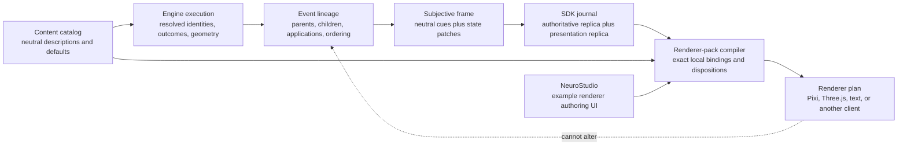

# Renderer-neutral gameplay bridge study

**Status:** read-only architecture and bridge audit, 2026-08-12  
**Scope:** actions, attacks, movement, reactions, spells, presentation identity, reducer ownership, and client binding closure  
**Deferred:** condition-specific visual semantics and condition authoring quality  
**Companion machine report:** [`PRESENTATION_BRIDGE_AUDIT.md`](PRESENTATION_BRIDGE_AUDIT.md) and [`PRESENTATION_BRIDGE_AUDIT.json`](PRESENTATION_BRIDGE_AUDIT.json)

> **Action-cut boundary clarification (2026-08-12):** the action-execution hard-cut plan is the normative migration document. This study is evidence, not implementation authority. Current runtime `projectile_type`, delivery/VFX route hints, Fireball travel, and the mixed renderer-oriented enum leave Event/cue/subjective-SDK authority entirely. The gameplay catalog may retain one newly reviewed exact-`ContentRef` optional **noncausal physical description** (`BOLT | RAY | ORB | BEAM | DART | SPRAY | RAIN`) for human authoring and text clients. It creates no route/arrival/application fact, has no assets/timing/color, is never a binding/admission variant, and may only suggest a client-local draft. The companion audit is a historical diagnostic until WP0 replaces it with the occurrence-and-edge migration ledger; its lexical findings cannot prove end-to-end closure. General asset-binding discussion below is future context and is outside the action-only first cut.
>
> The action cut also corrects four boundaries discovered after the original read-only pass: entity recognition does not authorize exact content identity; OBSERVED/DEVELOPER/INTERNAL refs do not cross the current public-catalog protocol; the whole reachable action-model graph—not only `Event.context`—must reject open semantic channels; and the existing broad `content_set_digest` remains authoritative with an explicit per-packet rebase/rejection fence rather than a new identity architecture. These corrections supersede any looser inference below.

## Executive conclusion

The intended boundary is viable, and most of its underlying machinery already exists:

> The game engine is the authority for what happened, to whom, where, in what resolved form, and in what causal order. The SDK transports and reduces that neutral observation without art assumptions. A renderer pack authors one local interpretation of those facts. NeuroStudio and NeuroClient are examples of that authoring and digestion process, not protocol authorities.

The present failures are not primarily missing top-level cue types or missing clip executors. All 18 canonical cue kinds reach an explicit NeuroClient mapping branch, and all 25 `ClipIntent` kinds have dispatcher cases. The failures cluster around four narrower authority mistakes:

1. The backend and generated SDK carry renderer recipe constants and art identifiers.
2. Projection or the client drops, flattens, or re-derives neutral facts that the engine already resolved.
3. Some runtime behavior identities are lost before presentation mapping.
4. Client binding completeness is diagnosed but is not a hard content/install gate.

The correction does **not** require another event system, another reducer, or a generic presentation middleware layer. It requires a clean use of the existing pieces:

- exact `ContentRef` identity;
- the existing event and presentation causal graph;
- neutral resolved enums, roles, outcomes, applications, positions, and geometry;
- the SDK's authoritative and presentation replicas;
- the existing client presentation bundle as a renderer-local binding compiler.

Visual compatibility with today's Pixi client is not a migration invariant. Gameplay meaning and causal ordering are. A Three.js client, a terminal client, and NeuroClient should be able to consume the same observation while choosing completely different animations, durations, assets, cameras, sounds, and effects.

## Authority rule

When sources disagree, use this order:

1. **Executed game-engine behavior and emitted event lineage** are the semantic authority.
2. **Canonical subjective projection** must faithfully disclose that behavior without inventing renderer facts.
3. **Catalog metadata** may define neutral content description and defaults, but it is not execution truth unless the runtime selects and freezes it for that execution.
4. **SRD wording** is useful vocabulary and provenance, but the engine is allowed to deviate and remains authoritative.
5. **NeuroStudio recipes and NeuroClient clips** are renderer-local choices and must never redefine the game event.

This distinction matters for spells in particular. The current engine does not mechanically select or consume a manifestation form. An optional exact-ref noncausal catalog description may nonetheless say bolt/ray/orb/etc. to help a human, a text client, or generation of a **draft suggestion**. It is not execution truth, does not cross Event/cue/subjective SDK, cannot fabricate a Studio frame or required binding variant, and cannot overwrite an existing recipe. A visual client may choose a completely different manifestation.

## The boundary

### Ownership table

| Backend and SDK own | Renderer pack, Studio, and client own |
|---|---|
| Exact semantic `ContentRef` and provider/origin attribution | Local asset, rig, mesh, sprite, icon, portrait, material, and sound |
| Actor, target, item, equipment-slot, object, position, and area roles | How those semantic roles look in this renderer |
| Resolved outcome and state transition | Animation or textual phrasing used to communicate it |
| Parent/child/application graph and causal boundaries | Scheduling inside the permitted causal boundaries |
| Disclosed ordered applications and repeated applications | Whether applications are drawn serially, concurrently, or summarized |
| Resolved movement path, elevation, mode, commitment, and reaction boundaries | Walk cycle, interpolation, easing, pose, camera, and duration |
| Canonical attack range, source kind, selected slot/item, outcome, and effects actually selected by the engine | Swing, thrust, recoil, muzzle flash, projectile mesh, and impact effect |
| Exact spell identity, range, Entity/Position/Object applications/results, causal children, and mathematical area geometry | Actual manifestation/route, sprite versus generated geometry, particles, color, travel speed, stagger, and impact frames |
| Optional noncausal exact-ref physical description and neutral human-readable prose | Whether/how to use that suggestion; typography, localization, narration, and accessibility presentation |

### Three different kinds of data

These must not be collapsed into one schema:

1. **Content description:** stable facts/prose about a definition, such as exact identity, rules text, canonical range/target rules, a weapon's thrown capability, or the optional noncausal physical-form description. These may live in the game content catalog. The physical description is re-authored per exact spell and stays a nonbinding suggestion; it is not copied from legacy VFX/delivery fields or promoted into execution.
2. **Execution observation:** what was actually selected and resolved this time, such as the equipped ranged-main item, the exact ordered targets, a thrown attack mode, a committed movement edge, or the full cone used by this cast.
3. **Renderer binding:** the local recipe selected by one client, such as `Kick`, `TakeDamage`, a Pixi `Graphics` primitive, a Three.js mesh, a portrait PNG, or a textual sentence.

Catalog gameplay facts constrain truthful rendering; ordinary prose and the optional physical description may assist a human or draft generator. Neither becomes an execution fact or a required renderer binding variant. Renderer binding must never flow back into the engine or generated SDK.

## What the current observation machinery already guarantees

The current design already contains the important basis for renderer-independent replay:

- Event lineage and parent relationships.
- Source and presentation cursors.
- Exact cue IDs and ordered child IDs.
- Exact behavior `ContentRef` attribution on many cue families.
- Ordered spell applications with application index, application identity, outcome, and ordered child effects; the hard cut makes the executed Entity/Position/Object endpoint explicit instead of nullable/inferred.
- State patches carrying the resulting subjective world.
- A journal that can advance authoritative state at server speed while presentation state advances at client speed.

The TypeScript SDK's subjective journal maintains a leading authoritative replica and a lagging presentation replica. A frame can be reduced against the presentation replica, rendered at any local speed, and committed only after that head completes. See [`subjectiveJournal.ts`](/mnt/c/Users/tommaso/Documents/Dev/dnd_engine/sdk/typescript/src/subjectiveJournal.ts) and NeuroClient's head drain in [`eventIngestion.ts`](/home/tommaso/Dev/NeuroClient/app/src/engine/eventIngestion.ts).

This is why backend milliseconds are unnecessary for causality. Server order is expressed by graph identity and state transition boundaries. Client time is a presentation concern.

Exact identity needs a separate disclosure correction. The public catalog cannot resolve OBSERVED/DEVELOPER/INTERNAL definitions, so those refs cannot cross simply because an entity or position was visible. Engine reachability and wire-emittable binding are different sets. Multiattack must expose its PUBLIC configured action; Acid Flask may expose its PUBLIC provider/source item, not the hidden spell implementation. The same law must govern action-owned condition and dynamic spatial-effect cues **and** later bootstrap/upsert state, otherwise a hidden ref or backend art descriptor can bypass the event-time gate. Hidden implementations map to a truthful PUBLIC origin/provider or a closed systemic client binding—never to a guessed definition or display-name key.

## Audit inventory

The current public surface examined in this study is:

- 671 public content declarations.
- 91 public action/reaction definitions:
  - 73 runtime action behaviors;
  - 10 typed public Multiattack configurations;
  - 8 reactions.
- 116 spells.
- 18 canonical presentation cue kinds.
- 25 NeuroClient intent kinds.

Static exact binding inventory by source category:

| Category | Definitions | Static exact client binding status |
|---|---:|---|
| Universal and base actions | 13 | 13 bound |
| Class and subclass actions | 19 | 19 bound |
| Item actions | 7 | 7 bound |
| Environment actions | 12 | 12 bound |
| Monster, trait, and configured actions | 15 | 15 public identities bound |
| Movement definitions | 4 | 4 bound |
| Origin actions | 1 | 1 bound |
| Spell follow-up actions | 12 | 12 bound |
| Reactions | 8 | 8 bound |
| Spells | 116 | 116 compiler-materialized |

This table proves only that the public definition has a declared client binding. It does **not** prove that runtime identity reaches that binding, every legal cue variant is accepted, every neutral field survives, or every asset is ready. Those are separate gates.

In particular, `8 bound` for reactions means only that all eight exact reaction definitions have client recipes. It is not a runtime verdict: the reaction audit below finds one adequate route, one frame-blocking identity failure, one structurally duplicated route, and five causally under-specified routes.

## Finding vocabulary

This study avoids the vague word "unproven." Findings use explicit meanings:

| Status | Meaning |
|---|---|
| `CONNECTED` | The examined execution fact reaches a valid neutral cue and is accepted by the client route. |
| `DROPPED_EXISTING_FACT` | The engine already resolved the fact, but projection or client compilation discards or rewrites it. |
| `MISSING_ENGINE_VOCABULARY` | The engine genuinely cannot yet express a behavior it would need to distinguish. |
| `RENDERER_LEAK` | A frame, duration, clip, asset, color, rig, or other client recipe choice appears in backend/SDK data. |
| `CLIENT_DOES_NOT_CONSUME` | The neutral fact reaches the client but its current renderer compilation ignores or rejects it. |
| `IDENTITY_PROPAGATION_BUG` | An exact runtime behavior or configured identity exists but is not carried into the cue. |
| `INTENTIONAL_STATE_ONLY` | The reducer/state patch is the authoritative presentation for this transition. |
| `NOT_EXERCISED` / `NOT_SCANNED` | The audit did not execute or enumerate that surface; it does not mean connected or broken. |

## Attacks

### Existing neutral vocabulary that is sufficient

The attack engine already owns most of the correct binding surface:

- `WeaponSlot`: melee/ranged and main/off hand.
- Exact source-item `ContentRef` for ordinary equipped attacks.
- Resolved `Range` information (`REACH`, `RANGE`, or `SELF`, plus normal/long values).
- Actor, target, hit/miss/critical outcome, and damage categories.
- Ordered impact-effect child identities.
- Exact action or reaction behavior identity when binding is admitted correctly.

This directly answers the "longbow versus ranged-main weapon" question. A renderer should normally bind using:

> exact attack behavior + canonical resolved `Range` + `RANGED_MAIN` + exact equipped item `ContentRef`

It does not need a protocol enum named `longbow`. The exact item definition already provides the semantic identity, and each renderer can map that item to its own representation.

### Existing fact currently overwritten

`AttackEvent.range` is resolved by the engine, but `_attack_node` ignores it and derives delivery only from `WeaponSlot`. Every ranged slot is then assigned `PresentationProjectile.BOLT`.

That is two boundary errors:

1. Existing execution truth is discarded.
2. A renderer-shaped carrier is invented from equipment layout.

Evidence:

- Attack construction and range resolution: [`dnd/actions.py`](/mnt/c/Users/tommaso/Documents/Dev/dnd_engine/dnd/actions.py)
- Attack projection: [`server/player_replication/mapper.py`](/mnt/c/Users/tommaso/Documents/Dev/dnd_engine/server/player_replication/mapper.py)
- Attack cue contract: [`server/player_replication_contract.py`](/mnt/c/Users/tommaso/Documents/Dev/dnd_engine/server/player_replication_contract.py)

### What belongs in neutral attack semantics

The current primitives should be preserved and factored around the resolved execution:

- exact attack behavior identity;
- attacker and target;
- exact source item when one exists;
- selected equipment slot;
- canonical resolved `Range`/long-range state; this is the engagement truth, so no parallel contact/projectile delivery enum is added;
- outcome;
- ordered impact children;
- selected ammunition or intrinsic form only when the engine actually distinguishes it.

### Genuine missing engine vocabulary

These are real gaps, not renderer metadata requests:

1. **Intrinsic attack form.** Hidden intrinsic proxy items and natural attacks use ordinary equipment slots. The currently executed forms that need a closed fact are Bite, Slam, and Claws; ordinary empty-slot attacks are only `unarmed` because the engine does not select punch versus kick. `BodyPart` is armor/accessory vocabulary and should not be repurposed. Add another form only with an executed producer.
2. **Selected throw mode.** Weapons can have `THROWN` as a capability, but the engine does not currently select a distinct thrown attack execution for those weapons. A selected throw is not the same fact as "this definition could be thrown."
3. **Ammunition identity.** There is no proper selected arrow/bolt/ammunition model. A special arrow should be observed only when it is an actual engine-selected item or effect, not guessed by a renderer from a longbow.

These primitives should be added only as game behavior begins to distinguish them.

### Renderer-only attack choices

The following never belong on the semantic wire:

- `Kick` as Shove's actor clip;
- a swing or thrust animation selected solely for art direction;
- wind-up, contact, recoil, recovery, or hit-flash frame;
- playback speed and duration;
- projectile sprite, mesh, trail, particle, or sound.

If the engine later distinguishes a sweeping attack from a thrust because they have different target geometry or rule consequences, that **neutral topology** becomes game data. The animation remains local.

### Identity failures affecting attacks

- All 10 public configured Multiattacks lose `configured_action_ref`. The root exposes the internal implementation identity, and child attacks are directly constructed without exact attribution.
- Retaliation directly constructs an unattributed Attack.
- True Strike directly constructs an unattributed nested Attack.
- Opportunity Attack demonstrates the correct existing connection by explicitly copying the active reaction binding before applying its nested Attack.

These are binding propagation defects, not missing attack animation categories.

## Movement and spatial transitions

### Voluntary movement is the strongest current causal model

The engine already distinguishes:

- walking, flying, swimming, and burrowing;
- path, direct-arc, and connector-transfer trajectories;
- 12 terminal reasons internally;
- from/to positions, step index, total steps, movement cost, elevations, disclosed path, provocation policy, and commit state;
- ladder, rope, lift, vertical-stairs, and passage connector kinds.

Movement steps are emitted before position commit. Pre-edge reactions execute against that provisional step. Only afterward does the engine commit or reject the edge and continue/revalidate the path.

This is the correct server-ahead/client-paced model. A renderer may spend 50 ms or 5 seconds presenting the edge, but it cannot move the causal attack after arrival.

### Opportunity Attack proves the boundary

The engine sequence is:

1. Emit provisional Step movement effect.
2. Run Opportunity Attack before the destination commits.
3. Resolve the nested Attack.
4. Commit or reject the step.
5. Continue or terminate movement.

The presentation graph attaches the attack to the exact movement edge and transports committed/not-committed endpoint outcome. NeuroClient decides where within its locally authored walk cycle to pause. This division is correct.

The SRD also describes an opportunity attack as occurring immediately before the creature leaves reach and distinguishes teleport/forced movement as non-provoking examples. That is useful vocabulary corroboration, but the engine implementation above remains authoritative. See the [official SRD 5.1 PDF](https://media.wizards.com/2023/downloads/dnd/SRD_CC_v5.1.pdf).

### Existing movement facts dropped or ignored

1. **Movement action identity is dropped.** `Move`, `Aggressive`, Dragon Wings Fly, Command-driven movement, and other routes retain family and geometry but lose exact behavior attribution.
2. **Terminal reason is flattened.** Collision, insufficient budget, interruption, and other engine reasons collapse mostly to anchors plus committed/not-committed.
3. **Jump interior arc is dropped.** Projection keeps only step endpoints even when the engine validated a disclosed arc.
4. **Elevation reaches the client but is ignored.** `MoveClip` and `JumpClip` reconstruct planar motion.
5. **Locomotion family reaches the client but is ignored.** Fly, swim, burrow, and connector movement use the same planar walk presentation path.
6. **Semantic connector facts reach the intent but are not consumed.** Connector UUID, authored identity, revision, and ladder/rope/lift/vertical-stairs/passage kind are treated as ordinary planar movement.

Items 4-6 are `CLIENT_DOES_NOT_CONSUME`, not missing backend vocabulary.

The wire's `presentation_key` is different: it is a backend-selected renderer key and therefore a `RENDERER_LEAK`. Preserve exact connector identity and neutral connector kind; let each renderer bind those facts locally instead of consuming a backend art/presentation key.

### Forced movement

The engine already knows:

- source and target;
- kind-specific direction/request/path facts;
- actual displacement;
- blocked state;
- cause;
- start and end positions.

The current projection reduces this to a thinner endpoint cue. Start, end, and a coarse cause survive, but traversed anchors/path topology, elevations, kind-specific quantities, and blocked state do not all survive as first-class neutral facts. Those quantities are not interchangeable: PUSH owns geometric intended/actual displacement, Eyebite's COMPELLED_PATH owns terrain-sensitive planned/actual movement cost and path, and Telekinesis REPOSITION owns endpoints while its current `(0,0)` direction/Manhattan delta are placeholders to delete. Common transport should retain actual anchors/endpoint plus `blocked`, not a misleading universal distance. Current `identify_blocker_at()` yields only display text, not a typed game identity: preserve `blocked: bool` and delete `blocked_by`; blocker kind/UUID is future vocabulary only with a real producer and disclosure grant. It also leaks renderer constants:

- `duration_ms`;
- `target_clip`;
- `brace_frame`;
- `playback_speed`.

The backend currently computes a duration using distance and fixed millisecond constants and hard-codes `TakeDamage`, a brace frame, and playback speed. These have no causal authority. A Three.js or text renderer has no reason to know them.

The neutral cue should instead preserve the already-resolved displacement facts and, where relevant, ordered anchors/elevations and the current closed execution kinds: push, compelled path, or telekinetic reposition. There is no current Pull producer, so the bridge must not reserve one. The local renderer derives all timing from its own recipe.

No attempt should be made to preserve today's forced-movement animation timing during this boundary correction. Only gameplay state and causal order are invariants.

### Genuine missing spatial vocabulary

**Discontinuous relocation/teleport** is the clearest movement-family bridge hole.

Misty Step and Dimension Door directly update entity position. They do not emit a Movement or Forced Movement child containing the actor's from/to relocation. Their Spell cue is insufficient to express the spatial transition, and NeuroClient has no neutral teleport executor.

The two current symptoms should remain distinct:

- Misty Step is a spatial semantic omission that can be discovered later as `unpresented_spatial_patch`.
- Dimension Door has the same relocation omission and separately produces a successful zero-application Spell cue that the current client mapper rejects.

The existing spatial family needs a renderer-neutral relocation fact containing at least:

- subject;
- from and to positions;
- exact cause/behavior identity;
- discontinuous relocation kind;
- causal parent/application identity;
- committed result.

It should not be modeled as a fast walking path.

Banishment exit/re-entry is an action-owned spatial-presence transition and cannot wait for condition visual design. Current code mutates private grid/entity indexes directly, leaves the entity's stored position stale while absent, and can move the current first-yielded occupant during return without a parent event. It tries the existing ordered eight adjacent offsets; if none is legal, it still restores the target and permits co-occupation. The action cut types that exact current outcome through authoritative `Present | Absent` state, one transactional Entity/Grid API, distinct ordered presence/occupant `ForcedMovement(REPOSITION)` results when movement occurs, and matching world patches. It preserves current set selection without introducing sorting and does not invent a new search or blocked-removal rule. How the Banished condition looks remains deferred.

### Cross-head locomotion continuity

One engine Move can be delivered as several observation heads. Each head currently owns one movement cue. NeuroClient ends Walking and retires the locomotion session after each cue, so the body animation restarts even though server movement is continuous.

Arrival time, queue idle time, coordinate adjacency, and "the next frame is already buffered" are invalid continuity signals because the client may present much more slowly than the server produces observations.

The missing fact is a privacy-safe causal continuation identity:

- movement root/session identity;
- entity and perspective/generation scope;
- predecessor/tail relationship;
- explicit terminal or severing fact;
- per-head spatial settlement independent of body-cycle continuation.

This is causal identity, not backend timing.

### Programmatic movement closure

Every production position mutation must be classifiable before release as one of:

- path movement;
- jump/direct arc;
- connector transfer;
- forced displacement;
- discontinuous relocation;
- explicit reducer-only spatial transition.

The current client only discovers missing coverage afterward as an `unpresented spatial patch`. The release audit should instead enumerate `Entity.update_entity_position` and spatial-presence mutation sites and require one typed neutral disposition.

## Universal, class, item, monster, and world actions

### Where the existing model is sufficient

For many actions, the correct neutral representation is already:

> exact action identity + ordered semantic children + resulting state patch

This is generally sufficient for:

- Dash, Dodge, Disengage, Hide, Drop Prone, Stand Up, Drop Concentration, and Shake Awake when their state/condition children are retained;
- Rage, Frenzy, End Rage, Reckless Attack, Intimidating Presence, Action Surge, and Second Wind;
- metamagic preparation and class-resource state transitions;
- Divine Eminence and Leadership when their condition/spatial children are retained;
- field-kit deployment;
- door, torch, lever, and similar world actions whose exact resulting world changes are projected;
- potion drinks, which have a specialized item-action route and semantic Heal/Condition children.

The renderer does not need every discovery-time action field. `TargetType`, action cost, and AI affordance metadata do not automatically belong on presentation cues. The test is whether a field is a resolved execution result needed to understand the observation.

### Existing execution facts that are lost

| Action family | Existing engine fact | Current loss | Required neutral connection |
|---|---|---|---|
| Weapon Coat Apply | Selected weapon slot, coated item UUID, duration/effect parameterization | Generic Action/Condition loses the affected equipment object | Subject/object effect-attachment identity and equipment role |
| Loot All | Source container, transferred items, quantities, destination inventory | No neutral inventory delta | Inventory-transfer result facts |
| Campfire Cook and other temporary-HP effects | `TemporaryHitPointsEvent` with previous/requested/resulting values | No presentation semantic node | Temporary-HP/resource transition |
| Escape and contested actions | Ability/skill check, roll, bonus, DC, result | Failed checks with no child effect lose their outcome | Resolved check result linked to action/application |
| Sorcerer slot/SP conversions | Selected level parameter | `selection_parameter` is not copied into Action cue | Exact selected parameter/value |
| Configured actions | `configured_action_ref` | Not copied into ActionEvent/cue | Exact selected configured identity |
| Dragonborn Breath Weapon | Cone/line geometry, save, damage applications | Generic action route drops geometry | Existing neutral area/application facts on the action result |

These are not requests for animation metadata. They are resolved game facts a text-only client would also need.

Damage is another existing-fact example. `DamageResolution.components` already records canonical `DamageType` plus `ResistanceStatus` (`NONE | RESISTANCE | IMMUNITY | VULNERABILITY`). A terminal Damage observation should carry those ordered component statuses only when policy authorizes them; exact arithmetic may remain controlled detail. `NO_DAMAGE` alone cannot distinguish immunity, resistance rounded to zero, flat reduction, cancellation, or a declared zero, so a client must never infer affinity from the applied amount. Resistance/immunity do not belong on spell-application resolution.

### Direct-action identity omissions

The audit found 10 direct constructor-to-`apply()` action sites. The important failures are:

- Direct Drop loses its generic Action identity.
- Initial Sunbeam Strike, Eyebite Strike, and Telekinesis Grab follow-up actions lose their exact action roots.
- Multiattack, Retaliation, and True Strike lose nested Attack attribution and can block client mapping.
- Command Flee movement remains present but loses its authored cause identity.
- Eyebite's directly constructed Dash leaves movement state but loses the authored action identity.
- Opportunity Attack explicitly propagates the active binding and is the positive example.

The common correction is to use the existing behavior-binding/admission machinery consistently, not to add another identity system.

## Reactions

### Cross-cutting problem

Handler dispatch already records event type, event phase, and outcome. Retained presentation evidence drops type/phase, and generic reaction projection drops outcome. The generic contract then treats a reaction Action as a "preamble" that must play before the whole trigger root.

That single renderer-oriented relation cannot express the actual reaction families:

- before a movement step commits;
- before a roll;
- after a roll but before effects;
- after a hit but before damage application;
- before spell resolution;
- before incoming damage commits;
- after damage commits.

### Exact eight-reaction matrix

| Reaction | Engine-authoritative boundary | Current bridge status | Exact issue |
|---|---|---|---|
| Opportunity Attack | Before movement-step commit; emits melee Attack | `CONNECTED` | Movement graph and nested Attack preserve the meaningful boundary. |
| Retaliation | After positive post-mitigation damage commits; emits counterattack | `IDENTITY_PROPAGATION_BUG`, frame-blocking | Handler returns `None`, retained reaction evidence vanishes, nested Attack is unbound. |
| Protection | Before attack roll; modifies roll distribution | `DROPPED_EXISTING_FACT` | Exact reaction identity survives, but phase, disadvantage modification, and relation are dropped. |
| Divine Smite | After hit/base roll, before damage application; augments impact payload | `DROPPED_EXISTING_FACT` and causally misplaced | Client schedules generic reaction before the whole Attack; selected slot/dice and impact-augmentation relation are absent. |
| Parry | After attack roll, before effects; rewrites hit to miss | `DROPPED_EXISTING_FACT` and causally misplaced | Final miss survives, but post-roll prevention boundary and AC delta do not. |
| Counterspell | Before spell resolution; success interrupts, failure observes | Mostly `CONNECTED` but exact edge dropped | Dedicated cue carries strong resolution facts, but verified trigger event/presentation identity is not transported in the DTO. |
| Hellish Rebuke | During incoming damage processing; emits remote fire countereffect | Connected but structurally duplicated and mispositioned | Generic handler Action and emitted Action share the same exact identity, producing two actor presentations; trigger collapses to nearest Attack/Spell. |
| Shield | Post-roll pre-effect prevention, or cancellation of an application-linked Magic Missile Damage result | `DROPPED_EXISTING_FACT` | The Spell application remains AUTOMATIC; generic evidence cannot identify the exact linked terminal DamageResult disposition=CANCELED. |

### Minimal neutral reaction vocabulary

The earlier proposal for seven textual boundary labels plus five relation labels is superseded. It duplicated facts the engine already owns and could lose the concrete mutation. The action plan instead reuses exact reaction `ContentRef`, trigger cue/application identity, canonical `EventType`, `EventPhase`, `HandlerDispatchOutcome`, exact emitted/result identities, and typed result mutations. The one missing timing discriminator is `AttackResolutionStage = PRE_ROLL | POST_ROLL_PRE_EFFECT`, because ATTACK/EXECUTION currently occurs on both sides of the roll.

Concrete facts—not a generic `modifies` string—say what changed: advantage before/after, AttackOutcome before/after, appended Damage packet, canceled Damage result, or emitted lineage. The renderer may freeze a pose, overlay text, play a cut-in, or show no actor animation. It may not move the reaction across the engine boundary.

### Reaction renderer leaks

- The generic "preamble before trigger" contract rule is presentation scheduling disguised as causality.
- NeuroClient fabricates a `touch` delivery for Counterspell despite the engine asserting interruption without a physical carrier.
- OA and Retaliation inherit the attack carrier/slot conflation described earlier.

## Spells

### Existing exact authoring closure

All 116 backend spell catalog rows currently compile into structurally valid NeuroClient runtime recipes:

- 114 generated geometry recipes;
- 2 explicitly authored recipes;
- no compiler warnings in the current audit.

Generated Pixi geometry is a first-class rendering route. A missing sprite is **not** a missing spell presentation. Only an explicitly selected local sprite binding must resolve within that renderer pack.

This proves definition-level recipe materialization only. It does not prove runtime identity propagation, delivery/cardinality variants, application preservation, causal topology, or executable media readiness.

The count is 116 because the 111 native `SPELL_CONTENT_IDENTITY_SPECS` rows are composed with five additional public rows: Aegis Spark, Thaumaturgy, Hellish Rebuke, Shield, and Counterspell. These are one catalog surface, not competing totals. Some composed rows install reaction handlers rather than executing an ordinary `SpellAction`; this matters when interpreting catalog-derived route candidate counts below.

Exact `ContentRef`, not display name or derived `spell_id`, is the stable authoring and causal provenance key. True Strike demonstrates renderer-key drift, while `SpellEvent.to_effect_origin()` demonstrates a deeper persistence defect: the display-derived ID is currently stored in `EffectOrigin.source_id`. The hard cut must carry the selected typed `ContentRef` through persistent effects, analytics, contracts, and replay—not merely prefer ContentRef in the client mapper.

### What the backend already transports well—and what projection currently synthesizes

The backend already transports exact spell behavior attribution, actor/caster identity, and full server area geometry:
  - sphere center/radius;
  - cone origin/direction/length/angle;
  - line origin/direction/length/width;
  - cube origin/direction/size/centering;
  - cylinder center/radius/height.

Application support is less complete than the earlier audit wording implied. Current engine application IDs/indexes exist only on convolution target children; single/root, selected-position, and OBJECT paths rely on mapper fallbacks or spatial-child synthesis, and mapper derives its coarse outcome from Attack/save facts. The hard cut therefore adds a closed `execution_applications` tuple directly on the existing root event/action lifecycle: allocate ID/index/endpoint before dispatch, terminalize completed/canceled lifecycle plus canonical AUTOMATIC/AttackOutcome/save resolution and ordered final result lineage after handlers, and project only terminal records. This is engine ownership inside the existing event transaction—not a registry, service, second graph, or projector invention.

Together with exact geometry, those terminal application facts are enough for a renderer-independent client to preserve causality and spatial meaning.

`SpellEvent` also carries source-item identity, but `_spell_node` currently emits only spell behavior attribution. Item/focus/consumed-source identity is therefore an existing fact dropped by spell projection, unlike the corresponding Attack and ItemAction routes.

### Bolt, ray, orb, beam, and related vocabulary

The current enum mixes morphology (`bolt`, `orb`, `dart`), renderer topology (`ray`, `beam`), distribution (`spray`, `rain`), an application boundary (`touch`), and material/energy language (`radiance`). It cannot be renamed wholesale: current rows are route/VFX hacks and the engine never branches mechanically on them.

The action cut deletes that mixed field from runtime Event/cue/subjective-SDK authority. Separately, the content catalog may newly re-author an optional exact-ref noncausal description with only `BOLT | RAY | ORB | BEAM | DART | SPRAY | RAIN` plus neutral prose. TOUCH stays RangeType.REACH; RADIANCE stays DamageType/prose. It contains no delivery, count, arrival, assets, timing, or required binding variant. Studio may show it or suggest a client draft, but may not fabricate execution or overwrite an authored recipe. Each renderer still owns the actual local manifestation.

### Minimal spell facts

| Fact | Examples | Authority and placement |
|---|---|---|
| Exact identity/source | behavior/provider/source-item `ContentRef` where disclosure permits | Runtime-frozen execution fact; never an asset or display-derived ID. |
| Gameplay range | self, touch/reach, ranged distance | Engine selection/validation fact. |
| Applications | ordered opaque application IDs, outcome, exactly one Entity/Position/Object endpoint, ordered results | Runtime execution fact; multiplicity is the delivered application set, never a projectile count inferred from visibility. Object is the executed `TargetType.OBJECT` case such as Continual Flame, not a speculative item/equipment variant. |
| Area geometry | sphere/cone/line/cube/cylinder with full parameters | Runtime-authoritative mathematical specification. |
| Engine-owned relationships | parent/result and a predecessor/chain edge only when a real mechanic emits it | Runtime causality; no visual arrival phase is manufactured. |

This gives NeuroStudio exactly the constraints it must obey without dictating its art. A Three.js client, a text client, and NeuroClient can make unrelated local choices while agreeing on identity, applications, geometry, outcomes, and order.

### Catalog description versus execution truth

The catalog currently distinguishes `self`, `touch`, `single_projectile`, `missile_volley`, `aoe`, `aoe_projectile`, `beam`, `ray`, and `none`. Runtime projection does not use this as a selected topology. Instead it re-derives delivery from area, range, projectile presence, and the number of applications visible to this observer.

Consequences:

- a multi-carrier cast can be reclassified as a single projectile after privacy filtering;
- Scorching Ray can be classified by application count rather than its authored continuous/ray description;
- `aoe_projectile` has no execution edge merely because the catalog labels it that way;
- a separate carrier-arrival-then-area causal boundary is not actually present in the event graph.

Legacy catalog route/VFX data must not seed the action declaration. The optional noncausal descriptor may seed only a draft suggestion. Runtime freezes only exact identity, gameplay range, applications/results, real relationships, and area geometry. Projection must not reconstruct a renderer route from observer-visible cardinality. A future travel mechanic may add an event only together with rule-visible state such as interception, collision, cover along the path, or an action/reaction opportunity; current Fireball has no such boundary.

### Current client contradictions

#### Legal empty application sets

The server can disclose a caster while filtering every target application for privacy. The contract permits an empty target list. NeuroClient's real generic probes throw for empty projectile, touch, and direct routes.

The catalog-derived candidate sets sharing those contract shapes are:

- 17 projectile spell identities;
- 24 touch spell identities;
- 26 direct spell identities.

These 67 rows are **candidate identities**, not 67 individually executed/projected failures. The scanner derives them from catalog route shape and exercises one generic client probe per route. Per-definition runtime reachability of that exact privacy variant is `NOT_SCANNED`; Counterspell and Hellish Rebuke, for example, are composed catalog rows that install reaction handlers rather than ordinary `SpellAction` cue routes. The complete candidate ID lists are in the companion audit and must not be presented as 67 replayed defects.

Four ordinary successful casts deterministically produce zero applications and are rejected:

- Thaumaturgy;
- Continual Flame;
- Dimension Door;
- Heroes' Feast.

No new backend vocabulary is needed merely to accept these frames. A completed cast with no disclosed application is already meaningful.

#### Position and object applications

The current contract permits an application endpoint to be an entity or a position, and `TargetType.OBJECT` is actually executed by Continual Flame through a `BaseBlock` target. The current projector can synthesize position applications retroactively from owned spatial effects, while NeuroClient accepts only some route-shaped position cases.

The engine must freeze the selected Entity/Position/Object endpoint when it owns the spell application; the projector must not manufacture it from a later child. The renderer intent must preserve that exact tagged union instead of assuming an actor entity. Generic actions additionally own the controlled Equipment endpoint required by Weapon Coat; there is no generic Item endpoint in this cut, and neither variant is added to spells.

#### Application topology flattening

Current client mapping:

- drops position-only AoE applications from target collections;
- selects the first entity for touch while flattening effects from all applications;
- selects the first endpoint for direct while flattening every application's effects;
- may reclassify projectile versus volley based on visible application count.

This destroys application boundaries the backend already supplied. The client renderer compiler should preserve application identity/index/outcome/endpoint/children and let its recipe decide how to stage them.

#### Full area geometry ignored

The backend and SDK already carry exact geometry. The **client mapper**, not the server mapper, narrows it to a center/radius-oriented render shape and live actor position. It drops or reconstructs immutable origin, direction, cube orientation/centering, and other shape-specific facts. The current scanner has exact affected-definition counts for three especially clear fields:

- cone angle for 5 spells;
- line width for 3 spells;
- cylinder height for 3 spells.

Affected definitions:

- cone: Burning Hands, Color Spray, Cone of Cold, Fear, Prismatic Spray;
- line: Gust of Wind, Lightning Bolt, Sunbeam;
- cylinder: Flame Strike, Ice Storm, Sleet Storm.

This is `CLIENT_DOES_NOT_CONSUME`, not a need for another server field.

Using the live actor position during delayed replay is itself unsafe: the cue already froze the authoritative origin, and the actor may have moved by the time the slower client presents the cast.

#### Generic spell-follow-up actions lose manifestation

Several spell-granted or follow-up behaviors execute through the generic Action route rather than a first-class Spell cue. `BaseAction` already owns target type, selected position/area shape, and deterministic application identities, but generic Action projection keeps only deduplicated targets/name/children and no geometry or application topology.

Sunbeam Strike's 60-foot line is a concrete example. This loss is separate from the initial direct-apply binding omission: even a correctly bound generic follow-up still cannot disclose its line manifestation through the current Action cue.

The correction is to attach the existing neutral geometry/application facts to the existing action result boundary, not to invent a Sunbeam animation field.

#### Chain topology is absent

Chain Lightning's runtime chooses a primary target and nearby secondary targets, but the presentation graph does not preserve primary-to-secondary chain edges. The root fallback exposes the primary, and secondary damage can survive as detached effect cues, but a renderer cannot reconstruct the chain topology without guessing from spell identity.

This is a semantic omission. A neutral chain path/application relation belongs to the runtime observation; the arc appearance and inter-link timing remain renderer-owned.

### Spell renderer-only choices

The following belong exclusively to the local renderer profile:

- sprite versus generated geometry versus 3D mesh;
- colors, materials, particles, light, trail, and sound;
- travel speed, duration, stagger, and easing;
- cast, release, contact, impact, and recovery frames;
- local camera and screen-space feedback;
- every choice of bolt/ray/orb/beam/other form—or no visible carrier at all.

If spell travel or obstruction later becomes mechanically simulated, the resulting trajectory/collision becomes engine truth. Today most spell effects resolve synchronously, so renderer travel time must not be mistaken for simulated time.

## Icons, portraits, equipment visuals, tiles, and world art

The same boundary applies outside event animation.

Current backend contracts contain renderer-specific fields such as:

- icon and portrait keys;
- sprite and visual-variant keys;
- tints;
- VFX and audio profile keys;
- UI grouping;
- equipment sprite declarations;
- layered body/appearance taxonomy intended for the current sprite system;
- floor-object visual names and variants;
- tile visual keys;
- connector presentation keys;
- spatial-effect sprite/VFX/audio descriptors.

Representative sources:

- [`dnd/core/content/descriptors.py`](/mnt/c/Users/tommaso/Documents/Dev/dnd_engine/dnd/core/content/descriptors.py)
- [`server/world_contracts.py`](/mnt/c/Users/tommaso/Documents/Dev/dnd_engine/server/world_contracts.py)
- [`server/player_replication_contract.py`](/mnt/c/Users/tommaso/Documents/Dev/dnd_engine/server/player_replication_contract.py)
- [`server/content_catalog.py`](/mnt/c/Users/tommaso/Documents/Dev/dnd_engine/server/content_catalog.py)

These should be replaced at the cross-client boundary by semantic identities and roles:

- exact creature/character/item/world-object `ContentRef` or stable roster/member identity;
- semantic equipment slot and active set;
- neutral size, footprint, location, ownership, blocking, and state facts;
- semantic tile/world-object kind where mechanics distinguish it;
- exact effect or connector definition identity when applicable.

Each renderer pack then binds:

> exact semantic identity + semantic role + applicable neutral variant → local presentation recipe/assets or explicit state-only policy

This is not a new backend resolver. NeuroClient already has an exact `ContentRef`-keyed presentation bundle and asset manifest. That existing client-owned bundle should become the hard authority for icons, portraits, rigs, equipment, clips, and effects.

A renderer may declare a generic policy for a class of unknown content, but that policy must be explicit and compiled. It must not be an accidental fallback discovered after execution starts.

## Reducer and client integration boundary

### SDK responsibilities

The SDK should:

- validate the neutral subjective contract;
- maintain authoritative and presentation replicas;
- reduce state patches deterministically;
- preserve ordered cue/application/causal identity;
- expose enough neutral information for independent clients;
- contain no Pixi, sprite-sheet, frame, clip, asset-path, or renderer timing assumptions.

### Client responsibilities

The client should:

1. Read the exact pending presentation head and candidate presentation replica.
2. Compile every cue, state-only disposition, semantic role, and child/application boundary against one immutable renderer-pack generation.
3. Resolve all local assets/rigs/icons/portraits needed by that plan.
4. Reject the renderer pack or content set before gameplay if any required binding is missing.
5. Execute the local plan at any speed while preserving causal constraints.
6. Verify final scene state against the candidate presentation replica.
7. Commit exactly that journal head.

The reducer must not pick a kick animation, projectile mesh, or portrait. A clip must not discover for the first time that a semantic variant has no binding.

### Current state-only coordination defect

NeuroClient settles entity-position patches specially only when a state-only plan also has an empty presentation list. A frame with nonempty state-only cues plus a position patch can therefore commit reducer state while leaving scene position stale.

The predicate must follow semantic plan ownership, not whether the cue array happens to be empty. This is another example of the client using representation shape instead of the existing semantic disposition.

## A-priori completeness gates

Runtime defensive errors can remain for environmental failures, but semantic coverage must be known before playback. Two different proofs are required.

### Gate A: backend semantic closure

For every reachable public content root and runtime behavior:

1. Enumerate the exact dependency closure by full `ContentRef`, not display ID.
2. Enumerate direct action construction/application sites and verify exact binding propagation or an explicit semantic disposition.
3. Enumerate every production position/spatial-presence mutation and require Movement, Forced Movement, Relocation, or explicit reducer ownership.
4. Probe legal cue variants, including privacy-filtered applications, zero applications, entity/position endpoints, repeated targets, and multi-application order.
5. Verify every engine-resolved semantic field reaches the canonical cue/patch or is explicitly classified as discovery-only/non-presentational.
6. Verify parent/child/application causal relationships and trigger boundaries.
7. Reject renderer-only fields in backend and generated SDK contracts.
8. Emit exact `CONNECTED`, `DROPPED_EXISTING_FACT`, `MISSING_ENGINE_VOCABULARY`, `RENDERER_LEAK`, `INTENTIONAL_STATE_ONLY`, or `NOT_SCANNED` rows.

This gate proves the engine can truthfully describe every execution. It does not prove a particular renderer can present it.

### Gate B: client renderer-pack closure

For every exact semantic identity and applicable neutral variant/role, the renderer compiler must produce exactly one of:

- `AUTHORED`: an exact local presentation recipe;
- `GENERIC_RENDERER_POLICY`: an explicit generic rendering rule valid for the neutral variant;
- `INTENTIONAL_STATE_ONLY`: the reducer/scene state is the complete local presentation;
- `UNSUPPORTED`: installation/content admission fails before entering gameplay.

The gate must then:

1. Compile the real action, reaction, spell, movement, equipment, icon, portrait, and world-object bindings.
2. Preserve every application and causal boundary through the renderer plan.
3. Prepare/decode the exact local media and rig resources required by the installed pack.
4. Verify semantic variant support, not merely top-level cue-kind support.
5. Install definitions, bindings, and asset manifest atomically as one generation.
6. Fail publication/install when `missingDefinitionRefs` is nonempty.

The current bundle already computes missing exact definitions but only emits a control-plane diagnostic and still publishes if each cue kind has some binding. That must become a hard gate. See [`presentationBundle.ts`](/home/tommaso/Dev/NeuroClient/app/src/render/presentationBundle.ts) and [`presentationBundleBootstrap.ts`](/home/tommaso/Dev/NeuroClient/app/src/render/presentationBundleBootstrap.ts).

### Current exact defect counts

The companion scanner currently records:

- 18/18 top-level cue kinds with mapper branches;
- 25/25 intent kinds with dispatcher cases;
- 2 reachable runtime identities without frontend binding:
  - internal Multiattack implementation;
  - observed/private Acid Flask spell behavior;
- 13 deterministic identity-related frame-blocking entry points;
- 4 deterministic successful zero-application spell failures;
- 67 catalog-derived candidate identities sharing conditional privacy/cardinality route shapes; per-identity runtime reachability is not individually exercised;
- 5 cone, 3 line, and 3 cylinder geometry-consumption failures;
- passive-proc identity as `NOT_SCANNED`, not silently connected.

The exact identities and evidence lines are maintained in [`PRESENTATION_BRIDGE_AUDIT.md`](PRESENTATION_BRIDGE_AUDIT.md).

## Independent-renderer portability proof

A renderer-neutral bridge is acceptable only if a deliberately simple independent client can consume the following without importing NeuroClient clip names or D&D action classes:

1. A normal melee contact attack using an exact equipped item.
2. A ranged-main attack using exact item identity without receiving `BOLT` as a Pixi assumption.
3. An intrinsic/unarmed attack once the engine has a selected form.
4. A committed path edge with an Opportunity Attack before arrival.
5. Interrupted/noncommitted movement.
6. Flying/swimming movement and connector/elevation facts.
7. Forced displacement and discontinuous relocation.
8. A reaction that modifies a roll, one that augments an impact, one that prevents a cast/result (including an application-linked canceled Damage result), and one that emits a follow-up.
9. A visible cast with zero disclosed applications.
10. Entity, position, and executed object applications without a delivery enum.
11. Repeated applications against the same target.
12. Areas with exact engine geometry, without inventing a carrier-arrival phase.
13. Full cone, line, cube, sphere, and cylinder geometry.
14. A state-only frame and its resulting replica state.
15. An icon, portrait, equipment appearance, and world-object appearance supplied entirely by the renderer pack.

A text renderer is especially useful for this test. If it can describe the observation using only `ContentRef`, neutral enums/descriptions, graph identity, outcomes, roles, and geometry, the protocol is probably not tied to Pixi.

## Logical correction order

This is a dependency order for future work, not authorization to implement it in this study.

1. Freeze the ownership rule: no backend/SDK art keys, clips, frames, playback rates, or milliseconds.
2. Preserve existing engine facts through canonical projection before adding vocabulary.
3. Add only genuine missing semantic primitives: relocation, intrinsic attack form, selected throw/ammunition when implemented, neutral result transitions, and factored reaction boundaries.
4. Remove backend runtime/event/cue/subjective-SDK spell route, VFX, and morphology authority; replace the mixed catalog field only with the optional noncausal exact-ref description, while exact gameplay facts alone cross the execution bridge.
5. Make NeuroClient consume the existing applications, geometry, movement modes, elevations, connectors, and state-only ownership correctly.
6. Make exact renderer-pack closure a hard install gate.
7. Stop the action cut at action closure; unrelated presentation domains remain untouched and require separate future authorization.
8. Remove the action-scoped legacy renderer fields from backend and generated SDK contracts.
9. Use an independent renderer/text consumer as the action-bridge portability acceptance test.

## Non-goals and rejected approaches

- Do not preserve current animation durations or frame numbers as protocol behavior.
- Do not add a fallback asset to hide a missing semantic binding.
- Do not discover definition coverage inside `TakeDamageClip`, `AoeFx`, or another running clip.
- Do not infer continuity from timestamps, adjacency, queue idleness, or buffered frames.
- Do not infer spell topology from the number of targets visible to one observer.
- Do not make a renderer parse display names or descriptive prose to recover normative mechanics.
- Do not copy all action-discovery metadata into presentation cues.
- Do not create a second causal event graph for presentation.
- Do not promote bolt/ray/orb description into runtime causality, a required binding variant, or an automatically authoritative recipe. The optional catalog description may suggest a local draft, which each renderer can ignore or override.
- Do not treat catalog `route_hint` as execution causality. Even runtime copying/freezing is insufficient: a route/arrival fact exists only when gameplay produces and consumes rule-visible state such as interception, collision, cover, or a reaction boundary.
- Do not treat top-level cue/intent switch coverage as semantic variant closure.

## SRD usage policy

The [official SRD 5.1](https://media.wizards.com/2023/downloads/dnd/SRD_CC_v5.1.pdf) is useful for discovering candidate game terms such as melee, ranged, reach, thrown, ammunition, unarmed forms, opportunity timing, cones, and lines. Its art-direction words remain prose unless the engine implements a rule-visible distinction.

It is not the final authority for this protocol. For every candidate term:

1. Check whether the engine implements the distinction.
2. Check whether the distinction affects resolved game behavior or is only descriptive.
3. Reuse an existing engine enum/fact when possible.
4. Add vocabulary only when an executed distinction cannot otherwise be represented.
5. Preserve intentional engine deviations from SRD behavior.

## Evidence map

| Subject | Principal source locations |
|---|---|
| Canonical cue union and graph validation | [`server/player_replication_contract.py`](/mnt/c/Users/tommaso/Documents/Dev/dnd_engine/server/player_replication_contract.py) |
| Canonical semantic projection | [`server/player_replication/mapper.py`](/mnt/c/Users/tommaso/Documents/Dev/dnd_engine/server/player_replication/mapper.py) |
| Event lineage and handler evidence | [`dnd/core/events.py`](/mnt/c/Users/tommaso/Documents/Dev/dnd_engine/dnd/core/events.py) |
| Action event and binding model | [`dnd/core/base_actions.py`](/mnt/c/Users/tommaso/Documents/Dev/dnd_engine/dnd/core/base_actions.py) |
| Reachable open model channels | [`dnd/core/base_object.py`](/mnt/c/Users/tommaso/Documents/Dev/dnd_engine/dnd/core/base_object.py), [`dnd/core/base_conditions.py`](/mnt/c/Users/tommaso/Documents/Dev/dnd_engine/dnd/core/base_conditions.py), [`dnd/core/values.py`](/mnt/c/Users/tommaso/Documents/Dev/dnd_engine/dnd/core/values.py), [`dnd/core/modifiers.py`](/mnt/c/Users/tommaso/Documents/Dev/dnd_engine/dnd/core/modifiers.py) |
| Movement, attack, shove, and spell action execution | [`dnd/actions.py`](/mnt/c/Users/tommaso/Documents/Dev/dnd_engine/dnd/actions.py) |
| Opportunity Attack | [`dnd/reactions.py`](/mnt/c/Users/tommaso/Documents/Dev/dnd_engine/dnd/reactions.py) |
| Reaction implementations | [`dnd/classes/fighter.py`](/mnt/c/Users/tommaso/Documents/Dev/dnd_engine/dnd/classes/fighter.py), [`dnd/classes/paladin.py`](/mnt/c/Users/tommaso/Documents/Dev/dnd_engine/dnd/classes/paladin.py), [`dnd/classes/barbarian.py`](/mnt/c/Users/tommaso/Documents/Dev/dnd_engine/dnd/classes/barbarian.py), [`dnd/spells/abjuration.py`](/mnt/c/Users/tommaso/Documents/Dev/dnd_engine/dnd/spells/abjuration.py), [`dnd/spells/infernal.py`](/mnt/c/Users/tommaso/Documents/Dev/dnd_engine/dnd/spells/infernal.py) |
| Spell catalog metadata and authored descriptors | [`dnd/spells/content_metadata.py`](/mnt/c/Users/tommaso/Documents/Dev/dnd_engine/dnd/spells/content_metadata.py), [`server/spell_catalog.py`](/mnt/c/Users/tommaso/Documents/Dev/dnd_engine/server/spell_catalog.py) |
| Condition/spatial visibility and subjective state | [`server/world_projection.py`](/mnt/c/Users/tommaso/Documents/Dev/dnd_engine/server/world_projection.py), [`server/player_replication/world_projection.py`](/mnt/c/Users/tommaso/Documents/Dev/dnd_engine/server/player_replication/world_projection.py), [`dnd/spatial_effects.py`](/mnt/c/Users/tommaso/Documents/Dev/dnd_engine/dnd/spatial_effects.py) |
| Existing content digest/deployment fence | [`dnd/content_system/pack_loader.py`](/mnt/c/Users/tommaso/Documents/Dev/dnd_engine/dnd/content_system/pack_loader.py), [`server/character_directory_service.py`](/mnt/c/Users/tommaso/Documents/Dev/dnd_engine/server/character_directory_service.py), [`server/character_deployment.py`](/mnt/c/Users/tommaso/Documents/Dev/dnd_engine/server/character_deployment.py), [`server/game_directory/repository.py`](/mnt/c/Users/tommaso/Documents/Dev/dnd_engine/server/game_directory/repository.py) |
| SDK dual-clock journal | [`sdk/typescript/src/subjectiveJournal.ts`](/mnt/c/Users/tommaso/Documents/Dev/dnd_engine/sdk/typescript/src/subjectiveJournal.ts) |
| Client cue compiler | [`subjectivePresentationMapper.ts`](/home/tommaso/Dev/NeuroClient/app/src/render/subjectivePresentationMapper.ts) |
| Client intent union and dispatcher | [`types.ts`](/home/tommaso/Dev/NeuroClient/app/src/render/types.ts), [`dispatcher.ts`](/home/tommaso/Dev/NeuroClient/app/src/render/dispatcher.ts) |
| Client bundle compilation and install | [`presentationBundle.ts`](/home/tommaso/Dev/NeuroClient/app/src/render/presentationBundle.ts), [`presentationBundleRuntime.ts`](/home/tommaso/Dev/NeuroClient/app/src/render/presentationBundleRuntime.ts) |
| Generated spell authoring | [`generatedBaseline.ts`](/home/tommaso/Dev/NeuroClient/app/src/render/spellAuthoring/generatedBaseline.ts), [`runtimeResolver.ts`](/home/tommaso/Dev/NeuroClient/app/src/render/spellAuthoring/runtimeResolver.ts) |
| Current exact machine audit | [`audit_presentation_bridge.py`](audit_presentation_bridge.py), [`PRESENTATION_BRIDGE_AUDIT.md`](PRESENTATION_BRIDGE_AUDIT.md), [`PRESENTATION_BRIDGE_AUDIT.json`](PRESENTATION_BRIDGE_AUDIT.json) |

## Durable decision statement

The cross-client contract must expose a complete, renderer-neutral account of gameplay—not a NeuroClient animation recipe.

NeuroStudio is responsible for demonstrating that one renderer has a complete local binding for that account. NeuroClient is responsible for demonstrating that the SDK's lagging presentation replica can be digested at arbitrary local speed while respecting the event graph. Neither is allowed to make Pixi's clip vocabulary, art catalog, or timing model part of game-engine truth.

When a new renderer cannot represent an observation, that must be known from its binding/install audit before gameplay begins. When the game engine cannot describe a behavior without renderer knowledge, the neutral engine vocabulary should be expanded at the closest existing event/cue boundary—never patched by sending a sprite, frame number, or millisecond duration.
