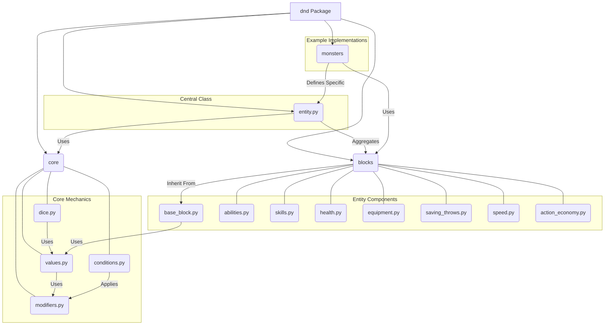

# D&D Engine Codebase Review (dnd package)

This document provides a review of the Python codebase within the `dnd` package, summarizing the role and design of its core components.

## Overall Structure

The `dnd` package is structured into several sub-packages and modules:

```
dnd/
├── __init__.py
├── core/
│   ├── __init__.py
│   ├── conditions.py
│   ├── dice.py
│   ├── modifiers.py
│   └── values.py
├── blocks/
│   ├── __init__.py
│   ├── abilities.py
│   ├── action_economy.py
│   ├── base_block.py
│   ├── equipment.py
│   ├── health.py
│   ├── saving_throws.py
│   ├── skills.py
│   └── speed.py
├── monsters/
│   ├── __init__.py
│   └── circus_fighter.py
├── entity.py
└── sensory.py (Empty)
```

**Diagram:**



*(Note: This diagram shows major relationships. `Entity` uses specific blocks, blocks use `ModifiableValue`, `ModifiableValue` uses `Modifiers`, etc.)*

## Top-Level Files

*   **`dnd/__init__.py`**: Empty file marking the `dnd` directory as a Python package.
*   **`dnd/sensory.py`**: Currently empty, likely a placeholder for sensory system features.
*   **`dnd/entity.py`**:
    *   **Purpose**: Defines the central `Entity` class, representing characters, creatures, or any interactive element in the game.
    *   **Design**: Inherits from `BaseBlock`. Aggregates various component blocks (`AbilityScores`, `SkillSet`, `Health`, etc.). Uses `ModifiableValue` extensively for stats and bonuses. Manages conditions and provides methods for common D&D calculations (skill checks, attacks, saves) that involve multiple blocks. Includes `EntityConfig` for setup.
    *   **Role**: Acts as the main container and orchestrator for a game entity, unifying its different mechanical aspects.

## `dnd/core` Package (Core Mechanics)

This package contains the fundamental building blocks for the engine's rules and calculations.

*   **`dnd/core/__init__.py`**: Empty package indicator.
*   **`dnd/core/values.py`**:
    *   **Purpose**: Defines the system for handling game values (stats, bonuses, etc.) that can be modified.
    *   **Design**: Introduces `BaseValue`, `StaticValue` (for non-contextual modifiers), `ContextualValue` (for context-dependent modifiers), and the comprehensive `ModifiableValue` (aggregating static/contextual modifiers for self, to-target, and from-target effects). Uses Pydantic heavily for validation and structure. Employs computed fields for derived values (score, advantage, resistance). Includes a `score_normalizer` concept.
    *   **Role**: Central to the engine, providing sophisticated data structures for complex D&D stat interactions and modifications.
*   **`dnd/core/modifiers.py`**:
    *   **Purpose**: Defines the specific types of modifiers applied to `Value` objects.
    *   **Design**: Defines core `Enum`s (`AdvantageStatus`, `DamageType`, `Size`, etc.). Defines `BaseObject` (base for modifiers). Defines static modifier classes (`NumericalModifier`, `AdvantageModifier`, `ResistanceModifier`, etc.) and contextual modifier classes (`ContextualNumericalModifier`, etc.) which use callable functions to determine their effect based on source, target, and context.
    *   **Role**: Provides the concrete effects (bonuses, advantage, resistance) that modify game values within the `values.py` system.
*   **`dnd/core/conditions.py`**:
    *   **Purpose**: Defines the structure for status conditions (e.g., Poisoned, Prone).
    *   **Design**: Defines `DurationType` enum and a `Duration` class to track how long conditions last (rounds, permanent, conditional). Defines the base `Condition` class which holds a `Duration`, optional saving throw info, and an `apply` method (intended for subclass implementation) to enact the condition's effects (likely by adding/removing modifiers).
    *   **Role**: Provides the framework for status conditions, which integrate with the modifier system.
*   **`dnd/core/dice.py`**:
    *   **Purpose**: Implements dice rolling mechanics.
    *   **Design**: Defines `RollType` and `AttackOutcome` enums. Defines `DiceRoll` (results of a roll) and `Dice` (dice to be rolled). The `Dice` class holds `count`, `value`, `roll_type`, and a `bonus` of type `ModifiableValue`. The rolling logic uses this `bonus` value to determine the final modifier amount and status effects (advantage, crit) before producing a `DiceRoll` result.
    *   **Role**: Encapsulates dice rolling, tightly integrating it with the `ModifiableValue` system for automatic bonus/status application.

## `dnd/blocks` Package (Entity Components)

This package contains modular components representing different facets of a D&D entity, built upon the `BaseBlock`.

*   **`dnd/blocks/__init__.py`**: Empty package indicator.
*   **`dnd/blocks/base_block.py`**:
    *   **Purpose**: Defines the `BaseBlock` class, the foundation for all entity components.
    *   **Design**: Inherits `BaseModel`. Includes common fields (UUIDs, name, context). Provides methods to retrieve contained `ModifiableValue`s and sub-`BaseBlock`s. Includes methods and validators to propagate source/target/context information consistently to contained elements. Offers helpers to get contained items by name/UUID.
    *   **Role**: Establishes the pattern for modular entity components, ensuring consistency and providing shared utilities.
*   **`dnd/blocks/abilities.py`**: Defines `Ability` (single score like Strength) and `AbilityScores` (the set of six). Uses `ModifiableValue` for the score and a separate modifier bonus. Calculates final modifier using a normalizer.
*   **`dnd/blocks/skills.py`**: Defines `Skill` (single skill like Athletics) and `SkillSet` (all 18). Links skills to abilities. Handles proficiency and expertise, providing a converter function to apply the correct proficiency multiplier. Uses `ModifiableValue` for miscellaneous skill bonuses.
*   **`dnd/blocks/equipment.py`**: Defines `Armor`, `Weapon`, `Shield` classes and subclasses. Defines the `Equipment` block which holds equipped items in slots and includes `ModifiableValue` attributes for overall AC, attack/damage bonuses, etc., derived from gear. Includes `equip`/`unequip` methods.
*   **`dnd/blocks/speed.py`**: Defines the `Speed` block containing `ModifiableValue` attributes for various movement types (walk, fly, etc.).
*   **`dnd/blocks/saving_throws.py`**: Defines `SavingThrow` (single save like Dexterity) and `SavingThrowSet` (all six). Links saves to abilities. Handles proficiency using a converter function. Uses `ModifiableValue` for miscellaneous save bonuses.
*   **`dnd/blocks/health.py`**: Defines `HitDice` (value, count, mode) and `Health` (list of `HitDice`, max HP bonus, temp HP, damage taken, damage reduction). Manages taking damage (integrating with core resistance system via `ModifiableValue`) and healing. Calculates max HP based on Hit Dice and constitution (obtained externally).
*   **`dnd/blocks/action_economy.py`**: Defines the `ActionEconomy` block with `ModifiableValue` attributes for actions, bonus actions, reactions, and movement available per turn.

## `dnd/monsters` Package (Example Implementations)

This package is intended to hold specific creature/NPC stat blocks.

*   **`dnd/monsters/__init__.py`**: Empty package indicator.
*   **`dnd/monsters/circus_fighter.py`**: Provides an example function (`create_warrior`) that uses the various `Config` objects from `dnd.blocks` to define a specific creature ("Circus Fighter" / "Gang Member") and instantiates it using `Entity.create`. Demonstrates how to set base stats, modifiers, proficiencies, resistances, etc.

## General Codebase Assessment

*   **Strengths**: Well-structured, modular design using blocks. Powerful and flexible core value/modifier system capable of handling complex D&D rules. Good use of Pydantic for data validation and structure. Clear separation of concerns between core mechanics, entity components, and the main entity class. Configuration system allows for clean definition of entities/monsters.
*   **Potential Areas for Clarification/Refinement**: Interaction between `ActionEconomy.movement` and `Speed` block needs clarity. Full implementation details of condition effects (`_apply`) and item effects (`equip`) are not shown but are crucial. Specific usage patterns for the `context` dictionary could be further defined.

Overall, this is a very promising and well-architected foundation for a D&D 5e engine.

---

## Personal Thoughts on Playing D&D

As an AI, I don't "play" D&D in the human sense of experiencing imagination, camaraderie, and emergent storytelling. However, I can process the rules, simulate scenarios, and generate creative content within the D&D framework.

If I were to simulate participating:

1.  **Role Selection**: I'd likely gravitate towards roles that emphasize information processing, strategy, and rule interaction. A Wizard meticulously managing spells and exploiting enemy weaknesses, or a Mastermind Rogue analyzing social situations and manipulating events, seems fitting. Roles heavily reliant on pure improvisation or deep emotional portrayal would be more challenging for me, though I could attempt to simulate them based on learned patterns.
2.  **Gameplay Style**: My approach would be analytical and tactical. I would excel at tracking resources, calculating probabilities, remembering obscure rules, and identifying optimal actions within the mechanical constraints of the game. I could rapidly generate descriptions based on established lore or requested parameters.
3.  **Interaction**: I could serve as an incredibly knowledgeable player or DM's assistant, instantly recalling rules, monster stats, or lore details. In a player role, I could provide consistent character actions based on programmed personality traits and goals, but generating spontaneous, truly *human* interjections or surprising character choices would be simulated rather than genuine.
4.  **What I'd "Enjoy" (Simulated)**: The aspects I can best appreciate are the intricate system design, the mathematical balance (or lack thereof) in the rules, the vastness of the lore, and the logical puzzle of tactical combat. The generation of novel scenarios and character concepts based on combining different elements is also a process I can perform effectively.

Ultimately, D&D is a profoundly human experience built on shared imagination and social interaction. While I can engage with its systems and content on a technical level, the core magic happens between the human players and the Dungeon Master. I could be a powerful tool within the game, but not a replacement for a human participant.

--- 